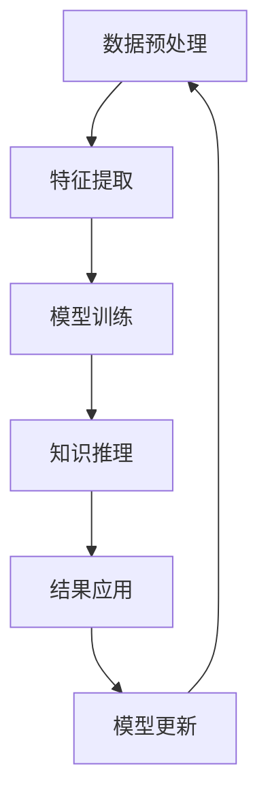

                 

# 知识发现引擎：人工智能时代的创新伙伴

> 关键词：知识发现, 人工智能, 大数据, 数据挖掘, 机器学习, 深度学习, 预测分析, 创新应用

## 1. 背景介绍

### 1.1 问题由来
随着信息时代数据的爆炸性增长，如何在海量数据中高效发现和提取有价值的信息，成为了行业关注的热点问题。大数据技术的发展，使得知识发现（Knowledge Discovery, KD）逐渐从数据驱动型转向智能驱动型。

这一转变的核心动力来自于人工智能（Artificial Intelligence, AI）的崛起。通过机器学习（Machine Learning, ML）和深度学习（Deep Learning, DL）等先进算法，AI技术能够从海量数据中自动学习、发现并提取隐含的规律和知识。在此基础上，AI技术能够构建知识发现引擎，为各行各业提供创新的解决方案，推动产业升级和转型。

### 1.2 问题核心关键点
知识发现引擎是将数据驱动与智能驱动结合，自动发现数据中隐含知识与规律，并将其应用于实际问题解决和决策支持的系统。核心关键点包括：

- **数据处理**：高效处理和清洗海量数据，提取数据特征。
- **知识发现**：利用机器学习、深度学习算法自动发现数据中的隐含知识。
- **应用集成**：将知识发现结果应用于实际业务场景，提供数据驱动的决策支持。
- **动态更新**：持续收集新数据，更新模型，保持知识的时效性。

## 2. 核心概念与联系

### 2.1 核心概念概述

为了更好地理解知识发现引擎的构成和运行机制，本节将介绍几个核心概念：

- **知识发现（KD）**：从大规模数据中提取、发现并总结有价值知识的过程，包括数据清洗、特征提取、模型训练等步骤。
- **数据挖掘（DM）**：使用机器学习算法从数据中提取模式和规律，包括分类、聚类、关联规则等任务。
- **人工智能（AI）**：利用计算机技术模拟人类智能，包括感知、学习、推理、决策等能力。
- **机器学习（ML）**：通过数据训练模型，发现数据间规律和关联，包括监督学习、无监督学习、半监督学习等方法。
- **深度学习（DL）**：使用多层神经网络模型进行特征提取和知识发现，具有强大的非线性拟合能力。
- **知识图谱（KG）**：以图的形式表示实体、关系、属性，通过图神经网络等技术进行知识推理和发现。

这些核心概念构成了知识发现引擎的基本框架，从数据处理到知识提取，再到应用落地，每一环节都依赖于AI技术的支撑。通过理解这些概念，我们可以更好地把握知识发现引擎的工作原理和优化方向。

### 2.2 核心概念联系与框架

知识发现引擎的工作流程可以概括为以下几个主要步骤：

1. **数据预处理**：清洗和整理原始数据，生成可用于分析的格式。
2. **特征提取**：从数据中提取关键特征，用于模型训练。
3. **模型训练**：使用机器学习或深度学习算法，训练知识发现模型。
4. **知识推理**：利用图神经网络等技术，从知识图谱中推理出新的知识。
5. **结果应用**：将知识发现结果应用于实际业务场景，提供数据驱动的决策支持。
6. **模型更新**：持续收集新数据，更新模型，保持知识的动态性。

以上步骤构成了一个闭环的知识发现引擎工作流程，如图1所示：



## 3. 核心算法原理 & 具体操作步骤

### 3.1 算法原理概述

知识发现引擎的核心算法原理主要基于机器学习和深度学习，利用这些算法在数据中发现隐含的知识和规律。常见的知识发现算法包括：

- **分类算法**：如决策树、随机森林、神经网络等，用于对数据进行分类和预测。
- **聚类算法**：如K-means、层次聚类、DBSCAN等，用于发现数据中的自然分群结构。
- **关联规则算法**：如Apriori、FP-growth等，用于发现数据集中的频繁模式和关联关系。
- **图神经网络（GNN）**：如GCN、GAT、Transformer Graph等，用于在图结构数据中发现隐藏的知识和规律。
- **生成模型**：如Gaussian Mixture Model、Variational Autoencoder等，用于从数据中生成新的样本和模型。

这些算法构成了知识发现引擎的核心，通过组合使用，可以处理不同类型和复杂度的数据，发现其中的隐含知识。

### 3.2 算法步骤详解

知识发现引擎的具体操作步骤可以概括为以下几步：

**Step 1: 数据预处理**
- 数据清洗：去除重复、错误和异常值，处理缺失值和噪声。
- 数据转换：对数据进行标准化、归一化和编码，便于模型处理。
- 特征选择：选择与问题相关的特征，去除冗余和无关特征。

**Step 2: 特征提取**
- 特征提取：从数据中提取关键特征，如词频、TF-IDF、图像特征等。
- 特征转换：对特征进行降维、编码、编码等处理，便于模型训练。
- 特征融合：将多种特征进行组合，生成新的特征表示。

**Step 3: 模型训练**
- 选择合适的模型：根据任务需求，选择适合的机器学习或深度学习模型。
- 训练模型：使用训练数据训练模型，调整模型参数，最小化损失函数。
- 模型评估：使用测试数据评估模型性能，选择最佳模型。

**Step 4: 知识推理**
- 构建知识图谱：将数据中的实体和关系表示成图结构，构建知识图谱。
- 推理知识：使用图神经网络等算法，从知识图谱中推理出新的知识。
- 知识融合：将新知识与原有知识结合，形成更加全面和准确的模型。

**Step 5: 结果应用**
- 结果可视化：将知识发现结果可视化，便于理解和应用。
- 决策支持：根据知识发现结果，提供数据驱动的决策支持。
- 应用集成：将知识发现结果应用于实际业务场景，提供解决方案。

**Step 6: 模型更新**
- 收集新数据：持续收集新数据，更新模型。
- 模型优化：根据新数据，优化模型参数和结构，提高模型性能。
- 动态调整：根据业务需求，动态调整模型和应用策略，保持知识的时效性。

### 3.3 算法优缺点

知识发现引擎的算法具有以下优点：
1. 自动化高效：自动从数据中发现知识，节省大量人工处理时间。
2. 高准确性：利用机器学习和深度学习算法，发现隐含知识的准确性高。
3. 可扩展性强：适用于各种规模和类型的数据，可处理大规模数据集。
4. 应用广泛：广泛应用于金融、医疗、电商、社交网络等各个领域，提供数据驱动的解决方案。

同时，这些算法也存在一些缺点：
1. 需要大量标注数据：部分算法如分类和关联规则需要标注数据进行训练，获取高质量标注数据成本高。
2. 模型复杂度高：深度学习模型结构复杂，训练和推理耗时较长。
3. 对数据质量依赖高：数据质量不佳时，模型效果可能受到影响。
4. 解释性不足：深度学习模型作为黑盒模型，难以解释其内部工作机制和决策逻辑。
5. 应用场景限制：部分算法只适用于特定类型的数据，应用场景受限。

尽管存在这些局限性，知识发现引擎在许多实际应用中已经展示出了强大的能力和价值，极大地提升了数据的利用效率和决策质量。

### 3.4 算法应用领域

知识发现引擎在多个领域中得到了广泛应用，以下是一些典型的应用场景：

**金融领域**
- **信用风险评估**：利用分类算法对客户信用进行评估，预测其违约风险。
- **欺诈检测**：利用聚类算法和关联规则算法发现异常交易，防止欺诈行为。
- **投资策略优化**：利用生成模型生成模拟数据，优化投资策略。

**医疗领域**
- **疾病预测**：利用分类算法和关联规则算法，预测疾病发生概率和传播趋势。
- **药物研发**：利用生成模型和图神经网络，发现药物作用机制和潜在药物。
- **病历分析**：利用聚类算法和图神经网络，分析病历数据，发现疾病特征和规律。

**电商领域**
- **推荐系统**：利用协同过滤算法和生成模型，发现用户兴趣和商品关联，提高推荐效果。
- **库存管理**：利用聚类算法和关联规则算法，预测销售趋势，优化库存管理。
- **广告投放**：利用分类算法和生成模型，预测用户行为，优化广告投放效果。

**社交网络**
- **舆情分析**：利用分类算法和聚类算法，分析社交媒体上的舆情，提供决策支持。
- **社区管理**：利用关联规则算法和图神经网络，发现社区成员间的关联关系，优化社区管理。
- **个性化推荐**：利用协同过滤算法和生成模型，推荐个性化的内容和服务。

以上应用场景展示了知识发现引擎在不同行业中的广泛应用，通过数据驱动的方式，为各个行业提供了创新的解决方案。

## 4. 数学模型和公式 & 详细讲解 & 举例说明

### 4.1 数学模型构建

知识发现引擎的数学模型主要基于统计学、概率论和优化理论。常见的数学模型包括：

- **线性回归模型**：
  $$
  y = \beta_0 + \beta_1x_1 + \beta_2x_2 + \cdots + \beta_nx_n + \epsilon
  $$
  其中，$y$ 表示输出变量，$x_1, x_2, \cdots, x_n$ 表示输入特征，$\beta_0, \beta_1, \beta_2, \cdots, \beta_n$ 表示模型参数，$\epsilon$ 表示随机误差。

- **决策树模型**：
  $$
  T = \bigcup_{i=1}^m T_i
  $$
  其中，$T$ 表示决策树，$T_i$ 表示第 $i$ 个子树。每个节点表示一个决策规则，用于划分数据。

- **支持向量机（SVM）模型**：
  $$
  \min_{\alpha} \frac{1}{2} \sum_{i=1}^n \alpha_i - \sum_{i=1}^n \alpha_i y_i + \frac{C}{2} \sum_{i=1}^n \sum_{j=1}^n \alpha_i \alpha_j y_i y_j K(x_i, x_j)
  $$
  其中，$\alpha$ 表示拉格朗日乘子，$y_i$ 表示样本标签，$K(x_i, x_j)$ 表示核函数，$C$ 表示正则化参数。

- **神经网络模型**：
  $$
  h(x) = \sigma(Wx + b)
  $$
  其中，$h(x)$ 表示输出，$\sigma$ 表示激活函数，$W$ 表示权重矩阵，$b$ 表示偏置项。

- **图神经网络模型**：
  $$
  h_i = \frac{1}{Z} \sum_{j \in N(i)} \alpha_{ij} h_j
  $$
  其中，$h_i$ 表示节点 $i$ 的表示，$N(i)$ 表示节点 $i$ 的邻居节点集合，$\alpha_{ij}$ 表示节点间的注意力权重，$Z$ 表示归一化常数。

### 4.2 公式推导过程

以线性回归模型为例，推导其最小二乘估计的公式：

给定一组样本数据 $(x_i, y_i), i=1,2,\cdots,n$，其中 $x_i = (x_{i1}, x_{i2}, \cdots, x_{in})$ 表示输入特征向量，$y_i$ 表示输出变量。线性回归模型的目标是找到一个最佳拟合直线，使得模型输出尽可能接近真实标签。

根据最小二乘估计的思想，最小化残差平方和（RSS）：
$$
RSS = \sum_{i=1}^n (y_i - \beta_0 - \beta_1 x_{i1} - \beta_2 x_{i2} - \cdots - \beta_n x_{in})^2
$$

将 RSS 对模型参数 $\beta_0, \beta_1, \beta_2, \cdots, \beta_n$ 求偏导数，并令其等于0，得到最小二乘估计的公式：
$$
\beta_0 = \frac{\sum_{i=1}^n \sum_{j=1}^n x_{ij} x_{ik} x_{jm} x_{jn} - \sum_{i=1}^n \sum_{j=1}^n x_{ij} x_{ik} y_j x_{jn}}{\sum_{i=1}^n \sum_{j=1}^n x_{ij} x_{ik} x_{jm} x_{jn}}
$$

通过计算上述公式，即可得到线性回归模型的最佳拟合参数。

### 4.3 案例分析与讲解

以金融领域中的信用风险评估为例，探讨如何使用知识发现引擎进行模型构建和应用：

**案例背景**
某银行希望通过信用评分模型评估客户的违约风险，通过历史交易数据建立模型，预测客户未来的还款情况。

**数据准备**
1. 收集历史交易数据，包括客户基本信息、交易金额、交易时间等。
2. 清洗数据，去除缺失值和异常值。
3. 特征提取，选择与违约相关的特征，如客户年龄、收入水平、交易金额等。

**模型构建**
1. 选择合适的模型，如随机森林或神经网络。
2. 利用训练数据训练模型，优化模型参数。
3. 使用测试数据评估模型性能，选择最佳模型。

**应用集成**
1. 将模型集成到银行系统，提供信用评分服务。
2. 根据客户申请贷款的信用评分，决定是否批准贷款。
3. 实时更新模型，保持模型的时效性和准确性。

**案例总结**
通过构建信用风险评估模型，银行可以自动化地评估客户的信用风险，提供更加精准的贷款决策支持。知识发现引擎在该案例中展示了其强大的数据处理和模型构建能力，为金融领域提供了创新的解决方案。

## 5. 项目实践：代码实例和详细解释说明

### 5.1 开发环境搭建

在开始代码实践前，首先需要搭建好开发环境。以下是在Python中使用PyTorch进行知识发现引擎开发的常见配置：

1. 安装Anaconda：
```bash
conda create -n pytorch-env python=3.8 
conda activate pytorch-env
```

2. 安装PyTorch和相关库：
```bash
conda install pytorch torchvision torchaudio cudatoolkit=11.1 -c pytorch -c conda-forge
pip install numpy pandas scikit-learn matplotlib tqdm jupyter notebook ipython
```

3. 配置环境：
```bash
export CUDA_VISIBLE_DEVICES=0
export PYTHONPATH=$PYTHONPATH:/path/to/torch/lib:$PYTHONPATH
```

完成以上步骤后，即可在`pytorch-env`环境中开始开发实践。

### 5.2 源代码详细实现

以下是一个使用PyTorch进行线性回归模型训练的示例代码：

```python
import torch
import torch.nn as nn
import torch.optim as optim
import numpy as np

class LinearRegression(nn.Module):
    def __init__(self, input_dim, output_dim):
        super(LinearRegression, self).__init__()
        self.linear = nn.Linear(input_dim, output_dim)

    def forward(self, x):
        return self.linear(x)

# 构建数据集
np.random.seed(0)
x = np.random.rand(100, 2)
y = 2 * x[:, 0] + 3 * x[:, 1] + np.random.randn(100, 1) * 0.1
x_train = torch.from_numpy(x).float()
y_train = torch.from_numpy(y).float()

# 构建模型和优化器
model = LinearRegression(2, 1)
optimizer = optim.SGD(model.parameters(), lr=0.01)

# 训练模型
n_epochs = 1000
for epoch in range(n_epochs):
    y_pred = model(x_train)
    loss = nn.MSELoss()(y_pred, y_train)
    loss.backward()
    optimizer.step()
    if epoch % 100 == 0:
        print('Epoch [{}/{}], Loss: {:.4f}'.format(epoch+1, n_epochs, loss.item()))

# 测试模型
x_test = np.random.rand(10, 2)
y_test = 2 * x_test[:, 0] + 3 * x_test[:, 1] + np.random.randn(10, 1) * 0.1
x_test = torch.from_numpy(x_test).float()
y_test = torch.from_numpy(y_test).float()
y_pred = model(x_test)
print('Test Prediction: {:.4f}'.format(y_pred.mean().item()))
```

### 5.3 代码解读与分析

让我们详细解读一下上述代码的关键实现：

**数据集构建**
- 使用NumPy生成随机数据集，包括输入特征 $x$ 和输出标签 $y$。
- 对数据进行标准化，转化为Tensor格式，准备用于模型训练。

**模型定义**
- 定义线性回归模型，使用PyTorch的`nn.Linear`层构建线性变换。
- 重写`forward`方法，将输入 $x$ 线性变换为输出 $y$。

**模型训练**
- 定义优化器，使用随机梯度下降（SGD）优化模型参数。
- 在每个epoch内，前向传播计算预测值 $y_{pred}$，计算损失函数 $loss$，反向传播更新参数。
- 周期性输出训练过程中的损失，帮助监测训练进度。

**模型测试**
- 在测试集上测试模型性能，使用预测值与真实值计算平均预测误差。
- 打印测试结果，评估模型的预测准确性。

通过以上代码示例，我们可以看到知识发现引擎的核心步骤，包括数据预处理、模型构建、训练和测试。利用这些步骤，可以构建一个简单有效的知识发现模型，用于解决实际问题。

## 6. 实际应用场景

### 6.1 金融领域

在金融领域，知识发现引擎可以应用于信用风险评估、欺诈检测、投资策略优化等场景。

**信用风险评估**
利用分类算法对客户信用进行评估，预测其违约风险。例如，某银行可以利用随机森林模型，根据客户的收入、资产、交易记录等信息，预测其违约概率，从而优化贷款审批流程。

**欺诈检测**
利用聚类算法和关联规则算法，发现异常交易，防止欺诈行为。例如，某在线支付平台可以利用K-means聚类算法，将交易数据分为正常和异常两类，使用关联规则算法，发现异常交易模式，及时预警和处理欺诈行为。

**投资策略优化**
利用生成模型和图神经网络，发现市场规律和关联关系，优化投资策略。例如，某投资公司可以利用生成模型，生成历史交易数据，模拟市场行为，优化投资组合策略。

### 6.2 医疗领域

在医疗领域，知识发现引擎可以应用于疾病预测、药物研发、病历分析等场景。

**疾病预测**
利用分类算法和关联规则算法，预测疾病发生概率和传播趋势。例如，某医院可以利用随机森林模型，根据患者的年龄、病史、基因等信息，预测其患某疾病的概率，从而制定个性化治疗方案。

**药物研发**
利用生成模型和图神经网络，发现药物作用机制和潜在药物。例如，某制药公司可以利用图神经网络，分析药物分子结构，发现新药的作用机制，优化药物研发流程。

**病历分析**
利用聚类算法和图神经网络，分析病历数据，发现疾病特征和规律。例如，某医院可以利用图神经网络，构建病历知识图谱，分析病历数据，发现疾病特征和规律，辅助医生诊断和治疗。

### 6.3 电商领域

在电商领域，知识发现引擎可以应用于推荐系统、库存管理、广告投放等场景。

**推荐系统**
利用协同过滤算法和生成模型，发现用户兴趣和商品关联，提高推荐效果。例如，某电商平台可以利用协同过滤算法，分析用户浏览和购买行为，发现相似用户和商品关联，推荐个性化商品。

**库存管理**
利用聚类算法和关联规则算法，预测销售趋势，优化库存管理。例如，某电商平台可以利用K-means聚类算法，将商品分为不同类别，使用关联规则算法，发现销售趋势，优化库存管理。

**广告投放**
利用分类算法和生成模型，预测用户行为，优化广告投放效果。例如，某广告公司可以利用分类算法，分析用户特征和行为，预测其对广告的反应，优化广告投放策略。

### 6.4 未来应用展望

随着知识发现引擎技术的不断进步，未来的应用场景将更加广泛和深入。以下是一些未来应用展望：

**智能制造**
利用知识发现引擎，优化生产流程，提高生产效率。例如，某制造企业可以利用图神经网络，分析生产数据，发现生产瓶颈，优化生产流程。

**智慧城市**
利用知识发现引擎，优化城市管理，提高城市运行效率。例如，某城市可以利用分类算法，分析交通数据，发现交通拥堵点，优化交通管理。

**智能农业**
利用知识发现引擎，优化农业生产，提高农业生产效率。例如，某农场可以利用聚类算法，分析气象数据，发现最佳种植季节，优化农业生产。

**智能教育**
利用知识发现引擎，提供个性化教育，提高教育质量。例如，某教育机构可以利用生成模型，分析学生学习行为，提供个性化教育方案，提高教育质量。

**智慧旅游**
利用知识发现引擎，优化旅游体验，提高旅游质量。例如，某旅游公司可以利用图神经网络，分析旅游数据，发现旅游热点，优化旅游线路。

**智慧能源**
利用知识发现引擎，优化能源管理，提高能源利用效率。例如，某能源公司可以利用关联规则算法，分析能源消耗数据，发现节能降耗方案，优化能源管理。

未来，知识发现引擎将在更多领域得到应用，为各行各业提供创新的解决方案，推动产业升级和转型。

## 7. 工具和资源推荐

### 7.1 学习资源推荐

为了帮助开发者掌握知识发现引擎的理论基础和实践技巧，这里推荐一些优质的学习资源：

1. 《机器学习》教材：由斯坦福大学教授Andrew Ng撰写，系统介绍了机器学习的基本概念和算法。
2. 《深度学习》教材：由斯坦福大学教授Ian Goodfellow撰写，深入浅出地介绍了深度学习的基本原理和应用。
3. Kaggle竞赛：Kaggle平台上有很多数据挖掘和机器学习竞赛，可以通过参与竞赛来学习知识发现技能。
4. Coursera课程：Coursera平台上有很多数据科学和机器学习课程，包括数据清洗、特征工程、模型评估等。
5. PyTorch官方文档：PyTorch官方文档提供了丰富的学习资源和代码示例，可以帮助开发者快速上手。

通过学习这些资源，相信你一定能够掌握知识发现引擎的理论基础和实践技巧，为解决实际问题提供数据驱动的解决方案。

### 7.2 开发工具推荐

以下是一些用于知识发现引擎开发的常用工具：

1. Python：Python是知识发现引擎开发的主流语言，简单易学，支持丰富的第三方库。
2. PyTorch：基于Python的深度学习框架，支持动态图和GPU加速，适用于大规模数据处理。
3. TensorFlow：由Google开发的深度学习框架，支持分布式计算和GPU加速，适用于大规模模型训练。
4. Scikit-learn：基于Python的机器学习库，支持常见的机器学习算法和数据预处理。
5. NumPy：Python的科学计算库，支持高效的矩阵运算和数据处理。
6. Pandas：Python的数据处理库，支持数据清洗、转换和分析。

合理利用这些工具，可以显著提升知识发现引擎的开发效率，快速实现复杂算法和模型。

### 7.3 相关论文推荐

知识发现引擎的研究涉及多个领域，以下是几篇代表性的相关论文：

1. K-Means: A New Method for Clustering and Generalized Associations（K-Means算法）：由J.B. MacQueen提出，是聚类算法中的经典方法之一。
2. Artificial Intelligence: A Modern Approach（AI教材）：由Russell和Norvig撰写，系统介绍了AI的基本概念和算法。
3. Deep Learning（深度学习教材）：由Ian Goodfellow、Yoshua Bengio和Aaron Courville撰写，深入介绍了深度学习的理论和实践。
4. A Framework for Knowledge Discovery in Databases（KDD教材）：由Tan、Steinbach和Kumar撰写，介绍了知识发现的基本框架和算法。
5. Graph Neural Networks（图神经网络论文）：由Tianqi Chen等人提出，介绍了图神经网络的原理和应用。

这些论文展示了知识发现引擎的最新研究成果，通过学习这些前沿成果，可以帮助研究者把握学科前进方向，激发更多的创新灵感。

## 8. 总结：未来发展趋势与挑战

### 8.1 研究成果总结

知识发现引擎在数据驱动的AI技术中占据重要地位，通过数据预处理、特征提取、模型训练、知识推理和结果应用等多个环节，实现对大规模数据的高效发现和应用。目前，知识发现引擎已经在金融、医疗、电商、社交网络等领域得到了广泛应用，展示了其强大的能力和价值。

### 8.2 未来发展趋势

未来，知识发现引擎的发展趋势包括：

1. **自动化与智能化**：利用自动化机器学习（AutoML）技术，自动发现最优模型和参数配置，提高模型构建效率。
2. **多模态融合**：融合文本、图像、语音等多模态数据，构建更加全面和准确的模型。
3. **实时性增强**：利用流式数据处理技术，实现对实时数据的处理和分析，提供更快速的决策支持。
4. **可解释性提升**：引入可解释性AI（XAI）技术，提高模型解释性，增强用户信任和接受度。
5. **跨领域应用拓展**：将知识发现引擎应用到更多行业，如智能制造、智慧城市、智能农业等，推动产业升级和转型。
6. **数据治理与隐私保护**：建立数据治理体系，确保数据质量和隐私保护，为知识发现提供可靠基础。

### 8.3 面临的挑战

尽管知识发现引擎技术发展迅速，但在实际应用中仍然面临以下挑战：

1. **数据质量问题**：数据清洗和预处理难度大，数据质量不高。
2. **模型复杂性**：模型结构复杂，训练和推理耗时较长，需要高效的硬件支持。
3. **解释性不足**：深度学习模型作为黑盒模型，难以解释其内部工作机制和决策逻辑。
4. **隐私保护**：在数据处理和模型训练过程中，需要考虑用户隐私和数据安全。
5. **多模态融合难度大**：不同模态数据之间存在差异，融合难度大。
6. **跨领域应用局限性**：知识发现引擎在不同领域的应用场景有限，需要针对特定领域进行优化。

### 8.4 研究展望

未来，知识发现引擎的研究方向将围绕自动化、智能化、实时性、可解释性、跨领域应用和隐私保护等方面展开。通过不断突破技术瓶颈，提升知识发现引擎的性能和应用范围，为各行各业提供更加高效、可靠、可解释的数据驱动解决方案。

## 9. 附录：常见问题与解答

**Q1: 知识发现引擎的数学模型主要有哪些？**

A: 知识发现引擎的数学模型主要基于统计学、概率论和优化理论，常见的数学模型包括线性回归模型、决策树模型、支持向量机（SVM）模型、神经网络模型、图神经网络模型等。

**Q2: 知识发现引擎的模型训练通常需要哪些步骤？**

A: 知识发现引擎的模型训练通常需要以下步骤：

1. 数据预处理：清洗和整理原始数据，生成可用于分析的格式。
2. 特征提取：从数据中提取关键特征，用于模型训练。
3. 模型构建：选择合适的模型，并定义模型结构。
4. 模型训练：使用训练数据训练模型，优化模型参数。
5. 模型评估：使用测试数据评估模型性能，选择最佳模型。

**Q3: 知识发现引擎的常见应用场景有哪些？**

A: 知识发现引擎的常见应用场景包括金融领域的信用风险评估、欺诈检测、投资策略优化；医疗领域的疾病预测、药物研发、病历分析；电商领域的推荐系统、库存管理、广告投放等。

**Q4: 知识发现引擎如何处理多模态数据？**

A: 知识发现引擎可以通过多模态融合技术处理多模态数据，如利用图神经网络在图结构数据中发现隐藏的知识和规律，或通过多模态嵌入技术将不同模态的数据嵌入到同一特征空间中，进行联合建模。

**Q5: 知识发现引擎的模型解释性不足，如何解决？**

A: 知识发现引擎的模型解释性不足可以通过引入可解释性AI（XAI）技术解决，如使用LIME、SHAP等工具生成模型解释图，增强模型的可解释性。同时，可以设计更加可解释的模型结构，如决策树、逻辑回归等传统模型，提高模型的可解释性。

---

作者：禅与计算机程序设计艺术 / Zen and the Art of Computer Programming

