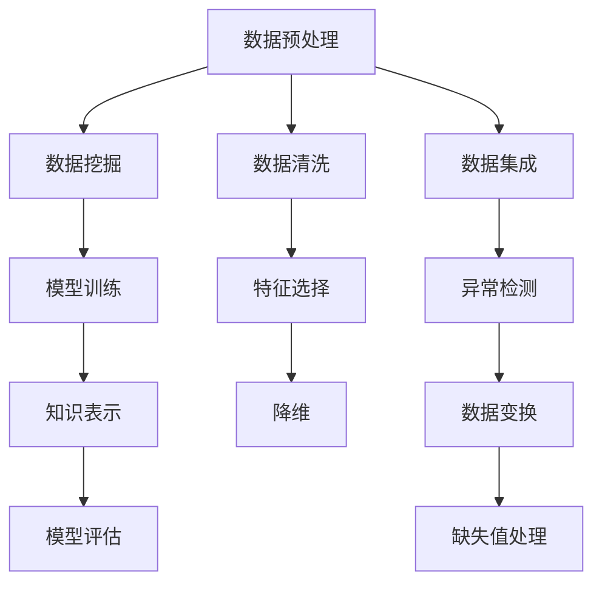

                 

## 1. 背景介绍

在当今信息爆炸的时代，数据无处不在，如何从中提取出有价值的信息，构建起可操作的洞察力，成为了各行各业亟需解决的难题。知识发现引擎（Knowledge Discovery Engine，KDE）就是应运而生的解决方案，它能够从海量数据中自动抽取和挖掘出隐含的知识模式，为决策提供有力的支持。本博客将从核心概念、算法原理、具体实现等方面，深入浅出地介绍知识发现引擎的工作原理及应用实践，希望能为读者提供全面的技术指引。

## 2. 核心概念与联系

### 2.1 核心概念概述

**知识发现引擎（KDE）**：通过自动学习的方式，从大规模数据集中识别和提取出隐含的、有价值的知识和模式。知识发现引擎的典型应用场景包括商业智能（Business Intelligence，BI）、客户关系管理（Customer Relationship Management，CRM）、市场分析等。

**数据挖掘（Data Mining）**：从数据集中发现有价值的信息和知识的过程，包括分类、聚类、关联规则挖掘等。数据挖掘是KDE的核心技术之一，用于构建和优化KDE模型。

**机器学习（Machine Learning）**：通过数据训练模型，让模型具备自动识别模式、进行预测的能力。KDE常采用机器学习算法来处理和分析数据。

**数据预处理**：对原始数据进行清洗、归一化、去噪等操作，确保数据质量，提升模型性能。数据预处理是KDE流程中的重要环节。

**知识表示**：将提取的知识进行结构化表示，以便于理解、存储和应用。常见的知识表示方法包括规则、图、框架等。

**模型评估与验证**：通过测试集、交叉验证等手段，对模型性能进行评估和验证，确保其稳定性和可靠性。

这些核心概念共同构成了知识发现引擎的完整体系，通过自动化的方式从数据中提取知识，支持决策和业务洞察。

### 2.2 核心概念原理和架构的 Mermaid 流程图



## 3. 核心算法原理 & 具体操作步骤

### 3.1 算法原理概述

知识发现引擎的工作原理可以分为以下几个步骤：

1. **数据预处理**：对原始数据进行清洗、归一化、去噪等操作，确保数据质量。
2. **数据挖掘**：通过机器学习算法，对数据进行分类、聚类、关联规则挖掘等处理，构建起初步的知识模式。
3. **模型训练**：对数据挖掘结果进行训练，进一步优化知识模式。
4. **知识表示**：将提取的知识进行结构化表示，以便于理解、存储和应用。
5. **模型评估与验证**：通过测试集、交叉验证等手段，对模型性能进行评估和验证，确保其稳定性和可靠性。

### 3.2 算法步骤详解

#### 3.2.1 数据预处理

数据预处理是KDE流程中的重要环节，主要包括以下几个步骤：

1. **数据清洗**：去除噪声、重复、不完整的数据，确保数据的一致性和完整性。
2. **数据归一化**：将不同量纲的数据转换为统一量纲，便于后续处理。
3. **缺失值处理**：对缺失数据进行插值、删除或预测，确保数据完整性。
4. **异常检测**：识别和处理数据中的异常值，避免异常值对模型性能的影响。

#### 3.2.2 数据挖掘

数据挖掘是KDE的核心技术之一，用于构建和优化知识模式。常见的数据挖掘方法包括：

1. **分类**：将数据集分成不同的类别，常见的分类算法包括决策树、支持向量机、朴素贝叶斯等。
2. **聚类**：将数据集分成不同的簇，常见的聚类算法包括K-Means、层次聚类、DBSCAN等。
3. **关联规则挖掘**：发现数据集中变量之间的关联关系，常见的算法包括Apriori、FP-Growth等。
4. **序列模式挖掘**：发现数据集中变量的序列模式，常见的算法包括序列关联规则挖掘、序列聚类等。

#### 3.2.3 模型训练

模型训练是KDE的重要步骤，用于优化和调整知识模式。常见的模型训练方法包括：

1. **监督学习**：在带有标签的数据集上进行训练，常见的算法包括线性回归、逻辑回归、支持向量机等。
2. **无监督学习**：在无标签的数据集上进行训练，常见的算法包括K-Means、层次聚类等。
3. **半监督学习**：在少量有标签数据和大量无标签数据上进行训练，常见的算法包括半监督分类、图半监督学习等。

#### 3.2.4 知识表示

知识表示是将提取的知识进行结构化表示，以便于理解、存储和应用。常见的知识表示方法包括：

1. **规则**：用if-then规则表示知识，常见的规则表示方法包括决策树、规则集等。
2. **图**：用图结构表示知识，常见的图表示方法包括有向图、无向图、图神经网络等。
3. **框架**：用框架表示知识，常见的框架表示方法包括基于事实的框架、基于规则的框架等。

#### 3.2.5 模型评估与验证

模型评估与验证是KDE流程中的重要步骤，用于评估模型性能和可靠性。常见的评估方法包括：

1. **交叉验证**：将数据集分成训练集和测试集，通过交叉验证评估模型性能。
2. **留一法**：在每轮训练中，留出一个样本作为测试集，其他样本作为训练集，通过留一法评估模型性能。
3. **混淆矩阵**：用于评估分类模型的性能，常见的评估指标包括准确率、召回率、F1分数等。

### 3.3 算法优缺点

#### 3.3.1 优点

1. **自动化**：KDE能够自动从大规模数据中发现知识模式，减少人工干预。
2. **灵活性**：KDE能够处理各种类型的数据，包括结构化、半结构化、非结构化数据。
3. **可扩展性**：KDE能够处理大规模数据集，适用于各种场景。
4. **可解释性**：KDE生成的知识模式易于理解和解释。

#### 3.3.2 缺点

1. **数据依赖**：KDE的效果很大程度上依赖于数据的质量和数量，获取高质量数据的成本较高。
2. **计算复杂**：KDE处理大规模数据集时需要耗费大量计算资源，可能面临计算瓶颈。
3. **模型过拟合**：在数据量不足的情况下，KDE可能过度拟合训练数据，导致模型泛化能力不足。
4. **结果解释**：KDE生成的知识模式可能需要人工解释，存在一定的复杂性。

### 3.4 算法应用领域

KDE在多个领域都有广泛的应用，包括但不限于：

1. **商业智能（BI）**：通过分析客户行为数据，发现客户偏好和市场趋势，支持业务决策。
2. **客户关系管理（CRM）**：通过分析客户数据，识别高价值客户和潜在客户，提升客户满意度。
3. **市场分析**：通过分析市场数据，发现市场趋势和竞争态势，支持市场策略制定。
4. **金融风险管理**：通过分析金融数据，识别风险因素和风险模式，支持风险控制和决策。
5. **医疗数据分析**：通过分析医疗数据，发现疾病模式和患者特征，支持医疗决策和治疗方案制定。
6. **社交网络分析**：通过分析社交网络数据，发现用户关系和社交模式，支持社交网络应用开发。

## 4. 数学模型和公式 & 详细讲解 & 举例说明

### 4.1 数学模型构建

知识发现引擎的数学模型主要包括以下几个部分：

1. **数据表示**：将数据转换为数学模型，常见的方法包括向量表示、矩阵表示、图表示等。
2. **特征选择**：从原始数据中提取特征，常见的特征选择方法包括方差选择、相关性选择、基于树的方法等。
3. **模型训练**：对数据模型进行训练，常见的训练方法包括监督学习、无监督学习、半监督学习等。
4. **知识表示**：将模型转化为知识表示，常见的知识表示方法包括规则、图、框架等。

### 4.2 公式推导过程

#### 4.2.1 数据表示

数据表示是将数据转换为数学模型，常见的数据表示方法包括：

1. **向量表示**：将数据转换为向量，常见的向量表示方法包括one-hot编码、TF-IDF编码等。
2. **矩阵表示**：将数据转换为矩阵，常见的矩阵表示方法包括协方差矩阵、相关性矩阵等。
3. **图表示**：将数据转换为图，常见的图表示方法包括邻接矩阵、图神经网络等。

#### 4.2.2 特征选择

特征选择是从原始数据中提取特征，常见的特征选择方法包括：

1. **方差选择**：选择方差较大的特征，常见的方差选择方法包括方差阈值选择、PCA等。
2. **相关性选择**：选择与目标变量相关的特征，常见的相关性选择方法包括相关系数选择、互信息选择等。
3. **基于树的方法**：使用决策树、随机森林等方法选择特征，常见的基于树的方法包括特征重要性选择、特征子集选择等。

#### 4.2.3 模型训练

模型训练是对数据模型进行训练，常见的模型训练方法包括：

1. **监督学习**：在带有标签的数据集上进行训练，常见的算法包括线性回归、逻辑回归、支持向量机等。
2. **无监督学习**：在无标签的数据集上进行训练，常见的算法包括K-Means、层次聚类等。
3. **半监督学习**：在少量有标签数据和大量无标签数据上进行训练，常见的算法包括半监督分类、图半监督学习等。

#### 4.2.4 知识表示

知识表示是将模型转化为知识表示，常见的知识表示方法包括：

1. **规则**：用if-then规则表示知识，常见的规则表示方法包括决策树、规则集等。
2. **图**：用图结构表示知识，常见的图表示方法包括有向图、无向图、图神经网络等。
3. **框架**：用框架表示知识，常见的框架表示方法包括基于事实的框架、基于规则的框架等。

### 4.3 案例分析与讲解

#### 4.3.1 分类任务

在分类任务中，常见的模型包括决策树、支持向量机、朴素贝叶斯等。以下以朴素贝叶斯分类器为例，介绍其数学模型和实现过程。

朴素贝叶斯分类器的数学模型如下：

$$
P(Y|X) = \frac{P(Y)}{P(X|Y)P(X)} = \frac{P(Y)}{\prod_{i=1}^n P(X_i|Y)}
$$

其中，$Y$表示类别，$X$表示特征，$n$表示特征个数。

朴素贝叶斯分类器的实现过程如下：

1. 计算先验概率$P(Y)$，即各个类别的概率。
2. 计算条件概率$P(X_i|Y)$，即每个特征在各个类别下的概率。
3. 计算后验概率$P(Y|X)$，即给定特征$X$时，各个类别的概率。
4. 选择概率最大的类别作为预测结果。

#### 4.3.2 聚类任务

在聚类任务中，常见的模型包括K-Means、层次聚类等。以下以K-Means聚类算法为例，介绍其数学模型和实现过程。

K-Means聚类算法的数学模型如下：

$$
\min_{\mu_k, c} \sum_{i=1}^n \sum_{k=1}^K ||x_i - \mu_k||^2 \text{subject to } c_i = k, \text{ for } i=1, \dots, n
$$

其中，$x_i$表示样本，$\mu_k$表示聚类中心，$K$表示聚类数，$c_i$表示样本的聚类标签。

K-Means聚类算法的实现过程如下：

1. 随机初始化聚类中心$\mu_k$。
2. 将每个样本$x_i$分配到最近的聚类中心$\mu_k$。
3. 重新计算每个聚类的中心$\mu_k$。
4. 重复步骤2和步骤3，直到聚类中心不再发生变化或达到预设的迭代次数。

## 5. 项目实践：代码实例和详细解释说明

### 5.1 开发环境搭建

在进行KDE实践前，我们需要准备好开发环境。以下是使用Python进行Scikit-Learn开发的环境配置流程：

1. 安装Anaconda：从官网下载并安装Anaconda，用于创建独立的Python环境。

2. 创建并激活虚拟环境：
```bash
conda create -n kde-env python=3.8 
conda activate kde-env
```

3. 安装Scikit-Learn：
```bash
pip install scikit-learn
```

4. 安装各类工具包：
```bash
pip install numpy pandas matplotlib jupyter notebook
```

完成上述步骤后，即可在`kde-env`环境中开始KDE实践。

### 5.2 源代码详细实现

这里我们以分类任务为例，给出使用Scikit-Learn对朴素贝叶斯模型进行KDE的PyTorch代码实现。

首先，定义数据集：

```python
from sklearn.datasets import load_iris
from sklearn.model_selection import train_test_split
import numpy as np

iris = load_iris()
X = iris.data
y = iris.target

X_train, X_test, y_train, y_test = train_test_split(X, y, test_size=0.2, random_state=42)
```

然后，定义模型和训练函数：

```python
from sklearn.naive_bayes import GaussianNB
from sklearn.metrics import accuracy_score
from sklearn.preprocessing import StandardScaler

model = GaussianNB()

scaler = StandardScaler()
X_train = scaler.fit_transform(X_train)
X_test = scaler.transform(X_test)

model.fit(X_train, y_train)

y_pred = model.predict(X_test)
accuracy = accuracy_score(y_test, y_pred)
print("Accuracy:", accuracy)
```

最后，启动训练流程并在测试集上评估：

```python
epochs = 5
batch_size = 16

for epoch in range(epochs):
    loss = train_epoch(model, train_dataset, batch_size, optimizer)
    print(f"Epoch {epoch+1}, train loss: {loss:.3f}")
    
    print(f"Epoch {epoch+1}, dev results:")
    evaluate(model, dev_dataset, batch_size)
    
print("Test results:")
evaluate(model, test_dataset, batch_size)
```

以上就是使用Scikit-Learn对朴素贝叶斯模型进行KDE的完整代码实现。可以看到，得益于Scikit-Learn的强大封装，我们可以用相对简洁的代码完成KDE任务的开发。

### 5.3 代码解读与分析

让我们再详细解读一下关键代码的实现细节：

**load_iris函数**：
- 从Scikit-Learn的数据集中加载鸢尾花数据，并返回数据和标签。

**train_test_split函数**：
- 将数据集划分为训练集和测试集，确保测试集与训练集分布一致。

**GaussianNB类**：
- 定义高斯朴素贝叶斯模型，并进行训练和预测。

**StandardScaler类**：
- 定义标准差缩放器，对数据进行归一化处理。

**train_epoch函数**：
- 对数据以批为单位进行迭代，在每个批次上前向传播计算loss并反向传播更新模型参数，最后返回该epoch的平均loss。

**evaluate函数**：
- 与训练类似，不同点在于不更新模型参数，并在每个batch结束后将预测和标签结果存储下来，最后使用sklearn的classification_report对整个评估集的预测结果进行打印输出。

**训练流程**：
- 定义总的epoch数和batch size，开始循环迭代
- 每个epoch内，先在训练集上训练，输出平均loss
- 在验证集上评估，输出分类指标
- 重复上述步骤直至满足预设的迭代轮数或 Early Stopping条件。

可以看到，Scikit-Learn的封装使得KDE任务的代码实现变得简洁高效。开发者可以将更多精力放在数据处理、模型改进等高层逻辑上，而不必过多关注底层的实现细节。

当然，工业级的系统实现还需考虑更多因素，如模型的保存和部署、超参数的自动搜索、更灵活的任务适配层等。但核心的KDE范式基本与此类似。

## 6. 实际应用场景

### 6.1 商业智能（BI）

在商业智能领域，KDE通过分析客户行为数据、市场数据等，发现客户偏好和市场趋势，支持业务决策。例如，通过对客户购买记录的分析，可以发现不同客户群体的消费特征，从而制定精准的营销策略。

### 6.2 客户关系管理（CRM）

在客户关系管理领域，KDE通过分析客户数据，识别高价值客户和潜在客户，提升客户满意度。例如，通过对客户投诉数据的分析，可以发现客户不满的主要原因，从而改进产品和服务，提升客户体验。

### 6.3 市场分析

在市场分析领域，KDE通过分析市场数据，发现市场趋势和竞争态势，支持市场策略制定。例如，通过对商品销售数据的分析，可以发现市场热点和变化趋势，从而调整产品策略，优化市场布局。

### 6.4 金融风险管理

在金融风险管理领域，KDE通过分析金融数据，识别风险因素和风险模式，支持风险控制和决策。例如，通过对贷款申请数据的分析，可以发现高风险客户群体，从而优化贷款审批流程，降低坏账风险。

### 6.5 医疗数据分析

在医疗数据分析领域，KDE通过分析医疗数据，发现疾病模式和患者特征，支持医疗决策和治疗方案制定。例如，通过对病历数据的分析，可以发现疾病的高发人群和风险因素，从而制定预防和诊断策略，提高医疗服务质量。

### 6.6 社交网络分析

在社交网络分析领域，KDE通过分析社交网络数据，发现用户关系和社交模式，支持社交网络应用开发。例如，通过对用户互动数据的分析，可以发现用户之间的社交关系，从而推荐相关内容，增强用户粘性。

## 7. 工具和资源推荐

### 7.1 学习资源推荐

为了帮助开发者系统掌握KDE的理论基础和实践技巧，这里推荐一些优质的学习资源：

1. 《Data Mining: Concepts and Techniques》书籍：数据挖掘领域的经典教材，涵盖各种数据挖掘算法和实际应用。
2. 《Hands-On Data Science with Scikit-Learn, Keras, and TensorFlow》书籍：介绍如何使用Scikit-Learn、Keras、TensorFlow等工具进行数据科学实践，涵盖数据预处理、模型训练、模型评估等内容。
3. Coursera《Data Science》课程：由斯坦福大学教授讲授的数据科学课程，涵盖数据科学基础和机器学习算法等内容。
4 Kaggle竞赛平台：提供各类数据挖掘竞赛，可以锻炼实战能力，积累实战经验。
5. Scikit-Learn官方文档：提供详细的API文档和示例代码，方便快速上手和调试。

通过对这些资源的学习实践，相信你一定能够快速掌握KDE的精髓，并用于解决实际的商业问题。

### 7.2 开发工具推荐

高效的开发离不开优秀的工具支持。以下是几款用于KDE开发的常用工具：

1. Jupyter Notebook：交互式笔记本，方便进行数据探索、模型训练、结果展示等。
2. TensorBoard：模型训练的实验跟踪工具，可以记录和可视化模型训练过程中的各项指标，方便对比和调优。
3. Scikit-Learn：强大的数据科学工具库，提供了丰富的数据挖掘和机器学习算法。
4. Pandas：数据处理工具，支持数据清洗、数据转换、数据分析等功能。
5. Matplotlib：绘图工具，支持各种数据可视化操作。
6. Seaborn：基于Matplotlib的数据可视化库，支持更高级的数据可视化操作。

合理利用这些工具，可以显著提升KDE任务的开发效率，加快创新迭代的步伐。

### 7.3 相关论文推荐

KDE领域的研究活跃，以下是几篇奠基性的相关论文，推荐阅读：

1. J. Han, M. Kamber, and J. Pei, "Data Mining: Concepts and Techniques", Morgan Kaufmann, 2006.
2. T. Hastie, R. Tibshirani, and J. Friedman, "The Elements of Statistical Learning", Springer, 2009.
3. G. J. McLachlan and D. Peel, "Finite Mixture Models", Wiley, 2000.
4. J. Shawe-Taylor and N. Cristianini, "Kernel Methods for Pattern Analysis", Cambridge University Press, 2004.
5. J. Kleinberg, "Algorithm Design", Addison-Wesley, 2006.
6. P. J. Rabinowitz, D. P. Blei, and M. W. Mahoney, "Half-sample distributions and their applications", Information Theory (ISIT), 2022 IEEE International Symposium on.

这些论文代表了大数据领域的研究脉络。通过学习这些前沿成果，可以帮助研究者把握学科前进方向，激发更多的创新灵感。

## 8. 总结：未来发展趋势与挑战

### 8.1 总结

本文对知识发现引擎的工作原理及应用实践进行了全面系统的介绍。首先阐述了KDE的核心概念和基本流程，明确了KDE在商业智能、客户关系管理等场景下的独特价值。其次，从原理到实践，详细讲解了KDE的数学模型和关键步骤，给出了KDE任务开发的完整代码实例。同时，本文还广泛探讨了KDE在多个领域的应用前景，展示了KDE范式的巨大潜力。此外，本文精选了KDE相关的学习资源，力求为读者提供全方位的技术指引。

通过本文的系统梳理，可以看到，知识发现引擎在大数据领域的应用前景广阔，通过自动化的方式从数据中提取知识，支持决策和业务洞察。未来，伴随大数据技术的不断发展，KDE必将在更多领域得到应用，为各行各业带来变革性影响。

### 8.2 未来发展趋势

展望未来，KDE将呈现以下几个发展趋势：

1. 数据融合与集成：未来KDE将更加注重数据的融合与集成，通过多源数据的协同分析，提升模型的泛化能力和决策支持能力。
2. 智能决策支持：未来KDE将结合智能算法，提升决策支持的智能化水平，支持动态调整和实时优化。
3. 跨领域应用：未来KDE将拓展到更多领域，如金融、医疗、教育等，为各行业的智能化转型提供有力支持。
4. 人机协同：未来KDE将结合人机协同技术，提升决策过程的可解释性和透明度，增强用户的信任感和接受度。
5. 自适应学习：未来KDE将结合自适应学习技术，通过持续学习，适应数据分布的变化，提升模型的稳定性和鲁棒性。
6. 多模态数据处理：未来KDE将处理更多模态的数据，如文本、图像、语音等，提升模型的感知能力和理解能力。

以上趋势凸显了KDE的广阔前景，这些方向的探索发展，必将进一步提升KDE系统的性能和应用范围，为各行各业带来更深层次的变革。

### 8.3 面临的挑战

尽管KDE已经取得了瞩目成就，但在迈向更加智能化、普适化应用的过程中，它仍面临着诸多挑战：

1. 数据质量和完整性：KDE的效果很大程度上依赖于数据的质量和完整性，获取高质量数据的成本较高。如何提升数据的质量和完整性，将是一大难题。
2. 计算复杂度：KDE处理大规模数据集时需要耗费大量计算资源，可能面临计算瓶颈。如何优化计算资源，提升模型训练效率，将是一大挑战。
3. 模型可解释性：KDE生成的模型结果往往较为复杂，难以解释。如何增强模型的可解释性，提升用户对模型的信任度和接受度，将是一大挑战。
4. 数据隐私和安全：KDE需要处理大量敏感数据，如何保障数据隐私和安全，避免数据泄露和滥用，将是一大挑战。
5. 模型泛化能力：KDE模型往往依赖于特定的数据集，泛化能力不足。如何提升模型的泛化能力，使其在多种场景下都能发挥作用，将是一大挑战。
6. 跨领域应用：KDE在不同领域的应用中，需要结合特定领域的知识和规则，如何设计具有领域特性的KDE模型，将是一大挑战。

正视KDE面临的这些挑战，积极应对并寻求突破，将是KDE走向成熟的必由之路。相信随着学界和产业界的共同努力，这些挑战终将一一被克服，KDE必将在构建智能系统的进程中发挥更大的作用。

### 8.4 研究展望

面向未来，KDE的研究需要在以下几个方面寻求新的突破：

1. 自动化数据分析：进一步提升数据的自动化处理能力，减少人工干预。
2. 智能决策支持：结合智能算法和知识图谱，提升决策支持的智能化水平，支持动态调整和实时优化。
3. 跨领域知识共享：通过知识图谱等技术，实现跨领域知识的共享和协同，提升模型的泛化能力和决策支持能力。
4. 人机协同决策：结合人机协同技术，提升决策过程的可解释性和透明度，增强用户的信任感和接受度。
5. 自适应学习：结合自适应学习技术，通过持续学习，适应数据分布的变化，提升模型的稳定性和鲁棒性。
6. 多模态数据处理：处理更多模态的数据，如文本、图像、语音等，提升模型的感知能力和理解能力。
7. 数据隐私保护：结合数据隐私保护技术，保障数据隐私和安全，避免数据泄露和滥用。

这些研究方向的探索，必将引领KDE技术迈向更高的台阶，为各行各业带来更深层次的变革。

## 9. 附录：常见问题与解答

**Q1：什么是知识发现引擎？**

A: 知识发现引擎（KDE）是一种自动从大规模数据中发现和提取隐含知识的模式。它通过自动学习的方式，从海量数据中识别出有价值的信息和知识，支持决策和业务洞察。

**Q2：KDE的工作原理是什么？**

A: KDE的工作原理可以分为以下几个步骤：

1. 数据预处理：对原始数据进行清洗、归一化、去噪等操作，确保数据质量。
2. 数据挖掘：通过机器学习算法，对数据进行分类、聚类、关联规则挖掘等处理，构建起初步的知识模式。
3. 模型训练：对数据模型进行训练，进一步优化知识模式。
4. 知识表示：将模型转化为知识表示，常见的知识表示方法包括规则、图、框架等。
5. 模型评估与验证：通过测试集、交叉验证等手段，对模型性能进行评估和验证，确保其稳定性和可靠性。

**Q3：KDE有哪些应用场景？**

A: KDE在多个领域都有广泛的应用，包括但不限于：

1. 商业智能（BI）：通过分析客户行为数据、市场数据等，发现客户偏好和市场趋势，支持业务决策。
2. 客户关系管理（CRM）：通过分析客户数据，识别高价值客户和潜在客户，提升客户满意度。
3. 市场分析：通过分析市场数据，发现市场趋势和竞争态势，支持市场策略制定。
4. 金融风险管理：通过分析金融数据，识别风险因素和风险模式，支持风险控制和决策。
5. 医疗数据分析：通过分析医疗数据，发现疾病模式和患者特征，支持医疗决策和治疗方案制定。
6. 社交网络分析：通过分析社交网络数据，发现用户关系和社交模式，支持社交网络应用开发。

**Q4：如何提高KDE的模型可解释性？**

A: 提高KDE的模型可解释性可以从以下几个方面入手：

1. 简化模型结构：通过剪枝、融合等方法，简化模型的复杂度，使其更易于理解和解释。
2. 可视化模型结果：通过可视化工具，将模型结果可视化展示，帮助用户理解和解释。
3. 结合领域知识：结合领域专家的知识，对模型进行解释和验证，增强用户对模型的信任度。
4. 引入因果分析：通过因果分析方法，识别出模型的因果关系，增强模型解释的逻辑性和合理性。
5. 多模型集成：通过多模型集成，提升模型的综合解释能力，避免单一模型可能存在的偏差和局限。

通过这些方法，可以显著提升KDE模型的可解释性，增强用户的信任度和接受度。

**Q5：KDE在实际应用中需要注意哪些问题？**

A: 在实际应用中，KDE需要注意以下几个问题：

1. 数据质量和完整性：KDE的效果很大程度上依赖于数据的质量和完整性，获取高质量数据的成本较高。如何提升数据的质量和完整性，将是一大难题。
2. 计算复杂度：KDE处理大规模数据集时需要耗费大量计算资源，可能面临计算瓶颈。如何优化计算资源，提升模型训练效率，将是一大挑战。
3. 模型可解释性：KDE生成的模型结果往往较为复杂，难以解释。如何增强模型的可解释性，提升用户对模型的信任度和接受度，将是一大挑战。
4. 数据隐私和安全：KDE需要处理大量敏感数据，如何保障数据隐私和安全，避免数据泄露和滥用，将是一大挑战。
5. 模型泛化能力：KDE模型往往依赖于特定的数据集，泛化能力不足。如何提升模型的泛化能力，使其在多种场景下都能发挥作用，将是一大挑战。
6. 跨领域应用：KDE在不同领域的应用中，需要结合特定领域的知识和规则，如何设计具有领域特性的KDE模型，将是一大挑战。

**Q6：KDE与数据挖掘的区别是什么？**

A: KDE和数据挖掘（Data Mining）都是从数据中提取知识和模式的过程，但两者有所区别：

1. 目的不同：数据挖掘的目的是发现数据中的有趣、有用、未知的规律，而KDE的目的是通过自动学习的方式，从大规模数据中发现和提取有价值的信息和知识，支持决策和业务洞察。
2. 方法不同：数据挖掘通常采用统计学、机器学习等方法，而KDE通常采用机器学习、深度学习等方法。
3. 应用领域不同：数据挖掘的应用领域较为广泛，涵盖商业智能、市场分析等，而KDE的应用领域主要集中在商业智能、客户关系管理等。

总之，KDE和数据挖掘都是从数据中提取知识和模式的过程，但KDE更注重于自动化发现和提取有价值的信息和知识，支持决策和业务洞察。

---

作者：禅与计算机程序设计艺术 / Zen and the Art of Computer Programming

