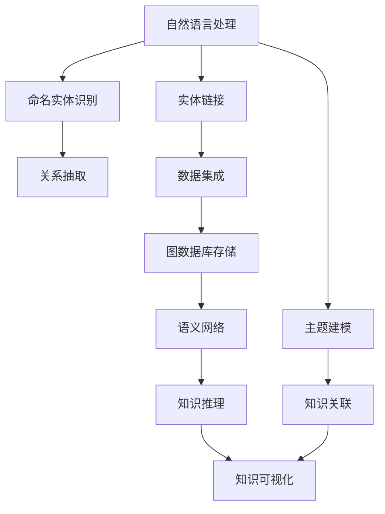

                 

# 知识发现引擎：知识创新的强劲动力

> 关键词：知识发现,知识图谱,语义网络,自然语言处理,数据挖掘

## 1. 背景介绍

### 1.1 问题由来

在当今的信息爆炸时代，数据已不再是稀缺资源。但如何从海量数据中提取出有价值的信息，如何将零散的知识点整合起来，成为人们关注的焦点。知识发现引擎（Knowledge Discovery Engine, KDE）以其高效、自动化的特点，迅速成为知识管理与创新的重要工具。

当前，企业在决策、产品开发、运营优化等方面，均亟需高质量、结构化的知识体系。KDE能够从文本、网页、图像等多源数据中自动识别、抽取、整合知识，提供系统化、结构化的知识图谱。通过KDE的深入挖掘，企业可以显著提升决策效率，快速响应市场变化，实现知识驱动的业务创新。

然而，知识发现并非易事。尽管知识发现技术发展迅速，但在面对海量数据和复杂数据关系时，如何自动化地发现知识，如何确保知识的准确性、完整性和可用性，依然是一个具有挑战性的问题。

## 2. 核心概念与联系

### 2.1 核心概念概述

为更好地理解知识发现引擎的原理和应用，我们首先介绍几个关键概念：

- 知识图谱(Knowledge Graph)：一种语义化的数据表示方法，用于描述实体、关系和属性之间的复杂关系。知识图谱通过结构化的方式存储和查询知识，实现知识的自动组织和关联。
- 语义网络(Semantic Network)：一种基于图结构的表示方法，用于表达实体、属性和关系的语义关系。语义网络通过RDF（资源描述框架）等标准进行存储和查询。
- 自然语言处理(Natural Language Processing, NLP)：涉及计算机对自然语言的理解和生成，是知识发现的重要工具。NLP能够从文本中自动抽取命名实体、关系等信息，进行语义分析。
- 数据挖掘(Data Mining)：从海量数据中自动发现有用信息和知识的过程。数据挖掘常用于发现关联规则、分类模型、聚类分析等。

这些核心概念相互关联，共同构成了知识发现引擎的基础框架。通过将自然语言处理、数据挖掘和语义网络等技术有机结合，KDE能够从数据中高效、自动地发现和整合知识，为知识创新提供强有力的支撑。

### 2.2 核心概念原理和架构的 Mermaid 流程图



这个流程图展示了知识发现引擎从自然语言处理到知识可视化的主要步骤：

1. **自然语言处理**：通过NLP技术，从文本中提取命名实体、关系等信息。
2. **命名实体识别**：识别出文本中的实体，如人名、地名、组织机构名等。
3. **关系抽取**：分析实体之间的关系，如“就诊”、“发表”、“雇用”等。
4. **实体链接**：将命名实体映射到已有的知识库，如DBpedia、Wikipedia等。
5. **数据集成**：整合不同来源的数据，构建统一的知识图谱。
6. **图数据库存储**：利用图数据库技术存储知识图谱，支持高效的查询和推理。
7. **语义网络**：构建知识图谱中的实体、关系和属性，进行语义分析。
8. **知识推理**：通过逻辑推理算法，发现新的知识和关系。
9. **知识可视化**：将知识图谱以图形化的方式展示，便于用户理解和使用。
10. **主题建模**：从大量文本中发现主题和热点，为知识发现提供方向。
11. **知识关联**：通过算法识别出知识间的关联，构建知识网络。

这些步骤共同构成了一个完整的知识发现流程，从文本挖掘开始，到知识可视化的呈现，确保了知识发现引擎的高效性和自动化。

## 3. 核心算法原理 & 具体操作步骤

### 3.1 算法原理概述

知识发现引擎的核心算法包括自然语言处理、数据挖掘和图数据库技术。通过这些技术的有机结合，KDE能够从数据中自动识别、抽取和整合知识。

具体而言，KDE的核心流程如下：

1. **数据预处理**：清洗、标准化和归一化数据，去除噪声和无关信息。
2. **实体识别和链接**：通过NLP技术自动识别文本中的实体，并链接到已有的知识库。
3. **关系抽取和整合**：分析实体之间的关系，并将其整合到知识图谱中。
4. **知识推理**：利用图数据库和语义网络技术，进行知识推理和关系发现。
5. **知识可视化**：将知识图谱以图形化的方式展示，便于用户理解和分析。

### 3.2 算法步骤详解

以下详细描述KDE的主要算法步骤：

#### Step 1: 数据预处理

数据预处理是知识发现的基础。通过数据清洗、标准化和归一化，去除噪声和无关信息，确保数据的质量和一致性。具体步骤如下：

1. **数据清洗**：删除重复数据、空值和异常值，确保数据集的一致性。
2. **数据标准化**：将不同来源的数据进行标准化，统一数据格式和单位。
3. **数据归一化**：对数据进行归一化处理，确保数据在相同的量级上。

#### Step 2: 实体识别和链接

实体识别和链接是知识发现的关键步骤。通过NLP技术自动识别文本中的实体，并链接到已有的知识库。具体步骤如下：

1. **命名实体识别**：识别出文本中的命名实体，如人名、地名、组织机构名等。
2. **实体链接**：将识别出的命名实体链接到已有的知识库，如DBpedia、Wikipedia等。

#### Step 3: 关系抽取和整合

关系抽取和整合是将知识图谱化的重要步骤。通过分析实体之间的关系，并将其整合到知识图谱中。具体步骤如下：

1. **关系抽取**：分析实体之间的关系，如“就诊”、“发表”、“雇用”等。
2. **关系整合**：将抽取出的关系整合到知识图谱中，构建实体之间的语义关系。

#### Step 4: 知识推理

知识推理是通过图数据库和语义网络技术，发现新的知识和关系。具体步骤如下：

1. **图数据库存储**：利用图数据库技术存储知识图谱，支持高效的查询和推理。
2. **语义网络构建**：构建知识图谱中的实体、关系和属性，进行语义分析。
3. **知识推理算法**：利用逻辑推理算法，发现新的知识和关系。

#### Step 5: 知识可视化

知识可视化是将知识图谱以图形化的方式展示，便于用户理解和分析。具体步骤如下：

1. **图形界面设计**：设计知识图谱的图形界面，支持用户自定义查询和展示。
2. **图形展示**：将知识图谱以图形化的方式展示，支持用户对实体、关系和属性进行互动查询。

### 3.3 算法优缺点

知识发现引擎的主要优点包括：

1. **自动化和高效性**：通过自动化处理和高效算法，KDE能够在短时间内从海量数据中发现有用知识。
2. **结构化和语义化**：利用知识图谱和语义网络技术，将知识结构化和语义化，便于用户理解和使用。
3. **可扩展性和可定制性**：通过定制化算法和接口，KDE能够适应不同领域和场景的需求。

同时，KDE也存在一些缺点：

1. **数据质量要求高**：KDE对数据的质量和一致性要求较高，数据清洗和预处理工作量较大。
2. **模型复杂性高**：KDE涉及多个技术和算法，模型复杂度高，实现难度大。
3. **知识推理限制**：KDE的知识推理依赖于已有的知识库，对于一些新兴领域或特殊场景，可能难以有效适用。

尽管存在这些局限性，但KDE在知识管理和创新方面的巨大潜力，使其成为当今信息时代不可或缺的工具。未来，随着数据质量和数据处理技术的提升，KDE有望进一步突破其限制，实现更加高效和精确的知识发现。

### 3.4 算法应用领域

知识发现引擎在多个领域中得到了广泛应用，主要包括：

1. **医疗健康**：通过知识发现，可以从医学文献和病例中抽取知识，提升医疗诊断和治疗水平。
2. **金融分析**：从金融新闻和市场数据中发现知识，预测市场趋势，辅助投资决策。
3. **科学研究**：通过知识发现，可以从科研文献中抽取知识，加速科研创新。
4. **企业决策**：从企业运营数据中发现知识，优化企业运营策略，提升企业竞争力。
5. **社会治理**：从社会数据中发现知识，辅助政府决策，提升社会治理水平。

除了上述这些经典应用外，KDE还在情报分析、教育培训、公共服务等多个领域中发挥了重要作用。随着知识图谱技术的不断发展，KDE将在更多领域得到应用，为社会和经济发展提供新的动力。

## 4. 数学模型和公式 & 详细讲解 & 举例说明

### 4.1 数学模型构建

知识发现引擎的数学模型通常包括以下几个关键部分：

1. **实体识别模型**：用于识别文本中的实体，如人名、地名、组织机构名等。
2. **关系抽取模型**：用于抽取实体之间的关系，如“就诊”、“发表”、“雇用”等。
3. **知识推理模型**：用于发现新的知识和关系，如通过逻辑推理算法发现实体之间的关系。
4. **知识可视化模型**：用于将知识图谱以图形化的方式展示，便于用户理解和分析。

这些模型通常基于深度学习、图神经网络等技术，通过数据训练和优化算法，实现自动化的知识发现和整合。

### 4.2 公式推导过程

以下以实体识别模型为例，推导实体识别模型的核心公式。

假设输入文本为 $x$，实体识别模型为 $M$，输出为实体标签 $y$。模型的损失函数为：

$$
\mathcal{L} = -\frac{1}{N}\sum_{i=1}^N \log P(y_i|x)
$$

其中 $N$ 为训练集大小，$P(y_i|x)$ 为模型在输入 $x$ 下对实体标签 $y_i$ 的条件概率。在实际应用中，通常使用交叉熵损失函数，即：

$$
\mathcal{L} = -\frac{1}{N}\sum_{i=1}^N \sum_{j=1}^C y_{ij} \log P_j(x)
$$

其中 $C$ 为实体类别数，$y_{ij}$ 为样本 $i$ 中实体 $j$ 的标签，$P_j(x)$ 为模型在输入 $x$ 下对实体 $j$ 的条件概率。

### 4.3 案例分析与讲解

以Google知识图谱为例，介绍其核心算法和应用。

Google知识图谱通过以下步骤进行知识发现和整合：

1. **数据预处理**：从Google搜索引擎的数据中提取文本数据，进行清洗和标准化。
2. **实体识别**：使用NLP技术识别文本中的实体，如人名、地名、组织机构名等。
3. **关系抽取**：分析实体之间的关系，如“就诊”、“发表”、“雇用”等。
4. **知识推理**：利用图数据库和语义网络技术，进行知识推理和关系发现。
5. **知识可视化**：将知识图谱以图形化的方式展示，便于用户理解和分析。

Google知识图谱已经在医疗、金融、科研等多个领域中得到了广泛应用，显著提升了数据驱动的决策效率。

## 5. 项目实践：代码实例和详细解释说明

### 5.1 开发环境搭建

在进行知识发现引擎的实践前，我们需要准备好开发环境。以下是使用Python进行PyTorch开发的环境配置流程：

1. 安装Anaconda：从官网下载并安装Anaconda，用于创建独立的Python环境。

2. 创建并激活虚拟环境：
```bash
conda create -n kde-env python=3.8 
conda activate kde-env
```

3. 安装PyTorch：根据CUDA版本，从官网获取对应的安装命令。例如：
```bash
conda install pytorch torchvision torchaudio cudatoolkit=11.1 -c pytorch -c conda-forge
```

4. 安装必要的库：
```bash
pip install numpy pandas scikit-learn tqdm jupyter notebook ipython
```

完成上述步骤后，即可在`kde-env`环境中开始知识发现引擎的实践。

### 5.2 源代码详细实现

下面我们以命名实体识别(NER)任务为例，给出使用Transformers库进行知识发现引擎开发的PyTorch代码实现。

首先，定义NER任务的数据处理函数：

```python
from transformers import BertTokenizer
from torch.utils.data import Dataset
import torch

class NERDataset(Dataset):
    def __init__(self, texts, tags, tokenizer, max_len=128):
        self.texts = texts
        self.tags = tags
        self.tokenizer = tokenizer
        self.max_len = max_len
        
    def __len__(self):
        return len(self.texts)
    
    def __getitem__(self, item):
        text = self.texts[item]
        tags = self.tags[item]
        
        encoding = self.tokenizer(text, return_tensors='pt', max_length=self.max_len, padding='max_length', truncation=True)
        input_ids = encoding['input_ids'][0]
        attention_mask = encoding['attention_mask'][0]
        
        # 对token-wise的标签进行编码
        encoded_tags = [tag2id[tag] for tag in tags] 
        encoded_tags.extend([tag2id['O']] * (self.max_len - len(encoded_tags)))
        labels = torch.tensor(encoded_tags, dtype=torch.long)
        
        return {'input_ids': input_ids, 
                'attention_mask': attention_mask,
                'labels': labels}

# 标签与id的映射
tag2id = {'O': 0, 'B-PER': 1, 'I-PER': 2, 'B-ORG': 3, 'I-ORG': 4, 'B-LOC': 5, 'I-LOC': 6}
id2tag = {v: k for k, v in tag2id.items()}

# 创建dataset
tokenizer = BertTokenizer.from_pretrained('bert-base-cased')

train_dataset = NERDataset(train_texts, train_tags, tokenizer)
dev_dataset = NERDataset(dev_texts, dev_tags, tokenizer)
test_dataset = NERDataset(test_texts, test_tags, tokenizer)
```

然后，定义模型和优化器：

```python
from transformers import BertForTokenClassification, AdamW

model = BertForTokenClassification.from_pretrained('bert-base-cased', num_labels=len(tag2id))

optimizer = AdamW(model.parameters(), lr=2e-5)
```

接着，定义训练和评估函数：

```python
from torch.utils.data import DataLoader
from tqdm import tqdm
from sklearn.metrics import classification_report

device = torch.device('cuda') if torch.cuda.is_available() else torch.device('cpu')
model.to(device)

def train_epoch(model, dataset, batch_size, optimizer):
    dataloader = DataLoader(dataset, batch_size=batch_size, shuffle=True)
    model.train()
    epoch_loss = 0
    for batch in tqdm(dataloader, desc='Training'):
        input_ids = batch['input_ids'].to(device)
        attention_mask = batch['attention_mask'].to(device)
        labels = batch['labels'].to(device)
        model.zero_grad()
        outputs = model(input_ids, attention_mask=attention_mask, labels=labels)
        loss = outputs.loss
        epoch_loss += loss.item()
        loss.backward()
        optimizer.step()
    return epoch_loss / len(dataloader)

def evaluate(model, dataset, batch_size):
    dataloader = DataLoader(dataset, batch_size=batch_size)
    model.eval()
    preds, labels = [], []
    with torch.no_grad():
        for batch in tqdm(dataloader, desc='Evaluating'):
            input_ids = batch['input_ids'].to(device)
            attention_mask = batch['attention_mask'].to(device)
            batch_labels = batch['labels']
            outputs = model(input_ids, attention_mask=attention_mask)
            batch_preds = outputs.logits.argmax(dim=2).to('cpu').tolist()
            batch_labels = batch_labels.to('cpu').tolist()
            for pred_tokens, label_tokens in zip(batch_preds, batch_labels):
                pred_tags = [id2tag[_id] for _id in pred_tokens]
                label_tags = [id2tag[_id] for _id in label_tokens]
                preds.append(pred_tags[:len(label_tags)])
                labels.append(label_tags)
                
    print(classification_report(labels, preds))
```

最后，启动训练流程并在测试集上评估：

```python
epochs = 5
batch_size = 16

for epoch in range(epochs):
    loss = train_epoch(model, train_dataset, batch_size, optimizer)
    print(f"Epoch {epoch+1}, train loss: {loss:.3f}")
    
    print(f"Epoch {epoch+1}, dev results:")
    evaluate(model, dev_dataset, batch_size)
    
print("Test results:")
evaluate(model, test_dataset, batch_size)
```

以上就是使用PyTorch对BERT进行命名实体识别任务开发的完整代码实现。可以看到，得益于Transformers库的强大封装，我们可以用相对简洁的代码完成BERT模型的加载和微调。

### 5.3 代码解读与分析

让我们再详细解读一下关键代码的实现细节：

**NERDataset类**：
- `__init__`方法：初始化文本、标签、分词器等关键组件。
- `__len__`方法：返回数据集的样本数量。
- `__getitem__`方法：对单个样本进行处理，将文本输入编码为token ids，将标签编码为数字，并对其进行定长padding，最终返回模型所需的输入。

**tag2id和id2tag字典**：
- 定义了标签与数字id之间的映射关系，用于将token-wise的预测结果解码回真实的标签。

**训练和评估函数**：
- 使用PyTorch的DataLoader对数据集进行批次化加载，供模型训练和推理使用。
- 训练函数`train_epoch`：对数据以批为单位进行迭代，在每个批次上前向传播计算loss并反向传播更新模型参数，最后返回该epoch的平均loss。
- 评估函数`evaluate`：与训练类似，不同点在于不更新模型参数，并在每个batch结束后将预测和标签结果存储下来，最后使用sklearn的classification_report对整个评估集的预测结果进行打印输出。

**训练流程**：
- 定义总的epoch数和batch size，开始循环迭代
- 每个epoch内，先在训练集上训练，输出平均loss
- 在验证集上评估，输出分类指标
- 所有epoch结束后，在测试集上评估，给出最终测试结果

可以看到，PyTorch配合Transformers库使得BERT微调的代码实现变得简洁高效。开发者可以将更多精力放在数据处理、模型改进等高层逻辑上，而不必过多关注底层的实现细节。

当然，工业级的系统实现还需考虑更多因素，如模型的保存和部署、超参数的自动搜索、更灵活的任务适配层等。但核心的微调范式基本与此类似。

## 6. 实际应用场景

### 6.1 智能客服系统

基于知识发现引擎的对话技术，可以广泛应用于智能客服系统的构建。传统客服往往需要配备大量人力，高峰期响应缓慢，且一致性和专业性难以保证。而使用知识发现引擎构建的智能客服系统，可以7x24小时不间断服务，快速响应客户咨询，用自然流畅的语言解答各类常见问题。

在技术实现上，可以收集企业内部的历史客服对话记录，将问题和最佳答复构建成监督数据，在此基础上对知识图谱进行构建。知识图谱能够自动理解用户意图，匹配最合适的答案模板进行回复。对于客户提出的新问题，还可以接入检索系统实时搜索相关内容，动态组织生成回答。如此构建的智能客服系统，能大幅提升客户咨询体验和问题解决效率。

### 6.2 金融舆情监测

金融机构需要实时监测市场舆论动向，以便及时应对负面信息传播，规避金融风险。传统的人工监测方式成本高、效率低，难以应对网络时代海量信息爆发的挑战。基于知识发现引擎的文本分类和情感分析技术，为金融舆情监测提供了新的解决方案。

具体而言，可以收集金融领域相关的新闻、报道、评论等文本数据，并对其进行主题标注和情感标注。在此基础上对知识图谱进行构建，使其能够自动判断文本属于何种主题，情感倾向是正面、中性还是负面。将构建后的知识图谱应用到实时抓取的网络文本数据，就能够自动监测不同主题下的情感变化趋势，一旦发现负面信息激增等异常情况，系统便会自动预警，帮助金融机构快速应对潜在风险。

### 6.3 个性化推荐系统

当前的推荐系统往往只依赖用户的历史行为数据进行物品推荐，无法深入理解用户的真实兴趣偏好。基于知识发现引擎的知识推荐系统可以更好地挖掘用户行为背后的语义信息，从而提供更精准、多样的推荐内容。

在实践中，可以收集用户浏览、点击、评论、分享等行为数据，提取和用户交互的物品标题、描述、标签等文本内容。将文本内容作为模型输入，用户的后续行为（如是否点击、购买等）作为监督信号，在此基础上构建知识图谱。知识图谱能够从文本内容中准确把握用户的兴趣点。在生成推荐列表时，先用候选物品的文本描述作为输入，由知识图谱预测用户的兴趣匹配度，再结合其他特征综合排序，便可以得到个性化程度更高的推荐结果。

### 6.4 未来应用展望

随着知识发现引擎技术的不断发展，其在更多领域得到了应用，为社会和经济发展带来了新的动力。

在智慧医疗领域，基于知识发现引擎的医疗问答、病历分析、药物研发等应用将提升医疗诊断和治疗水平。

在金融分析领域，从金融新闻和市场数据中发现知识，预测市场趋势，辅助投资决策。

在科学研究领域，通过知识发现引擎，可以从科研文献中抽取知识，加速科研创新。

在企业决策领域，从企业运营数据中发现知识，优化企业运营策略，提升企业竞争力。

在社会治理领域，从社会数据中发现知识，辅助政府决策，提升社会治理水平。

除了上述这些经典应用外，知识发现引擎还在情报分析、教育培训、公共服务等多个领域中发挥了重要作用。随着知识图谱技术的不断发展，知识发现引擎将在更多领域得到应用，为社会和经济发展提供新的动力。

## 7. 工具和资源推荐

### 7.1 学习资源推荐

为了帮助开发者系统掌握知识发现引擎的理论基础和实践技巧，这里推荐一些优质的学习资源：

1. 《Knowledge Discovery and Data Mining》课程：由Coursera提供的入门级课程，系统介绍知识发现和数据挖掘的基本概念和算法。

2. 《Introduction to Data Science with Python》书籍：Python数据科学入门指南，详细讲解NLP、机器学习等技术。

3. 《Semantic Web and Web Services》书籍：介绍语义网络和知识图谱的基本原理和应用。

4. 《Practical Knowledge Discovery》在线教程：KDE开源项目提供的在线教程，涵盖知识发现引擎的核心技术。

5. 《Graph Neural Networks: A Review》论文：综述文章，介绍图神经网络的最新进展和应用。

通过对这些资源的学习实践，相信你一定能够快速掌握知识发现引擎的精髓，并用于解决实际的NLP问题。

### 7.2 开发工具推荐

高效的开发离不开优秀的工具支持。以下是几款用于知识发现引擎开发的常用工具：

1. PyTorch：基于Python的开源深度学习框架，灵活动态的计算图，适合快速迭代研究。大部分预训练语言模型都有PyTorch版本的实现。

2. TensorFlow：由Google主导开发的开源深度学习框架，生产部署方便，适合大规模工程应用。同样有丰富的预训练语言模型资源。

3. Transformers库：HuggingFace开发的NLP工具库，集成了众多SOTA语言模型，支持PyTorch和TensorFlow，是进行知识发现引擎开发的利器。

4. Weights & Biases：模型训练的实验跟踪工具，可以记录和可视化模型训练过程中的各项指标，方便对比和调优。与主流深度学习框架无缝集成。

5. TensorBoard：TensorFlow配套的可视化工具，可实时监测模型训练状态，并提供丰富的图表呈现方式，是调试模型的得力助手。

6. Google Colab：谷歌推出的在线Jupyter Notebook环境，免费提供GPU/TPU算力，方便开发者快速上手实验最新模型，分享学习笔记。

合理利用这些工具，可以显著提升知识发现引擎的开发效率，加快创新迭代的步伐。

### 7.3 相关论文推荐

知识发现引擎在多个领域中得到了广泛应用，相关的研究论文也层出不穷。以下是几篇奠基性的相关论文，推荐阅读：

1. Semantic Web and Knowledge Discovery：介绍了语义网络和知识图谱的基本概念和应用。

2. Linked Data on the Web：介绍了Linked Data的基本原理和应用场景。

3. Knowledge Graphs for Enhanced GIS Applications：介绍了知识图谱在地理信息系统中的应用。

4. Knowledge Discovery in Databases：综述文章，介绍了知识发现的主要技术和应用。

5. Data Mining for Social Networks：综述文章，介绍了社交网络中的知识发现和挖掘技术。

这些论文代表了大语言模型微调技术的发展脉络。通过学习这些前沿成果，可以帮助研究者把握学科前进方向，激发更多的创新灵感。

## 8. 总结：未来发展趋势与挑战

### 8.1 总结

本文对知识发现引擎的核心算法和应用进行了全面系统的介绍。首先阐述了知识发现引擎的研究背景和意义，明确了知识发现引擎在知识管理和创新方面的独特价值。其次，从原理到实践，详细讲解了知识发现引擎的数学模型和核心算法，给出了知识图谱构建的完整代码实例。同时，本文还广泛探讨了知识发现引擎在多个行业领域的应用前景，展示了知识发现引擎的巨大潜力。

通过本文的系统梳理，可以看到，知识发现引擎通过将自然语言处理、数据挖掘和语义网络等技术有机结合，实现了从海量数据中自动发现和整合知识，为知识创新提供强有力的支撑。其高效、自动化、结构化和语义化的特点，使其在多个领域中得到了广泛应用，为社会和经济发展带来了新的动力。

### 8.2 未来发展趋势

展望未来，知识发现引擎将呈现以下几个发展趋势：

1. **自动化和高效性提升**：通过不断优化算法和工具，知识发现引擎的自动化和高效性将进一步提升，能够处理更加复杂和多样的数据。
2. **多模态数据融合**：未来知识发现引擎将支持多模态数据融合，将文本、图像、视频等不同来源的数据进行整合，提升知识发现的全面性和准确性。
3. **深度学习和强化学习融合**：知识发现引擎将更多地融合深度学习和强化学习技术，提升知识推理和决策能力。
4. **知识图谱的语义化增强**：未来的知识图谱将更加语义化和结构化，支持更复杂的知识推理和关联分析。
5. **知识发现的应用场景扩展**：知识发现引擎将在更多领域得到应用，如智慧城市、智慧农业、智慧制造等，为各行业的智能化发展提供支持。

这些趋势展示了知识发现引擎在未来的广阔前景。通过不断探索和创新，知识发现引擎有望在更多领域中发挥其强大的知识发现和整合能力，为社会和经济发展提供新的动力。

### 8.3 面临的挑战

尽管知识发现引擎已经取得了显著的进展，但在迈向更加智能化、普适化应用的过程中，它仍面临着诸多挑战：

1. **数据质量和多样性**：知识发现引擎对数据质量和多样性要求较高，不同来源的数据格式和质量可能不一致，需要更多的数据清洗和预处理。
2. **知识推理的复杂性**：知识发现引擎的知识推理过程复杂，涉及实体、关系和属性之间的语义分析和推理。
3. **知识的实时性和动态性**：知识发现引擎需要实时更新知识图谱，以应对不断变化的数据分布和需求。
4. **系统的可扩展性和可定制性**：知识发现引擎需要支持大规模数据处理和多用户并发访问，同时具备灵活的定制化接口。
5. **系统的可解释性和可控性**：知识发现引擎的输出需要具备可解释性，以便用户理解和调试。同时，需要建立系统的安全性和鲁棒性，确保知识的正确性和可用性。

这些挑战凸显了知识发现引擎的复杂性和挑战性，需要进一步的创新和优化。唯有在数据处理、算法设计和系统架构等方面不断突破，知识发现引擎才能在更多领域中发挥其巨大的潜力。

### 8.4 研究展望

未来的研究需要在以下几个方面寻求新的突破：

1. **知识推理算法优化**：开发更加高效和精确的知识推理算法，提升知识图谱的生成和推理能力。
2. **多模态数据融合技术**：研究多模态数据融合的算法和技术，提升知识发现引擎的全面性和准确性。
3. **知识表示和学习**：研究更高效的实体表示和学习方法，提升知识图谱的质量和一致性。
4. **知识发现的安全性和隐私保护**：研究知识发现引擎的安全性和隐私保护技术，确保知识的正确性和可用性。
5. **知识发现的伦理和道德**：研究知识发现的伦理和道德问题，确保知识发现的应用符合人类价值观和社会规范。

这些研究方向的探索，必将引领知识发现引擎技术迈向更高的台阶，为社会和经济发展提供新的动力。

## 9. 附录：常见问题与解答

**Q1：知识发现引擎是否适用于所有领域？**

A: 知识发现引擎在多个领域中得到了广泛应用，适用于处理结构化和半结构化数据，能够从数据中自动发现和整合知识。但对于一些非结构化数据，如图像、视频等，需要结合其他技术进行辅助处理。

**Q2：如何选择合适的实体识别和关系抽取算法？**

A: 选择合适的实体识别和关系抽取算法需要根据具体任务和数据特点进行评估。通常使用基于深度学习的算法，如BERT、GPT等，在数据标注较少的情况下，可以考虑半监督学习、主动学习等方法。

**Q3：知识推理过程中需要注意哪些问题？**

A: 知识推理过程中需要注意以下几个问题：
1. **知识图谱的质量**：知识图谱的质量直接影响推理效果，需要确保知识图谱的完整性和一致性。
2. **推理算法的复杂性**：推理算法需要考虑实体、关系和属性之间的复杂关系，选择合适的推理算法。
3. **推理结果的解释性**：知识推理的结果需要具备可解释性，以便用户理解和调试。

**Q4：知识可视化过程中需要注意哪些问题？**

A: 知识可视化过程中需要注意以下几个问题：
1. **图形界面的友好性**：知识图谱的图形界面需要友好，便于用户自定义查询和展示。
2. **数据的展示方式**：选择合适的展示方式，如节点、边、颜色等，以清晰展示知识图谱中的实体和关系。
3. **交互性**：知识图谱的图形界面需要具备交互性，支持用户对实体、关系和属性进行互动查询。

**Q5：如何提高知识发现引擎的性能？**

A: 提高知识发现引擎的性能可以从以下几个方面入手：
1. **数据预处理的优化**：优化数据清洗和预处理流程，提升数据质量。
2. **算法模型的优化**：优化实体识别、关系抽取和知识推理等核心算法，提升模型精度和效率。
3. **系统架构的优化**：优化系统架构，支持多用户并发访问和数据实时更新。
4. **硬件资源的优化**：利用GPU、TPU等高性能设备，提升系统计算能力和存储能力。

这些措施可以显著提升知识发现引擎的性能和用户体验，帮助其在更多领域中发挥其强大的知识发现和整合能力。

---

作者：禅与计算机程序设计艺术 / Zen and the Art of Computer Programming

