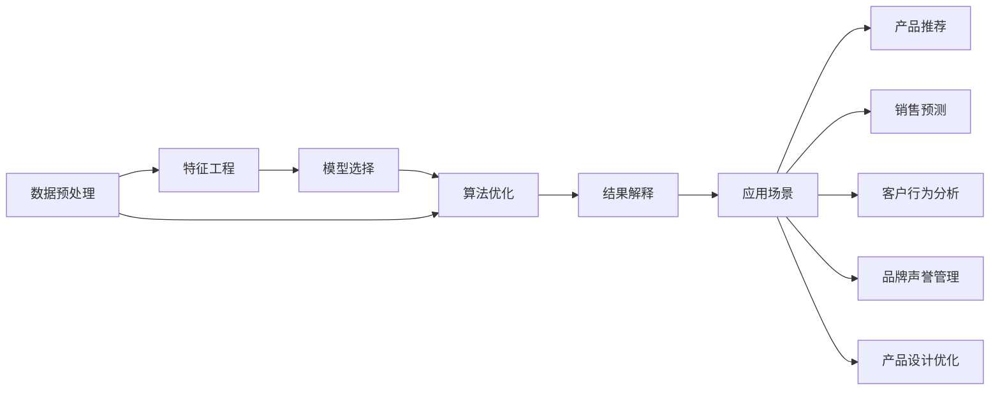

                 

# 知识发现引擎：驱动企业创新的核心引擎

## 1. 背景介绍

在当今瞬息万变的商业环境中，企业需要快速响应市场变化、适应消费者需求，以保持竞争优势。知识发现引擎(Knowledge Discovery Engine, KDE)作为一种强大的技术工具，正逐渐成为驱动企业创新的核心引擎。KDE通过从海量数据中挖掘有价值的模式、趋势和关联，为企业决策提供科学依据，支持企业的业务创新、产品迭代和战略优化。

### 1.1 问题由来

企业的数据源越来越丰富，包括客户反馈、销售记录、社交媒体、传感器数据等，这些数据蕴含着海量的知识。传统的报表分析和手工查询方法已经无法满足企业对知识高效获取和智能决策的需求。知识发现引擎通过数据挖掘和模式识别，能够从这些原始数据中提炼出有用的知识和见解，帮助企业迅速找到问题的答案，制定更加科学的决策方案。

### 1.2 问题核心关键点

知识发现引擎的核心功能包括数据预处理、特征工程、模型选择、算法优化和结果解释等。其核心在于：
1. **数据预处理**：清洗、归一化、特征工程等步骤是KDE的基础，决定了后续分析和模型的质量。
2. **模型选择**：选择合适的算法和模型是KDE成功的关键。包括统计分析、机器学习、深度学习等方法。
3. **算法优化**：通过交叉验证、参数调优等手段，提高算法的性能和泛化能力。
4. **结果解释**：提供易于理解的输出结果，支持企业基于数据驱动的决策制定。

## 2. 核心概念与联系

### 2.1 核心概念概述

以下是KDE涉及的几个核心概念：

- **数据挖掘**：从原始数据中提取有价值的信息和模式的过程。
- **机器学习**：利用算法使机器能够从数据中学习并做出预测或决策。
- **深度学习**：一种特殊的机器学习方法，利用多层神经网络进行特征提取和模式识别。
- **知识图谱**：通过实体关系建模，展示知识之间的联系和层次。
- **推荐系统**：根据用户行为和偏好，推荐合适的商品、内容或服务。

这些核心概念构成了KDE的技术基础，通过它们可以构建出多个应用场景，实现对企业数据的深入分析和应用。

### 2.2 核心概念原理和架构的 Mermaid 流程图



这个流程图展示了数据从原始形态到最终应用的全流程，涵盖了数据预处理、特征工程、模型选择、算法优化和结果解释等关键环节，并最终应用到推荐系统、销售预测、客户行为分析、品牌声誉管理和产品设计优化等多个场景中。

## 3. 核心算法原理 & 具体操作步骤

### 3.1 算法原理概述

知识发现引擎通常包含以下关键步骤：

1. **数据预处理**：清洗、归一化、特征提取等，提高数据质量。
2. **特征工程**：提取、选择和变换特征，提升模型的性能。
3. **模型选择**：选择适合的机器学习或深度学习算法，构建模型。
4. **算法优化**：通过交叉验证等技术，优化模型参数，提高泛化能力。
5. **结果解释**：将复杂结果转化为易于理解的解释，支持决策制定。

### 3.2 算法步骤详解

#### 3.2.1 数据预处理

数据预处理是KDE的第一步，包括数据清洗、归一化、特征提取等。数据清洗是指处理缺失值、异常值、重复值等，保证数据质量。数据归一化是指将数据按比例缩放，使得不同特征具有相同范围，便于模型训练。特征提取是指从原始数据中提取有意义的特征，常用的方法有主成分分析(PCA)、因子分析等。

#### 3.2.2 特征工程

特征工程是KDE的核心环节，通过特征选择、特征变换和特征构造等手段，提升模型的性能。特征选择是指从原始特征中筛选出对目标变量有影响的重要特征。特征变换是指通过降维、编码等方法，简化数据结构。特征构造是指创建新的特征，例如交叉项、多项式特征等，以捕捉数据中的非线性关系。

#### 3.2.3 模型选择

模型选择是KDE的关键步骤，需要根据具体问题和数据特点，选择合适的算法和模型。常见的算法包括回归、分类、聚类、关联规则等。常用的模型包括线性回归、决策树、随机森林、支持向量机(SVM)、神经网络等。

#### 3.2.4 算法优化

算法优化是KDE的高效实现步骤，通过交叉验证、参数调优等技术，提高模型的性能和泛化能力。交叉验证是一种评估模型性能的方法，通过将数据集划分为训练集和验证集，交叉验证可以帮助选择合适的模型和参数。参数调优是指通过网格搜索、贝叶斯优化等方法，找到最优的模型参数。

#### 3.2.5 结果解释

结果解释是KDE的重要环节，通过可视化、自然语言处理等手段，将复杂结果转化为易于理解的解释。常用的方法包括热力图、散点图、分类树、词云等。

### 3.3 算法优缺点

知识发现引擎具有以下优点：

1. **自动性**：自动从数据中提取有价值的知识，减少人工干预。
2. **准确性**：通过算法优化，提高分析结果的准确性。
3. **可扩展性**：支持大规模数据处理，易于扩展到多个业务场景。
4. **灵活性**：算法和模型选择灵活，可以根据具体问题进行调整。

但KDE也存在一些缺点：

1. **数据依赖**：KDE的效果很大程度上依赖于数据的质量和数量。
2. **复杂性**：算法和模型选择复杂，需要专业知识。
3. **可解释性**：部分算法结果难以解释，对决策支持有限。
4. **成本高**：需要高性能计算资源和专业知识，成本较高。

### 3.4 算法应用领域

知识发现引擎在多个领域得到广泛应用，例如：

1. **销售预测**：通过历史销售数据预测未来的销售趋势，指导库存管理。
2. **客户行为分析**：分析客户购买行为和偏好，优化产品设计和营销策略。
3. **品牌声誉管理**：通过社交媒体等数据，监测品牌声誉变化，优化品牌策略。
4. **推荐系统**：根据用户历史行为，推荐合适的商品或内容，提升用户体验。
5. **风险管理**：通过金融数据预测风险，辅助企业制定风险控制策略。

## 4. 数学模型和公式 & 详细讲解

### 4.1 数学模型构建

知识发现引擎的数学模型构建通常包括以下步骤：

1. **数据准备**：将原始数据转化为模型可处理的格式，例如矩阵形式。
2. **特征选择**：从原始特征中选择重要的特征，转化为特征向量。
3. **模型训练**：使用训练数据训练模型，得到模型参数。
4. **模型评估**：使用验证数据评估模型性能，调整参数。
5. **模型预测**：使用测试数据预测结果。

### 4.2 公式推导过程

#### 4.2.1 线性回归

线性回归是KDE中最常用的模型之一，其基本形式为：

$$
y = \beta_0 + \beta_1 x_1 + \beta_2 x_2 + \cdots + \beta_n x_n + \epsilon
$$

其中 $y$ 为因变量，$\beta$ 为回归系数，$x_i$ 为自变量，$\epsilon$ 为误差项。线性回归的目标是找到最优的回归系数，使得预测值与实际值之间的误差最小。

#### 4.2.2 决策树

决策树是一种分类模型，其基本形式为：

$$
T = \{r_1, r_2, \cdots, r_m\}
$$

其中 $r_i$ 为决策规则。决策树通过树状结构，将数据划分为多个子集，每个子集对应一个决策规则。决策树的构建过程是通过递归地将数据集划分为子集，使得每个子集的最大信息增益最大。

### 4.3 案例分析与讲解

#### 4.3.1 客户流失预测

通过历史客户数据，预测哪些客户可能流失，从而采取针对性的挽留措施。可以采用逻辑回归、决策树等算法，分析客户的年龄、性别、购买频率、消费金额等特征。

#### 4.3.2 产品推荐

根据用户历史行为，推荐合适的商品。可以采用协同过滤、基于内容的推荐等算法，分析用户的浏览、购买、评价等行为，提取特征，构建推荐模型。

#### 4.3.3 市场细分

通过市场数据，将客户细分为不同的细分市场，制定差异化的营销策略。可以采用聚类算法，分析客户的地理位置、收入水平、兴趣爱好等特征，构建聚类模型。

## 5. 项目实践：代码实例和详细解释说明

### 5.1 开发环境搭建

在进行KDE项目实践前，我们需要准备好开发环境。以下是使用Python进行TensorFlow开发的环境配置流程：

1. 安装Anaconda：从官网下载并安装Anaconda，用于创建独立的Python环境。

2. 创建并激活虚拟环境：
```bash
conda create -n tf-env python=3.8 
conda activate tf-env
```

3. 安装TensorFlow：根据CUDA版本，从官网获取对应的安装命令。例如：
```bash
conda install tensorflow -c tf
```

4. 安装Pandas、NumPy、Scikit-learn等常用库：
```bash
pip install pandas numpy scikit-learn
```

5. 安装TensorBoard：用于可视化模型训练过程，增强调试效果。
```bash
pip install tensorboard
```

完成上述步骤后，即可在`tf-env`环境中开始KDE项目开发。

### 5.2 源代码详细实现

下面以客户流失预测为例，给出使用TensorFlow进行KDE开发的Python代码实现。

```python
import pandas as pd
import tensorflow as tf
import numpy as np
from sklearn.model_selection import train_test_split

# 读取数据
data = pd.read_csv('churn.csv')

# 数据清洗
data = data.dropna()
data = data.drop_duplicates()

# 数据预处理
X = data[['age', 'tenure', 'income', 'phone_service', 'multiple_lines', 'partner', 'paperless_billing', 'payment_method', 'gender', 'children', 'tenure', 'monthly_charges', 'total_charges', 'customer_service', 'support', 'online_security', 'online_backup', 'device_protection', 'tech_support', 'streaming_tv', 'streaming_movies', 'contract', 'paperless_billing']]
y = data['churn']

# 特征工程
from sklearn.preprocessing import StandardScaler
scaler = StandardScaler()
X = scaler.fit_transform(X)

# 数据划分
X_train, X_test, y_train, y_test = train_test_split(X, y, test_size=0.2, random_state=42)

# 构建模型
model = tf.keras.models.Sequential([
    tf.keras.layers.Dense(64, activation='relu', input_shape=(X_train.shape[1],)),
    tf.keras.layers.Dense(32, activation='relu'),
    tf.keras.layers.Dense(1, activation='sigmoid')
])

# 编译模型
model.compile(optimizer='adam', loss='binary_crossentropy', metrics=['accuracy'])

# 训练模型
history = model.fit(X_train, y_train, epochs=50, batch_size=32, validation_data=(X_test, y_test))

# 评估模型
test_loss, test_acc = model.evaluate(X_test, y_test)
print('Test accuracy:', test_acc)
```

### 5.3 代码解读与分析

让我们再详细解读一下关键代码的实现细节：

**数据处理**：
- `pd.read_csv`：读取CSV格式的数据文件。
- `data.dropna`：删除包含缺失值的行。
- `data.drop_duplicates`：删除重复的行。
- `StandardScaler`：对特征进行标准化处理，使不同特征具有相同的范围。

**模型构建**：
- `tf.keras.models.Sequential`：创建神经网络模型。
- `tf.keras.layers.Dense`：创建全连接层。
- `compile`：编译模型，指定优化器、损失函数和评估指标。

**模型训练**：
- `fit`：训练模型，指定训练集、验证集和训练轮数。
- `history`：记录训练过程中的各项指标，包括损失和精度。

**模型评估**：
- `evaluate`：评估模型在测试集上的性能。

可以看到，TensorFlow使得KDE的开发变得简洁高效。开发者可以将更多精力放在数据处理、模型改进等高层逻辑上，而不必过多关注底层的实现细节。

当然，工业级的系统实现还需考虑更多因素，如模型的保存和部署、超参数的自动搜索、更灵活的特征工程等。但核心的KDE开发流程基本与此类似。

## 6. 实际应用场景

### 6.1 客户流失预测

客户流失是企业面临的一个重大问题，通过KDE技术可以预测哪些客户可能流失，从而采取针对性的挽留措施。例如，某电信公司通过分析客户历史数据，构建客户流失预测模型，发现某些低价值客户由于服务质量问题可能流失，从而及时采取措施，提升了客户保留率。

### 6.2 市场细分

市场细分是企业进行差异化营销的重要手段，通过KDE技术可以将客户细分为不同的细分市场，制定更加精准的营销策略。例如，某电商平台通过分析客户行为数据，构建市场细分模型，发现不同年龄段的客户有不同的购买偏好，从而制定相应的促销策略，提升了销售额。

### 6.3 产品推荐

产品推荐是提升用户体验的重要手段，通过KDE技术可以根据用户历史行为，推荐合适的商品。例如，某在线零售商通过分析用户浏览、购买、评价等行为，构建推荐模型，提高了用户的复购率。

### 6.4 风险管理

风险管理是金融领域的重要任务，通过KDE技术可以预测金融市场的风险变化，辅助企业制定风险控制策略。例如，某保险公司通过分析历史理赔数据，构建风险预测模型，发现某些地区的理赔率较高，从而及时调整定价策略，降低了理赔成本。

## 7. 工具和资源推荐

### 7.1 学习资源推荐

为了帮助开发者系统掌握KDE的理论基础和实践技巧，这里推荐一些优质的学习资源：

1. 《Python机器学习》：由Sebastian Raschka编写，全面介绍了Python在机器学习中的应用，包括数据预处理、特征工程、模型选择等。

2. 《深度学习》：由Ian Goodfellow、Yoshua Bengio、Aaron Courville合著，深入介绍了深度学习的理论和实践，涵盖KDE的核心技术。

3. 《Hands-On Machine Learning with Scikit-Learn, Keras, and TensorFlow》：由Aurélien Géron编写，通过实际案例介绍KDE的核心算法和工具，适合动手实践。

4. Kaggle数据科学竞赛：提供了丰富的KDE实践机会，涵盖了数据预处理、特征工程、模型选择等环节。

5. TensorFlow官方文档：提供了TensorFlow的详细教程和API文档，适合KDE的深度学习和TensorFlow实践。

通过对这些资源的学习实践，相信你一定能够快速掌握KDE的核心技术，并用于解决实际的商业问题。

### 7.2 开发工具推荐

高效的开发离不开优秀的工具支持。以下是几款用于KDE开发的常用工具：

1. TensorFlow：由Google主导开发的开源深度学习框架，生产部署方便，适合大规模工程应用。

2. Scikit-learn：基于Python的机器学习库，提供丰富的数据预处理和模型选择功能，适合KDE的算法实现。

3. PyTorch：基于Python的开源深度学习框架，灵活动态的计算图，适合快速迭代研究。

4. Weights & Biases：模型训练的实验跟踪工具，可以记录和可视化模型训练过程中的各项指标，方便对比和调优。

5. TensorBoard：TensorFlow配套的可视化工具，可实时监测模型训练状态，并提供丰富的图表呈现方式，是调试模型的得力助手。

6. Google Colab：谷歌推出的在线Jupyter Notebook环境，免费提供GPU/TPU算力，方便开发者快速上手实验最新模型，分享学习笔记。

合理利用这些工具，可以显著提升KDE任务的开发效率，加快创新迭代的步伐。

### 7.3 相关论文推荐

KDE的发展源于学界的持续研究。以下是几篇奠基性的相关论文，推荐阅读：

1. K-Means：由Arthur Bellette于1965年提出，是KDE中经典的聚类算法。

2. C4.5：由 Ross Quinlan 于 1993 年提出，是决策树算法中的经典。

3. Random Forest：由 Leo Breiman 于 2001 年提出，是集成学习的经典算法。

4. Gradient Boosting Machines：由 Friedman 于 2001 年提出，是一种基于梯度提升的集成学习算法。

5. Deep Learning：由 Ian Goodfellow、Yoshua Bengio、Aaron Courville合著，是深度学习的经典著作。

这些论文代表了大数据挖掘和KDE技术的发展脉络。通过学习这些前沿成果，可以帮助研究者把握学科前进方向，激发更多的创新灵感。

## 8. 总结：未来发展趋势与挑战

### 8.1 研究成果总结

知识发现引擎作为一种重要的数据分析工具，在商业决策、产品优化、风险管理等方面发挥了重要作用。本文系统介绍了KDE的核心概念、算法原理和操作步骤，通过实例展示了KDE的实际应用场景和开发流程。同时，本文也提出了KDE未来的发展趋势和面临的挑战。

### 8.2 未来发展趋势

展望未来，KDE技术将呈现以下几个发展趋势：

1. **自动化**：自动化成为KDE的主流方向，通过自动化的数据处理和模型优化，提高分析效率。
2. **智能化**：结合人工智能技术，如自然语言处理、图像识别等，提升KDE的智能化水平。
3. **实时化**：实现实时数据处理和分析，支持企业实时决策。
4. **泛在化**：支持多种数据源和多种业务场景，提升KDE的泛在化能力。

### 8.3 面临的挑战

尽管KDE技术已经取得了显著成果，但在迈向更加智能化、实时化的过程中，它仍面临诸多挑战：

1. **数据隐私**：KDE需要处理大量个人和企业数据，数据隐私和安全问题必须得到重视。
2. **算法复杂性**：KDE涉及的算法和技术较为复杂，需要专业知识和技能。
3. **计算资源**：KDE需要大量的计算资源，硬件和软件成本较高。
4. **结果可解释性**：部分KDE算法结果难以解释，对决策支持有限。

### 8.4 研究展望

面对KDE面临的挑战，未来的研究需要在以下几个方面寻求新的突破：

1. **自动化算法**：开发更加自动化的KDE算法，减少人工干预和调试工作。
2. **实时计算**：研究实时数据处理和分析技术，支持企业实时决策。
3. **智能化融合**：结合人工智能技术，提升KDE的智能化水平。
4. **隐私保护**：研究数据隐私保护技术，确保数据安全和合规。

这些研究方向的探索，必将引领KDE技术迈向更高的台阶，为构建安全、可靠、可解释、可控的智能系统铺平道路。面向未来，KDE技术还需要与其他人工智能技术进行更深入的融合，共同推动自然语言理解和智能交互系统的进步。只有勇于创新、敢于突破，才能不断拓展KDE的边界，让知识发现引擎成为驱动企业创新的核心引擎。

## 9. 附录：常见问题与解答

**Q1：KDE是否可以应用于非结构化数据？**

A: KDE通常应用于结构化数据，如图表、表格等。对于非结构化数据，如文本、图像、音频等，可以采用相应的预处理技术，将其转化为结构化数据进行处理。例如，文本数据可以采用NLP技术进行预处理，图像数据可以采用卷积神经网络进行处理。

**Q2：KDE算法的计算复杂度如何？**

A: KDE算法的计算复杂度较高，主要取决于数据规模和算法复杂度。例如，K-means算法的计算复杂度为O(nkN)，其中n为数据量，k为簇数，N为特征维数。对于大规模数据，计算复杂度较高，需要采用分布式计算或优化算法来提高效率。

**Q3：KDE的结果如何解释？**

A: KDE的结果通常需要通过可视化、自然语言处理等手段进行解释。例如，使用热力图、散点图、分类树等可视化方法，将复杂结果转化为易于理解的解释。同时，可以结合领域知识，对结果进行人工解释和验证，确保结果的合理性。

**Q4：KDE在不同领域的应用场景有哪些？**

A: KDE在多个领域得到广泛应用，包括销售预测、客户行为分析、品牌声誉管理、产品推荐、风险管理等。具体应用场景包括客户流失预测、市场细分、产品推荐、金融风险预测等。

**Q5：KDE如何处理缺失数据？**

A: KDE通常要求数据完整，缺失数据会对分析结果产生影响。可以通过插值、均值填补等方法处理缺失数据，或者将缺失值作为特征之一，构建新的模型。

---

作者：禅与计算机程序设计艺术 / Zen and the Art of Computer Programming

