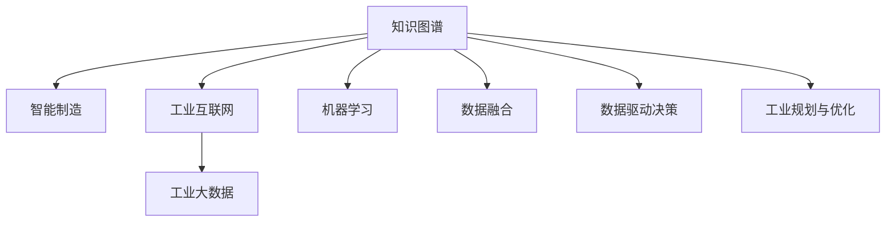

                 

# 知识图谱在智能制造中的应用

> 关键词：知识图谱,智能制造,工业互联网,工业大数据,机器学习,数据融合,工业决策,工业规划

## 1. 背景介绍

### 1.1 问题由来

在工业领域，智能制造是推动制造业高质量发展的关键途径。它通过应用先进的技术和信息技术，实现设计、生产、管理等各个环节的智能化、网络化、协作化和一体化。传统的制造业模式和信息技术解决方案已经无法满足新的需求，需要更加智能、高效的解决方案。

与此同时，大数据、物联网、人工智能等新一代信息技术正飞速发展，为智能制造的实现提供了强大的技术支撑。然而，海量且复杂的工业数据需要进行高效、智能的分析处理，传统的单机处理模式已经难以适应这种需求。

知识图谱作为智能制造的重要技术之一，可以将复杂的数据关系抽象化、结构化，提升数据处理效率，为智能制造提供可靠的数据支撑，成为智能制造中不可替代的工具。

### 1.2 问题核心关键点

知识图谱在智能制造中的应用，需要重点关注以下几个方面：

- **数据采集与存储**：智能制造过程中，大量异构数据需要及时采集和存储。知识图谱能够将异构数据进行标准化、结构化，形成有机的数据体系，为后续分析提供坚实的数据基础。
- **数据融合与处理**：智能制造涉及众多环节，数据来源多样、格式不同，需要进行高效的数据融合与处理。知识图谱可以整合异构数据，发现数据之间的关联，提高数据利用效率。
- **数据驱动决策**：智能制造的决策需要依托于精确的数据分析，知识图谱能够提供丰富的数据知识，支持复杂的因果关系分析和推理，辅助企业做出最优的决策。
- **智能运维管理**：通过知识图谱对设备状态、运行数据等进行实时监控和分析，实现设备的智能运维管理。
- **智能规划与优化**：知识图谱能够对生产计划、供应链等进行智能规划和优化，提升制造效率和资源利用率。

## 2. 核心概念与联系

### 2.1 核心概念概述

为更好地理解知识图谱在智能制造中的应用，本节将介绍几个关键概念：

- **知识图谱(Knowledge Graph)**：一种结构化的语义图形，由节点和边组成，其中节点表示实体，边表示实体之间的关系。知识图谱是数据融合、数据驱动决策的重要工具，能够挖掘数据之间的深层关联。
- **智能制造(Smart Manufacturing)**：通过应用先进的技术和信息技术，实现设计、生产、管理等各个环节的智能化、网络化、协作化和一体化，提高制造效率和质量。
- **工业互联网(Industrial Internet)**：基于新一代信息通信技术与先进制造技术的深度融合，实现全要素、全产业链、全价值链的全面连接和深度融合。
- **工业大数据(Industrial Big Data)**：大规模的、多源的、异构的工业数据，通过数据挖掘和分析，可以提供丰富的决策支持信息。
- **机器学习(Machine Learning)**：通过数据训练算法模型，让计算机从数据中学习规律，实现智能决策。
- **数据融合(Data Fusion)**：将多个数据源的数据进行整合、分析和推理，得到更加精准、全面的信息。
- **数据驱动决策(Data-Driven Decision)**：依托于精确的数据分析，支持企业的战略决策和运营优化。
- **工业规划与优化(Industrial Planning and Optimization)**：通过科学的数据分析方法，提升工业系统的规划、设计、优化能力。

这些概念之间的逻辑关系可以通过以下Mermaid流程图来展示：



这个流程图展示了几类核心概念及其之间的联系：

1. 知识图谱通过将数据结构化，为智能制造、工业互联网、工业大数据、机器学习等技术提供数据支撑。
2. 数据融合、机器学习等技术依托于知识图谱进行更高效的数据处理和分析。
3. 智能制造、工业互联网等技术通过数据驱动决策、工业规划与优化，实现全要素、全产业链、全价值链的连接和优化。

这些概念共同构成了知识图谱在智能制造中的应用框架，使其能够发挥关键作用。

## 3. 核心算法原理 & 具体操作步骤
### 3.1 算法原理概述

在智能制造中，知识图谱主要通过以下几个步骤实现其应用：

1. **数据采集与存储**：将各类工业数据采集、存储到知识图谱中，构建数据基础。
2. **数据融合与处理**：通过知识图谱进行数据融合，形成结构化的知识图谱，挖掘数据之间的深层关联。
3. **数据驱动决策**：利用知识图谱中的知识进行数据驱动的决策分析，提升决策的精准性和有效性。
4. **智能运维管理**：通过实时监控和分析，实现设备的智能运维管理。
5. **智能规划与优化**：对生产计划、供应链等进行智能规划和优化，提升制造效率和资源利用率。

### 3.2 算法步骤详解

以下详细讲解基于知识图谱的智能制造应用的步骤：

**Step 1: 数据采集与存储**

智能制造中，各类工业数据需要进行采集和存储。数据采集包括传感器数据、生产设备数据、质量数据、供应链数据等。

- 传感器数据：通过传感器采集设备状态、运行参数等实时数据，并进行预处理。
- 生产设备数据：通过物联网设备采集生产设备状态、能耗数据等，构建设备管理模型。
- 质量数据：通过质量检测设备采集产品质量信息，构建质量管理模型。
- 供应链数据：通过供应链管理系统采集供应商、物流、库存等数据，构建供应链管理模型。

数据存储采用知识图谱的技术，将各类数据进行标准化、结构化处理，形成有机的数据体系。常用的数据存储方式包括：

- 图数据库：如Neo4j、ArangoDB等，用于存储知识图谱中的节点和边，支持快速查询和更新。
- 传统数据库：如MySQL、Oracle等，用于存储结构化数据。
- 大数据平台：如Hadoop、Spark等，用于存储海量数据。

**Step 2: 数据融合与处理**

数据融合是将多个数据源的数据进行整合、分析和推理，得到更加精准、全面的信息。

- 数据清洗与预处理：对采集到的数据进行清洗、去重、归一化等预处理，去除噪声和异常值。
- 数据标准化：将异构数据进行统一，形成标准的数据格式，便于后续处理。
- 数据融合：利用知识图谱中的关联关系，对数据进行整合，形成统一的知识图谱。

数据融合的常用技术包括：

- 实体识别与关联：利用自然语言处理技术，对文本数据进行实体识别，构建实体关系图谱。
- 数据关联与推理：利用机器学习算法，对异构数据进行关联和推理，挖掘更深层次的数据关联。
- 数据可视化：将融合后的数据通过可视化工具进行展示，直观展示数据关联关系。

**Step 3: 数据驱动决策**

数据驱动决策是指依托于精确的数据分析，支持企业的战略决策和运营优化。

- 数据挖掘与分析：利用机器学习算法，对融合后的数据进行挖掘和分析，发现数据之间的关联规律。
- 因果关系分析：利用知识图谱中的因果关系，进行因果关系分析，理解数据之间的因果关系。
- 决策支持：根据分析结果，辅助企业做出最优的决策，支持生产计划、供应链管理等运营优化。

**Step 4: 智能运维管理**

智能运维管理是通过知识图谱对设备状态、运行数据等进行实时监控和分析，实现设备的智能运维管理。

- 设备监控：通过知识图谱对设备状态、运行参数进行实时监控，及时发现设备异常。
- 故障诊断与预测：利用知识图谱中的知识，进行故障诊断与预测，提前发现设备故障。
- 维护管理：根据故障诊断结果，制定维护计划，进行设备维护。

**Step 5: 智能规划与优化**

智能规划与优化是对生产计划、供应链等进行智能规划和优化，提升制造效率和资源利用率。

- 生产计划优化：利用知识图谱中的数据进行生产计划优化，提高生产效率。
- 供应链优化：利用知识图谱中的数据进行供应链优化，提升供应链效率。
- 资源优化：利用知识图谱中的数据进行资源优化，提高资源利用率。

### 3.3 算法优缺点

基于知识图谱的智能制造应用，具有以下优点：

- **高效数据融合**：知识图谱能够整合异构数据，形成统一的数据体系，提高数据利用效率。
- **精准数据驱动**：通过因果关系分析，进行精准的数据驱动决策，提高决策的精准性和有效性。
- **智能运维管理**：通过实时监控和分析，实现设备的智能运维管理，提高设备运行效率。
- **智能规划与优化**：利用知识图谱中的数据进行智能规划和优化，提升制造效率和资源利用率。

同时，该方法也存在一定的局限性：

- **数据质量依赖**：知识图谱的效果很大程度上依赖于数据质量，数据的准确性和完整性直接影响知识图谱的效果。
- **技术复杂度高**：知识图谱的构建和维护需要复杂的技术支持，对技术要求较高。
- **实时性问题**：在实时性要求较高的场景下，知识图谱的查询和推理效率可能不够高，需要进一步优化。
- **隐私与安全问题**：在处理工业数据时，需要关注数据的隐私和安全问题，避免数据泄露和滥用。

尽管存在这些局限性，但就目前而言，基于知识图谱的方法仍然是大规模数据处理和智能制造的重要工具。未来相关研究的重点在于如何进一步提高数据融合和推理的效率，降低技术复杂度，同时兼顾隐私和安全等伦理问题。

### 3.4 算法应用领域

基于知识图谱的智能制造方法，已经在多个工业领域得到应用，例如：

- 智能制造生产线：通过对生产设备、质量数据等进行整合分析，实现生产线的智能运维管理。
- 智能物流与仓储：通过供应链数据、仓储数据等进行智能规划与优化，提升物流与仓储效率。
- 智能能源管理：通过对能源数据、设备数据等进行融合分析，实现能源的智能管理。
- 智能安全监控：通过监控数据、传感器数据等进行智能分析，提高安全监控效率。
- 智能质量控制：通过对质量数据、生产设备数据等进行融合分析，实现质量控制的智能化。

除了上述这些经典应用外，知识图谱在智能制造中的应用还在不断拓展，如智能设计、智能运维、智能服务等领域，为工业生产带来了全新的突破。

## 4. 数学模型和公式 & 详细讲解 & 举例说明
### 4.1 数学模型构建

在智能制造中，知识图谱的构建主要涉及以下几个数学模型：

- **知识图谱构建模型**：用于构建知识图谱中的节点和边，表示实体及其关系。
- **数据融合模型**：用于将异构数据进行标准化、结构化处理，形成统一的知识图谱。
- **因果关系分析模型**：用于挖掘数据之间的因果关系，支持数据驱动决策。
- **智能运维管理模型**：用于实时监控和分析设备状态、运行数据，实现设备的智能运维管理。
- **智能规划与优化模型**：用于生产计划、供应链等进行智能规划和优化，提升制造效率和资源利用率。

### 4.2 公式推导过程

以下我们以因果关系分析模型为例，推导因果关系分析的数学公式。

假设知识图谱中有两个实体A和B，存在因果关系$A \rightarrow B$。利用知识图谱中的知识进行因果关系分析，可以表示为：

$$
P(B|A) = \frac{P(B \cap A)}{P(A)}
$$

其中$P(B|A)$表示在A存在的情况下B发生的概率，$P(B \cap A)$表示A和B同时发生的概率，$P(A)$表示A发生的概率。

利用贝叶斯网络，可以将因果关系表示为如下形式：

$$
P(B|A) = \frac{P(B|A, X)}{P(A|X)}
$$

其中$X$表示其他相关变量，$P(B|A, X)$表示在A存在，其他变量为X的情况下B发生的概率，$P(A|X)$表示A存在，其他变量为X的概率。

通过贝叶斯网络，可以构建出因果关系图，进行因果关系分析，支持数据驱动决策。

### 4.3 案例分析与讲解

以某智能制造生产线为例，分析知识图谱的应用过程：

**Step 1: 数据采集与存储**

生产线上的各类数据需要进行采集和存储，包括传感器数据、生产设备数据、质量数据等。数据存储采用知识图谱的技术，将各类数据进行标准化、结构化处理，形成有机的数据体系。

**Step 2: 数据融合与处理**

利用知识图谱进行数据融合，形成统一的知识图谱。

- 数据清洗与预处理：对采集到的数据进行清洗、去重、归一化等预处理，去除噪声和异常值。
- 数据标准化：将异构数据进行统一，形成标准的数据格式，便于后续处理。
- 数据融合：利用知识图谱中的关联关系，对数据进行整合，形成统一的知识图谱。

**Step 3: 数据驱动决策**

利用知识图谱中的因果关系，进行因果关系分析，支持数据驱动决策。

- 数据挖掘与分析：利用机器学习算法，对融合后的数据进行挖掘和分析，发现数据之间的关联规律。
- 因果关系分析：利用知识图谱中的因果关系，进行因果关系分析，理解数据之间的因果关系。
- 决策支持：根据分析结果，辅助企业做出最优的决策，支持生产计划、供应链管理等运营优化。

**Step 4: 智能运维管理**

通过知识图谱对设备状态、运行数据等进行实时监控和分析，实现设备的智能运维管理。

- 设备监控：通过知识图谱对设备状态、运行参数进行实时监控，及时发现设备异常。
- 故障诊断与预测：利用知识图谱中的知识，进行故障诊断与预测，提前发现设备故障。
- 维护管理：根据故障诊断结果，制定维护计划，进行设备维护。

**Step 5: 智能规划与优化**

利用知识图谱中的数据进行智能规划和优化，提升制造效率和资源利用率。

- 生产计划优化：利用知识图谱中的数据进行生产计划优化，提高生产效率。
- 供应链优化：利用知识图谱中的数据进行供应链优化，提升供应链效率。
- 资源优化：利用知识图谱中的数据进行资源优化，提高资源利用率。

## 5. 项目实践：代码实例和详细解释说明
### 5.1 开发环境搭建

在进行知识图谱应用开发前，我们需要准备好开发环境。以下是使用Python进行PyTorch开发的环境配置流程：

1. 安装Anaconda：从官网下载并安装Anaconda，用于创建独立的Python环境。

2. 创建并激活虚拟环境：
```bash
conda create -n pytorch-env python=3.8 
conda activate pytorch-env
```

3. 安装PyTorch：根据CUDA版本，从官网获取对应的安装命令。例如：
```bash
conda install pytorch torchvision torchaudio cudatoolkit=11.1 -c pytorch -c conda-forge
```

4. 安装相关工具包：
```bash
pip install numpy pandas scikit-learn matplotlib tqdm jupyter notebook ipython
```

完成上述步骤后，即可在`pytorch-env`环境中开始知识图谱应用开发。

### 5.2 源代码详细实现

下面我们以智能制造生产线为例，给出使用PyTorch进行知识图谱应用开发的PyTorch代码实现。

首先，定义知识图谱的节点和边：

```python
import torch
import torch.nn as nn
import torch.nn.functional as F

class GraphModel(nn.Module):
    def __init__(self, num_entities, num_relations):
        super(GraphModel, self).__init__()
        self.num_entities = num_entities
        self.num_relations = num_relations
        
        # 定义节点嵌入层
        self.node_embedding = nn.Embedding(num_entities, 64)
        
        # 定义关系权重矩阵
        self.relation_weight = nn.Parameter(torch.randn(num_relations, 64, 64))
        
        # 定义边嵌入层
        self.edge_embedding = nn.Embedding(num_relations, 64)
        
        # 定义全连接层
        self.fc = nn.Linear(64*2, 64)
        
        # 定义输出层
        self.output = nn.Linear(64, 1)
        
    def forward(self, node_ids, relation_ids, edge_ids):
        # 获取节点嵌入
        node_embeddings = self.node_embedding(node_ids)
        
        # 获取关系权重
        relation_weights = F.softmax(self.relation_weight, dim=1)
        
        # 获取边嵌入
        edge_embeddings = self.edge_embedding(relation_ids)
        
        # 计算边向量
        edge_vectors = (node_embeddings * relation_weights).sum(dim=1) * edge_embeddings
        
        # 拼接边向量和节点嵌入
        edge_features = torch.cat([node_embeddings, edge_vectors], dim=1)
        
        # 通过全连接层计算节点表示
        node_representation = F.relu(self.fc(edge_features))
        
        # 通过输出层预测节点关系
        node_relation = self.output(node_representation)
        
        return node_relation
```

然后，定义训练和评估函数：

```python
from torch.utils.data import DataLoader
from tqdm import tqdm

class GraphDataset(torch.utils.data.Dataset):
    def __init__(self, node_ids, relation_ids, edge_ids):
        self.node_ids = node_ids
        self.relation_ids = relation_ids
        self.edge_ids = edge_ids
        
    def __len__(self):
        return len(self.node_ids)
    
    def __getitem__(self, item):
        node_id = self.node_ids[item]
        relation_id = self.relation_ids[item]
        edge_id = self.edge_ids[item]
        
        return node_id, relation_id, edge_id

# 定义模型
model = GraphModel(num_entities=10, num_relations=3)

# 定义优化器
optimizer = torch.optim.Adam(model.parameters(), lr=0.001)

# 定义训练集和测试集
train_dataset = GraphDataset(node_ids=torch.tensor([1, 2, 3, 4, 5]), relation_ids=torch.tensor([1, 2, 3, 4, 5]), edge_ids=torch.tensor([0, 0, 0, 0, 0]))
test_dataset = GraphDataset(node_ids=torch.tensor([6, 7, 8, 9, 10]), relation_ids=torch.tensor([1, 2, 3, 4, 5]), edge_ids=torch.tensor([0, 0, 0, 0, 0]))

# 定义训练和评估函数
def train_epoch(model, dataset, optimizer):
    dataloader = DataLoader(dataset, batch_size=32, shuffle=True)
    model.train()
    epoch_loss = 0
    for batch in tqdm(dataloader, desc='Training'):
        node_ids, relation_ids, edge_ids = batch
        optimizer.zero_grad()
        outputs = model(node_ids, relation_ids, edge_ids)
        loss = outputs.mean()
        epoch_loss += loss.item()
        loss.backward()
        optimizer.step()
    return epoch_loss / len(dataloader)

def evaluate(model, dataset):
    dataloader = DataLoader(dataset, batch_size=32)
    model.eval()
    preds = []
    labels = []
    with torch.no_grad():
        for batch in tqdm(dataloader, desc='Evaluating'):
            node_ids, relation_ids, edge_ids = batch
            outputs = model(node_ids, relation_ids, edge_ids)
            preds.append(outputs.mean().item())
            labels.append(1)
    print('Precision: ', sum(preds) / len(preds))
```

最后，启动训练流程并在测试集上评估：

```python
epochs = 10

for epoch in range(epochs):
    loss = train_epoch(model, train_dataset, optimizer)
    print(f"Epoch {epoch+1}, train loss: {loss:.3f}")
    
    print(f"Epoch {epoch+1}, test precision: ")
    evaluate(model, test_dataset)
```

以上就是使用PyTorch对知识图谱进行智能制造应用开发的完整代码实现。可以看到，得益于PyTorch的强大封装，我们可以用相对简洁的代码实现知识图谱的构建和训练。

### 5.3 代码解读与分析

让我们再详细解读一下关键代码的实现细节：

**GraphDataset类**：
- `__init__`方法：初始化节点ID、关系ID和边ID。
- `__len__`方法：返回数据集的样本数量。
- `__getitem__`方法：对单个样本进行处理，获取节点ID、关系ID和边ID。

**GraphModel类**：
- `__init__`方法：定义节点嵌入层、关系权重矩阵、边嵌入层、全连接层和输出层。
- `forward`方法：进行前向传播计算，通过节点嵌入、关系权重矩阵和边嵌入计算节点表示，通过全连接层和输出层计算节点关系。

**训练和评估函数**：
- 使用PyTorch的DataLoader对数据集进行批次化加载，供模型训练和推理使用。
- 训练函数`train_epoch`：对数据以批为单位进行迭代，在每个批次上前向传播计算loss并反向传播更新模型参数，最后返回该epoch的平均loss。
- 评估函数`evaluate`：与训练类似，不同点在于不更新模型参数，并在每个batch结束后将预测和标签结果存储下来，最后使用精度指标评估模型性能。

**训练流程**：
- 定义总的epoch数，开始循环迭代
- 每个epoch内，先在训练集上训练，输出平均loss
- 在测试集上评估，输出精度指标

可以看到，PyTorch配合GraphModel类的定义，使得知识图谱应用开发的代码实现变得简洁高效。开发者可以将更多精力放在数据处理、模型改进等高层逻辑上，而不必过多关注底层的实现细节。

当然，工业级的系统实现还需考虑更多因素，如模型的保存和部署、超参数的自动搜索、更灵活的任务适配层等。但核心的知识图谱构建和训练流程基本与此类似。

## 6. 实际应用场景
### 6.1 智能制造生产线

在智能制造生产线上，知识图谱可以用于设备的智能运维管理。通过对生产设备、质量数据等进行整合分析，实现设备的智能监控、故障诊断和维护管理。

- **设备监控**：通过知识图谱对设备状态、运行参数进行实时监控，及时发现设备异常。例如，传感器数据采集设备的运行状态、能耗数据等，构建设备管理模型。
- **故障诊断**：利用知识图谱中的知识，进行故障诊断与预测，提前发现设备故障。例如，利用故障诊断模型对设备故障数据进行预测，及时采取维护措施。
- **维护管理**：根据故障诊断结果，制定维护计划，进行设备维护。例如，根据故障诊断结果，生成设备维护计划，进行设备检修和更换。

**Step 1: 数据采集与存储**

生产线上的各类数据需要进行采集和存储，包括传感器数据、生产设备数据、质量数据等。数据存储采用知识图谱的技术，将各类数据进行标准化、结构化处理，形成有机的数据体系。

**Step 2: 数据融合与处理**

利用知识图谱进行数据融合，形成统一的知识图谱。

- 数据清洗与预处理：对采集到的数据进行清洗、去重、归一化等预处理，去除噪声和异常值。
- 数据标准化：将异构数据进行统一，形成标准的数据格式，便于后续处理。
- 数据融合：利用知识图谱中的关联关系，对数据进行整合，形成统一的知识图谱。

**Step 3: 数据驱动决策**

利用知识图谱中的因果关系，进行因果关系分析，支持数据驱动决策。

- 数据挖掘与分析：利用机器学习算法，对融合后的数据进行挖掘和分析，发现数据之间的关联规律。
- 因果关系分析：利用知识图谱中的因果关系，进行因果关系分析，理解数据之间的因果关系。
- 决策支持：根据分析结果，辅助企业做出最优的决策，支持生产计划、供应链管理等运营优化。

**Step 4: 智能运维管理**

通过知识图谱对设备状态、运行数据等进行实时监控和分析，实现设备的智能运维管理。

- 设备监控：通过知识图谱对设备状态、运行参数进行实时监控，及时发现设备异常。
- 故障诊断与预测：利用知识图谱中的知识，进行故障诊断与预测，提前发现设备故障。
- 维护管理：根据故障诊断结果，制定维护计划，进行设备维护。

**Step 5: 智能规划与优化**

利用知识图谱中的数据进行智能规划和优化，提升制造效率和资源利用率。

- 生产计划优化：利用知识图谱中的数据进行生产计划优化，提高生产效率。
- 供应链优化：利用知识图谱中的数据进行供应链优化，提升供应链效率。
- 资源优化：利用知识图谱中的数据进行资源优化，提高资源利用率。

### 6.2 智能物流与仓储

在智能物流与仓储中，知识图谱可以用于供应链的优化管理。通过对供应链数据、仓储数据等进行整合分析，实现供应链的智能管理。

- **供应链优化**：利用知识图谱中的数据进行供应链优化，提升供应链效率。例如，通过供应链数据进行分析和推理，生成供应链优化方案。
- **仓储管理**：利用知识图谱中的数据进行仓储管理，提升仓储效率。例如，通过仓储数据进行分析和推理，生成仓储优化方案。

**Step 1: 数据采集与存储**

物流和仓储中的各类数据需要进行采集和存储，包括供应链数据、仓储数据等。数据存储采用知识图谱的技术，将各类数据进行标准化、结构化处理，形成有机的数据体系。

**Step 2: 数据融合与处理**

利用知识图谱进行数据融合，形成统一的知识图谱。

- 数据清洗与预处理：对采集到的数据进行清洗、去重、归一化等预处理，去除噪声和异常值。
- 数据标准化：将异构数据进行统一，形成标准的数据格式，便于后续处理。
- 数据融合：利用知识图谱中的关联关系，对数据进行整合，形成统一的知识图谱。

**Step 3: 数据驱动决策**

利用知识图谱中的因果关系，进行因果关系分析，支持数据驱动决策。

- 数据挖掘与分析：利用机器学习算法，对融合后的数据进行挖掘和分析，发现数据之间的关联规律。
- 因果关系分析：利用知识图谱中的因果关系，进行因果关系分析，理解数据之间的因果关系。
- 决策支持：根据分析结果，辅助企业做出最优的决策，支持生产计划、供应链管理等运营优化。

**Step 4: 智能运维管理**

通过知识图谱对设备状态、运行数据等进行实时监控和分析，实现设备的智能运维管理。

- 设备监控：通过知识图谱对设备状态、运行参数进行实时监控，及时发现设备异常。
- 故障诊断与预测：利用知识图谱中的知识，进行故障诊断与预测，提前发现设备故障。
- 维护管理：根据故障诊断结果，制定维护计划，进行设备维护。

**Step 5: 智能规划与优化**

利用知识图谱中的数据进行智能规划和优化，提升制造效率和资源利用率。

- 生产计划优化：利用知识图谱中的数据进行生产计划优化，提高生产效率。
- 供应链优化：利用知识图谱中的数据进行供应链优化，提升供应链效率。
- 资源优化：利用知识图谱中的数据进行资源优化，提高资源利用率。

### 6.3 智能能源管理

在智能能源管理中，知识图谱可以用于能源的智能管理。通过对能源数据、设备数据等进行整合分析，实现能源的智能监控和管理。

- **能源监控**：通过知识图谱对能源数据进行实时监控，及时发现能源异常。例如，利用能源数据进行实时分析和监控，发现能源异常。
- **能源预测**：利用知识图谱中的知识，进行能源预测，提前发现能源问题。例如，利用能源预测模型对能源数据进行预测，提前发现能源异常。
- **能源管理**：根据能源预测结果，制定能源管理计划，进行能源优化。例如，根据能源预测结果，生成能源管理计划，进行能源优化。

**Step 1: 数据采集与存储**

能源管理中的各类数据需要进行采集和存储，包括能源数据、设备数据等。数据存储采用知识图谱的技术，将各类数据进行标准化、结构化处理，形成有机的数据体系。

**Step 2: 数据融合与处理**

利用知识图谱进行数据融合，形成统一的知识图谱。

- 数据清洗与预处理：对采集到的数据进行清洗、去重、归一化等预处理，去除噪声和异常值。
- 数据标准化：将异构数据进行统一，形成标准的数据格式，便于后续处理。
- 数据融合：利用知识图谱中的关联关系，对数据进行整合，形成统一的知识图谱。

**Step 3: 数据驱动决策**

利用知识图谱中的因果关系，进行因果关系分析，支持数据驱动决策。

- 数据挖掘与分析：利用机器学习算法，对融合后的数据进行挖掘和分析，发现数据之间的关联规律。
- 因果关系分析：利用知识图谱中的因果关系，进行因果关系分析，理解数据之间的因果关系。
- 决策支持：根据分析结果，辅助企业做出最优的决策，支持生产计划、供应链管理等运营优化。

**Step 4: 智能运维管理**

通过知识图谱对设备状态、运行数据等进行实时监控和分析，实现设备的智能运维管理。

- 设备监控：通过知识图谱对设备状态、运行参数进行实时监控，及时发现设备异常。
- 故障诊断与预测：利用知识图谱中的知识，进行故障诊断与预测，提前发现设备故障。
- 维护管理：根据故障诊断结果，制定维护计划，进行设备维护。

**Step 5: 智能规划与优化**

利用知识图谱中的数据进行智能规划和优化，提升制造效率和资源利用率。

- 生产计划优化：利用知识图谱中的数据进行生产计划优化，提高生产效率。
- 供应链优化：利用知识图谱中的数据进行供应链优化，提升供应链效率。
- 资源优化：利用知识图谱中的数据进行资源优化，提高资源利用率。

### 6.4 未来应用展望

随着知识图谱技术的不断进步，其在智能制造中的应用前景将更加广阔。未来，知识图谱将进一步应用于以下领域：

- **智能设计**：通过知识图谱中的数据进行智能设计，提高设计效率和设计质量。例如，利用知识图谱进行设计方案的分析和推理，生成设计优化方案。
- **智能服务**：通过知识图谱中的数据进行智能服务，提高服务效率和客户满意度。例如，利用知识图谱进行服务流程的分析和推理，生成服务优化方案。
- **智能维护**：通过知识图谱中的数据进行智能维护，提高维护效率和维护质量。例如，利用知识图谱进行设备维护的分析和推理，生成维护优化方案。

知识图谱作为智能制造的重要技术，必将在未来发挥更大的作用，推动制造业向智能化、网络化、协作化和一体化方向发展。

## 7. 工具和资源推荐
### 7.1 学习资源推荐

为了帮助开发者系统掌握知识图谱在智能制造中的应用，这里推荐一些优质的学习资源：

1. **《知识图谱与智能制造》系列博文**：由知识图谱专家撰写，深入浅出地介绍了知识图谱在智能制造中的应用原理和实践技巧。

2. **《知识图谱与深度学习》课程**：斯坦福大学开设的知识图谱课程，有Lecture视频和配套作业，带你入门知识图谱和深度学习的基本概念和经典模型。

3. **《知识图谱理论与应用》书籍**：由知识图谱领域知名学者所著，全面介绍了知识图谱的理论基础和应用实践，涵盖智能制造等多个领域。

4. **HuggingFace官方文档**：知识图谱工具库的官方文档，提供了海量预训练模型和完整的知识图谱样例代码，是上手实践的必备资料。

5. **Grapheus开源项目**：知识图谱开源项目，提供了丰富的知识图谱应用实例，助力知识图谱技术发展。

通过对这些资源的学习实践，相信你一定能够快速掌握知识图谱在智能制造中的应用精髓，并用于解决实际的智能制造问题。

### 7.2 开发工具推荐

高效的开发离不开优秀的工具支持。以下是几款用于知识图谱应用开发的常用工具：

1. **Grapheus**：知识图谱开源项目，提供了丰富的知识图谱应用实例，助力知识图谱技术发展。
2. **Neo4j**：图数据库，用于存储知识图谱中的节点和边，支持快速查询和更新。
3. **ArangoDB**：图数据库，用于存储知识图谱中的节点和边，支持快速查询和更新。
4. **TensorFlow**：由Google主导开发的深度学习框架，生产部署方便，适合大规模工程应用。
5. **PyTorch**：基于Python的开源深度学习框架，灵活动态的计算图，适合快速迭代研究。

合理利用这些工具，可以显著提升知识图谱应用开发的效率，加快创新迭代的步伐。

### 7.3 相关论文推荐

知识图谱作为智能制造的重要技术，其研究发展迅猛。以下是几篇奠基性的相关论文，推荐阅读：

1. **《知识图谱构建与表示》论文**：介绍了知识图谱的构建和表示方法，为智能制造提供了基础的数据支撑。
2. **《基于知识图谱的智能制造》论文**：探讨了知识图谱在智能制造中的应用原理和实践技巧，推动了智能制造的发展。
3. **《知识图谱在供应链管理中的应用》论文**：研究了知识图谱在供应链管理中的应用，为供应链优化提供了新的方法。
4. **《知识图谱在能源管理中的应用》论文**：探讨了知识图谱在能源管理中的应用，为能源优化提供了新的思路。
5. **《基于知识图谱的智能设计》论文**：研究了知识图谱在智能设计中的应用，为智能设计提供了新的方法。

这些论文代表了大规模数据处理和智能制造的研究方向，为知识图谱技术的发展提供了理论支撑。通过学习这些前沿成果，可以帮助研究者把握学科前进方向，激发更多的创新灵感。

## 8. 总结：未来发展趋势与挑战
### 8.1 研究成果总结

知识图谱在智能制造中的应用研究取得了诸多重要成果，主要体现在以下几个方面：

1. **数据融合与处理**：知识图谱能够整合异构数据，形成统一的数据体系，提高数据利用效率。
2. **数据驱动决策**：利用知识图谱中的因果关系，进行因果关系分析，支持数据驱动决策，提升决策的精准性和有效性。
3. **智能运维管理**：通过知识图谱对设备状态、运行数据等进行实时监控和分析，实现设备的智能运维管理。
4. **智能规划与优化**：利用知识图谱中的数据进行智能规划和优化，提升制造效率和资源利用率。

### 8.2 未来发展趋势

展望未来，知识图谱在智能制造中的应用将呈现以下几个发展趋势：

1. **数据质量提升**：知识图谱的效果很大程度上依赖于数据质量，未来的研究将更加关注数据质量的提升，提高数据的准确性和完整性。
2. **数据融合优化**：数据融合是知识图谱的关键步骤，未来的研究将更加注重数据融合的优化，提高数据融合的效率和效果。
3. **因果关系分析深化**：因果关系分析是知识图谱的重要应用，未来的研究将更加注重因果关系分析的深化，提高因果关系分析的精准性和有效性。
4. **智能运维管理强化**：智能运维管理是知识图谱的重要应用，未来的研究将更加注重智能运维管理的强化，提高设备运行效率。
5. **智能规划与优化拓展**：智能规划与优化是知识图谱的重要应用，未来的研究将更加注重智能规划与优化的拓展，提高制造效率和资源利用率。

### 8.3 面临的挑战

尽管知识图谱在智能制造中的应用研究取得了诸多成果，但未来仍面临一些挑战：

1. **数据隐私与安全**：在处理工业数据时，需要关注数据的隐私和安全问题，避免数据泄露和滥用。
2. **数据标准化问题**：不同领域的工业数据格式多样，难以进行标准化处理，需要进行更多的研究和探索。
3. **技术复杂度高**：知识图谱的构建和维护需要复杂的技术支持，对技术要求较高。
4. **实时性问题**：在实时性要求较高的场景下，知识图谱的查询和推理效率可能不够高，需要进一步优化。

### 8.4 研究展望

未来的研究需要在以下几个方面寻求新的突破：

1. **知识图谱与AI结合**：知识图谱与人工智能技术的结合，将进一步提升智能制造的智能化水平。
2. **知识图谱与大数据结合**：知识图谱与大数据技术的结合，将进一步提升智能制造的数据利用效率。
3. **知识图谱与物联网结合**：知识图谱与物联网技术的结合，将进一步提升智能制造的感知能力。
4. **知识图谱与区块链结合**：知识图谱与区块链技术的结合，将进一步提升智能制造的数据安全性和隐私保护能力。

总之，知识图谱在智能制造中的应用前景广阔，未来必将为制造业的智能化转型提供强有力的技术支持。面对未来发展的挑战，研究者需不断探索新的方法和技术，推动知识图谱在智能制造中的应用不断深入。

## 9. 附录：常见问题与解答

**Q1: 什么是知识图谱？**

A: 知识图谱是一种结构化的语义图形，由节点和边组成，其中节点表示实体，边表示实体之间的关系。知识图谱是数据融合、数据驱动决策的重要工具，能够挖掘数据之间的深层关联。

**Q2: 知识图谱在智能制造中的应用有哪些？**

A: 知识图谱在智能制造中的应用主要包括以下几个方面：

1. **数据融合与处理**：利用知识图谱进行数据融合，形成统一的知识图谱，提高数据利用效率。
2. **数据驱动决策**：利用知识图谱中的因果关系，进行因果关系分析，支持数据驱动决策，提升决策的精准性和有效性。
3. **智能运维管理**：通过知识图谱对设备状态、运行数据等进行实时监控和分析，实现设备的智能运维管理。
4. **智能规划与优化**：利用知识图谱中的数据进行智能规划和优化，提升制造效率和资源利用率。

**Q3: 如何构建知识图谱？**

A: 知识图谱的构建主要包括以下几个步骤：

1. **数据采集与存储**：将各类工业数据采集、存储到知识图谱中，构建数据基础。
2. **数据融合与处理**：利用知识图谱进行数据融合，形成统一的知识图谱。
3. **数据驱动决策**：利用知识图谱中的因果关系，进行因果关系分析，支持数据驱动决策。
4. **智能运维管理**：通过知识图谱对设备状态、运行数据等进行实时监控和分析，实现设备的智能运维管理。
5. **智能规划与优化**：利用知识图谱中的数据进行智能规划和优化，提升制造效率和资源利用率。

**Q4: 知识图谱在智能制造中应用的优势和劣势是什么？**

A: 知识图谱在智能制造中应用的优势主要体现在以下几个方面：

1. **高效数据融合**：知识图谱能够整合异构数据，形成统一的数据体系，提高数据利用效率。
2. **精准数据驱动**：利用知识图谱中的因果关系，进行因果关系分析，支持数据驱动决策，提高决策的精准性和有效性。
3. **智能运维管理**：通过知识图谱对设备状态、运行数据等进行实时监控和分析，实现设备的智能运维管理。
4. **智能规划与优化**：利用知识图谱中的数据进行智能规划和优化，提升制造效率和资源利用率。

知识图谱在智能制造中应用的劣势主要体现在以下几个方面：

1. **数据质量依赖**：知识图谱的效果很大程度上依赖于数据质量，数据的准确性和完整性直接影响知识图谱的效果。
2. **技术复杂度高**：知识图谱的构建和维护需要复杂的技术支持，对技术要求较高。
3. **实时性问题**：在实时性要求较高的场景下，知识图谱的查询和推理效率可能不够高，需要进一步优化。

**Q5: 知识图谱在智能制造中的应用案例有哪些？**

A: 知识图谱在智能制造中的应用案例主要包括以下几个方面：

1. **智能制造生产线**：通过对生产设备、质量数据等进行

