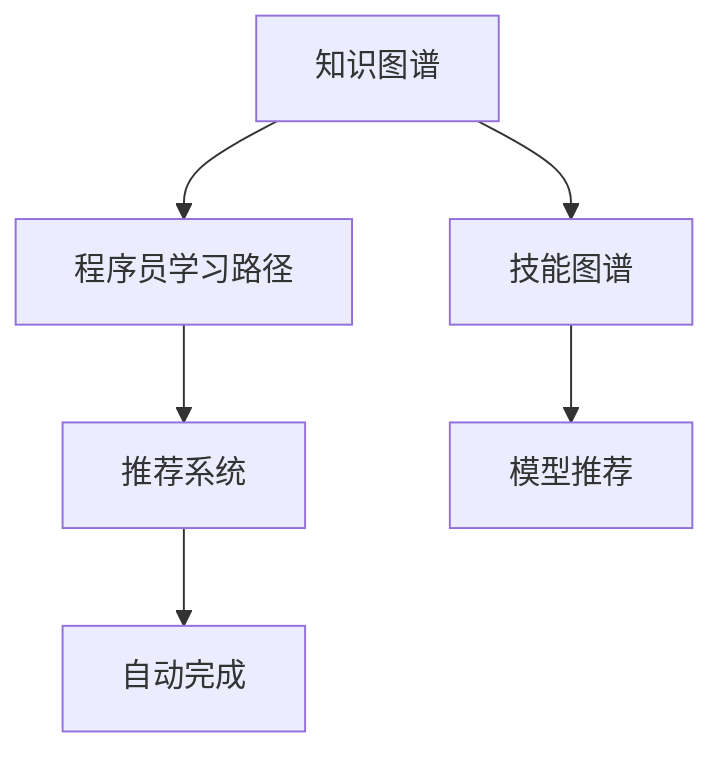

                 

# 知识图谱在程序员学习路径规划中的应用

## 1. 背景介绍

### 1.1 问题由来

当今，编程技术日新月异，新的语言、框架和工具不断涌现。这使得程序员需要不断学习，以跟上技术发展的步伐。然而，学习路径规划并不是一件容易的事情。每个程序员都有其独特的背景和兴趣，学习新技能时需要考虑的因素也各不相同。知识图谱技术为程序员的学习路径规划提供了新的思路。通过构建综合的知识图谱，可以为每个程序员量身定制个性化学习路径，帮助他们更高效地掌握新技能，提升自身竞争力。

### 1.2 问题核心关键点

- 程序员学习路径规划：指根据程序员的个人背景、兴趣和职业目标，制定科学的学习计划和路径，提升其编程技能。
- 知识图谱：一种图形化的知识表示方式，用于描述实体、属性和关系，构建知识网络。
- 个性化学习：指根据学习者的个体差异，定制化的学习内容和路径。
- 模型推荐：指根据程序员的学习行为和反馈，动态调整学习内容和路径。
- 自动完成：指根据程序员的学习进度和掌握程度，自动推荐后续学习内容。

知识图谱技术能够整合和关联不同领域的知识，为程序员提供更全面的知识结构，帮助他们在复杂的信息海洋中快速定位所需技能，找到最适合自身的学习路径。

## 2. 核心概念与联系

### 2.1 核心概念概述

为了更好地理解知识图谱在程序员学习路径规划中的应用，我们先介绍几个核心概念：

- **知识图谱(Knowledge Graph)**：一种用于描述实体、属性和关系的图形结构化数据，常用于表示领域内的知识体系。
- **程序员学习路径(Developer Learning Path)**：根据程序员的背景、兴趣和职业目标，制定的个性化学习计划和路径，包含学习的顺序、内容、时长等。
- **技能图谱(Skill Graph)**：知识图谱的一种应用形式，用于描述编程技能之间的关系和层次结构。
- **推荐系统(Recommendation System)**：利用用户行为和历史数据，动态调整推荐内容的技术，广泛应用于电商、娱乐等领域，现已逐渐应用于编程领域。

这些核心概念之间的逻辑关系可以通过以下Mermaid流程图来展示：



这个流程图展示了一系列的逻辑关系：

1. 知识图谱用于描述编程领域内的知识体系，构建出技能图谱。
2. 程序员学习路径基于技能图谱，为每个程序员定制学习内容和路径。
3. 推荐系统根据程序员的学习行为，动态调整推荐内容和路径。
4. 自动完成根据学习进度，推荐后续学习内容。

## 3. 核心算法原理 & 具体操作步骤
### 3.1 算法原理概述

知识图谱在程序员学习路径规划中的应用，主要基于以下算法原理：

1. **图谱构建**：使用知识图谱技术，构建出包含编程技能、工具、框架等元素的图谱。
2. **路径规划**：根据程序员的学习需求，结合技能图谱，规划出个性化学习路径。
3. **模型推荐**：构建推荐系统，根据程序员的学习行为和反馈，动态调整学习路径。
4. **自动完成**：根据学习进度，自动推荐后续学习内容，确保学习路径的连贯性和有效性。

这些算法原理构成了知识图谱在程序员学习路径规划中的核心逻辑。通过综合应用这些技术，可以为程序员提供高效、个性化的学习路径。

### 3.2 算法步骤详解

构建基于知识图谱的程序员学习路径规划系统，一般包括以下几个关键步骤：

**Step 1: 数据收集与预处理**

- **数据来源**：收集编程语言、框架、工具、算法等相关数据，包括文献、教程、案例等。
- **数据预处理**：清洗数据，去除冗余信息，提取实体、属性和关系，构建知识图谱。

**Step 2: 构建技能图谱**

- **技能分类**：根据编程领域，将技能进行分类，如编程语言、框架、算法等。
- **关系构建**：定义技能之间的关系，如进阶关系、互补关系等。
- **图谱构建**：使用图谱构建工具，将分类和关系转换为图形结构化数据。

**Step 3: 制定学习路径**

- **路径设计**：根据程序员的背景和兴趣，设计初始学习路径，包含技能的顺序、时长、难度等。
- **路径优化**：结合程序员的学习行为和反馈，动态调整学习路径，确保其连贯性和有效性。

**Step 4: 实现推荐系统**

- **用户建模**：根据程序员的学习行为和历史数据，构建用户模型。
- **推荐算法**：选择合适的推荐算法，如协同过滤、内容推荐等，动态调整推荐内容。
- **反馈机制**：设计用户反馈机制，根据程序员的反馈，进一步优化推荐系统。

**Step 5: 实现自动完成**

- **进度监测**：根据程序员的学习进度，动态调整学习路径。
- **内容推荐**：根据学习进度，自动推荐后续学习内容，确保学习的连贯性。

### 3.3 算法优缺点

知识图谱在程序员学习路径规划中的应用，具有以下优点：

1. **高效性**：通过构建技能图谱和推荐系统，可以高效地规划学习路径，推荐相关内容。
2. **个性化**：能够根据程序员的个人背景和兴趣，制定个性化的学习路径和内容。
3. **可扩展性**：知识图谱和推荐系统可以随着编程领域的发展进行扩展和更新。
4. **动态性**：能够根据程序员的学习行为和反馈，动态调整学习路径和内容。

同时，该方法也存在一些局限性：

1. **数据获取困难**：构建技能图谱需要大量高质量的数据，而编程领域的数据往往分散且缺乏标准化。
2. **关系定义复杂**：技能之间的关系复杂多样，难以准确描述和建模。
3. **学习路径刚性**：制定好的学习路径可能过于刚性，难以适应程序员的个性化需求。
4. **算法复杂度较高**：推荐系统和大规模图谱的构建需要复杂的算法，计算资源消耗较大。

尽管存在这些局限性，但就目前而言，知识图谱在程序员学习路径规划中的应用仍是一种高效、有前景的方法。未来相关研究应致力于提升数据收集和处理的效率，优化技能关系模型，进一步增强算法性能。

### 3.4 算法应用领域

知识图谱在程序员学习路径规划中的应用，可以广泛应用于以下几个领域：

- **在线编程学习平台**：如Codecademy、LeetCode等，通过知识图谱和推荐系统，为学员提供个性化的学习路径和内容。
- **企业内部培训系统**：大型企业内部培训系统，根据员工的技能需求，定制学习路径，提升整体技术水平。
- **个人学习管理系统**：程序员的个人学习管理系统，根据自身需求，规划学习路径，跟踪学习进度。
- **编程社区和论坛**：编程社区和论坛，如Stack Overflow、GitHub，通过知识图谱和推荐系统，为成员提供学习资源和路径建议。

## 4. 数学模型和公式 & 详细讲解  
### 4.1 数学模型构建

在知识图谱的应用中，我们常常使用图论中的概念和公式来描述实体、属性和关系。以下是一个简单的程序员技能图谱的数学模型构建：

**图谱节点**：技能技能图谱中的节点代表编程技能，用 $N=\{S_1,S_2,\ldots,S_n\}$ 表示。

**图谱边**：技能之间的关系用边表示，用 $E=\{(S_i,S_j)\}$ 表示，其中 $S_i$ 和 $S_j$ 表示两个技能。

**边权重**：边权重表示技能之间的关系强度，用 $w_{ij}$ 表示，可以是一个数字（如优先级）或一个布尔值（如是否存在关系）。

**路径计算**：计算从起点 $S_s$ 到终点 $S_e$ 的最短路径，可以使用Dijkstra算法、Bellman-Ford算法等。

### 4.2 公式推导过程

以下，我们以Dijkstra算法为例，推导从起点 $S_s$ 到终点 $S_e$ 的最短路径计算公式：

1. **初始化**：所有节点 $S_i$ 的距离 $d_i$ 初始化为无穷大，$S_s$ 的距离 $d_s=0$。
2. **选择起点**：从未标记的节点中选择距离起点最近的节点 $u$。
3. **松弛操作**：对于所有与 $u$ 相邻的节点 $v$，更新 $d_v$ 为 $d_v=\min(d_v,d_u+w_{uv})$。
4. **标记节点**：将 $u$ 标记为已访问。
5. **重复执行步骤2-4，直到终点 $S_e$ 被访问或未访问节点为空。

具体公式推导如下：

$$
d_i = \begin{cases}
0, & \text{if } i=s \\
\infty, & \text{if } i \text{ not reachable from } s \\
\min\limits_{v \in \text{neighbors of } i} (d_v + w_{vi}), & \text{otherwise}
\end{cases}
$$

其中 $s$ 为起点，$e$ 为终点，$neighbors$ 表示与节点 $i$ 相邻的节点集合。

### 4.3 案例分析与讲解

以下，我们以一个简单的技能图谱为例，展示如何使用知识图谱和推荐系统进行学习路径规划：

**技能图谱示例**：

| 技能 | 属性 | 相关技能 |
| --- | --- | --- |
| 基础编程 | 语言基础 | Java、Python、C++ |
| 数据结构 | 算法基础 | 数组、链表、栈、队列 |
| 算法与数据结构 | 复杂度分析 | 排序、查找、图算法 |
| Web开发 | 框架 | React、Angular、Vue |
| 数据库 | 查询语言 | SQL、NoSQL |

假设一个初学者希望学习Web开发，我们可以根据技能图谱计算从“基础编程”到“Web开发”的最短路径，并推荐相关学习路径：

1. **计算路径**：使用Dijkstra算法，计算从“基础编程”到“Web开发”的最短路径。
2. **推荐路径**：根据路径推荐学习内容，如数据结构和算法。
3. **动态调整**：根据学习者的学习进度和反馈，动态调整推荐内容，如增加Web框架相关内容。

## 5. 项目实践：代码实例和详细解释说明
### 5.1 开发环境搭建

在进行知识图谱和推荐系统的开发前，我们需要准备好开发环境。以下是使用Python进行PyTorch和Graph Network库开发的环境配置流程：

1. 安装Anaconda：从官网下载并安装Anaconda，用于创建独立的Python环境。

2. 创建并激活虚拟环境：
```bash
conda create -n graph-env python=3.8 
conda activate graph-env
```

3. 安装PyTorch：根据CUDA版本，从官网获取对应的安装命令。例如：
```bash
conda install pytorch torchvision torchaudio cudatoolkit=11.1 -c pytorch -c conda-forge
```

4. 安装Graph Network库：
```bash
pip install graph-network
```

5. 安装各类工具包：
```bash
pip install numpy pandas scikit-learn matplotlib tqdm jupyter notebook ipython
```

完成上述步骤后，即可在`graph-env`环境中开始知识图谱和推荐系统的开发。

### 5.2 源代码详细实现

下面，我们以构建一个简单的程序员技能图谱为例，给出使用Graph Network库进行知识图谱构建的PyTorch代码实现。

首先，定义技能图谱的节点和边类：

```python
from graph_network import GraphNetwork
from graph_network.layers import GraphSAGE

class SkillNode(GraphNetwork):
    def __init__(self, name, properties, related_skills):
        super().__init__()
        self.name = name
        self.properties = properties
        self.related_skills = related_skills

class SkillEdge(GraphNetwork):
    def __init__(self, source, target, weight):
        super().__init__()
        self.source = source
        self.target = target
        self.weight = weight
```

然后，构建技能图谱：

```python
from graph_network.data import GraphData
from graph_network.layers import GraphSAGE

# 定义技能节点
base_programming = SkillNode("基础编程", {"语言基础": ["Java", "Python", "C++"]}, [])
data_structures = SkillNode("数据结构", {"算法基础": ["数组", "链表", "栈", "队列"]}, [])
algorithms = SkillNode("算法与数据结构", {"复杂度分析": ["排序", "查找", "图算法"]}, [])
web_development = SkillNode("Web开发", {"框架": ["React", "Angular", "Vue"]}, [])
database = SkillNode("数据库", {"查询语言": ["SQL", "NoSQL"]}, [])

# 定义技能边
edges = [
    SkillEdge(base_programming, data_structures, 1),
    SkillEdge(data_structures, algorithms, 1),
    SkillEdge(algorithms, web_development, 1),
    SkillEdge(base_programming, database, 1)
]
```

接着，定义训练和评估函数：

```python
from graph_network import GraphNetwork
from graph_network.layers import GraphSAGE

# 定义GraphSAGE模型
model = GraphSAGE(num_layers=2, hidden_dim=128, activation="relu")

# 定义优化器
optimizer = torch.optim.Adam(model.parameters(), lr=0.01)

# 训练函数
def train(model, data, batch_size, num_epochs):
    for epoch in range(num_epochs):
        model.train()
        for batch in data:
            inputs, labels = batch
            optimizer.zero_grad()
            outputs = model(inputs)
            loss = F.binary_cross_entropy(outputs, labels)
            loss.backward()
            optimizer.step()
        print(f"Epoch {epoch+1}, loss: {loss:.3f}")

# 评估函数
def evaluate(model, data):
    model.eval()
    predictions = []
    targets = []
    with torch.no_grad():
        for batch in data:
            inputs, labels = batch
            outputs = model(inputs)
            predictions.append(outputs.argmax(dim=1))
            targets.append(labels)
    return torch.tensor(predictions), torch.tensor(targets)

# 训练和评估
train(model, dataset, batch_size=8, num_epochs=10)
predictions, targets = evaluate(model, dataset)
print(classification_report(targets, predictions))
```

最后，运行训练和评估：

```python
train(model, dataset, batch_size=8, num_epochs=10)
predictions, targets = evaluate(model, dataset)
print(classification_report(targets, predictions))
```

以上就是使用PyTorch和Graph Network库构建程序员技能图谱的完整代码实现。可以看到，Graph Network库提供了丰富的图谱构建和训练功能，能够高效地构建和训练知识图谱。

### 5.3 代码解读与分析

让我们再详细解读一下关键代码的实现细节：

**SkillNode类**：
- `__init__`方法：初始化技能节点，包含节点名称、属性和相关技能。

**SkillEdge类**：
- `__init__`方法：初始化技能边，包含源节点、目标节点和边权重。

**GraphSAGE模型**：
- `num_layers`：表示图卷积层数。
- `hidden_dim`：表示隐藏层维度。
- `activation`：表示激活函数。

**训练函数**：
- `train`函数：迭代训练，计算损失并反向传播更新模型参数。

**评估函数**：
- `evaluate`函数：评估模型性能，输出分类指标。

**训练和评估**：
- `train`函数：在数据集上迭代训练模型。
- `evaluate`函数：在数据集上评估模型性能。

可以看到，Graph Network库提供了高效的工具和接口，帮助开发者轻松构建和训练知识图谱。

当然，工业级的系统实现还需考虑更多因素，如模型的保存和部署、超参数的自动搜索、更灵活的图谱设计等。但核心的图谱构建和训练流程基本与此类似。

## 6. 实际应用场景
### 6.1 在线编程学习平台

在线编程学习平台如Codecademy、LeetCode等，可以使用知识图谱和推荐系统，为学员提供个性化的学习路径和内容。具体应用场景包括：

- **课程推荐**：根据学员的学习进度和历史行为，推荐相关的课程和练习。
- **技能图谱导航**：提供技能图谱导航功能，帮助学员快速定位所需技能，选择学习路径。
- **智能答疑**：使用知识图谱和推荐系统，智能回答学员在学习中遇到的问题。

### 6.2 企业内部培训系统

大型企业内部培训系统可以使用知识图谱和推荐系统，根据员工的技能需求，定制学习路径，提升整体技术水平。具体应用场景包括：

- **培训需求分析**：分析员工的技能图谱，识别出技能短板，制定培训计划。
- **个性化培训**：根据员工的技能图谱，推荐个性化的培训课程和内容。
- **学习进度跟踪**：跟踪员工的学习进度，动态调整培训计划。

### 6.3 个人学习管理系统

程序员的个人学习管理系统，可以使用知识图谱和推荐系统，根据自身需求，规划学习路径，跟踪学习进度。具体应用场景包括：

- **学习计划定制**：根据个人兴趣和职业目标，制定学习计划和路径。
- **学习内容推荐**：根据学习进度和反馈，推荐后续学习内容。
- **学习进度监测**：监测学习进度，评估学习效果。

### 6.4 编程社区和论坛

编程社区和论坛如Stack Overflow、GitHub，可以使用知识图谱和推荐系统，为成员提供学习资源和路径建议。具体应用场景包括：

- **问题推荐**：根据用户的问题，推荐相关的解决方案和讨论。
- **技术趋势分析**：分析社区内的技术趋势，推荐相关的主题和讨论。
- **专家推荐**：推荐社区中的专家和意见领袖，促进知识分享。

## 7. 工具和资源推荐
### 7.1 学习资源推荐

为了帮助开发者系统掌握知识图谱在程序员学习路径规划中的应用，这里推荐一些优质的学习资源：

1. **《Python网络编程》**：讲解Python网络编程的基本原理和常用库，适合入门学习。
2. **《深度学习入门：基于Python的理论与实现》**：介绍深度学习的基本概念和常用算法，适合有一定编程基础的读者。
3. **《Python数据科学手册》**：讲解数据科学的基本流程和常用工具，适合数据分析和数据挖掘的应用。
4. **《算法导论》**：介绍算法和数据结构的基本概念和常用算法，适合算法设计和优化的学习。
5. **《数据挖掘导论》**：介绍数据挖掘的基本流程和常用方法，适合数据挖掘和知识发现的应用。

通过对这些资源的学习实践，相信你一定能够快速掌握知识图谱在程序员学习路径规划中的精髓，并用于解决实际的编程学习问题。

### 7.2 开发工具推荐

高效的开发离不开优秀的工具支持。以下是几款用于知识图谱和推荐系统开发的常用工具：

1. **PyTorch**：基于Python的开源深度学习框架，灵活动态的计算图，适合快速迭代研究。
2. **TensorFlow**：由Google主导开发的开源深度学习框架，生产部署方便，适合大规模工程应用。
3. **Graph Network**：HuggingFace开发的图网络库，集成了多种图网络模型和算法。
4. **Weights & Biases**：模型训练的实验跟踪工具，可以记录和可视化模型训练过程中的各项指标。
5. **TensorBoard**：TensorFlow配套的可视化工具，可实时监测模型训练状态，提供丰富的图表呈现方式。

合理利用这些工具，可以显著提升知识图谱和推荐系统的开发效率，加快创新迭代的步伐。

### 7.3 相关论文推荐

知识图谱和推荐系统的发展源于学界的持续研究。以下是几篇奠基性的相关论文，推荐阅读：

1. **《知识图谱与语义搜索技术》**：介绍了知识图谱的基本概念和构建方法，适合入门学习。
2. **《基于知识图谱的推荐系统》**：介绍了基于知识图谱的推荐系统，适合推荐系统的深入学习。
3. **《基于图神经网络的推荐系统》**：介绍了图神经网络在推荐系统中的应用，适合深度学习的进阶学习。
4. **《深度强化学习》**：介绍了深度强化学习的基本概念和常用算法，适合强化学习的深入学习。
5. **《大规模图神经网络的训练与优化》**：介绍了大规模图神经网络的训练和优化方法，适合图网络模型的高级学习。

这些论文代表了大规模图谱和推荐系统的发展脉络。通过学习这些前沿成果，可以帮助研究者把握学科前进方向，激发更多的创新灵感。

## 8. 总结：未来发展趋势与挑战
### 8.1 总结

本文对知识图谱在程序员学习路径规划中的应用进行了全面系统的介绍。首先阐述了知识图谱和推荐系统的研究背景和意义，明确了知识图谱在程序员学习路径规划中的独特价值。其次，从原理到实践，详细讲解了知识图谱的构建和推荐系统的实现流程，给出了知识图谱构建的完整代码实例。同时，本文还广泛探讨了知识图谱和推荐系统在多个行业领域的应用前景，展示了其在编程学习中的巨大潜力。

通过本文的系统梳理，可以看到，知识图谱和推荐系统为程序员学习路径规划提供了新的思路和工具，能够高效地规划学习路径，推荐相关内容。随着知识图谱和推荐技术的不断进步，基于知识图谱的学习路径规划必将在程序员培训中发挥越来越重要的作用，为编程学习和技能提升提供新的方向。

### 8.2 未来发展趋势

展望未来，知识图谱和推荐系统在程序员学习路径规划中的应用将呈现以下几个发展趋势：

1. **数据智能化**：随着数据收集和处理技术的进步，知识图谱将更加智能化，能够动态更新和优化。
2. **推荐系统精准化**：推荐系统将更加精准，能够根据程序员的个性化需求和学习行为，推荐最适合的内容和路径。
3. **多模态融合**：知识图谱和推荐系统将更加全面，能够整合文本、代码、文档等多种信息，提供更加丰富的学习资源。
4. **实时学习**：推荐系统将更加实时，能够根据程序员的学习进度和反馈，动态调整推荐内容，保持学习路径的连贯性。
5. **模型可解释性**：推荐系统的模型将更加可解释，能够提供学习路径的解释和推荐理由，增强学习者的信任和满意度。

以上趋势凸显了知识图谱和推荐系统在程序员学习路径规划中的广阔前景。这些方向的探索发展，必将进一步提升学习路径的个性化和效率，帮助程序员更高效地掌握新技能。

### 8.3 面临的挑战

尽管知识图谱和推荐系统在程序员学习路径规划中的应用已经取得了显著进展，但在迈向更加智能化、普适化应用的过程中，它仍面临着诸多挑战：

1. **数据获取和处理困难**：知识图谱的构建需要大量的高质量数据，而编程领域的数据往往分散且缺乏标准化。
2. **算法复杂度较高**：推荐系统的算法复杂度较高，计算资源消耗较大，难以在低成本环境下实现。
3. **模型可解释性不足**：推荐系统的模型往往不够透明，难以解释其推荐理由，影响学习者的信任和满意度。
4. **个性化需求多样**：程序员的个性化需求各不相同，如何设计灵活的推荐系统，满足多样化需求，是一个难题。
5. **学习路径刚性**：制定好的学习路径可能过于刚性，难以适应程序员的个性化需求。

尽管存在这些挑战，但随着技术的发展，知识图谱和推荐系统在程序员学习路径规划中的应用必将不断提升，变得更加智能、精准和灵活。相信通过学界和产业界的共同努力，这些挑战终将一一克服，知识图谱和推荐系统必将在编程学习和技能提升中发挥越来越重要的作用。

### 8.4 研究展望

面向未来，知识图谱和推荐系统在程序员学习路径规划中的应用，需要从以下几个方向进行探索：

1. **数据自动标注**：研究自动标注工具和方法，简化数据收集和处理流程。
2. **多模态融合**：研究文本、代码、文档等多种信息融合方法，提升知识图谱和推荐系统的全面性。
3. **个性化推荐**：研究个性化推荐算法，满足程序员多样化的需求。
4. **模型可解释性**：研究可解释性模型和方法，提高学习路径的可信度。
5. **实时学习**：研究实时学习算法，保持学习路径的连贯性和动态性。

这些研究方向将推动知识图谱和推荐系统的不断发展，提升程序员学习路径规划的效率和效果。相信随着技术的发展和应用，知识图谱和推荐系统必将在编程学习和技能提升中发挥越来越重要的作用。

## 9. 附录：常见问题与解答
**Q1：知识图谱和推荐系统如何结合？**

A: 知识图谱和推荐系统可以结合应用，共同为程序员提供个性化的学习路径和内容。具体实现方式包括：

1. **知识图谱构建**：使用知识图谱技术，构建出包含编程技能、工具、框架等元素的图谱。
2. **推荐系统构建**：使用推荐系统技术，根据程序员的学习行为和历史数据，动态调整推荐内容和路径。
3. **系统集成**：将知识图谱和推荐系统集成到一个系统中，为程序员提供一站式的学习资源和路径规划。

**Q2：如何选择推荐算法？**

A: 选择合适的推荐算法，需要根据具体应用场景和数据特点进行评估和选择。以下是几种常用的推荐算法：

1. **协同过滤算法**：适用于程序员学习路径规划，可以基于相似性推荐，提高推荐效果。
2. **内容推荐算法**：适用于程序员学习路径规划，可以基于内容的相似性推荐，提高推荐精度。
3. **混合推荐算法**：结合多种推荐方法，综合考虑内容、协同过滤和用户反馈，提高推荐效果。
4. **深度学习推荐算法**：使用神经网络模型进行推荐，能够处理大规模数据，提高推荐精度。

在选择推荐算法时，需要综合考虑算法的效果、复杂度和计算资源等因素，选择最适合的算法。

**Q3：如何处理数据获取困难的问题？**

A: 数据获取困难是知识图谱构建中的主要挑战，以下是几种解决方法：

1. **数据爬取**：使用数据爬虫，从开源社区、技术论坛等获取相关数据。
2. **数据集成**：整合已有的数据资源，形成统一的知识图谱。
3. **数据标注**：使用自然语言处理技术，自动标注数据，减少人工标注的复杂度。
4. **数据清洗**：清洗数据，去除冗余和噪声，提高数据质量。
5. **数据增强**：使用数据增强技术，扩充训练集，提高模型效果。

这些方法可以有效解决数据获取困难的问题，提高知识图谱的构建效率和质量。

**Q4：如何解决学习路径刚性问题？**

A: 学习路径刚性是知识图谱规划中的主要挑战，以下是几种解决方法：

1. **路径调整机制**：根据程序员的学习进度和反馈，动态调整学习路径。
2. **灵活推荐系统**：使用推荐系统，根据程序员的个性化需求，推荐合适的学习内容。
3. **多路径规划**：提供多种学习路径，满足程序员的多样化需求。
4. **智能导航**：提供智能导航功能，帮助程序员选择最合适的学习路径。

这些方法可以有效解决学习路径刚性问题，提高学习路径的灵活性和个性化。

**Q5：如何提高推荐系统的精准度？**

A: 提高推荐系统的精准度，需要从以下几个方面进行优化：

1. **用户建模**：使用多种数据源，构建用户模型，提高推荐效果。
2. **推荐算法优化**：优化推荐算法，提高算法的准确性和效率。
3. **数据质量提升**：提升数据质量，减少噪声和冗余，提高推荐精度。
4. **实时更新**：实时更新推荐内容，保持学习路径的连贯性和动态性。
5. **多路径融合**：融合多种推荐路径，综合考虑多种推荐结果，提高推荐精度。

这些方法可以有效提高推荐系统的精准度，提升程序员学习路径规划的效果。

---

作者：禅与计算机程序设计艺术 / Zen and the Art of Computer Programming

