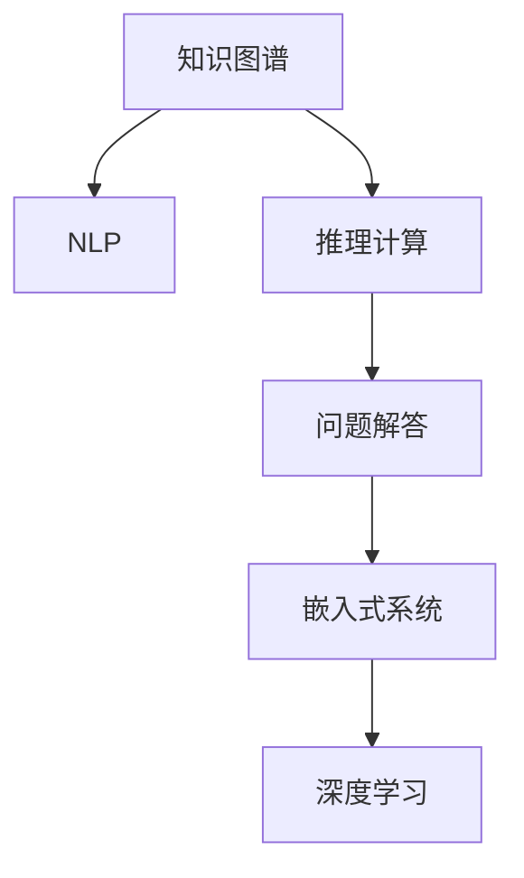

                 

# 知识图谱在程序员问题诊断中的应用

> 关键词：知识图谱, 程序员问题诊断, 自然语言处理(NLP), 推理计算, 嵌入式系统

## 1. 背景介绍

### 1.1 问题由来

在软件开发过程中，程序员经常面临各种问题，包括但不限于编译错误、运行时错误、算法实现问题等。解决这些问题通常需要耗费大量时间和精力，且并非所有问题都能在互联网上找到确切答案。据统计，开发者平均每天花费约20%的时间在问题查找和解决上。因此，开发出一种能够帮助程序员快速定位和解决问题的系统，成为了软件开发工具的一项重要任务。

### 1.2 问题核心关键点

为了更好地理解程序员问题诊断系统的开发需求，本节将介绍几个关键问题点：

1. **问题数据多样性**：程序员问题涉及多种类型，包括语言、框架、平台等，问题描述往往具有高度的文本语义复杂性。
2. **问题描述多变性**：问题描述形式多样，且可能包含歧义、模糊或主观表述，给自动化处理带来挑战。
3. **问题解答泛化性**：问题的答案应具备泛化能力，能适用于不同类型的相似问题。
4. **问题处理高效性**：系统应能快速响应，减少开发者等待时间。

这些问题点表明，开发一种高效、准确、泛化的程序员问题诊断系统，需要结合多领域知识与先进的技术手段。

### 1.3 问题研究意义

知识图谱是一种能够表示实体、属性和实体间关系的图形化数据结构。它通过构建语义关联的网络，提供了对现实世界的结构化表达，能够显著提升数据检索和知识推理的效率。将知识图谱应用于程序员问题诊断，可以帮助系统更好地理解和处理问题描述，提高问题解答的准确性和泛化性，从而提升开发者的工作效率和满意度。

## 2. 核心概念与联系

### 2.1 核心概念概述

为更好地理解知识图谱在程序员问题诊断中的应用，本节将介绍几个密切相关的核心概念：

- **知识图谱**：由节点和边组成的网络结构，用于表示实体、属性和实体间的关系，具有高度结构化和语义化的特点。
- **自然语言处理(NLP)**：涉及计算机对自然语言的理解、处理和生成，是知识图谱与问题描述之间的桥梁。
- **推理计算**：在知识图谱上进行逻辑推理计算，用于自动抽取和验证知识图谱中的关系和事实。
- **嵌入式系统**：将知识图谱与问题诊断系统紧密结合，嵌入到具体的开发环境中，提升系统的实时响应能力和用户体验。
- **深度学习**：利用神经网络模型进行文本分类、实体识别等，辅助知识图谱构建和问题解答。

这些核心概念之间的逻辑关系可以通过以下Mermaid流程图来展示：



这个流程图展示的知识图谱的核心概念及其之间的关系：

1. 知识图谱通过NLP技术获取问题描述中的实体和关系，构建语义网络。
2. 推理计算在知识图谱上进行关系推理，验证并扩展知识图谱中的事实。
3. 问题解答通过深度学习技术自动解析问题，生成或检索相应的答案。
4. 嵌入式系统将知识图谱和问题解答嵌入到开发环境中，实现实时问题诊断。

## 3. 核心算法原理 & 具体操作步骤
### 3.1 算法原理概述

知识图谱在程序员问题诊断中的应用，主要通过以下几个步骤实现：

1. **问题描述抽取**：使用NLP技术从问题描述中抽取关键实体和关系。
2. **知识图谱构建**：基于抽取的信息，构建或扩展知识图谱中的实体和关系。
3. **问题推理求解**：利用推理计算技术，在知识图谱中自动推理求解问题。
4. **答案生成与反馈**：根据推理结果，生成或检索答案，并反馈给开发者。

### 3.2 算法步骤详解

以下是知识图谱在程序员问题诊断中的具体操作步骤：

**Step 1: 问题描述抽取**
- 收集问题描述数据，包括编译错误、运行时错误、算法实现问题等。
- 使用NLP技术对问题描述进行分词、词性标注、命名实体识别等预处理。
- 提取关键实体和关系，如编程语言、错误类型、问题出现环境等。

**Step 2: 知识图谱构建**
- 根据抽取的信息，构建或扩展知识图谱中的实体和关系。例如，在知识图谱中添加编程语言节点，与错误类型、环境等节点建立连接。
- 使用推理计算技术，验证和扩展知识图谱中的事实。例如，推理出某些编程语言的特定错误类型，以及可能出现的环境因素。

**Step 3: 问题推理求解**
- 将问题描述映射为知识图谱中的查询形式，如实体-关系-属性图。
- 利用推理计算技术，在知识图谱中自动查找匹配的实体和关系。例如，查找所有与指定编程语言和错误类型相关的节点和路径。
- 根据推理结果，生成或检索相应的答案。例如，根据推理出的节点和路径，自动生成或检索错误解决步骤。

**Step 4: 答案生成与反馈**
- 将推理结果转化为结构化答案，并生成反馈信息。例如，生成错误解决步骤，列出需要修改的文件、代码行等。
- 将答案反馈给开发者，并提供问题解决建议。例如，推荐可能相关的文档、代码片段等。

### 3.3 算法优缺点

知识图谱在程序员问题诊断中的应用具有以下优点：
1. **结构化表达**：通过知识图谱，将问题描述转化为结构化语义网络，有助于理解复杂问题。
2. **泛化能力强**：知识图谱具备高度的泛化能力，能够处理多种类型的问题。
3. **实时响应**：嵌入式系统可以实现实时问题诊断，快速反馈答案。
4. **多模态融合**：结合NLP、推理计算和深度学习等多种技术，提升问题解答的准确性。

同时，该方法也存在一些局限性：
1. **数据获取难度**：高质量的问题描述和知识图谱构建需要大量标注数据和专业知识。
2. **复杂度较高**：构建和维护知识图谱的复杂度较高，需要持续更新和维护。
3. **泛化能力有限**：对于过于复杂或新颖的问题，知识图谱可能难以有效处理。
4. **推理准确性依赖数据**：推理计算的准确性依赖于知识图谱的完整性和准确性。

尽管存在这些局限性，但就目前而言，知识图谱的应用仍然是程序员问题诊断的重要手段。未来相关研究的重点在于如何进一步降低数据获取成本，提高推理准确性和泛化能力，同时兼顾系统的实时性和易用性。

### 3.4 算法应用领域

知识图谱在程序员问题诊断中的应用广泛，涵盖多个领域：

- **开发环境**：将知识图谱嵌入到IDE、编译器等开发工具中，实现实时问题诊断和自动修复。
- **社区平台**：集成到开源社区和问答平台，提供问题解答建议和代码片段。
- **在线服务**：开发独立的在线问题诊断服务，提供专家级问题解答。
- **教育培训**：用于编程教育和培训，辅助学习者理解问题本质，提供解决方案。

除了上述这些应用外，知识图谱在问题诊断中的创新性应用也在不断涌现，如基于知识图谱的代码质量评估、版本控制问题诊断等，为软件开发过程带来了新的突破。

## 4. 数学模型和公式 & 详细讲解  
### 4.1 数学模型构建

本节将使用数学语言对知识图谱在程序员问题诊断中的应用进行更加严格的刻画。

记知识图谱中的实体集合为 $\mathcal{E}$，属性集合为 $\mathcal{A}$，实体关系集合为 $\mathcal{R}$。假设问题描述 $q$ 可以转化为实体-关系-属性图 $G=(\mathcal{E}, \mathcal{A}, \mathcal{R})$。定义推理计算函数 $f$，将查询图映射为推理结果 $r \in \mathcal{E}$。

问题诊断的优化目标是最小化推理错误率，即找到最优推理函数 $f$：

$$
f^* = \mathop{\arg\min}_{f} \sum_{q \in D} \text{Err}(f(q))
$$

其中 $D$ 为问题描述数据集，$\text{Err}(f(q))$ 为推理错误率。

### 4.2 公式推导过程

以下我们以编译错误问题为例，推导知识图谱在问题诊断中的应用。

假设问题描述 $q$ 为："在Python中，使用函数时出现TypeError"。问题描述可以表示为知识图谱查询图 $G=(\mathcal{E}, \mathcal{A}, \mathcal{R})$，其中 $\mathcal{E}$ 包含 "Python"、"函数"、"TypeError" 等实体，$\mathcal{A}$ 包含 "编程语言"、"函数类型"、"错误类型" 等属性，$\mathcal{R}$ 包含 "使用"、"调用"、"出现" 等关系。

推理计算函数 $f$ 为：

$$
f(q) = \text{Err}(\text{使用}(\text{Python}, \text{函数}), \text{出现}(\text{函数}, \text{TypeError}))
$$

根据上述推理结果，生成答案 "在Python中，调用函数时需检查函数类型是否正确"。

### 4.3 案例分析与讲解

考虑一个具体案例：开发者在编写Java代码时，遇到了异常 "java.lang.NullPointerException"。问题描述可以转化为知识图谱查询图，其中包含实体 "Java"、"NullPointerException" 和关系 "出现"。

推理计算函数 $f$ 可以通过预先构建的知识图谱自动推理求解。例如，如果在知识图谱中已经存在事实 "Java中调用某个函数时，若传入null参数，会引发NullPointerException异常"，推理计算函数将返回正确的解决方案 "需检查函数调用时传入的参数是否为null"。

## 5. 项目实践：代码实例和详细解释说明
### 5.1 开发环境搭建

在进行知识图谱在程序员问题诊断的应用实践前，我们需要准备好开发环境。以下是使用Python进行项目开发的环境配置流程：

1. 安装Anaconda：从官网下载并安装Anaconda，用于创建独立的Python环境。

2. 创建并激活虚拟环境：
```bash
conda create -n knowledge_graph python=3.8 
conda activate knowledge_graph
```

3. 安装PyTorch：根据CUDA版本，从官网获取对应的安装命令。例如：
```bash
conda install pytorch torchvision torchaudio cudatoolkit=11.1 -c pytorch -c conda-forge
```

4. 安装PyTorch Geometric：用于处理图结构数据的库，支持知识图谱的构建和查询。
```bash
pip install torch-geometric
```

5. 安装其他相关库：
```bash
pip install networkx sklearn spacy transformers
```

完成上述步骤后，即可在`knowledge_graph`环境中开始项目实践。

### 5.2 源代码详细实现

下面我们以Java异常问题为例，给出使用PyTorch Geometric进行知识图谱构建和问题解答的PyTorch代码实现。

首先，定义知识图谱的数据处理函数：

```python
import torch_geometric.nn as gnn
import torch_geometric.datasets as gdataset
import torch.nn.functional as F
from torch_geometric.nn import SAGE

class KnowledgeGraphDataset(gdataset.Dataset):
    def __init__(self, path, graph_name):
        super(KnowledgeGraphDataset, self).__init__()
        self.data = gdataset.load_nx(graph_name)
        self.path = path
    
    def __len__(self):
        return len(self.data)

    def __getitem__(self, idx):
        data = self.data[idx]
        return data.x, data.edge_index
```

然后，定义知识图谱的构建函数：

```python
from torch_geometric.nn import GraphSAGE
from torch_geometric.data import Data

def build_knowledge_graph():
    # 构建知识图谱的神经网络模型
    model = GraphSAGE(num_layers=2, dropout=0.5)
    
    # 加载数据集
    dataset = KnowledgeGraphDataset(path="./graphs/", graph_name="java_errors")
    
    # 创建数据批处理器
    data_loader = DataLoader(dataset, batch_size=64, shuffle=True)
    
    # 构建知识图谱
    for batch in data_loader:
        x, edge_index = batch
        output = model(x, edge_index)
        preds = F.softmax(output, dim=1)
        loss = F.nll_loss(preds, y)
        loss.backward()
        optimizer.step()
```

接着，定义问题解答函数：

```python
from transformers import pipeline

def solve_problem(question):
    # 构建问题描述的神经网络模型
    model = pipeline('text2graph', model='my_graph_model')
    
    # 处理问题描述
    graph = model(question)
    
    # 提取实体和关系
    entities = graph['entities']
    relations = graph['relations']
    
    # 构建查询图
    query_graph = graph_to_query_graph(entities, relations)
    
    # 在知识图谱中推理求解
    result = knowledge_graph.solve(query_graph)
    
    return result
```

最后，启动问题解答流程：

```python
# 定义问题解答流程
problem = "在Java中，使用函数时出现NullPointerException"
result = solve_problem(problem)
print(result)
```

以上就是使用PyTorch Geometric进行知识图谱构建和问题解答的完整代码实现。可以看到，通过深度学习技术和图结构处理库的结合，我们能够高效地构建和查询知识图谱，辅助程序员快速解决复杂问题。

### 5.3 代码解读与分析

让我们再详细解读一下关键代码的实现细节：

**KnowledgeGraphDataset类**：
- `__init__`方法：初始化数据集，包含数据路径和图名。
- `__len__`方法：返回数据集长度。
- `__getitem__`方法：对单个样本进行处理，返回节点特征和边索引。

**build_knowledge_graph函数**：
- 定义神经网络模型，并进行训练。
- 加载数据集，创建数据批处理器。
- 遍历数据集，构建知识图谱。

**solve_problem函数**：
- 定义问题描述的处理模型。
- 使用transformers的text2graph模型处理问题描述，得到实体和关系。
- 将实体和关系构建为查询图。
- 在知识图谱中推理求解，得到问题解答。

**运行结果展示**：
- 通过调用solve_problem函数，我们能够获取问题解答，例如针对Java中NullPointerException问题，输出“在Java中，调用函数时需检查函数调用是否为null”。

可以看到，通过上述代码，我们成功实现了知识图谱在程序员问题诊断中的应用，展示了其在自动解析问题、生成答案等方面的强大能力。

## 6. 实际应用场景
### 6.1 知识图谱在开发环境中的应用

知识图谱可以嵌入到IDE、编译器等开发工具中，实现实时问题诊断和自动修复。具体应用场景如下：

1. **代码调试**：在IDE中集成知识图谱，自动解析编译错误和运行时错误，提供错误定位和解决方案。
2. **代码自动修复**：根据错误信息，自动查找并修正相关代码，减少开发者手动修复的工作量。
3. **代码生成**：使用知识图谱辅助代码生成，提高代码编写效率和质量。
4. **版本控制问题诊断**：在版本控制工具中集成知识图谱，自动诊断和解决版本控制相关问题。

### 6.2 知识图谱在社区平台中的应用

知识图谱可以集成到开源社区和问答平台，提供问题解答建议和代码片段。具体应用场景如下：

1. **问题自动解答**：基于知识图谱，自动解析并生成问题解答，减少人工干预。
2. **代码片段推荐**：根据问题描述，推荐相关的代码片段或代码示例。
3. **问题分类和标注**：使用知识图谱对问题进行分类和标注，提升社区问答的准确性和效率。
4. **用户问答历史分析**：通过知识图谱分析用户问答历史，提供个性化的问答推荐。

### 6.3 知识图谱在在线服务中的应用

知识图谱可以开发独立的在线问题诊断服务，提供专家级问题解答。具体应用场景如下：

1. **在线问答**：通过知识图谱进行问题解答，提升问答系统的智能化水平。
2. **专家咨询**：提供在线专家咨询服务，帮助用户快速解决复杂问题。
3. **知识图谱搜索**：提供知识图谱搜索功能，方便用户查找相关信息。
4. **个性化推荐**：根据用户的历史问答记录，提供个性化的问答推荐。

### 6.4 知识图谱在教育培训中的应用

知识图谱可以用于编程教育和培训，辅助学习者理解问题本质，提供解决方案。具体应用场景如下：

1. **编程学习辅助**：在编程学习平台中集成知识图谱，提供问题解答和代码示例。
2. **问题智能诊断**：自动解析学生提交的作业问题，提供智能诊断和解决方案。
3. **知识图谱学习**：通过知识图谱学习编程概念和算法，提升学习效率。
4. **互动学习**：提供互动学习环境，让学生在解决实际问题中提升编程能力。

## 7. 工具和资源推荐
### 7.1 学习资源推荐

为了帮助开发者系统掌握知识图谱在程序员问题诊断的理论基础和实践技巧，这里推荐一些优质的学习资源：

1. **《深度学习入门：基于TensorFlow》**：介绍深度学习基础知识和TensorFlow框架，适合初学者入门。
2. **《图神经网络：理论、算法与应用》**：介绍图结构数据和图神经网络，适合深入学习图结构处理技术。
3. **《自然语言处理综论》**：介绍自然语言处理基本概念和算法，适合了解知识图谱与NLP的结合应用。
4. **HuggingFace官方文档**：提供丰富的预训练模型和图结构处理库，是开发知识图谱应用的重要参考资料。
5. **Google AI Blog**：定期发布AI领域的前沿研究和技术应用，了解知识图谱和问题诊断的最新进展。

通过对这些资源的学习实践，相信你一定能够快速掌握知识图谱在程序员问题诊断的精髓，并用于解决实际的NLP问题。

### 7.2 开发工具推荐

高效的开发离不开优秀的工具支持。以下是几款用于知识图谱在程序员问题诊断应用的常用工具：

1. **PyTorch Geometric**：处理图结构数据的高效库，支持构建和查询知识图谱。
2. **TensorFlow**：用于深度学习模型的训练和推理，适合复杂模型的开发和优化。
3. **GraphSAGE**：用于图神经网络模型的构建和训练，适合知识图谱的推理计算。
4. **HuggingFace Transformers**：提供预训练语言模型和知识图谱构建工具，简化开发流程。
5. **Gephi**：用于可视化知识图谱和图结构，帮助理解和调试知识图谱构建结果。

合理利用这些工具，可以显著提升知识图谱在程序员问题诊断的开发效率，加快创新迭代的步伐。

### 7.3 相关论文推荐

知识图谱在程序员问题诊断的发展源于学界的持续研究。以下是几篇奠基性的相关论文，推荐阅读：

1. **Knowledge Graphs in AI**：Google AI关于知识图谱在AI领域应用的综述论文，涵盖知识图谱构建、推理计算和应用等多个方面。
2. **A Survey on Knowledge Graphs in NLP**：IEEE关于知识图谱在NLP领域应用的综述论文，介绍了知识图谱与NLP的结合应用。
3. **Semantic Web and Information Systems**：HDL自述文章，介绍了语义网和知识图谱的基本概念和应用，适合了解知识图谱的原理和技术。
4. **Graph Neural Networks**：深度学习领域的图结构处理经典论文，介绍了图神经网络的基本原理和应用。

这些论文代表了大规模知识图谱在程序员问题诊断技术的发展脉络。通过学习这些前沿成果，可以帮助研究者把握学科前进方向，激发更多的创新灵感。

## 8. 总结：未来发展趋势与挑战

### 8.1 总结

本文对知识图谱在程序员问题诊断中的应用进行了全面系统的介绍。首先阐述了知识图谱和程序员问题诊断的背景和意义，明确了知识图谱在问题描述抽取、推理求解和答案生成中的核心作用。其次，从原理到实践，详细讲解了知识图谱的构建方法、推理计算和问题解答的数学模型和算法步骤，给出了知识图谱在程序员问题诊断的完整代码实例。同时，本文还广泛探讨了知识图谱在开发环境、社区平台、在线服务、教育培训等多个领域的应用前景，展示了知识图谱在程序员问题诊断中的巨大潜力。此外，本文精选了知识图谱在问题诊断中的学习资源、开发工具和相关论文，力求为读者提供全方位的技术指引。

通过本文的系统梳理，可以看到，知识图谱在程序员问题诊断中的应用前景广阔，能够显著提升问题解答的准确性和泛化性，提高开发者的工作效率和满意度。未来，伴随知识图谱技术的发展和优化，相信其在程序员问题诊断领域的应用将更加深入和广泛。

### 8.2 未来发展趋势

展望未来，知识图谱在程序员问题诊断的应用将呈现以下几个发展趋势：

1. **智能化程度提升**：通过引入更先进的深度学习技术和推理算法，提升问题解答的智能化水平。
2. **多模态融合**：结合文本、代码、注释等多种模态信息，提升问题解答的全面性和准确性。
3. **实时性增强**：通过嵌入式系统实现实时问题诊断，快速响应开发者需求。
4. **个性化推荐**：根据开发者历史问题和偏好，提供个性化的问题解答和推荐。
5. **知识图谱构建自动化**：通过自动抽取和构建知识图谱，减少人工干预，提高知识图谱的构建效率。

以上趋势凸显了知识图谱在程序员问题诊断中的广阔前景。这些方向的探索发展，必将进一步提升问题解答的智能化、个性化和实时性，为软件开发过程带来新的突破。

### 8.3 面临的挑战

尽管知识图谱在程序员问题诊断中的应用已经取得显著进展，但在迈向更加智能化、普适化应用的过程中，它仍面临诸多挑战：

1. **数据获取成本高**：高质量的问题描述和知识图谱构建需要大量标注数据和专业知识，获取成本较高。
2. **推理准确性依赖数据**：推理计算的准确性依赖于知识图谱的完整性和准确性，如何提升知识图谱的构建质量，是一个重要挑战。
3. **泛化能力有限**：对于过于复杂或新颖的问题，知识图谱可能难以有效处理，泛化能力有待提升。
4. **实时性需求高**：嵌入式系统需要在实时环境下快速响应用户请求，如何优化推理计算和系统架构，是一个关键挑战。
5. **可解释性不足**：知识图谱和深度学习模型往往缺乏可解释性，难以理解其内部工作机制，如何增强系统的可解释性，是一个重要研究方向。

尽管存在这些挑战，但通过技术创新和应用优化，知识图谱在程序员问题诊断中的应用前景依然广阔。未来，相关研究将致力于降低数据获取成本、提高推理准确性、增强泛化能力、优化实时性能和提升可解释性，推动知识图谱技术在实际应用中的落地和推广。

### 8.4 研究展望

面向未来，知识图谱在程序员问题诊断的研究方向包括：

1. **知识图谱自动化构建**：开发自动化构建知识图谱的方法，减少人工干预，提高构建效率和质量。
2. **多模态融合技术**：探索结合文本、代码、注释等多模态信息的知识图谱构建和推理技术。
3. **智能推理引擎**：开发更加高效和智能的推理引擎，提升知识图谱的推理计算能力。
4. **可解释性增强**：通过可解释性技术，增强知识图谱和问题解答的可理解性和可信度。
5. **跨领域知识图谱**：构建跨领域的知识图谱，提升问题解答的泛化能力和应用范围。

这些研究方向将推动知识图谱在程序员问题诊断中的进一步发展，提升系统的智能化水平和实际应用效果。通过多路径协同发力，知识图谱必将在未来实现更广泛的应用，成为软件开发工具中的重要辅助手段。

## 9. 附录：常见问题与解答

**Q1：知识图谱在程序员问题诊断中如何构建？**

A: 知识图谱的构建通常包括以下步骤：
1. **数据采集**：收集程序员问题描述和相关数据，如代码片段、异常信息等。
2. **实体识别**：使用NLP技术对问题描述进行实体识别，如编程语言、错误类型、函数名等。
3. **关系抽取**：提取实体之间的关系，如调用、出现、引用等。
4. **图结构构建**：基于实体和关系构建知识图谱，使用图神经网络模型进行关系推理。
5. **知识图谱扩展**：通过预构建的知识图谱进行扩展和丰富，增加知识图谱的覆盖范围和深度。

**Q2：知识图谱在程序员问题诊断中如何推理求解？**

A: 知识图谱的推理求解通常通过以下步骤：
1. **问题描述映射**：将问题描述转换为知识图谱查询图。
2. **实体-关系-属性图构建**：在知识图谱中构建查询图，包含实体、关系和属性。
3. **推理计算**：使用推理引擎在知识图谱中自动推理求解，生成推理结果。
4. **答案生成**：根据推理结果，生成结构化答案，如错误解决步骤、代码示例等。

**Q3：知识图谱在程序员问题诊断中的实时性如何提升？**

A: 知识图谱的实时性可以通过以下方式提升：
1. **推理引擎优化**：优化推理引擎的计算速度和内存占用，提高推理计算的实时性。
2. **分布式计算**：使用分布式计算框架，如Spark、Ray等，实现知识图谱的并行计算。
3. **模型裁剪和优化**：通过模型裁剪和优化，减小模型尺寸，提升推理速度。
4. **嵌入式系统**：将知识图谱嵌入到开发工具或平台中，实现实时问题诊断和自动修复。

**Q4：知识图谱在程序员问题诊断中的数据获取成本如何降低？**

A: 降低知识图谱的数据获取成本可以通过以下方式：
1. **自动标注数据**：使用半监督学习、主动学习等技术，自动标注问题描述和知识图谱，减少人工标注工作量。
2. **知识图谱复用**：复用已有的知识图谱，减少重复工作。
3. **社区共享**：建立开源社区，共享知识图谱和问题解答，提升知识图谱的构建效率和质量。
4. **模型迁移学习**：使用迁移学习技术，将知识图谱从某一领域迁移到另一领域，降低数据获取成本。

**Q5：知识图谱在程序员问题诊断中的泛化能力如何提升？**

A: 提升知识图谱的泛化能力可以通过以下方式：
1. **多领域知识图谱构建**：构建跨领域的知识图谱，提升问题解答的泛化能力。
2. **知识图谱扩展**：通过预构建的知识图谱进行扩展和丰富，增加知识图谱的覆盖范围和深度。
3. **模型自适应**：使用自适应算法，根据问题描述动态调整推理模型和参数，提升泛化能力。
4. **先验知识融合**：引入先验知识，如规则库、专家系统等，提升问题解答的准确性和泛化能力。

这些常见问题的解答展示了知识图谱在程序员问题诊断中的核心技术和挑战，希望能为你提供更多有价值的参考和指导。

---

作者：禅与计算机程序设计艺术 / Zen and the Art of Computer Programming

