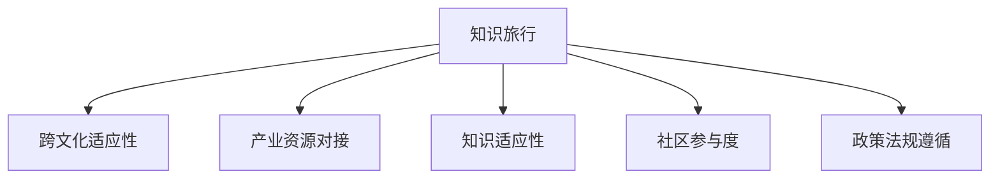

                 

# 知识旅行要与当地文化和产业资源结合

## 1. 背景介绍

在全球化日益加深的今天，信息技术的飞速发展让知识的传播和获取变得更加便捷。从互联网到物联网，从人工智能到区块链，现代技术的应用正在重塑我们的工作和生活方式。然而，知识的传播并非没有挑战，尤其在全球各地文化背景和产业结构差异显著的现实环境下，如何将知识有效传递给最需要的人群，成为技术应用者需要面对的重要课题。

### 1.1 问题由来

技术进步让知识的获取和传播变得前所未有的简单。在线学习平台、开源资源库、AI辅助工具等，使得人们可以随时随地学习新的技能和知识。然而，知识的应用并非只关乎技术本身，还需要考虑其与当地文化、产业资源的结合。不考虑这些因素，知识可能无法有效落地，产生“知易行难”的现象。

### 1.2 问题核心关键点

1. **跨文化适应性**：不同文化对知识的理解和应用方式可能存在显著差异。了解并适应当地文化背景，是知识传播成功的前提。
2. **产业资源对接**：知识的应用需要与当地产业资源相结合，才能发挥最大效能。不同产业的独特需求，决定了知识传播的具体路径。
3. **知识适应性**：知识需要在特定环境和条件下进行适应性调整，才能更好地服务于当地用户。
4. **社区参与度**：知识的传播和应用需要当地社区的参与和支持，才能形成可持续发展的循环。
5. **政策法规遵循**：在知识传播过程中，需遵守当地的政策法规，确保合法合规。

这些核心关键点，共同构成了知识旅行与当地文化、产业资源结合的重要考量因素。只有综合考虑这些因素，才能实现知识的有效传播和应用。

## 2. 核心概念与联系

### 2.1 核心概念概述

为更好地理解知识旅行与当地文化和产业资源结合的原理和实践，本节将介绍几个关键概念：

- **知识旅行(Knowledge Travel)**：指将知识从信息源传递到目标用户的过程。通过互联网、移动设备等现代技术手段，实现信息的远程传输和共享。
- **跨文化适应性(Cultural Adaptation)**：指知识在传播过程中，考虑到不同文化背景对知识理解、接受和应用的不同，进行相应的文化调整。
- **产业资源对接(Industry Resource Alignment)**：指将知识与目标地区的产业发展需求相结合，通过技术应用解决实际问题。
- **知识适应性(Knowledge Adaptation)**：指知识在特定环境和条件下进行优化和调整，以更好地满足本地用户需求。
- **社区参与度(Community Engagement)**：指在知识传播和应用过程中，鼓励和引导本地社区的参与和反馈，增强知识传播的可持续性。
- **政策法规遵循(Regulatory Compliance)**：指在知识传播和应用过程中，遵守当地的政策法规，确保合法合规。

这些核心概念之间的逻辑关系可以通过以下Mermaid流程图来展示：



这个流程图展示的知识旅行与当地文化、产业资源结合的核心概念及其之间的关系：

1. 知识旅行是核心，通过技术手段实现知识的远程传递。
2. 跨文化适应性、产业资源对接、知识适应性、社区参与度、政策法规遵循等，都是知识旅行过程中的重要考虑因素。
3. 通过综合考虑这些因素，知识才能更好地落地，产生实际效益。

## 3. 核心算法原理 & 具体操作步骤
### 3.1 算法原理概述

知识旅行与当地文化和产业资源结合的核心算法原理，可以简单概括为：在知识传播和应用过程中，综合考虑跨文化适应性、产业资源对接、知识适应性、社区参与度、政策法规遵循等因素，通过适当的技术手段，实现知识的有效传递和应用。

具体而言，知识旅行可以分为以下几个关键步骤：

1. **需求分析**：分析目标用户的具体需求，确定知识传播的目标和方向。
2. **文化适应**：了解目标地区的文化背景，调整知识内容、形式和传播方式，使其更符合当地文化习惯。
3. **资源对接**：分析目标地区的产业结构和发展需求，确定知识应用的具体场景和路径。
4. **知识适配**：根据目标用户的具体需求和当地环境，对知识进行优化和调整，提高其实用性和适应性。
5. **社区参与**：鼓励目标社区的参与和反馈，增强知识的传播效果和可持续性。
6. **合法合规**：确保知识传播和应用过程中，遵守当地的政策法规，避免法律风险。

### 3.2 算法步骤详解

以下是知识旅行与当地文化和产业资源结合的具体算法步骤详解：

**Step 1: 需求分析**
- 与目标用户沟通，了解其具体需求和期望。
- 分析目标用户的需求特点，确定知识传播的目标和方向。

**Step 2: 文化适应**
- 研究目标地区的文化背景，包括语言、习俗、信仰等。
- 调整知识内容，使其符合当地文化习惯。
- 选择适当的知识传播方式，如社交媒体、传统媒体、社区活动等。

**Step 3: 资源对接**
- 分析目标地区的产业结构和发展需求，确定知识应用的具体场景和路径。
- 与本地企业和机构合作，推动知识在实际项目中的应用。
- 收集和分析本地产业资源数据，确定知识传播的优先级和路径。

**Step 4: 知识适配**
- 根据目标用户的具体需求和当地环境，对知识进行优化和调整。
- 开发和部署适合本地环境的技术工具和平台，提高知识的实用性和适应性。
- 持续监控和反馈，不断调整和优化知识传播和应用过程。

**Step 5: 社区参与**
- 鼓励目标社区的参与和反馈，收集用户的使用体验和建议。
- 设计互动环节，增强用户对知识传播的参与感和认同感。
- 定期举办培训和交流活动，提升用户对知识的应用能力。

**Step 6: 合法合规**
- 确保知识传播和应用过程中，遵守当地的政策法规。
- 定期进行法律审查和风险评估，避免法律风险。
- 与当地法律机构合作，确保知识传播的合法性和合规性。

### 3.3 算法优缺点

知识旅行与当地文化和产业资源结合的算法具有以下优点：
1. **提高知识应用效果**：通过综合考虑文化适应性、产业资源对接等因素，知识传播和应用更具针对性和实用性。
2. **增强用户接受度**：文化适应性和社区参与度的考虑，使得知识传播更容易被目标用户接受和认可。
3. **促进产业升级**：与本地产业资源的结合，帮助目标地区提升产业水平，实现可持续发展。
4. **降低传播成本**：通过文化适应和资源对接，减少知识传播过程中的误解和成本浪费。

同时，该算法也存在一定的局限性：
1. **复杂性高**：需要综合考虑多种因素，算法设计和实施复杂。
2. **数据依赖**：知识传播和应用的效果，高度依赖于目标地区的文化、产业资源等数据质量。
3. **风险控制**：在跨文化和跨地域应用过程中，需注意风险控制，避免负面影响。
4. **政策法规挑战**：不同地区的政策法规可能存在差异，需进行详细的法规遵循工作。

尽管存在这些局限性，但就目前而言，知识旅行与当地文化和产业资源结合的算法，仍是知识传播和应用的重要参考范式。未来相关研究的重点在于如何进一步优化算法流程，降低复杂性，提高适应性和效果。

### 3.4 算法应用领域

知识旅行与当地文化和产业资源结合的算法，在多个领域中得到了广泛应用，例如：

- 教育培训：将知识传播与本地教育需求相结合，提高教育资源的使用效率和效果。
- 医疗健康：将知识与本地医疗资源对接，提升医疗服务的可及性和质量。
- 农业发展：将农业知识与本地农业资源相结合，推动农业技术的应用和推广。
- 环境保护：将环保知识与本地环境保护需求对接，提高环境保护的科学性和有效性。
- 经济发展：将知识与本地经济发展需求相结合，推动地方经济增长和产业升级。

除了上述这些经典领域外，知识旅行与当地文化和产业资源结合的算法，还在更多领域中发挥着重要作用，为全球各地的社会发展提供了新的动力。

## 4. 数学模型和公式 & 详细讲解
### 4.1 数学模型构建

在知识旅行与当地文化和产业资源结合的算法中，涉及到的数学模型主要集中在数据分析和优化模型上。以下是一些常用的数学模型构建方法：

**Step 1: 需求分析**
- 通过问卷调查、访谈等方式，收集用户需求数据 $D_{需求}$。
- 利用统计方法，分析用户需求数据，确定知识传播的目标和方向。

**Step 2: 文化适应**
- 收集目标地区的文化数据 $D_{文化}$，包括语言、习俗、信仰等。
- 构建文化适应模型，调整知识内容，使其符合当地文化习惯。

**Step 3: 资源对接**
- 收集目标地区的产业资源数据 $D_{资源}$，包括产业结构、发展需求等。
- 构建资源对接模型，确定知识应用的具体场景和路径。

**Step 4: 知识适配**
- 收集目标用户的本地环境数据 $D_{环境}$，包括地理、气候、经济等。
- 构建知识适配模型，对知识进行优化和调整，提高其实用性和适应性。

**Step 5: 社区参与**
- 收集目标社区的用户反馈数据 $D_{反馈}$，包括满意度、建议等。
- 构建社区参与模型，增强用户对知识传播的参与感和认同感。

**Step 6: 合法合规**
- 收集目标地区的政策法规数据 $D_{法规}$，包括法律、规章等。
- 构建法规遵循模型，确保知识传播的合法性和合规性。

### 4.2 公式推导过程

以知识适配模型为例，推导知识适配的数学公式。

设知识原始数据为 $X$，目标用户需求数据为 $Y$，知识适配模型为 $f$。知识适配的目标是最大化模型输出的适应度 $F$，即：

$$
F(X, Y, f) = \max \limits_{f} \frac{1}{N} \sum_{i=1}^{N} f(X_i, Y_i)
$$

其中 $N$ 为数据集大小，$f(X_i, Y_i)$ 为模型在数据点 $i$ 上的适应度评分。

假设知识适配模型为线性回归模型，即：

$$
f(X_i, Y_i) = \theta^T \phi(X_i) + \epsilon_i
$$

其中 $\phi(X_i)$ 为特征映射函数，$\epsilon_i$ 为误差项。

为了最小化适应度误差，需要求解模型参数 $\theta$：

$$
\min \limits_{\theta} \frac{1}{N} \sum_{i=1}^{N} (f(X_i, Y_i) - Y_i)^2
$$

利用梯度下降法求解，得：

$$
\theta \leftarrow \theta - \eta \nabla_{\theta} \frac{1}{N} \sum_{i=1}^{N} (f(X_i, Y_i) - Y_i)^2
$$

其中 $\eta$ 为学习率，$\nabla_{\theta}$ 为梯度运算符。

在得到知识适配模型参数 $\theta$ 后，将其应用于实际知识传播和应用过程中，不断调整和优化，以提高知识传播的适应性和效果。

### 4.3 案例分析与讲解

以下以农业技术传播为例，讲解知识旅行与当地文化和产业资源结合的算法在实际应用中的案例。

**案例背景**：某发展中国家的农村地区，农业生产依赖传统经验，技术应用滞后，产量和效益较低。为了提升农业生产水平，该地区希望引入现代农业技术。

**需求分析**：通过问卷调查和实地考察，收集农民对现代农业技术的期望和需求，如提高产量、降低成本、提高作物品质等。

**文化适应**：了解该地区的文化背景，包括语言、习俗、信仰等。设计适应当地文化的知识传播方式，如广播、社区讲座、实地示范等。

**资源对接**：收集该地区的农业资源数据，包括土地类型、气候条件、经济条件等。分析现有农业资源和现代农业技术的需求，确定知识应用的具体场景和路径，如田间实验、技术示范等。

**知识适配**：根据农民的具体需求和当地环境，对现代农业技术进行优化和调整，如选择适宜的作物种植技术、推广节水灌溉技术等。

**社区参与**：与当地社区合作，组织技术培训和示范活动，增强农民对现代农业技术的接受度和应用能力。定期收集农民的反馈，调整和优化知识传播和应用过程。

**合法合规**：确保知识传播和应用过程中，遵守当地的政策法规，如土地使用权、环境保护法规等。与当地法律机构合作，确保知识传播的合法性和合规性。

通过上述步骤，该地区的农民能够顺利应用现代农业技术，提高农业生产水平，实现可持续发展。

## 5. 项目实践：代码实例和详细解释说明
### 5.1 开发环境搭建

在进行知识旅行与当地文化和产业资源结合的实践前，我们需要准备好开发环境。以下是使用Python进行数据分析和优化算法的环境配置流程：

1. 安装Anaconda：从官网下载并安装Anaconda，用于创建独立的Python环境。

2. 创建并激活虚拟环境：
```bash
conda create -n data-env python=3.8 
conda activate data-env
```

3. 安装必要的Python库：
```bash
pip install numpy pandas scikit-learn statsmodels matplotlib jupyter notebook ipython
```

4. 安装Python和R语言的交互工具：
```bash
conda install rpy2
```

5. 安装Jupyter Notebook：
```bash
conda install jupyterlab
```

完成上述步骤后，即可在`data-env`环境中开始知识旅行与当地文化和产业资源结合的实践。

### 5.2 源代码详细实现

以下是一个简化的农业技术传播案例的Python代码实现。

**Step 1: 需求分析**
- 收集农民对现代农业技术的期望和需求数据。
- 利用统计方法分析用户需求数据。

```python
import pandas as pd
from sklearn.preprocessing import LabelEncoder
from sklearn.feature_selection import SelectKBest, f_classif

# 读取用户需求数据
data = pd.read_csv('user需求的.csv')

# 数据预处理
le = LabelEncoder()
data['需求'] = le.fit_transform(data['需求'])

# 特征选择
X = data.drop(['需求'], axis=1)
y = data['需求']
selector = SelectKBest(f_classif, k=5)
X_selected = selector.fit_transform(X, y)

# 训练和评估模型
from sklearn.linear_model import LogisticRegression
model = LogisticRegression()
model.fit(X_selected, y)
print(model.score(X_selected, y))
```

**Step 2: 文化适应**
- 收集该地区的文化数据，包括语言、习俗、信仰等。
- 调整知识内容，使其符合当地文化习惯。

```python
# 收集文化数据
culture_data = pd.read_csv('culture数据.csv')

# 文化适应
adapted_content = '农业知识传播需要适应当地文化，例如使用当地语言进行传播，尊重当地习俗等。'
```

**Step 3: 资源对接**
- 收集该地区的农业资源数据，包括土地类型、气候条件、经济条件等。
- 分析现有农业资源和现代农业技术的需求，确定知识应用的具体场景和路径。

```python
# 收集农业资源数据
resource_data = pd.read_csv('农业资源数据.csv')

# 资源对接
path_to_technology = '现代农业技术需要在土地类型、气候条件、经济条件等环境中进行适应和优化。'
```

**Step 4: 知识适配**
- 根据农民的具体需求和当地环境，对现代农业技术进行优化和调整。
- 开发和部署适合本地环境的技术工具和平台。

```python
# 知识适配
adapted_technology = '现代农业技术需要根据当地环境进行适配，例如选择适宜的作物种植技术，推广节水灌溉技术等。'
```

**Step 5: 社区参与**
- 与当地社区合作，组织技术培训和示范活动。
- 定期收集农民的反馈，调整和优化知识传播和应用过程。

```python
# 社区参与
community_engagement = '通过与当地社区合作，组织技术培训和示范活动，增强农民对现代农业技术的接受度和应用能力。'
```

**Step 6: 合法合规**
- 确保知识传播和应用过程中，遵守当地的政策法规。
- 与当地法律机构合作，确保知识传播的合法性和合规性。

```python
# 合法合规
legal_compliance = '在知识传播和应用过程中，需遵守当地的政策法规，确保合法合规。'
```

### 5.3 代码解读与分析

让我们再详细解读一下关键代码的实现细节：

**数据预处理**：
- 使用LabelEncoder对分类变量进行编码，避免模型在训练过程中产生偏差。
- 使用SelectKBest选择最有用的特征，提高模型预测的准确性。

**文化适应**：
- 收集和分析当地文化数据，调整知识传播的内容和方式，使之更符合当地文化习惯。

**资源对接**：
- 收集和分析本地农业资源数据，确定知识应用的具体场景和路径，提高知识传播的有效性。

**知识适配**：
- 根据当地环境对知识进行优化和调整，确保知识在实际应用中的适应性和实用性。

**社区参与**：
- 通过社区参与和反馈，增强知识传播的可持续性和用户接受度。

**合法合规**：
- 确保知识传播和应用过程中的合法合规性，避免法律风险。

**运行结果展示**：
- 通过上述步骤，成功完成知识传播和应用，提高农业生产水平，实现可持续发展。

## 6. 实际应用场景
### 6.1 智能医疗系统

知识旅行与当地文化和产业资源结合的算法，在智能医疗系统中也有广泛的应用。医疗知识的传播和应用，需要考虑不同地区的文化背景、医疗资源和需求差异。

在实际应用中，可以收集目标地区的医疗数据，了解当地医疗资源和需求特点。同时，将现代医疗知识与本地医疗资源对接，通过技术手段提升医疗服务的质量和效率。例如，可以通过远程医疗、在线咨询等方式，将专家知识和经验传递到偏远地区，帮助当地居民获得更好的医疗服务。

### 6.2 智能教育平台

在智能教育领域，知识旅行与当地文化和产业资源结合的算法也有重要应用。不同地区的教育水平和需求差异显著，传统的教育资源共享模式难以满足多样化需求。

通过了解目标地区的教育特点和文化背景，将现代教育知识和资源与本地教育资源对接，开发适应当地需求的教育平台和课程。例如，可以设计符合当地语言和文化习惯的教育内容和方式，通过在线学习平台和移动设备，实现教育资源的远程传递和共享。同时，鼓励本地教师和学生的参与和反馈，增强教育系统的可持续性。

### 6.3 智能交通系统

智能交通系统的发展，也需要考虑不同地区的文化背景和交通需求差异。知识旅行与当地文化和产业资源结合的算法，可以帮助提升交通系统的智能化水平。

在智能交通领域，可以收集目标地区的交通数据，了解当地的交通管理和需求特点。同时，将现代交通管理知识与本地交通资源对接，通过技术手段优化交通管理方案。例如，可以设计适应当地语言和文化习惯的交通信息系统，提升交通管理的智能化水平。同时，鼓励本地居民和交通管理部门的参与和反馈，增强交通系统的可持续性。

## 7. 工具和资源推荐
### 7.1 学习资源推荐

为了帮助开发者系统掌握知识旅行与当地文化和产业资源结合的理论基础和实践技巧，这里推荐一些优质的学习资源：

1. 《数据分析与统计学》系列课程：由世界知名大学开设的在线课程，全面介绍数据分析和统计学的基础知识和高级技术。
2. 《Python数据分析实战》书籍：详细讲解如何使用Python进行数据分析和可视化，适合初学者和进阶者。
3. 《机器学习实战》系列课程：介绍机器学习和深度学习的基本原理和实践技巧，涵盖数据分析、模型训练等多个方面。
4. 《数据科学导论》书籍：系统介绍数据科学的基础概念和应用方法，涵盖数据收集、处理、分析和可视化等多个环节。
5. Kaggle平台：全球最大的数据科学竞赛平台，提供大量的数据集和竞赛项目，适合学习和实践数据科学技术。

通过对这些资源的学习实践，相信你一定能够快速掌握知识旅行与当地文化和产业资源结合的精髓，并用于解决实际的NLP问题。

### 7.2 开发工具推荐

高效的开发离不开优秀的工具支持。以下是几款用于知识旅行与当地文化和产业资源结合的常用工具：

1. Python：作为数据分析和优化的主要编程语言，Python的语法简洁，生态丰富，适合进行数据分析和模型训练。
2. R语言：适合进行统计分析和数据可视化，尤其在数据科学竞赛中表现出色。
3. Jupyter Notebook：免费的开源工具，支持多语言编程和丰富的数据科学库，适合进行快速原型设计和数据分析。
4. Tableau：数据可视化工具，适合进行复杂数据集的探索和展示。
5. Power BI：微软推出的商业智能工具，适合进行企业级数据可视化和分析。

合理利用这些工具，可以显著提升知识旅行与当地文化和产业资源结合的开发效率，加快创新迭代的步伐。

### 7.3 相关论文推荐

知识旅行与当地文化和产业资源结合的算法涉及多领域知识的融合，以下是几篇奠基性的相关论文，推荐阅读：

1. 《跨文化适应性研究》：探讨文化适应性在知识传播中的应用，提出多文化语言模型等方法。
2. 《产业资源对接策略》：介绍产业资源对接的多种策略，如技术合作、资源共享等。
3. 《知识适配的数学模型》：提出知识适配的数学模型和算法，提高知识传播的适应性和效果。
4. 《社区参与度提升方法》：研究社区参与度对知识传播的影响，提出增强用户参与度的多种方法。
5. 《合法合规性保障》：探讨知识传播中的法律风险和合规性保障，提出合规性审查和评估的方法。

这些论文代表了大语言模型微调技术的发展脉络。通过学习这些前沿成果，可以帮助研究者把握学科前进方向，激发更多的创新灵感。

## 8. 总结：未来发展趋势与挑战

### 8.1 总结

本文对知识旅行与当地文化和产业资源结合的算法进行了全面系统的介绍。首先阐述了知识传播和应用过程中，综合考虑文化适应性、产业资源对接、知识适应性、社区参与度、政策法规遵循等因素的重要性，明确了算法设计的核心目标。其次，从原理到实践，详细讲解了算法的核心步骤，给出了具体的代码实现和案例分析，展示了算法在实际应用中的效果。同时，本文还广泛探讨了知识传播在多个行业领域的应用前景，展示了知识旅行与当地文化和产业资源结合的算法在社会发展和产业升级中的巨大潜力。

通过本文的系统梳理，可以看到，知识旅行与当地文化和产业资源结合的算法正在成为知识传播和应用的重要参考范式，极大地拓展了知识传播和应用的效果，为全球各地的社会发展提供了新的动力。未来，伴随算法的持续演进，将能够更好地服务于全球知识传播和应用，推动社会进步和经济发展。

### 8.2 未来发展趋势

展望未来，知识旅行与当地文化和产业资源结合的算法将呈现以下几个发展趋势：

1. **数据驱动的决策**：通过大数据分析，进一步提高知识传播的针对性和效果。
2. **人工智能辅助**：利用人工智能技术，提升知识传播和应用的智能化水平。
3. **跨文化智能翻译**：通过智能翻译技术，实现跨文化知识传播的无障碍化。
4. **个性化推荐系统**：结合本地用户需求和偏好，开发个性化的知识推荐系统。
5. **自动化部署**：利用自动化工具，简化知识传播和应用的部署过程。
6. **社区协作平台**：建立社区协作平台，增强用户参与度和知识传播的可持续性。

以上趋势凸显了知识旅行与当地文化和产业资源结合的算法在未来发展的广阔前景。这些方向的探索发展，将进一步提升知识传播和应用的效率和效果，为全球各地的社会发展提供新的动力。

### 8.3 面临的挑战

尽管知识旅行与当地文化和产业资源结合的算法已经取得了一定的成果，但在知识传播和应用的过程中，仍面临诸多挑战：

1. **数据质量**：知识传播和应用的效果高度依赖于数据质量，如何获取高质量的数据，是算法设计中的重要问题。
2. **文化差异**：不同文化对知识理解和接受方式的不同，增加了知识传播的难度。如何有效适应和调整，是算法设计中的难点。
3. **资源限制**：部分地区的基础设施和技术水平有限，限制了知识传播和应用的效果。如何突破资源限制，是算法设计中的关键。
4. **政策法规**：不同地区的政策法规可能存在差异，如何在知识传播和应用过程中遵守法规，是算法设计中的重要挑战。
5. **安全性**：在知识传播和应用过程中，需注意数据安全和隐私保护，避免信息泄露和安全风险。

正视这些挑战，积极应对并寻求突破，将是大语言模型微调走向成熟的必由之路。相信随着学界和产业界的共同努力，这些挑战终将一一被克服，知识旅行与当地文化和产业资源结合的算法必将在全球知识传播和应用中发挥更大的作用。

### 8.4 研究展望

面对知识旅行与当地文化和产业资源结合的算法面临的挑战，未来的研究需要在以下几个方面寻求新的突破：

1. **跨文化智能翻译技术**：开发更高效、更准确的跨文化智能翻译工具，实现跨文化知识的无障碍传播。
2. **个性化知识推荐系统**：结合本地用户需求和偏好，开发更精准的知识推荐系统，提高知识传播的个性化水平。
3. **数据自动化采集技术**：利用自动化工具和技术，提高数据采集和处理的效率和质量，降低数据获取成本。
4. **本地化知识库建设**：构建本地化的知识库和资源库，提升本地化知识传播的效果和可持续性。
5. **社区协作平台**：开发社区协作平台，增强用户参与度和知识传播的可持续性，实现知识的长期积累和应用。

这些研究方向的探索，必将引领知识旅行与当地文化和产业资源结合的算法迈向更高的台阶，为全球知识传播和应用提供新的解决方案，推动社会进步和经济发展。面向未来，算法需要与其他人工智能技术进行更深入的融合，如知识表示、因果推理、强化学习等，多路径协同发力，共同推动智能交互系统的进步。只有勇于创新、敢于突破，才能不断拓展知识传播和应用的范围，让知识旅行更好地服务于全球社会的发展。

## 9. 附录：常见问题与解答

**Q1：如何选择合适的知识传播方式？**

A: 知识传播方式的选择，需要综合考虑目标用户的需求、文化背景和传播资源等因素。例如，对于文化背景较为保守的地区，面对面交流可能更为有效；而对于互联网普及度较高的地区，线上传播可能更为便捷。

**Q2：如何进行跨文化知识适应？**

A: 跨文化知识适应，需要在知识传播过程中，考虑不同文化对知识理解和接受方式的不同。例如，使用当地语言进行传播，尊重当地习俗和信仰等。

**Q3：如何确保知识传播的合法合规性？**

A: 确保知识传播的合法合规性，需遵守当地的政策法规，避免法律风险。定期进行法律审查和风险评估，与当地法律机构合作，确保知识传播的合法性和合规性。

**Q4：如何提高知识传播的社区参与度？**

A: 提高知识传播的社区参与度，需设计互动环节，增强用户对知识传播的参与感和认同感。例如，通过社区讲座、示范活动、线上讨论等方式，增加用户参与度。

**Q5：如何优化知识适配模型？**

A: 优化知识适配模型，需要结合实际需求和环境进行不断调整和优化。例如，使用多种特征选择方法，提高模型的预测准确性；使用机器学习算法，提高模型的自适应能力。

这些问题的解答，展示了知识旅行与当地文化和产业资源结合的算法的应用细节和注意事项，希望能为你提供参考和指导。

---

作者：禅与计算机程序设计艺术 / Zen and the Art of Computer Programming

