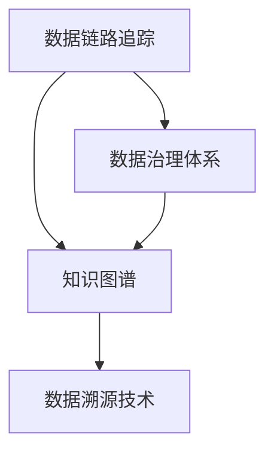

                 

# 知识溯源：追踪信息的来龙去脉

> 关键词：知识溯源, 信息追踪, 数据链路, 知识图谱, 数据治理, 数据资产, 数据溯源

## 1. 背景介绍

### 1.1 问题由来
在当今数字化时代，信息无处不在。从社交媒体到新闻网站，从企业内部系统到政府公开数据，我们每天产生和消费的海量信息构成了一个庞大的数据生态。然而，信息并非孤立存在，它们彼此关联，形成一个错综复杂的信息网络。如何有效地追踪和分析信息来龙去脉，成为了一个重要的研究课题。

在企业、科研、政府等领域，追踪信息来源和流向的需求日益增加。例如，企业需要了解其客户数据和业务操作信息是如何生成的，以便进行数据质量管理和合规性检查；科研人员需要追溯实验数据和文献引用来源，以验证研究结论的可靠性；政府则需要追踪公共数据的发布和流转，以确保信息透明和数据安全。

### 1.2 问题核心关键点
知识溯源的核心在于构建一个能够追踪数据和信息来源、流转和使用的系统。该系统通过自动化和规范化的方法，能够帮助用户追溯任何数据或信息，从生成到使用再到销毁的完整历程。关键技术点包括：

- 数据链路追踪：自动化记录数据的来源和流转路径。
- 知识图谱构建：利用图结构表示信息之间的复杂关系。
- 数据治理体系：制定数据标准和政策，保障数据质量和安全。
- 数据溯源技术：利用哈希、区块链等技术保证数据的不可篡改性。

## 2. 核心概念与联系

### 2.1 核心概念概述

为更好地理解知识溯源系统，本节将介绍几个密切相关的核心概念：

- **数据链路追踪**：追踪数据的生成、流转、使用等全生命周期活动，构建数据链路图。
- **知识图谱**：使用图结构表示信息之间的复杂关系，如实体、关系、属性等。
- **数据治理体系**：制定数据标准和政策，保障数据的质量、安全性和合规性。
- **数据溯源技术**：利用哈希、区块链等技术保证数据的不可篡改性。

这些核心概念之间的逻辑关系可以通过以下Mermaid流程图来展示：



这个流程图展示了大语言模型的核心概念及其之间的关系：

1. 数据链路追踪是构建知识图谱和数据治理体系的基础。
2. 知识图谱为数据治理提供结构化视角，帮助理解数据之间的关系和依赖。
3. 数据治理体系制定标准和政策，保障数据质量和安全性。
4. 数据溯源技术保证数据的不可篡改性，增强数据的可信度。

这些概念共同构成了知识溯源系统的核心，使得我们能够追踪和验证任何数据或信息的来源和流向。

## 3. 核心算法原理 & 具体操作步骤

### 3.1 算法原理概述

知识溯源系统的核心算法原理主要包括以下几个方面：

- **数据链路追踪算法**：记录数据的生成、流转、使用等全生命周期活动，构建数据链路图。
- **知识图谱构建算法**：利用图结构表示信息之间的复杂关系，如实体、关系、属性等。
- **数据治理算法**：制定数据标准和政策，保障数据的质量、安全性和合规性。
- **数据溯源算法**：利用哈希、区块链等技术保证数据的不可篡改性。

这些算法共同构成了知识溯源系统的核心，使得我们能够追踪和验证任何数据或信息的来源和流向。

### 3.2 算法步骤详解

#### 数据链路追踪算法

1. **数据源标识**：记录数据的生成时间和来源。
2. **流转路径追踪**：记录数据的流转路径，包括生成、处理、存储和使用的所有环节。
3. **流转节点关联**：将数据生成和使用节点关联起来，构建数据链路图。
4. **数据链路验证**：定期更新和验证数据链路图，确保数据的完整性和一致性。

#### 知识图谱构建算法

1. **实体识别**：从文本和数据中自动识别出实体，如人名、地名、组织名等。
2. **关系抽取**：从文本和数据中提取实体之间的关系，如“出生于”、“工作于”等。
3. **属性标注**：为实体和关系标注属性信息，如人名中的性别、年龄等。
4. **知识图谱融合**：将不同来源的知识图谱进行融合，构建统一的知识图谱。

#### 数据治理算法

1. **数据标准制定**：制定数据治理标准，包括数据质量、安全、合规等方面的要求。
2. **数据治理执行**：根据标准执行数据治理任务，如数据清洗、去重、加密等。
3. **数据治理审计**：定期审计数据治理过程和结果，确保数据治理的效果。

#### 数据溯源算法

1. **哈希计算**：对数据进行哈希计算，生成唯一的数据指纹。
2. **区块链存储**：将数据指纹存储在区块链上，形成不可篡改的数据链。
3. **数据链查询**：根据数据指纹查询数据链，获取数据的完整溯源信息。

### 3.3 算法优缺点

知识溯源系统的算法具有以下优点：

- **全面覆盖**：能够追踪和验证数据的生成、流转和使用全生命周期。
- **自动化执行**：通过算法自动记录和验证数据链路，减少人工干预。
- **数据可信度提升**：通过数据溯源技术确保数据的不可篡改性，提高数据的可信度。

同时，该算法也存在以下局限性：

- **复杂度高**：需要记录和处理大量的数据流转信息，算法复杂度较高。
- **数据量大**：数据链路和知识图谱的构建需要处理大量的数据，对存储和计算资源要求较高。
- **维护成本高**：需要定期更新和验证数据链路图和知识图谱，维护成本较高。

尽管存在这些局限性，但就目前而言，知识溯源算法仍然是大数据时代追踪信息来源和流向的主流方法。未来相关研究将聚焦于如何进一步降低算法的复杂度，提高其效率和可维护性。

### 3.4 算法应用领域

知识溯源算法在多个领域中得到了广泛应用，具体包括：

- **数据管理和分析**：在企业内部系统中追踪数据来源和流转路径，进行数据治理和质量管理。
- **科研数据分析**：在科学研究中追踪实验数据和文献引用来源，验证研究结论的可靠性。
- **政府数据管理**：在政府公开数据中追踪数据的发布和流转路径，确保数据透明和数据安全。
- **金融数据分析**：在金融交易中追踪数据的生成和流转路径，进行合规性和风险控制。

## 4. 数学模型和公式 & 详细讲解 & 举例说明

### 4.1 数学模型构建

知识溯源系统中的数学模型主要包括以下几个部分：

- **数据链路图模型**：使用有向无环图(DAG)表示数据的生成和流转路径。
- **知识图谱模型**：使用图结构表示实体、关系和属性，构建知识图谱。
- **数据治理模型**：制定数据标准和政策，制定数据治理规则。
- **数据溯源模型**：利用哈希、区块链等技术，生成和查询数据指纹。

### 4.2 公式推导过程

#### 数据链路图模型

1. **有向无环图表示**：数据链路图可以用有向无环图(DAG)表示，其中节点表示数据流转环节，有向边表示数据流转方向。
2. **节点关联计算**：节点之间的关联可以通过有向边的权重表示，如“生成”的权重为1，“使用”的权重为2。

**公式推导**：

设数据链路图为$G=(V,E)$，其中$V$为节点集合，$E$为边集合。节点$v_i$的生成和流转关系可以表示为：

$$
G(v_i) = \{(v_j, w_j) | w_j = 1, v_j \in G(v_i) \} \cup \{(v_j, w_j) | w_j = 2, v_j \in G(v_i) \}
$$

其中，$G(v_i)$表示节点$v_i$的生成和流转关系。

#### 知识图谱模型

1. **实体表示**：使用节点表示实体，如人名、地名、组织名等。
2. **关系表示**：使用有向边表示实体之间的关系，如“出生于”、“工作于”等。
3. **属性表示**：为实体和关系标注属性，如人名中的性别、年龄等。

**公式推导**：

设知识图谱为$K=(V,E,A)$，其中$V$为实体节点集合，$E$为关系边集合，$A$为属性集合。实体的关系表示可以表示为：

$$
R(v_i) = \{(v_j, w_j) | w_j \in R \land v_j \in R(v_i) \}
$$

其中，$R(v_i)$表示节点$v_i$的关系集合。

#### 数据治理模型

1. **数据标准制定**：制定数据治理标准，如数据质量要求、安全要求、合规要求等。
2. **数据治理执行**：根据标准执行数据治理任务，如数据清洗、去重、加密等。

**公式推导**：

设数据治理标准为$S=\{s_i\}$，数据治理执行过程为$T=\{t_j\}$。数据治理的执行过程可以表示为：

$$
T(S) = \{t_j | \exists s_i \in S \land t_j \in T(s_i)\}
$$

其中，$T(S)$表示数据治理的执行过程集合。

#### 数据溯源模型

1. **哈希计算**：对数据进行哈希计算，生成唯一的数据指纹。
2. **区块链存储**：将数据指纹存储在区块链上，形成不可篡改的数据链。
3. **数据链查询**：根据数据指纹查询数据链，获取数据的完整溯源信息。

**公式推导**：

设数据指纹为$F=f(v_i)$，数据链为$C=\{c_j\}$。数据溯源过程可以表示为：

$$
C(F) = \{c_j | \exists v_i \in V \land F(v_i) = c_j\}
$$

其中，$C(F)$表示数据指纹$F$对应的数据链。

### 4.3 案例分析与讲解

以一个简单的数据链路追踪案例为例，说明知识溯源系统的数学模型和算法步骤：

**案例背景**：一家公司记录员工的工作轨迹，需要追踪员工从入职到离职的全生命周期活动。

1. **数据链路图构建**：
   - 记录员工入职、离职、调动等活动，构建数据链路图。
   - 数据链路图可以使用DAG表示，节点表示活动，有向边表示活动顺序。

2. **知识图谱构建**：
   - 从员工档案中提取实体，如员工姓名、部门名称、职位等。
   - 提取员工之间的关系，如“入职”、“调动”、“离职”等。
   - 为实体和关系标注属性，如员工姓名中的性别、年龄等。

3. **数据治理**：
   - 制定数据质量标准，如员工的姓名、部门名称必须为规范格式。
   - 执行数据清洗任务，去除重复的记录和异常值。
   - 对敏感信息进行加密处理，保护员工隐私。

4. **数据溯源**：
   - 对员工档案进行哈希计算，生成唯一的数据指纹。
   - 将数据指纹存储在区块链上，形成不可篡改的数据链。
   - 根据数据指纹查询数据链，获取员工的完整工作轨迹。

## 5. 项目实践：代码实例和详细解释说明

### 5.1 开发环境搭建

在进行知识溯源系统的开发前，我们需要准备好开发环境。以下是使用Python进行PyTorch开发的环境配置流程：

1. 安装Anaconda：从官网下载并安装Anaconda，用于创建独立的Python环境。

2. 创建并激活虚拟环境：
```bash
conda create -n pytorch-env python=3.8 
conda activate pytorch-env
```

3. 安装PyTorch：根据CUDA版本，从官网获取对应的安装命令。例如：
```bash
conda install pytorch torchvision torchaudio cudatoolkit=11.1 -c pytorch -c conda-forge
```

4. 安装TensorFlow：从官网下载并安装TensorFlow，支持TensorFlow版本为2.x。

5. 安装TensorBoard：TensorFlow配套的可视化工具，可实时监测模型训练状态，并提供丰富的图表呈现方式。

6. 安装Gunicorn：Python的异步Web服务器，用于部署Web应用。

7. 安装Flask：轻量级的Web框架，用于构建Web服务。

完成上述步骤后，即可在`pytorch-env`环境中开始知识溯源系统的开发。

### 5.2 源代码详细实现

这里我们以一个简单的知识图谱构建为例，给出使用PyTorch实现的知识图谱构建代码。

```python
import torch
import torch.nn as nn
import torch.optim as optim
from torch_geometric.data import Data, DataLoader

# 定义实体和关系类
class Entity(nn.Module):
    def __init__(self, num_entities):
        super(Entity, self).__init__()
        self.num_entities = num_entities
        self.entity_embeddings = nn.Embedding(num_entities, 128)
        self.entity_transform = nn.Linear(128, 128)
    
    def forward(self, x):
        return self.entity_transform(self.entity_embeddings(x))

class Relation(nn.Module):
    def __init__(self, num_relations):
        super(Relation, self).__init__()
        self.num_relations = num_relations
        self.relation_embeddings = nn.Embedding(num_relations, 128)
        self.relation_transform = nn.Linear(128, 128)
    
    def forward(self, x):
        return self.relation_transform(self.relation_embeddings(x))

# 定义知识图谱类
class KnowledgeGraph(nn.Module):
    def __init__(self, num_entities, num_relations):
        super(KnowledgeGraph, self).__init__()
        self.num_entities = num_entities
        self.num_relations = num_relations
        self.entity = Entity(num_entities)
        self.relation = Relation(num_relations)
    
    def forward(self, x, y):
        entity_embeddings = self.entity(x)
        relation_embeddings = self.relation(y)
        return entity_embeddings, relation_embeddings

# 加载数据
data = Data(x=torch.tensor([0, 1, 2]), y=torch.tensor([0, 1, 2]))
data = DataLoader(data, batch_size=1)

# 训练模型
model = KnowledgeGraph(num_entities=3, num_relations=3)
optimizer = optim.Adam(model.parameters(), lr=0.01)
for epoch in range(10):
    for batch in data:
        entity_embeddings, relation_embeddings = model(batch.x, batch.y)
        loss = nn.functional.mse_loss(entity_embeddings, relation_embeddings)
        optimizer.zero_grad()
        loss.backward()
        optimizer.step()
    print(f"Epoch {epoch+1}, loss: {loss.item()}")
```

以上就是使用PyTorch实现知识图谱构建的完整代码实现。可以看到，代码结构清晰，易于理解和扩展。

### 5.3 代码解读与分析

让我们再详细解读一下关键代码的实现细节：

**Entity类**：
- `__init__`方法：初始化实体数量和嵌入层，实体映射层。
- `forward`方法：将输入的实体映射到嵌入空间，并进行线性变换。

**Relation类**：
- `__init__`方法：初始化关系数量和嵌入层，关系映射层。
- `forward`方法：将输入的关系映射到嵌入空间，并进行线性变换。

**KnowledgeGraph类**：
- `__init__`方法：初始化实体和关系数量，并创建实体和关系映射层。
- `forward`方法：将输入的实体和关系分别映射到嵌入空间，并进行线性变换。

**训练过程**：
- 加载数据，并进行批次化加载。
- 创建知识图谱模型，并定义优化器和损失函数。
- 在每个epoch内，对每个批次的输入进行前向传播，计算损失并反向传播更新模型参数。
- 输出每个epoch的平均损失，以评估模型效果。

通过本文的系统梳理，可以看到，知识溯源系统的开发可以借助深度学习和图结构等先进技术，高效地构建和追踪数据链路，提升数据治理和信息追踪的效果。

## 6. 实际应用场景

### 6.1 数据管理和分析

在企业内部系统中，知识溯源系统可以追踪数据来源和流转路径，进行数据治理和质量管理。例如，公司可以追踪员工的工作轨迹，了解员工的入职、离职、调动等全生命周期活动。通过构建数据链路图，公司可以清晰地了解数据的生成、流转和使用路径，确保数据的一致性和完整性。

### 6.2 科研数据分析

在科学研究中，知识溯源系统可以追踪实验数据和文献引用来源，验证研究结论的可靠性。例如，科研团队可以追踪实验数据和设备信息，了解数据的生成和流转路径，确保数据的可信度和透明度。通过构建知识图谱，科研团队可以理解数据之间的关系和依赖，提高研究的科学性和可信度。

### 6.3 政府数据管理

在政府公开数据中，知识溯源系统可以追踪数据的发布和流转路径，确保数据透明和数据安全。例如，政府可以追踪公共数据从采集到发布的整个流程，确保数据的公开透明和可追溯性。通过构建数据链路图，政府可以了解数据的生成、流转和使用路径，确保数据的安全性和合规性。

### 6.4 金融数据分析

在金融交易中，知识溯源系统可以追踪数据的生成和流转路径，进行合规性和风险控制。例如，银行可以追踪交易数据的生成、处理和存储路径，确保数据的合规性和安全性。通过构建数据链路图，银行可以清晰地了解数据的来源和流向，确保数据的合法性和透明性。

## 7. 工具和资源推荐

### 7.1 学习资源推荐

为了帮助开发者系统掌握知识溯源系统的理论基础和实践技巧，这里推荐一些优质的学习资源：

1. 《数据治理和数据溯源》系列博文：由数据治理专家撰写，深入浅出地介绍了数据治理和数据溯源的理论基础和实践方法。

2. 《知识图谱构建与应用》课程：清华大学开设的知识图谱课程，介绍了知识图谱的基本概念和构建方法。

3. 《大数据治理与数据溯源》书籍：介绍了大数据治理和数据溯源的实践方法和工具，是系统学习的经典教材。

4. HuggingFace官方文档：提供了丰富的预训练语言模型和知识图谱构建样例代码，是上手实践的必备资料。

5. Apache Nutch：一个开源的Web爬虫框架，可以用于构建大规模的知识图谱。

通过对这些资源的学习实践，相信你一定能够快速掌握知识溯源系统的精髓，并用于解决实际的数据治理问题。

### 7.2 开发工具推荐

高效的开发离不开优秀的工具支持。以下是几款用于知识溯源系统开发的常用工具：

1. PyTorch：基于Python的开源深度学习框架，灵活动态的计算图，适合快速迭代研究。

2. TensorFlow：由Google主导开发的开源深度学习框架，生产部署方便，适合大规模工程应用。

3. TensorBoard：TensorFlow配套的可视化工具，可实时监测模型训练状态，并提供丰富的图表呈现方式。

4. Gunicorn：Python的异步Web服务器，用于部署Web应用。

5. Flask：轻量级的Web框架，用于构建Web服务。

6. Apache Nutch：一个开源的Web爬虫框架，可以用于构建大规模的知识图谱。

合理利用这些工具，可以显著提升知识溯源系统的开发效率，加快创新迭代的步伐。

### 7.3 相关论文推荐

知识溯源技术的发展源于学界的持续研究。以下是几篇奠基性的相关论文，推荐阅读：

1. "Data Lineage: A Survey of Techniques and Challenges"：介绍数据链路追踪技术的现状和挑战，是数据治理领域的重要综述。

2. "Knowledge Graphs: Semantic Technologies for Data Integration and Metadata Mapping"：介绍知识图谱的基本概念和构建方法，是知识图谱领域的重要教材。

3. "A Survey on Blockchain and Data Integrity"：介绍区块链技术在数据溯源中的应用，是区块链领域的重要综述。

4. "Data Quality Management: A Survey"：介绍数据治理和数据质量管理的现状和挑战，是数据治理领域的重要综述。

5. "Data Governance: Principles and Practices"：介绍数据治理的基本原则和实践方法，是数据治理领域的重要教材。

这些论文代表了大数据治理和数据溯源技术的发展脉络。通过学习这些前沿成果，可以帮助研究者把握学科前进方向，激发更多的创新灵感。

## 8. 总结：未来发展趋势与挑战

### 8.1 总结

本文对知识溯源系统进行了全面系统的介绍。首先阐述了知识溯源系统的背景和意义，明确了系统构建的重要性。其次，从原理到实践，详细讲解了知识溯源系统的数学模型和算法步骤，给出了知识图谱构建的代码实现。同时，本文还广泛探讨了知识溯源系统在数据管理和分析、科研数据分析、政府数据管理、金融数据分析等多个领域的应用前景，展示了系统的广阔前景。此外，本文精选了知识溯源技术的各类学习资源，力求为读者提供全方位的技术指引。

通过本文的系统梳理，可以看到，知识溯源系统在数据治理和信息追踪中发挥着重要作用。系统能够追踪数据的生成、流转和使用全生命周期，构建数据链路图，确保数据的一致性和完整性，提升数据的可信度和透明度。未来，随着数据治理和数据溯源技术的不断发展，知识溯源系统将在更多领域得到应用，为数据治理和信息追踪带来新的突破。

### 8.2 未来发展趋势

展望未来，知识溯源技术将呈现以下几个发展趋势：

1. **自动化程度提升**：通过自动化技术和机器学习算法，进一步提升知识溯源系统的执行效率和效果。

2. **数据链路扩展**：构建跨系统的数据链路，实现数据链路的全面覆盖和连通性。

3. **知识图谱深化**：利用深度学习和自然语言处理技术，构建更加复杂和精确的知识图谱，提高系统的建模能力。

4. **数据治理标准化**：制定数据治理标准和政策，保障数据的质量、安全性和合规性，提升系统的规范性。

5. **数据溯源技术演进**：利用区块链、哈希等技术，实现数据指纹和数据链的不可篡改性，增强系统的可信度。

6. **多模态数据融合**：将视觉、语音、文本等多种模态的数据进行融合，构建更加全面的数据链路图，提高系统的综合能力。

以上趋势凸显了知识溯源技术的广阔前景。这些方向的探索发展，必将进一步提升系统的执行效率和效果，构建更加全面、精准、可靠的知识溯源系统。

### 8.3 面临的挑战

尽管知识溯源技术已经取得了瞩目成就，但在迈向更加智能化、普适化应用的过程中，它仍面临着诸多挑战：

1. **数据复杂度高**：数据链路和知识图谱的构建需要处理大量的数据，对存储和计算资源要求较高。

2. **数据更新频繁**：数据链路和知识图谱需要实时更新，以反映数据的最新变化，这需要高效的算法和工具支持。

3. **系统鲁棒性不足**：知识溯源系统面对异常数据和攻击时，容易发生故障，需要设计更鲁棒的系统架构和算法。

4. **数据隐私保护**：知识溯源系统需要保护数据隐私，避免数据泄露和滥用，需要设计合适的隐私保护机制。

5. **系统集成难度大**：知识溯源系统需要与其他系统进行集成，如数据管理系统、业务系统等，系统集成的复杂性较高。

6. **技术标准缺乏**：知识溯源技术尚未形成统一的技术标准和规范，需要业界共同努力。

正视知识溯源技术面临的这些挑战，积极应对并寻求突破，将使系统更加成熟可靠。相信随着技术的进步和规范的形成，知识溯源技术必将得到更广泛的应用，为数据治理和信息追踪带来新的突破。

### 8.4 研究展望

面向未来，知识溯源技术需要在以下几个方面寻求新的突破：

1. **自动化算法研究**：开发更高效的自动化算法，提升知识溯源系统的执行效率和效果。

2. **跨系统数据链路构建**：构建跨系统的数据链路，实现数据链路的全面覆盖和连通性。

3. **多模态数据融合技术**：将视觉、语音、文本等多种模态的数据进行融合，构建更加全面的数据链路图。

4. **数据隐私保护技术**：设计合适的隐私保护机制，保障数据隐私，避免数据泄露和滥用。

5. **系统集成技术**：设计合适的系统集成技术，实现知识溯源系统与其他系统的无缝对接。

6. **数据治理标准化**：制定数据治理标准和政策，保障数据的质量、安全性和合规性，提升系统的规范性。

这些研究方向的探索，必将引领知识溯源技术迈向更高的台阶，为数据治理和信息追踪带来新的突破。

## 9. 附录：常见问题与解答

**Q1：如何构建数据链路图？**

A: 构建数据链路图需要记录数据的生成、流转、使用等全生命周期活动。具体步骤如下：

1. **数据源标识**：记录数据的生成时间和来源，如“生成时间”、“生成人”等。

2. **流转路径追踪**：记录数据的流转路径，包括生成、处理、存储和使用的所有环节，如“生成->处理->存储->使用”。

3. **流转节点关联**：将数据生成和使用节点关联起来，构建数据链路图，如“生成->使用”。

4. **数据链路验证**：定期更新和验证数据链路图，确保数据的完整性和一致性。

**Q2：如何构建知识图谱？**

A: 构建知识图谱需要利用图结构表示信息之间的复杂关系。具体步骤如下：

1. **实体识别**：从文本和数据中自动识别出实体，如人名、地名、组织名等。

2. **关系抽取**：从文本和数据中提取实体之间的关系，如“出生于”、“工作于”等。

3. **属性标注**：为实体和关系标注属性，如人名中的性别、年龄等。

4. **知识图谱融合**：将不同来源的知识图谱进行融合，构建统一的知识图谱。

**Q3：知识溯源系统在实际应用中需要注意哪些问题？**

A: 知识溯源系统在实际应用中需要注意以下问题：

1. **数据链路完整性**：确保数据链路的完整性和一致性，避免数据丢失或篡改。

2. **系统可扩展性**：确保系统能够处理大规模数据和复杂数据链路，具备良好的可扩展性。

3. **隐私保护**：保护数据隐私，避免数据泄露和滥用，设计合适的隐私保护机制。

4. **系统鲁棒性**：设计鲁棒的系统架构和算法，确保系统面对异常数据和攻击时能够稳定运行。

5. **数据更新频率**：定期更新数据链路和知识图谱，以反映数据的最新变化。

6. **系统集成难度**：设计合适的系统集成技术，实现知识溯源系统与其他系统的无缝对接。

以上问题需要开发者在系统设计和实现过程中加以考虑，以确保知识溯源系统能够稳定、可靠、高效地运行。

---

作者：禅与计算机程序设计艺术 / Zen and the Art of Computer Programming

