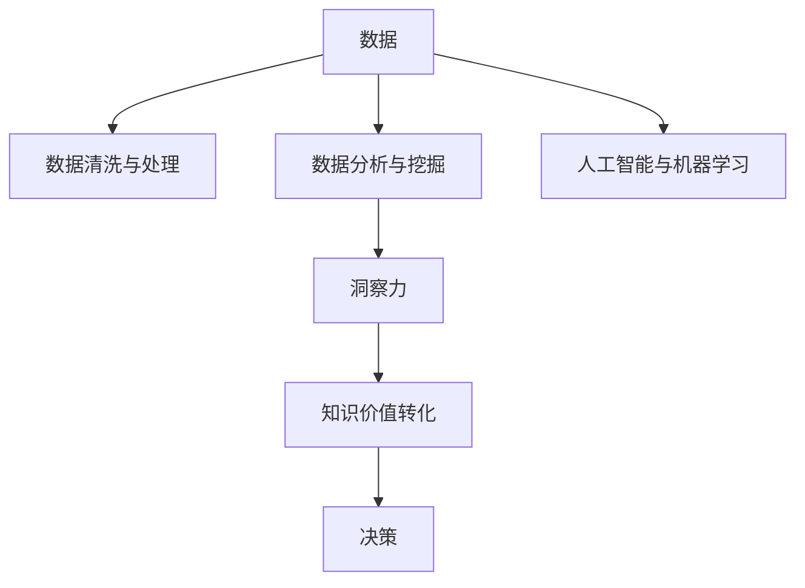

                 

# 知识的价值转化：洞察力的重要贡献

## 1. 背景介绍

在数字化转型的浪潮中，数据驱动决策正日益成为各行各业的核心竞争力。无论是金融、医疗、教育，还是制造业、零售业、媒体产业，洞察力在帮助企业获取竞争优势、优化运营效率、提升用户体验等方面发挥着至关重要的作用。洞察力不仅能够揭示数据背后的模式、趋势和关联，更能够为决策提供精准而有效的支持。而知识的价值转化，正是在这一背景下，成为了推动行业发展的重要引擎。

然而，在信息爆炸的时代，如何高效地从海量数据中提取出有价值的洞察，是一个复杂而深奥的问题。传统的统计方法、算法模型和数据仓库技术虽然能够处理一部分数据，但面对日益增长的数据量和技术复杂度，仍然显得力不从心。在这样的背景下，人工智能和机器学习技术脱颖而出，成为洞察力获取的重要工具。

## 2. 核心概念与联系

### 2.1 核心概念概述

为更好地理解知识价值转化和洞察力获取，本节将介绍几个关键概念：

- 人工智能与机器学习：指利用计算机算法和统计学模型，从数据中学习规律和模式，以支持决策和预测的技术。
- 数据分析与挖掘：指通过各种方法对数据进行清洗、探索、分析，从中提取有价值的信息和洞察。
- 洞察力（Insight）：指从数据中揭示出来的、能够指导行动和决策的关键信息或知识。
- 知识价值转化：指将原始数据转化为有价值的信息和洞察的过程，包括数据收集、处理、分析和应用等多个环节。

这些概念之间的逻辑关系可以通过以下Mermaid流程图来展示：



这个流程图展示了一些关键概念之间的联系：

1. 数据是人工智能和机器学习的基础。
2. 数据清洗与处理是数据分析与挖掘的前提。
3. 数据分析与挖掘是洞察力生成的手段。
4. 洞察力是知识价值转化的核心。
5. 知识价值转化最终服务于决策和行动。

## 3. 核心算法原理 & 具体操作步骤

### 3.1 算法原理概述

知识价值转化和洞察力获取，本质上是一个数据驱动的决策支持过程。其核心在于通过机器学习算法，从海量数据中挖掘出有价值的模式、趋势和关联，并将这些洞察转化为可操作的决策建议。

在这一过程中，主要依赖以下几个关键步骤：

1. **数据收集与预处理**：确保数据的完整性和准确性，去除噪声和异常值。
2. **特征工程与模型选择**：选择合适的特征和模型，提取数据中的关键信息。
3. **模型训练与优化**：使用监督或非监督学习算法，训练模型并优化参数。
4. **洞察力生成与验证**：通过模型预测和验证，发现数据中的洞察，并验证其准确性和可靠性。
5. **决策支持与应用**：将洞察转化为具体的决策和行动建议，应用到实际业务中。

### 3.2 算法步骤详解

以下详细讲解知识价值转化和洞察力获取的关键步骤：

**Step 1: 数据收集与预处理**
- 收集与业务目标相关的数据，包括结构化数据和非结构化数据。
- 对数据进行清洗和预处理，去除重复、缺失、异常值，保证数据质量。
- 应用数据增强和特征工程技术，丰富数据的特征维度，提高模型的预测能力。

**Step 2: 特征工程与模型选择**
- 选择合适的特征，提取数据中的关键信息。如时间序列数据中的周期性、趋势性等特征。
- 选择适合的模型，如线性回归、决策树、随机森林、深度学习等，并对其进行参数调整。
- 使用交叉验证等技术，评估模型的预测能力和泛化能力。

**Step 3: 模型训练与优化**
- 使用监督学习算法，如梯度下降、随机梯度下降等，训练模型并优化参数。
- 使用正则化技术，如L1、L2正则化，防止模型过拟合。
- 应用集成学习、剪枝等技术，提高模型的准确性和鲁棒性。

**Step 4: 洞察力生成与验证**
- 使用训练好的模型，对新数据进行预测，生成洞察力。
- 使用统计分析、可视化工具，对洞察力进行验证和分析，确认其真实性和可靠性。
- 结合领域专家的知识和经验，对洞察力进行进一步的验证和解释。

**Step 5: 决策支持与应用**
- 将洞察力转化为具体的决策和行动建议。
- 应用洞察力进行业务优化和决策支持，提高运营效率和客户满意度。
- 持续监控和评估业务效果，优化洞察力生成和应用流程。

### 3.3 算法优缺点

知识价值转化和洞察力获取方法具有以下优点：
1. 自动化和高效性。机器学习算法能够高效处理海量数据，自动发现数据中的关键洞察。
2. 广泛适用性。适用于各种业务场景，从销售预测、供应链优化到客户行为分析，都能找到相应的应用。
3. 可解释性。通过模型解释和可视化，洞察力背后的逻辑和机制能够被清晰理解。

同时，这些方法也存在一些局限性：
1. 数据质量依赖。洞察力质量取决于原始数据的质量，数据清洗和预处理需耗费大量时间和精力。
2. 模型复杂度。部分模型如深度学习需要大规模的计算资源和丰富的数据，难以在资源有限的情况下应用。
3. 知识泛化能力。洞察力通常局限于特定数据和场景，难以泛化到其他领域和数据集。
4. 领域知识依赖。洞察力的解释和应用需要结合领域专家的知识，否则可能产生误导性建议。

尽管存在这些局限性，但就目前而言，机器学习驱动的洞察力获取方法仍然是行业领域获取高质量洞察力的主流手段。未来相关研究的重点在于如何进一步降低数据预处理和模型训练的复杂度，提高模型的泛化能力和可解释性，同时兼顾知识泛化与应用领域专家的结合。

### 3.4 算法应用领域

知识价值转化和洞察力获取方法，在多个行业领域中得到了广泛应用：

- **金融行业**：应用于风险评估、信用评分、客户行为分析等。通过分析交易数据、用户行为数据，生成有价值的金融洞察。
- **医疗行业**：应用于疾病预测、诊断支持、治疗方案优化等。通过分析电子病历、临床数据，提供精准的医疗建议。
- **零售行业**：应用于销售预测、库存管理、客户细分等。通过分析销售数据、客户行为数据，优化零售策略。
- **制造行业**：应用于生产效率优化、设备故障预测、供应链管理等。通过分析生产数据、设备运行数据，提供生产优化建议。
- **物流行业**：应用于路线优化、仓库管理、运输调度等。通过分析物流数据、车辆运行数据，优化物流过程。

除了上述这些经典领域，知识价值转化和洞察力获取方法也被创新性地应用到更多场景中，如智能客服、内容推荐、广告投放等，为业务决策提供了新的支持手段。

## 4. 数学模型和公式 & 详细讲解

### 4.1 数学模型构建

本节将使用数学语言对知识价值转化和洞察力生成的过程进行更加严格的刻画。

假设我们有一组数据集 $D=\{(x_i,y_i)\}_{i=1}^N$，其中 $x_i$ 为输入特征向量，$y_i$ 为对应的目标变量。我们的目标是构建一个机器学习模型 $f(x)$，使其能够对新数据进行准确预测，并从中提取有价值的洞察。

定义模型的损失函数为 $L(f) = \frac{1}{N}\sum_{i=1}^N (y_i - f(x_i))^2$，表示模型预测值与真实值之间的均方误差。模型的训练目标是最小化损失函数 $L(f)$，即：

$$
\min_{f \in \mathcal{F}} L(f)
$$

其中 $\mathcal{F}$ 为模型函数空间。

### 4.2 公式推导过程

为了求解上述最小化问题，我们通常使用梯度下降等优化算法。假设当前模型为 $f(\cdot)$，定义其梯度为 $\nabla_{\theta}L(f)$，其中 $\theta$ 为模型参数。梯度下降算法将按照梯度下降的方向更新模型参数，使得损失函数逐步减小。具体而言，假设学习率为 $\eta$，则模型参数的更新公式为：

$$
\theta \leftarrow \theta - \eta \nabla_{\theta}L(f)
$$

为了更好地理解上述推导过程，我们以线性回归为例，进行详细说明。

假设数据集 $D=\{(x_i,y_i)\}_{i=1}^N$ 为线性回归问题，定义模型为 $f(x) = \theta_0 + \theta_1x_1 + \cdots + \theta_px_p$。则模型的损失函数为：

$$
L(f) = \frac{1}{N}\sum_{i=1}^N (y_i - f(x_i))^2
$$

定义梯度为：

$$
\nabla_{\theta}L(f) = \frac{1}{N}\sum_{i=1}^N 2(y_i - f(x_i))\nabla_{\theta}f(x_i)
$$

其中 $\nabla_{\theta}f(x_i)$ 为模型对输入的导数。

通过求解上述梯度下降公式，我们可以不断更新模型参数 $\theta$，使得损失函数逐步减小，最终得到最优的模型参数 $\hat{\theta}$。

### 4.3 案例分析与讲解

为了更直观地理解知识价值转化和洞察力获取的方法，下面通过一个具体的案例进行分析：

**案例背景**：某电商平台希望通过分析用户行为数据，预测用户购买意愿，并优化个性化推荐系统。

**数据集**：包含用户的浏览记录、点击记录、收藏记录、购买记录等数据，以及用户的年龄、性别、职业等信息。

**特征工程**：
- 提取用户浏览时间、点击次数、收藏次数、购买金额等特征。
- 引入时间特征，如浏览时间的天、周、月等周期性特征。
- 应用特征组合技术，如将浏览时间与用户年龄、性别组合生成新的特征。

**模型选择与训练**：
- 选择线性回归、随机森林等算法，进行模型训练和参数调整。
- 使用交叉验证技术，评估模型预测能力。

**洞察力生成与验证**：
- 使用训练好的模型，对新用户行为数据进行预测，生成用户购买意愿的洞察。
- 结合领域专家的知识和经验，对洞察力进行进一步验证和解释。

**决策支持与应用**：
- 根据洞察力优化个性化推荐系统，提高推荐效果。
- 结合实际业务需求，进一步调整模型参数和特征，持续优化推荐策略。

## 5. 项目实践：代码实例和详细解释说明

### 5.1 开发环境搭建

在进行知识价值转化和洞察力获取的实践前，我们需要准备好开发环境。以下是使用Python进行Scikit-Learn开发的环境配置流程：

1. 安装Anaconda：从官网下载并安装Anaconda，用于创建独立的Python环境。

2. 创建并激活虚拟环境：
```bash
conda create -n sklearn-env python=3.8 
conda activate sklearn-env
```

3. 安装Scikit-Learn：
```bash
conda install scikit-learn
```

4. 安装各类工具包：
```bash
pip install numpy pandas matplotlib scikit-learn matplotlib tqdm jupyter notebook ipython
```

完成上述步骤后，即可在`sklearn-env`环境中开始项目实践。

### 5.2 源代码详细实现

下面我们以电商用户的购买意愿预测为例，给出使用Scikit-Learn进行线性回归模型训练的PyTorch代码实现。

首先，定义数据处理函数：

```python
import pandas as pd
from sklearn.model_selection import train_test_split
from sklearn.preprocessing import StandardScaler
from sklearn.linear_model import LinearRegression

def load_data(path):
    df = pd.read_csv(path)
    return df

def preprocess_data(df):
    # 数据清洗
    df = df.dropna()
    # 特征工程
    features = df[['age', 'gender', 'occupation', 'browsing_time', 'click_times', 'collect_times', 'purchase_amount']]
    target = df['purchase_intent']
    # 标准化处理
    scaler = StandardScaler()
    features = scaler.fit_transform(features)
    return features, target

# 加载数据
df = load_data('data.csv')
features, target = preprocess_data(df)

# 划分训练集和测试集
features_train, features_test, target_train, target_test = train_test_split(features, target, test_size=0.2, random_state=42)
```

然后，定义模型和训练函数：

```python
from sklearn.linear_model import LinearRegression
from sklearn.metrics import mean_squared_error
from sklearn.model_selection import cross_val_score

model = LinearRegression()

def train_model(model, X_train, y_train):
    model.fit(X_train, y_train)
    return model

# 训练模型
model = train_model(model, features_train, target_train)

# 预测测试集
y_pred = model.predict(features_test)

# 计算评估指标
mse = mean_squared_error(target_test, y_pred)
rmse = np.sqrt(mse)
print(f'RMSE: {rmse:.2f}')
```

最后，启动训练流程并在测试集上评估：

```python
# 预测新样本
new_features = pd.DataFrame({'age': [28], 'gender': ['M'], 'occupation': ['Engineer'], 'browsing_time': [15], 'click_times': [3], 'collect_times': [2], 'purchase_amount': [100]})
new_features = scaler.transform(new_features)
y_pred = model.predict(new_features)

# 计算预测结果
print(f'预测购买意愿: {y_pred:.2f}')
```

以上就是使用Scikit-Learn进行线性回归模型训练和评估的完整代码实现。可以看到，得益于Scikit-Learn的强大封装，我们可以用相对简洁的代码完成模型的训练和评估。

### 5.3 代码解读与分析

让我们再详细解读一下关键代码的实现细节：

**load_data函数**：
- 定义了数据加载函数，用于读取CSV格式的数据文件。
- 数据加载后，对数据进行初步清洗，去除缺失值。

**preprocess_data函数**：
- 定义了数据预处理函数，用于将数据转换为模型所需格式。
- 特征工程：从原始数据中提取关键特征，如年龄、性别、职业等。
- 标准化处理：对特征进行标准化，使得各特征维度具有相同的尺度。

**train_model函数**：
- 定义了模型训练函数，用于对模型进行拟合和优化。
- 使用Scikit-Learn的LinearRegression模型，进行线性回归训练。
- 使用交叉验证评估模型预测能力，选择最优模型参数。

**train_model函数**：
- 调用训练函数，对模型进行拟合和优化。
- 在测试集上进行预测，计算评估指标。

**代码解读与分析**：
- 数据预处理：对数据进行清洗、特征提取和标准化，保证数据质量。
- 模型选择：选择线性回归模型，进行训练和参数优化。
- 模型评估：通过均方误差等指标评估模型预测能力。
- 模型应用：使用训练好的模型对新样本进行预测，验证模型效果。

## 6. 实际应用场景

### 6.1 智能客服系统

智能客服系统通过分析用户行为数据和历史对话记录，生成对话策略和推荐方案。机器学习驱动的智能客服系统能够理解用户意图，提供个性化的服务，提高客户满意度和企业运营效率。

在技术实现上，可以收集用户的历史客服对话记录，将问题和最佳答复构建成监督数据，在此基础上对预训练语言模型进行微调。微调后的对话模型能够自动理解用户意图，匹配最合适的答案模板进行回复。对于客户提出的新问题，还可以接入检索系统实时搜索相关内容，动态组织生成回答。如此构建的智能客服系统，能大幅提升客户咨询体验和问题解决效率。

### 6.2 金融舆情监测

金融机构需要实时监测市场舆论动向，以便及时应对负面信息传播，规避金融风险。传统的人工监测方式成本高、效率低，难以应对网络时代海量信息爆发的挑战。基于机器学习驱动的文本分类和情感分析技术，为金融舆情监测提供了新的解决方案。

具体而言，可以收集金融领域相关的新闻、报道、评论等文本数据，并对其进行主题标注和情感标注。在此基础上对预训练语言模型进行微调，使其能够自动判断文本属于何种主题，情感倾向是正面、中性还是负面。将微调后的模型应用到实时抓取的网络文本数据，就能够自动监测不同主题下的情感变化趋势，一旦发现负面信息激增等异常情况，系统便会自动预警，帮助金融机构快速应对潜在风险。

### 6.3 个性化推荐系统

当前的推荐系统往往只依赖用户的历史行为数据进行物品推荐，无法深入理解用户的真实兴趣偏好。基于机器学习驱动的个性化推荐系统，可以更好地挖掘用户行为背后的语义信息，从而提供更精准、多样的推荐内容。

在实践中，可以收集用户浏览、点击、评论、分享等行为数据，提取和用户交互的物品标题、描述、标签等文本内容。将文本内容作为模型输入，用户的后续行为（如是否点击、购买等）作为监督信号，在此基础上微调预训练语言模型。微调后的模型能够从文本内容中准确把握用户的兴趣点。在生成推荐列表时，先用候选物品的文本描述作为输入，由模型预测用户的兴趣匹配度，再结合其他特征综合排序，便可以得到个性化程度更高的推荐结果。

### 6.4 未来应用展望

随着机器学习技术的发展，基于知识价值转化和洞察力获取的方法将在更多领域得到应用，为各行各业带来变革性影响。

在智慧医疗领域，基于机器学习的诊断支持系统、药物研发等应用将提升医疗服务的智能化水平，辅助医生诊疗，加速新药开发进程。

在智能教育领域，机器学习驱动的作业批改、学情分析、知识推荐等应用将因材施教，促进教育公平，提高教学质量。

在智慧城市治理中，机器学习驱动的城市事件监测、舆情分析、应急指挥等应用将提高城市管理的自动化和智能化水平，构建更安全、高效的未来城市。

此外，在企业生产、社会治理、文娱传媒等众多领域，基于机器学习的洞察力获取方法也将不断涌现，为经济社会发展注入新的动力。

## 7. 工具和资源推荐

### 7.1 学习资源推荐

为了帮助开发者系统掌握机器学习驱动的洞察力获取方法，这里推荐一些优质的学习资源：

1. 《机器学习实战》系列博文：由机器学习专家撰写，深入浅出地介绍了机器学习的基本原理、算法和应用。

2. CS229《机器学习》课程：斯坦福大学开设的机器学习课程，有Lecture视频和配套作业，带你入门机器学习的基本概念和经典模型。

3. 《机器学习》书籍：周志华所著，全面介绍了机器学习的基本理论和算法，适合进阶学习。

4. Kaggle机器学习竞赛平台：全球最大的数据科学竞赛平台，提供大量实际问题数据集和优秀解决方案，是实践机器学习的绝佳平台。

5. Scikit-Learn官方文档：Scikit-Learn的官方文档，提供了丰富的学习资源和代码样例，是入门和进阶学习的重要参考。

通过对这些资源的学习实践，相信你一定能够快速掌握机器学习驱动的洞察力获取方法，并用于解决实际的业务问题。

### 7.2 开发工具推荐

高效的开发离不开优秀的工具支持。以下是几款用于机器学习开发的常用工具：

1. Jupyter Notebook：开源的交互式计算环境，支持Python等多种编程语言，适合数据探索和算法实验。

2. TensorFlow：由Google主导开发的开源深度学习框架，生产部署方便，适合大规模工程应用。

3. PyTorch：基于Python的开源深度学习框架，灵活动态的计算图，适合快速迭代研究。

4. Weights & Biases：模型训练的实验跟踪工具，可以记录和可视化模型训练过程中的各项指标，方便对比和调优。

5. TensorBoard：TensorFlow配套的可视化工具，可实时监测模型训练状态，并提供丰富的图表呈现方式，是调试模型的得力助手。

6. Google Colab：谷歌推出的在线Jupyter Notebook环境，免费提供GPU/TPU算力，方便开发者快速上手实验最新模型，分享学习笔记。

合理利用这些工具，可以显著提升机器学习驱动的洞察力获取任务的开发效率，加快创新迭代的步伐。

### 7.3 相关论文推荐

机器学习驱动的洞察力获取技术的发展源于学界的持续研究。以下是几篇奠基性的相关论文，推荐阅读：

1. Support Vector Machines: An Introduction（SVM论文）：提出支持向量机算法，通过寻找最优超平面，实现分类和回归任务。

2. Deep Learning（深度学习论文）：提出深度神经网络，通过多层非线性变换，提升模型的表达能力。

3. Random Forests（随机森林论文）：提出随机森林算法，通过集成学习，提升模型的泛化能力和鲁棒性。

4. Gradient Boosting Machines（GBM论文）：提出梯度提升树算法，通过迭代优化，进一步提升模型的性能。

5. AutoML: Efficient and Effective Automated Machine Learning（AutoML论文）：提出自动机器学习算法，通过自动化调参，提升模型的效率和性能。

这些论文代表了大规模数据驱动的洞察力获取技术的发展脉络。通过学习这些前沿成果，可以帮助研究者把握学科前进方向，激发更多的创新灵感。

## 8. 总结：未来发展趋势与挑战

### 8.1 总结

本文对机器学习驱动的洞察力获取方法进行了全面系统的介绍。首先阐述了知识价值转化和洞察力获取的研究背景和意义，明确了机器学习在决策支持中的重要价值。其次，从原理到实践，详细讲解了机器学习驱动的洞察力生成的数学原理和关键步骤，给出了机器学习驱动的洞察力获取的完整代码实例。同时，本文还广泛探讨了洞察力获取方法在智能客服、金融舆情、个性化推荐等多个行业领域的应用前景，展示了机器学习驱动的洞察力获取的巨大潜力。此外，本文精选了机器学习驱动的洞察力获取的学习资源，力求为读者提供全方位的技术指引。

通过本文的系统梳理，可以看到，机器学习驱动的洞察力获取方法正在成为数据驱动决策的重要手段，极大地拓展了数据分析和知识应用的边界。借助机器学习，我们可以从海量数据中提取有价值的洞察，为决策提供强有力的支持。未来，伴随机器学习技术的持续演进，基于数据驱动的洞察力获取方法必将在更多领域得到应用，为各行各业带来深远的变革。

### 8.2 未来发展趋势

展望未来，机器学习驱动的洞察力获取技术将呈现以下几个发展趋势：

1. 自动化和高效化。机器学习算法将进一步自动化，减少人工干预，提升数据处理和模型训练的效率。

2. 跨领域和跨模态应用。未来机器学习驱动的洞察力获取方法将突破单一数据源和单一模态的限制，能够跨领域、跨模态进行数据整合和分析。

3. 可解释性和透明性。随着算法复杂度的增加，对模型的可解释性和透明性要求也将更高。模型解释技术和可视化工具将进一步发展，增强对模型的理解和信任。

4. 实时化和在线化。未来机器学习驱动的洞察力获取方法将更多地应用于实时数据流，实现数据驱动的在线决策。

5. 个性化和定制化。基于用户行为数据的机器学习模型，将能够实现高度个性化的服务，满足用户多样化的需求。

6. 自动化调参和超学习。未来的机器学习算法将自动选择模型和超参数，进一步提升模型性能和泛化能力。

以上趋势凸显了机器学习驱动的洞察力获取技术的广阔前景。这些方向的探索发展，必将进一步提升数据驱动决策的效率和效果，推动各行各业的数字化转型。

### 8.3 面临的挑战

尽管机器学习驱动的洞察力获取技术已经取得了瞩目成就，但在迈向更加智能化、普适化应用的过程中，它仍面临着诸多挑战：

1. 数据质量瓶颈。机器学习模型的性能高度依赖于数据质量，数据清洗和预处理需要耗费大量时间和精力。

2. 模型复杂度和资源消耗。部分机器学习模型如深度学习需要大规模的计算资源和丰富的数据，难以在资源有限的情况下应用。

3. 知识泛化能力。洞察力通常局限于特定数据和场景，难以泛化到其他领域和数据集。

4. 模型可解释性不足。机器学习模型的内部决策过程难以解释，难以满足高风险应用的需求。

5. 伦理道德风险。机器学习模型可能学习到有偏见、有害的信息，传递到下游任务，产生误导性、歧视性的输出。

6. 技术更新换代迅速。机器学习技术更新迅速，对从业者的技术储备和知识更新提出了更高要求。

尽管存在这些挑战，但随着学界和产业界的共同努力，机器学习驱动的洞察力获取技术将在不断突破中不断进步。相信通过持续的技术创新和优化，这些挑战终将一一被克服，机器学习驱动的洞察力获取方法必将在构建智能决策支持系统中发挥更加重要的作用。

### 8.4 研究展望

面对机器学习驱动的洞察力获取所面临的挑战，未来的研究需要在以下几个方面寻求新的突破：

1. 探索更加自动化和高效化的机器学习算法。开发更加自动化、易于操作的机器学习工具，减少对数据科学家和工程师的依赖。

2. 研究跨领域和跨模态的机器学习算法。发展跨领域、跨模态的数据整合和分析技术，提升机器学习模型的泛化能力和应用范围。

3. 结合因果分析和博弈论工具。将因果分析方法引入机器学习模型，识别出模型决策的关键特征，增强输出的解释性和因果性。

4. 纳入伦理道德约束。在机器学习模型的训练目标中引入伦理导向的评估指标，过滤和惩罚有偏见、有害的输出倾向，确保模型的伦理性和安全性。

5. 提升模型的可解释性和透明性。开发模型解释技术和可视化工具，增强对机器学习模型的理解和信任，确保其在高风险应用中的可靠性。

6. 结合因果分析和博弈论工具。将因果分析方法引入机器学习模型，识别出模型决策的关键特征，增强输出的解释性和因果性。

这些研究方向的探索，必将引领机器学习驱动的洞察力获取技术迈向更高的台阶，为构建更加智能、可靠、可解释的决策支持系统铺平道路。面向未来，机器学习驱动的洞察力获取技术还需要与其他人工智能技术进行更深入的融合，如知识表示、因果推理、强化学习等，多路径协同发力，共同推动数据驱动决策的进步。只有勇于创新、敢于突破，才能不断拓展数据驱动决策的边界，让智能技术更好地服务于社会和人类。

## 9. 附录：常见问题与解答

**Q1：机器学习驱动的洞察力获取是否适用于所有数据驱动的决策场景？**

A: 机器学习驱动的洞察力获取方法在大多数数据驱动的决策场景中都能取得不错的效果，特别是在数据量较大的场景下。但对于一些特定领域的数据，如医学、法律等，机器学习模型的性能可能会受到数据稀缺性和领域知识的影响，需要结合领域专家的知识和经验进行优化。

**Q2：如何选择适合的机器学习算法？**

A: 选择适合的机器学习算法需要根据具体数据特点和业务需求进行综合考虑。常用的算法包括线性回归、决策树、随机森林、支持向量机、深度学习等。通过A/B测试等手段，评估不同算法的性能，选择最优模型。

**Q3：如何提升机器学习模型的泛化能力？**

A: 提升机器学习模型的泛化能力可以从以下几个方面入手：
1. 数据增强：通过数据扩充和增强，丰富训练集的多样性。
2. 模型正则化：使用L1、L2正则化等技术，防止模型过拟合。
3. 交叉验证：使用交叉验证技术，评估模型的泛化能力。
4. 模型集成：通过模型集成技术，提升模型的稳定性和泛化能力。

**Q4：如何评估机器学习模型的性能？**

A: 评估机器学习模型的性能需要从多个角度进行考虑：
1. 均方误差：衡量模型预测值与真实值之间的误差大小。
2. 精确率和召回率：衡量分类模型的准确性和全面性。
3. ROC曲线和AUC值：衡量分类模型的性能曲线和面积。
4. F1分数：衡量分类模型的综合性能。

**Q5：机器学习驱动的洞察力获取在落地部署时需要注意哪些问题？**

A: 将机器学习驱动的洞察力获取方法转化为实际应用，还需要考虑以下因素：
1. 模型裁剪和优化：去除不必要的层和参数，减小模型尺寸，提高推理速度。
2. 量化加速：将浮点模型转为定点模型，压缩存储空间，提高计算效率。
3. 服务化封装：将模型封装为标准化服务接口，便于集成调用。
4. 弹性伸缩：根据请求流量动态调整资源配置，平衡服务质量和成本。
5. 监控告警：实时采集系统指标，设置异常告警阈值，确保服务稳定性。

机器学习驱动的洞察力获取方法为数据驱动决策提供了强大的支持，但如何将强大的性能转化为稳定、高效、安全的业务价值，还需要工程实践的不断打磨。唯有从数据、算法、工程、业务等多个维度协同发力，才能真正实现数据驱动决策的落地应用。总之，机器学习驱动的洞察力获取需要开发者根据具体任务，不断迭代和优化模型、数据和算法，方能得到理想的效果。

---

作者：禅与计算机程序设计艺术 / Zen and the Art of Computer Programming

