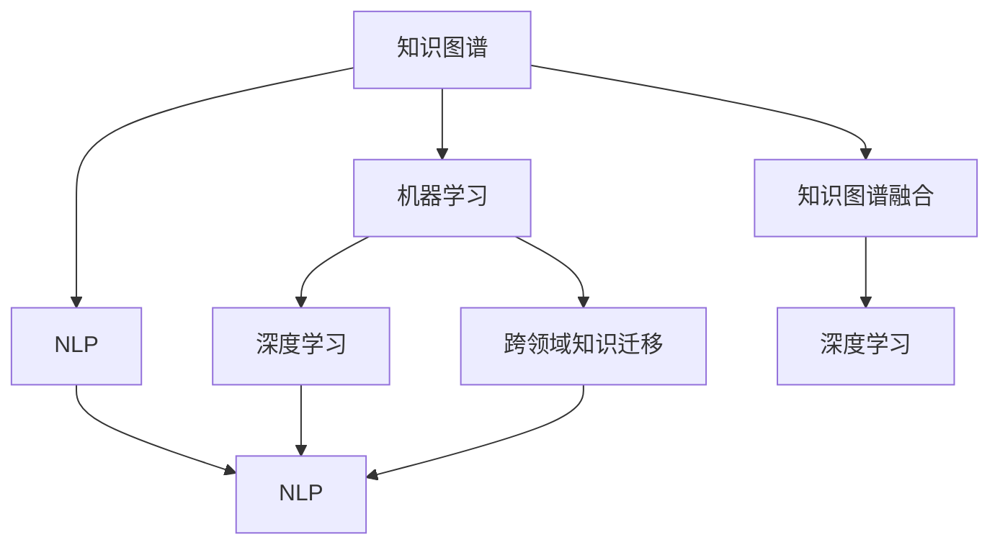

                 

# 知识的价值：洞察力赋予知识以生命力

## 1. 背景介绍

知识的价值不仅仅在于其量的积累，更在于质的洞察。正如阿兰·图灵所言，“计算机科学是唯一一门以问题解决为起点，最后发现解决问题所需的工具和知识，从而形成体系化学科的科学。”这句话道出了计算机科学的本质——洞察力，即对问题的深刻理解、对方法的精准选择和对结果的科学验证。

### 1.1 问题的由来

随着科技的迅猛发展，我们面临的问题越来越复杂、多变。传统的数据驱动和算法驱动的方法已经无法满足需求。知识的价值在这一背景下，被赋予了新的内涵。如何有效地从海量知识中提取洞察力，成为摆在科技工作者面前的重大课题。

### 1.2 问题核心关键点

洞察力提取的本质是对知识进行有效组织、整理和分析，使其成为解决特定问题的有力工具。这一过程可以分为四个关键步骤：

1. **数据准备**：收集、整理和清洗数据，确保数据的准确性和完整性。
2. **模型选择**：根据问题的特点和数据的性质，选择适当的算法和模型。
3. **特征工程**：对数据进行特征提取和选择，提高模型的预测能力和泛化性能。
4. **结果验证**：对模型进行评估和验证，确保其解决实际问题的效果。

本节将重点介绍如何通过洞察力提取，使知识成为解决问题的利器。

## 2. 核心概念与联系

### 2.1 核心概念概述

为更好地理解知识洞察力的提取，本节将介绍几个密切相关的核心概念：

- **知识图谱(Knowledge Graph)**：以图的形式表示实体和实体之间的关系，是一种有效的知识组织和表达方式。
- **自然语言处理(Natural Language Processing, NLP)**：研究计算机如何理解、处理和生成人类语言的技术，是洞察力提取的重要手段。
- **机器学习(Machine Learning)**：通过训练数据，使计算机能够从数据中学习规律，进行预测和决策，是洞察力提取的基础方法。
- **深度学习(Deep Learning)**：一种特殊的机器学习方法，通过多层神经网络实现对复杂数据的建模，是洞察力提取的主流技术。
- **知识图谱融合**：将知识图谱与深度学习结合，提升模型对复杂问题的理解和推理能力。
- **跨领域知识迁移**：将一个领域学到的知识迁移到另一个领域，提升模型在跨领域问题上的表现。

这些核心概念之间的逻辑关系可以通过以下Mermaid流程图来展示：



这个流程图展示了这个核心概念之间的联系和转化关系：

1. 知识图谱通过NLP技术抽取语义信息，形成结构化的知识表示。
2. 机器学习模型通过学习知识图谱，获得对问题的形式化表示。
3. 深度学习模型通过学习知识图谱中的关系，提升对复杂问题的推理能力。
4. 跨领域知识迁移利用已学知识，提升模型在新领域上的表现。
5. 知识图谱融合将知识图谱与深度学习模型结合，提高模型的性能。

## 3. 核心算法原理 & 具体操作步骤

### 3.1 算法原理概述

知识洞察力提取的算法原理是通过对知识图谱的建模和分析，学习其中的规律和关系，形成对问题的理解。其核心思想是：将知识图谱中的实体关系表示为向量，通过向量的计算和推理，获得对问题的解答。

具体来说，知识洞察力提取分为两个步骤：

1. **知识编码**：将知识图谱中的实体和关系编码成向量，形成知识表示。
2. **关系推理**：通过向量的计算和推理，提取知识图谱中的关系和规律，形成对问题的解答。

### 3.2 算法步骤详解

#### 3.2.1 知识编码

知识编码的目的是将知识图谱中的实体和关系表示为向量。常用的方法包括：

1. **知识嵌入**：通过知识图谱中的关系进行向量计算，将每个实体和关系表示为低维向量。
2. **节点嵌入**：将每个实体表示为向量，关系表示为矩阵，通过矩阵乘法计算得到向量表示。
3. **关系推理向量**：通过关系路径的向量计算，将关系转化为向量表示。

#### 3.2.2 关系推理

关系推理的目的是通过向量计算，提取知识图谱中的关系和规律，形成对问题的解答。常用的方法包括：

1. **逻辑推理**：通过逻辑规则和推理器，对知识图谱进行推理和验证，形成对问题的解答。
2. **向量化推理**：通过向量计算，提取知识图谱中的关系和规律，形成对问题的解答。
3. **神经网络推理**：通过神经网络模型，学习知识图谱中的关系和规律，形成对问题的解答。

### 3.3 算法优缺点

知识洞察力提取的算法具有以下优点：

1. **结构化知识**：知识图谱提供了结构化的知识表示，便于模型的理解和推理。
2. **高效推理**：通过向量和逻辑规则的计算，可以高效地进行知识推理和验证。
3. **跨领域应用**：知识图谱可以跨领域应用，提升模型在不同领域上的表现。

但同时，该算法也存在以下缺点：

1. **数据需求高**：知识图谱需要大量的结构化数据，数据收集和整理成本较高。
2. **模型复杂**：知识图谱的构建和推理需要复杂的模型和算法，计算资源需求大。
3. **知识偏见**：知识图谱中的知识可能存在偏见，影响模型的公正性和准确性。
4. **动态更新**：知识图谱需要动态更新，以反映新的知识和关系。

### 3.4 算法应用领域

知识洞察力提取的算法在多个领域得到了广泛应用，例如：

1. **医疗知识推理**：通过知识图谱融合深度学习，实现对患者症状的推理和诊断。
2. **金融知识推理**：通过知识图谱融合深度学习，实现对金融市场趋势的推理和预测。
3. **智能问答系统**：通过知识图谱融合深度学习，实现对自然语言问题的推理和回答。
4. **智能推荐系统**：通过知识图谱融合深度学习，实现对用户兴趣和行为的推理和推荐。
5. **智能搜索系统**：通过知识图谱融合深度学习，实现对用户查询的推理和搜索。

这些应用领域展示了知识洞察力提取算法的广泛适用性。

## 4. 数学模型和公式 & 详细讲解 & 举例说明

### 4.1 数学模型构建

知识洞察力提取的数学模型主要包括以下几个部分：

1. **知识图谱建模**：将知识图谱中的实体和关系表示为向量。
2. **向量计算**：通过向量的计算和推理，提取知识图谱中的关系和规律。
3. **推理验证**：通过逻辑规则和推理器，对知识图谱进行推理和验证。

### 4.2 公式推导过程

以知识图谱融合深度学习为例，推导关系推理向量的计算公式：

假设知识图谱中的实体 $e_i$ 表示为向量 $\vec{e_i}$，关系 $r_{ij}$ 表示为矩阵 $\vec{r_{ij}}$，向量 $\vec{e_i}$ 和 $\vec{r_{ij}}$ 的计算如下：

$$
\vec{e_i} = \vec{e_i}^{(0)} + \sum_{j=1}^{n} \vec{r_{ij}} \vec{e_j}
$$

$$
\vec{r_{ij}} = \vec{W} \vec{r_{ij}^{(0)}} \vec{e_j}^{T}
$$

其中 $\vec{e_i}^{(0)}$ 为初始化向量，$\vec{r_{ij}^{(0)}}$ 为初始化矩阵，$\vec{W}$ 为权重矩阵。

向量计算过程如图：

$$
\vec{r_{ij}} = \vec{W} \vec{r_{ij}^{(0)}} \vec{e_j}^{T}
$$

关系推理向量的计算过程如图：

$$
\vec{e_i} = \vec{e_i}^{(0)} + \sum_{j=1}^{n} \vec{r_{ij}} \vec{e_j}
$$

### 4.3 案例分析与讲解

以医疗知识推理为例，通过知识图谱融合深度学习，实现对患者症状的推理和诊断。具体步骤如下：

1. **数据准备**：收集患者的症状、历史病历、实验室检查等数据，构建知识图谱。
2. **知识编码**：将知识图谱中的实体和关系编码成向量。
3. **关系推理**：通过向量计算，提取知识图谱中的关系和规律，推理出患者的疾病。
4. **结果验证**：对推理结果进行验证，确保其准确性和可解释性。

## 5. 项目实践：代码实例和详细解释说明

### 5.1 开发环境搭建

在进行知识洞察力提取的项目实践前，我们需要准备好开发环境。以下是使用Python进行Keras开发的环境配置流程：

1. 安装Anaconda：从官网下载并安装Anaconda，用于创建独立的Python环境。

2. 创建并激活虚拟环境：
```bash
conda create -n pytorch-env python=3.8 
conda activate pytorch-env
```

3. 安装PyTorch：根据CUDA版本，从官网获取对应的安装命令。例如：
```bash
conda install pytorch torchvision torchaudio cudatoolkit=11.1 -c pytorch -c conda-forge
```

4. 安装TensorFlow：由Google主导开发的开源深度学习框架，生产部署方便，适合大规模工程应用。同样有丰富的预训练语言模型资源。

5. 安装Keras：基于TensorFlow、CNTK和Theano等后端深度学习库，提供简单易用的API。

6. 安装各类工具包：
```bash
pip install numpy pandas scikit-learn matplotlib tqdm jupyter notebook ipython
```

完成上述步骤后，即可在`pytorch-env`环境中开始知识洞察力提取的项目实践。

### 5.2 源代码详细实现

下面我们以医疗知识推理为例，给出使用Keras实现的知识图谱融合深度学习的代码实现。

首先，定义知识图谱的构建函数：

```python
import numpy as np
from keras.layers import Dense, Embedding, Input, Concatenate
from keras.models import Model

def build_knowledge_graph(entities, relations):
    # 定义输入层
    entity_input = Input(shape=(1,), name='entity')
    relation_input = Input(shape=(1,), name='relation')
    
    # 定义嵌入层
    entity_embedding = Embedding(input_dim=len(entities), output_dim=100, name='entity_embedding')(entity_input)
    relation_embedding = Embedding(input_dim=len(relations), output_dim=100, name='relation_embedding')(relation_input)
    
    # 定义节点嵌入层
    entity_node = Dense(100, activation='relu', name='entity_node')(entity_embedding)
    relation_node = Dense(100, activation='relu', name='relation_node')(relation_embedding)
    
    # 定义关系推理层
    fusion_node = Concatenate()([entity_node, relation_node])
    fusion_output = Dense(100, activation='relu', name='fusion_output')(fusion_node)
    
    # 定义模型
    model = Model(inputs=[entity_input, relation_input], outputs=fusion_output)
    
    return model
```

然后，定义知识图谱的推理函数：

```python
from keras.optimizers import Adam
from keras.losses import binary_crossentropy

def train_knowledge_graph(model, train_data, validation_data, epochs=10, batch_size=32):
    # 定义优化器和损失函数
    optimizer = Adam(lr=0.001)
    loss = binary_crossentropy
    
    # 编译模型
    model.compile(optimizer=optimizer, loss=loss)
    
    # 训练模型
    history = model.fit(train_data, validation_data, epochs=epochs, batch_size=batch_size)
    
    # 返回训练结果
    return history
```

最后，启动知识图谱融合深度学习的训练流程：

```python
# 构建知识图谱
model = build_knowledge_graph(entities, relations)

# 准备训练数据和验证数据
train_data = ...
validation_data = ...

# 训练模型
history = train_knowledge_graph(model, train_data, validation_data)
```

以上就是使用Keras实现知识图谱融合深度学习的代码实现。可以看到，Keras提供了简单易用的API，使得构建和训练知识图谱模型变得简洁高效。

### 5.3 代码解读与分析

让我们再详细解读一下关键代码的实现细节：

**build_knowledge_graph函数**：
- `Input`方法：定义输入层，用于接收实体和关系。
- `Embedding`方法：定义嵌入层，将实体和关系表示为低维向量。
- `Dense`方法：定义节点嵌入层和关系推理层，对嵌入层的输出进行计算和推理。
- `Concatenate`方法：定义融合层，将实体和关系的节点嵌入进行拼接。
- `Model`方法：定义模型，将输入层和输出层连接起来。

**train_knowledge_graph函数**：
- `Adam`方法：定义优化器，用于更新模型参数。
- `binary_crossentropy`方法：定义损失函数，用于评估模型性能。
- `compile`方法：编译模型，指定优化器和损失函数。
- `fit`方法：训练模型，指定训练数据、验证数据、迭代轮数和批大小。

**训练流程**：
- 定义训练数据和验证数据，导入模型的构建和训练函数。
- 调用训练函数，进行模型训练，记录训练结果。

可以看到，Keras提供了完整的API，使得构建和训练知识图谱模型变得非常便捷。开发者可以专注于模型设计和数据处理，而不必过多关注底层实现。

当然，工业级的系统实现还需考虑更多因素，如模型的保存和部署、超参数的自动搜索、更灵活的任务适配层等。但核心的知识图谱融合深度学习模型构建过程基本与此类似。

## 6. 实际应用场景

### 6.1 医疗知识推理

基于知识图谱融合深度学习的医疗知识推理，可以广泛应用于辅助诊断、治疗方案生成、患者监测等方面。传统医疗诊断往往依赖专家经验，难以应对复杂病情。利用知识图谱融合深度学习的技术，可以自动推理患者的疾病和症状，提出相应的治疗方案，显著提升医疗服务的智能化水平。

在技术实现上，可以构建包含疾病、症状、药物等知识的医疗知识图谱，将患者的症状和病历信息作为输入，通过模型推理得出诊断结果和推荐方案。在生成推荐方案时，模型还可以引入医学规则和专家经验，提升方案的科学性和可靠性。

### 6.2 金融知识推理

金融机构需要实时监测市场舆论动向，以便及时应对负面信息传播，规避金融风险。传统的人工监测方式成本高、效率低，难以应对网络时代海量信息爆发的挑战。利用知识图谱融合深度学习的技术，可以自动推理市场趋势和风险，提高金融风险预测的准确性和及时性。

在实现上，可以构建包含公司、股票、市场等知识的金融知识图谱，将市场新闻、报告等数据作为输入，通过模型推理得出市场趋势和风险。在生成结果时，模型还可以引入经济模型和市场规则，提升推理的准确性和实用性。

### 6.3 智能推荐系统

当前的推荐系统往往只依赖用户的历史行为数据进行物品推荐，无法深入理解用户的真实兴趣偏好。利用知识图谱融合深度学习的技术，可以自动推理用户兴趣和行为，提供更精准、多样的推荐内容。

在实现上，可以构建包含用户、物品、行为等知识的推荐知识图谱，将用户行为数据作为输入，通过模型推理得出用户兴趣和行为。在生成推荐结果时，模型还可以引入推荐规则和市场数据，提升推荐的效果和多样性。

### 6.4 未来应用展望

随着知识图谱融合深度学习技术的发展，其应用场景将会越来越广泛。未来，知识图谱融合深度学习将在更多领域得到应用，为传统行业带来变革性影响。

在智慧医疗领域，基于知识图谱融合深度学习的医疗推理技术，将提升医疗服务的智能化水平，辅助医生诊疗，加速新药开发进程。

在智能教育领域，知识图谱融合深度学习的技术可以应用于作业批改、学情分析、知识推荐等方面，因材施教，促进教育公平，提高教学质量。

在智慧城市治理中，知识图谱融合深度学习的技术可以应用于城市事件监测、舆情分析、应急指挥等环节，提高城市管理的自动化和智能化水平，构建更安全、高效的未来城市。

此外，在企业生产、社会治理、文娱传媒等众多领域，基于知识图谱融合深度学习的技术也将不断涌现，为经济社会发展注入新的动力。相信随着技术的日益成熟，知识图谱融合深度学习必将在构建人机协同的智能时代中扮演越来越重要的角色。

## 7. 工具和资源推荐

### 7.1 学习资源推荐

为了帮助开发者系统掌握知识洞察力提取的理论基础和实践技巧，这里推荐一些优质的学习资源：

1. 《Deep Learning with Python》书籍：由Francois Chollet所写，全面介绍了深度学习的基本概念和实现方法，是深度学习入门的经典书籍。
2. 《Knowledge Graphs》书籍：由Leif Ulf Ericson所写，全面介绍了知识图谱的基本概念和实现方法，是知识图谱入门的经典书籍。
3. 《Machine Learning Yearning》书籍：由Andrew Ng所写，介绍了机器学习的各个方面，包括算法选择、模型构建、数据处理等，是机器学习入门的经典书籍。
4. 《Python for Data Analysis》书籍：由Stefan Jansen所写，介绍了Python在数据分析和处理中的应用，是数据分析入门的经典书籍。
5. 《Deep Learning Specialization》课程：由Andrew Ng在Coursera上开设的深度学习课程，覆盖了深度学习的各个方面，适合深度学习进阶学习。

通过对这些资源的学习实践，相信你一定能够快速掌握知识洞察力提取的精髓，并用于解决实际的AI问题。

### 7.2 开发工具推荐

高效的开发离不开优秀的工具支持。以下是几款用于知识图谱融合深度学习开发的常用工具：

1. PyTorch：基于Python的开源深度学习框架，灵活动态的计算图，适合快速迭代研究。大部分预训练深度学习模型都有PyTorch版本的实现。
2. TensorFlow：由Google主导开发的开源深度学习框架，生产部署方便，适合大规模工程应用。同样有丰富的深度学习模型资源。
3. Keras：基于TensorFlow、CNTK和Theano等后端深度学习库，提供简单易用的API。
4. Amazon SageMaker：亚马逊提供的深度学习平台，集成了多种深度学习工具和算法，适合大规模部署应用。
5. Google Cloud AI：谷歌提供的深度学习平台，集成了多种深度学习工具和算法，适合大规模部署应用。
6. IBM Watson：IBM提供的深度学习平台，集成了多种深度学习工具和算法，适合大规模部署应用。

合理利用这些工具，可以显著提升知识图谱融合深度学习的开发效率，加快创新迭代的步伐。

### 7.3 相关论文推荐

知识图谱融合深度学习的发展源于学界的持续研究。以下是几篇奠基性的相关论文，推荐阅读：

1. TransE: Learning Entity and Relation Embeddings for Knowledge Graphs：提出TransE模型，使用边际损失函数进行知识图谱的构建和推理。
2. Neural Tensor Networks：提出Neural Tensor Networks模型，使用神经网络对知识图谱进行推理和验证。
3. Knowledge Graph Embedding and Reasoning with Concepts：提出Concepts模型，利用概念图谱进行知识推理和验证。
4. Knowledge Graph Completion with Entity-Relation-Concept Embedding：提出KGCN模型，结合实体、关系和概念进行知识图谱推理。
5. LEAK：基于KGCN模型的知识图谱推理算法，实现了更高效的知识图谱构建和推理。

这些论文代表了大模型微调技术的发展脉络。通过学习这些前沿成果，可以帮助研究者把握学科前进方向，激发更多的创新灵感。

## 8. 总结：未来发展趋势与挑战

### 8.1 总结

本文对知识洞察力提取的算法原理和操作步骤进行了全面系统的介绍。首先阐述了知识洞察力提取的本质，明确了其在大数据、高维度、复杂关系环境下的应用价值。其次，从原理到实践，详细讲解了知识图谱融合深度学习的数学模型和实现步骤，给出了知识图谱融合深度学习的完整代码实例。同时，本文还广泛探讨了知识洞察力提取在多个行业领域的应用前景，展示了知识洞察力提取技术的广泛适用性。此外，本文精选了知识图谱融合深度学习的各类学习资源，力求为读者提供全方位的技术指引。

通过本文的系统梳理，可以看到，知识图谱融合深度学习技术正在成为知识表示和推理的主流方法，极大地拓展了人工智能的应用边界，催生了更多的落地场景。受益于结构化知识和深度学习的结合，知识图谱融合深度学习在复杂问题解决和跨领域知识迁移方面表现出色，成为提升智能系统性能的重要手段。未来，伴随知识图谱融合深度学习技术的不断发展，相信其在更多领域的应用将变得更加广泛，为人工智能技术的发展带来新的突破。

### 8.2 未来发展趋势

展望未来，知识图谱融合深度学习技术将呈现以下几个发展趋势：

1. 知识图谱自动构建：自动从非结构化数据中提取知识图谱，减少人工标注和维护成本。
2. 多模态知识融合：将知识图谱与其他模态信息（如图像、视频、语音等）进行融合，提升知识图谱的表示能力。
3. 知识图谱推理增强：通过引入因果推理和博弈论等工具，提升知识图谱推理的鲁棒性和准确性。
4. 跨领域知识迁移：利用知识图谱的跨领域迁移能力，提升模型在不同领域上的表现。
5. 知识图谱动态更新：实时动态更新知识图谱，保持知识的最新性和时效性。

以上趋势凸显了知识图谱融合深度学习技术的广阔前景。这些方向的探索发展，必将进一步提升人工智能系统的性能和应用范围，为人类认知智能的进化带来深远影响。

### 8.3 面临的挑战

尽管知识图谱融合深度学习技术已经取得了瞩目成就，但在迈向更加智能化、普适化应用的过程中，它仍面临着诸多挑战：

1. 数据需求高：知识图谱需要大量的结构化数据，数据收集和整理成本较高。
2. 模型复杂：知识图谱的构建和推理需要复杂的模型和算法，计算资源需求大。
3. 知识偏见：知识图谱中的知识可能存在偏见，影响模型的公正性和准确性。
4. 动态更新：知识图谱需要动态更新，以反映新的知识和关系。

### 8.4 未来突破

面对知识图谱融合深度学习所面临的种种挑战，未来的研究需要在以下几个方面寻求新的突破：

1. 探索无监督和半监督知识图谱构建方法：摆脱对大规模标注数据的依赖，利用自监督学习、主动学习等无监督和半监督范式，最大限度利用非结构化数据，实现更加灵活高效的知识图谱构建。
2. 研究多模态知识图谱融合方法：将知识图谱与其他模态信息（如图像、视频、语音等）进行融合，提升知识图谱的表示能力和推理能力。
3. 引入因果推理和博弈论工具：通过引入因果推理和博弈论思想，增强知识图谱推理的鲁棒性和准确性。
4. 引入符号化知识表示：将符号化的先验知识，如知识图谱、逻辑规则等，与神经网络模型进行巧妙融合，提升知识图谱推理的效果和泛化能力。

这些研究方向的探索，必将引领知识图谱融合深度学习技术迈向更高的台阶，为构建安全、可靠、可解释、可控的智能系统铺平道路。面向未来，知识图谱融合深度学习技术还需要与其他人工智能技术进行更深入的融合，如知识表示、因果推理、强化学习等，多路径协同发力，共同推动自然语言理解和智能交互系统的进步。只有勇于创新、敢于突破，才能不断拓展知识图谱融合深度学习技术的边界，让智能技术更好地造福人类社会。

## 9. 附录：常见问题与解答

**Q1：知识图谱融合深度学习是否适用于所有应用场景？**

A: 知识图谱融合深度学习在许多应用场景中都能取得不错的效果，特别是在结构化数据较多的领域。但对于一些非结构化数据为主的领域，如社交媒体、物联网等，直接构建知识图谱可能存在困难。此时可以考虑其他知识表示方法，如图神经网络等，进行知识推理和提取。

**Q2：知识图谱融合深度学习的模型如何设计？**

A: 知识图谱融合深度学习的模型设计需要考虑以下几个关键因素：
1. 图谱结构和节点关系：设计合适的图谱结构和节点关系，确保知识的正确表示。
2. 节点嵌入层：选择合适的嵌入层，将节点表示为低维向量。
3. 关系推理层：选择合适的推理层，对节点嵌入进行计算和推理。
4. 损失函数和优化器：选择合适的损失函数和优化器，训练模型并验证其效果。

**Q3：知识图谱融合深度学习的训练数据如何准备？**

A: 知识图谱融合深度学习的训练数据需要包含以下关键信息：
1. 实体标签：实体节点的标签信息，用于训练和推理。
2. 关系标签：关系节点的标签信息，用于训练和推理。
3. 实体-关系三元组：实体和关系之间的三元组信息，用于构建知识图谱。

**Q4：知识图谱融合深度学习是否需要定期更新？**

A: 知识图谱融合深度学习需要定期更新，以反映新的知识和关系。常用的更新方法包括：
1. 增量更新：仅更新新添加的知识节点和关系，减少更新成本。
2. 动态更新：根据实时数据动态更新知识图谱，保持知识的最新性。

**Q5：知识图谱融合深度学习的推理结果如何解释？**

A: 知识图谱融合深度学习的推理结果需要解释，以增强其可解释性和可靠性。常用的解释方法包括：
1. 路径展示：展示推理路径，展示推理依据。
2. 节点重要性：展示重要节点的特征，解释推理过程。
3. 关系权重：展示关系权重，解释推理关系。

这些解释方法可以帮助用户理解模型的推理过程，增强其可解释性和可靠性。

---

作者：禅与计算机程序设计艺术 / Zen and the Art of Computer Programming

