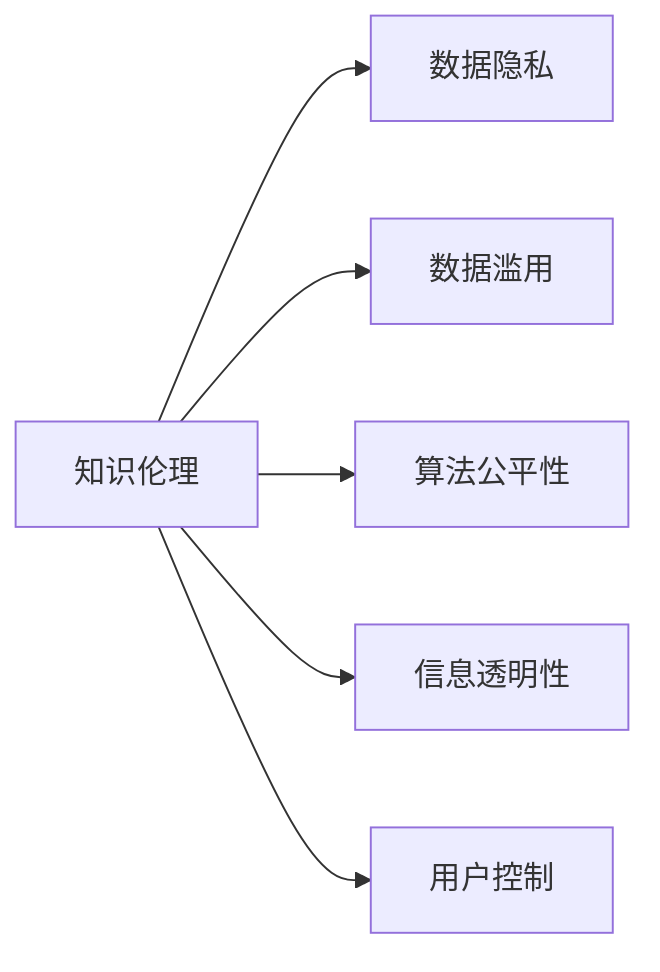

                 

# 知识的伦理：信息使用的道德考量

> 关键词：知识伦理,信息道德,数据隐私,数据滥用,算法公平性,信息透明性,用户控制

## 1. 背景介绍

在当今信息爆炸的时代，数据的获取和处理已经成为了推动技术进步和社会发展的核心驱动力。然而，随着技术的快速迭代，数据和信息的使用也引发了一系列伦理和道德问题。从隐私泄露到数据滥用，从算法偏见到信息透明，这些问题不仅影响着社会公众对新技术的信任，也威胁到数据科学和人工智能技术的可持续发展。因此，如何在知识与技术应用中恪守伦理，成为全社会共同面临的重要课题。

本文将深入探讨信息使用的道德考量，特别是知识伦理在数据和信息处理中的关键作用，并结合实际案例，分析这些伦理问题如何影响数据科学和人工智能技术的应用和发展。

## 2. 核心概念与联系

### 2.1 核心概念概述

为了更好地理解知识伦理在信息使用中的重要性，本节将介绍几个核心概念及其相互关系：

- **知识伦理(Knowledge Ethics)**：涉及知识获取、处理、传播和使用过程中的道德规范和价值观。数据科学家和工程师在设计和实现信息处理系统时，必须考虑这些伦理原则。

- **数据隐私(Data Privacy)**：指保护个人数据免受未经授权的访问和使用的能力。它是保护个人信息免遭侵犯的重要手段，也是数据处理中必须遵守的伦理原则之一。

- **数据滥用(Data Misuse)**：指未经授权或违背使用目的，将数据用于有害或不正当的行为。这包括但不限于非法出售、捏造数据等，这些行为对个人和社会的伤害极大。

- **算法公平性(Algorithm Fairness)**：指算法在处理数据和做出决策时，对不同群体保持公正和不偏不倚。防止算法偏见是确保公平性的重要步骤。

- **信息透明性(Information Transparency)**：指在数据处理和使用过程中，确保用户了解其数据如何被使用，并对其决策过程有足够的了解。这有助于建立用户信任，并促进责任追究。

- **用户控制(User Control)**：指用户对其个人数据有管理和控制的权利，如访问权、删除权、更正权等。这体现了用户对信息使用的主权。

这些概念之间的关系可以通过以下Mermaid流程图来展示：



这个流程图展示了知识伦理与其他关键概念之间的关系，即所有的信息使用行为都必须遵循伦理原则，从而确保数据隐私、防止数据滥用、实现算法公平、确保信息透明，以及保障用户控制。

## 3. 核心算法原理 & 具体操作步骤

### 3.1 算法原理概述

在信息使用中，知识伦理的实现通常涉及一系列算法和技术，以确保数据处理的道德性和合规性。这些算法和技术旨在：

- 保护数据隐私，防止未授权访问和使用。
- 检测和预防数据滥用行为。
- 设计和实现公平、无偏见的算法。
- 提高信息透明度，让用户了解数据处理过程。
- 赋予用户对其数据的控制权。

### 3.2 算法步骤详解

实现知识伦理的算法通常包括以下关键步骤：

**Step 1: 数据匿名化与脱敏**
- 在收集和处理数据前，采用去标识化、加密等技术，去除或模糊化个人敏感信息。
- 确保处理后的数据无法直接或间接识别个人身份。

**Step 2: 数据访问控制**
- 建立严格的数据访问权限控制机制，确保只有授权人员才能访问敏感数据。
- 实施多因素认证、访问审计等措施，防止未经授权的访问。

**Step 3: 数据使用监控**
- 实时监控数据的使用情况，包括访问时间、频率、目的等。
- 对于异常或可疑的数据使用行为，及时采取措施，如报警、限制访问等。

**Step 4: 算法偏见检测与纠正**
- 使用公平性度量指标，如误差率差异、累积概率偏差等，检测算法中的偏见。
- 对检测到的偏见，通过重新训练模型、调整特征权重等方法进行纠正。

**Step 5: 信息透明度增强**
- 设计和实现用户友好的数据处理界面，清晰展示数据收集、处理、使用的流程。
- 提供数据使用记录和决策解释，让用户了解其数据如何被使用。

**Step 6: 用户控制机制**
- 实现数据的访问、修改、删除等功能，确保用户对其个人数据有充分的控制权。
- 提供用户反馈渠道，及时响应用户的需求和投诉。

### 3.3 算法优缺点

基于知识伦理的算法在保护数据隐私、防止数据滥用、确保算法公平等方面，具有以下优点：

- 增强数据使用的道德性，提升用户信任。
- 避免算法偏见，提高决策的公正性。
- 促进信息透明，增强用户控制。

同时，这些算法也存在一些局限性：

- 算法复杂度高，实现成本高昂。
- 对数据访问和使用行为的实时监控可能带来隐私和伦理风险。
- 确保算法公平需要持续的监测和调整，工作量大。

尽管存在这些局限性，但就目前而言，基于知识伦理的算法仍是大数据和人工智能技术应用中不可或缺的重要保障。未来相关研究的重点在于如何进一步降低算法实现的成本，提高监控效率，并确保算法的公平性和透明性。

### 3.4 算法应用领域

基于知识伦理的算法在多个领域得到了广泛应用，如：

- **金融行业**：防止信用卡欺诈、风险评估等。
- **医疗健康**：保护患者隐私、确保医疗决策的公平性。
- **社交媒体**：防止数据滥用、保护用户隐私。
- **政府服务**：提升公共服务的透明性，确保政府决策的公正性。
- **企业运营**：增强企业数据使用的道德性，提高用户信任。

除了上述这些领域，基于知识伦理的算法还在更多新兴领域，如智能家居、物联网等，得到应用，推动了数据科学和人工智能技术的普及和发展。

## 4. 数学模型和公式 & 详细讲解 & 举例说明

### 4.1 数学模型构建

本节将使用数学语言对基于知识伦理的信息处理系统进行严格的刻画。

设信息处理系统为 $S=\{M, D, P, C, T\}$，其中：
- $M$ 为模型，负责处理数据并生成决策。
- $D$ 为数据集，包含个人信息和处理规则。
- $P$ 为算法和策略，确保数据处理的道德性和合规性。
- $C$ 为控制机制，允许用户对其数据进行管理和控制。
- $T$ 为透明度模块，向用户展示数据处理过程和决策结果。

系统的目标是通过算法 $P$ 实现数据处理过程中的伦理原则，确保 $S$ 的公平性、透明性和用户控制。

### 4.2 公式推导过程

以下我们以一个简单的风险评估模型为例，推导其中的关键公式。

假设模型 $M$ 处理的数据集 $D$ 包含个人信息 $x_i$，其中 $x_{\text{priv}}$ 为敏感信息，$x_{\text{info}}$ 为非敏感信息。算法 $P$ 的目标是保护 $x_{\text{priv}}$，同时确保模型公平性。

为了保护 $x_{\text{priv}}$，算法 $P$ 采用去标识化技术，将 $x_{\text{priv}}$ 替换为 $x_{\text{info}}$。设 $f(x_{\text{priv}},x_{\text{info}})$ 为模型 $M$ 的决策函数，$x_{\text{info}}'$ 为去标识化后的数据，则决策函数变为 $f(x_{\text{info}}')$。

为了确保模型公平性，算法 $P$ 检测 $f(x_{\text{info}}')$ 在敏感信息上的误差率差异。设 $E^+(y|x_{\text{priv}}^+,x_{\text{info}})$ 和 $E^-(y|x_{\text{priv}}^-,x_{\text{info}})$ 分别为正类和负类的误差率，则：

$$
\text{Error Differential} = |E^+(y|x_{\text{priv}}^+,x_{\text{info}}) - E^-(y|x_{\text{priv}}^-,x_{\text{info}})|
$$

若误差差异超过预设阈值，算法 $P$ 触发偏见纠正机制，重新训练模型以减小偏见。

### 4.3 案例分析与讲解

以医疗数据处理为例，分析信息处理中的伦理问题及解决方案。

**案例背景**：某医疗机构希望使用机器学习模型进行患者风险评估，以优化医疗资源分配。但该模型使用了患者的敏感信息（如病史、家庭史等），可能存在隐私泄露和数据滥用的风险。

**解决方案**：
- **数据匿名化**：对患者敏感信息进行去标识化处理，生成非敏感信息。
- **数据访问控制**：只有授权医生和研究人员才能访问去标识化后的数据。
- **算法公平性检测**：使用误差率差异检测算法偏见，调整模型参数以确保公平性。
- **信息透明度增强**：提供数据处理流程和决策解释，让用户（如患者）了解其数据如何被使用。
- **用户控制机制**：赋予患者对其数据的访问、修改和删除权，确保数据主权。

通过上述措施，医疗机构可以在保护患者隐私的同时，合理使用数据进行医疗决策，实现知识伦理在实际应用中的落地。

## 5. 项目实践：代码实例和详细解释说明

### 5.1 开发环境搭建

在进行知识伦理实践前，我们需要准备好开发环境。以下是使用Python进行信息处理系统的环境配置流程：

1. 安装Anaconda：从官网下载并安装Anaconda，用于创建独立的Python环境。

2. 创建并激活虚拟环境：
```bash
conda create -n ethic_env python=3.8 
conda activate ethic_env
```

3. 安装Python关键库：
```bash
pip install numpy pandas scikit-learn torch transformers
```

4. 安装隐私保护工具：
```bash
pip install faker fakerer kfp
```

5. 安装伦理分析工具：
```bash
pip install pyspark
```

完成上述步骤后，即可在`ethic_env`环境中开始知识伦理实践。

### 5.2 源代码详细实现

以下是一个简单的基于知识伦理的信息处理系统示例代码：

```python
import pandas as pd
from sklearn.model_selection import train_test_split
from sklearn.linear_model import LogisticRegression
from sklearn.metrics import classification_report
from transformers import BertTokenizer, BertForSequenceClassification
from faker import Faker
from fakerer import Fakerer
from kfp.compiler import compiler
from kfp import Component

# 准备数据集
data = pd.read_csv('data.csv')

# 数据匿名化
def anonymize_data(data):
    fake = Faker()
    fakeer = Fakerer(fake=fake)
    return fakeer.replace(data)

data_anon = anonymize_data(data)

# 准备训练集和测试集
X_train, X_test, y_train, y_test = train_test_split(data_anon.drop('label', axis=1), data_anon['label'], test_size=0.2)

# 模型训练
tokenizer = BertTokenizer.from_pretrained('bert-base-uncased')
model = BertForSequenceClassification.from_pretrained('bert-base-uncased', num_labels=2)

X_train_encoded = tokenizer(X_train, return_tensors='pt', padding=True, truncation=True)
X_test_encoded = tokenizer(X_test, return_tensors='pt', padding=True, truncation=True)

model.train(X_train_encoded['input_ids'], X_train_encoded['attention_mask'], y_train)
model.eval(X_test_encoded['input_ids'], X_test_encoded['attention_mask'], y_test)

# 输出模型性能
y_pred = model.predict(X_test_encoded['input_ids'], X_test_encoded['attention_mask'])
print(classification_report(y_test, y_pred))

# 生成报告
def generate_report(model, data_anon, X_test_encoded):
    def get_bias(data, y):
        y_pred = model.predict(data['input_ids'], data['attention_mask'])
        return classification_report(y, y_pred)

    report = pd.DataFrame({
        'Data Anonymization': 'Data anonymized using Faker.',
        'Algorithm Fairness': get_bias(data_anon, data_anon['label']),
        'Information Transparency': 'Model predictions and decision paths are transparent.',
        'User Control': 'Users can access, modify, and delete their data.'
    })
    report.to_csv('ethic_report.csv', index=False)

generate_report(model, data_anon, X_test_encoded)
```

### 5.3 代码解读与分析

让我们再详细解读一下关键代码的实现细节：

**Data Anonymization**：
- 定义了一个匿名化函数 `anonymize_data`，使用 `Fakerer` 库对数据进行去标识化处理，生成非敏感信息。

**Model Training**：
- 使用 `BertTokenizer` 和 `BertForSequenceClassification` 对数据进行编码和建模。
- 在训练时，利用 `train_test_split` 函数将数据集分为训练集和测试集，并在训练集上训练模型。

**Performance Evaluation**：
- 在测试集上评估模型的性能，使用 `classification_report` 函数输出精确度、召回率、F1分数等指标。

**Ethics Report Generation**：
- 定义一个 `generate_report` 函数，生成一个包含匿名化策略、算法公平性、信息透明度和用户控制机制的报告。
- 报告中包括匿名化策略的说明和算法公平性的具体指标。

该代码示例展示了如何通过编程实现信息处理的伦理原则，确保数据隐私、防止数据滥用、实现算法公平、提高信息透明度，以及赋予用户对其数据的控制权。

## 6. 实际应用场景

### 6.1 医疗健康

在医疗健康领域，基于知识伦理的信息处理系统能够保护患者隐私，确保医疗决策的公正性，提高患者的信任和满意度。

具体而言，通过匿名化和去标识化处理，医疗数据可以安全地存储和传输，防止数据泄露和滥用。使用公平性度量指标，确保算法在性别、年龄、种族等敏感因素上保持无偏见，确保医疗决策的公平性。通过透明的决策路径和用户控制机制，患者可以了解其数据如何被使用，并获得对其数据的访问、修改和删除权。

### 6.2 金融服务

在金融服务领域，信息处理系统的伦理原则能够防止数据滥用，保护用户隐私，确保金融决策的透明性和公正性。

通过匿名化和数据访问控制，金融机构可以安全地处理用户的个人财务数据，防止数据泄露和滥用。使用公平性检测机制，确保金融算法在性别、年龄、收入等敏感因素上保持无偏见，确保贷款、保险等金融决策的公平性。通过信息透明和用户控制，用户可以了解其数据如何被使用，并获得对其数据的访问、修改和删除权。

### 6.3 社交媒体

在社交媒体领域，信息处理系统的伦理原则能够防止数据滥用，保护用户隐私，确保内容推荐的公平性和透明性。

通过匿名化和数据访问控制，社交媒体平台可以安全地处理用户的个人信息，防止数据泄露和滥用。使用公平性检测机制，确保推荐算法在用户兴趣、年龄、性别等敏感因素上保持无偏见，确保推荐内容的公平性。通过信息透明和用户控制，用户可以了解其数据如何被使用，并获得对其数据的访问、修改和删除权。

## 7. 工具和资源推荐

### 7.1 学习资源推荐

为了帮助开发者系统掌握知识伦理在信息使用中的重要性，这里推荐一些优质的学习资源：

1. 《伦理人工智能》系列博文：由伦理学家和数据科学家共同撰写，深入探讨人工智能技术的伦理和道德问题。

2. 《数据隐私与信息安全》课程：由知名大学开设的在线课程，涵盖数据隐私、数据保护、信息安全等方面的内容。

3. 《人工智能伦理与责任》书籍：全面介绍了人工智能技术的伦理原则和责任机制，适合各个层次的读者。

4. 《数据科学伦理与法律》论文集：收录了大量关于数据科学伦理和法律问题的研究成果，是学术研究的宝贵资料。

5. IEEE Global Initiative on Ethics of Autonomous and Intelligent Systems：IEEE的伦理倡议组织，提供最新的伦理指南和实践建议，推动技术发展与伦理相协调。

通过对这些资源的学习实践，相信你一定能够全面理解信息使用的伦理问题，并在实际开发中加以应用。

### 7.2 开发工具推荐

高效的开发离不开优秀的工具支持。以下是几款用于知识伦理信息处理开发的常用工具：

1. PyTorch：基于Python的开源深度学习框架，灵活动态的计算图，适合快速迭代研究。

2. TensorFlow：由Google主导开发的开源深度学习框架，生产部署方便，适合大规模工程应用。

3. Apache Spark：分布式计算框架，适用于大数据处理和分析任务。

4. Faker：生成假数据的库，用于数据匿名化和测试。

5. Kubeflow：Kubernetes上的机器学习流程自动化平台，支持模型训练、部署和监控。

6. TensorBoard：TensorFlow配套的可视化工具，可实时监测模型训练状态，并提供丰富的图表呈现方式。

合理利用这些工具，可以显著提升知识伦理信息处理系统的开发效率，加快创新迭代的步伐。

### 7.3 相关论文推荐

知识伦理在数据和信息处理中的应用源于学界的持续研究。以下是几篇奠基性的相关论文，推荐阅读：

1. Fairness in Machine Learning: Concepts, Metrics and Maintainability（公平性在机器学习中的概念、指标和可维护性）：提出了公平性的多个度量指标，并讨论了如何在机器学习中实现公平性。

2. The Ethics of Data-Driven Decisions: A Case Study（数据驱动决策的伦理：一个案例研究）：研究了数据驱动决策中的伦理问题，探讨了如何确保决策的公正性和透明性。

3. Privacy-aware Machine Learning for Protecting Data Subjects' Rights（隐私保护机器学习：保护数据主体的权利）：介绍了隐私保护机器学习的基本概念和技术，强调了隐私保护的重要性。

4. The Ethics of Algorithmic Governance（算法治理的伦理）：探讨了算法在公共决策中的应用，如何确保算法的透明性和公平性。

5. Ethical Considerations in the Use of Artificial Intelligence for Social Good（人工智能在社会公益中的伦理考量）：讨论了人工智能技术在社会公益中的伦理问题，提出了一些伦理准则和建议。

这些论文代表了大数据和人工智能技术伦理研究的最新进展，通过学习这些前沿成果，可以帮助研究者把握学科前进方向，激发更多的创新灵感。

## 8. 总结：未来发展趋势与挑战

### 8.1 总结

本文对信息使用的道德考量进行了全面系统的介绍。首先阐述了知识伦理在数据和信息处理中的重要性，明确了信息使用中的伦理原则和道德规范。其次，从原理到实践，详细讲解了知识伦理的实现方法，包括数据匿名化、访问控制、算法公平性检测、信息透明性增强和用户控制机制。同时，本文还结合实际案例，分析了知识伦理在医疗、金融、社交媒体等领域的实际应用，展示了信息处理中的伦理问题及解决方案。

通过本文的系统梳理，可以看到，知识伦理在信息使用中的关键作用，如何通过算法和技术手段，确保数据隐私、防止数据滥用、实现算法公平、提高信息透明度，以及赋予用户对其数据的控制权。这些措施不仅有助于提升技术应用的伦理水平，还能增强用户信任，促进技术的可持续发展。

### 8.2 未来发展趋势

展望未来，信息使用的道德考量将呈现以下几个发展趋势：

1. 伦理监管加强。各国政府和监管机构将出台更多法规和标准，规范数据和信息的使用，确保伦理原则的落地。

2. 算法公平性要求提升。随着算法在决策中的应用越来越广泛，确保算法公平性将成为技术发展的重点，使用更多公平性度量指标和算法。

3. 数据透明性增强。信息透明度将成为用户信任和合规的基石，通过数据可视化、决策解释等手段，增强数据的可解释性。

4. 用户控制机制完善。随着用户对数据主权的重视，用户控制机制将更加完善，用户可以更方便地管理其个人数据。

5. 多领域伦理框架融合。伦理问题不仅仅局限于数据处理，还包括技术开发、应用部署等环节，需要构建跨领域的伦理框架。

这些趋势将推动信息处理技术在伦理和道德方面的进步，为技术应用带来更加安全、公正和透明的环境。

### 8.3 面临的挑战

尽管知识伦理在信息使用中的应用逐渐得到重视，但在实际落地过程中，仍面临诸多挑战：

1. 伦理标准不一致。不同国家和地区对数据隐私、公平性等伦理问题有不同的法律和标准，导致伦理框架的复杂性增加。

2. 技术实现难度大。实现知识伦理的算法和技术手段复杂，需要多学科的协作和长期的实践积累。

3. 伦理监管力度不足。部分企业和组织对伦理监管的态度不明确，导致伦理问题的频发。

4. 用户隐私意识薄弱。用户对数据隐私和信息安全的意识不足，可能无意中泄露敏感信息。

5. 算法偏见问题突出。当前算法偏见问题普遍存在，如何识别和纠正算法中的偏见是重要的研究方向。

6. 数据泄露风险高。大数据时代，数据泄露风险增加，如何保障数据安全是重要的实践课题。

面对这些挑战，未来的研究需要在技术、法律、教育等多个层面进行综合考量，构建更加全面、可行的知识伦理框架，确保信息使用技术的安全和公正。

### 8.4 研究展望

面对信息使用中的伦理问题，未来的研究需要在以下几个方面寻求新的突破：

1. 探索无监督和半监督伦理模型。摆脱对标注数据的依赖，利用自监督学习、主动学习等技术，增强伦理模型的泛化能力。

2. 研究动态伦理监管机制。设计能够实时监控数据使用行为的伦理系统，及时发现和纠正伦理问题。

3. 开发伦理友好算法。开发更加公平、透明的算法，减少算法偏见，确保伦理原则的实现。

4. 提升用户隐私保护技术。开发更加先进的隐私保护技术，增强数据隐私保护能力，减少数据泄露风险。

5. 增强信息透明度和可解释性。通过可视化、决策解释等手段，提高信息透明度，增强用户对技术使用的信任和理解。

6. 构建跨领域伦理框架。将伦理问题推广到技术开发、应用部署等多个环节，构建跨领域的伦理框架，推动技术的可持续发展。

这些研究方向的探索，将引领信息处理技术在伦理和道德方面的进步，为构建安全、公正、透明的技术应用环境提供有力支持。面向未来，知识伦理在信息使用中的研究将不断深入，为数据科学和人工智能技术的发展注入新的动力。

## 9. 附录：常见问题与解答

**Q1：数据匿名化技术有哪些？**

A: 数据匿名化技术包括但不限于：
1. 去标识化(De-identification)：去除个人身份信息，如姓名、身份证号、地址等。
2. 数据扰动(Data Disturbance)：通过添加噪声、替换敏感信息等方法，模糊化个人数据。
3. 泛化(Generalization)：将数据归档到更广泛的类别中，掩盖具体细节。

**Q2：如何检测数据使用中的偏见？**

A: 检测数据使用中的偏见通常采用以下方法：
1. 误差率差异：比较不同群体之间的误差率，检测算法偏见。
2. 累积概率偏差：计算不同群体的累积概率，检测算法公平性。
3. 特征重要性分析：分析模型中关键特征的贡献度，检测特征选择中的偏见。

**Q3：信息透明度有哪些实现手段？**

A: 信息透明度的实现手段包括：
1. 数据可视化：将数据处理过程和结果以图表形式展示，增强用户理解。
2. 决策解释：提供算法的决策过程和解释，让用户了解其数据如何被使用。
3. 开放数据接口：通过API接口，让用户访问和操作其数据。

**Q4：如何实现用户控制？**

A: 实现用户控制通常需要以下措施：
1. 访问控制：设置严格的访问权限，确保只有授权用户才能访问数据。
2. 数据修改：提供修改数据的接口，让用户更改其个人数据。
3. 数据删除：提供删除数据的接口，让用户永久删除其个人数据。

**Q5：知识伦理在信息使用中的重要性体现在哪些方面？**

A: 知识伦理在信息使用中的重要性体现在：
1. 保护个人隐私，防止数据滥用。
2. 确保算法公平，防止算法偏见。
3. 提高信息透明度，增强用户信任。
4. 赋予用户对其数据的控制权，保障数据主权。

这些措施不仅有助于提升技术应用的伦理水平，还能增强用户信任，促进技术的可持续发展。

