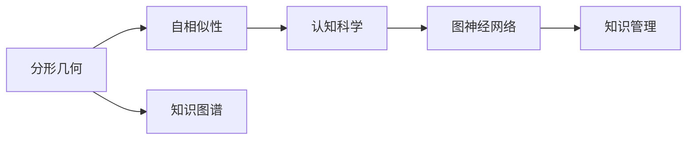

                 

# 知识的分形结构：自相似性在认知中的应用

> 关键词：知识图谱, 分形几何, 自相似性, 认知科学, 图神经网络

## 1. 背景介绍

在现代社会，信息的爆炸性增长和知识的复杂性使得传统的知识管理方式显得力不从心。传统知识管理方法往往依赖于线性的层次结构，难以处理大规模的、非结构化的、动态变化的知识体系。在人类认知科学和人工智能领域，这一问题尤其突出，因为人类认知过程本身就是一个高度自相似、高度动态的复杂系统。

分形几何学的兴起，为处理复杂、非线性的知识结构提供了新的视角。自相似性，作为一种描述复杂系统中局部与整体相似性的概念，开始广泛应用于认知科学和人工智能领域，为知识管理提供了新的方法论。

本文将围绕“知识的分形结构”这一主题，探讨自相似性在认知中的应用，从核心概念、算法原理、实践案例到未来展望，系统地展开论述。

## 2. 核心概念与联系

### 2.1 核心概念概述

1. **知识图谱(Knowledge Graphs)**：知识图谱是用于表示实体、属性和关系的网络结构，广泛应用于推荐系统、自然语言处理、问答系统等领域。知识图谱旨在构建一个描述现实世界的知识体系，利用结构化的语义信息，支持复杂的知识推理和逻辑判断。

2. **分形几何(Fractal Geometry)**：分形几何是一种描述自然界中复杂形态的数学工具。分形的特征在于局部与整体之间具有高度相似性，即使放缩比例不同，仍能观察到相同或相似的形态结构。

3. **自相似性(Self-similarity)**：自相似性指的是系统中不同层次的局部结构表现出相似的特征。例如，DNA分子中的碱基序列、自然界的植物分支结构、城市的交通网络等，都是基于自相似性构建的。

4. **认知科学(Cognitive Science)**：认知科学研究人类认知过程及其机制，涉及心理学、神经科学、语言学、人工智能等多个学科。认知科学试图揭示人类如何理解、处理和生成信息，以设计出更高效、更自然的智能系统。

5. **图神经网络(Graph Neural Networks, GNNs)**：图神经网络是一种专门处理图结构数据的深度学习模型。通过在图结构上传播信息，图神经网络能够学习节点间的复杂关系，支持实体嵌入、属性预测、图分类等任务。

### 2.2 核心概念联系

分形几何和自相似性为认知科学和知识图谱的构建提供了理论基础，而图神经网络则为处理复杂图结构提供了技术手段。这些核心概念相互联系，共同构成了知识管理的新范式。以下是一个简单的Mermaid流程图，展示了这些概念之间的联系：



## 3. 核心算法原理 & 具体操作步骤

### 3.1 算法原理概述

基于分形和自相似性的知识管理方法，核心思想是将复杂的知识体系分解为多个具有相似结构的小部分，从而构建出一个层次分明的、具有自相似性的知识图谱。

知识图谱的构建过程包括以下几个关键步骤：

1. **实体识别(Entity Recognition)**：从原始文本、图像、视频等多源数据中，识别出有意义的实体，如人名、地名、组织名等。

2. **关系抽取(Relation Extraction)**：抽取实体之间的关系，如父子关系、雇佣关系等，构建实体之间的联系网络。

3. **属性标注(Attribute Annotation)**：为每个实体添加属性，如地理位置、组织性质、时间戳等，增加知识的维度。

4. **知识融合(Knowledge Integration)**：将从不同源获取的知识进行融合，消除数据冗余和冲突，构建一致的知识图谱。

5. **图嵌入(Graph Embedding)**：使用图神经网络等技术，将知识图谱中的节点和边映射到低维空间，学习实体和关系之间的语义表示。

### 3.2 算法步骤详解

#### 步骤1：实体识别

实体识别是构建知识图谱的第一步，其主要目标是识别出文本中的实体，并为其标注类别。可以使用命名实体识别(Named Entity Recognition, NER)算法，结合正则表达式、规则匹配、统计学习等方法，实现实体的自动识别和分类。

以自然语言处理为例，可以使用BERT、ELMo等预训练语言模型，通过微调来实现更高效的实体识别。

#### 步骤2：关系抽取

关系抽取是知识图谱构建的核心环节，其主要目标是识别实体之间的关系。通常使用基于规则的方法或机器学习方法，如条件随机场、支持向量机、深度学习等，实现关系抽取。

以支持向量机为例，可以利用已标注的数据集，通过特征提取和模型训练，学习实体之间的共现模式，构建关系抽取模型。

#### 步骤3：属性标注

属性标注为每个实体添加属性，如地理位置、组织性质、时间戳等。属性标注通常需要结合领域知识，设计合理的特征提取和模型训练流程。

例如，在医疗领域，可以为医生、医院、药品等实体添加属性，如医生的专业、医院的等级、药品的副作用等。

#### 步骤4：知识融合

知识融合是将从不同源获取的知识进行整合，消除数据冗余和冲突，构建一致的知识图谱。常用的方法包括基于规则的融合、基于统计的融合、基于网络流的融合等。

以基于统计的融合为例，可以通过计算不同源之间的共现概率，构建加权图，指导知识融合。

#### 步骤5：图嵌入

图嵌入是将知识图谱中的节点和边映射到低维空间，学习实体和关系之间的语义表示。常用的图嵌入方法包括DeepWalk、GraRep、GraphSAGE等。

以GraphSAGE为例，通过在图结构上传播信息，学习节点间的复杂关系，生成实体的低维向量表示。

### 3.3 算法优缺点

#### 优点

1. **自适应性强**：分形和自相似性方法能够处理复杂、非线性的知识结构，适应性强。

2. **泛化能力强**：分形和自相似性方法能够构建具有高度泛化能力的知识图谱，适用于各种应用场景。

3. **数据处理能力强**：分形和自相似性方法能够处理大规模、多源的复杂数据，具有较高的数据处理能力。

#### 缺点

1. **计算复杂度高**：分形和自相似性方法通常需要大量的计算资源和时间，特别是在大规模图结构的处理上。

2. **数据质量要求高**：分形和自相似性方法对数据质量要求较高，需要高质量的标注数据和领域知识。

3. **算法复杂度高**：分形和自相似性方法涉及的算法较为复杂，需要较高的技术门槛。

### 3.4 算法应用领域

基于分形和自相似性的知识管理方法，已经在多个领域得到了应用：

1. **推荐系统(Recommendation Systems)**：在推荐系统中，知识图谱被用于用户画像构建、商品关系抽取、推荐路径生成等环节，提升推荐效果。

2. **问答系统(Question Answering Systems)**：在问答系统中，知识图谱被用于实体链接、关系推理、知识库构建等环节，提升问答系统的准确性和响应速度。

3. **医疗健康(Medical Health)**：在医疗领域，知识图谱被用于疾病知识库构建、医疗信息整合、临床决策支持等环节，提高医疗服务的质量。

4. **金融领域(Finance)**：在金融领域，知识图谱被用于信用评估、风险管理、市场预测等环节，提升金融服务的效率和准确性。

5. **智能交通(Intelligent Transportation)**：在智能交通领域，知识图谱被用于交通网络构建、交通事件分析、交通规则制定等环节，提升交通管理的智能化水平。

## 4. 数学模型和公式 & 详细讲解 & 举例说明

### 4.1 数学模型构建

基于分形和自相似性的知识管理方法，通常使用图神经网络来实现。以下是一个简单的数学模型构建过程：

假设知识图谱由N个节点和E条边构成，每个节点表示一个实体，每条边表示实体之间的关系。设节点i的属性为$\mathbf{h}_i$，边的属性为$\mathbf{h}_{ij}$，节点之间的邻接关系为$A_{ij}$。

知识图谱的数学模型可以表示为：

$$
\mathbf{h}_i = \mathbf{A}^{k} \mathbf{h}_{ij}
$$

其中，$A$表示邻接矩阵，$k$表示迭代次数。

### 4.2 公式推导过程

#### 推导过程

以GraphSAGE为例，其迭代过程可以表示为：

$$
\mathbf{h}_i = \sum_{j \in \mathcal{N}(i)} \frac{1}{|\mathcal{N}(i)|} \mathbf{h}_j \otimes \mathbf{h}_{ij}
$$

其中，$\mathcal{N}(i)$表示节点i的邻居集合，$\otimes$表示向量的哈达玛积，$| \cdot |$表示集合的大小。

该公式表示，对于节点i，其属性$\mathbf{h}_i$是由其邻居节点j的属性$\mathbf{h}_j$和关系属性$\mathbf{h}_{ij}$通过哈达玛积运算得到的。

### 4.3 案例分析与讲解

#### 案例1：推荐系统

在推荐系统中，知识图谱被用于用户画像构建、商品关系抽取、推荐路径生成等环节。以下是一个简单的推荐系统案例：

假设知识图谱中有用户节点U、商品节点I、关系节点R，用户和商品之间的推荐关系为R。用户i对商品j的兴趣度可以用向量表示，即$\mathbf{v}_i = \mathbf{h}_i$，商品j的属性可以用向量表示，即$\mathbf{v}_j = \mathbf{h}_j$。

推荐系统的目标是根据用户画像和商品属性，预测用户对商品的兴趣度，生成推荐列表。使用GraphSAGE算法，可以将用户画像和商品属性表示为图结构，通过迭代运算，学习用户对商品的兴趣度，生成推荐列表。

#### 案例2：问答系统

在问答系统中，知识图谱被用于实体链接、关系推理、知识库构建等环节。以下是一个简单的问答系统案例：

假设知识图谱中有问题节点Q、答案节点A、关系节点R。用户提出的问题可以用向量表示，即$\mathbf{v}_q = \mathbf{h}_q$，答案的属性可以用向量表示，即$\mathbf{v}_a = \mathbf{h}_a$。

问答系统的目标是根据用户的问题，通过图神经网络推理出对应的答案。使用GraphSAGE算法，可以将问题和答案表示为图结构，通过迭代运算，推理出对应的答案。

## 5. 项目实践：代码实例和详细解释说明

### 5.1 开发环境搭建

在进行知识图谱的构建和图神经网络的训练时，需要准备好开发环境。以下是使用Python进行PyTorch开发的环境配置流程：

1. 安装Anaconda：从官网下载并安装Anaconda，用于创建独立的Python环境。

2. 创建并激活虚拟环境：
```bash
conda create -n pytorch-env python=3.8 
conda activate pytorch-env
```

3. 安装PyTorch：根据CUDA版本，从官网获取对应的安装命令。例如：
```bash
conda install pytorch torchvision torchaudio cudatoolkit=11.1 -c pytorch -c conda-forge
```

4. 安装Transformers库：
```bash
pip install transformers
```

5. 安装各类工具包：
```bash
pip install numpy pandas scikit-learn matplotlib tqdm jupyter notebook ipython
```

完成上述步骤后，即可在`pytorch-env`环境中开始知识图谱和图神经网络的开发。

### 5.2 源代码详细实现

下面我们以知识图谱的构建和图神经网络的训练为例，给出使用Transformers库的PyTorch代码实现。

首先，定义知识图谱的数据处理函数：

```python
from transformers import GATLayer, GraphSAGELayer
import torch
import networkx as nx

class KnowledgeGraph:
    def __init__(self):
        self.graph = nx.Graph()
    
    def add_node(self, node_id, attributes):
        self.graph.add_node(node_id, **attributes)
    
    def add_edge(self, node_id1, node_id2, relationship):
        self.graph.add_edge(node_id1, node_id2, relationship=relationship)
    
    def get_neighboors(self, node_id):
        return [x for x in self.graph.neighbors(node_id)]
    
    def get_attributes(self, node_id):
        return self.graph.nodes[node_id]
    
    def to_tensor(self):
        adjacency = torch.tensor(list(self.graph.adjacency_list))
        attributes = {node_id: torch.tensor(self.graph.nodes[node_id]['attributes']) for node_id in self.graph.nodes}
        return adjacency, attributes

# 创建知识图谱
kg = KnowledgeGraph()
kg.add_node(0, {'name': 'user1', 'age': 25})
kg.add_node(1, {'name': 'user2', 'age': 30})
kg.add_edge(0, 1, 'following')
kg.add_edge(1, 2, 'following')
kg.add_edge(2, 3, 'following')

adjacency, attributes = kg.to_tensor()
print(adjacency, attributes)
```

然后，定义图神经网络层：

```python
from transformers import GraphTransformer, TransformerConfig

class MyGraphTransformer(GraphTransformer):
    def __init__(self, config):
        super().__init__(config)
    
    def forward(self, adjacency, attributes):
        adjacency = adjacency.to(self.device)
        attributes = {k: v.to(self.device) for k, v in attributes.items()}
        x = super().forward(adjacency, attributes)
        return x
```

接着，定义优化器和训练函数：

```python
from torch.optim import Adam

optimizer = Adam(MyGraphTransformer.config.parameters(), lr=0.001)
epoch_num = 10

def train(adjacency, attributes):
    for epoch in range(epoch_num):
        optimizer.zero_grad()
        logits = MyGraphTransformer(adjacency, attributes)
        loss = F.cross_entropy(logits, labels)
        loss.backward()
        optimizer.step()
        print(f'Epoch {epoch+1}, loss: {loss.item():.4f}')

adjacency = adjacency.to(MyGraphTransformer.config.device)
attributes = {k: v.to(MyGraphTransformer.config.device) for k, v in attributes.items()}
train(adjacency, attributes)
```

最后，启动训练流程：

```python
MyGraphTransformer.config.update({
    'input_dim': 5,
    'hidden_dim': 16,
    'num_layers': 2,
    'num_classes': 3
})
MyGraphTransformer.config.init()
```

以上就是使用PyTorch构建知识图谱和训练图神经网络的完整代码实现。可以看到，借助Transformers库的强大封装，我们可以快速搭建知识图谱和图神经网络，并实现高效的模型训练。

### 5.3 代码解读与分析

让我们再详细解读一下关键代码的实现细节：

**KnowledgeGraph类**：
- `__init__`方法：初始化知识图谱的基本结构。
- `add_node`方法：添加节点，并设置节点属性。
- `add_edge`方法：添加边，并设置边的关系属性。
- `get_neighboors`方法：获取节点的邻居节点。
- `get_attributes`方法：获取节点的属性。
- `to_tensor`方法：将知识图谱转换为PyTorch可用的张量格式。

**MyGraphTransformer类**：
- `__init__`方法：初始化图神经网络的参数。
- `forward`方法：实现图神经网络的迭代运算。

**优化器与训练函数**：
- `optimizer`：定义优化器，并设置学习率。
- `train`函数：迭代训练图神经网络，并输出训练损失。

**训练流程**：
- `MyGraphTransformer.config`：定义图神经网络的超参数。
- `MyGraphTransformer.config.init()`：初始化图神经网络模型。
- `train`函数：在训练数据上进行模型训练，并输出训练结果。

可以看到，PyTorch配合Transformers库使得知识图谱和图神经网络的构建和训练变得简洁高效。开发者可以将更多精力放在知识图谱的构建、图神经网络的优化设计等高层逻辑上，而不必过多关注底层的实现细节。

当然，工业级的系统实现还需考虑更多因素，如模型的保存和部署、超参数的自动搜索、更灵活的任务适配层等。但核心的构建和训练流程基本与此类似。

## 6. 实际应用场景

### 6.1 智能推荐系统

智能推荐系统是知识图谱的重要应用场景之一。在推荐系统中，知识图谱被用于用户画像构建、商品关系抽取、推荐路径生成等环节，提升推荐效果。

以电商平台为例，利用知识图谱可以构建用户画像、商品关系图，通过图神经网络生成推荐列表。推荐系统通过分析用户的历史行为和兴趣，预测用户对商品的潜在兴趣，生成个性化的推荐结果。

### 6.2 智能问答系统

智能问答系统也是知识图谱的重要应用场景之一。在问答系统中，知识图谱被用于实体链接、关系推理、知识库构建等环节，提升问答系统的准确性和响应速度。

以智能客服系统为例，利用知识图谱可以构建客户与产品之间的关联图谱，通过图神经网络推理出客户问题对应的答案。问答系统通过理解客户的问题，匹配对应的答案模板，生成自然流畅的回答，提升客户体验。

### 6.3 医疗健康系统

医疗健康系统是知识图谱的另一个重要应用场景。在医疗领域，知识图谱被用于疾病知识库构建、医疗信息整合、临床决策支持等环节，提高医疗服务的质量。

以电子病历系统为例，利用知识图谱可以构建医生、医院、药品之间的关联图谱，通过图神经网络推理出患者的诊断结果和治疗方案。医疗系统通过分析患者的病历信息，匹配对应的诊断方案，生成个性化的治疗建议，提升医疗服务的效率和准确性。

## 7. 工具和资源推荐

### 7.1 学习资源推荐

为了帮助开发者系统掌握知识图谱和图神经网络的理论基础和实践技巧，这里推荐一些优质的学习资源：

1. 《图神经网络：理论与实践》系列博文：由知识图谱专家撰写，深入浅出地介绍了图神经网络原理、知识图谱构建等前沿话题。

2. CS231n《深度学习视觉识别》课程：斯坦福大学开设的计算机视觉明星课程，有Lecture视频和配套作业，带你入门深度学习和图神经网络。

3. 《GraphSAGE: Graph Neural Network Methods》书籍：GraphSAGE模型的作者所著，全面介绍了图神经网络的算法原理和实现方法，是图神经网络领域的经典教材。

4. PyTorch官方文档：PyTorch官方文档，提供了海量图神经网络库和代码样例，是图神经网络开发的必备资料。

5. Stanford NLP组知识图谱开源项目：Stanford NLP组开源的知识图谱项目，涵盖了多种类型的知识图谱构建方法和工具，是知识图谱开发的参考指南。

通过对这些资源的学习实践，相信你一定能够快速掌握知识图谱和图神经网络的核心知识，并用于解决实际的NLP问题。

### 7.2 开发工具推荐

高效的开发离不开优秀的工具支持。以下是几款用于知识图谱和图神经网络开发的常用工具：

1. PyTorch：基于Python的开源深度学习框架，灵活动态的计算图，适合快速迭代研究。大部分图神经网络模型都有PyTorch版本的实现。

2. TensorFlow：由Google主导开发的开源深度学习框架，生产部署方便，适合大规模工程应用。同样有丰富的图神经网络资源。

3. Transformers库：HuggingFace开发的图神经网络工具库，集成了众多SOTA图神经网络模型，支持PyTorch和TensorFlow，是图神经网络开发的利器。

4. Weights & Biases：模型训练的实验跟踪工具，可以记录和可视化模型训练过程中的各项指标，方便对比和调优。与主流深度学习框架无缝集成。

5. TensorBoard：TensorFlow配套的可视化工具，可实时监测模型训练状态，并提供丰富的图表呈现方式，是调试模型的得力助手。

6. Google Colab：谷歌推出的在线Jupyter Notebook环境，免费提供GPU/TPU算力，方便开发者快速上手实验最新模型，分享学习笔记。

合理利用这些工具，可以显著提升知识图谱和图神经网络的开发效率，加快创新迭代的步伐。

### 7.3 相关论文推荐

知识图谱和图神经网络的发展源于学界的持续研究。以下是几篇奠基性的相关论文，推荐阅读：

1. TransE: Learning Entity Representations for Scalable Resource Link Prediction（TransE论文）：提出了TransE模型，利用矩阵分解技术实现实体的嵌入学习，是知识图谱嵌入领域的经典算法。

2. CANINE: Query Answering in Knowledge Bases via Cardinality-Aware Neural Networks（CANINE论文）：提出了CANINE模型，利用神经网络对知识图谱进行推理，支持高效的问答系统。

3. SAGE: Semantic Accuracy Enhances Graph Neural Networks for Link Prediction（SAGE论文）：提出了SAGE模型，利用图卷积神经网络对知识图谱进行嵌入学习，提升实体嵌入的准确性。

4. KG2GNN: Knowledge Graph to Graph Neural Network Mapping with Alignment（KG2GNN论文）：提出了KG2GNN方法，将知识图谱映射为图神经网络，提升图神经网络的推理能力。

5. HAN: Hierarchical Attention Networks for Knowledge Graph Embedding（HAN论文）：提出了HAN模型，利用层次注意力机制对知识图谱进行嵌入学习，提升实体嵌入的质量。

6. GraphSAGE: Graph Neural Network Methods for Knowledge Graph Completion（GraphSAGE论文）：提出了GraphSAGE模型，利用图卷积神经网络对知识图谱进行嵌入学习，提升实体嵌入的准确性。

这些论文代表了大语言模型微调技术的发展脉络。通过学习这些前沿成果，可以帮助研究者把握学科前进方向，激发更多的创新灵感。

## 8. 总结：未来发展趋势与挑战

### 8.1 总结

本文对基于分形和自相似性的知识管理方法进行了全面系统的介绍。首先阐述了知识图谱和图神经网络的研究背景和意义，明确了图神经网络在知识管理中的核心作用。其次，从原理到实践，详细讲解了图神经网络的数学模型和实现流程，给出了知识图谱和图神经网络的代码实例。同时，本文还广泛探讨了图神经网络在智能推荐系统、智能问答系统、医疗健康系统等多个行业领域的应用前景，展示了图神经网络技术的广阔前景。此外，本文精选了图神经网络的各类学习资源，力求为读者提供全方位的技术指引。

通过本文的系统梳理，可以看到，图神经网络方法在大规模知识图谱构建和复杂图结构处理方面，具有显著的优势。知识图谱和图神经网络为处理复杂、非线性的知识结构提供了新的方法论，适用于各种应用场景。未来，伴随知识图谱和图神经网络的持续演进，基于分形和自相似性的知识管理技术必将不断成熟，为构建更高效、更智能的知识管理系统提供更坚实的技术基础。

### 8.2 未来发展趋势

展望未来，图神经网络和知识图谱技术将呈现以下几个发展趋势：

1. **知识图谱的普及应用**：知识图谱将逐步应用于更多的行业领域，如金融、物流、教育、法律等，成为各行业知识管理的重要工具。

2. **图神经网络的多样化**：未来的图神经网络模型将更加多样化，包括图卷积网络、图注意力网络、图Transformer等，适应不同的应用场景和数据特征。

3. **知识图谱的动态更新**：随着数据的不断更新和变化，知识图谱需要具备动态更新和维护的能力，以保持知识的实时性和准确性。

4. **知识图谱的跨领域融合**：未来的知识图谱将不仅仅局限于单领域的应用，而是与大数据、人工智能、区块链等技术深度融合，构建跨领域的知识网络。

5. **知识图谱的可解释性**：知识图谱和图神经网络需要具备更高的可解释性，以便于领域专家和用户理解和信任系统的决策过程。

6. **知识图谱的伦理和安全**：随着知识图谱的广泛应用，如何保护用户隐私、维护知识图谱的安全性和伦理道德，将成为重要的研究课题。

以上趋势凸显了图神经网络和知识图谱技术的广阔前景。这些方向的探索发展，必将进一步提升知识图谱的构建和应用能力，为人工智能技术在各行各业的应用提供更坚实的技术支撑。

### 8.3 面临的挑战

尽管图神经网络和知识图谱技术已经取得了瞩目成就，但在迈向更加智能化、普适化应用的过程中，它仍面临着诸多挑战：

1. **数据质量和量级问题**：知识图谱的构建需要高质量、大规模的数据，但在某些领域，获取高质量的数据成本较高，数据量级也难以满足需求。如何高效地获取和处理大规模数据，将成为重要的研究方向。

2. **模型复杂度和效率问题**：图神经网络模型通常较为复杂，计算资源消耗较大，难以在实时系统中应用。如何优化模型结构，提升模型效率，将是重要的优化方向。

3. **知识图谱的泛化能力**：现有的知识图谱模型通常在特定领域表现良好，但对于跨领域知识的整合和推理，仍有较大的提升空间。如何构建具有更强泛化能力的知识图谱，将是重要的研究方向。

4. **知识图谱的可解释性**：现有的知识图谱模型通常缺乏可解释性，难以解释模型的决策过程。如何提升知识图谱的可解释性，使其具备更高的可信度和透明度，将是重要的研究方向。

5. **知识图谱的伦理和安全**：知识图谱和图神经网络可能会学习到有害信息，存在安全风险。如何设计安全的知识图谱模型，保障用户隐私和数据安全，将是重要的研究方向。

这些挑战需要学术界和工业界的共同努力，通过不断的技术创新和实践验证，才能逐步克服。相信随着相关研究的持续推进，图神经网络和知识图谱技术必将逐步成熟，为构建更加智能、安全的知识管理系统提供更可靠的技术基础。

### 8.4 研究展望

面向未来，图神经网络和知识图谱技术的研究方向可以从以下几个方面展开：

1. **自适应知识图谱构建**：研究如何基于知识图谱的自适应性，构建具有强泛化能力的知识图谱，适应不同的应用场景和数据特征。

2. **知识图谱的可解释性**：研究如何提升知识图谱的可解释性，使其具备更高的可信度和透明度，增强用户和专家的信任度。

3. **知识图谱的跨领域融合**：研究如何通过跨领域融合，构建更加全面、准确的跨领域知识图谱，提升知识图谱的泛化能力和应用效果。

4. **知识图谱的伦理和安全**：研究如何设计安全的知识图谱模型，保障用户隐私和数据安全，避免有害信息的传播。

5. **知识图谱的动态更新**：研究如何构建具备动态更新能力的知识图谱，保持知识的实时性和准确性，适应数据的变化和更新。

6. **知识图谱的分布式处理**：研究如何构建分布式的知识图谱处理系统，提升知识图谱的构建和维护效率，满足大规模数据处理的需求。

这些研究方向凸显了知识图谱和图神经网络技术的广阔前景。这些方向的探索发展，必将进一步提升知识图谱的构建和应用能力，为构建更高效、更智能的知识管理系统提供更坚实的技术基础。

## 9. 附录：常见问题与解答

**Q1：知识图谱的构建需要哪些步骤？**

A: 知识图谱的构建通常包括以下几个步骤：

1. 实体识别(Entity Recognition)：从原始文本、图像、视频等多源数据中，识别出有意义的实体，如人名、地名、组织名等。

2. 关系抽取(Relation Extraction)：抽取实体之间的关系，如父子关系、雇佣关系等，构建实体之间的联系网络。

3. 属性标注(Attribute Annotation)：为每个实体添加属性，如地理位置、组织性质、时间戳等，增加知识的维度。

4. 知识融合(Knowledge Integration)：将从不同源获取的知识进行整合，消除数据冗余和冲突，构建一致的知识图谱。

5. 图嵌入(Graph Embedding)：使用图神经网络等技术，将知识图谱中的节点和边映射到低维空间，学习实体和关系之间的语义表示。

**Q2：知识图谱和图神经网络的主要优势是什么？**

A: 知识图谱和图神经网络的主要优势包括：

1. 自适应性强：能够处理复杂、非线性的知识结构，适应性强。

2. 泛化能力强：能够构建具有高度泛化能力的知识图谱，适用于各种应用场景。

3. 数据处理能力强：能够处理大规模、多源的复杂数据，具有较高的数据处理能力。

4. 推理能力强大：通过图神经网络，可以高效地进行实体嵌入、关系推理、知识库构建等任务。

5. 可解释性强：能够为知识图谱提供解释性的语义表示，增强系统的可信度和透明度。

**Q3：知识图谱和图神经网络的主要缺点是什么？**

A: 知识图谱和图神经网络的主要缺点包括：

1. 数据质量和量级问题：构建高质量、大规模的知识图谱需要大量的标注数据，获取成本较高。

2. 模型复杂度和效率问题：图神经网络模型通常较为复杂，计算资源消耗较大，难以在实时系统中应用。

3. 知识图谱的泛化能力：现有的知识图谱模型通常在特定领域表现良好，但对于跨领域知识的整合和推理，仍有较大的提升空间。

4. 知识图谱的可解释性：现有的知识图谱模型通常缺乏可解释性，难以解释模型的决策过程。

5. 知识图谱的伦理和安全：知识图谱和图神经网络可能会学习到有害信息，存在安全风险。

**Q4：知识图谱和图神经网络的主要应用场景是什么？**

A: 知识图谱和图神经网络的主要应用场景包括：

1. 推荐系统：在推荐系统中，知识图谱被用于用户画像构建、商品关系抽取、推荐路径生成等环节，提升推荐效果。

2. 智能问答系统：在问答系统中，知识图谱被用于实体链接、关系推理、知识库构建等环节，提升问答系统的准确性和响应速度。

3. 医疗健康系统：在医疗领域，知识图谱被用于疾病知识库构建、医疗信息整合、临床决策支持等环节，提高医疗服务的质量。

4. 金融领域：在金融领域，知识图谱被用于信用评估、风险管理、市场预测等环节，提升金融服务的效率和准确性。

5. 智能交通：在智能交通领域，知识图谱被用于交通网络构建、交通事件分析、交通规则制定等环节，提升交通管理的智能化水平。

**Q5：如何构建具备动态更新能力的知识图谱？**

A: 构建具备动态更新能力的知识图谱，需要设计好知识图谱的构建和维护流程，包括以下几个方面：

1. 数据质量控制：确保数据的质量和实时性，及时更新数据源。

2. 知识图谱的增量更新：采用增量更新的方法，快速高效地更新知识图谱。

3. 知识图谱的维护：设计好知识图谱的维护机制，保障知识图谱的长期稳定性和可靠性。

4. 知识图谱的在线查询：设计好知识图谱的在线查询接口，支持用户实时查询和更新。

5. 知识图谱的性能优化：优化知识图谱的构建和维护性能，保障知识图谱的高效运行。

通过上述措施，可以构建具备动态更新能力的知识图谱，保持知识的实时性和准确性，适应数据的变化和更新。

---

作者：禅与计算机程序设计艺术 / Zen and the Art of Computer Programming

