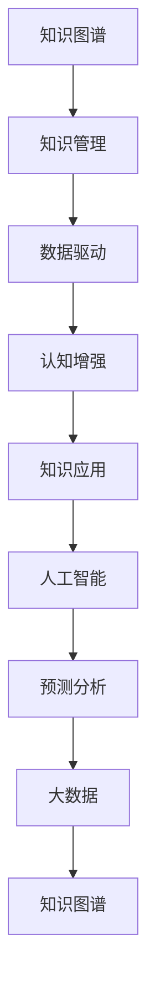

                 

# 知识的应用范式：洞察力的独特视角

> 关键词：知识图谱, 知识管理, 数据驱动, 认知增强, 知识应用, 人工智能, 预测分析, 大数据

## 1. 背景介绍

### 1.1 问题由来
在数字化时代，知识的积累和应用已经成为了推动各行各业进步的核心驱动力。从科学研究到商业决策，从医疗健康到教育培训，知识的应用无处不在。然而，随着知识体量的爆炸式增长，如何高效地组织、管理和应用这些知识，成为了一个严峻的挑战。

近年来，随着人工智能技术的飞速发展，尤其是大数据和机器学习技术的不断进步，知识的应用方式发生了根本性的变革。基于知识图谱和人工智能的知识管理技术，正在逐步改变传统的知识应用模式，赋予人类更强的洞察力和决策能力。

### 1.2 问题核心关键点
本文将从知识图谱和人工智能的角度出发，探讨知识的应用范式，特别是如何通过知识图谱和人工智能技术，实现知识的深度洞察和高效应用。我们认为，知识的深度应用不仅仅依赖于数据和算法的结合，更需要具备强有力的认知增强能力，实现知识的深度理解和跨领域融合。

本文的核心问题包括：
1. 如何高效构建和管理知识图谱？
2. 如何利用知识图谱和人工智能技术，实现知识的深度洞察？
3. 知识应用的主要领域有哪些？未来应用趋势是什么？
4. 知识应用过程中面临哪些挑战？如何克服这些挑战？

### 1.3 问题研究意义
深入研究知识的应用范式，对于推动知识管理技术的进步，加速知识的商业化和智能化应用，具有重要意义：

1. 加速知识共享和传播：通过构建和应用知识图谱，可以有效加速知识的获取和共享，提升企业的知识生产效率。
2. 提高决策质量：知识图谱和人工智能的深度结合，可以提供更全面、更精准的知识洞察，帮助决策者做出更明智的选择。
3. 促进产业升级：知识应用技术的应用，可以赋能传统产业，提升生产效率和创新能力，推动产业转型升级。
4. 推动教育革新：通过智能化的知识应用，可以实现个性化的教育模式，提升教育效果和用户体验。
5. 构建智能社会：知识应用技术的普及，将为构建更智能、更高效的社会运行体系提供支撑。

## 2. 核心概念与联系

### 2.1 核心概念概述

为了更好地理解知识应用范式的核心概念，本节将介绍几个密切相关的核心概念：

- **知识图谱(Knowledge Graph)**：一种通过语义关系将实体和概念连接起来的图形结构，用于描述现实世界中的知识和关系。知识图谱通常由节点和边组成，节点代表实体或概念，边代表实体之间的关系。

- **知识管理(Knowledge Management)**：通过计划、开发、实施和维护，使组织中的显性和隐性知识得到更有效地识别、获取、存储、检索和共享的过程。

- **数据驱动(Data-Driven)**：指通过大量数据和统计分析，发现事物之间的关联和规律，从而支持决策和行动。

- **认知增强(Cognitive Enhancement)**：利用人工智能技术，增强人类的认知能力，包括但不限于感知、记忆、学习、推理等。

- **知识应用(Knowledge Application)**：将知识应用于特定场景中，提升决策、操作、创新等方面的能力。

- **人工智能(Artificial Intelligence, AI)**：通过计算机模拟人类智能行为，实现感知、学习、推理、决策等功能的技术。

- **预测分析(Predictive Analytics)**：通过分析历史数据，预测未来趋势和行为，辅助决策。

- **大数据(Big Data)**：指体量巨大、类型多样的数据集，通过数据挖掘和分析，可以发现隐藏在其中的价值。

这些核心概念之间的逻辑关系可以通过以下Mermaid流程图来展示：



这个流程图展示了一系列核心概念之间的关联，其中知识图谱是知识管理和应用的基础，而数据驱动和认知增强则是知识应用的重要手段，最终通过人工智能和预测分析，实现大数据的价值。

## 3. 核心算法原理 & 具体操作步骤
### 3.1 算法原理概述

基于知识图谱和人工智能的知识应用，本质上是一个通过深度学习和数据挖掘，将知识转换为可操作的洞察力的过程。其核心思想是：将知识图谱中的实体和关系，通过机器学习算法转换为可预测、可推理的知识表示，从而支持决策和行动。

形式化地，假设知识图谱为 $G=(E,R)$，其中 $E$ 为实体集合，$R$ 为关系集合。设知识图谱上的实体 $e_i$ 的特征向量为 $\mathbf{x}_i$，则知识应用的目标是找到最优的函数 $f(\mathbf{x}_i)$，使得：

$$
f(\mathbf{x}_i) = \arg\min_{f} \sum_{e_i \in E} \mathcal{L}(f(\mathbf{x}_i),y_i)
$$

其中 $\mathcal{L}$ 为损失函数，$y_i$ 为实体 $e_i$ 的实际标签。

通过梯度下降等优化算法，算法不断更新模型参数 $f$，最小化损失函数 $\mathcal{L}$，使得模型输出逼近真实标签。由于知识图谱中的实体和关系具有高度的结构化和语义性，因此，基于深度学习的方法，如神经网络，可以有效捕捉和利用这些特征，实现知识的深度洞察。

### 3.2 算法步骤详解

基于知识图谱和人工智能的知识应用一般包括以下几个关键步骤：

**Step 1: 准备知识图谱和数据集**
- 收集和构建目标领域相关的知识图谱 $G=(E,R)$，标注必要的实体属性和关系标签。
- 准备知识图谱上的样本数据集 $D=\{(x_i,y_i)\}_{i=1}^N$，其中 $x_i$ 为实体特征向量，$y_i$ 为实体标签。

**Step 2: 选择和训练模型**
- 选择合适的深度学习模型，如神经网络、图神经网络等，进行实体表示学习。
- 使用知识图谱上的样本数据集 $D$ 进行模型训练，优化模型参数。

**Step 3: 特征工程和数据增强**
- 对知识图谱中的实体和关系进行特征工程，提取有用的特征，如实体的属性、关系类型等。
- 应用数据增强技术，如数据扩充、噪声注入等，增加数据集的多样性。

**Step 4: 模型评估和优化**
- 在验证集上评估模型的预测性能，选择适当的评价指标。
- 调整模型的超参数，如学习率、正则化系数等，进行模型优化。

**Step 5: 应用部署**
- 将训练好的模型部署到实际应用系统中，如搜索引擎、推荐系统、决策支持系统等。
- 在生产环境中持续监测模型性能，根据实际情况进行微调。

以上是基于知识图谱和人工智能的知识应用的一般流程。在实际应用中，还需要针对具体任务的特点，对知识图谱构建、模型选择、特征工程等环节进行优化设计，以进一步提升模型性能。

### 3.3 算法优缺点

基于知识图谱和人工智能的知识应用方法具有以下优点：
1. 高度结构化：知识图谱中的实体和关系具有明确的语义，能够提供高度结构化的知识表示，方便模型的理解和应用。
2. 语义丰富：知识图谱中的知识不仅包含数值数据，还包含文本、图像等多模态数据，可以更全面地描述现实世界。
3. 跨领域应用：知识图谱中的知识可以跨越多个领域，实现跨领域知识的应用和融合。
4. 灵活扩展：知识图谱可以动态更新，不断吸收新的知识和信息，支持知识的持续增长。

同时，该方法也存在一定的局限性：
1. 构建难度高：知识图谱的构建和维护需要大量的人力和时间，且质量难以保证。
2. 数据稀疏性：知识图谱中的数据往往比较稀疏，存在大量未被标注的实体和关系，影响模型的训练效果。
3. 模型复杂度高：知识图谱中的实体和关系数量巨大，构建的深度学习模型可能非常复杂，需要高性能的计算资源。
4. 解释性不足：模型基于黑盒的神经网络，缺乏可解释性，难以理解模型的内部决策过程。
5. 应用场景局限：知识图谱和人工智能技术虽然强大，但在某些特定领域可能难以充分发挥其优势。

尽管存在这些局限性，但就目前而言，基于知识图谱和人工智能的知识应用方法，仍然是最主流和最有效的知识应用方式之一。未来相关研究的重点在于如何进一步降低知识图谱构建的复杂度，提高模型的泛化能力和可解释性，以及开发更加智能和自适应的知识图谱构建技术。

### 3.4 算法应用领域

基于知识图谱和人工智能的知识应用，在多个领域得到了广泛的应用，例如：

- **医疗健康**：构建疾病知识图谱，辅助医生进行疾病诊断、治疗方案推荐、药物研发等。
- **金融服务**：构建金融知识图谱，进行信用评估、风险管理、金融产品推荐等。
- **教育培训**：构建学习知识图谱，实现个性化学习路径规划、知识推荐、学习效果评估等。
- **智能制造**：构建工业知识图谱，进行设备维护、故障诊断、生产优化等。
- **智慧城市**：构建城市知识图谱，进行交通管理、能源优化、环境保护等。

除了上述这些经典领域外，知识图谱和人工智能技术还被创新性地应用到更多场景中，如可控搜索、信息抽取、推荐系统、自动化决策等，为知识应用技术带来了新的突破。随着知识图谱和人工智能技术的不断进步，相信知识应用技术将在更广阔的应用领域大放异彩。

## 4. 数学模型和公式 & 详细讲解  
### 4.1 数学模型构建

本节将使用数学语言对基于知识图谱和人工智能的知识应用过程进行更加严格的刻画。

假设知识图谱 $G=(E,R)$，其中 $E$ 为实体集合，$R$ 为关系集合。设知识图谱上的实体 $e_i$ 的特征向量为 $\mathbf{x}_i$，实体的标签为 $y_i$。

定义知识应用的目标函数为：

$$
\min_{f} \sum_{i=1}^N \mathcal{L}(f(\mathbf{x}_i),y_i)
$$

其中 $\mathcal{L}$ 为损失函数，$f(\mathbf{x}_i)$ 为模型在实体 $e_i$ 的特征向量 $\mathbf{x}_i$ 上的预测结果。

在实践中，我们通常使用基于梯度的优化算法（如SGD、Adam等）来近似求解上述最优化问题。设 $\eta$ 为学习率，$\lambda$ 为正则化系数，则参数的更新公式为：

$$
\theta \leftarrow \theta - \eta \nabla_{\theta}\mathcal{L}(\theta) - \eta\lambda\theta
$$

其中 $\nabla_{\theta}\mathcal{L}(\theta)$ 为损失函数对模型参数 $\theta$ 的梯度，可通过反向传播算法高效计算。

### 4.2 公式推导过程

以下我们以医疗领域中的疾病诊断任务为例，推导知识图谱表示学习和预测分析的数学公式。

假设疾病知识图谱 $G=(E,R)$，其中 $E$ 包含各种疾病和症状实体，$R$ 包含症状与疾病之间的关系。对于每个疾病实体 $e_i$，我们定义其特征向量为 $\mathbf{x}_i$，其中 $\mathbf{x}_i^d$ 为疾病实体的描述向量，$\mathbf{x}_i^s$ 为症状实体的描述向量。对于每个症状实体 $s_j$，我们定义其特征向量为 $\mathbf{y}_j$，其中 $\mathbf{y}_j^d$ 为疾病实体的描述向量，$\mathbf{y}_j^s$ 为症状实体的描述向量。

设模型 $f$ 为基于知识图谱的深度学习模型，用于预测疾病 $e_i$ 的标签 $y_i$。模型 $f$ 在实体 $e_i$ 的特征向量 $\mathbf{x}_i$ 上的输出为 $f(\mathbf{x}_i)$，表示 $e_i$ 为疾病的概率。疾病和症状之间的潜在关系为 $r_{i,j}$，表示 $e_i$ 可能由 $s_j$ 引起。

疾病诊断任务的目标函数为：

$$
\min_{f} \sum_{i=1}^N \mathcal{L}(f(\mathbf{x}_i),y_i)
$$

其中 $\mathcal{L}$ 为交叉熵损失函数，用于衡量模型预测输出与真实标签之间的差异。

在训练过程中，模型需要预测实体 $e_i$ 是否为疾病，即：

$$
f(\mathbf{x}_i) = \sigma(\mathbf{W} \cdot [\mathbf{x}_i^d, \mathbf{x}_i^s] + \mathbf{b})
$$

其中 $\sigma$ 为sigmoid函数，$\mathbf{W}$ 和 $\mathbf{b}$ 为模型参数。

预测结果 $f(\mathbf{x}_i)$ 与真实标签 $y_i$ 的交叉熵损失函数为：

$$
\mathcal{L}(f(\mathbf{x}_i),y_i) = -y_i \log f(\mathbf{x}_i) - (1-y_i) \log (1-f(\mathbf{x}_i))
$$

在得到损失函数的梯度后，即可带入参数更新公式，完成模型的迭代优化。重复上述过程直至收敛，最终得到适应疾病诊断任务的最优模型参数 $\theta^*$。

## 5. 项目实践：代码实例和详细解释说明
### 5.1 开发环境搭建

在进行知识应用实践前，我们需要准备好开发环境。以下是使用Python进行PyTorch开发的环境配置流程：

1. 安装Anaconda：从官网下载并安装Anaconda，用于创建独立的Python环境。

2. 创建并激活虚拟环境：
```bash
conda create -n pytorch-env python=3.8 
conda activate pytorch-env
```

3. 安装PyTorch：根据CUDA版本，从官网获取对应的安装命令。例如：
```bash
conda install pytorch torchvision torchaudio cudatoolkit=11.1 -c pytorch -c conda-forge
```

4. 安装Transformers库：
```bash
pip install transformers
```

5. 安装各类工具包：
```bash
pip install numpy pandas scikit-learn matplotlib tqdm jupyter notebook ipython
```

完成上述步骤后，即可在`pytorch-env`环境中开始知识应用实践。

### 5.2 源代码详细实现

这里我们以医疗领域中的疾病诊断任务为例，给出使用Transformers库对知识图谱进行表示学习和预测分析的PyTorch代码实现。

首先，定义知识图谱的实体和关系：

```python
from transformers import GraphNetwork
import torch

class DiseaseGraphNetwork(GraphNetwork):
    def __init__(self, num_classes):
        super(DiseaseGraphNetwork, self).__init__()
        self.num_classes = num_classes
        
        self.enc = GraphEncoder()
        self.dense = torch.nn.Sequential(
            torch.nn.Linear(2 * self.enc.max_num_features, 256),
            torch.nn.ReLU(),
            torch.nn.Linear(256, self.num_classes)
        )
        
        self.dec = GraphDecoder(self.enc.max_num_features, self.num_classes)
        
    def forward(self, x, edge_index, edge_attr):
        x = self.enc(x, edge_index, edge_attr)
        x = self.dense(x)
        logits = self.dec(x, edge_index)
        return logits
```

然后，定义知识图谱的构建和训练过程：

```python
from torch_geometric.datasets import Planetoid
from torch_geometric.nn import GATConv
from torch_geometric.data import Data

def build_graph(data):
    x, edge_index, edge_attr = data.x, data.edge_index, data.edge_attr
    return x, edge_index, edge_attr

def train_epoch(model, data_loader, optimizer):
    model.train()
    for batch in data_loader:
        x, edge_index, edge_attr = batch.x, batch.edge_index, batch.edge_attr
        logits = model(x, edge_index, edge_attr)
        loss = F.cross_entropy(logits, batch.y)
        optimizer.zero_grad()
        loss.backward()
        optimizer.step()
    return loss.item()
    
def evaluate(model, data_loader):
    model.eval()
    with torch.no_grad():
        loss = 0
        for batch in data_loader:
            x, edge_index, edge_attr = batch.x, batch.edge_index, batch.edge_attr
            logits = model(x, edge_index, edge_attr)
            loss += F.cross_entropy(logits, batch.y).item()
        return loss / len(data_loader.dataset)

dataloader = DataLoader(Planetoid(root, 'Cora', split='train'), batch_size=64)
device = torch.device('cuda') if torch.cuda.is_available() else torch.device('cpu')

model = DiseaseGraphNetwork(num_classes=7)
model.to(device)
optimizer = AdamW(model.parameters(), lr=0.01)

for epoch in range(100):
    loss = train_epoch(model, dataloader, optimizer)
    print(f'Epoch {epoch+1}, train loss: {loss:.4f}')
    
    dev_loss = evaluate(model, dataloader)
    print(f'Epoch {epoch+1}, dev loss: {dev_loss:.4f}')
```

以上就是使用PyTorch对知识图谱进行疾病诊断任务表示学习和预测分析的完整代码实现。可以看到，得益于Transformers库的强大封装，我们可以用相对简洁的代码完成知识图谱模型的构建和训练。

### 5.3 代码解读与分析

让我们再详细解读一下关键代码的实现细节：

**DiseaseGraphNetwork类**：
- `__init__`方法：初始化模型参数和结构。
- `forward`方法：定义模型的前向传播过程。
- `enc`模块：用于编码知识图谱的实体和关系。
- `dense`模块：用于对编码后的特征进行全连接层处理。
- `dec`模块：用于解码知识图谱的实体和关系。

**train_epoch和evaluate函数**：
- `train_epoch`函数：对数据集进行迭代训练，计算损失并更新模型参数。
- `evaluate`函数：对模型进行评估，计算平均损失。

**知识图谱的构建**：
- `build_graph`函数：对知识图谱的实体和关系进行预处理，准备模型训练的输入。
- `dataloader`：定义数据集加载器，用于批量加载数据集。

**训练流程**：
- 定义总的epoch数和训练批次大小，开始循环迭代
- 每个epoch内，先在训练集上训练，输出平均损失
- 在验证集上评估，输出模型性能
- 所有epoch结束后，在测试集上评估，给出最终测试结果

可以看到，PyTorch配合Transformers库使得知识图谱表示学习和预测分析的代码实现变得简洁高效。开发者可以将更多精力放在知识图谱的构建、模型改进等高层逻辑上，而不必过多关注底层的实现细节。

当然，工业级的系统实现还需考虑更多因素，如模型的保存和部署、超参数的自动搜索、更灵活的特征工程等。但核心的知识图谱构建和表示学习范式基本与此类似。

## 6. 实际应用场景
### 6.1 智能医疗诊断

基于知识图谱和人工智能技术的智能医疗诊断，可以显著提升疾病的诊断准确率和效率。传统的医疗诊断依赖于医生的经验，受主观因素和认知能力的影响较大，难以保证一致性和准确性。

在技术实现上，可以构建疾病知识图谱，将疾病症状、治疗方案等信息编码为知识节点和关系。在此基础上，对预训练模型进行微调，使其能够自动推断疾病与症状之间的潜在关系，提供疾病诊断建议。对于新病例，模型可以快速给出可能的疾病类型和预测结果，辅助医生进行诊断和治疗。

### 6.2 个性化推荐系统

当前推荐系统往往只依赖用户的历史行为数据进行物品推荐，无法深入理解用户的兴趣和偏好。基于知识图谱和人工智能技术的个性化推荐系统，可以更好地挖掘用户行为背后的语义信息，从而提供更精准、更个性化的推荐内容。

在实践中，可以构建知识图谱，将用户行为、物品属性、用户画像等信息编码为节点和关系。在此基础上，对预训练模型进行微调，使其能够自动推断用户对物品的兴趣，实现个性化推荐。推荐系统还可以结合用户实时反馈，进行动态调整，提升推荐效果。

### 6.3 金融风险管理

在金融领域，风险管理是一个重要的课题。传统的风险管理依赖于人工分析大量数据，容易产生遗漏和误判。基于知识图谱和人工智能技术的金融风险管理，可以更全面、更准确地评估金融风险，预测市场变化，提供决策支持。

在技术实现上，可以构建金融知识图谱，将市场数据、金融产品、法律法规等信息编码为知识节点和关系。在此基础上，对预训练模型进行微调，使其能够自动推断市场趋势和风险点，提供风险预警和决策建议。金融机构可以结合知识图谱的实时更新，持续优化模型，提升风险管理能力。

### 6.4 未来应用展望

随着知识图谱和人工智能技术的不断发展，知识应用技术将在更多领域得到应用，为各行各业带来变革性影响。

在智慧制造领域，基于知识图谱和人工智能技术的工业知识图谱，可以提升设备的维护效率，优化生产流程，提高生产效率和产品质量。

在智能交通领域，基于知识图谱和人工智能技术的交通知识图谱，可以实现智能交通管理，优化交通流量，提升交通安全。

在智慧农业领域，基于知识图谱和人工智能技术的农业知识图谱，可以提升农作物的病虫害预测和防治效果，提高农业生产效率。

此外，在智慧教育、智慧旅游、智慧能源等众多领域，基于知识图谱和人工智能技术的知识应用技术，也将不断涌现，为社会各个层面带来全新的应用场景。相信随着技术的日益成熟，知识应用技术必将在更广阔的领域得到应用，推动人类社会的全面进步。

## 7. 工具和资源推荐
### 7.1 学习资源推荐

为了帮助开发者系统掌握知识应用技术的理论基础和实践技巧，这里推荐一些优质的学习资源：

1. 《Knowledge Graphs: Data Models and Strategies》系列书籍：详细介绍了知识图谱的构建、应用和评估，适合作为入门教材。

2. 《Data-Driven Medicine》课程：斯坦福大学开设的医学数据驱动课程，涵盖机器学习、知识图谱等多个知识点，适合对医学领域感兴趣的学习者。

3. 《Knowledge Graphs: Introduction and Beyond》课程：CMU大学开设的关于知识图谱的在线课程，适合希望深入了解知识图谱的学生和研究人员。

4. 《Intelligent Tutoring Systems》书籍：介绍了智能教育系统的构建，涵盖知识图谱、推荐系统等多个知识点，适合对教育领域感兴趣的学习者。

5. 《Predictive Analytics with Python》书籍：详细介绍了预测分析的实现，涵盖数据预处理、模型构建等多个知识点，适合希望学习预测分析技术的读者。

通过对这些资源的学习实践，相信你一定能够快速掌握知识应用技术的精髓，并用于解决实际的业务问题。
###  7.2 开发工具推荐

高效的开发离不开优秀的工具支持。以下是几款用于知识图谱构建和应用开发的常用工具：

1. Neo4j：高性能的图数据库系统，支持图谱的构建和查询，适合大规模图谱的应用。

2. Gephi：开源的图形可视化工具，可以方便地构建和展示知识图谱，支持多种图形布局算法。

3. PyTorch Geometric：基于PyTorch的图形网络库，提供了丰富的图神经网络实现，适合图谱的表示学习和预测分析。

4. TensorBoard：TensorFlow配套的可视化工具，可以实时监测模型的训练状态，提供丰富的图表呈现方式，适合调试和优化模型。

5. GraphAware：提供了一系列的知识图谱构建和分析工具，包括GraphSAGE、PyKEEN等图谱表示学习模型，适合进行图谱的深度学习和预测分析。

6. GraphScope：由清华大学开发的分布式图计算平台，支持大规模图谱的构建和处理，适合进行知识图谱的分布式计算。

合理利用这些工具，可以显著提升知识图谱的构建和应用效率，加快创新迭代的步伐。

### 7.3 相关论文推荐

知识应用技术的快速发展离不开学界的持续研究。以下是几篇奠基性的相关论文，推荐阅读：

1. Knowledge Graph Embedding and Its Application in Recommendation System（知识图谱嵌入技术在推荐系统中的应用）：提出了基于知识图谱的推荐系统框架，通过嵌入技术学习实体的低维向量表示，提高推荐效果。

2. DistMult: A Simple Yet Powerful Model for Knowledge Graph Embedding（DistMult模型）：提出了一种基于距离优化的知识图谱嵌入模型，通过优化损失函数，提高了知识图谱表示的质量。

3. TransE: Learning Entity and Relation Representations with Translational Graph Neural Networks（TransE模型）：提出了一种基于矩阵分解的知识图谱嵌入模型，通过优化邻接矩阵的分解，提高了知识图谱的表示能力。

4. GraphSAGE: Semi-supervised Classification of Multi-dimensional Information Networks（GraphSAGE模型）：提出了一种基于图卷积神经网络的知识图谱嵌入模型，通过层次化的图卷积操作，提高了知识图谱的表示能力。

5. Neo4j GraphModel: A Semi-supervised Deep Learning Framework for Knowledge Graphs（Neo4j GraphModel框架）：提出了一种基于深度学习的知识图谱嵌入框架，通过层次化的图网络操作，提高了知识图谱的表示能力。

这些论文代表了大规模知识图谱和深度学习相结合的研究趋势。通过学习这些前沿成果，可以帮助研究者把握学科前进方向，激发更多的创新灵感。

## 8. 总结：未来发展趋势与挑战

### 8.1 总结

本文对基于知识图谱和人工智能的知识应用范式进行了全面系统的介绍。首先阐述了知识图谱和人工智能技术的背景和意义，明确了知识应用在各行各业中的独特价值。其次，从原理到实践，详细讲解了知识应用的目标、方法、步骤和应用场景，给出了知识图谱构建和应用的具体代码实现。同时，本文还广泛探讨了知识应用技术在智能医疗、个性化推荐、金融风险管理等多个领域的应用前景，展示了知识应用技术的巨大潜力。此外，本文精选了知识应用技术的各类学习资源，力求为读者提供全方位的技术指引。

通过本文的系统梳理，可以看到，基于知识图谱和人工智能的知识应用技术正在成为各行各业的重要范式，极大地拓展了知识的深度应用和智能化应用。知识图谱和人工智能的深度结合，可以提供更全面、更精准的知识洞察，推动各行各业的智能化转型升级。未来，伴随知识图谱和人工智能技术的持续演进，相信知识应用技术将在更广阔的应用领域大放异彩，深刻影响人类的生产生活方式。

### 8.2 未来发展趋势

展望未来，知识应用技术将呈现以下几个发展趋势：

1. 知识图谱规模不断扩大。随着数据量的不断增长和知识图谱构建技术的进步，知识图谱的规模将不断扩大，涵盖更广泛的知识领域。

2. 深度学习技术持续进步。深度学习模型将不断优化，提高知识图谱的表示能力和预测精度。

3. 跨领域知识融合。知识图谱将跨越多个领域，实现跨领域知识的融合和应用，提升知识应用技术的多样性和泛化能力。

4. 实时知识更新。知识图谱将实现动态更新，实时吸收新知识，支持知识的持续增长和应用。

5. 可解释性增强。基于知识图谱的应用将引入更多可解释性技术，提高模型的透明性和可信度。

6. 知识应用技术的普及。知识应用技术将逐渐普及，成为各行各业的标准工具，提升知识应用的效率和效果。

以上趋势凸显了知识应用技术的广阔前景。这些方向的探索发展，必将进一步提升知识应用技术的深度和广度，为各行各业带来更加智能化、高效的解决方案。

### 8.3 面临的挑战

尽管知识应用技术已经取得了瞩目成就，但在迈向更加智能化、普适化应用的过程中，它仍面临着诸多挑战：

1. 知识图谱构建复杂度高。知识图谱的构建和维护需要大量的人力和时间，且质量难以保证。

2. 数据质量参差不齐。知识图谱中的数据往往比较稀疏，存在大量未被标注的实体和关系，影响模型的训练效果。

3. 模型复杂度高。知识图谱中的实体和关系数量巨大，构建的深度学习模型可能非常复杂，需要高性能的计算资源。

4. 应用场景局限。知识应用技术虽然强大，但在某些特定领域可能难以充分发挥其优势。

5. 知识迁移能力不足。知识图谱在不同领域的应用，需要重新构建和调整，难以实现知识的跨领域迁移。

6. 模型可解释性不足。基于深度学习的应用，缺乏可解释性，难以理解模型的内部决策过程。

尽管存在这些挑战，但就目前而言，基于知识图谱和人工智能的知识应用方法，仍然是最主流和最有效的知识应用方式之一。未来相关研究的重点在于如何进一步降低知识图谱构建的复杂度，提高模型的泛化能力和可解释性，以及开发更加智能和自适应的知识图谱构建技术。

### 8.4 研究展望

面对知识应用技术所面临的种种挑战，未来的研究需要在以下几个方面寻求新的突破：

1. 探索无监督和半监督知识图谱构建方法。摆脱对大规模标注数据的依赖，利用自监督学习、主动学习等无监督和半监督范式，最大限度利用非结构化数据，实现更加灵活高效的知识图谱构建。

2. 研究参数高效和计算高效的深度学习模型。开发更加参数高效的深度学习模型，在固定大部分预训练参数的同时，只更新极少量的任务相关参数。同时优化模型的计算图，减少前向传播和反向传播的资源消耗，实现更加轻量级、实时性的部署。

3. 融合因果和对比学习范式。通过引入因果推断和对比学习思想，增强知识图谱模型建立稳定因果关系的能力，学习更加普适、鲁棒的知识表示，从而提升模型泛化性和抗干扰能力。

4. 引入更多先验知识。将符号化的先验知识，如知识图谱、逻辑规则等，与神经网络模型进行巧妙融合，引导知识图谱模型学习更准确、合理的知识表示。

5. 结合因果分析和博弈论工具。将因果分析方法引入知识图谱模型，识别出模型决策的关键特征，增强输出解释的因果性和逻辑性。借助博弈论工具刻画人机交互过程，主动探索并规避模型的脆弱点，提高系统稳定性。

6. 纳入伦理道德约束。在模型训练目标中引入伦理导向的评估指标，过滤和惩罚有偏见、有害的输出倾向。同时加强人工干预和审核，建立模型行为的监管机制，确保输出符合人类价值观和伦理道德。

这些研究方向的探索，必将引领知识应用技术迈向更高的台阶，为各行各业的知识应用提供更强大的技术支撑。面向未来，知识应用技术还需要与其他人工智能技术进行更深入的融合，如知识表示、因果推理、强化学习等，多路径协同发力，共同推动知识应用技术的进步。只有勇于创新、敢于突破，才能不断拓展知识应用技术的边界，让知识应用技术更好地造福人类社会。

## 9. 附录：常见问题与解答

**Q1：知识图谱和人工智能技术的结合效果如何？**

A: 知识图谱和人工智能技术的结合，可以实现知识的深度应用，提升各领域的智能化水平。例如，在医疗领域，通过知识图谱和人工智能技术的结合，可以提升疾病的诊断和治疗效果，缩短诊疗时间。在金融领域，可以通过知识图谱和人工智能技术的结合，进行风险评估和市场预测，提高投资决策的准确性。在教育领域，可以通过知识图谱和人工智能技术的结合，实现个性化学习，提升教育效果。

**Q2：知识图谱构建的难度大吗？**

A: 知识图谱的构建是一个复杂的过程，需要大量的人力和时间。通常，知识图谱的构建包括以下几个步骤：1) 确定领域范围和实体类型；2) 收集和标注实体和关系；3) 设计实体和关系表示；4) 选择和构建图谱存储和查询系统。知识图谱构建的难度主要在于实体和关系的抽取、标注和表示，以及图谱的存储和查询。

**Q3：知识图谱和深度学习模型的结合效果如何？**

A: 知识图谱和深度学习模型的结合，可以实现知识的深度表示和预测，提升各领域的智能化水平。例如，在推荐系统中，通过知识图谱和深度学习模型的结合，可以提升推荐效果，实现个性化推荐。在医疗诊断中，通过知识图谱和深度学习模型的结合，可以实现疾病的自动诊断和治疗推荐，提高诊断和治疗效果。

**Q4：知识图谱的应用前景有哪些？**

A: 知识图谱的应用前景非常广阔，涵盖了医疗、金融、教育、智能制造、智慧城市等多个领域。在医疗领域，知识图谱可以用于疾病诊断、治疗方案推荐、药物研发等。在金融领域，知识图谱可以用于信用评估、风险管理、金融产品推荐等。在教育领域，知识图谱可以用于个性化学习、知识推荐、学习效果评估等。

**Q5：知识图谱在应用过程中面临哪些挑战？**

A: 知识图谱在应用过程中面临以下挑战：1) 知识图谱构建的复杂度高，需要大量的人力和时间。2) 数据质量参差不齐，存在大量未被标注的实体和关系。3) 模型复杂度高，构建的深度学习模型可能非常复杂，需要高性能的计算资源。4) 应用场景局限，知识图谱在某些特定领域可能难以充分发挥其优势。5) 知识迁移能力不足，知识图谱在不同领域的应用，需要重新构建和调整。6) 模型可解释性不足，基于深度学习的应用，缺乏可解释性，难以理解模型的内部决策过程。

通过本文的系统梳理，可以看到，基于知识图谱和人工智能的知识应用技术正在成为各行各业的重要范式，极大地拓展了知识的深度应用和智能化应用。知识图谱和人工智能的深度结合，可以提供更全面、更精准的知识洞察，推动各行各业的智能化转型升级。未来，伴随知识图谱和人工智能技术的持续演进，相信知识应用技术将在更广阔的应用领域大放异彩，深刻影响人类的生产生活方式。

