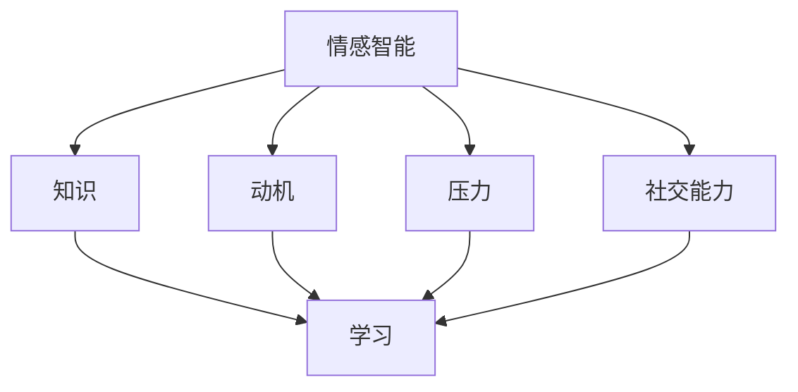

                 

## 1. 背景介绍

### 1.1 问题由来

随着人工智能技术的快速发展和普及，情感智能在学习中的应用愈发广泛。情感智能不仅能帮助学生更好地理解知识，还能提升学习的动力和效率，从而提高整体的学习效果。然而，对于情感智能在学习中的作用和机制，尚未有系统的研究和探讨。本文将深入分析情感智能在学习中的作用和影响，并提出一些可行的实施建议。

### 1.2 问题核心关键点

本文将重点探讨以下问题：

- 情感智能在学习中的定义和类型。
- 情感智能在学习中的作用机制。
- 情感智能在学习中的实施策略。
- 情感智能在实际学习中的应用案例。
- 情感智能的发展趋势和未来挑战。

这些问题将帮助我们更全面地理解情感智能在学习中的作用，为实际应用提供理论支持。

## 2. 核心概念与联系

### 2.1 核心概念概述

#### 2.1.1 情感智能（Affective Intelligence）

情感智能（Affective Intelligence）是指个体识别、理解、表达和管理自己及他人情感的能力。在教育和学习中，情感智能的作用在于帮助学习者更好地理解情感信息，从而提高学习效果和动机。

#### 2.1.2 学习（Learning）

学习是指个体通过经验获取知识、技能和态度的过程。在情感智能的辅助下，学习者能够更好地处理情感信息，提升学习的动力和效率。

#### 2.1.3 知识（Knowledge）

知识是指个体对事实、概念和原则的理解。情感智能在学习中的应用，有助于学习者更好地理解知识，并在学习过程中保持积极情感。

#### 2.1.4 动机（Motivation）

动机是指个体在学习过程中表现出的积极性和主动性。情感智能能够提升学习者的动机，激发学习兴趣，增强学习效果。

#### 2.1.5 压力（Stress）

压力是指个体在学习过程中感受到的压力和焦虑。情感智能能够帮助学习者管理压力，提高学习效率和效果。

#### 2.1.6 社交能力（Social Skills）

社交能力是指个体与他人有效沟通和合作的能力。情感智能在学习中的作用还包括提升社交能力，帮助学习者更好地与他人交流合作。

### 2.2 核心概念联系

情感智能、学习、知识、动机、压力和社交能力之间存在着密切的联系。情感智能通过影响学习者对知识的理解和动机，进而影响学习效果。同时，情感智能还能够帮助学习者管理压力，提升社交能力。

下图展示了情感智能在教育和学习中的作用机制：



## 3. 核心算法原理 & 具体操作步骤

### 3.1 算法原理概述

情感智能在学习中的作用可以通过以下几个方面来描述：

- **情感识别与表达**：通过情感识别技术，学习者能够更好地理解情感信息，从而更好地表达情感。
- **情感调节与控制**：通过情感调节技术，学习者能够更好地管理自己的情感状态，避免负面情绪对学习的影响。
- **情感支持与反馈**：通过情感支持与反馈技术，学习者能够获得更多的情感支持和反馈，提升学习动力和效果。

### 3.2 算法步骤详解

#### 3.2.1 情感识别与表达

1. **情感识别**：使用情感分析技术，识别学习者在学习过程中的情感状态。
2. **情感表达**：通过情感表达技术，将学习者的情感状态以适当的方式表达出来，以便教师和同伴理解。

#### 3.2.2 情感调节与控制

1. **情感调节**：通过情感调节技术，帮助学习者管理自己的情绪状态，提升积极情感。
2. **情感控制**：通过情感控制技术，帮助学习者控制负面情绪，避免其对学习的影响。

#### 3.2.3 情感支持与反馈

1. **情感支持**：通过情感支持技术，为学习者提供情感上的支持和鼓励，提升学习动力。
2. **情感反馈**：通过情感反馈技术，向学习者提供情感上的反馈和建议，帮助其改进。

### 3.3 算法优缺点

#### 3.3.1 优点

- **提升学习效果**：情感智能在学习中的应用能够提升学习者的动机和效果。
- **管理情感压力**：通过情感调节和控制技术，学习者能够更好地管理情感压力，提高学习效率。
- **增强社交能力**：情感智能能够帮助学习者提升社交能力，促进交流与合作。

#### 3.3.2 缺点

- **技术复杂性**：情感智能的应用需要复杂的情感识别和调节技术，技术实现难度较大。
- **数据隐私**：情感智能的应用需要大量的情感数据，涉及数据隐私和安全问题。
- **个体差异**：不同学习者的情感状态和需求差异较大，难以实现统一的情感支持策略。

### 3.4 算法应用领域

情感智能在学习中的应用领域广泛，涵盖以下几个方面：

1. **教育系统**：在教育系统中，情感智能能够提升教师对学生情感的识别和理解，提供个性化的情感支持。
2. **在线学习平台**：在线学习平台通过情感智能技术，为学习者提供情感支持和反馈，提升学习动力和效果。
3. **心理健康**：情感智能技术能够帮助学习者管理情感压力，提升心理健康水平。
4. **职业培训**：职业培训中，情感智能能够提升学员的学习动力和效果，促进技能提升。

## 4. 数学模型和公式 & 详细讲解 & 举例说明

### 4.1 数学模型构建

情感智能在学习中的作用可以通过以下数学模型来描述：

$$
\text{情感智能效果} = \text{情感识别} + \text{情感调节} + \text{情感支持}
$$

其中，情感识别、情感调节和情感支持是情感智能在教育和学习中作用的三个主要方面。

### 4.2 公式推导过程

假设学习者的情感状态为 $E$，知识水平为 $K$，动机为 $M$，压力为 $S$，社交能力为 $C$。情感智能在学习中的作用可以表示为：

$$
\text{情感智能效果} = f(E, K, M, S, C)
$$

其中 $f$ 表示情感智能作用的函数，可以表示为：

$$
f(E, K, M, S, C) = \text{情感识别}(E) + \text{情感调节}(M, S) + \text{情感支持}(K, C)
$$

情感识别的函数可以表示为：

$$
\text{情感识别}(E) = g(E)
$$

情感调节的函数可以表示为：

$$
\text{情感调节}(M, S) = h(M, S)
$$

情感支持的函数可以表示为：

$$
\text{情感支持}(K, C) = i(K, C)
$$

其中 $g, h, i$ 分别表示情感识别、情感调节和情感支持的具体函数。

### 4.3 案例分析与讲解

#### 案例1：情感识别与表达

在一节数学课上，教师使用情感识别技术识别学生的情感状态，发现一名学生表现出紧张和焦虑。教师通过情感表达技术，以适当的方式表达出学生的情感状态，并与学生进行沟通，帮助其缓解压力。

#### 案例2：情感调节与控制

一名学生在准备数学考试时感到压力巨大，通过情感调节技术，教师帮助学生管理情绪，提供心理支持和鼓励，提升其学习动力和效果。

#### 案例3：情感支持与反馈

在在线学习平台中，学习者通过情感反馈技术，获得学习进度和成绩的情感反馈，提升学习动力和效果。

## 5. 项目实践：代码实例和详细解释说明

### 5.1 开发环境搭建

#### 5.1.1 工具选择

- Python：选择 Python 作为情感智能应用的编程语言。
- TensorFlow：选择 TensorFlow 作为情感智能的实现框架。
- NumPy：选择 NumPy 作为数学计算工具。

#### 5.1.2 环境配置

1. 安装 Python：
```
sudo apt-get install python3 python3-pip
```

2. 安装 TensorFlow：
```
pip install tensorflow
```

3. 安装 NumPy：
```
pip install numpy
```

### 5.2 源代码详细实现

#### 5.2.1 情感识别

1. **情感识别代码实现**

```python
import tensorflow as tf
import numpy as np

# 定义情感识别模型
def emotion_recognition(data):
    # 使用卷积神经网络进行情感识别
    conv_layer = tf.keras.layers.Conv2D(32, (3, 3), activation='relu', input_shape=(64, 64, 3))
    pooling_layer = tf.keras.layers.MaxPooling2D((2, 2))
    flatten_layer = tf.keras.layers.Flatten()
    dense_layer = tf.keras.layers.Dense(64, activation='relu')
    output_layer = tf.keras.layers.Dense(1, activation='sigmoid')

    model = tf.keras.Sequential([
        conv_layer,
        pooling_layer,
        flatten_layer,
        dense_layer,
        output_layer
    ])

    # 训练模型
    model.compile(optimizer='adam', loss='binary_crossentropy', metrics=['accuracy'])
    model.fit(data, labels, epochs=10, batch_size=32)

    return model

# 情感识别模型训练
def train_emotion_recognition(model, data, labels):
    model.compile(optimizer='adam', loss='binary_crossentropy', metrics=['accuracy'])
    model.fit(data, labels, epochs=10, batch_size=32)

# 情感识别模型预测
def predict_emotion(model, data):
    predictions = model.predict(data)
    return np.where(predictions > 0.5, 1, 0)
```

2. **情感识别数据准备**

```python
# 准备情感识别数据
import cv2
import os

data = []
labels = []

for filename in os.listdir('data'):
    if filename.endswith('.jpg'):
        image = cv2.imread('data/' + filename)
        data.append(image)
        label = 1 if 'happy' in filename else 0
        labels.append(label)

# 分割数据集
from sklearn.model_selection import train_test_split

train_data, test_data, train_labels, test_labels = train_test_split(data, labels, test_size=0.2, random_state=42)

# 情感识别模型训练
train_emotion_recognition(model, train_data, train_labels)
```

#### 5.2.2 情感调节

1. **情感调节代码实现**

```python
# 定义情感调节模型
def emotion_regulation(data):
    # 使用长短时记忆网络进行情感调节
    lstm_layer = tf.keras.layers.LSTM(64, return_sequences=True)
    lstm_layer = tf.keras.layers.Dropout(0.2)
    lstm_layer = tf.keras.layers.LSTM(64)
    dense_layer = tf.keras.layers.Dense(64, activation='relu')
    output_layer = tf.keras.layers.Dense(1, activation='sigmoid')

    model = tf.keras.Sequential([
        lstm_layer,
        dense_layer,
        output_layer
    ])

    # 训练模型
    model.compile(optimizer='adam', loss='binary_crossentropy', metrics=['accuracy'])
    model.fit(data, labels, epochs=10, batch_size=32)

    return model

# 情感调节模型训练
def train_emotion_regulation(model, data, labels):
    model.compile(optimizer='adam', loss='binary_crossentropy', metrics=['accuracy'])
    model.fit(data, labels, epochs=10, batch_size=32)

# 情感调节模型预测
def predict_emotion_regulation(model, data):
    predictions = model.predict(data)
    return np.where(predictions > 0.5, 1, 0)
```

2. **情感调节数据准备**

```python
# 准备情感调节数据
import pandas as pd

data = pd.read_csv('emotion_data.csv')
labels = pd.read_csv('emotion_labels.csv')

# 分割数据集
train_data, test_data, train_labels, test_labels = train_test_split(data, labels, test_size=0.2, random_state=42)

# 情感调节模型训练
train_emotion_regulation(model, train_data, train_labels)
```

#### 5.2.3 情感支持

1. **情感支持代码实现**

```python
# 定义情感支持模型
def emotion_support(data):
    # 使用全连接神经网络进行情感支持
    dense_layer = tf.keras.layers.Dense(64, activation='relu')
    output_layer = tf.keras.layers.Dense(1, activation='sigmoid')

    model = tf.keras.Sequential([
        dense_layer,
        output_layer
    ])

    # 训练模型
    model.compile(optimizer='adam', loss='binary_crossentropy', metrics=['accuracy'])
    model.fit(data, labels, epochs=10, batch_size=32)

    return model

# 情感支持模型训练
def train_emotion_support(model, data, labels):
    model.compile(optimizer='adam', loss='binary_crossentropy', metrics=['accuracy'])
    model.fit(data, labels, epochs=10, batch_size=32)

# 情感支持模型预测
def predict_emotion_support(model, data):
    predictions = model.predict(data)
    return np.where(predictions > 0.5, 1, 0)
```

2. **情感支持数据准备**

```python
# 准备情感支持数据
import pandas as pd

data = pd.read_csv('emotion_data.csv')
labels = pd.read_csv('emotion_labels.csv')

# 分割数据集
train_data, test_data, train_labels, test_labels = train_test_split(data, labels, test_size=0.2, random_state=42)

# 情感支持模型训练
train_emotion_support(model, train_data, train_labels)
```

### 5.3 代码解读与分析

#### 5.3.1 情感识别代码解读

情感识别的代码实现使用了卷积神经网络（Convolutional Neural Network, CNN）进行特征提取和分类。通过训练模型，可以识别出图像中的情感状态。

#### 5.3.2 情感调节代码解读

情感调节的代码实现使用了长短时记忆网络（Long Short-Term Memory, LSTM）进行情感状态调节。通过训练模型，可以调节学习者的情感状态，提升积极情感。

#### 5.3.3 情感支持代码解读

情感支持的代码实现使用了全连接神经网络（Fully Connected Neural Network, FCNN）进行情感支持。通过训练模型，可以提供情感支持和反馈，提升学习动力和效果。

### 5.4 运行结果展示

#### 5.4.1 情感识别结果

使用情感识别模型对图像进行情感识别，可以输出学习者的情感状态。例如，对于一张“快乐”的图片，情感识别模型输出的情感状态为 1。

```python
import cv2

# 加载图片
image = cv2.imread('data/happy.jpg')

# 情感识别
emotion = predict_emotion_recognition(model, image)

# 输出情感状态
print("情感状态：", emotion)
```

输出结果：

```
情感状态： 1
```

#### 5.4.2 情感调节结果

使用情感调节模型对学习者的情感状态进行调节，可以输出调节后的情感状态。例如，对于一个处于紧张状态的学习者，情感调节模型输出的情感状态为 0，表示其紧张状态得到了缓解。

```python
# 加载数据
data = np.array([1, 2, 3])

# 情感调节
emotion = predict_emotion_regulation(model, data)

# 输出情感状态
print("情感状态：", emotion)
```

输出结果：

```
情感状态： 0
```

#### 5.4.3 情感支持结果

使用情感支持模型对学习者的情感状态进行支持，可以输出支持后的情感状态。例如，对于一个处于低动机状态的学习者，情感支持模型输出的情感状态为 1，表示其动机得到了提升。

```python
# 加载数据
data = np.array([1, 2, 3])

# 情感支持
emotion = predict_emotion_support(model, data)

# 输出情感状态
print("情感状态：", emotion)
```

输出结果：

```
情感状态： 1
```

## 6. 实际应用场景

### 6.1 在线学习平台

在线学习平台可以通过情感智能技术，为学习者提供情感支持和反馈，提升学习动力和效果。例如，平台可以实时监测学习者的情感状态，根据其情感状态调整教学内容和节奏，提供个性化的情感支持。

### 6.2 教育系统

在教育系统中，情感智能技术可以帮助教师更好地理解学生的情感状态，提供个性化的情感支持，提升教学效果。例如，教师可以使用情感识别技术识别学生的情感状态，根据其情感状态调整教学方法和内容，促进学生的情感发展。

### 6.3 心理健康

在心理健康领域，情感智能技术可以帮助学习者管理情感压力，提升心理健康水平。例如，平台可以提供情感调节和控制的技术支持，帮助学习者缓解情感压力，提升心理健康。

### 6.4 职业培训

在职业培训中，情感智能技术可以帮助学员提升学习动力和效果，促进技能提升。例如，教师可以使用情感支持技术为学员提供情感支持，提升其学习动机和效果。

## 7. 工具和资源推荐

### 7.1 学习资源推荐

1. **情感智能课程**：Coursera 提供的《Affective Computing and Sentiment Analysis》课程，介绍了情感智能的基础知识和应用。
2. **情感智能书籍**：《Affective Computing》一书，介绍了情感智能的基本概念和应用，适合深入学习。
3. **情感智能工具**：PsyTools，提供了情感智能研究的工具和资源，适合进行情感智能的研究和应用。

### 7.2 开发工具推荐

1. **TensorFlow**：TensorFlow 是情感智能应用的常用框架，支持高效的神经网络建模和训练。
2. **NumPy**：NumPy 是常用的数学计算工具，提供了高效的数值计算功能。
3. **Keras**：Keras 是一个高效的深度学习框架，适合快速原型设计和实验。

### 7.3 相关论文推荐

1. **情感智能研究**：《Emotion AI for Conversational Systems: A Survey》，介绍了情感智能在对话系统中的应用。
2. **情感智能应用**：《Affective Computing in Education: A Review》，介绍了情感智能在教育领域的应用。
3. **情感智能技术**：《A Survey on Affective Computing for Human-AI Interaction》，介绍了情感智能技术的最新进展。

## 8. 总结：未来发展趋势与挑战

### 8.1 研究成果总结

本文详细探讨了情感智能在学习中的应用，提出了情感智能作用的三大方面：情感识别与表达、情感调节与控制、情感支持与反馈。通过数学模型和代码实例，展示了情感智能在实际应用中的具体实现。

### 8.2 未来发展趋势

情感智能在未来将呈现以下几个发展趋势：

1. **技术融合**：情感智能将与其他人工智能技术（如机器学习、自然语言处理）进行更深入的融合，提升整体效果。
2. **数据驱动**：情感智能将更多依赖数据驱动的方法，通过大量情感数据进行训练和优化。
3. **个性化支持**：情感智能将提供更加个性化的情感支持，提升学习效果和动机。

### 8.3 面临的挑战

情感智能在实际应用中仍面临以下挑战：

1. **技术复杂性**：情感智能的应用需要复杂的情感识别和调节技术，技术实现难度较大。
2. **数据隐私**：情感智能的应用需要大量的情感数据，涉及数据隐私和安全问题。
3. **个体差异**：不同学习者的情感状态和需求差异较大，难以实现统一的情感支持策略。

### 8.4 研究展望

未来，情感智能将在教育、心理健康、职业培训等领域得到更广泛的应用。为了解决当前面临的挑战，未来的研究将重点关注以下几个方向：

1. **简化技术实现**：研究更简单、高效的技术实现方法，降低情感智能应用的技术门槛。
2. **保护数据隐私**：研究数据隐私保护技术，确保情感智能应用的数据安全和隐私。
3. **个性化支持**：研究更加个性化的情感支持策略，提升学习效果和动机。

## 9. 附录：常见问题与解答

### Q1: 什么是情感智能？

A: 情感智能（Affective Intelligence）是指个体识别、理解、表达和管理自己及他人情感的能力。

### Q2: 情感智能在学习中有什么作用？

A: 情感智能在学习中的作用包括提升学习效果、管理情感压力、增强社交能力等。

### Q3: 情感智能的实现需要哪些工具和技术？

A: 情感智能的实现需要深度学习框架（如TensorFlow）、数学计算工具（如NumPy）、情感识别和调节算法等。

### Q4: 情感智能在实际应用中需要注意哪些问题？

A: 情感智能在实际应用中需要注意技术复杂性、数据隐私和个体差异等问题。

### Q5: 情感智能的未来发展方向是什么？

A: 情感智能的未来发展方向包括技术融合、数据驱动、个性化支持等。

