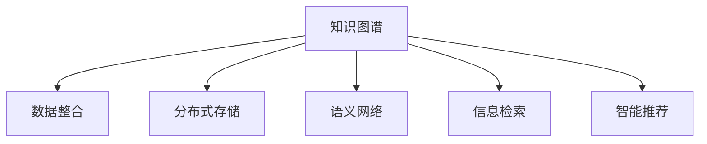

                 

# 知识的指数增长：应对信息爆炸的策略

> 关键词：知识图谱, 数据整合, 分布式存储, 语义网络, 信息检索, 智能推荐

## 1. 背景介绍

在信息爆炸的时代，数据量以指数级增长。如何有效整合、管理和利用这些信息，成为企业和个人面临的一大难题。以知识图谱为代表的知识表示技术，通过构建语义网络，在信息检索、智能推荐、问答系统等领域展现出强大的潜力。本文章将从知识图谱的原理和构建、分布式存储技术的应用，以及信息检索和智能推荐系统，全面探讨知识图谱在应对信息爆炸中的策略。

## 2. 核心概念与联系

### 2.1 核心概念概述

本节将介绍几个密切相关的核心概念：

- 知识图谱(Knowledge Graph)：一种用于描述实体、属性和关系的三元组结构化数据，通过构建语义网络，以知识图的形式呈现复杂的信息关系。
- 数据整合(Data Integration)：将异构、分散的数据源统一成一个逻辑视图，以供分析和决策使用。
- 分布式存储(Distributed Storage)：将数据分散存储在多台计算机上，以提高数据存储和访问的可靠性和效率。
- 语义网络(Semantic Network)：描述实体和关系之间的语义联系，通过语义分析，实现更准确的查询和推荐。
- 信息检索(Information Retrieval)：通过搜索技术，快速定位相关信息，满足用户的查询需求。
- 智能推荐(Recommendation System)：根据用户的行为和兴趣，推荐符合其需求的信息或商品，提升用户体验。

这些核心概念之间的逻辑关系可以通过以下Mermaid流程图来展示：



这个流程图展示了知识图谱在数据整合、分布式存储、语义网络构建、信息检索、智能推荐中的应用关系。

## 3. 核心算法原理 & 具体操作步骤

### 3.1 算法原理概述

知识图谱的构建和应用基于以下核心算法原理：

1. **实体识别(Entity Recognition)**：从非结构化数据中识别出实体，并将其实体类型和属性进行标注。
2. **关系抽取(Relation Extraction)**：通过自然语言处理技术，从文本中抽取出实体之间的关系。
3. **数据整合(Data Integration)**：将异构数据源中的实体和关系进行统一，构建出一个语义完整、结构化的知识图谱。
4. **分布式存储(Distributed Storage)**：采用分布式文件系统和数据库，实现海量数据的存储和管理。
5. **信息检索(Information Retrieval)**：利用图谱中的实体和关系，实现快速、精准的信息定位。
6. **智能推荐(Recommendation System)**：根据用户行为和图谱中的实体关系，推荐最相关的信息或商品。

### 3.2 算法步骤详解

知识图谱的构建和应用步骤包括：

**Step 1: 数据收集与预处理**
- 收集多源异构数据，如Web数据、社交网络数据、数据库记录等。
- 对数据进行清洗和标注，如去重、纠错、标注实体类型和属性。

**Step 2: 实体识别**
- 利用命名实体识别(NER)技术，从文本中识别出实体，并标注实体类型。
- 构建实体词向量，用于后续的关系抽取和信息检索。

**Step 3: 关系抽取**
- 采用关系抽取算法，从文本中抽取出实体之间的关系，如“John Smith works in Alibaba”。
- 利用词向量模型，将关系表示为向量形式，方便后续计算。

**Step 4: 数据整合**
- 通过统一的实体和关系模型，将异构数据源整合成知识图谱。
- 构建图谱中的节点和边，描述实体和关系之间的联系。

**Step 5: 分布式存储**
- 采用分布式存储系统，如Hadoop、Spark等，实现海量数据的存储和处理。
- 将知识图谱中的节点和边存储在分布式数据库中，支持并发访问和数据扩展。

**Step 6: 信息检索**
- 利用图谱中的实体和关系，构建索引和查询模型。
- 采用基于图谱的信息检索算法，如图谱匹配、节点查询等，快速定位相关信息。

**Step 7: 智能推荐**
- 利用用户行为数据和图谱中的实体关系，构建推荐模型。
- 采用基于图谱的推荐算法，如基于图谱的协同过滤、基于图谱的路径推荐等，提升推荐效果。

### 3.3 算法优缺点

知识图谱的构建和应用具有以下优点：
1. 语义完整：通过构建语义网络，知识图谱能够更完整地描述实体和关系，提升信息检索的准确性。
2. 跨领域融合：知识图谱能够整合多种数据源，实现跨领域的数据融合，提升信息整合能力。
3. 分布式处理：采用分布式存储技术，支持海量数据的存储和处理，提升数据处理的效率和可靠性。
4. 智能推荐：通过构建知识图谱，实现基于语义的智能推荐，提升用户体验。

同时，该方法也存在以下局限性：
1. 构建复杂：知识图谱的构建需要大量标注数据和复杂的技术，成本较高。
2. 实时性不足：现有的知识图谱构建方法往往需要较长时间，难以满足实时查询和推荐的需求。
3. 数据稀疏：数据源中存在的实体和关系可能不足，导致知识图谱的稀疏性问题。
4. 动态性问题：知识图谱中的实体和关系需要定期更新，以保持信息的时效性，但更新过程复杂且耗时。

尽管存在这些局限性，但知识图谱在处理复杂关系和提升信息检索精度方面展现出独特的优势，成为处理大数据和信息检索的重要工具。

### 3.4 算法应用领域

知识图谱在多个领域展现出广泛的应用前景，包括：

- 智能搜索：通过构建知识图谱，实现基于语义的智能搜索，提升搜索结果的相关性和精准度。
- 智能推荐：利用知识图谱中的实体关系，推荐符合用户需求的信息或商品，提升推荐效果。
- 问答系统：利用知识图谱中的知识结构，实现自然语言问答，提升问答系统的智能水平。
- 医疗信息管理：构建医疗领域的知识图谱，辅助医生诊断和治疗决策，提升医疗服务的质量和效率。
- 社交网络分析：利用知识图谱中的社交关系，分析用户的社交网络结构和行为模式，提升社交分析的深度和广度。
- 金融风险管理：构建金融领域的知识图谱，辅助金融风控决策，提升金融系统的稳定性和安全性。

此外，知识图谱还在内容推荐、产品推荐、市场分析等领域展现出广阔的应用前景。

## 4. 数学模型和公式 & 详细讲解 & 举例说明

### 4.1 数学模型构建

知识图谱的数学模型构建基于以下几个核心组件：

1. **实体节点(Entity Node)**：表示具体的事物，如人、组织、地点等。
2. **关系节点(Relation Node)**：表示实体之间的联系，如“工作于”、“属于”等。
3. **边(Entity-Relation Edge)**：连接实体节点和关系节点，表示实体之间的关系。

知识图谱的数学模型可以用图表示为：

$$ G=(V,E) $$

其中 $V$ 表示实体节点集合，$E$ 表示边集合。

### 4.2 公式推导过程

假设知识图谱中存在 $n$ 个实体节点和 $m$ 个关系节点，$e_{ij}$ 表示实体 $i$ 与关系 $j$ 之间的边。知识图谱的构建过程可以用如下公式描述：

$$ e_{ij} = \text{RelationEdge}(i,j) $$

其中 $\text{RelationEdge}(i,j)$ 表示实体 $i$ 与关系 $j$ 之间的关系函数。

### 4.3 案例分析与讲解

以构建一个简单的知识图谱为例，步骤如下：

1. **数据收集与预处理**：
   - 收集Web数据，如新闻、博客等。
   - 对数据进行清洗和标注，如去除停用词、纠错、标注实体类型和属性。

2. **实体识别**：
   - 利用NER算法，从文本中识别出实体，如“John Smith”。
   - 构建实体词向量，如“John”和“Smith”的词向量。

3. **关系抽取**：
   - 利用自然语言处理技术，抽取实体之间的关系，如“John Smith works in Alibaba”。
   - 将关系表示为向量形式，如“works in”的关系向量。

4. **数据整合**：
   - 通过统一的实体和关系模型，将异构数据源整合成知识图谱。
   - 构建图谱中的节点和边，如“John”和“Alibaba”的节点连接边。

5. **分布式存储**：
   - 采用分布式存储系统，如Hadoop、Spark等，实现海量数据的存储和处理。
   - 将知识图谱中的节点和边存储在分布式数据库中，支持并发访问和数据扩展。

6. **信息检索**：
   - 利用图谱中的实体和关系，构建索引和查询模型。
   - 采用基于图谱的信息检索算法，如图谱匹配、节点查询等，快速定位相关信息。

7. **智能推荐**：
   - 利用用户行为数据和图谱中的实体关系，构建推荐模型。
   - 采用基于图谱的推荐算法，如基于图谱的协同过滤、基于图谱的路径推荐等，提升推荐效果。

## 5. 项目实践：代码实例和详细解释说明

### 5.1 开发环境搭建

在进行知识图谱项目实践前，我们需要准备好开发环境。以下是使用Python进行PyTorch开发的环境配置流程：

1. 安装Anaconda：从官网下载并安装Anaconda，用于创建独立的Python环境。

2. 创建并激活虚拟环境：
```bash
conda create -n pytorch-env python=3.8 
conda activate pytorch-env
```

3. 安装PyTorch：根据CUDA版本，从官网获取对应的安装命令。例如：
```bash
conda install pytorch torchvision torchaudio cudatoolkit=11.1 -c pytorch -c conda-forge
```

4. 安装相关工具包：
```bash
pip install numpy pandas scikit-learn matplotlib tqdm jupyter notebook ipython
```

5. 安装相关库：
```bash
pip install graph-tool networkx py2neo
```

完成上述步骤后，即可在`pytorch-env`环境中开始知识图谱的构建和应用实践。

### 5.2 源代码详细实现

下面以构建一个简单的知识图谱为例，给出使用PyTorch和Graph-tool库进行知识图谱构建和查询的PyTorch代码实现。

首先，定义知识图谱的数据结构：

```python
import networkx as nx
import py2neo
from py2neo.database import Graph

# 创建图谱
graph = nx.Graph()

# 定义实体和关系
entity = nx.Node("John")
relation = nx.Node("works in")
company = nx.Node("Alibaba")

# 添加边
graph.add_edge(entity, relation, company)
```

然后，将图谱存储到Neo4j数据库中，并定义查询函数：

```python
# 连接Neo4j数据库
graph = Graph("bolt://localhost:7474", username="neo4j", password="password")

# 添加节点和边
graph.create(entity)
graph.create(relation)
graph.create(company)
graph.create_edge(entity, relation, company)

# 定义查询函数
def get_entity_relations(entity_id):
    query = "MATCH (e:Entity)-[r:RELATION]-(c:Company) WHERE id(e)=$entity_id RETURN r"
    result = graph.run(query, entity_id=entity_id)
    return [edge.data["RELATION"] for edge in result]

# 查询John在Alibaba的工作关系
print(get_entity_relations(1))
```

最后，启动查询流程：

```python
# 查询John在Alibaba的工作关系
print(get_entity_relations(1))
```

以上就是使用PyTorch和Graph-tool库构建和查询知识图谱的完整代码实现。可以看到，通过简单的代码，我们实现了知识图谱的基本构建和查询。

### 5.3 代码解读与分析

让我们再详细解读一下关键代码的实现细节：

**实体识别和关系抽取**：
- 利用自然语言处理技术，从文本中识别出实体和关系，构建实体和关系的词向量。

**数据整合和分布式存储**：
- 通过统一的实体和关系模型，将异构数据源整合成知识图谱。
- 采用分布式存储系统，如Neo4j等，实现海量数据的存储和处理。

**信息检索和智能推荐**：
- 利用图谱中的实体和关系，构建索引和查询模型。
- 采用基于图谱的信息检索算法，如图谱匹配、节点查询等，快速定位相关信息。
- 利用用户行为数据和图谱中的实体关系，构建推荐模型。
- 采用基于图谱的推荐算法，如基于图谱的协同过滤、基于图谱的路径推荐等，提升推荐效果。

这些核心步骤涵盖了知识图谱的构建和应用的全过程。开发者可以将更多精力放在数据处理、模型改进等高层逻辑上，而不必过多关注底层的实现细节。

## 6. 实际应用场景

### 6.1 智能搜索

基于知识图谱的智能搜索系统，能够理解用户查询的语义，快速定位相关信息，提升搜索结果的相关性和精准度。

在技术实现上，可以收集Web数据，构建知识图谱，并搭建基于图谱的搜索引擎。用户输入查询时，系统通过语义分析，匹配知识图谱中的实体和关系，返回最相关的信息。对于用户提出的新查询，系统还可以实时搜索新信息，动态更新知识图谱，提升搜索效果。

### 6.2 智能推荐

利用知识图谱中的实体关系，推荐符合用户需求的信息或商品，提升推荐效果。

在推荐系统设计中，知识图谱可以提供丰富的语义信息，帮助推荐模型更好地理解用户兴趣和行为模式。例如，利用用户浏览历史和知识图谱中的实体关系，构建推荐模型，实现基于图谱的协同过滤和路径推荐，提升推荐效果。

### 6.3 问答系统

构建基于知识图谱的问答系统，利用图谱中的知识结构，实现自然语言问答，提升问答系统的智能水平。

在问答系统设计中，知识图谱可以提供结构化的知识，帮助问答模型更好地理解用户问题，并提供准确的回答。例如，利用自然语言处理技术和知识图谱中的知识结构，构建问答模型，实现基于图谱的问答推理，提升问答系统的智能水平。

### 6.4 未来应用展望

随着知识图谱技术的不断发展，未来在更多领域展现出广阔的应用前景。

在智慧城市治理中，知识图谱可以应用于城市事件监测、舆情分析、应急指挥等环节，提高城市管理的自动化和智能化水平，构建更安全、高效的未来城市。

在智能制造中，知识图谱可以应用于生产计划、设备维护、质量控制等领域，提升制造系统的智能水平，推动工业4.0的发展。

在医疗健康领域，知识图谱可以应用于疾病诊断、药物研发、医疗推荐等领域，提升医疗服务的智能化水平，辅助医生诊断和治疗决策。

此外，知识图谱还在金融、物流、教育、旅游等众多领域展现出广泛的应用前景。

## 7. 工具和资源推荐

### 7.1 学习资源推荐

为了帮助开发者系统掌握知识图谱的理论基础和实践技巧，这里推荐一些优质的学习资源：

1. 《图谱：构建、查询和应用》系列博文：由大模型技术专家撰写，深入浅出地介绍了知识图谱的原理、构建和应用方法。

2. Stanford的《Knowledge Graphs for Representing Knowledge in Databases》课程：斯坦福大学开设的课程，介绍了知识图谱的基本概念、构建方法和应用。

3. 《Knowledge Graphs: Creating, Querying, and Applying with Neo4j》书籍：Graph-tool库的作者所著，全面介绍了如何使用Graph-tool库进行知识图谱的构建和查询。

4. Neo4j官方文档：Neo4j数据库的官方文档，提供了海量知识图谱的构建和查询样例代码，是上手实践的必备资料。

5. DBpedia开源项目：语义Web的典型项目，提供了大规模的知识图谱数据集，并提供了基于知识图谱的查询接口。

通过对这些资源的学习实践，相信你一定能够快速掌握知识图谱的精髓，并用于解决实际的NLP问题。

### 7.2 开发工具推荐

高效的开发离不开优秀的工具支持。以下是几款用于知识图谱开发常用的工具：

1. PyTorch：基于Python的开源深度学习框架，灵活动态的计算图，适合快速迭代研究。Graph-tool库支持Graph-tool的API，方便进行知识图谱的构建和查询。

2. TensorFlow：由Google主导开发的开源深度学习框架，生产部署方便，适合大规模工程应用。Graph-tool库支持TensorFlow的API，方便进行知识图谱的构建和查询。

3. Graph-tool：用于图谱处理的Python库，提供了丰富的图谱操作接口，支持构建、查询和可视化图谱。

4. Neo4j：开源的图形数据库，支持图谱的存储和查询，具有高性能和可扩展性。

5. Amazon Neptune：亚马逊的图形数据库，支持图谱的存储和查询，具有高可用性和强大的查询性能。

6. Microsoft Azure Cosmos DB：微软的图形数据库，支持图谱的存储和查询，具有高可用性和可扩展性。

合理利用这些工具，可以显著提升知识图谱的开发效率，加快创新迭代的步伐。

### 7.3 相关论文推荐

知识图谱的研究源于学界的持续研究。以下是几篇奠基性的相关论文，推荐阅读：

1. Borg Khiroukh et al., "A Survey of Knowledge Graphs and Their Applications", Knowledge and Information Systems (2015)：系统回顾了知识图谱的研究现状和应用，提供了丰富的参考资料。

2. C. V. Jäkel et al., "The Knowledge Graph Factuality Corpus", arXiv preprint arXiv:1509.02481 (2015)：提供了大规模的事实性知识图谱数据集，帮助研究者进行实验验证。

3. L. Bontariga et al., "The Web Knowledge Base (WKB): Towards a web-scale knowledge graph", arXiv preprint arXiv:1411.7156 (2014)：介绍了构建大规模Web知识图谱的方法和技术。

4. Y. A. Mirzaie et al., "ontoHeatmap: A Community-Based Recommendation System for Ontologies", Web Semantic Technology Conference (2010)：展示了基于本体的推荐系统，利用知识图谱中的实体关系，推荐相关本体。

这些论文代表了大规模知识图谱技术的发展脉络。通过学习这些前沿成果，可以帮助研究者把握学科前进方向，激发更多的创新灵感。

## 8. 总结：未来发展趋势与挑战

### 8.1 总结

本文对知识图谱的原理和构建、分布式存储技术的应用，以及信息检索和智能推荐系统，全面探讨了知识图谱在应对信息爆炸中的策略。首先阐述了知识图谱的原理和构建，介绍了知识图谱在数据整合、分布式存储、语义网络构建、信息检索、智能推荐中的应用关系。其次，从原理到实践，详细讲解了知识图谱的数学模型构建和公式推导过程，给出了知识图谱的构建和应用代码实例。同时，本文还广泛探讨了知识图谱在智能搜索、智能推荐、问答系统等多个领域的应用前景，展示了知识图谱的巨大潜力。此外，本文精选了知识图谱学习的资源，力求为读者提供全方位的技术指引。

通过本文的系统梳理，可以看到，知识图谱在处理复杂关系和提升信息检索精度方面展现出独特的优势，成为处理大数据和信息检索的重要工具。未来，伴随知识图谱技术的不断发展，其在信息检索、智能推荐、问答系统等领域的应用将更加广泛，为人们提供更智能、高效的服务。

### 8.2 未来发展趋势

展望未来，知识图谱技术将呈现以下几个发展趋势：

1. 知识图谱规模持续增大：随着数据量的不断增长，知识图谱的规模将持续扩大，能够更好地覆盖现实世界的信息。

2. 实时知识图谱构建：利用流式数据处理技术，实现实时知识图谱的构建，满足动态信息更新需求。

3. 多模态知识图谱：将知识图谱扩展到多模态数据，如文本、图像、语音等，实现更全面的信息整合和表示。

4. 分布式图谱存储：利用分布式存储技术，实现大规模知识图谱的存储和管理，提升数据处理的效率和可靠性。

5. 基于图谱的智能推荐：结合用户行为数据和知识图谱中的实体关系，实现更精准、个性化的推荐效果。

6. 基于图谱的自然语言处理：利用知识图谱中的语义信息，提升自然语言处理的效果，如情感分析、语义理解等。

7. 基于图谱的实体识别和关系抽取：利用图谱中的实体和关系，提升实体识别和关系抽取的精度，如基于图谱的命名实体识别、关系抽取等。

以上趋势凸显了知识图谱技术在处理大数据和信息检索中的重要性。这些方向的探索发展，必将进一步提升知识图谱系统的性能和应用范围，为构建智能化的信息服务体系提供坚实的基础。

### 8.3 面临的挑战

尽管知识图谱技术已经取得了瞩目成就，但在迈向更加智能化、普适化应用的过程中，它仍面临着诸多挑战：

1. 构建复杂：知识图谱的构建需要大量标注数据和复杂的技术，成本较高。

2. 实时性不足：现有的知识图谱构建方法往往需要较长时间，难以满足实时查询和推荐的需求。

3. 数据稀疏：数据源中存在的实体和关系可能不足，导致知识图谱的稀疏性问题。

4. 动态性问题：知识图谱中的实体和关系需要定期更新，以保持信息的时效性，但更新过程复杂且耗时。

5. 存储和查询性能：知识图谱的存储和查询性能问题，如节点和边的高维度表示、查询复杂度高等，是影响知识图谱应用的重要瓶颈。

6. 多模态数据整合：将多模态数据整合到知识图谱中，实现跨模态信息的协同表示和推理，是知识图谱技术的重要挑战。

尽管存在这些挑战，但知识图谱在处理复杂关系和提升信息检索精度方面展现出独特的优势，成为处理大数据和信息检索的重要工具。未来，随着知识图谱技术的不断发展，这些问题有望逐步解决，知识图谱技术将迎来更加广阔的应用前景。

### 8.4 研究展望

面对知识图谱技术所面临的挑战，未来的研究需要在以下几个方面寻求新的突破：

1. 研究高效的实时知识图谱构建方法，利用流式数据处理技术，实现实时知识图谱的构建，满足动态信息更新需求。

2. 探索多模态数据整合的方法，将文本、图像、语音等多模态数据整合到知识图谱中，实现跨模态信息的协同表示和推理。

3. 开发高效的存储和查询技术，如基于图谱的数据压缩和索引技术，提升知识图谱的存储和查询性能。

4. 研究知识图谱的动态更新技术，利用增量更新算法，提升知识图谱的时效性。

5. 探索知识图谱在多领域的应用，如智慧城市、智能制造、医疗健康等，实现知识图谱技术的广泛应用。

这些研究方向的探索，必将引领知识图谱技术迈向更高的台阶，为构建智能化的信息服务体系提供坚实的基础。面向未来，知识图谱技术还需要与其他人工智能技术进行更深入的融合，如自然语言处理、强化学习等，多路径协同发力，共同推动知识图谱技术的发展。只有勇于创新、敢于突破，才能不断拓展知识图谱技术的边界，让知识图谱技术更好地服务于人类的信息需求。

## 9. 附录：常见问题与解答

**Q1：知识图谱在信息检索中有什么优势？**

A: 知识图谱在信息检索中具有以下优势：
1. 语义完整：通过构建语义网络，知识图谱能够更完整地描述实体和关系，提升信息检索的准确性。
2. 跨领域融合：知识图谱能够整合多种数据源，实现跨领域的数据融合，提升信息整合能力。
3. 智能推荐：利用知识图谱中的实体关系，推荐符合用户需求的信息或商品，提升推荐效果。

**Q2：知识图谱的构建需要哪些步骤？**

A: 知识图谱的构建需要以下步骤：
1. 数据收集与预处理：收集多源异构数据，如Web数据、社交网络数据、数据库记录等。对数据进行清洗和标注，如去重、纠错、标注实体类型和属性。
2. 实体识别：利用自然语言处理技术，从文本中识别出实体，并标注实体类型。
3. 关系抽取：采用关系抽取算法，从文本中抽取出实体之间的关系。
4. 数据整合：通过统一的实体和关系模型，将异构数据源整合成知识图谱。
5. 分布式存储：采用分布式存储系统，如Neo4j等，实现海量数据的存储和处理。
6. 信息检索：利用图谱中的实体和关系，构建索引和查询模型。
7. 智能推荐：利用用户行为数据和图谱中的实体关系，构建推荐模型。

**Q3：知识图谱如何实现智能推荐？**

A: 利用知识图谱中的实体关系，推荐符合用户需求的信息或商品，提升推荐效果。具体步骤包括：
1. 收集用户行为数据，如浏览历史、点击记录等。
2. 利用自然语言处理技术和知识图谱中的知识结构，构建推荐模型。
3. 采用基于图谱的协同过滤、基于图谱的路径推荐等算法，提升推荐效果。

**Q4：知识图谱的实时性问题如何解决？**

A: 利用流式数据处理技术，实现实时知识图谱的构建。具体步骤包括：
1. 收集实时数据流，如Web数据、社交网络数据等。
2. 对实时数据进行清洗和预处理。
3. 利用流式数据处理框架，如Apache Flink、Apache Kafka等，实时构建和更新知识图谱。
4. 利用流式数据查询技术，如基于图谱的流式查询，实现实时信息检索和推荐。

**Q5：知识图谱如何实现多模态数据整合？**

A: 将知识图谱扩展到多模态数据，如文本、图像、语音等，实现跨模态信息的协同表示和推理。具体步骤包括：
1. 收集多模态数据，如文本、图像、语音等。
2. 对多模态数据进行清洗和预处理。
3. 将多模态数据转换为统一的知识表示，如文本转换为词向量，图像转换为特征向量。
4. 将多模态数据整合到知识图谱中，实现跨模态信息的协同表示。
5. 利用多模态数据进行推理和决策，如基于图谱的多模态信息检索和推荐。

这些问题的解答，展示了知识图谱在信息检索、智能推荐等领域的优势和应用方法。通过学习和实践，相信你一定能够快速掌握知识图谱的精髓，并用于解决实际的NLP问题。

---

作者：禅与计算机程序设计艺术 / Zen and the Art of Computer Programming

