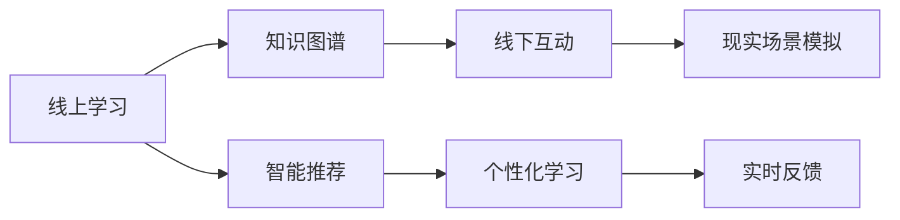

                 

# 知识的混合现实应用：线上线下学习的融合

> 关键词：混合现实（Mixed Reality, MR）, 线上线下（Online-Offline, O2O）学习，知识图谱（Knowledge Graph）, 智能教学系统（Intelligent Teaching System）, 实时交互（Real-time Interaction）, 个性化学习（Personalized Learning）

## 1. 背景介绍

随着信息技术的快速发展，在线教育和混合现实技术（MR）的应用日益广泛。传统的线下教育面临着资源限制、时空约束等问题，而线上教育则由于缺乏实时互动和个性化指导，难以完全替代线下学习的互动性和深度。知识混合现实的应用，旨在将线上和线下教育优势互补，通过知识图谱和智能教学系统，实现线上线下学习的无缝衔接，提升学习体验和教育效果。

本文将从混合现实技术的应用出发，探讨线上线下学习的融合方式，并结合知识图谱和智能教学系统的应用，揭示其在教育领域的具体实现和未来趋势。

## 2. 核心概念与联系

### 2.1 核心概念概述

混合现实（Mixed Reality, MR）：将现实世界的信息和虚拟信息进行融合，以实现在同一个环境中共现，达到"虚实结合"的效果。MR技术广泛应用于游戏、培训、医疗等领域，可以提供沉浸式的学习体验。

线上线下（Online-Offline, O2O）学习：指通过互联网平台提供线上课程，同时在离线环境（如教室、实验室）进行互动学习。O2O学习融合了线上资源丰富和线下互动深度，可以实现更灵活、个性化的学习路径。

知识图谱（Knowledge Graph）：以结构化形式描述实体、属性、关系，形成知识网络。知识图谱在教育领域用于组织课程知识、支撑智能问答和个性化推荐，提升教学质量和效率。

智能教学系统（Intelligent Teaching System）：利用人工智能技术，根据学习者的行为数据进行个性化推荐，实时调整教学内容和节奏，提高学习效果。

### 2.2 核心概念原理和架构的 Mermaid 流程图



该流程图示意了线上线下学习融合的架构：

- 线上学习通过知识图谱和智能推荐，提供丰富的学习资源和个性化的学习路径。
- 线下互动结合现实场景模拟，提供沉浸式的学习体验。
- 个性化学习和实时反馈机制，实现学习效果的不断优化。

## 3. 核心算法原理 & 具体操作步骤

### 3.1 算法原理概述

混合现实学习融合的算法原理，主要基于知识的表示、获取和应用。通过构建知识图谱，在线上和线下环境中实现知识表示和传播，同时利用智能教学系统进行实时推荐和反馈。

1. **知识表示与获取**：将知识点抽象为实体-关系-属性的形式，存储在知识图谱中。线上通过搜索引擎和推荐系统获取知识图谱中的知识点，线下通过多媒体设备和互动系统呈现知识。

2. **智能推荐与个性化学习**：智能教学系统根据学习者的行为数据（如学习时长、答题情况、兴趣偏好等），实时推荐相关知识点和练习，实现个性化学习。

3. **实时反馈与互动**：通过实时互动系统，如虚拟助手、智能白板等，实现师生的互动和反馈。线下场景中，通过虚拟场景模拟，提供更丰富的教学情境。

### 3.2 算法步骤详解

1. **数据准备与图谱构建**：
   - 收集课程内容、教材、习题等教学资源，整理成结构化数据。
   - 使用知识图谱工具（如Neo4j、ArangoDB）构建知识图谱，存储实体、关系和属性。

2. **在线知识获取与智能推荐**：
   - 利用搜索引擎和推荐系统，根据用户查询和行为数据，获取知识图谱中的知识点。
   - 结合用户的历史学习数据，进行个性化推荐。

3. **线下场景模拟与互动**：
   - 使用AR/VR技术，在现实场景中模拟知识图谱中的虚拟环境。
   - 通过虚拟助手和智能白板，提供实时互动和反馈。

4. **学习效果评估与优化**：
   - 收集学习者的反馈和表现数据，评估学习效果。
   - 利用数据分析工具，优化智能推荐和互动策略。

### 3.3 算法优缺点

混合现实学习融合的优势在于：

- **丰富互动性**：线上线下结合，提供沉浸式和互动性的学习体验。
- **个性化学习**：通过智能推荐系统，提供个性化学习路径和资源。
- **知识图谱应用**：构建知识图谱，提供系统化的知识结构。

但其缺点也不容忽视：

- **技术复杂性高**：需要整合多种技术和平台，技术实现难度大。
- **设备成本高**：AR/VR设备等硬件成本较高，普及度较低。
- **数据隐私问题**：收集和处理用户数据，需注意数据隐私和安全问题。

### 3.4 算法应用领域

混合现实学习融合在教育、培训、医疗等多个领域具有广泛应用：

- **教育领域**：在K-12和高等教育中，提供混合现实课堂，结合知识图谱和智能推荐，提升教学效果。
- **职业培训**：在企业培训中，结合虚拟场景模拟和互动，提供沉浸式培训体验。
- **医疗教育**：在医学教育中，结合虚拟解剖和手术模拟，提升医学学生的实践能力。

## 4. 数学模型和公式 & 详细讲解 & 举例说明

### 4.1 数学模型构建

线上线下学习的融合，可以通过以下数学模型来描述：

1. **知识图谱表示**：
   - 实体-关系-属性表示：$E=(V,R,S)$，其中 $V$ 为实体集合，$R$ 为关系集合，$S$ 为属性集合。
   - 实例化表示：$e=(o,\theta)$，其中 $o$ 为实体，$\theta$ 为实体的属性向量。

2. **智能推荐模型**：
   - 协同过滤推荐：$Y=\alpha XW$，其中 $Y$ 为推荐结果，$X$ 为用户特征向量，$W$ 为权重矩阵，$\alpha$ 为归一化系数。
   - 矩阵分解：$P=LU$，其中 $P$ 为用户-物品评分矩阵，$L$ 为用户特征矩阵，$U$ 为物品特征矩阵。

3. **互动反馈模型**：
   - 实时反馈机制：$F=K(X)+V$，其中 $F$ 为反馈结果，$K$ 为知识图谱查询，$X$ 为用户互动数据，$V$ 为互动系统响应。

### 4.2 公式推导过程

以协同过滤推荐模型为例，推导推荐结果 $Y$ 的计算公式。

**用户-物品评分矩阵**：
$$P = \begin{bmatrix}
p_{1,1} & p_{1,2} & \cdots & p_{1,m} \\
p_{2,1} & p_{2,2} & \cdots & p_{2,m} \\
\vdots & \vdots & \ddots & \vdots \\
p_{n,1} & p_{n,2} & \cdots & p_{n,m}
\end{bmatrix}$$

**用户特征矩阵**：
$$X = \begin{bmatrix}
x_{1,1} & x_{1,2} & \cdots & x_{1,k} \\
x_{2,1} & x_{2,2} & \cdots & x_{2,k} \\
\vdots & \vdots & \ddots & \vdots \\
x_{n,1} & x_{n,2} & \cdots & x_{n,k}
\end{bmatrix}$$

**物品特征矩阵**：
$$U = \begin{bmatrix}
u_{1,1} & u_{1,2} & \cdots & u_{1,l} \\
u_{2,1} & u_{2,2} & \cdots & u_{2,l} \\
\vdots & \vdots & \ddots & \vdots \\
u_{m,1} & u_{m,2} & \cdots & u_{m,l}
\end{bmatrix}$$

**协同过滤推荐公式**：
$$Y = \alpha XW = \alpha (U^T L)$$

其中 $\alpha$ 为归一化系数，$W$ 为权重矩阵。

### 4.3 案例分析与讲解

假设某学生对 "机器学习" 课程感兴趣，系统根据其历史学习数据，推荐以下知识点：

1. 当前课程知识图谱查询：$K(\text{机器学习})$
2. 获取推荐结果：$F=\text{机器学习}$

**互动过程**：
- 学生观看在线视频，获取 "机器学习" 课程的知识点。
- 通过智能推荐系统，获取相关练习题，并进行自测。
- 教师通过智能白板展示虚拟实验室，学生进行实验操作。

## 5. 项目实践：代码实例和详细解释说明

### 5.1 开发环境搭建

在项目开发前，需要准备好相应的开发环境：

1. **安装Python**：
   - `sudo apt-get install python3-pip python3-dev python3-virtualenv`

2. **创建虚拟环境**：
   - `virtualenv env`
   - `source env/bin/activate`

3. **安装依赖库**：
   - `pip install -r requirements.txt`

4. **配置项目**：
   - 创建项目目录，编写配置文件，包括知识图谱构建、推荐系统、互动系统等。

### 5.2 源代码详细实现

以下是混合现实学习融合系统的主要模块实现：

1. **知识图谱构建**：
   - 使用知识图谱工具（如Neo4j）构建知识图谱。
   - 编写接口，提供查询和添加节点、关系、属性的功能。

2. **智能推荐系统**：
   - 使用协同过滤算法实现推荐功能。
   - 编写API接口，接受用户输入，返回推荐结果。

3. **互动系统**：
   - 使用AR/VR技术实现虚拟场景模拟。
   - 编写虚拟助手和智能白板模块，提供实时互动和反馈。

4. **学习效果评估**：
   - 收集用户反馈和表现数据。
   - 编写数据分析工具，生成学习报告。

### 5.3 代码解读与分析

以知识图谱查询为例，解读代码实现过程：

```python
# 定义知识图谱节点和关系
class KnowledgeGraph:
    def __init__(self):
        self.nodes = []
        self.relations = []
    
    def add_node(self, node):
        self.nodes.append(node)
    
    def add_relation(self, relation):
        self.relations.append(relation)
    
    def query_node(self, node_id):
        for node in self.nodes:
            if node['id'] == node_id:
                return node
        return None

# 查询节点
kg = KnowledgeGraph()
kg.add_node({'id': '1', 'name': 'Python'})
kg.add_node({'id': '2', 'name': 'Java'})
kg.add_relation({'id': 'R1', 'src': '1', 'dst': '2', 'type': 'Subset'})
kg.add_relation({'id': 'R2', 'src': '1', 'dst': '2', 'type': 'Equivalent'})

node = kg.query_node('1')
print(node)  # 输出 {'id': '1', 'name': 'Python'}
```

此代码定义了知识图谱的基本操作，包括节点添加、关系添加和节点查询。通过这些基本操作，可以实现复杂的知识图谱构建和查询。

## 6. 实际应用场景

### 6.1 智能教学系统

在智能教学系统中，线上线下学习的融合体现在以下几个方面：

1. **知识图谱驱动**：
   - 在线课程通过知识图谱组织知识点，提供系统化的学习路径。
   - 线下课堂通过AR/VR技术，提供沉浸式学习体验。

2. **智能推荐系统**：
   - 根据学生的学习行为数据，实时推荐个性化练习和资源。
   - 通过数据分析，调整教学策略和节奏，提高学习效果。

3. **实时互动与反馈**：
   - 使用虚拟助手和智能白板，实现实时互动和反馈。
   - 通过评估工具，收集学习者的反馈，优化学习过程。

### 6.2 虚拟实验平台

在虚拟实验平台中，混合现实学习融合的应用包括：

1. **虚拟实验环境**：
   - 通过AR/VR技术，模拟真实实验环境，提供虚拟实验操作。
   - 结合知识图谱，提供实验的理论基础和操作步骤。

2. **互动式学习**：
   - 学生可以通过虚拟助手提问和反馈，教师通过智能白板进行指导。
   - 实验结束后，通过虚拟报告系统，生成实验报告和分析。

3. **个性化学习路径**：
   - 根据学生的实验表现和学习数据，生成个性化实验任务和建议。
   - 结合智能推荐系统，优化实验资源配置和学习路径。

### 6.3 医疗教学平台

在医疗教学平台中，混合现实学习融合的应用包括：

1. **虚拟解剖与手术**：
   - 通过虚拟现实技术，提供虚拟解剖和手术模拟。
   - 结合知识图谱，提供解剖和手术的理论知识。

2. **互动式教学**：
   - 学生可以通过虚拟助手和智能白板，进行互动式学习。
   - 教师通过虚拟解剖和手术演示，进行现场指导。

3. **个性化学习体验**：
   - 根据学生的学习数据，生成个性化学习路径和任务。
   - 结合智能推荐系统，优化学习资源和节奏。

## 7. 工具和资源推荐

### 7.1 学习资源推荐

为了帮助开发者系统掌握混合现实学习融合的理论基础和实践技巧，这里推荐一些优质的学习资源：

1. **《Mixed Reality in Education: A Review》**：由IET出版，全面介绍了混合现实在教育领域的应用，包含理论基础和实际案例。
2. **《Knowledge Graphs in Teaching and Learning》**：由IEEE出版，探讨了知识图谱在教学和学习中的应用，包含方法和案例。
3. **《Intelligent Teaching Systems》**：由Springer出版，介绍了智能教学系统的原理和应用，包含理论和实践。
4. **《Mixed Reality Learning Environment》**：由Institute of Electrical and Electronics Engineers出版，探讨了混合现实学习环境的设计和实现。
5. **《Augmented and Virtual Reality in Education》**：由Taylor & Francis出版，介绍了增强现实和虚拟现实在教育中的应用，包含案例和技术。

### 7.2 开发工具推荐

以下是几款用于混合现实学习融合开发的常用工具：

1. **Unity**：广泛应用于游戏和AR/VR开发的引擎，具有强大的实时渲染能力和交互性。
2. **Unreal Engine**：适用于高实时和高保真度的AR/VR应用开发，支持大规模的物理模拟和交互。
3. **Tesseract**：用于知识图谱构建和查询的开源工具，支持多种数据格式和查询语言。
4. **推荐系统工具包**：如Scikit-learn、TensorFlow等，用于实现协同过滤推荐和机器学习推荐。
5. **虚拟助手和智能白板**：如Google Assistant、Microsoft Whiteboard等，提供实时互动和反馈。

### 7.3 相关论文推荐

混合现实学习融合技术的发展源于学界的持续研究。以下是几篇奠基性的相关论文，推荐阅读：

1. **"Augmenting Educational Realism Using Virtual Reality and Augmented Reality"**：探讨了虚拟现实和增强现实在教育中的融合应用。
2. **"Knowledge Graphs for Intelligent Education"**：介绍了知识图谱在智能教育中的应用，包含理论和实践。
3. **"Integrating Augmented Reality into Medical Education: A Review"**：探讨了增强现实在医学教育中的应用，包含技术方法和案例。
4. **"Mixed Reality in Smart Teaching: A Review"**：全面介绍了混合现实在智能教学中的应用，包含方法和实践。
5. **"Knowledge-Driven Learning Environments in Education"**：介绍了知识驱动学习环境的设计和实现，包含理论和案例。

## 8. 总结：未来发展趋势与挑战

### 8.1 研究成果总结

本文系统介绍了混合现实学习融合的概念、算法原理和操作步骤，结合知识图谱和智能教学系统，揭示了其在教育领域的具体实现和未来趋势。

1. **混合现实学习融合**：通过知识图谱和智能推荐，实现线上线下学习的无缝衔接。
2. **知识图谱应用**：提供系统化的知识结构，提升教学效果。
3. **智能教学系统**：通过实时推荐和互动反馈，提高学习体验和效果。

### 8.2 未来发展趋势

展望未来，混合现实学习融合技术将呈现以下几个发展趋势：

1. **普及化**：随着AR/VR技术的普及和成本降低，混合现实学习融合将逐步应用于各个教育领域。
2. **多样化**：结合多种AR/VR技术和知识图谱，提供多样化的学习路径和体验。
3. **智能化**：结合人工智能技术，实现更智能化的推荐和反馈机制。
4. **集成化**：与传统教育体系深度融合，提供更全面的教学解决方案。
5. **个性化**：根据学习者的个性化需求，提供定制化的学习路径和资源。

### 8.3 面临的挑战

尽管混合现实学习融合技术具有广阔前景，但在迈向更加智能化、普适化应用的过程中，仍面临诸多挑战：

1. **技术复杂性高**：需要整合多种技术和平台，技术实现难度大。
2. **设备成本高**：AR/VR设备等硬件成本较高，普及度较低。
3. **数据隐私问题**：收集和处理用户数据，需注意数据隐私和安全问题。
4. **交互复杂性**：需要设计和实现复杂的互动和反馈机制。
5. **系统集成性**：需要与现有教育体系深度集成，实现无缝衔接。

### 8.4 研究展望

面对混合现实学习融合面临的挑战，未来的研究需要在以下几个方面寻求新的突破：

1. **简化技术实现**：开发更加简便易用的AR/VR工具和平台，降低技术实现难度。
2. **优化设备成本**：推动AR/VR设备的成本降低，提高普及度。
3. **加强隐私保护**：设计隐私保护机制，确保用户数据的安全和隐私。
4. **增强交互体验**：研究和实现更自然的互动和反馈机制，提升用户体验。
5. **深化系统集成**：实现与现有教育体系的深度集成，提供更全面的教学解决方案。

总之，混合现实学习融合技术具有广阔的应用前景和潜力，需要在技术、设备和系统等各个层面进行深入研究，以实现其广泛应用和持续发展。

## 9. 附录：常见问题与解答

**Q1：混合现实学习融合是否适用于所有教育领域？**

A: 混合现实学习融合适用于大部分教育领域，尤其是那些对实践操作和互动体验要求较高的学科。但对于一些理论知识较多的学科，如文学、历史等，可能不需要使用AR/VR技术。

**Q2：如何选择合适的AR/VR设备和工具？**

A: 选择AR/VR设备和工具时，需考虑以下几个方面：
1. 设备的兼容性和易用性，确保与现有系统无缝衔接。
2. 设备的性能和分辨率，保证虚拟环境的沉浸感和实时性。
3. 设备的价格和维护成本，平衡设备和应用的经济性。

**Q3：如何处理用户数据隐私和安全问题？**

A: 处理用户数据隐私和安全问题，需注意以下几个方面：
1. 数据加密和匿名化，确保数据传输和存储的安全。
2. 用户授权和数据保护，确保用户对数据的控制权。
3. 数据共享和合作，确保数据的合法合规使用。

**Q4：如何优化混合现实学习体验？**

A: 优化混合现实学习体验，需注意以下几个方面：
1. 设计自然、易用的交互界面，提高用户体验。
2. 提供多样化的学习路径和资源，满足不同学习者的需求。
3. 实时收集和分析用户反馈，不断优化教学内容和学习策略。

**Q5：如何评估混合现实学习效果？**

A: 评估混合现实学习效果，需注意以下几个方面：
1. 制定明确的评估指标，如学习成果、满意度等。
2. 设计科学的评估方法，如问卷调查、学习效果测试等。
3. 持续收集和分析评估数据，不断优化教学策略和资源。

总之，混合现实学习融合技术为教育领域带来了新的机遇和挑战，需要在技术、设备和系统等各个层面进行深入研究，以实现其广泛应用和持续发展。相信随着技术的不断进步，混合现实学习融合将成为教育领域的重要发展方向。

---

作者：禅与计算机程序设计艺术 / Zen and the Art of Computer Programming

