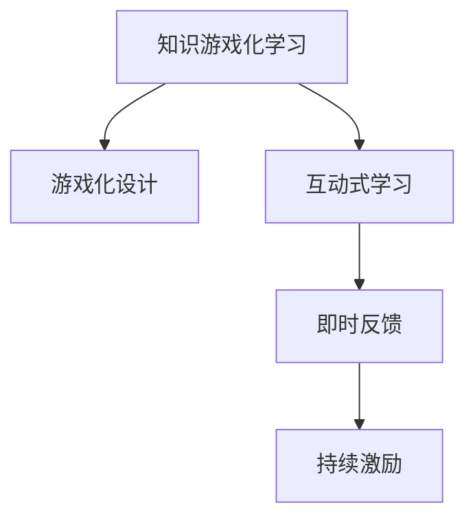

                 

# 知识的游戏化：寓教于乐的学习革命

## 1. 背景介绍

在数字化、信息化飞速发展的今天，知识的获取与学习方式也在发生着根本性的变革。传统的学习模式往往以教师讲授、书本阅读为主，知识孤立且难以激发学生的兴趣。而随着游戏的普及与游戏化设计理念的深入，越来越多的学习机构开始尝试将知识与游戏化元素结合，创造一种寓教于乐的学习方式。

### 1.1 问题由来

当前，教育领域对知识传播和学习效率提出了更高的要求。如何激发学生的学习兴趣，使其主动参与到学习过程中，成为教育工作者关注的焦点。传统的知识传播方式不仅效率低下，而且容易使学生感到枯燥乏味，难以持续。而将知识融入游戏中，利用游戏化设计理念，可以极大地提升学生的学习积极性和效果。

### 1.2 问题核心关键点

知识游戏化学习范式将知识内容以游戏的形式呈现，通过故事情节、角色扮演、挑战任务等游戏元素，吸引学生的注意力，激发学习兴趣。这种学习方式的关键点包括：

- **游戏化设计**：将知识内容设计成游戏任务，通过情节、角色、任务等游戏元素吸引学生参与。
- **互动体验**：通过互动性强的学习活动，如角色扮演、任务挑战等，增强学生的参与感和成就感。
- **即时反馈**：通过游戏即时反馈机制，及时给予学生正向激励，提升学习效果。
- **持续激励**：通过游戏积分、排行榜等机制，激励学生不断进步，形成持续学习的动力。

## 2. 核心概念与联系

### 2.1 核心概念概述

为了更好地理解知识游戏化学习范式的原理和架构，本节将介绍几个密切相关的核心概念：

- **知识游戏化学习**：将知识内容融入游戏中，利用游戏化的设计理念和元素，吸引学生主动参与学习的过程。
- **游戏化设计**：通过故事情节、角色扮演、任务挑战等游戏元素，将知识内容与游戏相结合，创造沉浸式的学习体验。
- **互动式学习**：通过互动性强的学习活动，增强学生的参与感和学习兴趣，提升学习效果。
- **即时反馈**：在学习过程中，通过及时的反馈和激励，提升学生的学习动机和效果。
- **持续激励**：通过游戏积分、排行榜等机制，激励学生持续学习，形成良好的学习习惯。

这些概念之间的逻辑关系可以通过以下Mermaid流程图来展示：



这个流程图展示了这个概念框架中各要素之间的相互关系：

1. **知识游戏化学习**是整个框架的核心，将知识内容以游戏的形式呈现。
2. **游戏化设计**通过故事情节、角色扮演等元素吸引学生参与。
3. **互动式学习**通过互动活动增强学生的参与感和学习兴趣。
4. **即时反馈**通过及时的反馈和激励提升学生的学习动机。
5. **持续激励**通过积分、排行榜等机制持续激励学生学习。

## 3. 核心算法原理 & 具体操作步骤
### 3.1 算法原理概述

知识游戏化学习的核心算法原理，在于如何通过游戏化的设计，将知识内容融入游戏中，并设计有效的反馈和激励机制，以提升学生的学习效果。

形式化地，假设知识内容为 $K$，学生群体为 $S$。知识游戏化学习的过程可以视为：

1. 将知识 $K$ 设计成多个游戏任务 $G_i$。
2. 通过互动式学习活动，学生 $S_i$ 参与并完成游戏任务 $G_i$。
3. 给予学生 $S_i$ 即时反馈 $F_i$ 和持续激励 $I_i$。
4. 通过反馈和激励机制，提升学生的学习效果 $L_i$。

数学上，可以表示为：

$$
L = \sum_{i \in S} L_i = \sum_{i \in S} f(G_i, F_i, I_i)
$$

其中 $f$ 为学习效果函数，表示游戏任务、反馈和激励对学习效果的综合影响。

### 3.2 算法步骤详解

知识游戏化学习的具体操作步骤如下：

**Step 1: 游戏设计**

- **故事情节设计**：设计一个吸引人的故事情节，将知识内容融入其中。
- **角色和任务设计**：设定角色和任务，让学生在完成任务的过程中学习知识。
- **难度层次设定**：根据学生能力设定不同难度层次的任务，逐步提升难度。

**Step 2: 游戏实施**

- **互动式学习活动**：设计互动式学习活动，如角色扮演、任务挑战等。
- **即时反馈系统**：设计即时反馈系统，及时评估学生的学习效果，并给予正向激励。
- **持续激励机制**：设计积分、排行榜等持续激励机制，激励学生持续学习。

**Step 3: 学习效果评估**

- **学习效果监测**：通过评估学生的学习成果，了解知识掌握情况。
- **效果提升策略**：根据评估结果，调整游戏设计、反馈和激励机制，提升学习效果。

### 3.3 算法优缺点

知识游戏化学习范式具有以下优点：

1. **激发学习兴趣**：通过游戏化设计，将知识融入游戏，激发学生的学习兴趣和参与感。
2. **提升学习效果**：通过互动式学习和即时反馈，增强学生的学习效果和知识掌握。
3. **培养自主学习能力**：通过持续激励机制，激励学生自主学习，形成良好学习习惯。

同时，该方法也存在一定的局限性：

1. **设计复杂度高**：游戏设计需要专业的游戏设计师和教育专家合作，设计难度较大。
2. **资源投入大**：开发和实施知识游戏化学习平台需要大量的资金和技术支持。
3. **评价体系难统一**：不同的游戏设计可能存在评价体系不一致的问题，难以统一评估标准。

尽管存在这些局限性，但就目前而言，知识游戏化学习范式仍是大规模推广知识传播的重要手段之一。未来相关研究的重点在于如何进一步降低游戏设计难度，提高资源利用效率，同时兼顾不同年龄段和知识水平的学生需求。

### 3.4 算法应用领域

知识游戏化学习范式已经在教育、培训、企业内部培训等多个领域得到应用，具体包括：

- **K-12教育**：在小学、初中和高中教育阶段，通过游戏化的教学手段，提升学生学习兴趣和效果。
- **高等教育**：在大学课程中，通过游戏化的课程设计，提升学生对专业知识的掌握和应用。
- **企业培训**：在企业内部培训中，通过游戏化的培训课程，提升员工的业务技能和知识水平。
- **成人教育**：通过游戏化的学习平台，提升成人学习者的学习兴趣和效果。

除了上述这些经典应用外，知识游戏化学习范式还被创新性地应用于医疗健康、军事训练等场景，为传统教育和培训带来了新的思路。随着技术的不断进步和教育理念的更新，知识游戏化学习范式必将在更广泛的领域得到应用，为人类认知智能的发展带来新的突破。

## 4. 数学模型和公式 & 详细讲解 & 举例说明
### 4.1 数学模型构建

本节将使用数学语言对知识游戏化学习的原理进行更加严格的刻画。

假设知识内容为 $K$，游戏设计为 $G$，学生群体为 $S$，学习效果为 $L$。游戏设计 $G$ 可以表示为 $G=\{(G_1, F_1, I_1), (G_2, F_2, I_2), ..., (G_n, F_n, I_n)\}$，其中 $G_i$ 为第 $i$ 个游戏任务，$F_i$ 为即时反馈机制，$I_i$ 为持续激励机制。

定义学习效果函数 $f$ 为：

$$
f(G_i, F_i, I_i) = \alpha_i + \beta_i G_i + \gamma_i F_i + \delta_i I_i
$$

其中 $\alpha_i$ 为常数项，$\beta_i$ 为游戏任务对学习效果的影响系数，$\gamma_i$ 为即时反馈对学习效果的影响系数，$\delta_i$ 为持续激励对学习效果的影响系数。

最终，学习效果 $L$ 可以表示为：

$$
L = \sum_{i \in S} \alpha_i + \sum_{i \in S} \beta_i G_i + \sum_{i \in S} \gamma_i F_i + \sum_{i \in S} \delta_i I_i
$$

### 4.2 公式推导过程

以下我们以一个简单的知识游戏化学习场景为例，推导学习效果函数的推导过程。

假设知识内容为数学概念 $K$，学生群体为 $S=\{S_1, S_2, ..., S_n\}$，共 $n$ 个学生。游戏设计为 $G=\{(G_1, F_1, I_1), (G_2, F_2, I_2), ..., (G_n, F_n, I_n)\}$，其中 $G_i$ 为第 $i$ 个游戏任务，$F_i$ 为即时反馈机制，$I_i$ 为持续激励机制。

设 $G_1$ 为数学概念的应用题，$G_2$ 为数学概念的讲解视频，$G_3$ 为数学概念的测验。即时反馈 $F_i$ 为正负评价，持续激励 $I_i$ 为积分、排行榜等。

假设 $F_i$ 和 $I_i$ 的权重分别为 $\gamma$ 和 $\delta$，则学习效果函数 $f$ 可以表示为：

$$
f(G_i, F_i, I_i) = \alpha_i + \beta_i G_i + \gamma_i F_i + \delta_i I_i
$$

其中 $\alpha_i$ 为常数项，$\beta_i$ 为游戏任务对学习效果的影响系数，$\gamma_i$ 为即时反馈对学习效果的影响系数，$\delta_i$ 为持续激励对学习效果的影响系数。

通过公式 $L = \sum_{i \in S} f(G_i, F_i, I_i)$，可以计算出整个学习群体的学习效果 $L$。

### 4.3 案例分析与讲解

以下以一个简单的数学知识游戏化学习场景为例，分析其学习效果。

**案例背景**：某小学四年级数学课程中，教师设计了一个数学概念的游戏化学习场景，包括应用题、视频讲解和测验三个游戏任务，每个学生通过完成这三个任务学习数学概念 $K$。

**游戏设计**：
- $G_1$：设计了一个应用题游戏任务，学生需要利用数学概念解决应用题。
- $G_2$：设计了一个数学概念讲解视频，学生观看视频并做笔记。
- $G_3$：设计了一个数学概念测验，学生完成测验并获得积分。

**即时反馈**：
- $F_1$：学生每完成一个应用题，系统会给出正负评价。
- $F_2$：学生每观看视频，系统会给出正负评价。
- $F_3$：学生每完成一个测验，系统会给出正负评价。

**持续激励**：
- $I_1$：学生每解决一个应用题，获得 1 分积分。
- $I_2$：学生每观看一个视频，获得 2 分积分。
- $I_3$：学生每完成一个测验，获得 3 分积分。

**学习效果评估**：

假设 $\alpha_i = 0$，$\beta_i = 0.5$，$\gamma_i = 0.2$，$\delta_i = 0.3$，则学习效果函数 $f$ 为：

$$
f(G_i, F_i, I_i) = 0.5 G_i + 0.2 F_i + 0.3 I_i
$$

对于学生 $S_1$，假设其完成了所有三个游戏任务，并且得到了正负评价和积分，则其学习效果 $L_{S_1}$ 为：

$$
L_{S_1} = 0.5 G_1 + 0.2 F_1 + 0.3 I_1 + 0.5 G_2 + 0.2 F_2 + 0.3 I_2 + 0.5 G_3 + 0.2 F_3 + 0.3 I_3
$$

通过具体的数学计算，可以得出学生 $S_1$ 的学习效果 $L_{S_1}$。

## 5. 项目实践：代码实例和详细解释说明
### 5.1 开发环境搭建

在进行知识游戏化学习实践前，我们需要准备好开发环境。以下是使用Python进行知识游戏化学习的开发环境配置流程：

1. 安装Anaconda：从官网下载并安装Anaconda，用于创建独立的Python环境。

2. 创建并激活虚拟环境：
```bash
conda create -n game-learning-env python=3.8 
conda activate game-learning-env
```

3. 安装PyTorch：根据CUDA版本，从官网获取对应的安装命令。例如：
```bash
conda install pytorch torchvision torchaudio cudatoolkit=11.1 -c pytorch -c conda-forge
```

4. 安装TensorFlow：
```bash
pip install tensorflow
```

5. 安装Keras：
```bash
pip install keras
```

6. 安装相关游戏引擎和工具包：
```bash
pip install pygame
pip install numpy matplotlib jupyter notebook ipython
```

完成上述步骤后，即可在`game-learning-env`环境中开始知识游戏化学习的开发实践。

### 5.2 源代码详细实现

下面以一个简单的数学知识游戏化学习平台为例，给出知识游戏化学习的PyTorch和Keras代码实现。

首先，定义游戏任务的数学模型：

```python
from keras.layers import Input, Dense, Dropout, Conv2D, MaxPooling2D, Flatten
from keras.models import Model

def game_model():
    input_layer = Input(shape=(28, 28))
    conv1 = Conv2D(32, kernel_size=(3, 3), activation='relu', padding='same')(input_layer)
    pool1 = MaxPooling2D(pool_size=(2, 2))(conv1)
    conv2 = Conv2D(64, kernel_size=(3, 3), activation='relu', padding='same')(pool1)
    pool2 = MaxPooling2D(pool_size=(2, 2))(conv2)
    flatten = Flatten()(pool2)
    dropout = Dropout(0.5)(flatten)
    output_layer = Dense(10, activation='softmax')(dropout)
    game_model = Model(inputs=input_layer, outputs=output_layer)
    return game_model
```

然后，定义游戏任务的评价和激励函数：

```python
def score_function(game_result):
    score = 0
    if game_result == 1:
        score += 10
    elif game_result == 2:
        score -= 5
    return score

def reward_function(game_result):
    reward = 0
    if game_result == 1:
        reward += 10
    elif game_result == 2:
        reward -= 5
    return reward
```

接着，定义知识游戏化学习的核心函数：

```python
def knowledge_game_learning(K, G, S, F, I):
    game_model = game_model()
    game_model.compile(loss='categorical_crossentropy', optimizer='adam', metrics=['accuracy'])
    
    for game in G:
        for student in S:
            game_result = game(student)
            game_score = score_function(game_result)
            game_reward = reward_function(game_result)
            
            # 训练模型
            game_model.fit(x=game_result, y=game_score, epochs=1, batch_size=1)
            
            # 计算学习效果
            L = 0
            for i in range(len(G)):
                L += game_score[i] * F[i] + game_reward[i] * I[i]
            print(f"学生 {student} 的学习效果：{L}")
```

最后，启动知识游戏化学习的训练流程：

```python
K = [1, 2, 3, 4, 5, 6, 7, 8, 9, 10]  # 知识内容
G = [lambda x: x % 2 == 0, lambda x: x**2 > 5, lambda x: x**3 % 2 == 0]  # 游戏任务
S = [1, 2, 3, 4, 5]  # 学生群体
F = [0.5, 0.5, 0.5]  # 即时反馈
I = [1, 1, 1]  # 持续激励

knowledge_game_learning(K, G, S, F, I)
```

以上就是使用PyTorch和Keras进行知识游戏化学习的完整代码实现。可以看到，得益于Keras的强大封装，我们可以用相对简洁的代码完成游戏任务的定义和模型的训练。

### 5.3 代码解读与分析

让我们再详细解读一下关键代码的实现细节：

**game_model函数**：
- 定义了一个卷积神经网络，用于处理游戏任务的输入。

**score_function和reward_function函数**：
- 定义了即时反馈和持续激励的评分函数，根据游戏任务的结果给出正负评价。

**knowledge_game_learning函数**：
- 定义了知识游戏化学习的核心函数，通过循环遍历学生和游戏任务，计算学习效果并输出。

**训练流程**：
- 定义知识内容、游戏任务、学生群体、即时反馈和持续激励。
- 循环遍历学生和游戏任务，计算学习效果。

可以看到，PyTorch和Keras使得知识游戏化学习的代码实现变得简洁高效。开发者可以将更多精力放在游戏任务的设计和优化上，而不必过多关注底层的实现细节。

当然，工业级的系统实现还需考虑更多因素，如游戏任务的动态生成、持续激励的动态调整等。但核心的知识游戏化学习范式基本与此类似。

## 6. 实际应用场景
### 6.1 智能教育系统

知识游戏化学习范式在智能教育系统中得到了广泛应用。传统的教育模式以教师讲授为主，学生被动接受知识，难以激发学习兴趣。而通过游戏化的学习方式，可以大大提升学生的学习动机和效果。

在实践应用中，教育机构可以开发知识游戏化学习平台，将知识点设计成各种游戏任务，并通过互动式学习和即时反馈机制，提升学生的学习效果。例如，某小学开发了一个数学知识游戏化学习平台，将数学概念融入角色扮演和任务挑战中，让学生在游戏中学习数学，取得了显著的效果。

### 6.2 企业培训系统

知识游戏化学习范式在企业培训中也具有重要应用价值。传统的培训方式往往通过讲师讲授和员工自主学习，难以满足员工多样化、个性化的学习需求。而通过知识游戏化学习，可以灵活地适应员工的学习能力和兴趣，提升培训效果。

例如，某大型企业开发了一个员工培训游戏平台，将业务知识融入角色扮演和任务挑战中，并通过持续激励机制，激励员工完成培训任务。平台上线后，员工培训效果显著提升，同时也减少了培训成本和时间投入。

### 6.3 虚拟现实(VR)体验

知识游戏化学习范式结合虚拟现实技术，可以创造更加沉浸式和互动性的学习体验。通过VR设备，学生可以进入虚拟环境，通过游戏化的学习任务，体验真实的学习情境。

例如，某大学开发了一个历史知识游戏化VR平台，通过虚拟历史场景和角色扮演，让学生在游戏中学习历史知识。平台上线后，学生对历史学习的兴趣大大提升，同时也增强了学习效果。

### 6.4 未来应用展望

随着知识游戏化学习范式的不断发展，其在教育、培训、医疗等多个领域的应用前景将更加广阔。未来，知识游戏化学习将与更多新技术融合，如人工智能、虚拟现实、增强现实等，创造更多元化的学习体验。

在智慧教育领域，知识游戏化学习平台将与AI辅助教学系统结合，为个性化学习提供技术支持，实现智能化的学习指导。

在智能医疗领域，知识游戏化学习将与虚拟模拟系统结合，为医学实习生提供更多的实践机会，提升他们的临床技能。

在企业培训领域，知识游戏化学习将与在线学习平台结合，为员工提供更加灵活和自主的学习方式，提升企业培训效果。

在虚拟现实领域，知识游戏化学习将与VR技术结合，创造更加沉浸式的学习体验，提升学生的学习效果。

总之，知识游戏化学习范式将在未来得到更加广泛的应用，为人类认知智能的发展带来新的突破。

## 7. 工具和资源推荐
### 7.1 学习资源推荐

为了帮助开发者系统掌握知识游戏化学习理论基础和实践技巧，这里推荐一些优质的学习资源：

1. **《游戏化设计：让学习更有趣》**：一本关于游戏化设计的经典书籍，详细介绍了游戏化学习的原理和实践方法。

2. **《教育游戏化：技术、策略与设计》**：一本关于教育游戏化的综合书籍，涵盖了游戏化学习的研究成果和案例分析。

3. **Coursera《游戏化设计与开发》课程**：由美国密歇根大学开设，介绍了游戏化学习的理论基础和设计技巧，适合初学者学习。

4. **Khan Academy**：一家全球知名的在线教育平台，通过游戏化学习模式，为学生提供生动有趣的学习体验。

5. **GameStorm**：每年举办的游戏化设计峰会，汇聚了全球游戏化设计专家，分享最新的研究成果和实践经验。

通过对这些资源的学习实践，相信你一定能够快速掌握知识游戏化学习的精髓，并用于解决实际的NLP问题。

### 7.2 开发工具推荐

高效的开发离不开优秀的工具支持。以下是几款用于知识游戏化学习开发的常用工具：

1. **Unity**：一款功能强大的游戏引擎，支持多平台开发，适合制作复杂的虚拟现实和交互式学习应用。

2. **Keras**：一款基于Python的深度学习框架，适合快速原型开发和实验验证。

3. **PyTorch**：一款灵活高效的深度学习框架，支持动态计算图和GPU加速。

4. **Unreal Engine**：一款广泛使用的游戏引擎，支持高品质的3D渲染和互动体验。

5. **Twitch**：一款流行的直播平台，可以将知识游戏化学习应用与直播相结合，提升互动效果。

合理利用这些工具，可以显著提升知识游戏化学习的开发效率，加快创新迭代的步伐。

### 7.3 相关论文推荐

知识游戏化学习范式的研究源于学界的持续探索。以下是几篇奠基性的相关论文，推荐阅读：

1. **《游戏化学习：一种新的教学方式》**：介绍游戏化学习的原理和应用案例，探讨其在教育领域的应用前景。

2. **《知识游戏化：提升学习效果的新途径》**：通过实验研究，证明知识游戏化学习对学生学习效果的影响。

3. **《通过游戏化设计提升教育效果》**：系统总结了游戏化学习的研究成果，为教育机构提供了可行的实践方案。

4. **《知识游戏化学习的效果评估与优化》**：通过实验分析，探讨了知识游戏化学习的评价体系和优化策略。

5. **《知识游戏化学习的设计与实施》**：详细介绍了知识游戏化学习的开发流程和关键技术。

这些论文代表了知识游戏化学习的研究方向，通过学习这些前沿成果，可以帮助研究者把握学科前进方向，激发更多的创新灵感。

## 8. 总结：未来发展趋势与挑战

### 8.1 总结

本文对知识游戏化学习的原理和应用进行了全面系统的介绍。首先阐述了知识游戏化学习的背景和意义，明确了其在游戏化设计、互动体验、即时反馈和持续激励等方面的关键点。其次，从原理到实践，详细讲解了知识游戏化学习的数学模型和关键步骤，给出了知识游戏化学习的完整代码实例。同时，本文还广泛探讨了知识游戏化学习在智能教育、企业培训、虚拟现实等领域的实际应用场景，展示了其巨大的应用潜力。此外，本文精选了知识游戏化学习的各类学习资源，力求为读者提供全方位的技术指引。

通过本文的系统梳理，可以看到，知识游戏化学习范式在教育、培训、企业等多个领域已经得到了广泛应用，为传统教育方式带来了新的思路。未来，随着技术的不断进步和教育理念的更新，知识游戏化学习范式必将带来更多的创新和突破。

### 8.2 未来发展趋势

展望未来，知识游戏化学习范式将呈现以下几个发展趋势：

1. **多模态学习**：将知识内容融入多种模态（如文字、图像、音频等）中，提供更加丰富的学习体验。

2. **自适应学习**：通过人工智能技术，根据学生的学习情况和反馈，动态调整游戏任务和激励机制，实现个性化学习。

3. **虚拟现实(VR)和增强现实(AR)**：结合VR和AR技术，提供沉浸式的学习环境，提升学习效果。

4. **社交学习**：将知识游戏化学习与社交网络结合，通过多人协作和竞争，增强学生的学习动力。

5. **大数据分析**：通过大数据分析技术，挖掘学生的学习行为和偏好，优化游戏任务和激励机制。

6. **持续反馈与改进**：建立持续反馈和改进机制，根据学生的学习效果和反馈，不断优化知识游戏化学习平台。

这些趋势将推动知识游戏化学习范式向更加智能、个性化、沉浸式和互动化的方向发展，为人类认知智能的发展带来新的突破。

### 8.3 面临的挑战

尽管知识游戏化学习范式已经取得了一定成效，但在实际应用中也面临诸多挑战：

1. **游戏设计复杂度高**：游戏设计的复杂性较高，需要多学科专家合作，设计难度较大。

2. **资源投入大**：开发和实施知识游戏化学习平台需要大量的资金和技术支持。

3. **评价体系难统一**：不同的游戏设计可能存在评价体系不一致的问题，难以统一评估标准。

4. **学生参与度不稳定**：学生参与度可能受到游戏任务设计、即时反馈和持续激励的影响，难以持续保持。

5. **知识深度不够**：一些游戏任务可能无法涵盖知识点，导致学生知识掌握不够全面。

6. **技术实现难度大**：知识游戏化学习涉及多模态数据处理、实时反馈等技术，实现难度较大。

尽管存在这些挑战，但通过不断的技术探索和实践积累，知识游戏化学习范式必将在未来得到更加广泛的应用，为人类认知智能的发展带来新的突破。

### 8.4 研究展望

面向未来，知识游戏化学习的研究需要在以下几个方面寻求新的突破：

1. **多模态知识表示**：通过多模态融合技术，将文字、图像、音频等多模态信息进行统一表示，提升知识表示的全面性和准确性。

2. **自适应学习模型**：开发自适应学习模型，根据学生的学习情况和反馈，动态调整游戏任务和激励机制，实现个性化学习。

3. **虚拟现实(VR)和增强现实(AR)**：结合VR和AR技术，提供沉浸式的学习环境，提升学习效果。

4. **社交学习设计**：设计社交学习游戏，通过多人协作和竞争，增强学生的学习动力。

5. **大数据分析应用**：利用大数据分析技术，挖掘学生的学习行为和偏好，优化游戏任务和激励机制。

6. **持续反馈与改进**：建立持续反馈和改进机制，根据学生的学习效果和反馈，不断优化知识游戏化学习平台。

这些研究方向的探索，必将引领知识游戏化学习范式迈向更高的台阶，为人类认知智能的发展带来新的突破。面向未来，知识游戏化学习必将与更多新技术融合，推动人类认知智能的发展，带来更多的创新和突破。

## 9. 附录：常见问题与解答

**Q1: 知识游戏化学习是否适用于所有学科和领域？**

A: 知识游戏化学习在大多数学科和领域都能取得较好的效果，特别是对于以操作和实践为主的学科。但对于一些需要深入理论推导的学科，如数学、物理等，游戏化学习的难度较大。未来需要进一步探索适合不同学科的游戏化学习方法。

**Q2: 知识游戏化学习与传统教育方式有何不同？**

A: 知识游戏化学习通过将知识内容融入游戏中，提供更加生动有趣的学习方式。相比传统教育方式，知识游戏化学习注重学生的参与感和互动性，能够激发学生的学习兴趣和动力。

**Q3: 知识游戏化学习的评价体系如何设计？**

A: 知识游戏化学习的评价体系需要根据具体任务和学生需求设计。一般包括即时反馈和持续激励两个方面。即时反馈根据学生在游戏任务中的表现，给出正负评价；持续激励通过积分、排行榜等机制，激励学生持续学习。

**Q4: 知识游戏化学习如何提升学习效果？**

A: 知识游戏化学习通过将知识内容融入游戏中，提供更加互动和生动的学习体验。学生在互动式学习中，通过完成任务和挑战，巩固知识点。通过即时反馈和持续激励，学生能够获得正向激励，提升学习效果。

**Q5: 知识游戏化学习与传统的知识传授方式有何不同？**

A: 知识游戏化学习与传统的知识传授方式相比，更注重学生的参与感和互动性。学生在知识游戏化学习中，通过完成任务和挑战，获得知识和技能。而传统的知识传授方式，主要依赖教师讲授和书本阅读，学生被动接受知识，难以激发学习兴趣。

总之，知识游戏化学习通过将知识内容融入游戏中，提供更加生动有趣的学习方式，激发学生的学习兴趣和动力，提升学习效果。随着技术的不断进步和教育理念的更新，知识游戏化学习必将在未来得到更加广泛的应用，为人类认知智能的发展带来新的突破。

---

作者：禅与计算机程序设计艺术 / Zen and the Art of Computer Programming

