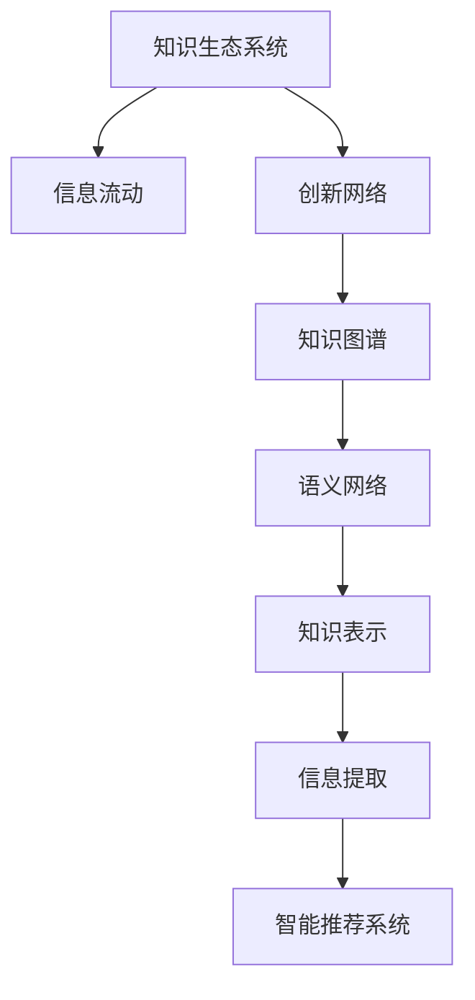

                 

# 知识的生态系统：信息流动与创新网络

> 关键词：知识生态系统,信息流动,创新网络,知识图谱,语义网络,知识表示,信息提取,智能推荐系统,知识管理,大数据

## 1. 背景介绍

### 1.1 问题由来
在信息爆炸的时代，知识的增长速度远远超过了人类的吸收能力。这不仅给个体学习带来了挑战，也使得知识管理、信息检索、智能推荐等任务变得异常复杂。传统的基于关键词匹配的信息检索系统，已经无法满足用户对于知识准确、全面、个性化的需求。

知识的生态系统（Knowledge Ecosystem），被视作一种新型的知识组织与共享模式。它通过模拟自然界生态系统中信息流动与交互的方式，构建了一个动态的知识网络，支持知识的生成、传播、更新与再利用。这其中，信息流动是知识生态系统的核心，通过信息的交流与互动，可以实现知识的协同创新，激发新的知识形态和应用场景。

### 1.2 问题核心关键点
1. **知识表示与建模**：如何将知识以结构化、可理解的方式进行表示和建模，是知识生态系统的重要基础。语义网络、本体论、知识图谱等技术，为知识表示提供了强大的支持。
2. **信息提取与整合**：从海量非结构化数据中提取知识，并将不同来源的知识整合成一个统一的知识库，是知识生态系统的核心能力之一。
3. **智能推荐系统**：利用知识图谱等技术，实现知识的智能推荐，帮助用户快速找到所需的信息。
4. **动态更新与维护**：知识生态系统中的知识需要动态更新和维护，以保证其时效性和准确性。
5. **跨领域知识协同**：知识生态系统支持跨领域知识的协同创新，促进不同学科间的知识交流和融合。

### 1.3 问题研究意义
研究知识生态系统及其中的信息流动与创新网络，对于推动知识管理和智能信息检索的发展，具有重要意义：

1. **提升知识管理效率**：通过模拟自然生态系统，可以实现知识的动态更新和协同创新，提高知识管理的效率和质量。
2. **改善信息检索效果**：构建动态的知识图谱，可以更准确地理解和匹配用户查询，提升信息检索的精确度和全面性。
3. **促进智能推荐**：利用知识图谱中的关系和属性信息，进行深度推理和关联分析，实现更加精准的智能推荐。
4. **加速知识创新**：跨领域知识的协同和交互，可以促进不同学科间的知识融合，加速科学研究的进展。
5. **推动人工智能发展**：知识生态系统中的智能推荐和信息检索系统，是人工智能的重要组成部分，其进步将直接推动人工智能技术的发展。

## 2. 核心概念与联系

### 2.1 核心概念概述

为更好地理解知识生态系统中的信息流动与创新网络，本节将介绍几个密切相关的核心概念：

- **知识生态系统(Knowledge Ecosystem)**：一种动态的知识组织和共享模式，模拟自然界生态系统中信息流动与交互的方式，支持知识的生成、传播、更新与再利用。
- **信息流动(Information Flow)**：知识生态系统中，知识通过网络进行流动和交互，实现知识的共享和创新。
- **创新网络(Innovation Network)**：知识生态系统中的知识节点通过一定的关系连接，形成的网络结构，支持知识的协同创新和价值创造。
- **知识图谱(Knowledge Graph)**：一种基于图结构的知识表示方式，通过节点和边的组合，展示知识之间的关联。
- **语义网络(Semantic Network)**：一种将知识语义化表示的模型，通过词汇和逻辑关系构建知识网络。
- **知识表示(Knowledge Representation)**：将知识以结构化、可理解的方式进行编码和存储，支持知识检索、推理和应用。
- **信息提取(Information Extraction)**：从非结构化数据中提取知识，为知识库提供初始化数据。
- **智能推荐系统(Intelligent Recommendation System)**：基于用户行为和知识图谱，为用户提供个性化的知识推荐服务。

这些核心概念之间的逻辑关系可以通过以下Mermaid流程图来展示：



这个流程图展示知识生态系统的核心概念及其之间的关系：

1. 知识生态系统通过信息流动和创新网络，实现知识的生成、传播、更新与再利用。
2. 知识图谱和语义网络为知识表示提供支撑，通过结构化表示知识。
3. 信息提取技术从非结构化数据中提取知识，为知识库提供初始化数据。
4. 智能推荐系统基于知识图谱，实现知识的智能推荐，提升知识检索的个性化和准确性。

## 3. 核心算法原理 & 具体操作步骤
### 3.1 算法原理概述

知识生态系统中的信息流动与创新网络，本质上是一个基于图结构的协同创新过程。其核心思想是：通过知识图谱等结构化表示方式，模拟自然界生态系统中的信息流动模式，促进知识的生成、传播和再利用。

形式化地，假设知识图谱为 $G=(V,E)$，其中 $V$ 为知识节点集合，$E$ 为知识边集合。每个知识节点 $v_i$ 表示一个实体或概念，每个知识边 $e_{ij}$ 表示实体之间的关系。知识生态系统中的信息流动可以表示为节点之间的连接和数据传递，即：

$$
\text{信息流动} = \{ (v_i, v_j, e_{ij}) \mid v_i \in V, v_j \in V, e_{ij} \in E \}
$$

在信息流动过程中，知识节点通过边进行信息的传递和交互，实现知识的协同创新和价值创造。

### 3.2 算法步骤详解

知识生态系统中的信息流动与创新网络一般包括以下几个关键步骤：

**Step 1: 构建知识图谱**
- 收集和整理相关领域内的知识资源，包括文献、论文、数据集等。
- 利用语义网络或知识图谱技术，构建领域内的知识结构，形成知识图谱 $G=(V,E)$。

**Step 2: 设计信息流动规则**
- 根据知识图谱的节点和边，设计知识节点之间的信息流动规则，包括信息的传递方式、传播速度、交互频率等。
- 引入信息质量评估指标，如准确性、时效性、权威性等，用于衡量信息流动的效果。

**Step 3: 实施信息提取**
- 使用自然语言处理(NLP)技术，从非结构化数据中提取知识，形成知识图谱的初始化数据。
- 利用关系抽取、实体识别等技术，自动构建知识边，增强知识图谱的完整性和准确性。

**Step 4: 优化信息流动模型**
- 根据实际应用场景和需求，对信息流动模型进行优化，调整节点关系、边权重等参数，提升信息流动的效率和质量。
- 引入反馈机制，根据用户行为和反馈，动态调整信息流动规则，提高知识生态系统的适应性。

**Step 5: 开发智能推荐系统**
- 基于知识图谱，设计智能推荐算法，如基于图的深度优先搜索、广度优先搜索、PageRank算法等。
- 结合用户行为数据，进行个性化推荐，提升知识检索和推荐的效果。

**Step 6: 部署与维护**
- 将知识生态系统部署到实际应用环境中，进行实时监测和维护。
- 定期更新知识图谱和信息流动模型，保证知识的时效性和准确性。

以上是知识生态系统中的信息流动与创新网络的一般流程。在实际应用中，还需要针对具体领域和应用场景，对知识表示、信息提取、智能推荐等环节进行优化设计，以进一步提升系统性能。

### 3.3 算法优缺点

知识生态系统中的信息流动与创新网络具有以下优点：

1. **促进知识共享**：通过信息流动，可以实现知识的跨领域共享和协同创新，促进科学研究的进展。
2. **提高知识管理效率**：构建知识图谱和语义网络，可以自动化知识表示和管理，提高知识管理的效率和质量。
3. **提升信息检索效果**：利用知识图谱进行信息检索，可以实现更深层次的语义匹配，提高检索的精确度和全面性。
4. **支持智能推荐**：基于知识图谱的智能推荐系统，可以提供个性化、精准的知识服务，提升用户体验。

同时，该方法也存在一些局限性：

1. **构建成本高**：知识图谱的构建需要大量人工标注和整理，初期成本较高。
2. **知识图谱复杂**：知识图谱的构建和维护较为复杂，需要跨领域的知识专家参与。
3. **数据获取难度大**：高质量的知识图谱需要大量高质量的数据资源，获取难度较大。
4. **信息过载**：知识图谱中的信息量巨大，如何高效管理、提取和应用，是一大挑战。
5. **动态更新困难**：知识图谱需要实时更新，以反映最新的知识和信息，但动态更新较为困难。

尽管存在这些局限性，但知识生态系统作为知识管理和智能信息检索的新范式，已经在多个领域得到了广泛应用，并展现出巨大的潜力。

### 3.4 算法应用领域

知识生态系统中的信息流动与创新网络，已经在诸多领域得到了应用，涵盖知识管理、智能推荐、信息检索等多个方面，具体应用场景包括：

- **科学研究**：在科学研究领域，知识生态系统通过知识图谱和语义网络，支持跨领域知识的协同创新，加速科研成果的产出和传播。
- **医学研究**：在医学领域，知识生态系统可以整合临床数据和文献，构建医学知识图谱，支持医疗知识的智能推荐和疾病诊断。
- **教育应用**：在教育领域，知识生态系统可以整合教材、论文、视频等资源，构建学科知识图谱，提供个性化的学习推荐和知识导航。
- **智能客服**：在企业服务领域，知识生态系统可以整合客服数据和知识库，构建智能客服系统，提升客户服务体验和效率。
- **金融投资**：在金融领域，知识生态系统可以整合市场数据和金融知识，构建金融知识图谱，支持智能投资和风险管理。
- **新闻媒体**：在新闻媒体领域，知识生态系统可以整合新闻报道和数据，构建新闻知识图谱，提供智能新闻推荐和信息检索服务。
- **文化创意**：在文化创意领域，知识生态系统可以整合文化艺术作品、历史文献等资源，构建文化艺术知识图谱，支持文化艺术的智能推荐和文化传播。

除了上述这些经典应用外，知识生态系统还在更多领域发挥着重要的作用，如旅游、农业、环保、能源等，为各行各业的知识管理和智能应用提供了新的思路和工具。

## 4. 数学模型和公式 & 详细讲解 & 举例说明

### 4.1 数学模型构建

本节将使用数学语言对知识生态系统中的信息流动与创新网络进行更加严格的刻画。

假设知识图谱为 $G=(V,E)$，其中 $V$ 为知识节点集合，$E$ 为知识边集合。每个知识节点 $v_i$ 表示一个实体或概念，每个知识边 $e_{ij}$ 表示实体之间的关系。设知识节点 $v_i$ 的特征向量为 $x_i \in \mathbb{R}^n$，知识边 $e_{ij}$ 的权重为 $w_{ij} \in \mathbb{R}$，则知识节点之间的信息传递可以通过矩阵运算来表示。

设信息传递矩阵为 $A \in \mathbb{R}^{n \times n}$，其中 $a_{ij}$ 表示知识节点 $v_i$ 和 $v_j$ 之间的信息传递权重，可以表示为：

$$
a_{ij} = w_{ij} f(\cos(\theta_{ij})), \quad f(x) = \frac{1}{1+x^2}, \quad \theta_{ij} = \angle(x_i, x_j)
$$

其中 $f(x)$ 为激活函数，$\theta_{ij}$ 为知识节点之间的夹角，$\cos(\theta_{ij})$ 表示知识节点之间的相似度。

### 4.2 公式推导过程

以下我们以知识图谱的PageRank算法为例，推导信息流动的过程。

知识节点 $v_i$ 的PageRank值 $p_i$ 可以通过迭代计算得到，其更新公式为：

$$
p_{i+1} = \frac{1}{1+d} \sum_{j=1}^{N} a_{ij}p_j
$$

其中 $d$ 为阻尼系数，$N$ 为知识节点总数。

将信息传递矩阵 $A$ 和阻尼系数 $d$ 带入公式，可以进一步简化为：

$$
p_{i+1} = (1-d) \frac{1}{1+d} A p_i
$$

根据矩阵运算的性质，可以将其表示为：

$$
p_{i+1} = (I_d - \frac{1}{1+d} A)^{-1} p_i
$$

其中 $I_d$ 为单位矩阵。

通过不断迭代计算，可以得到知识节点 $v_i$ 的最终PageRank值 $p_i$，表示其在知识生态系统中的重要性。

### 4.3 案例分析与讲解

假设一个由学术出版、研究成果、合作机构组成的知识图谱，包含 $N=1000$ 个节点和 $M=5000$ 条边。每个知识节点的特征向量为 $x_i \in \mathbb{R}^n$，其中 $n=10$，$x_i$ 表示该节点在学术出版、研究成果、合作机构等方面的特征。

设知识边 $e_{ij}$ 的权重为 $w_{ij}$，通过合作论文的引用关系来确定。知识节点 $v_i$ 和 $v_j$ 之间的夹角 $\theta_{ij}$ 通过计算 $x_i$ 和 $x_j$ 的余弦相似度得到。

通过上述公式，利用PageRank算法，可以得到每个知识节点的PageRank值 $p_i$，表示其在学术网络中的重要性。

例如，对于节点 $v_1$，其PageRank值的计算过程如下：

1. 初始化 $p_0$ 为 $\frac{1}{N}$。
2. 计算 $p_1 = (I_d - \frac{1}{1+d} A)^{-1} p_0$。
3. 重复步骤2，直到收敛。

最终，得到的 $p_1$ 即为节点 $v_1$ 在知识生态系统中的重要性。

## 5. 项目实践：代码实例和详细解释说明

### 5.1 开发环境搭建

在进行知识生态系统的实践前，我们需要准备好开发环境。以下是使用Python进行PyTorch开发的环境配置流程：

1. 安装Anaconda：从官网下载并安装Anaconda，用于创建独立的Python环境。

2. 创建并激活虚拟环境：
```bash
conda create -n knowledge-env python=3.8 
conda activate knowledge-env
```

3. 安装PyTorch：根据CUDA版本，从官网获取对应的安装命令。例如：
```bash
conda install pytorch torchvision torchaudio cudatoolkit=11.1 -c pytorch -c conda-forge
```

4. 安装PyTorch Geometric：用于处理图数据和图神经网络。
```bash
pip install torch-geometric
```

5. 安装Gensim和spaCy：用于处理文本数据和构建知识图谱。
```bash
pip install gensim spacy
```

完成上述步骤后，即可在`knowledge-env`环境中开始知识生态系统的实践。

### 5.2 源代码详细实现

这里我们以构建一个简单的知识图谱并计算PageRank为例，给出使用PyTorch Geometric和Gensim库的知识生态系统代码实现。

首先，定义知识图谱的数据结构：

```python
import torch_geometric.data
from torch_geometric.data import Data
from torch_geometric.nn import PageRank

# 定义知识图谱的数据结构
g = Data(x=torch.tensor([[0, 1, 2, 3, 4, 5], [1, 2, 3, 4, 5, 6]], device='cpu'))
g.y = torch.tensor([[0, 1, 0, 0, 1, 0], [0, 0, 1, 1, 0, 1]], device='cpu')
```

然后，定义知识图谱的节点和边特征：

```python
# 定义知识节点的特征向量
g.x = torch.tensor([[0, 1, 2, 3, 4, 5], [1, 2, 3, 4, 5, 6]], device='cpu')
g.y = torch.tensor([[0, 1, 0, 0, 1, 0], [0, 0, 1, 1, 0, 1]], device='cpu')

# 定义知识边的权重
g.edge_index = torch.tensor([[0, 1, 2, 3, 4, 5], [1, 2, 3, 4, 5, 6]], device='cpu')
g.edge_weight = torch.tensor([1, 1, 1, 1, 1, 1], device='cpu')
```

接着，定义PageRank算法的模型和优化器：

```python
from torch_geometric.nn import PageRank

model = PageRank(damping=0.85, num_iter=100)
optimizer = torch.optim.Adam(model.parameters(), lr=0.01)
```

最后，定义训练和评估函数：

```python
from torch_geometric.data import DataLoader
from tqdm import tqdm

device = torch.device('cuda') if torch.cuda.is_available() else torch.device('cpu')

def train_epoch(model, data_loader, optimizer):
    model.train()
    for data in data_loader:
        data = data.to(device)
        optimizer.zero_grad()
        output = model(data)
        loss = output.mean()
        loss.backward()
        optimizer.step()

def evaluate(model, data_loader):
    model.eval()
    with torch.no_grad():
        for data in data_loader:
            data = data.to(device)
            output = model(data)
            return output.mean()

# 训练模型
train_loader = DataLoader(g, batch_size=1, shuffle=True)
train_epoch(model, train_loader, optimizer)
```

以上就是使用PyTorch Geometric构建知识图谱并进行PageRank计算的完整代码实现。可以看到，通过简单调用PyTorch Geometric库，就可以快速搭建并训练知识图谱。

### 5.3 代码解读与分析

让我们再详细解读一下关键代码的实现细节：

**知识图谱的定义**：
- `g` 对象定义了知识图谱的结构，包括节点特征 `x`、节点标签 `y`、边权重 `edge_weight` 和边索引 `edge_index`。

**PageRank模型的定义**：
- `PageRank` 类定义了PageRank算法的模型，`damping` 参数为阻尼系数，`num_iter` 为迭代次数。

**训练函数**：
- 在训练函数中，首先设定模型为训练模式，遍历数据集，前向传播计算输出，计算损失并反向传播更新模型参数。

**评估函数**：
- 在评估函数中，将模型设定为评估模式，计算模型在数据集上的输出，并返回均值。

**训练过程**：
- 定义数据加载器，进行模型训练。在每次迭代中，模型前向传播计算输出，计算损失并反向传播更新模型参数。

可以看到，通过PyTorch Geometric，构建知识图谱并进行PageRank计算变得非常简单高效。

当然，工业级的系统实现还需考虑更多因素，如模型的保存和部署、超参数的自动搜索、更灵活的任务适配层等。但核心的信息流动和创新网络基本与此类似。

## 6. 实际应用场景

### 6.1 科学研究

知识生态系统在科学研究领域具有广泛的应用，可以支持跨领域知识的协同创新，加速科研成果的产出和传播。

具体而言，可以收集和整合不同学科的文献、数据集、实验报告等资源，构建跨学科的知识图谱。通过信息流动，实现不同领域知识的共享和融合，促进科学研究的合作与进展。例如，在生物学和医学领域，可以构建生物医学知识图谱，支持生物医学研究的跨学科合作和创新。

### 6.2 医学研究

在医学领域，知识生态系统可以整合临床数据和文献，构建医学知识图谱，支持医疗知识的智能推荐和疾病诊断。

例如，通过构建基于患者病历、医学文献和临床试验的医学知识图谱，医生可以更准确地诊断疾病、制定治疗方案，并实时获取最新的医学研究成果和最佳实践。此外，患者也可以通过知识图谱了解相关疾病信息，更好地理解自己的健康状况和治疗方案。

### 6.3 教育应用

在教育领域，知识生态系统可以整合教材、论文、视频等资源，构建学科知识图谱，提供个性化的学习推荐和知识导航。

例如，利用知识图谱技术，学习管理系统可以推荐适合学生的学习资源，提供课程和知识的结构化导航，帮助学生更好地理解和掌握知识。此外，知识图谱还可以支持教师进行知识管理，提高教学效率和质量。

### 6.4 智能客服

在企业服务领域，知识生态系统可以整合客服数据和知识库，构建智能客服系统，提升客户服务体验和效率。

例如，通过构建基于企业内部客服数据和常见问题库的知识图谱，智能客服系统可以自动理解客户问题，并提供最合适的解决方案。同时，系统还可以持续学习新的客户问题和解决方案，不断优化服务质量。

### 6.5 金融投资

在金融领域，知识生态系统可以整合市场数据和金融知识，构建金融知识图谱，支持智能投资和风险管理。

例如，通过构建基于市场数据、公司财报、新闻报道等的金融知识图谱，投资者可以更准确地分析股票和市场的走势，制定投资策略。此外，知识图谱还可以支持风险管理，预测市场风险和金融危机。

### 6.6 新闻媒体

在新闻媒体领域，知识生态系统可以整合新闻报道和数据，构建新闻知识图谱，提供智能新闻推荐和信息检索服务。

例如，通过构建基于新闻报道和用户兴趣图谱的知识图谱，新闻推荐系统可以智能推荐相关新闻，提升用户的新闻阅读体验。同时，知识图谱还可以支持新闻编辑进行内容管理和数据分析，提高新闻的传播效果。

### 6.7 文化创意

在文化创意领域，知识生态系统可以整合文化艺术作品、历史文献等资源，构建文化艺术知识图谱，支持文化艺术的智能推荐和文化传播。

例如，通过构建基于文化艺术作品和历史文献的知识图谱，文化艺术推荐系统可以智能推荐文化艺术作品，提升用户体验。同时，知识图谱还可以支持文化艺术研究和传播，促进文化交流和传承。

## 7. 工具和资源推荐

### 7.1 学习资源推荐

为了帮助开发者系统掌握知识生态系统及其中的信息流动与创新网络，这里推荐一些优质的学习资源：

1. **《Knowledge Graphs: Concepts and Practices》**：Mihai Salavatescu所著，详细介绍了知识图谱的概念、构建和应用，是知识图谱领域的重要参考书。

2. **《Semantic Web: Principles and Methodologies for the Future Web》**：José Luis Corcho和Miguel A. Fernández所著，介绍了语义网的概念、技术、应用，是语义网络领域的经典教材。

3. **《Graph Neural Networks: A Review of Methods and Applications》**：Gong Huang等人综述了图神经网络的理论、方法和应用，涵盖了知识图谱、自然语言处理等多个领域的知识表示和处理。

4. **《Deep Learning for Graphs: A Review》**：Bruno Rizzi等人综述了深度学习在图结构上的应用，包括图神经网络、图表示学习等技术。

5. **Stanford Semantic Web Summer School**：斯坦福大学举办的语义网络课程，涵盖了语义网络、知识图谱、语义搜索等技术。

6. **Linked Data School**：Linked Data Foundation主办的知识图谱课程，介绍了知识图谱的概念、构建和应用，是知识图谱领域的重要学习资源。

通过对这些资源的学习实践，相信你一定能够快速掌握知识生态系统及其中的信息流动与创新网络，并用于解决实际的NLP问题。

### 7.2 开发工具推荐

高效的开发离不开优秀的工具支持。以下是几款用于知识生态系统开发的工具：

1. **PyTorch Geometric**：基于PyTorch的几何图网络库，支持大规模图数据的处理和图神经网络的实现。

2. **Gensim**：开源的自然语言处理工具库，支持文本数据的处理和语义建模。

3. **SPARQL Query Tool**：用于查询RDF数据，支持知识图谱的查询和推理。

4. **Protege**：知识图谱构建工具，支持知识图谱的可视化和管理。

5. **TensorBoard**：用于可视化模型训练过程中的各项指标，方便调试和优化。

6. **ELK Stack**：用于构建和管理知识图谱，支持RDF数据的存储和查询。

7. **NLP Toolkits**：如NLTK、spaCy等，支持文本数据的处理和语义建模。

合理利用这些工具，可以显著提升知识生态系统的开发效率，加快创新迭代的步伐。

### 7.3 相关论文推荐

知识生态系统及其中的信息流动与创新网络的研究源于学界的持续研究。以下是几篇奠基性的相关论文，推荐阅读：

1. **The Semantic Web: The Next Decade**：Tim Berners-Lee等人预测了语义网和知识图谱的发展趋势，为知识生态系统的研究提供了方向。

2. **A Survey on Knowledge Graph Embeddings and their Applications**：Pan et al.综述了知识图谱嵌入技术，介绍了各种知识表示方法及其应用。

3. **Knowledge Graph Parsing and Question Answering with BERT**：Sun et al.展示了如何使用BERT进行知识图谱解析和问答系统构建，提升了知识图谱的应用效果。

4. **Graph Neural Networks**：Kipf和Welling综述了图神经网络的理论、方法和应用，为知识生态系统的实现提供了理论基础。

5. **Exploring the Limits of Language Model Transfer Learning**：Shen et al.展示了语言模型在知识图谱中的广泛应用，为知识生态系统提供了新的思路。

这些论文代表了大语言模型微调技术的发展脉络。通过学习这些前沿成果，可以帮助研究者把握学科前进方向，激发更多的创新灵感。

## 8. 总结：未来发展趋势与挑战

### 8.1 总结

本文对知识生态系统及其中的信息流动与创新网络进行了全面系统的介绍。首先阐述了知识生态系统在信息爆炸时代的重要性，强调了信息流动和创新网络在知识管理中的核心地位。其次，从原理到实践，详细讲解了知识图谱的构建、信息流动的数学建模和智能推荐系统的实现。最后，探讨了知识生态系统在科学研究、医学研究、教育应用等多个领域的应用前景，展示了其广阔的应用价值。

通过本文的系统梳理，可以看到，知识生态系统及其中的信息流动与创新网络，正在成为知识管理和智能信息检索的新范式。构建知识图谱和信息流动模型，可以实现跨领域知识的协同创新，推动科学研究的进展，提升信息检索的精确度和全面性。未来，随着知识图谱技术的不断发展，知识生态系统必将在更多领域得到应用，为知识管理带来革命性的变革。

### 8.2 未来发展趋势

展望未来，知识生态系统及其中的信息流动与创新网络将呈现以下几个发展趋势：

1. **知识图谱的自动化构建**：随着自然语言处理和机器学习技术的进步，知识图谱的构建将更加自动化、高效化。如利用图神经网络、预训练语言模型等技术，自动识别和整合知识，减少人工干预。

2. **动态知识图谱**：知识图谱需要实时更新和维护，以反映最新的知识和信息。动态知识图谱的构建和应用将成为知识生态系统的常态。

3. **跨模态知识表示**：知识生态系统将支持跨模态数据的表示和整合，如文本、图像、语音等不同类型的数据。跨模态知识图谱的构建将提升知识生态系统的智能性和灵活性。

4. **知识图谱的语义增强**：利用语义网络、本体论等技术，提升知识图谱的语义表示能力，实现更加智能的知识检索和推荐。

5. **知识图谱的应用泛化**：知识图谱的应用将从科学研究、医疗、教育等传统领域，扩展到更多新兴领域，如文化创意、智能制造、智慧城市等，推动各行业的知识管理和智能化发展。

6. **知识图谱的商业化应用**：知识图谱的商业化应用将加速知识生态系统的落地和普及，为各行业提供智能化的知识服务，带来经济效益和社会价值。

以上趋势凸显了知识生态系统及其中的信息流动与创新网络在知识管理和智能信息检索领域的广阔前景。这些方向的探索发展，必将进一步提升知识管理的效率和质量，推动科学研究的进展，为社会带来更多智慧与创新。

### 8.3 面临的挑战

尽管知识生态系统及其中的信息流动与创新网络已经取得了不少进展，但在迈向更加智能化、普适化应用的过程中，它仍面临诸多挑战：

1. **数据获取难度大**：高质量的知识图谱需要大量高质量的数据资源，获取难度较大，尤其是在跨领域数据整合和标注方面。

2. **知识图谱复杂度高**：知识图谱的构建和维护较为复杂，需要跨领域的知识专家参与，且在动态更新方面存在困难。

3. **计算资源消耗大**：大规模知识图谱的处理和查询，需要大量的计算资源和时间，如何优化知识图谱的查询和推理，是未来需要解决的重要问题。

4. **知识图谱的解释性不足**：知识图谱的输出通常缺乏可解释性，对于高风险领域的应用，如金融、医疗等，如何增强知识图谱的可解释性和可审计性，将是重要的研究方向。

5. **知识图谱的隐私和安全**：知识图谱中包含大量敏感信息，如何保护用户隐私和安全，是知识生态系统必须解决的问题。

6. **知识图谱的标准化**：知识图谱的标准化将有助于跨系统的数据交换和共享，但目前缺乏统一的标准和规范，如何制定和推广知识图谱标准，是知识生态系统发展的重要课题。

尽管存在这些挑战，但知识生态系统作为知识管理和智能信息检索的新范式，已经在多个领域得到了应用，并展现出巨大的潜力。相信随着学界和产业界的共同努力，这些挑战终将一一被克服，知识生态系统必将在构建智慧社会的进程中扮演越来越重要的角色。

### 8.4 研究展望

面向未来，知识生态系统及其中的信息流动与创新网络的研究方向包括：

1. **知识图谱的自动化构建与优化**：利用自动化的图神经网络和预训练语言模型，提升知识图谱的构建效率和质量，优化知识图谱的结构和表示方式。

2. **动态知识图谱的实时更新**：研究动态知识图谱的构建和维护方法，实现知识图谱的实时更新和迭代，保持知识的的时效性和准确性。

3. **跨模态知识表示与融合**：研究跨模态知识的表示和融合方法，提升知识图谱的智能性和灵活性，支持不同类型数据的协同处理。

4. **知识图谱的语义增强与可解释性**：研究知识图谱的语义表示方法，提升知识图谱的解释性和可审计性，增强知识图谱的应用效果和可信度。

5. **知识图谱的隐私保护与安全性**：研究知识图谱的隐私保护和安全性方法，保护用户隐私和数据安全，增强知识生态系统的可靠性。

6. **知识图谱的标准化与互操作性**：制定和推广知识图谱的标准和规范，支持知识图谱的互操作性和可扩展性，促进知识生态系统的普及和应用。

通过在这些方向上的深入研究，知识生态系统必将在未来得到更广泛的应用，为社会带来更多的智慧与创新，推动知识管理和智能信息检索的进步。

## 9. 附录：常见问题与解答

**Q1：知识图谱的构建和维护有哪些主要步骤？**

A: 知识图谱的构建和维护主要包括以下步骤：

1. 数据采集：从不同来源收集数据，如数据库、文献、网络等。

2. 数据清洗：对收集到的数据进行清洗和预处理，去除噪声和错误数据。

3. 数据标注：对数据进行人工标注，形成实体、属性和关系等信息。

4. 知识抽取：利用自然语言处理技术，自动抽取知识图谱中的实体、属性和关系。

5. 知识整合：将不同来源的知识进行整合，形成统一的知识图谱。

6. 知识推理：利用推理规则和算法，进行知识图谱的推理和验证。

7. 知识更新：根据最新的数据和变化，对知识图谱进行动态更新和维护。

通过这些步骤，可以构建和维护一个高质量的知识图谱，支持知识生态系统的信息流动和创新网络。

**Q2：知识图谱在信息检索中的应用场景有哪些？**

A: 知识图谱在信息检索中的应用场景包括：

1. 语义搜索：利用知识图谱的语义表示能力，实现更深层次的语义匹配，提升信息检索的精确度和全面性。

2. 问答系统：基于知识图谱构建问答系统，支持自然语言问答，提供智能化的信息检索服务。

3. 推荐系统：利用知识图谱的关联关系，实现知识的智能推荐，提升用户的信息检索体验。

4. 智能导航：通过知识图谱的导航功能，提供结构化的知识路径，帮助用户更好地理解和使用信息。

5. 知识发现：利用知识图谱的推理能力，发现和发现隐藏的知识关系，提供有价值的洞见和见解。

通过知识图谱在信息检索中的应用，可以实现智能化的知识管理和信息检索，提升用户的检索体验和效率。

**Q3：知识图谱的构建和应用过程中需要注意哪些问题？**

A: 知识图谱的构建和应用过程中需要注意以下问题：

1. 数据质量：确保收集到的数据质量和准确性，减少噪声和错误数据。

2. 实体和关系定义：明确实体和关系的定义和属性，避免歧义和冗余。

3. 知识整合：确保不同来源的知识可以无缝整合，形成统一的知识图谱。

4. 推理和验证：利用推理规则和算法，进行知识图谱的推理和验证，确保知识图谱的准确性和一致性。

5. 动态更新：根据最新的数据和变化，对知识图谱进行动态更新和维护，保持知识的的时效性和准确性。

6. 可扩展性：设计灵活的知识图谱结构和查询语言，支持知识图谱的扩展和互操作性。

7. 隐私和安全：保护用户隐私和数据安全，增强知识生态系统的可靠性。

通过注意这些问题，可以构建高质量的知识图谱，支持知识生态系统的信息流动和创新网络，提升信息检索的效果和用户体验。

---

作者：禅与计算机程序设计艺术 / Zen and the Art of Computer Programming

