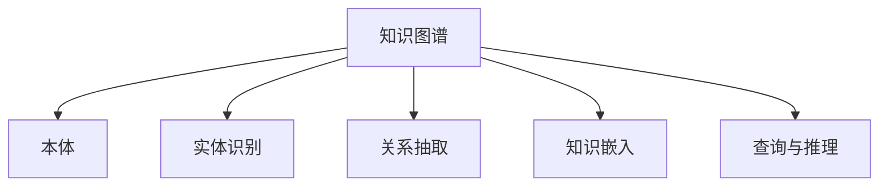

                 

# 知识的碎片化：信息时代的挑战与机遇

> 关键词：知识图谱, 碎片化, 深度学习, 信息检索, 个性化推荐

## 1. 背景介绍

### 1.1 问题由来

在信息爆炸的今天，人类获取、处理和应用知识的方式发生了革命性的变化。互联网和移动互联网的普及，使得信息以近乎实时、海量的形式源源不断地涌入我们的视野，极大地丰富了人类的知识库。但与此同时，知识的碎片化现象也愈发严重。碎片化的知识源、多样化的知识形式、广泛的兴趣点等，使得传统的信息检索、知识组织和知识管理模式面临巨大的挑战。

在这种背景下，如何有效地收集、组织和应用碎片化知识，成为当前信息技术领域的一个关键问题。知识图谱（Knowledge Graph）作为一种新兴的知识表示和组织方式，以其丰富的语义信息、强大的查询能力、优异的关联推导性能，为解决知识碎片化问题提供了新的方向和解决方案。

### 1.2 问题核心关键点

面对知识的碎片化，知识图谱技术致力于通过建立实体、属性和关系间的关联网络，将杂乱无章的碎片化知识整理成结构化的、易于理解和查询的形式，以便更高效地辅助人们的知识获取、发现、推理和应用。核心关键点包括：

- **知识抽取与融合**：从海量文本、网页、社交网络等数据源中，自动抽取实体、关系和属性，构建知识图谱。
- **图谱嵌入与表示**：使用深度学习方法，将知识图谱中的实体、关系和属性转化为高维向量表示，提升查询性能和推理能力。
- **查询与推理**：提供丰富的查询接口和复杂的推理机制，实现基于知识图谱的智能搜索、问答、推荐等功能。
- **知识迁移与融合**：在已有知识图谱的基础上，支持新知识的迁移和融合，实现知识的动态扩展和升级。

本文将详细探讨知识图谱在信息时代面临的挑战与机遇，从理论、技术和实践三个层面深入剖析知识图谱的核心原理和应用，并给出一些切实可行的解决方案和未来发展趋势。

## 2. 核心概念与联系

### 2.1 核心概念概述

为更好地理解知识图谱在处理知识碎片化中的作用，本节将介绍几个密切相关的核心概念：

- **知识图谱(Knowledge Graph)**：由节点和边构成的图结构，用于表示实体、属性和关系间的复杂关系。知识图谱中的实体节点表示具体的对象或概念，属性节点表示实体的特性或特征，关系节点表示实体之间的关系。
- **本体(Ontology)**：一种形式化的知识表示方法，用于描述实体、属性和关系间的语义关系。本体通常由一组定义和规则组成，定义了知识图谱中的基本概念、属性和关系。
- **实体识别(Entity Recognition)**：从文本、网页等非结构化数据中自动识别出具有实际意义的实体，是构建知识图谱的基础。
- **关系抽取(Relationship Extraction)**：从文本、网页等数据中自动抽取实体间的语义关系，构建知识图谱中的关系链。
- **知识嵌入(Knowledge Embedding)**：使用深度学习方法，将知识图谱中的节点和边转化为向量表示，用于查询和推理。
- **查询与推理(Reasoning)**：基于知识图谱的查询和推理能力，实现对知识的高级应用，如智能搜索、问答系统、个性化推荐等。

这些核心概念之间的逻辑关系可以通过以下Mermaid流程图来展示：



这个流程图展示出知识图谱与本体、实体识别、关系抽取、知识嵌入和查询推理等核心概念之间的关系：

1. 本体定义了知识图谱中的基本概念、属性和关系，为知识图谱提供了形式化、规范化的知识框架。
2. 实体识别从数据源中自动识别出实体，并为实体打上标签。
3. 关系抽取从数据源中提取实体间的语义关系，构建知识图谱中的关系链。
4. 知识嵌入将知识图谱中的节点和边转化为向量表示，用于查询和推理。
5. 查询与推理利用知识图谱提供丰富的查询接口和复杂的推理机制，实现基于知识图谱的高级应用。

这些概念共同构成了知识图谱的知识表示和应用框架，使其能够有效地处理和应用碎片化知识，辅助人们更高效地获取和使用知识。

## 3. 核心算法原理 & 具体操作步骤

### 3.1 算法原理概述

知识图谱的核心原理在于通过建立实体、属性和关系间的关联网络，将碎片化的知识整理成结构化的、易于理解和查询的形式。其核心算法包括：

- **本体构建**：定义知识图谱中的基本概念、属性和关系，构建知识图谱的形式化框架。
- **实体识别与关系抽取**：从文本、网页等数据源中自动识别出实体和关系，构建知识图谱的节点和边。
- **知识嵌入**：使用深度学习方法，将知识图谱中的节点和边转化为向量表示，提升查询和推理的性能。
- **查询与推理**：提供丰富的查询接口和复杂的推理机制，实现基于知识图谱的智能搜索、问答和推荐等功能。

### 3.2 算法步骤详解

知识图谱的构建通常包含以下几个关键步骤：

**Step 1: 数据采集与预处理**

- 收集各类数据源，如维基百科、新闻、社交网络等。
- 清洗和格式化数据，去除噪音和错误信息。
- 对数据进行分词、词性标注、命名实体识别等处理，提取可能的实体和关系。

**Step 2: 实体识别与关系抽取**

- 使用深度学习方法，如基于神经网络的结构化序列标注模型，识别出文本中的实体和关系。
- 对识别出的实体和关系进行验证和纠正，确保其准确性和一致性。
- 将识别出的实体和关系映射到知识图谱中，构建知识图谱的节点和边。

**Step 3: 知识嵌入**

- 使用深度学习模型，如TransE、KGAT等，将知识图谱中的节点和边转化为向量表示。
- 优化向量表示，使其能够更好地反映实体、属性和关系间的语义关系。
- 训练模型，优化向量表示的质量和鲁棒性。

**Step 4: 查询与推理**

- 提供丰富的查询接口，支持基于实体、属性和关系的多样化查询。
- 利用知识图谱的推理能力，支持复杂的关联推导、因果推理等高级功能。
- 根据用户需求和上下文，动态调整查询和推理策略，优化查询性能。

**Step 5: 知识迁移与融合**

- 在已有知识图谱的基础上，支持新知识的迁移和融合，实现知识的动态扩展和升级。
- 通过不断迭代和优化，保持知识图谱的时效性和准确性。

### 3.3 算法优缺点

知识图谱在处理碎片化知识方面具有以下优点：

1. **结构化表示**：将碎片化知识整理成结构化的形式，便于查询和推理。
2. **语义关联**：通过建立实体、属性和关系间的关联网络，提供丰富的语义信息。
3. **推理能力**：利用复杂的推理机制，支持基于知识图谱的高级应用。
4. **动态扩展**：支持新知识的迁移和融合，实现知识的动态扩展和升级。

同时，知识图谱也存在一些局限性：

1. **数据依赖性**：知识图谱的构建依赖于数据源的质量和全面性，数据采集和预处理过程复杂。
2. **建模难度**：本体构建和实体关系抽取等步骤需要专业知识和经验，建模难度较大。
3. **嵌入复杂度**：知识嵌入和推理模型复杂，训练和优化过程需要大量的计算资源和时间。
4. **上下文依赖**：知识图谱的查询和推理需要上下文信息，对输入数据的要求较高。
5. **应用场景有限**：目前主要应用于搜索引擎、问答系统、个性化推荐等领域，应用场景相对有限。

尽管存在这些局限性，但知识图谱在处理碎片化知识方面展现了巨大的潜力，成为信息时代的重要工具。

### 3.4 算法应用领域

知识图谱技术已经在信息检索、知识发现、智能问答、个性化推荐等多个领域得到广泛应用，具体应用包括：

- **搜索引擎**：通过构建知识图谱，提供基于实体、属性和关系的高级搜索功能，提升搜索精度和召回率。
- **问答系统**：利用知识图谱的推理能力，实现基于自然语言处理的智能问答，提供精准的答案。
- **推荐系统**：通过知识图谱中的实体关系，实现个性化推荐，提升用户体验和推荐效果。
- **社交网络**：利用知识图谱中的人际关系信息，实现推荐和搜索，增强社交互动。
- **医疗健康**：通过构建医疗知识图谱，支持医生诊断、医疗搜索和健康管理。
- **金融理财**：利用知识图谱中的金融数据，实现风险评估、投资分析和理财规划。

## 4. 数学模型和公式 & 详细讲解 & 举例说明

### 4.1 数学模型构建

知识图谱的数学模型通常由节点和边构成，节点表示实体、属性和关系，边表示实体间的关系或属性的连接。本节将使用数学语言对知识图谱的构建和表示进行严格的刻画。

记知识图谱中的节点集合为 $N$，边集合为 $E$。对于节点 $n \in N$，其属性表示为 $\mathbf{x}_n \in \mathbb{R}^d$，其中 $d$ 为节点的维度。对于边 $e \in E$，其属性表示为 $\mathbf{w}_e \in \mathbb{R}^d$。知识图谱的数学表示形式为：

$$
G(N,E,\{r_e\}_{e\in E})
$$

其中 $r_e$ 为边 $e$ 的关联关系，可以是同义词、反义词、上下位关系等。

### 4.2 公式推导过程

以下我们以知识图谱中的实体嵌入为例，推导其向量表示的计算公式。

设知识图谱中的节点 $n$ 为实体，其向量表示为 $\mathbf{x}_n$。利用神经网络进行实体嵌入，可以将节点 $n$ 和其所有关联节点 $k$ 的向量表示，通过如下的公式进行计算：

$$
\mathbf{x}_n = f(\mathbf{W}[\mathbf{x}_k \oplus \mathbf{w}_e])
$$

其中 $\mathbf{W}$ 为嵌入矩阵，$\oplus$ 为连接操作，$f$ 为激活函数，$\mathbf{x}_k$ 为节点 $k$ 的向量表示，$\mathbf{w}_e$ 为边 $e$ 的向量表示。

对于节点 $n$ 的关联关系 $r_e$，其向量表示 $\mathbf{w}_e$ 可以通过如下的公式进行计算：

$$
\mathbf{w}_e = g(\mathbf{x}_n,\mathbf{x}_k)
$$

其中 $g$ 为关系函数，可以是矩阵乘法、向量加法等。

### 4.3 案例分析与讲解

**案例分析：构建医疗知识图谱**

在医疗领域，构建医疗知识图谱可以有效帮助医生诊断疾病、查询治疗方案等。以下是一个基于知识图谱的医学问答系统的实现案例：

1. **数据采集与预处理**：
   - 从各类医学数据库、文献中收集医疗数据。
   - 对数据进行清洗、格式转换，提取医疗实体和关系。

2. **实体识别与关系抽取**：
   - 使用深度学习模型，如BERT、BERT-encoder等，从医学文献中自动识别出医疗实体和关系。
   - 对识别出的实体和关系进行验证和纠正，确保其准确性和一致性。
   - 将识别出的实体和关系映射到知识图谱中，构建医疗知识图谱的节点和边。

3. **知识嵌入**：
   - 使用深度学习模型，如TransE、KGAT等，将医疗知识图谱中的节点和边转化为向量表示。
   - 优化向量表示，使其能够更好地反映实体、属性和关系间的语义关系。
   - 训练模型，优化向量表示的质量和鲁棒性。

4. **查询与推理**：
   - 提供丰富的查询接口，支持基于医疗实体、属性和关系的多样化查询。
   - 利用知识图谱的推理能力，实现基于自然语言处理的智能问答，提供精准的答案。
   - 根据用户需求和上下文，动态调整查询和推理策略，优化查询性能。

## 5. 项目实践：代码实例和详细解释说明

### 5.1 开发环境搭建

在进行知识图谱实践前，我们需要准备好开发环境。以下是使用Python进行TensorFlow开发的环境配置流程：

1. 安装Anaconda：从官网下载并安装Anaconda，用于创建独立的Python环境。

2. 创建并激活虚拟环境：
```bash
conda create -n graph-env python=3.8 
conda activate graph-env
```

3. 安装TensorFlow：根据CUDA版本，从官网获取对应的安装命令。例如：
```bash
conda install tensorflow -c conda-forge
```

4. 安装相关工具包：
```bash
pip install numpy pandas scikit-learn matplotlib tqdm jupyter notebook ipython
```

完成上述步骤后，即可在`graph-env`环境中开始知识图谱实践。

### 5.2 源代码详细实现

这里我们以构建医疗知识图谱为例，给出使用TensorFlow进行实体嵌入的PyTorch代码实现。

首先，定义知识图谱的节点和边：

```python
import tensorflow as tf

# 定义知识图谱的节点和边
node = tf.keras.layers.Input(shape=(d,), name='node')
relation = tf.keras.layers.Input(shape=(d,), name='relation')
```

然后，定义实体嵌入函数：

```python
from tensorflow.keras.layers import Embedding, Dense

# 定义实体嵌入函数
def entity_embedding(input_tensor):
    # 使用Embedding层进行实体嵌入
    embedding = Embedding(input_dim=vocab_size, output_dim=embedding_dim, weights=[embedding_weights], trainable=False)(input_tensor)
    # 使用Dense层进行实体嵌入优化
    embedding = Dense(embedding_dim, activation='relu')(embedding)
    return embedding
```

接着，定义关系嵌入函数：

```python
# 定义关系嵌入函数
def relation_embedding(input_tensor):
    # 使用Embedding层进行关系嵌入
    embedding = Embedding(input_dim=vocab_size, output_dim=embedding_dim, weights=[relation_weights], trainable=False)(input_tensor)
    # 使用Dense层进行关系嵌入优化
    embedding = Dense(embedding_dim, activation='relu')(embedding)
    return embedding
```

最后，定义知识图谱嵌入函数：

```python
# 定义知识图谱嵌入函数
def graph_embedding(node, relation):
    # 计算节点嵌入向量
    node_embedding = entity_embedding(node)
    # 计算关系嵌入向量
    relation_embedding = relation_embedding(relation)
    # 计算节点-关系向量
    node_relation_vector = tf.reduce_sum(node_embedding * relation_embedding, axis=1)
    return node_relation_vector
```

以上代码实现了知识图谱中的实体嵌入过程，可以用于生成知识图谱中的节点向量表示。

### 5.3 代码解读与分析

让我们再详细解读一下关键代码的实现细节：

**TensorFlow代码解释**：
- 通过定义知识图谱的节点和边，搭建了知识图谱的基本结构。
- 使用Embedding层进行实体嵌入，并将嵌入权重作为模型参数进行固定。
- 使用Dense层对嵌入向量进行优化，使用ReLU激活函数提升非线性表达能力。
- 通过计算节点嵌入向量与关系嵌入向量的点积，得到节点-关系向量，即知识图谱的向量表示。

## 6. 实际应用场景

### 6.1 搜索引擎

基于知识图谱的搜索引擎，通过将查询语句映射到知识图谱中的节点和关系，实现基于实体和属性的精准搜索。例如，用户查询“北京最好的餐厅”，搜索引擎可以自动在知识图谱中搜索与“北京”相关的“餐厅”节点，并根据“评分”、“价格”等属性节点进行排序，推荐最佳的餐厅。

### 6.2 问答系统

基于知识图谱的问答系统，通过查询知识图谱中的实体和关系，实现基于自然语言处理的智能问答。例如，用户提问“特斯拉的CEO是谁”，系统自动在知识图谱中搜索“特斯拉”节点的“CEO”关系，并返回“Elon Musk”作为答案。

### 6.3 推荐系统

基于知识图谱的推荐系统，通过分析用户的历史行为和兴趣，从知识图谱中推荐相关的物品或信息。例如，用户喜欢阅读“科幻小说”，推荐系统可以在知识图谱中查找与“科幻小说”相关的作者、出版社等实体，推荐相关的书籍。

### 6.4 未来应用展望

随着知识图谱技术的发展，未来其在信息时代的各种应用场景中将发挥更大的作用。例如：

- **智能教育**：构建学科知识图谱，辅助学生学习和教师教学。
- **智能交通**：构建交通知识图谱，提供交通路线查询和规划服务。
- **智能制造**：构建工业知识图谱，辅助设备维护和生产调度。
- **智慧城市**：构建城市知识图谱，实现城市管理和服务。

## 7. 工具和资源推荐

### 7.1 学习资源推荐

为了帮助开发者系统掌握知识图谱的理论基础和实践技巧，这里推荐一些优质的学习资源：

1. **《知识图谱理论与技术》**：斯坦福大学计算机系开设的课程，系统讲解了知识图谱的基本原理和应用。
2. **《Graph Neural Networks: A Survey of Recent Advances and Future Directions》**：综述了图神经网络在知识图谱中的应用，涵盖多个前沿研究领域。
3. **《知识图谱与深度学习》**：一本系统介绍知识图谱和深度学习相结合的书籍，详细讲解了知识图谱构建和深度学习模型优化等关键问题。

通过对这些资源的学习实践，相信你一定能够快速掌握知识图谱的精髓，并用于解决实际的NLP问题。

### 7.2 开发工具推荐

高效的开发离不开优秀的工具支持。以下是几款用于知识图谱开发的常用工具：

1. **TensorFlow**：基于Python的开源深度学习框架，适合构建复杂神经网络模型。
2. **PyTorch**：基于Python的开源深度学习框架，灵活动态的计算图，适合快速迭代研究。
3. **GATE**：一个开源的知识处理框架，支持知识抽取、实体识别、关系抽取等。
4. **Eclipse RDF4J**：一个基于Java的RDF处理框架，用于构建和查询知识图谱。
5. **OWL2 RL**：一个基于OWL的本体构建工具，支持构建复杂的知识图谱本体。

合理利用这些工具，可以显著提升知识图谱开发的效率，加快创新迭代的步伐。

### 7.3 相关论文推荐

知识图谱和深度学习结合的研究始于2007年，相关研究逐步深入。以下是几篇奠基性的相关论文，推荐阅读：

1. **Knowledge Graphs and Information Retrieval**：探讨了知识图谱在信息检索中的应用，通过语义查询提升检索性能。
2. **Semi-supervised Learning on Graphs**：研究了图神经网络在知识图谱中的应用，提升了知识图谱的嵌入质量和推理性能。
3. **Knowledge Graph Embeddings**：综述了知识图谱嵌入的各种方法，包括基于深度学习的表示学习、基于矩阵分解的表示学习等。

这些论文代表了大规模知识图谱构建和应用研究的发展脉络。通过学习这些前沿成果，可以帮助研究者把握学科前进方向，激发更多的创新灵感。

## 8. 总结：未来发展趋势与挑战

### 8.1 总结

本文对知识图谱在处理知识碎片化中的作用进行了全面系统的介绍。首先阐述了知识图谱的定义、核心概念和应用场景，明确了知识图谱在处理碎片化知识方面的独特价值。其次，从理论、技术和实践三个层面详细讲解了知识图谱的核心原理和应用，并给出了一些切实可行的解决方案。最后，探讨了知识图谱面临的挑战和未来发展趋势，为知识图谱技术的进一步发展和应用提供了指导。

通过本文的系统梳理，可以看到，知识图谱技术在处理碎片化知识方面展现了巨大的潜力，成为信息时代的重要工具。未来，伴随技术的发展和应用的推广，知识图谱必将在更广泛的领域发挥作用，为人类认知智能的进化带来深远影响。

### 8.2 未来发展趋势

展望未来，知识图谱技术将呈现以下几个发展趋势：

1. **自动化构建**：利用自动化技术，从海量数据中自动构建知识图谱，减少人工干预和错误。
2. **语义增强**：利用自然语言处理技术，增强知识图谱的语义信息，提升查询和推理的准确性。
3. **跨模态融合**：将知识图谱与图像、语音等模态数据融合，实现跨模态知识的联合表示和推理。
4. **分布式计算**：利用分布式计算技术，提升知识图谱构建和查询的效率，应对大规模数据和复杂推理任务。
5. **动态扩展**：利用增量学习和知识迁移技术，保持知识图谱的时效性和动态扩展能力。
6. **安全隐私**：利用隐私保护技术，保护知识图谱中的敏感数据，确保数据安全和隐私保护。

以上趋势凸显了知识图谱技术在信息时代的重要地位，这些方向的探索发展，必将进一步提升知识图谱的性能和应用范围，为构建人机协同的智能系统铺平道路。

### 8.3 面临的挑战

尽管知识图谱在处理碎片化知识方面展现了巨大的潜力，但在迈向更加智能化、普适化应用的过程中，它仍面临着诸多挑战：

1. **数据质量问题**：知识图谱的构建依赖于数据源的质量和全面性，数据采集和预处理过程复杂。
2. **本体构建困难**：本体定义和构建需要专业知识，建模难度较大。
3. **计算资源消耗**：知识图谱的构建和查询需要大量的计算资源，成本较高。
4. **推理复杂度高**：复杂的推理机制需要大量的计算资源和时间，推理效率有待提升。
5. **上下文依赖强**：知识图谱的查询和推理需要上下文信息，对输入数据的要求较高。
6. **隐私保护问题**：知识图谱中的数据敏感性强，隐私保护和安全问题需要高度重视。

尽管存在这些挑战，但知识图谱在处理碎片化知识方面展现了巨大的潜力，成为信息时代的重要工具。

### 8.4 研究展望

面对知识图谱面临的种种挑战，未来的研究需要在以下几个方面寻求新的突破：

1. **自动化构建**：利用自动化技术，从海量数据中自动构建知识图谱，减少人工干预和错误。
2. **语义增强**：利用自然语言处理技术，增强知识图谱的语义信息，提升查询和推理的准确性。
3. **跨模态融合**：将知识图谱与图像、语音等模态数据融合，实现跨模态知识的联合表示和推理。
4. **分布式计算**：利用分布式计算技术，提升知识图谱构建和查询的效率，应对大规模数据和复杂推理任务。
5. **动态扩展**：利用增量学习和知识迁移技术，保持知识图谱的时效性和动态扩展能力。
6. **安全隐私**：利用隐私保护技术，保护知识图谱中的敏感数据，确保数据安全和隐私保护。

这些研究方向的探索，必将引领知识图谱技术迈向更高的台阶，为构建安全、可靠、可解释、可控的智能系统铺平道路。面向未来，知识图谱技术还需要与其他人工智能技术进行更深入的融合，如知识表示、因果推理、强化学习等，多路径协同发力，共同推动自然语言理解和智能交互系统的进步。只有勇于创新、敢于突破，才能不断拓展知识图谱的边界，让智能技术更好地造福人类社会。

## 9. 附录：常见问题与解答

**Q1: 知识图谱与传统数据库有何不同？**

A: 知识图谱与传统数据库的主要区别在于其语义表示和查询能力。传统数据库主要基于键值对和关系型数据存储，查询方式简单直接。而知识图谱则以实体、属性和关系为基本单元，建立语义关联网络，查询方式更加灵活多样。例如，在传统数据库中查询“所有学生成绩高于80分”需要编写复杂的SQL语句，而在知识图谱中，只需简单地查询“学生”实体的“成绩”属性，并筛选大于80分的结果。

**Q2: 知识图谱的构建过程有哪些关键步骤？**

A: 知识图谱的构建过程包括以下关键步骤：
1. 数据采集与预处理：收集各类数据源，清洗和格式化数据，提取可能的实体和关系。
2. 实体识别与关系抽取：使用深度学习模型，从数据源中自动识别出实体和关系，构建知识图谱的节点和边。
3. 知识嵌入：使用深度学习模型，将知识图谱中的节点和边转化为向量表示，提升查询和推理的性能。
4. 查询与推理：提供丰富的查询接口，利用知识图谱的推理能力，实现基于实体和属性的精准查询和推理。

**Q3: 知识图谱在实际应用中需要注意哪些问题？**

A: 知识图谱在实际应用中需要注意以下问题：
1. 数据质量：确保数据源的质量和全面性，避免数据错误和偏差。
2. 本体定义：准确定义知识图谱中的实体、属性和关系，避免模糊和歧义。
3. 知识更新：定期更新知识图谱，确保其时效性和准确性。
4. 隐私保护：保护知识图谱中的敏感数据，确保数据安全和隐私保护。
5. 推理性能：优化推理算法，提升推理效率和准确性。
6. 用户界面：设计易用、友好的用户界面，提高用户体验。

通过这些问题解答，可以帮助读者更好地理解知识图谱技术，并应用于实际的NLP问题中。

---

作者：禅与计算机程序设计艺术 / Zen and the Art of Computer Programming

