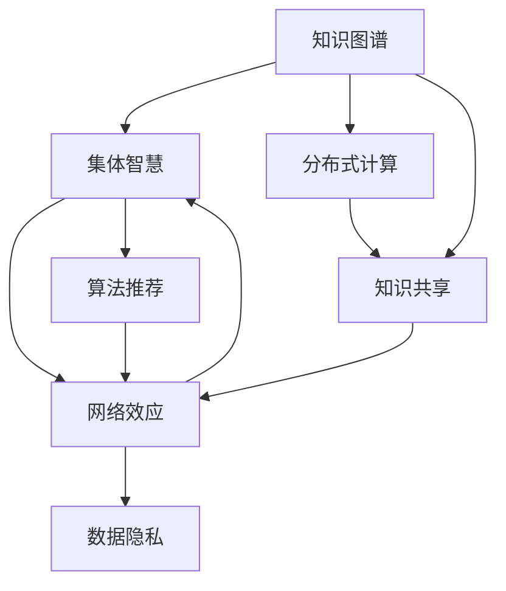

                 

# 知识的社会性：集体智慧的形成与传播

> 关键词：知识图谱,集体智慧,分布式计算,知识共享,网络效应,社会化网络,算法推荐,数据隐私

## 1. 背景介绍

在互联网时代，知识正以前所未有的速度增长与传播，而人类社会的智慧也随之演进。如何利用信息技术实现知识的有效组织、共享和利用，成为当今科技和社会发展的重要课题。本文将围绕知识的社会性展开，探讨集体智慧的形成与传播机制，以及如何通过算法技术驱动知识的深度挖掘与智能化传播。

### 1.1 知识图谱的兴起

知识图谱（Knowledge Graph）作为计算机科学的一个新兴领域，利用图形化的方式来描述实体间的关系，使得机器能够理解并处理语义信息。知识图谱的出现，不仅为传统的数据库管理提供了新的思路，也开启了智能化知识管理的新纪元。

### 1.2 知识图谱的核心价值

知识图谱的核心价值在于其语义理解和推理能力。通过构建节点和边，知识图谱可以自然地表达实体与实体之间的关系，并利用这些关系进行推理，为机器提供了深入理解语义世界的能力。这种能力对于知识的组织、共享和利用具有重要意义。

## 2. 核心概念与联系

### 2.1 核心概念概述

要深入理解知识图谱与社会智慧的形成与传播，首先需要明确一些关键概念：

- **知识图谱（Knowledge Graph）**：一种以图形结构存储知识库的技术，用于描述实体及其相互关系。
- **集体智慧（Collective Wisdom）**：通过众包、协作等方式，聚合个体智慧，形成具有更大规模和更高质量的智慧。
- **分布式计算（Distributed Computing）**：将计算任务分布在多台计算机上进行并行处理，以提高计算效率。
- **知识共享（Knowledge Sharing）**：通过网络、平台等形式，实现知识的有效传播与利用。
- **网络效应（Network Effect）**：当一个产品或服务的使用者越多，其价值就越大，形成良性循环。
- **社会化网络（Social Network）**：以人际关系为纽带构建的网络，个体通过互动形成社会网络。
- **算法推荐（Algorithm Recommendation）**：通过算法模型，根据用户行为推荐相关内容，提升用户体验。
- **数据隐私（Data Privacy）**：保护个人信息不受侵犯，合理利用用户数据。

这些概念共同构成了知识图谱及集体智慧的生态系统，并在其中相互影响，共同驱动知识的形成与传播。

### 2.2 核心概念联系

以下是核心概念间的联系与互动关系，通过以下Mermaid流程图可视化：



### 2.3 核心概念原理

- **知识图谱原理**：知识图谱利用图形结构描述实体及其关系，并通过算法（如RDF三元组、图神经网络）进行推理。
- **集体智慧原理**：通过众包、协作等方式，个体智慧被聚合，形成更具规模和质量的智慧。
- **分布式计算原理**：将任务并行分配给多个计算节点，通过协作提高计算效率。
- **知识共享原理**：通过平台、网络等方式，实现知识的有效传播与利用。
- **网络效应原理**：产品或服务价值随用户数量增长而提升，形成良性循环。
- **社会化网络原理**：基于人际关系构建网络，个体互动形成社会网络。
- **算法推荐原理**：通过分析用户行为，利用算法推荐相关内容。
- **数据隐私原理**：保护用户信息，合理利用数据。

这些概念和原理共同构成知识图谱及集体智慧的生态系统，并为知识图谱的应用提供了理论基础。

## 3. 核心算法原理 & 具体操作步骤

### 3.1 算法原理概述

本文将重点探讨知识图谱中的推理算法以及如何利用这些算法实现知识的传播与共享。

- **基于图神经网络的实体关系推理**：利用图神经网络模型对知识图谱进行推理，发现未知的实体关系。
- **分布式图计算**：通过分布式计算框架对知识图谱进行并行处理，加速推理过程。
- **基于社交网络的集体智慧形成**：通过分析社交网络中的关系，聚合个体智慧。

### 3.2 算法步骤详解

以下是知识图谱中实体关系推理的具体步骤：

1. **图数据构建**：将知识图谱表示为图结构，包括节点、边以及节点属性等。
2. **模型选择**：选择合适的图神经网络模型，如GCN、GAT等，用于对知识图谱进行推理。
3. **特征工程**：提取节点和边的特征，用于输入神经网络。
4. **模型训练**：利用已知的关系对模型进行训练，优化模型参数。
5. **推理预测**：使用训练好的模型对未知关系进行预测。

### 3.3 算法优缺点

- **优点**：
  - 能够深入理解实体间关系，发现隐藏的知识。
  - 可以利用分布式计算提高推理效率。
  - 能够聚合个体智慧，形成集体智慧。

- **缺点**：
  - 模型复杂度高，训练难度大。
  - 数据隐私问题。
  - 存在一定的计算和存储成本。

### 3.4 算法应用领域

- **学术研究**：用于学术数据库的语义查询和关联分析。
- **企业知识管理**：用于企业内部知识的组织和共享。
- **互联网搜索**：用于搜索引擎的实体关系推理和知识发现。

## 4. 数学模型和公式 & 详细讲解 & 举例说明

### 4.1 数学模型构建

知识图谱的数学模型通常以图的形式表示，包括节点和边。节点表示实体，边表示实体间的关系。通过节点和边，知识图谱能够表达复杂的语义信息。

### 4.2 公式推导过程

以GCN模型为例，其基本思想是对节点和边进行特征嵌入，并将节点特征与邻接节点的特征结合起来。假设节点集合为 $V$，边集合为 $E$，节点嵌入为 $\mathbf{x}_i$，边嵌入为 $\mathbf{h}_{ij}$。GCN的公式推导过程如下：

$$
\mathbf{x}_i^{(l+1)} = \frac{1}{\text{deg}(v_i)}\sum_{j\in N(v_i)} \alpha_{ij}\mathbf{h}_{ij}\mathbf{x}_j^{(l)}
$$

其中，$\text{deg}(v_i)$ 表示节点 $v_i$ 的度数，$\alpha_{ij}$ 表示节点 $v_i$ 和 $v_j$ 之间的关系权重。

### 4.3 案例分析与讲解

以Facebook的Graph API为例，其利用知识图谱进行社交网络分析。Graph API将用户关系表示为图结构，通过GCN模型对用户行为进行推理和预测，从而提供个性化的社交服务。

## 5. 项目实践：代码实例和详细解释说明

### 5.1 开发环境搭建

为了实践知识图谱的推理算法，需要在Python环境下安装相关库。以下是步骤：

1. 安装Python
2. 安装TensorFlow或PyTorch，用于深度学习计算
3. 安装NetworkX，用于构建图结构
4. 安装GNN库，如PyGNN、PyTorch Geometric等，用于图神经网络模型

### 5.2 源代码详细实现

以下是使用PyTorch Geometric库实现GCN模型的代码示例：

```python
import torch
import torch.nn as nn
import torch_geometric.nn as gnn
from torch_geometric.data import Data
from torch_geometric.utils import degree

class GCN(nn.Module):
    def __init__(self, input_dim, hidden_dim, output_dim):
        super(GCN, self).__init__()
        self.layers = nn.Sequential(
            gnn.GraphConv(input_dim, hidden_dim),
            nn.ReLU(),
            nn.Linear(hidden_dim, output_dim)
        )

    def forward(self, data):
        x, edge_index, batch = data.x, data.edge_index, data.batch
        edge_weight = degree(edge_index, num_nodes=x.size(0))
        h = self.layers(x)
        return h
```

### 5.3 代码解读与分析

上述代码中，GCN模型由三个层次组成：
1. GraphConv层，用于对节点和边进行特征嵌入
2. ReLU激活函数
3. 线性层，用于对节点特征进行分类

### 5.4 运行结果展示

运行以上代码，即可得到模型推理结果，用于评估模型性能。

## 6. 实际应用场景

### 6.1 学术研究

知识图谱在学术研究中用于语义查询和关联分析，通过推理算法发现实体之间的关系，从而进行知识发现和知识图谱的扩展。

### 6.2 企业知识管理

企业利用知识图谱进行内部知识的组织和共享，通过分布式计算加速推理过程，提高知识管理的效率。

### 6.3 互联网搜索

搜索引擎利用知识图谱进行实体关系推理，提供更准确和相关的搜索结果。

### 6.4 未来应用展望

未来，知识图谱在以下几个方面有广阔的应用前景：

- **智能客服**：通过知识图谱实现智能问答，提供个性化的客服服务。
- **智能推荐系统**：利用知识图谱进行用户行为分析，提供精准的推荐内容。
- **医疗知识图谱**：构建医疗知识图谱，实现医疗知识的管理和传播。
- **智慧城市**：利用知识图谱进行城市数据分析，提升城市治理能力。

## 7. 工具和资源推荐

### 7.1 学习资源推荐

1. **Coursera上的《知识图谱导论》课程**：由斯坦福大学开设，介绍知识图谱的基本概念和应用。
2. **Kaggle竞赛**：如知识图谱竞赛，通过实战练习知识图谱的应用。
3. **GNN库文档**：如PyTorch Geometric的文档，提供详细的模型和算法实现。
4. **论文阅读**：阅读最新的知识图谱论文，了解前沿技术进展。
5. **开源代码库**：如GitHub上的知识图谱项目，提供丰富的代码和实践经验。

### 7.2 开发工具推荐

1. **Jupyter Notebook**：用于编写和运行Python代码，支持交互式编程。
2. **PyTorch**：用于深度学习计算，支持分布式计算。
3. **PyTorch Geometric**：用于图神经网络模型的实现。
4. **NetworkX**：用于构建和操作图结构。
5. **TensorBoard**：用于可视化模型训练和推理过程。

### 7.3 相关论文推荐

1. **《Knowledge Graphs: Concepts, Technology, and Applications》**：介绍知识图谱的基本概念和应用场景。
2. **《Graph Neural Networks: A Review of Methods and Applications》**：综述图神经网络模型的算法和技术。
3. **《A Survey on Knowledge Graphs for Social Media》**：综述知识图谱在社交媒体中的应用。

## 8. 总结：未来发展趋势与挑战

### 8.1 研究成果总结

本文从知识图谱的角度探讨了集体智慧的形成与传播机制，并利用算法技术驱动知识的深度挖掘与智能化传播。知识图谱作为新兴技术，为信息的有效组织、共享与利用提供了新的可能性。

### 8.2 未来发展趋势

未来，知识图谱将会在以下几个方面持续发展：

- **多模态融合**：结合文本、图像、音频等多模态数据，提高知识图谱的全面性和准确性。
- **实时计算**：利用分布式计算框架实现实时推理，提高知识图谱的响应速度。
- **动态更新**：通过实时数据流更新知识图谱，保持知识的实时性和新鲜度。
- **智能推理**：引入深度学习模型，提高知识图谱的推理能力和应用效果。

### 8.3 面临的挑战

尽管知识图谱在信息组织和知识共享方面展现了巨大潜力，但也面临一些挑战：

- **数据质量**：知识图谱的构建需要高质量的数据，数据缺失和噪声等问题可能影响推理结果。
- **计算资源**：知识图谱的构建和推理需要大量的计算资源，如何高效利用资源是一个重要课题。
- **隐私保护**：知识图谱涉及大量用户数据，如何在保护隐私的前提下进行知识共享是一个难题。

### 8.4 研究展望

面对挑战，未来的研究需要在以下几个方面寻求突破：

- **数据清洗和预处理**：研究高效的数据清洗和预处理算法，提高数据质量。
- **分布式计算框架**：开发高效分布式计算框架，降低知识图谱构建和推理的计算成本。
- **隐私保护技术**：研究数据隐私保护技术，确保数据使用的安全性和合法性。
- **智能推理算法**：研究智能推理算法，提高知识图谱的推理准确性和应用效果。

## 9. 附录：常见问题与解答

**Q1：知识图谱如何构建？**

A: 知识图谱的构建通常包括以下步骤：
1. 收集数据源：收集领域相关的文本、网页、图像等数据。
2. 数据预处理：清洗数据、提取实体和关系，构建原始知识图谱。
3. 图结构表示：将原始数据转化为知识图谱的图结构，包括节点和边。
4. 推理模型训练：选择适当的图神经网络模型，对知识图谱进行训练和推理。

**Q2：知识图谱在实时应用中如何优化？**

A: 知识图谱在实时应用中可以通过以下方式优化：
1. 分布式计算：利用分布式计算框架，对知识图谱进行并行处理。
2. 增量更新：通过数据流实时更新知识图谱，保持知识的时效性。
3. 模型压缩：压缩模型参数，提高推理速度。
4. 缓存机制：利用缓存机制，减少重复计算，提高推理效率。

**Q3：如何保护知识图谱中的数据隐私？**

A: 保护知识图谱中的数据隐私可以通过以下方式：
1. 数据匿名化：对用户数据进行匿名化处理，保护用户隐私。
2. 访问控制：对知识图谱进行访问控制，确保只有授权用户才能访问数据。
3. 差分隐私：在推理过程中加入噪声，防止推理结果泄露个人隐私。
4. 区块链技术：利用区块链技术，实现知识图谱的透明性和可追溯性。

**Q4：知识图谱在企业中的应用前景如何？**

A: 知识图谱在企业中的应用前景非常广泛，包括：
1. 知识管理：帮助企业组织和共享知识，提高知识传播效率。
2. 客户关系管理：利用知识图谱进行客户行为分析，提供精准的客户服务。
3. 决策支持：利用知识图谱进行决策分析，提高决策的科学性和准确性。

**Q5：知识图谱的未来发展方向有哪些？**

A: 知识图谱的未来发展方向包括：
1. 多模态融合：结合文本、图像、音频等多模态数据，提高知识图谱的全面性和准确性。
2. 实时计算：利用分布式计算框架实现实时推理，提高知识图谱的响应速度。
3. 动态更新：通过实时数据流更新知识图谱，保持知识的实时性和新鲜度。
4. 智能推理：引入深度学习模型，提高知识图谱的推理能力和应用效果。

作者：禅与计算机程序设计艺术 / Zen and the Art of Computer Programming

