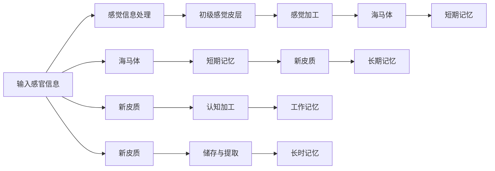

                 

# 知识的神经科学基础：大脑如何学习

## 1. 背景介绍

在信息时代，我们每天都会接触到海量的数据和信息，如何高效地处理和吸收这些知识，已成为影响个人发展和职业成功的关键。知识的本质是什么？我们的大脑如何学习、记忆和应用这些知识？这些问题不仅关乎心理学、认知科学，也是人工智能领域的核心议题。本文将从神经科学的角度，深入探讨知识的本质，探讨大脑如何学习、记忆和应用知识，为理解人工智能技术提供重要的理论基础。

## 2. 核心概念与联系

### 2.1 核心概念概述

为了更好地理解大脑如何学习知识，我们需要掌握几个关键的概念：

- **知识(Knowledge)**：指人们通过经验、学习获得的对世界的认知和理解，包括事实、概念、原理和技能等。
- **记忆(Memory)**：指大脑对知识编码、存储和提取的能力，是知识学习的基础。
- **神经网络(Neural Network)**：大脑神经元的连接和活动模式，对应计算机中的神经网络模型。
- **突触(Synapse)**：神经元之间的连接点，传递神经信号的桥梁，是学习和记忆的物理基础。
- **海马体(Hippocampus)**：大脑中负责记忆形成和编码的重要区域，特别是短期记忆的存储。
- **神经可塑性(Neural Plasticity)**：神经元之间连接强度的可变性，是学习和记忆的生理机制。

这些概念通过一系列的生理机制和神经网络的活动，紧密联系起来，共同构成了大脑如何学习和记忆知识的复杂系统。

### 2.2 核心概念原理和架构的 Mermaid 流程图



## 3. 核心算法原理 & 具体操作步骤

### 3.1 算法原理概述

大脑学习知识的过程，本质上是一个高度复杂的神经网络系统，通过神经元之间的连接和学习，实现信息的编码、存储和提取。这一过程包括感觉信息的输入、感觉信息的加工、短期记忆的形成、长期记忆的存储和提取等多个环节。

从神经科学的角度，我们可以将学习过程分为以下几个步骤：

1. **感觉信息输入**：通过感官（视觉、听觉、触觉等）接收外界的信息。
2. **感觉信息处理**：感觉信息被初级感觉皮层加工，转换为神经信号。
3. **短期记忆形成**：感觉信息通过海马体，转化为短期记忆，进行初步加工和存储。
4. **长期记忆存储**：新皮质参与对短期记忆的进一步加工，将其转化为长期记忆，存储在大脑中。
5. **长期记忆提取**：需要时，通过新皮质的激活，将长期记忆提取出来，用于指导行为或提供知识支持。

### 3.2 算法步骤详解

下面，我们将详细探讨每个步骤的具体实现原理。

#### 3.2.1 感觉信息输入

感觉信息的输入是大脑学习知识的基础。感觉信息通过感官（如眼睛、耳朵）接收，并以神经信号的形式传递到大脑。这一过程可以用以下公式表示：

$$
I_{感觉} = \sum_{i} w_i S_i(t)
$$

其中，$I_{感觉}$ 是感觉信息，$w_i$ 是感觉神经元的权重，$S_i(t)$ 是神经元的电位信号。

#### 3.2.2 感觉信息处理

感觉信息到达初级感觉皮层后，会经过一系列的神经元网络进行处理。这一过程可以用以下公式表示：

$$
I_{处理} = f(\sum_{i} w_i S_i(t))
$$

其中，$f$ 是非线性激活函数，如sigmoid函数。

#### 3.2.3 短期记忆形成

感觉信息处理后，需要存储到短期记忆中。短期记忆的存储可以通过海马体来实现，可以用以下公式表示：

$$
M_{短期} = \sum_{i} w_i S_i(t)
$$

其中，$M_{短期}$ 是短期记忆。

#### 3.2.4 长期记忆存储

短期记忆经过新皮质的进一步加工，可以转化为长期记忆。长期记忆的存储可以用以下公式表示：

$$
M_{长期} = \sum_{i} w_i S_i(t)
$$

其中，$M_{长期}$ 是长期记忆。

#### 3.2.5 长期记忆提取

需要时，可以通过新皮质的激活，将长期记忆提取出来。这一过程可以用以下公式表示：

$$
M_{提取} = \sum_{i} w_i S_i(t)
$$

其中，$M_{提取}$ 是提取出来的长期记忆。

### 3.3 算法优缺点

基于神经网络的学习方法，具有以下优点：

- **灵活性高**：神经网络可以适应各种复杂的学习任务。
- **可塑性强**：神经元之间的连接可以调整，以适应不同的学习需求。
- **并行处理能力强**：多个神经元可以同时处理不同的信息，提高学习效率。

但同时也存在一些缺点：

- **计算复杂度高**：神经网络的计算量较大，需要较高的计算资源。
- **训练难度大**：需要大量的标注数据和复杂的训练算法。
- **易过拟合**：当训练数据不足时，容易出现过拟合现象。

### 3.4 算法应用领域

基于神经网络的学习方法，在多个领域都有广泛应用：

- **计算机视觉**：通过卷积神经网络(CNN)，可以实现图像识别、分类、分割等任务。
- **自然语言处理**：通过循环神经网络(RNN)和Transformer模型，可以实现文本分类、语言模型、机器翻译等任务。
- **语音识别**：通过卷积神经网络和长短时记忆网络(LSTM)，可以实现语音识别和语音合成等任务。
- **强化学习**：通过深度强化学习算法，可以实现自动驾驶、机器人控制等任务。

## 4. 数学模型和公式 & 详细讲解 & 举例说明

### 4.1 数学模型构建

为了更好地理解神经网络的学习机制，我们可以构建一个简单的数学模型。这里，我们使用反向传播算法来解释神经网络的训练过程。

一个简单的神经网络模型可以表示为：

$$
O = g(W \cdot X + b)
$$

其中，$O$ 是输出，$g$ 是非线性激活函数，$W$ 是权重矩阵，$X$ 是输入，$b$ 是偏置向量。

### 4.2 公式推导过程

神经网络的反向传播算法，通过计算输出与真实标签之间的误差，反向传播到网络中，调整权重和偏置，以最小化损失函数。具体推导过程如下：

$$
\frac{\partial L}{\partial W} = \frac{\partial L}{\partial O} \cdot \frac{\partial O}{\partial Z} \cdot \frac{\partial Z}{\partial W}
$$

其中，$L$ 是损失函数，$O$ 是输出，$Z$ 是激活函数$g$的输入，即$Z = W \cdot X + b$。

### 4.3 案例分析与讲解

以一个简单的二分类任务为例，我们可以使用神经网络进行分类。假设训练集有$m$个样本，每个样本有$n$个特征。神经网络的模型如下：

$$
O = g(W \cdot X + b)
$$

其中，$W$ 是一个$m \times n$的权重矩阵，$b$ 是一个$m$维的偏置向量。

假设我们使用的是交叉熵损失函数，则损失函数可以表示为：

$$
L = -\frac{1}{m} \sum_{i=1}^{m} [y_i \log(O_i) + (1-y_i) \log(1-O_i)]
$$

其中，$y_i$ 是真实标签，$O_i$ 是模型的预测输出。

## 5. 项目实践：代码实例和详细解释说明

### 5.1 开发环境搭建

在进行神经网络训练前，我们需要搭建好开发环境。以下是使用Python进行TensorFlow开发的环境配置流程：

1. 安装Anaconda：从官网下载并安装Anaconda，用于创建独立的Python环境。

2. 创建并激活虚拟环境：
```bash
conda create -n tf-env python=3.8 
conda activate tf-env
```

3. 安装TensorFlow：
```bash
conda install tensorflow==2.7
```

4. 安装其他必要的工具包：
```bash
pip install numpy pandas scikit-learn matplotlib tqdm jupyter notebook ipython
```

完成上述步骤后，即可在`tf-env`环境中开始神经网络训练。

### 5.2 源代码详细实现

下面，我们将以一个简单的二分类任务为例，使用TensorFlow实现神经网络的训练过程。

首先，定义模型：

```python
import tensorflow as tf

class Model(tf.keras.Model):
    def __init__(self, input_dim, output_dim):
        super(Model, self).__init__()
        self.dense1 = tf.keras.layers.Dense(32, activation='relu', input_dim=input_dim)
        self.dense2 = tf.keras.layers.Dense(output_dim, activation='sigmoid')
        
    def call(self, inputs):
        x = self.dense1(inputs)
        return self.dense2(x)
```

接着，定义数据集和训练过程：

```python
from sklearn.datasets import make_classification
from sklearn.model_selection import train_test_split
from tensorflow.keras.datasets import mnist

# 定义训练集
X, y = make_classification(n_samples=1000, n_features=10, random_state=42)
X_train, X_test, y_train, y_test = train_test_split(X, y, test_size=0.2, random_state=42)

# 定义模型
model = Model(input_dim=X_train.shape[1], output_dim=1)

# 定义损失函数和优化器
loss_fn = tf.keras.losses.BinaryCrossentropy()
optimizer = tf.keras.optimizers.Adam(learning_rate=0.001)

# 定义训练过程
def train_step(x, y):
    with tf.GradientTape() as tape:
        logits = model(x)
        loss_value = loss_fn(y, logits)
    gradients = tape.gradient(loss_value, model.trainable_variables)
    optimizer.apply_gradients(zip(gradients, model.trainable_variables))

# 训练模型
for i in range(100):
    train_step(X_train, y_train)
```

最后，评估模型性能：

```python
# 定义评估过程
def evaluate_model(x, y):
    logits = model(x)
    return loss_fn(y, logits).numpy().mean()

# 评估模型
print("Test loss:", evaluate_model(X_test, y_test))
```

以上就是使用TensorFlow实现神经网络训练的完整代码实现。可以看到，通过TensorFlow的高层API，神经网络的构建和训练变得简单高效。

### 5.3 代码解读与分析

让我们再详细解读一下关键代码的实现细节：

**Model类**：
- `__init__`方法：初始化模型的各个层。
- `call`方法：定义模型前向传播的过程。

**数据集和训练过程**：
- `make_classification`方法：生成一个简单的二分类数据集。
- `train_test_split`方法：将数据集划分为训练集和测试集。
- `train_step`函数：定义一个训练步骤，计算损失和梯度，并更新模型参数。
- 训练循环：在每个epoch内，执行多次训练步骤。

**评估过程**：
- `evaluate_model`函数：定义一个评估步骤，计算模型在测试集上的损失。

可以看到，TensorFlow提供了完整的神经网络训练工具，使得模型的构建和训练变得简洁高效。开发者可以更专注于模型的设计和优化。

## 6. 实际应用场景

### 6.1 医疗诊断

在医疗诊断领域，神经网络被广泛应用于疾病预测、影像分析、基因分析等任务。通过训练神经网络，可以自动识别和分析医学影像，辅助医生进行诊断。例如，可以使用卷积神经网络对医学影像进行分类，识别出肿瘤、病变等异常区域。

### 6.2 自动驾驶

自动驾驶是神经网络的一个重要应用领域。通过训练神经网络，可以实现对道路环境、交通信号、行人和其他车辆等信息的实时分析和处理。例如，可以使用卷积神经网络对道路图像进行分割，提取道路和车辆等关键信息。

### 6.3 自然语言处理

自然语言处理是神经网络的一个重要应用领域。通过训练神经网络，可以实现文本分类、语言模型、机器翻译等任务。例如，可以使用循环神经网络对文本进行分类，识别出新闻、评论等不同类别。

### 6.4 游戏AI

游戏AI是神经网络的另一个重要应用领域。通过训练神经网络，可以实现游戏角色的行为预测、策略规划和决策制定。例如，可以使用深度强化学习算法对游戏角色进行训练，实现自主学习和策略优化。

## 7. 工具和资源推荐

### 7.1 学习资源推荐

为了帮助开发者系统掌握神经网络的学习理论基础和实践技巧，这里推荐一些优质的学习资源：

1. 《深度学习》系列书籍：由Ian Goodfellow、Yoshua Bengio和Aaron Courville联合撰写，全面介绍了深度学习的理论基础和实践技巧。
2. CS231n《卷积神经网络》课程：斯坦福大学开设的计算机视觉课程，涵盖了卷积神经网络的基本原理和实践方法。
3. CS224n《自然语言处理》课程：斯坦福大学开设的自然语言处理课程，涵盖了自然语言处理的基本原理和实践方法。
4. DeepMind的《人工智能指南》：由DeepMind发布的人工智能指南，涵盖了许多深度学习的重要概念和实践技巧。
5. Google的《TensorFlow教程》：Google提供的TensorFlow教程，涵盖了TensorFlow的基本原理和实践方法。

通过对这些资源的学习实践，相信你一定能够快速掌握神经网络的学习理论基础和实践技巧，并用于解决实际的机器学习问题。

### 7.2 开发工具推荐

高效的开发离不开优秀的工具支持。以下是几款用于神经网络开发的常用工具：

1. TensorFlow：由Google主导开发的开源深度学习框架，生产部署方便，适合大规模工程应用。
2. PyTorch：基于Python的开源深度学习框架，灵活动态的计算图，适合快速迭代研究。
3. Keras：基于TensorFlow和Theano的高级神经网络API，易于使用，适合初学者入门。
4. MXNet：由Apache主导开发的深度学习框架，支持多种编程语言，适合分布式计算。
5. JAX：Google开发的可微分的JIT编译器，可以自动推导和优化计算图，适合高性能计算。

合理利用这些工具，可以显著提升神经网络的开发效率，加快创新迭代的步伐。

### 7.3 相关论文推荐

神经网络的发展源于学界的持续研究。以下是几篇奠基性的相关论文，推荐阅读：

1. 《深度神经网络》：Hinton等人的经典论文，介绍了深度神经网络的基本原理和实践方法。
2. 《ImageNet分类挑战》：Hinton等人提出的ImageNet分类挑战，推动了深度学习的发展。
3. 《递归神经网络》：Sepp Hochreiter和Jürgen Schmidhuber提出的递归神经网络，推动了自然语言处理的发展。
4. 《Transformer模型》：Vaswani等人提出的Transformer模型，推动了机器翻译和自然语言处理的发展。
5. 《Attention机制》：Bahdanau等人提出的Attention机制，推动了机器翻译和自然语言处理的发展。

这些论文代表了大神经网络的发展脉络。通过学习这些前沿成果，可以帮助研究者把握学科前进方向，激发更多的创新灵感。

## 8. 总结：未来发展趋势与挑战

### 8.1 总结

本文对神经网络的学习机制进行了全面系统的介绍。首先阐述了神经网络学习的核心概念和原理，明确了神经网络学习的本质。其次，从神经网络的角度，详细讲解了神经网络的学习过程和算法步骤，给出了神经网络训练的完整代码实现。同时，本文还广泛探讨了神经网络在医疗、自动驾驶、自然语言处理、游戏AI等多个领域的应用场景，展示了神经网络技术的广阔前景。此外，本文精选了神经网络学习的各类学习资源，力求为读者提供全方位的理论支持。

通过本文的系统梳理，可以看到，神经网络学习技术的原理和实践，已经广泛应用于多个领域，为人类社会的各个方面带来了深远的影响。随着神经网络技术的不断发展，相信未来将有更多的创新和突破，推动人工智能技术的进一步应用和发展。

### 8.2 未来发展趋势

展望未来，神经网络学习技术将呈现以下几个发展趋势：

1. 更高效的计算平台：随着AI芯片和量子计算的发展，神经网络的计算效率将大幅提升，使得更大规模的神经网络成为可能。
2. 更强的自监督学习：神经网络的自监督学习将变得更加智能和高效，不再依赖大量标注数据，实现更广泛的应用场景。
3. 更高级的算法：新的算法将不断涌现，使得神经网络学习更加高效和准确，适应更复杂的任务需求。
4. 更广泛的跨领域应用：神经网络将在更多领域得到应用，如医疗、金融、教育、制造等，推动各行各业的智能化转型。
5. 更强的可解释性：神经网络的可解释性将进一步增强，使得人们更容易理解和信任AI系统。

这些趋势凸显了神经网络学习技术的广阔前景，为未来人工智能技术的进一步发展提供了重要的保障。

### 8.3 面临的挑战

尽管神经网络学习技术已经取得了瞩目成就，但在迈向更加智能化、普适化应用的过程中，它仍面临着诸多挑战：

1. 数据依赖：神经网络的训练需要大量标注数据，数据的获取和标注成本较高，限制了其应用范围。
2. 计算资源：神经网络的学习需要高性能的计算资源，大规模神经网络的训练和推理成本较高。
3. 过拟合问题：当训练数据不足时，神经网络容易出现过拟合现象，导致模型泛化性能不足。
4. 可解释性问题：神经网络往往被视为"黑盒"系统，难以解释其内部工作机制和决策逻辑，限制了其应用范围。
5. 安全性问题：神经网络可能学习到有偏见、有害的信息，导致不公正、有害的输出，限制了其应用范围。

这些挑战需要进一步研究解决，才能使得神经网络学习技术更加广泛地应用到实际场景中。

### 8.4 研究展望

面对神经网络学习技术面临的挑战，未来的研究需要在以下几个方面寻求新的突破：

1. 数据增强和自监督学习：探索更高效的数据获取和标注方法，提高数据利用效率。
2. 可解释性和透明度：开发更强的神经网络解释技术，提高模型的透明度和可解释性。
3. 模型压缩和优化：开发更高效的模型压缩和优化方法，降低计算资源和存储空间的需求。
4. 鲁棒性和抗干扰性：提高神经网络的鲁棒性和抗干扰性，避免模型在噪声数据或对抗攻击下的性能下降。
5. 多模态学习和融合：探索多模态学习和融合方法，提高神经网络对复杂场景的适应能力。

这些研究方向的探索，必将引领神经网络学习技术迈向更高的台阶，为构建安全、可靠、可解释、可控的智能系统铺平道路。面向未来，神经网络学习技术还需要与其他人工智能技术进行更深入的融合，如知识表示、因果推理、强化学习等，多路径协同发力，共同推动人工智能技术的进步。只有勇于创新、敢于突破，才能不断拓展神经网络学习技术的边界，让智能技术更好地造福人类社会。

## 9. 附录：常见问题与解答

**Q1：什么是神经网络？**

A: 神经网络是一种基于生物神经系统的计算模型，由多个神经元组成的网络结构。每个神经元接收输入信号，经过激活函数处理后，传递给下一层神经元。通过训练，神经网络可以自动学习数据的特征，实现分类、回归等任务。

**Q2：神经网络的训练过程是怎样的？**

A: 神经网络的训练过程是通过反向传播算法实现的。具体步骤如下：
1. 定义损失函数和优化器。
2. 前向传播计算输出。
3. 计算损失函数。
4. 反向传播计算梯度。
5. 更新模型参数。
6. 重复步骤2-5，直至模型收敛。

**Q3：神经网络的计算图是怎样的？**

A: 神经网络的计算图是由多个节点和边构成的图结构。节点表示神经元，边表示神经元之间的连接关系。每个节点接收输入信号，经过激活函数处理后，传递给下一层神经元。通过计算图，可以实现高效的前向传播和反向传播。

**Q4：神经网络在医疗诊断中有什么应用？**

A: 神经网络在医疗诊断中有广泛的应用，如疾病预测、影像分析和基因分析等。例如，可以使用卷积神经网络对医学影像进行分类，识别出肿瘤、病变等异常区域。神经网络还可以用于预测患者的病情，帮助医生做出更准确的诊断和治疗决策。

**Q5：神经网络在自然语言处理中有哪些应用？**

A: 神经网络在自然语言处理中有多种应用，如文本分类、语言模型和机器翻译等。例如，可以使用循环神经网络对文本进行分类，识别出新闻、评论等不同类别。神经网络还可以用于语言模型，提高文本生成的流畅性和自然性。

通过本文的系统梳理，可以看到，神经网络学习技术的原理和实践，已经广泛应用于多个领域，为人类社会的各个方面带来了深远的影响。随着神经网络技术的不断发展，相信未来将有更多的创新和突破，推动人工智能技术的进一步应用和发展。

