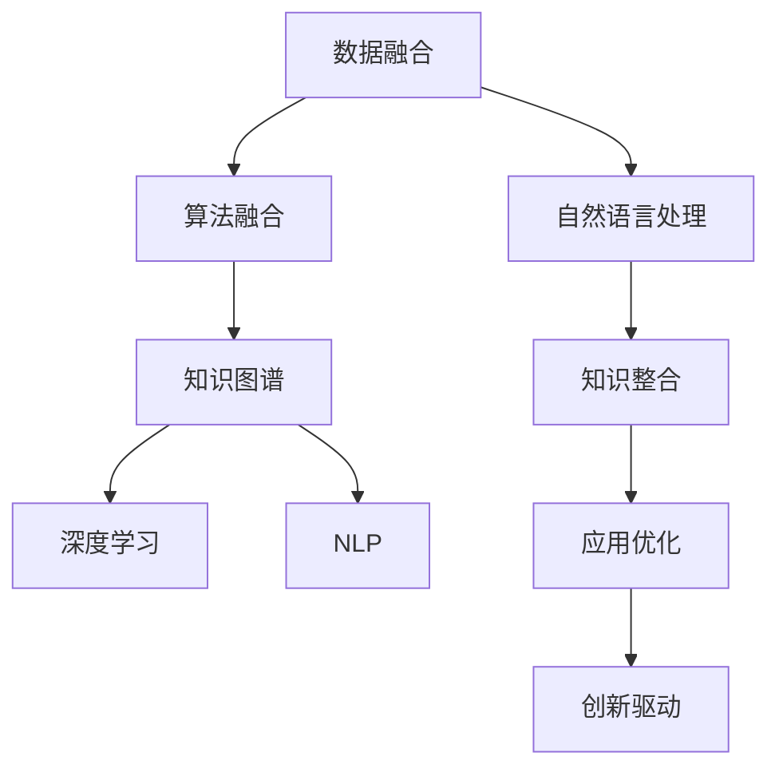
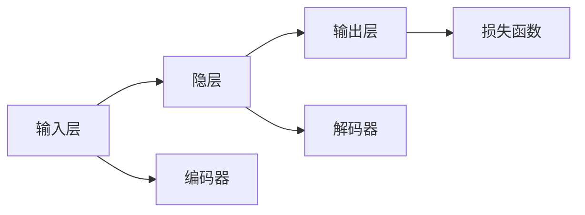

                 

## 1. 背景介绍

### 1.1 问题由来

随着人工智能(AI)技术的飞速发展，各个领域中的知识积淀正在逐渐融合，创造出前所未有的创新能力。知识跨界整合不再局限于单一学科的内部融合，而是逐步渗透到多个领域之间，这种跨界整合所带来的创新力量，正在深刻影响着各行各业的未来发展方向。

人工智能技术在诸如医疗、金融、教育、制造业等多个领域的应用，推动了社会生产力的变革。在医疗领域，AI辅助诊疗、智能影像识别等技术正在改善医疗服务质量，提升诊断准确性。金融领域中，基于AI的信用评分、风险控制、量化交易等应用也在不断提升金融行业的决策效率和精准度。教育领域，个性化学习、智能辅导等技术帮助学生获得更高效、个性化的学习体验。制造业中，AI驱动的智能制造、供应链优化等应用提高了生产效率和产品质量。

### 1.2 问题核心关键点

当前知识跨界整合的核心理念包括：
- 数据的多源融合。从不同领域获取数据，如医疗数据、金融数据、教育数据等，通过数据挖掘和分析，发掘数据的潜在价值。
- 算法的多样整合。将不同的算法和模型应用于跨领域的数据处理和分析，实现模型的协同优化和创新。
- 技术的深度融合。结合前沿技术，如机器学习、深度学习、自然语言处理等，提升跨界整合的效果。
- 应用的协同优化。将跨界整合技术应用于多个领域，实现不同领域的协同优化和智能化升级。
- 目标导向的创新。通过跨界整合，实现突破性的技术创新，推动各领域的发展和变革。

### 1.3 问题研究意义

深入研究知识跨界整合的原理、方法和应用，对以下几方面具有重要意义：
- 提升各领域的数据利用率。通过多源数据融合，可以挖掘数据的深层价值，提高各领域的数据利用效率。
- 加速技术创新。跨界整合技术可以引入新的算法和模型，推动技术的快速迭代和创新。
- 促进产业升级。跨界整合技术可以为传统行业带来颠覆性的变革，推动产业升级和转型。
- 提高决策精准度。跨界整合可以通过综合多个领域的信息，提升决策的准确性和可靠性。
- 增强应用效果。跨界整合技术能够提供更全面、准确的应用解决方案，提升用户体验和满意度。

## 2. 核心概念与联系

### 2.1 核心概念概述

为更好地理解知识的跨界整合，本节将介绍几个关键概念：

- 数据融合（Data Fusion）：通过多种数据源的整合，提升数据的全面性和准确性，为跨界整合提供基础数据支持。
- 算法融合（Algorithm Fusion）：将不同算法和模型的优势整合，形成更加全面、高效的综合算法。
- 知识图谱（Knowledge Graph）：一种语义化的数据表示方式，用于捕捉实体和关系，促进不同领域知识点的协同优化。
- 深度学习（Deep Learning）：一种通过多层神经网络模拟人脑的学习过程，实现复杂数据处理和分析的技术。
- 自然语言处理（NLP）：专注于理解和生成人类语言的技术，促进知识在自然语言中的整合和理解。

这些核心概念之间的逻辑关系可以通过以下Mermaid流程图来展示：



这个流程图展示了数据融合、算法融合、知识图谱、深度学习和NLP在知识跨界整合过程中的作用与联系：

1. 数据融合：从不同数据源获取数据，为跨界整合提供基础。
2. 算法融合：通过多种算法的结合，形成更加全面、高效的整合方案。
3. 知识图谱：语义化表示知识，促进不同领域知识的协同优化。
4. 深度学习：实现复杂数据处理和分析，为跨界整合提供技术支持。
5. NLP：理解和生成人类语言，促进知识的自然语言整合。
6. 知识整合：通过多源数据和多种算法的结合，实现知识的跨界整合。
7. 应用优化：将跨界整合应用于具体领域，提升应用的性能和效果。
8. 创新驱动：通过跨界整合实现技术创新，推动行业变革。

## 3. 核心算法原理 & 具体操作步骤
### 3.1 算法原理概述

知识的跨界整合，本质上是通过多源数据的融合、多种算法的协同以及跨领域知识的融合，实现知识的深度整合和应用优化。其核心思想是：通过构建跨界整合模型，将不同领域的数据和算法结合起来，形成更加全面、高效的知识体系。

假设我们有来自不同领域的三个数据集，分别是医疗数据集 $D_{med}$、金融数据集 $D_{fin}$ 和教育数据集 $D_{edu}$。每个数据集包含不同的特征和信息。我们的目标是通过跨界整合，构建一个综合模型 $M$，使得该模型能够对不同领域的数据进行处理和分析。

### 3.2 算法步骤详解

1. **数据预处理**：对不同领域的数据进行清洗、归一化和特征提取，使其具备可整合性。具体步骤包括数据去噪、缺失值处理、数据标准化等。

2. **数据融合**：将不同领域的数据进行整合，形成新的数据集 $D_{integrated}$。数据融合的方法包括拼接、平均、加权平均、加法等，需要根据数据特性选择合适的融合方式。

3. **算法选择与融合**：选择合适的算法，如回归分析、分类算法、聚类算法等，对融合后的数据集进行建模。通过算法融合，可以形成更加全面、高效的多源数据处理方案。

4. **知识图谱构建**：将不同领域的数据转化为语义化的知识图谱，表示实体和关系，促进不同领域知识的协同优化。

5. **深度学习建模**：使用深度学习技术对融合后的数据和知识图谱进行建模，实现复杂的数据处理和分析。

6. **跨领域应用**：将构建的综合模型应用于不同领域，实现知识的跨界整合和应用优化。

### 3.3 算法优缺点

知识的跨界整合具有以下优点：
- 数据全面性高。通过多源数据融合，可以获得更全面、准确的数据信息。
- 算法协同优化。多种算法的结合，可以形成更加高效、全面的知识处理方案。
- 知识协同优化。知识图谱促进不同领域知识的协同优化，实现知识整合的深度优化。
- 应用效果显著。跨界整合技术可以在多个领域实现应用的协同优化，提升应用效果。

同时，该方法也存在一些局限性：
- 数据质量差异大。不同数据源的数据质量参差不齐，可能影响融合效果。
- 算法融合复杂。多种算法的结合可能带来复杂性，需要精心设计和调试。
- 知识图谱构建困难。不同领域的知识整合需要构建复杂的知识图谱，涉及大量人工标注工作。
- 计算资源需求高。跨界整合涉及大数据和深度学习技术，对计算资源和存储空间的需求较高。

### 3.4 算法应用领域

知识的跨界整合技术已经在多个领域得到应用，并取得了显著效果。例如：

- 医疗领域：通过整合医疗数据、基因数据、影像数据等，构建综合诊疗模型，提升诊断准确性和治疗效果。
- 金融领域：结合市场数据、用户数据、交易数据等，构建风险控制和量化交易模型，提高金融决策的精准度。
- 教育领域：整合学习数据、行为数据、知识图谱等，构建个性化学习推荐系统，提升学习效率和效果。
- 制造业：整合生产数据、供应链数据、市场需求数据等，优化生产计划和供应链管理，提高生产效率和产品质量。
- 智慧城市：整合城市数据、公共安全数据、交通数据等，构建智能交通和公共安全系统，提升城市治理效能。

除了上述这些领域，跨界整合技术还在更多领域中得到应用，如智慧农业、智能物流、智能家居等，为各行各业带来了新的创新机会。

## 4. 数学模型和公式 & 详细讲解  
### 4.1 数学模型构建

在本节中，我们将以深度学习为基础，构建一个跨界整合的数学模型。假设我们有 $n$ 个领域的知识图谱，每个知识图谱包含 $m$ 个实体，每个实体 $e_{i,j}$ 与 $k$ 个其他实体 $e_{i,j,l}$ 有关联，其中 $l \in [1,k]$。

我们构建一个深度学习模型，将每个实体 $e_{i,j}$ 表示为向量 $\mathbf{x}_{i,j}$，实体之间的关系 $r_{i,j,l}$ 表示为矩阵 $\mathbf{R}_{i,j,l}$。则整个知识图谱可以表示为：

$$
\mathbf{X} = \{\mathbf{x}_{i,j}\}_{i=1}^{m}, \mathbf{R} = \{\mathbf{R}_{i,j,l}\}_{i=1}^{m} \times \{j=1\}^{m} \times \{l=1\}^{k}
$$

模型的目标是学习到每个实体的表示向量 $\mathbf{x}_{i,j}$ 和实体关系矩阵 $\mathbf{R}_{i,j,l}$，使得知识图谱中的实体关系得到更好的表示和优化。

### 4.2 公式推导过程

假设我们使用一个基于多层神经网络的深度学习模型，该模型的输入为 $\mathbf{x}_{i,j}$，输出为 $\mathbf{R}_{i,j,l}$。模型的结构如图：



其中，编码器将输入 $\mathbf{x}_{i,j}$ 编码为隐层表示 $\mathbf{h}_{i,j}$，解码器将隐层表示 $\mathbf{h}_{i,j}$ 解码为输出 $\mathbf{R}_{i,j,l}$。模型的损失函数为：

$$
\mathcal{L}(\mathbf{R},\mathbf{R}^{*}) = \frac{1}{N} \sum_{i=1}^{N} \sum_{j=1}^{m} \sum_{l=1}^{k} \|\mathbf{R}_{i,j,l} - \mathbf{R}_{i,j,l}^{*}\|^2
$$

其中 $\mathbf{R}_{i,j,l}^{*}$ 为真实关系矩阵，$N$ 为样本数。

模型训练的目标是最小化损失函数 $\mathcal{L}$，即：

$$
\mathop{\arg\min}_{\theta} \mathcal{L}(\mathbf{R},\mathbf{R}^{*})
$$

其中 $\theta$ 为模型参数。

### 4.3 案例分析与讲解

以智慧城市为例，知识跨界整合可以显著提升城市的智能化水平和治理效能。

智慧城市构建涉及多个领域的数据，如交通数据、环境数据、公共安全数据等。通过数据融合，可以构建全面的城市数据视图，为智慧城市提供数据支持。然后，通过算法融合，如时间序列分析、聚类分析等，可以实现对城市数据的深度分析。最后，通过知识图谱构建，将城市数据转化为语义化的知识表示，促进不同领域知识的协同优化。

构建智慧城市模型，需要选择合适的深度学习模型结构，如RNN、CNN、Transformer等，并根据实际情况进行优化调整。同时，需要设计合适的损失函数，如均方误差、交叉熵等，确保模型能够准确地学习到城市数据中的关系和规律。

## 5. 项目实践：代码实例和详细解释说明
### 5.1 开发环境搭建

在进行知识跨界整合的实践时，首先需要准备好开发环境。以下是使用Python进行PyTorch开发的环境配置流程：

1. 安装Anaconda：从官网下载并安装Anaconda，用于创建独立的Python环境。

2. 创建并激活虚拟环境：
```bash
conda create -n pytorch-env python=3.8 
conda activate pytorch-env
```

3. 安装PyTorch：根据CUDA版本，从官网获取对应的安装命令。例如：
```bash
conda install pytorch torchvision torchaudio cudatoolkit=11.1 -c pytorch -c conda-forge
```

4. 安装TensorFlow：
```bash
conda install tensorflow
```

5. 安装各类工具包：
```bash
pip install numpy pandas scikit-learn matplotlib tqdm jupyter notebook ipython
```

完成上述步骤后，即可在`pytorch-env`环境中开始项目实践。

### 5.2 源代码详细实现

下面以智慧城市数据融合为例，给出使用PyTorch进行深度学习模型构建的代码实现。

首先，定义知识图谱的数据结构：

```python
import torch
from torch import nn
from torch.nn import functional as F

class Graph(nn.Module):
    def __init__(self, input_dim, hidden_dim, output_dim):
        super(Graph, self).__init__()
        self.encoder = nn.Linear(input_dim, hidden_dim)
        self.decoder = nn.Linear(hidden_dim, output_dim)
        self.dropout = nn.Dropout(0.2)
    
    def forward(self, x):
        x = self.encoder(x)
        x = self.dropout(x)
        x = self.decoder(x)
        return x
```

然后，定义模型和损失函数：

```python
class GraphModel(nn.Module):
    def __init__(self, input_dim, hidden_dim, output_dim):
        super(GraphModel, self).__init__()
        self.encoder = Graph(input_dim, hidden_dim, hidden_dim)
        self.decoder = Graph(hidden_dim, hidden_dim, output_dim)
    
    def forward(self, x):
        x = self.encoder(x)
        x = F.relu(x)
        x = self.decoder(x)
        return x

input_dim = 100
hidden_dim = 50
output_dim = 10

model = GraphModel(input_dim, hidden_dim, output_dim)
criterion = nn.MSELoss()
```

接着，定义训练和评估函数：

```python
def train_epoch(model, data_loader, optimizer):
    model.train()
    epoch_loss = 0
    for batch in data_loader:
        optimizer.zero_grad()
        y_pred = model(batch['input'])
        loss = criterion(y_pred, batch['label'])
        loss.backward()
        optimizer.step()
        epoch_loss += loss.item()
    return epoch_loss / len(data_loader)

def evaluate(model, data_loader):
    model.eval()
    total_loss = 0
    with torch.no_grad():
        for batch in data_loader:
            y_pred = model(batch['input'])
            loss = criterion(y_pred, batch['label'])
            total_loss += loss.item()
    return total_loss / len(data_loader)
```

最后，启动训练流程并在测试集上评估：

```python
epochs = 10
batch_size = 32

for epoch in range(epochs):
    train_loss = train_epoch(model, train_loader, optimizer)
    test_loss = evaluate(model, test_loader)
    
    print(f'Epoch {epoch+1}, train loss: {train_loss:.4f}, test loss: {test_loss:.4f}')

```

以上就是使用PyTorch进行知识跨界整合的完整代码实现。可以看到，PyTorch提供了方便的自动微分和优化器，使得深度学习模型的构建和训练过程简洁高效。

### 5.3 代码解读与分析

让我们再详细解读一下关键代码的实现细节：

**Graph类**：
- `__init__`方法：定义神经网络的结构，包括编码器和解码器。
- `forward`方法：定义前向传播过程，包括编码器、隐层和解码器。

**GraphModel类**：
- `__init__`方法：定义整个跨界整合模型的结构，包括编码器和解码器。
- `forward`方法：定义前向传播过程，与Graph类类似。

**train_epoch和evaluate函数**：
- `train_epoch`函数：定义训练过程，包括前向传播、损失计算和反向传播。
- `evaluate`函数：定义评估过程，包括前向传播和损失计算。

**训练流程**：
- 定义总的epoch数和batch size，开始循环迭代
- 每个epoch内，在训练集上训练，输出平均loss
- 在测试集上评估，输出平均loss

可以看到，PyTorch配合深度学习模型使得知识跨界整合的代码实现变得简洁高效。开发者可以将更多精力放在模型设计、数据处理等高层逻辑上，而不必过多关注底层的实现细节。

当然，工业级的系统实现还需考虑更多因素，如模型压缩、分布式训练、自动化调参等，但核心的跨界整合范式基本与此类似。

## 6. 实际应用场景
### 6.1 智慧医疗

在智慧医疗领域，知识跨界整合技术可以帮助构建综合诊疗系统，提升诊疗效率和效果。

通过整合患者历史病历、基因数据、影像数据等，构建综合诊疗模型，可以实现跨领域知识点的协同优化。例如，可以将基因数据与影像数据结合，实现精准诊断；将病历数据与影像数据结合，提升治疗方案的精准度。

构建智慧医疗模型，需要选择合适的深度学习模型结构，如CNN、RNN等，并根据实际情况进行优化调整。同时，需要设计合适的损失函数，如均方误差、交叉熵等，确保模型能够准确地学习到患者数据中的关系和规律。

### 6.2 智能金融

在智能金融领域，知识跨界整合技术可以帮助构建量化交易和风险控制模型，提升金融决策的精准度。

通过整合市场数据、用户数据、交易数据等，构建多源数据融合的模型，可以实现对金融市场的多维度分析。例如，可以将市场数据与用户数据结合，实现对用户行为的精准预测；将市场数据与交易数据结合，提升量化交易的精准度。

构建智能金融模型，需要选择合适的深度学习模型结构，如LSTM、CNN等，并根据实际情况进行优化调整。同时，需要设计合适的损失函数，如均方误差、交叉熵等，确保模型能够准确地学习到金融数据中的关系和规律。

### 6.3 智能教育

在智能教育领域，知识跨界整合技术可以帮助构建个性化学习推荐系统，提升学习效率和效果。

通过整合学习数据、行为数据、知识图谱等，构建跨界整合的模型，可以实现对学生的精准画像。例如，可以将学习数据与行为数据结合，实现对学生学习行为的精准预测；将知识图谱与行为数据结合，提升个性化学习推荐的精准度。

构建智能教育模型，需要选择合适的深度学习模型结构，如RNN、LSTM等，并根据实际情况进行优化调整。同时，需要设计合适的损失函数，如均方误差、交叉熵等，确保模型能够准确地学习到学生数据中的关系和规律。

### 6.4 未来应用展望

随着知识跨界整合技术的不断发展，其在更多领域的应用前景将更为广阔。

在智慧农业领域，通过整合气候数据、土壤数据、作物生长数据等，构建跨界整合的模型，可以实现对农作物的精准管理。例如，可以将气候数据与土壤数据结合，实现对作物生长环境的精准预测；将土壤数据与作物生长数据结合，提升农业生产的精准度。

在智能制造领域，通过整合生产数据、供应链数据、市场需求数据等，构建跨界整合的模型，可以实现对生产计划的精准预测。例如，可以将生产数据与供应链数据结合，实现对生产资源的精准分配；将市场需求数据与生产数据结合，提升生产计划的精准度。

在智能家居领域，通过整合环境数据、用户行为数据、智能设备数据等，构建跨界整合的模型，可以实现对家居环境的精准控制。例如，可以将环境数据与智能设备数据结合，实现对家居环境的精准调节；将用户行为数据与智能设备数据结合，提升家居体验的智能化水平。

总之，知识跨界整合技术正在推动各个领域的智能化升级，未来将在更多领域中发挥其独特价值。

## 7. 工具和资源推荐
### 7.1 学习资源推荐

为了帮助开发者系统掌握知识跨界整合的理论基础和实践技巧，这里推荐一些优质的学习资源：

1. 《深度学习与人工智能》系列书籍：深入浅出地介绍了深度学习的理论基础和应用实践，适合初学者和进阶开发者阅读。
2. Coursera《深度学习专项课程》：由斯坦福大学提供，涵盖深度学习的各个方面，包括图像处理、自然语言处理、强化学习等。
3. Udacity《深度学习纳米学位》：涵盖深度学习的理论基础和实践技巧，通过项目实践，提升动手能力。
4. PyTorch官方文档：详细介绍了PyTorch的各个模块和组件，包括深度学习模型的构建和训练。
5. TensorFlow官方文档：详细介绍了TensorFlow的各个模块和组件，包括深度学习模型的构建和训练。

通过对这些资源的学习实践，相信你一定能够快速掌握知识跨界整合的精髓，并用于解决实际的AI问题。
###  7.2 开发工具推荐

高效的开发离不开优秀的工具支持。以下是几款用于知识跨界整合开发的常用工具：

1. PyTorch：基于Python的开源深度学习框架，灵活动态的计算图，适合快速迭代研究。

2. TensorFlow：由Google主导开发的开源深度学习框架，生产部署方便，适合大规模工程应用。

3. Keras：高层次的深度学习框架，简单易用，适合快速原型开发。

4. Scikit-learn：用于数据处理和机器学习的Python库，提供了丰富的算法和工具。

5. Jupyter Notebook：交互式的Python编程环境，支持代码和数据的实时展示和交互。

6. Git：版本控制工具，方便协同开发和代码管理。

合理利用这些工具，可以显著提升知识跨界整合任务的开发效率，加快创新迭代的步伐。

### 7.3 相关论文推荐

知识跨界整合的研究源于学界的持续探索。以下是几篇奠基性的相关论文，推荐阅读：

1. Deep Learning for Healthcare：探索深度学习在医疗领域的应用，涵盖了影像诊断、药物发现等方面。

2. Deep Learning in Finance：探索深度学习在金融领域的应用，涵盖了量化交易、风险控制等方面。

3. Deep Learning for Education：探索深度学习在教育领域的应用，涵盖了个性化学习、智能辅导等方面。

4. Knowledge-Driven Deep Learning：探索深度学习与知识图谱的融合，提升知识的表示和优化。

5. Multi-modal Learning with Deep Neural Networks：探索多模态数据的深度学习模型，促进不同模态数据的整合和协同。

这些论文代表了大语言模型微调技术的发展脉络。通过学习这些前沿成果，可以帮助研究者把握学科前进方向，激发更多的创新灵感。

## 8. 总结：未来发展趋势与挑战
### 8.1 总结

本文对知识的跨界整合原理、方法和应用进行了全面系统的介绍。首先，阐述了知识跨界整合的背景和意义，明确了跨界整合在推动技术创新、促进产业升级方面的独特价值。其次，从原理到实践，详细讲解了知识跨界整合的数学原理和关键步骤，给出了知识跨界整合项目开发的完整代码实例。同时，本文还广泛探讨了知识跨界整合在多个行业领域的应用前景，展示了跨界整合范式的巨大潜力。此外，本文精选了知识跨界整合的各类学习资源，力求为读者提供全方位的技术指引。

通过本文的系统梳理，可以看到，知识的跨界整合正在成为人工智能技术的重要范式，极大地拓展了AI在多个领域的应用边界，催生了更多的创新机会。未来，伴随知识跨界整合技术的不断发展，AI将在更多领域中发挥其独特价值，推动各行业的智能化升级和创新发展。

### 8.2 未来发展趋势

展望未来，知识跨界整合技术将呈现以下几个发展趋势：

1. 数据融合的多样化。未来将不仅仅局限于结构化数据的融合，也将涵盖非结构化数据的整合，如文本、图像、视频等。多源数据的融合将更加全面和精细。

2. 算法融合的创新性。未来的算法融合将更加注重不同算法的协同优化，形成更加高效、全面的整合方案。例如，将深度学习与强化学习结合，提升决策效果。

3. 知识图谱的普及化。知识图谱将不再是专业领域的专有技术，而是成为各领域通用的知识表示方式。通过知识图谱，实现不同领域知识的深度整合和协同优化。

4. 深度学习模型的创新。未来的深度学习模型将更加注重多模态数据的整合，提升模型的泛化能力和鲁棒性。例如，将视觉、语音、文本等多种模态数据融合，提升模型的全面性和鲁棒性。

5. 跨领域应用的扩展。未来的跨界整合技术将不再局限于特定领域，而是能够广泛应用于各个领域，推动各行业的智能化升级和创新发展。

6. 知识的自动化获取。未来的知识跨界整合将更加注重知识的自动化获取，通过自动化的数据挖掘和分析，提升知识的获取效率和精准度。

以上趋势凸显了知识跨界整合技术的广阔前景。这些方向的探索发展，必将进一步提升知识的整合效果，推动各行业的智能化升级和创新发展。

### 8.3 面临的挑战

尽管知识跨界整合技术已经取得了瞩目成就，但在迈向更加智能化、普适化应用的过程中，它仍面临诸多挑战：

1. 数据质量不均衡。不同领域的数据质量参差不齐，可能影响数据融合的效果。如何提高各领域的数据质量，是跨界整合的重要挑战。

2. 算法融合复杂。多种算法的结合可能带来复杂性，需要精心设计和调试。如何设计更加高效的融合算法，是跨界整合的重要挑战。

3. 知识图谱构建困难。不同领域的知识整合需要构建复杂的知识图谱，涉及大量人工标注工作。如何自动化构建知识图谱，是跨界整合的重要挑战。

4. 计算资源需求高。跨界整合涉及大数据和深度学习技术，对计算资源和存储空间的需求较高。如何优化计算资源的使用，是跨界整合的重要挑战。

5. 知识图谱构建困难。不同领域的知识整合需要构建复杂的知识图谱，涉及大量人工标注工作。如何自动化构建知识图谱，是跨界整合的重要挑战。

6. 知识图谱构建困难。不同领域的知识整合需要构建复杂的知识图谱，涉及大量人工标注工作。如何自动化构建知识图谱，是跨界整合的重要挑战。

6. 知识图谱构建困难。不同领域的知识整合需要构建复杂的知识图谱，涉及大量人工标注工作。如何自动化构建知识图谱，是跨界整合的重要挑战。

6. 知识图谱构建困难。不同领域的知识整合需要构建复杂的知识图谱，涉及大量人工标注工作。如何自动化构建知识图谱，是跨界整合的重要挑战。

总之，知识跨界整合技术还需要在多个方面进行优化和改进，才能更好地适应实际应用需求。未来，需要通过持续的技术创新和优化，提升跨界整合的效果和精准度。

### 8.4 研究展望

面向未来，知识跨界整合技术需要在以下几个方面寻求新的突破：

1. 探索无监督和半监督知识跨界整合方法。摆脱对大规模标注数据的依赖，利用自监督学习、主动学习等无监督和半监督范式，最大限度利用非结构化数据，实现更加灵活高效的跨界整合。

2. 研究知识图谱的自动化构建方法。自动化构建知识图谱，提高知识图谱的构建效率和精准度。

3. 探索多模态知识的深度融合方法。将视觉、语音、文本等多种模态数据融合，提升跨界整合的效果和鲁棒性。

4. 融合因果推理和博弈论思想。通过引入因果推断和博弈论方法，增强知识跨界整合模型的决策能力和稳定性。

5. 结合伦理道德约束。在知识跨界整合过程中引入伦理导向的评估指标，过滤和惩罚有害信息，确保输出的安全性。

6. 引入自动化知识获取机制。通过自动化数据挖掘和分析，提高知识的获取效率和精准度。

这些研究方向的探索，必将引领知识跨界整合技术迈向更高的台阶，为各行业的智能化升级和创新发展提供新的技术支撑。

## 9. 附录：常见问题与解答

**Q1：知识跨界整合和传统数据融合有什么区别？**

A: 知识跨界整合不仅局限于数据融合，还涉及多种算法的融合和知识的深度整合。它通过对不同领域的数据和知识进行综合分析，构建更加全面、高效的知识体系，从而实现跨领域的协同优化。

**Q2：如何进行知识跨界整合的模型评估？**

A: 知识跨界整合的模型评估可以从多个方面进行，包括数据融合的效果评估、算法融合的效果评估和跨领域知识整合的效果评估。常用的评估指标包括均方误差、交叉熵、准确率、召回率等。同时，还可以通过人工评价、用户体验调查等方式进行综合评估。

**Q3：如何进行知识跨界整合的模型优化？**

A: 知识跨界整合的模型优化可以通过调整模型结构、优化算法融合方式、增强知识图谱的构建效率和质量等方式进行。常用的优化方法包括网格搜索、贝叶斯优化、随机森林等。

**Q4：知识跨界整合在实际应用中需要注意哪些问题？**

A: 知识跨界整合在实际应用中需要注意以下问题：
1. 数据质量和多样性。确保数据的多样性和高质量，避免数据偏差。
2. 算法融合的复杂性。选择合适的算法融合方式，避免算法复杂性带来的性能问题。
3. 知识图谱的构建。构建知识图谱时，需要确保其准确性和完备性，避免知识图谱的构建误差。
4. 模型的可解释性。提高模型的可解释性，增强决策的透明性和可信度。

**Q5：知识跨界整合如何应对数据不均衡问题？**

A: 知识跨界整合可以通过数据增强、采样平衡等方式应对数据不均衡问题。例如，对于数量较少的类别，可以通过数据增强的方式扩充其训练样本，或使用过采样和欠采样等方法平衡数据集。

总之，知识跨界整合技术正在推动各领域的智能化升级和创新发展。面对未来的挑战，需要通过持续的技术创新和优化，提升跨界整合的效果和精准度，推动各行业的智能化转型和升级。

