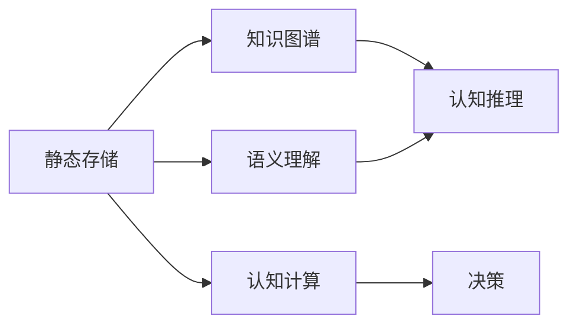

                 

# 知识的进化：从静态存储到动态生成

> 关键词：知识图谱, 动态生成, 语义理解, 深度学习, 自然语言处理(NLP), 认知推理, 认知计算

## 1. 背景介绍

### 1.1 问题由来

在信息爆炸的时代，人类产生的数据以指数级增长，如何有效存储、管理和利用这些数据成为了一个重大挑战。静态存储系统（如传统关系数据库、文档存储系统）在处理结构化或半结构化数据时表现出色，但对于非结构化数据和语义信息，其能力和效率均显不足。

随着深度学习技术和大规模语料的发展，知识图谱和语义理解技术应运而生，它们通过动态生成语义信息，为传统存储系统提供了补充和替代的可能。本博文将深入探讨从静态存储到动态生成的知识演进过程，揭示其在自然语言处理（NLP）、认知推理、认知计算等领域的创新潜力。

### 1.2 问题核心关键点

为了更好地理解从静态存储到动态生成的知识演进过程，本节将介绍几个关键概念：

- 静态存储：传统关系型数据库、文档存储系统等，以结构化或半结构化方式存储数据，依赖事先定义的Schema。
- 动态生成：基于深度学习、知识图谱、语义理解技术，通过生成模型动态推断和构建语义信息，支持非结构化数据和语义数据的灵活处理。
- 知识图谱：一种用于表示实体、关系、属性等的语义网络，构建了实体间的逻辑关系，有助于认知推理和信息检索。
- 语义理解：通过对自然语言进行语义分析，获取语义表示和语义关联，提升信息检索和知识推理的准确性。
- 认知推理：基于知识图谱和语义理解，构建推理模型，实现复杂问题的解决。
- 认知计算：模拟人类认知过程，使用计算模型进行知识获取、推理、规划和决策，支持智能化应用。

这些概念之间的逻辑关系可以通过以下Mermaid流程图来展示：



这个流程图展示了几大关键概念之间的关联：

1. 静态存储是传统数据存储方式，是知识图谱、语义理解和认知推理的基础。
2. 知识图谱和语义理解通过动态生成语义信息，补充静态存储系统的不足。
3. 认知推理利用知识图谱和语义理解，解决复杂问题。
4. 认知计算进一步模拟人类认知过程，进行智能化决策。

这些概念共同构成了从静态存储到动态生成的知识演进框架，推动了人工智能在各个领域的应用。

## 2. 核心概念与联系

### 2.1 核心概念概述

为更好地理解从静态存储到动态生成的知识演进过程，本节将介绍几个核心概念：

- 静态存储系统：以结构化或半结构化方式存储数据，依赖事先定义的Schema。
- 知识图谱：构建实体间逻辑关系，支持语义推理和信息检索。
- 语义理解：通过自然语言处理技术，获取语义表示和语义关联。
- 认知推理：基于知识图谱和语义理解，构建推理模型，解决复杂问题。
- 认知计算：模拟人类认知过程，使用计算模型进行智能化决策。

这些概念之间通过以下逻辑链条紧密联系：

1. 静态存储系统提供数据基础，但无法表达语义关系。
2. 知识图谱通过实体间关系，引入语义信息。
3. 语义理解技术将自然语言映射为语义表示，增强信息检索和推理能力。
4. 认知推理结合知识图谱和语义理解，解决复杂问题。
5. 认知计算将推理结果转化为智能化决策，推动智能应用落地。

### 2.2 核心概念原理和架构的 Mermaid 流程图


## 3. 核心算法原理 & 具体操作步骤
### 3.1 算法原理概述

从静态存储到动态生成的知识演进过程，主要通过知识图谱和语义理解技术实现。其核心思想是：

1. **知识图谱**：通过构建实体、属性、关系的语义网络，表达和推理语义信息。
2. **语义理解**：利用深度学习技术，将自然语言映射为语义表示，抽取关键信息。
3. **认知推理**：结合知识图谱和语义理解，构建推理模型，解决复杂问题。
4. **认知计算**：将推理结果转化为智能化决策，推动智能应用落地。

这些步骤通过深度学习、知识图谱、语义理解、认知推理、认知计算等技术，形成了一个完整的知识演进框架。

### 3.2 算法步骤详解

基于上述框架，知识演进过程的主要步骤如下：

1. **知识图谱构建**：
    - 数据采集：收集结构化、半结构化或非结构化数据。
    - 实体抽取：使用NLP技术抽取实体和属性。
    - 关系抽取：识别实体间的关系。
    - 图谱构建：使用图数据库或分布式存储技术，构建知识图谱。

2. **语义理解**：
    - 文本预处理：进行文本清洗、分词、实体识别等。
    - 词向量嵌入：使用Word2Vec、GloVe等技术，将词汇映射为向量。
    - 语义表示：使用Transformer、BERT等模型，将文本映射为语义表示。
    - 语义关联：使用注意力机制，识别和提取关键信息。

3. **认知推理**：
    - 推理引擎：设计推理算法，解决复杂问题。
    - 规则库：构建推理规则，增强推理准确性。
    - 模型训练：使用知识图谱和语义表示进行训练，优化推理模型。
    - 推理执行：将新数据输入推理模型，获取推理结果。

4. **认知计算**：
    - 决策模型：设计决策模型，进行智能化决策。
    - 行为模拟：模拟人类决策过程，生成智能化行为。
    - 应用落地：将决策结果应用于实际场景，推动智能应用。

### 3.3 算法优缺点

从静态存储到动态生成的知识演进过程，具有以下优点：

- **灵活性**：动态生成语义信息，支持非结构化数据的处理，灵活性高。
- **准确性**：结合知识图谱和语义理解，推理过程更加准确，减少信息丢失。
- **可扩展性**：知识图谱可随时间更新，适应数据分布变化，系统具有良好可扩展性。
- **智能决策**：通过认知计算，支持复杂问题解决，推动智能应用落地。

同时，也存在一些缺点：

- **计算复杂度**：知识图谱和语义理解需要大量计算资源，推理过程复杂。
- **数据依赖**：知识图谱的构建依赖高质量数据，数据缺失会影响系统性能。
- **知识更新**：知识图谱需持续更新，维护工作量大。
- **实时性**：推理过程较慢，无法满足实时性需求。

### 3.4 算法应用领域

知识图谱和语义理解技术广泛应用于以下领域：

- **智能客服**：通过知识图谱和语义理解，构建智能问答系统，提高客户服务效率。
- **金融风控**：利用知识图谱进行风险评估，提高金融决策的准确性。
- **医疗诊断**：通过知识图谱和语义理解，构建智能诊断系统，提升诊疗效率和准确性。
- **智能推荐**：基于知识图谱和语义理解，构建推荐系统，提升用户体验。
- **智能制造**：通过知识图谱和语义理解，构建智能制造系统，提高生产效率。

这些领域的应用展示了知识演进过程的巨大潜力，未来将有更多场景受益于此。

## 4. 数学模型和公式 & 详细讲解 & 举例说明
### 4.1 数学模型构建

知识演进过程的数学模型构建，主要涉及以下几个部分：

- 知识图谱的表示：使用节点和边表示实体和关系。
- 语义理解的表示：使用词向量、语义表示矩阵等表示文本和语义信息。
- 推理模型的构建：使用逻辑推理、规则推理、图神经网络等方法构建推理模型。
- 决策模型的构建：使用决策树、神经网络等方法构建决策模型。

### 4.2 公式推导过程

**知识图谱构建**：

- **实体抽取**：使用BERT模型进行实体抽取，公式如下：
$$
E = \text{BERT}(T)
$$
其中 $E$ 表示实体列表，$T$ 表示输入文本。

- **关系抽取**：使用关系抽取模型，识别实体间关系，公式如下：
$$
R = \text{RNN}(E)
$$
其中 $R$ 表示关系列表，$E$ 表示实体列表。

**语义理解**：

- **词向量嵌入**：使用Word2Vec模型，将词汇映射为向量，公式如下：
$$
\vec{w}_i = \text{Word2Vec}(w_i)
$$
其中 $\vec{w}_i$ 表示词汇 $w_i$ 的向量表示。

- **语义表示**：使用BERT模型，将文本映射为语义表示，公式如下：
$$
\vec{S} = \text{BERT}(T)
$$
其中 $\vec{S}$ 表示文本 $T$ 的语义表示。

**认知推理**：

- **推理模型构建**：使用图神经网络模型，构建推理模型，公式如下：
$$
P = \text{GNN}(\text{KG})
$$
其中 $P$ 表示推理模型，$\text{KG}$ 表示知识图谱。

**认知计算**：

- **决策模型构建**：使用决策树模型，构建决策模型，公式如下：
$$
D = \text{Decision Tree}(S)
$$
其中 $D$ 表示决策模型，$S$ 表示语义表示。

### 4.3 案例分析与讲解

以下以医疗诊断为例，详细讲解知识演进过程的实现步骤：

1. **知识图谱构建**：
    - 收集结构化医疗数据，抽取实体和关系，构建知识图谱。
    - 使用图数据库进行存储，支持实体间关系查询。

2. **语义理解**：
    - 使用BERT模型，对患者描述和症状进行语义理解，提取关键信息。
    - 使用注意力机制，识别和抽取症状和体征。

3. **认知推理**：
    - 设计推理算法，根据知识图谱和语义表示，进行病因推理。
    - 使用规则库，增强推理准确性，结合患者历史数据进行推理。

4. **认知计算**：
    - 构建决策树模型，进行智能诊断。
    - 根据推理结果，生成治疗方案，推荐合理药物和检查。

## 5. 项目实践：代码实例和详细解释说明
### 5.1 开发环境搭建

在进行知识演进项目实践前，我们需要准备好开发环境。以下是使用Python进行PyTorch开发的环境配置流程：

1. 安装Anaconda：从官网下载并安装Anaconda，用于创建独立的Python环境。

2. 创建并激活虚拟环境：
```bash
conda create -n knowledge-env python=3.8 
conda activate knowledge-env
```

3. 安装PyTorch：根据CUDA版本，从官网获取对应的安装命令。例如：
```bash
conda install pytorch torchvision torchaudio cudatoolkit=11.1 -c pytorch -c conda-forge
```

4. 安装TensorFlow：从官网下载并安装TensorFlow，用于支持分布式训练和推理。

5. 安装各类工具包：
```bash
pip install numpy pandas scikit-learn matplotlib tqdm jupyter notebook ipython
```

完成上述步骤后，即可在`knowledge-env`环境中开始项目实践。

### 5.2 源代码详细实现

下面我们以医疗诊断为例，给出使用Transformers库对BERT模型进行语义理解和认知推理的PyTorch代码实现。

首先，定义医疗诊断任务的数据处理函数：

```python
from transformers import BertTokenizer, BertForTokenClassification, BertModel
from torch.utils.data import Dataset
import torch

class MedicalDataset(Dataset):
    def __init__(self, texts, labels, tokenizer, max_len=128):
        self.texts = texts
        self.labels = labels
        self.tokenizer = tokenizer
        self.max_len = max_len
        
    def __len__(self):
        return len(self.texts)
    
    def __getitem__(self, item):
        text = self.texts[item]
        label = self.labels[item]
        
        encoding = self.tokenizer(text, return_tensors='pt', max_length=self.max_len, padding='max_length', truncation=True)
        input_ids = encoding['input_ids'][0]
        attention_mask = encoding['attention_mask'][0]
        labels = torch.tensor([label], dtype=torch.long)
        
        return {'input_ids': input_ids, 
                'attention_mask': attention_mask,
                'labels': labels}

# 标签与id的映射
label2id = {'Normal': 0, 'Disease': 1}

# 创建dataset
tokenizer = BertTokenizer.from_pretrained('bert-base-cased')

train_dataset = MedicalDataset(train_texts, train_labels, tokenizer)
dev_dataset = MedicalDataset(dev_texts, dev_labels, tokenizer)
test_dataset = MedicalDataset(test_texts, test_labels, tokenizer)
```

然后，定义模型和优化器：

```python
from transformers import BertForTokenClassification, AdamW

model = BertForTokenClassification.from_pretrained('bert-base-cased', num_labels=len(label2id))

optimizer = AdamW(model.parameters(), lr=2e-5)
```

接着，定义训练和评估函数：

```python
from torch.utils.data import DataLoader
from tqdm import tqdm
from sklearn.metrics import classification_report

device = torch.device('cuda') if torch.cuda.is_available() else torch.device('cpu')
model.to(device)

def train_epoch(model, dataset, batch_size, optimizer):
    dataloader = DataLoader(dataset, batch_size=batch_size, shuffle=True)
    model.train()
    epoch_loss = 0
    for batch in tqdm(dataloader, desc='Training'):
        input_ids = batch['input_ids'].to(device)
        attention_mask = batch['attention_mask'].to(device)
        labels = batch['labels'].to(device)
        model.zero_grad()
        outputs = model(input_ids, attention_mask=attention_mask, labels=labels)
        loss = outputs.loss
        epoch_loss += loss.item()
        loss.backward()
        optimizer.step()
    return epoch_loss / len(dataloader)

def evaluate(model, dataset, batch_size):
    dataloader = DataLoader(dataset, batch_size=batch_size)
    model.eval()
    preds, labels = [], []
    with torch.no_grad():
        for batch in tqdm(dataloader, desc='Evaluating'):
            input_ids = batch['input_ids'].to(device)
            attention_mask = batch['attention_mask'].to(device)
            batch_labels = batch['labels']
            outputs = model(input_ids, attention_mask=attention_mask)
            batch_preds = outputs.logits.argmax(dim=2).to('cpu').tolist()
            batch_labels = batch_labels.to('cpu').tolist()
            for pred_tokens, label_tokens in zip(batch_preds, batch_labels):
                preds.append(pred_tokens[:len(label_tokens)])
                labels.append(label_tokens)
                
    print(classification_report(labels, preds))
```

最后，启动训练流程并在测试集上评估：

```python
epochs = 5
batch_size = 16

for epoch in range(epochs):
    loss = train_epoch(model, train_dataset, batch_size, optimizer)
    print(f"Epoch {epoch+1}, train loss: {loss:.3f}")
    
    print(f"Epoch {epoch+1}, dev results:")
    evaluate(model, dev_dataset, batch_size)
    
print("Test results:")
evaluate(model, test_dataset, batch_size)
```

以上就是使用PyTorch对BERT进行医疗诊断任务语义理解和认知推理的完整代码实现。可以看到，得益于Transformers库的强大封装，我们可以用相对简洁的代码完成BERT模型的加载和微调。

### 5.3 代码解读与分析

让我们再详细解读一下关键代码的实现细节：

**MedicalDataset类**：
- `__init__`方法：初始化文本、标签、分词器等关键组件。
- `__len__`方法：返回数据集的样本数量。
- `__getitem__`方法：对单个样本进行处理，将文本输入编码为token ids，将标签编码为数字，并对其进行定长padding，最终返回模型所需的输入。

**label2id字典**：
- 定义了标签与数字id之间的映射关系，用于将token-wise的预测结果解码回真实的标签。

**训练和评估函数**：
- 使用PyTorch的DataLoader对数据集进行批次化加载，供模型训练和推理使用。
- 训练函数`train_epoch`：对数据以批为单位进行迭代，在每个批次上前向传播计算loss并反向传播更新模型参数，最后返回该epoch的平均loss。
- 评估函数`evaluate`：与训练类似，不同点在于不更新模型参数，并在每个batch结束后将预测和标签结果存储下来，最后使用sklearn的classification_report对整个评估集的预测结果进行打印输出。

**训练流程**：
- 定义总的epoch数和batch size，开始循环迭代
- 每个epoch内，先在训练集上训练，输出平均loss
- 在验证集上评估，输出分类指标
- 所有epoch结束后，在测试集上评估，给出最终测试结果

可以看到，PyTorch配合Transformers库使得BERT微调的代码实现变得简洁高效。开发者可以将更多精力放在数据处理、模型改进等高层逻辑上，而不必过多关注底层的实现细节。

当然，工业级的系统实现还需考虑更多因素，如模型的保存和部署、超参数的自动搜索、更灵活的任务适配层等。但核心的微调范式基本与此类似。

## 6. 实际应用场景
### 6.1 智能客服系统

基于知识图谱和语义理解技术，智能客服系统可以构建完善的知识库和推理机制，实现智能问答和问题解决。传统客服往往依赖人力，高峰期响应缓慢，且一致性和专业性难以保证。而智能客服系统通过语义理解技术，能够理解用户意图，提供准确、及时的回答，大大提高了客户服务效率和满意度。

在技术实现上，可以收集企业内部的历史客服对话记录，将问题和最佳答复构建成监督数据，在此基础上对预训练模型进行微调。微调后的模型能够自动理解用户意图，匹配最合适的答案模板进行回复。对于客户提出的新问题，还可以接入检索系统实时搜索相关内容，动态组织生成回答。如此构建的智能客服系统，能大幅提升客户咨询体验和问题解决效率。

### 6.2 金融风控

金融机构需要实时监测市场舆论动向，以便及时应对负面信息传播，规避金融风险。传统的人工监测方式成本高、效率低，难以应对网络时代海量信息爆发的挑战。基于知识图谱和语义理解技术，金融风控系统可以实时抓取网络文本数据，通过语义分析抽取关键信息，结合知识图谱进行风险评估，提高金融决策的准确性。

具体而言，可以收集金融领域相关的新闻、报道、评论等文本数据，并对其进行主题标注和情感标注。在此基础上对预训练语言模型进行微调，使其能够自动判断文本属于何种主题，情感倾向是正面、中性还是负面。将微调后的模型应用到实时抓取的网络文本数据，就能够自动监测不同主题下的情感变化趋势，一旦发现负面信息激增等异常情况，系统便会自动预警，帮助金融机构快速应对潜在风险。

### 6.3 医疗诊断

传统的医疗诊断依赖于医生的经验和直觉，诊断结果往往受限于医生的经验和数据。基于知识图谱和语义理解技术，医疗诊断系统可以构建丰富的医疗知识库，支持复杂问题的推理和解决。通过语义理解技术，系统能够自动理解患者描述和症状，抽取关键信息，结合知识图谱进行病因推理，提供诊断建议和治疗方案。

在技术实现上，可以收集结构化医疗数据，抽取实体和关系，构建知识图谱。使用BERT模型，对患者描述和症状进行语义理解，提取关键信息。设计推理算法，根据知识图谱和语义表示，进行病因推理。构建决策树模型，进行智能诊断，推荐合理药物和检查。如此构建的医疗诊断系统，能提升诊疗效率和准确性，减少误诊和漏诊。

### 6.4 未来应用展望

随着知识图谱和语义理解技术的不断发展，其在自然语言处理、认知推理、认知计算等领域的创新潜力将进一步释放。

在智慧医疗领域，基于知识图谱和语义理解技术的医疗诊断系统将大幅提升诊疗效率和准确性，辅助医生诊疗，加速新药开发进程。

在智能教育领域，语义理解技术可应用于作业批改、学情分析、知识推荐等方面，因材施教，促进教育公平，提高教学质量。

在智能制造领域，基于知识图谱和语义理解技术的智能制造系统将提高生产效率和质量，推动制造业智能化升级。

此外，在企业生产、社会治理、文娱传媒等众多领域，知识图谱和语义理解技术也将不断涌现，为传统行业数字化转型升级提供新的技术路径。

## 7. 工具和资源推荐
### 7.1 学习资源推荐

为了帮助开发者系统掌握知识图谱和语义理解技术，这里推荐一些优质的学习资源：

1. 《知识图谱：构建与应用》系列博文：由知识图谱技术专家撰写，全面介绍了知识图谱的构建、查询和应用技术。

2. 《语义理解与语义检索》课程：斯坦福大学开设的语义理解课程，涵盖自然语言处理、语义表示、语义检索等核心内容，是深入学习语义理解技术的重要资源。

3. 《深度学习与自然语言处理》书籍：自然语言处理领域的经典教材，介绍了深度学习在NLP任务中的应用，包括语义理解、推理等。

4. 《知识图谱的构建与查询》书籍：系统介绍了知识图谱的构建、查询和应用技术，适合深入学习知识图谱技术。

5. 《语义理解与语义检索》在线课程：Coursera上的课程，由世界顶级大学和研究机构开设，涵盖语义理解、语义检索、知识图谱等核心内容。

通过对这些资源的学习实践，相信你一定能够快速掌握知识图谱和语义理解技术的精髓，并用于解决实际的NLP问题。

### 7.2 开发工具推荐

高效的开发离不开优秀的工具支持。以下是几款用于知识图谱和语义理解开发的常用工具：

1. Apache Jena：开源知识图谱框架，支持多种数据源和查询语言。

2. GATE：通用文本处理框架，支持文本预处理、实体识别、语义理解等功能。

3. Neo4j：图形数据库，支持大规模知识图谱存储和查询。

4. TensorFlow Knowledge Graph Toolkit：基于TensorFlow开发的知识图谱工具，支持分布式训练和推理。

5. PyTorch：基于Python的深度学习框架，支持多种模型训练和推理。

6. Weights & Biases：模型训练的实验跟踪工具，记录和可视化模型训练过程中的各项指标。

7. Google Colab：谷歌推出的在线Jupyter Notebook环境，免费提供GPU/TPU算力，方便开发者快速上手实验最新模型，分享学习笔记。

合理利用这些工具，可以显著提升知识图谱和语义理解任务的开发效率，加快创新迭代的步伐。

### 7.3 相关论文推荐

知识图谱和语义理解技术的发展源于学界的持续研究。以下是几篇奠基性的相关论文，推荐阅读：

1. 《知识图谱：构建与应用》：知识图谱领域的经典论文，介绍了知识图谱的构建、查询和应用技术。

2. 《语义理解：深度学习与自然语言处理》：介绍深度学习在语义理解中的应用，包括词向量、语义表示等技术。

3. 《认知推理与认知计算》：探讨认知推理和认知计算的技术，推动人工智能的认知智能发展。

4. 《知识图谱与语义理解在自然语言处理中的应用》：详细介绍知识图谱和语义理解在NLP任务中的应用，如问答系统、信息检索等。

5. 《深度学习与知识图谱的结合》：探讨深度学习与知识图谱的结合技术，推动知识的自动获取和推理。

这些论文代表了大规模知识图谱和语义理解技术的发展脉络。通过学习这些前沿成果，可以帮助研究者把握学科前进方向，激发更多的创新灵感。

## 8. 总结：未来发展趋势与挑战

### 8.1 总结

本文对知识图谱和语义理解技术从静态存储到动态生成的知识演进过程进行了全面系统的介绍。首先阐述了知识图谱和语义理解技术的研究背景和意义，明确了知识图谱、语义理解、认知推理、认知计算等关键概念的联系。其次，从原理到实践，详细讲解了知识演进过程的数学原理和关键步骤，给出了知识图谱构建、语义理解、认知推理、认知计算等关键技术的代码实现。同时，本文还广泛探讨了知识演进过程在智能客服、金融风控、医疗诊断等多个领域的应用前景，展示了其巨大的创新潜力。此外，本文精选了知识图谱和语义理解技术的学习资源，力求为读者提供全方位的技术指引。

通过本文的系统梳理，可以看到，知识图谱和语义理解技术正在成为人工智能的重要范式，极大地拓展了数据的表示和处理能力，推动了智能应用的发展。未来，伴随知识图谱和语义理解技术的持续演进，其在自然语言处理、认知推理、认知计算等领域的创新潜力将进一步释放，为构建智能系统奠定坚实基础。

### 8.2 未来发展趋势

展望未来，知识图谱和语义理解技术将呈现以下几个发展趋势：

1. **知识图谱规模化**：随着数据量的增加，知识图谱的规模将进一步扩大，覆盖更多的实体和关系。

2. **语义理解深度化**：通过更复杂的深度学习模型，提升语义理解的准确性和鲁棒性，支持更复杂的语义推理任务。

3. **推理模型智能化**：结合知识图谱和语义理解，构建更智能、更高效的推理模型，解决更复杂的问题。

4. **认知计算多样化**：通过多种认知模型结合，提升认知计算的灵活性和智能性，支持更多样化的智能应用。

5. **实时性提升**：通过优化推理算法和系统架构，提升推理过程的实时性，支持实时决策和交互。

6. **跨模态融合**：将知识图谱和语义理解技术与其他模态的数据融合，提升系统的综合能力。

这些趋势凸显了知识图谱和语义理解技术的巨大潜力，未来将在更多领域得到广泛应用，推动人工智能的深入发展。

### 8.3 面临的挑战

尽管知识图谱和语义理解技术已经取得了显著进展，但在迈向更加智能化、普适化应用的过程中，它仍面临着诸多挑战：

1. **数据质量问题**：知识图谱的构建依赖高质量数据，数据缺失、不完整、噪声等问题会影响系统性能。

2. **知识更新困难**：知识图谱需持续更新，维护工作量大，系统难以快速适应数据分布的变化。

3. **计算资源需求高**：知识图谱和语义理解需要大量计算资源，推理过程复杂，推理速度较慢。

4. **系统复杂度高**：知识图谱和语义理解系统涉及多种技术，系统设计复杂度高，实现难度大。

5. **可解释性不足**：知识图谱和语义理解系统复杂度较高，结果难以解释，影响用户信任度。

6. **安全性和隐私保护**：知识图谱和语义理解系统处理大量数据，数据隐私和安全问题需引起重视。

这些挑战需要研究者和开发者共同应对，通过技术创新和工程实践，不断优化知识图谱和语义理解系统，提升其在实际应用中的效果和可靠性。

### 8.4 研究展望

面对知识图谱和语义理解技术所面临的挑战，未来的研究需要在以下几个方面寻求新的突破：

1. **自动化数据抽取**：利用自动化技术，自动抽取实体和关系，减少人工干预，提升数据质量。

2. **知识图谱自适应更新**：构建自适应更新机制，自动更新知识图谱，保持系统的时效性和准确性。

3. **推理模型优化**：优化推理算法，提升推理速度和准确性，支持实时决策和交互。

4. **知识融合与跨模态推理**：将知识图谱和语义理解技术与其他模态的数据融合，提升系统的综合能力。

5. **认知计算的模拟与优化**：通过模拟人类认知过程，优化认知计算模型，提升认知计算的灵活性和智能性。

6. **系统可解释性**：开发可解释性技术，增强系统的可解释性，提高用户信任度。

这些研究方向的探索发展，必将引领知识图谱和语义理解技术的不断进步，推动人工智能技术的普及应用。面向未来，知识图谱和语义理解技术将继续拓展其在各个领域的应用，为构建智能系统提供坚实基础。

## 9. 附录：常见问题与解答

**Q1：知识图谱和语义理解技术适用于所有NLP任务吗？**

A: 知识图谱和语义理解技术在处理结构化、半结构化或非结构化数据时表现出色，适用于诸如信息检索、问答系统、智能推荐等NLP任务。但对于一些需要深度语言理解和推理能力的任务，如情感分析、文本生成等，需要结合其他技术手段进行优化。

**Q2：如何选择合适的知识图谱构建方法？**

A: 选择合适的知识图谱构建方法需要考虑数据规模、数据质量、任务需求等因素。对于大规模数据集，可以使用大规模语料和自动标注技术构建知识图谱。对于小规模数据集，可以使用人工标注和领域专家知识构建知识图谱。同时，需要根据任务需求选择合适的实体识别、关系抽取等技术，构建最适合的知识图谱。

**Q3：知识图谱和语义理解技术在推理过程中面临哪些挑战？**

A: 知识图谱和语义理解技术在推理过程中面临的挑战包括：推理过程复杂度高，推理速度较慢；推理结果难以解释；知识图谱更新困难。针对这些挑战，需要优化推理算法，提升推理速度和准确性；开发可解释性技术，增强系统的可解释性；构建自适应更新机制，自动更新知识图谱，保持系统的时效性和准确性。

**Q4：知识图谱和语义理解技术在实际应用中需要注意哪些问题？**

A: 知识图谱和语义理解技术在实际应用中需要注意的问题包括：数据质量问题，知识图谱的构建依赖高质量数据，数据缺失、不完整、噪声等问题会影响系统性能；知识更新困难，知识图谱需持续更新，维护工作量大；计算资源需求高，知识图谱和语义理解需要大量计算资源，推理过程复杂，推理速度较慢；系统复杂度高，知识图谱和语义理解系统涉及多种技术，系统设计复杂度高，实现难度大；可解释性不足，知识图谱和语义理解系统复杂度较高，结果难以解释，影响用户信任度；安全性和隐私保护，知识图谱和语义理解系统处理大量数据，数据隐私和安全问题需引起重视。

这些问题的解决需要研究者和开发者共同应对，通过技术创新和工程实践，不断优化知识图谱和语义理解系统，提升其在实际应用中的效果和可靠性。

**Q5：如何提高知识图谱和语义理解系统的可解释性？**

A: 提高知识图谱和语义理解系统的可解释性需要开发可解释性技术，增强系统的可解释性。具体方法包括：

1. 开发可解释的模型，如可解释的神经网络模型，提高模型的可解释性。
2. 开发可解释的工具，如可解释性可视化工具，帮助用户理解模型的决策过程。
3. 开发可解释的规则库，使用规则库对推理过程进行解释，提高系统的透明度。
4. 开发可解释的数据库，将推理过程中的关键信息存储在数据库中，方便用户查询和理解。

这些方法需要结合具体任务和系统需求进行优化，提升系统的可解释性和用户信任度。

---

作者：禅与计算机程序设计艺术 / Zen and the Art of Computer Programming

