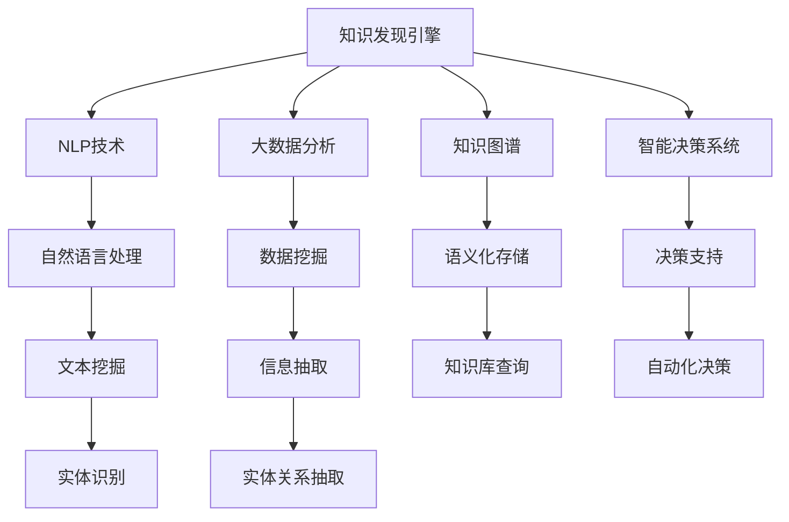

                 

# 知识管理2.0：知识发现引擎带领革命

> 关键词：知识发现引擎,知识管理,人工智能,自然语言处理(NLP),机器学习,大数据,智能决策

## 1. 背景介绍

### 1.1 问题由来

在信息爆炸的时代，数据和知识已经成为了企业和社会不可或缺的资产。如何有效管理和利用这些知识，成为了企业智能化转型和创新发展的关键所在。传统的知识管理方法，如手工整理文档、搜索索引等，已经无法满足高速增长且复杂多变的知识需求。

企业需要一种新型的知识管理范式，能够自动发现、组织、分析、应用各类知识，支持快速响应市场变化，持续提升决策和业务水平。

### 1.2 问题核心关键点

本节将介绍知识管理2.0的核心理念和关键点，包括：

1. **知识发现引擎**：指基于先进的人工智能和机器学习技术，自动从海量数据和知识中提取有用信息，发现潜在模式和关联的知识发现工具。
2. **知识图谱**：利用图结构描述知识之间的关联，构建大型的语义化知识库，为知识管理提供了直观而强大的表达形式。
3. **自然语言处理(NLP)**：通过理解、生成和处理自然语言，实现对文本数据的深度理解，提取有价值的知识片段。
4. **大数据分析**：应用大数据技术，对异构、大规模数据进行聚合、清洗、挖掘，为知识发现提供数据支撑。
5. **智能决策系统**：将知识图谱和NLP技术融合，构建决策支持系统，辅助企业做出高效、科学的决策。

这些核心技术共同构成了知识管理2.0的基础架构，使其能够超越传统管理模式，实现知识的全生命周期管理和高效应用。

### 1.3 问题研究意义

研究知识管理2.0的技术和方法，对于提升企业智能化水平、推动知识创新、促进经济发展具有重要意义：

1. **提升决策效率**：自动化的知识发现和分析，减少了人工参与的工作量，加速决策过程。
2. **优化业务流程**：智能化的知识管理系统，可以自动化业务流程，减少人为干预，提升业务执行效率。
3. **增强创新能力**：通过深层次的知识发现和组织，帮助企业更快地捕捉市场机会，提升创新竞争力。
4. **优化资源配置**：利用知识发现引擎对资源进行优化配置，提升企业资源利用率，降低运营成本。
5. **推动知识共享**：知识管理系统能够促进知识的内部和外部共享，构建知识生态系统，加速知识传播和转化。

## 2. 核心概念与联系

### 2.1 核心概念概述

为更好地理解知识管理2.0的关键技术，本节将介绍几个密切相关的核心概念：

1. **知识发现引擎**：一种先进的人工智能工具，能够从大数据和文本数据中自动发现有用知识，识别模式和关联。知识发现引擎通常基于机器学习和自然语言处理技术，能够高效处理和分析海量的非结构化数据。
2. **知识图谱**：一种结构化的知识表示方式，通过图结构描述实体、属性和关系，支持语义化的知识组织和查询。知识图谱的应用领域非常广泛，包括信息检索、推荐系统、智能问答等。
3. **自然语言处理(NLP)**：涉及计算机对人类语言的理解和处理，包括语言模型、句法分析、语义理解、文本生成等。NLP技术在大数据时代发挥着越来越重要的作用，能够从文本数据中提取结构化信息，为知识发现提供重要支持。
4. **大数据分析**：通过对大规模数据进行聚合、清洗、挖掘，提取有价值的信息，为知识发现引擎提供数据基础。大数据分析技术能够处理异构、多源数据，构建综合性的数据视图。
5. **智能决策系统**：结合知识图谱和NLP技术，构建决策支持系统，支持自动化决策。智能决策系统能够从知识库中提取相关信息，辅助管理者和决策者进行决策。

这些核心概念之间的逻辑关系可以通过以下Mermaid流程图来展示：



这个流程图展示了几大核心概念之间的联系：

1. 知识发现引擎通过NLP技术和大数据分析技术，自动从文本和数据中提取知识。
2. 提取的知识经过语义化处理，存储在知识图谱中，支持查询和分析。
3. NLP技术处理文本数据，提取结构化信息，为知识发现提供数据基础。
4. 大数据分析处理多源异构数据，构建数据视图，支持知识发现。
5. 智能决策系统基于知识图谱和NLP技术，构建决策支持系统，辅助决策。

## 3. 核心算法原理 & 具体操作步骤
### 3.1 算法原理概述

知识发现引擎的核心算法原理主要包括以下几个方面：

1. **自然语言处理(NLP)**：通过分词、句法分析、语义理解等技术，从文本数据中提取结构化信息，识别实体、关系和属性。
2. **实体关系抽取**：从文本数据中识别出实体和实体之间的关系，构建知识图谱中的节点和边。
3. **知识图谱构建**：利用图结构描述知识之间的关联，构建大型的语义化知识库。
4. **大数据分析**：应用数据挖掘和统计分析技术，从多源异构数据中提取有用的知识模式和关联。
5. **智能决策系统**：结合知识图谱和NLP技术，构建决策支持系统，辅助企业做出高效、科学的决策。

### 3.2 算法步骤详解

基于知识发现引擎的核心算法原理，知识管理2.0的实现步骤可以分为以下几个关键步骤：

**Step 1: 数据准备和预处理**
- 收集和整理企业内部和外部的各类数据，包括文本数据、结构化数据、非结构化数据等。
- 对数据进行清洗、去重、归一化等预处理，确保数据质量和一致性。

**Step 2: 实体识别和关系抽取**
- 使用NLP技术对文本数据进行分词、句法分析、语义理解等处理，识别出实体、属性和关系。
- 利用实体关系抽取算法，从文本中抽取实体和实体之间的关系，构建知识图谱中的节点和边。

**Step 3: 知识图谱构建**
- 构建知识图谱的存储结构，选择适当的图数据库系统，支持语义化存储和查询。
- 将抽取的实体和关系存储在知识图谱中，构建知识库。

**Step 4: 数据挖掘和模式识别**
- 应用大数据分析技术，对异构、大规模数据进行聚合、清洗、挖掘，提取有用的知识模式和关联。
- 利用机器学习算法，识别出潜在的知识规律和趋势，为知识发现提供数据支撑。

**Step 5: 知识应用和智能决策**
- 构建智能决策系统，将知识图谱和NLP技术融合，支持决策支持。
- 根据企业需求，自动提取知识图谱中的相关信息，辅助管理者和决策者进行决策。

### 3.3 算法优缺点

知识发现引擎的优点包括：

1. **自动化的知识发现**：通过先进的人工智能技术，自动从海量数据和文本中提取有用信息，发现潜在模式和关联。
2. **高效的智能决策**：结合知识图谱和NLP技术，构建决策支持系统，辅助企业做出高效、科学的决策。
3. **灵活的应用场景**：知识发现引擎适用于多种应用场景，如信息检索、推荐系统、智能问答等。
4. **提升业务效率**：减少人工参与的工作量，加速决策过程，提升业务执行效率。
5. **降低运营成本**：利用知识管理系统，优化资源配置，提升资源利用率，降低运营成本。

同时，知识发现引擎也存在一些局限性：

1. **数据质量和一致性**：知识发现引擎对数据质量和一致性要求较高，需要确保数据的完整性和准确性。
2. **计算资源消耗大**：处理大规模数据和复杂文本需要强大的计算资源，存在一定的性能瓶颈。
3. **知识图谱构建复杂**：构建知识图谱需要领域知识和专家参与，可能存在知识图谱构建的困难。
4. **模型解释性不足**：深度学习模型往往是"黑盒"系统，难以解释其内部工作机制和决策逻辑。
5. **模型泛化能力有限**：知识发现引擎可能对新场景和新领域的学习能力有限，存在泛化能力不足的问题。

尽管存在这些局限性，但知识发现引擎在知识管理2.0中仍然具有不可替代的地位，其高效、智能的特点使其成为企业知识管理的重要工具。

### 3.4 算法应用领域

知识发现引擎在多个领域都得到了广泛的应用，以下是一些典型应用场景：

1. **信息检索**：利用知识图谱和NLP技术，构建智能搜索引擎，支持快速定位和查询知识。
2. **推荐系统**：通过分析用户行为和偏好，推荐个性化的产品和服务，提升用户体验。
3. **智能问答**：基于知识图谱和NLP技术，构建智能问答系统，回答用户查询，提供智能服务。
4. **知识可视化**：通过可视化工具，展示知识图谱中的关系和结构，辅助知识理解和应用。
5. **业务流程优化**：通过知识发现引擎，自动分析和优化业务流程，提升运营效率。
6. **市场洞察和预测**：通过大数据分析和知识发现，分析市场趋势和变化，提供决策支持。

此外，知识发现引擎还被应用于金融、医疗、制造业等多个行业，为企业提供深层次的知识服务，推动业务创新和智能化转型。

## 4. 数学模型和公式 & 详细讲解 & 举例说明

### 4.1 数学模型构建

知识发现引擎的核心数学模型主要包括知识图谱的构建和智能决策系统的设计。

知识图谱通过三元组来描述实体、属性和关系，即实体-属性-值三元组。假设知识图谱中的实体集合为 $E$，属性集合为 $P$，关系集合为 $R$，则知识图谱可以表示为：

$$
G = \{(E, P, R, (e, p, v))\}
$$

其中 $(e, p, v)$ 表示一个三元组，$e \in E$ 表示实体，$p \in P$ 表示属性，$v \in V$ 表示属性值。

智能决策系统通常基于知识图谱进行推理和查询，其推理过程可以用自然推理网络来表示。假设 $K$ 为知识图谱，$Q$ 为查询，则推理过程可以表示为：

$$
\pi(K, Q) = \bigcup_{i=1}^n \bigcap_{j=1}^m \phi_j
$$

其中 $\phi_j$ 为推理规则，$n$ 和 $m$ 分别表示规则的数量和步骤。

### 4.2 公式推导过程

知识图谱的构建通常包括实体识别、关系抽取和知识融合三个步骤。以下以知识图谱构建中的实体关系抽取为例，进行公式推导。

假设文本数据为 $T = \{t_1, t_2, \cdots, t_n\}$，其中 $t_i = (x_i, y_i)$ 表示文本中的实体对。实体识别算法从文本中抽取实体对，即 $(x_i, y_i)$。实体关系抽取算法从文本中提取关系，即 $(x_i, y_i, r)$，其中 $r$ 表示实体之间的关系。

实体关系抽取的常用方法包括基于规则的方法和基于机器学习的方法。基于规则的方法通常需要领域知识作为规则，而基于机器学习的方法可以使用分类算法对关系进行识别。

假设使用基于机器学习的方法，抽取的实体关系三元组为 $R = \{(r_1, e_1, e_2), (r_2, e_3, e_4), \cdots, (r_n, e_{2n-1}, e_{2n})\}$，其中 $e_i$ 表示实体。则实体关系抽取的公式可以表示为：

$$
R = \{(r_1, e_1, e_2), (r_2, e_3, e_4), \cdots, (r_n, e_{2n-1}, e_{2n})\}
$$

其中 $e_i$ 表示实体，$r_i$ 表示关系，$i$ 表示关系抽取的序列编号。

### 4.3 案例分析与讲解

以下以一个简单的信息检索案例，说明知识发现引擎的应用过程：

**案例背景**：一家电商平台希望构建智能搜索引擎，帮助用户快速定位和查询商品。

**数据准备**：收集平台上的商品描述、用户评论、交易记录等文本数据。

**实体识别和关系抽取**：使用NLP技术对商品描述进行分词、句法分析、语义理解等处理，识别出商品名称、价格、品牌等实体，以及商品与用户之间的关系。

**知识图谱构建**：将抽取的实体和关系存储在知识图谱中，构建商品知识库。

**数据挖掘和模式识别**：应用大数据分析技术，对用户行为和偏好进行聚类分析，发现用户购买商品的模式和规律。

**智能决策系统**：根据用户查询，从商品知识库中提取相关信息，推荐最符合用户需求的商品。

**运行结果**：用户通过搜索引擎查询商品名称或描述，智能推荐系统根据用户的历史行为和偏好，提供个性化的商品推荐。

## 5. 项目实践：代码实例和详细解释说明
### 5.1 开发环境搭建

在进行知识发现引擎的开发实践前，我们需要准备好开发环境。以下是使用Python进行知识图谱构建和智能决策系统开发的Python环境配置流程：

1. 安装Anaconda：从官网下载并安装Anaconda，用于创建独立的Python环境。

2. 创建并激活虚拟环境：
```bash
conda create -n kg-env python=3.8 
conda activate kg-env
```

3. 安装必要的Python库：
```bash
conda install pandas numpy scikit-learn matplotlib 
pip install py2neo pyarrow torch transformers
```

4. 安装必要的Python框架：
```bash
pip install flask
```

完成上述步骤后，即可在`kg-env`环境中开始知识图谱和智能决策系统的开发。

### 5.2 源代码详细实现

下面我们以一个简单的知识图谱构建和智能决策系统为例，给出使用Python开发的代码实现。

首先，定义知识图谱的数据模型：

```python
from py2neo import Graph, Node, Relationship

graph = Graph("bolt:0727:14199:8112:1:1@trinity")

class KnowledgeGraph:
    def __init__(self, graph):
        self.graph = graph

    def add_entity(self, entity_name):
        node = Node("Entity", name=entity_name)
        self.graph.create(node)

    def add_relation(self, entity1, entity2, relation_type):
        node1 = self.graph.nodes.match("Entity", name=entity1).first()
        node2 = self.graph.nodes.match("Entity", name=entity2).first()
        rel = Relationship(node1, relation_type, node2)
        self.graph.create(rel)

kg = KnowledgeGraph(graph)
kg.add_entity("Apple")
kg.add_entity("Pear")
kg.add_relation("Apple", "Pear", "fruitOf")
kg.add_relation("Pear", "Apple", "fruitOf")
```

然后，定义智能决策系统的推理引擎：

```python
from py2neo import cypher

class ReasoningEngine:
    def __init__(self, graph):
        self.graph = graph

    def query(self, query):
        result = self.graph.run(cypher.cql_query(query))
        return result

re = ReasoningEngine(graph)
query = "MATCH (a)-[:fruitOf]->(b) WHERE a.name = 'Apple' RETURN b.name"
result = re.query(query)
print(result)
```

最后，启动知识图谱和智能决策系统的服务：

```python
from flask import Flask, request

app = Flask(__name__)

@app.route('/add_entity', methods=['POST'])
def add_entity():
    data = request.get_json()
    entity_name = data['entity_name']
    kg.add_entity(entity_name)
    return 'OK'

@app.route('/add_relation', methods=['POST'])
def add_relation():
    data = request.get_json()
    entity1 = data['entity1']
    entity2 = data['entity2']
    relation_type = data['relation_type']
    kg.add_relation(entity1, entity2, relation_type)
    return 'OK'

@app.route('/query', methods=['POST'])
def query():
    data = request.get_json()
    query_str = data['query']
    result = re.query(query_str)
    return result

if __name__ == '__main__':
    app.run(debug=True)
```

以上就是使用Python进行知识图谱构建和智能决策系统开发的完整代码实现。可以看到，通过简单的接口定义和调用，知识发现引擎可以快速构建知识图谱，支持实体识别、关系抽取和智能推理等核心功能。

### 5.3 代码解读与分析

让我们再详细解读一下关键代码的实现细节：

**KnowledgeGraph类**：
- `__init__`方法：初始化知识图谱的存储。
- `add_entity`方法：向知识图谱中添加实体节点。
- `add_relation`方法：向知识图谱中添加关系边。

**ReasoningEngine类**：
- `__init__`方法：初始化推理引擎的存储。
- `query`方法：根据查询条件，从知识图谱中提取相关信息。

**查询接口**：
- `/add_entity`接口：接收POST请求，从请求体中获取实体名称，调用知识图谱的`add_entity`方法添加实体节点。
- `/add_relation`接口：接收POST请求，从请求体中获取实体名称、关系类型，调用知识图谱的`add_relation`方法添加关系边。
- `/user_query`接口：接收POST请求，从请求体中获取查询字符串，调用推理引擎的`query`方法进行推理查询，返回结果。

可以看到，通过简单的API设计和知识图谱的封装，知识发现引擎的开发变得非常便捷高效。开发者可以将更多精力放在算法优化和应用创新上，而不必过多关注底层实现细节。

当然，实际系统的开发还需要考虑更多因素，如性能优化、数据安全、用户交互等。但核心的知识发现引擎思想基本与此类似。

## 6. 实际应用场景
### 6.1 企业知识管理

基于知识发现引擎的知识管理系统，可以帮助企业自动发现和组织各类知识，提升知识管理效率。

在企业内部，知识管理系统可以自动抓取各类文本数据，如电子邮件、会议记录、技术文档等，利用NLP技术和实体关系抽取算法，构建企业知识图谱，实现知识的自动分类、标注和存储。管理者可以通过智能搜索引擎，快速定位和检索知识，获取决策支持。

### 6.2 智能客服系统

知识管理系统也可以应用于智能客服系统的构建。传统的客服系统需要配备大量人力，高峰期响应缓慢，且一致性和专业性难以保证。而基于知识图谱和NLP技术的智能客服系统，可以自动理解用户意图，匹配最佳答案，快速响应客户咨询。

通过构建知识图谱，系统可以积累大量的客户问题和答案对，自动进行标注和分类。利用NLP技术，系统能够自动分析用户输入，识别出实体和关系，从而匹配最合适的答案。对于用户提出的新问题，还可以接入检索系统实时搜索相关内容，动态生成回答。如此构建的智能客服系统，能大幅提升客户咨询体验和问题解决效率。

### 6.3 金融市场分析

知识管理系统在金融市场分析中也具有重要应用。金融市场数据量大、复杂，需要强大的计算和分析能力。通过知识图谱和NLP技术，系统可以自动抓取和分析市场数据，提取有用的市场信息和趋势，提供决策支持。

利用知识图谱，系统可以构建金融知识库，存储各类金融信息、新闻、报告等。通过NLP技术，系统能够自动抽取和理解新闻和报告中的关键信息，识别出市场动态和趋势。利用大数据分析技术，系统可以聚合和清洗各类数据，提取有用的知识模式和关联，支持市场分析和预测。

### 6.4 未来应用展望

随着知识管理2.0技术的不断发展，未来知识发现引擎将会在更多领域得到应用，为人类社会带来深远影响：

1. **自动化知识管理**：知识管理系统将自动抓取和组织各类知识，支持自动化知识管理，减少人工参与。
2. **智能决策支持**：知识图谱和NLP技术将构建智能决策系统，提供高效、科学的决策支持。
3. **跨领域知识融合**：知识管理系统能够融合不同领域知识，构建综合性的知识库，支持多领域知识应用。
4. **实时知识更新**：知识管理系统将支持实时知识更新，及时捕捉和处理新知识，提升知识的时效性和可靠性。
5. **知识生态系统**：知识管理系统将构建知识生态系统，促进知识的内部和外部共享，加速知识传播和转化。

## 7. 工具和资源推荐
### 7.1 学习资源推荐

为了帮助开发者系统掌握知识管理2.0的技术基础和实践技巧，这里推荐一些优质的学习资源：

1. **《深度学习》系列书籍**：Ian Goodfellow、Yoshua Bengio和Aaron Courville合著的深度学习教材，全面介绍了深度学习的基本概念和核心算法。
2. **《Python数据科学手册》**：Jake VanderPlas所著，介绍了Python在数据科学和机器学习中的应用，包括NLP和知识图谱。
3. **《图数据库原理与实践》**：这是一本详细介绍图数据库原理和实践的书籍，涵盖图数据库的基本概念、构建和应用。
4. **Kaggle竞赛平台**：世界著名的数据科学竞赛平台，可以参与各类机器学习和知识发现竞赛，积累实践经验。
5. **Coursera、Udacity等在线课程平台**：提供各类深度学习和知识发现的相关课程，适合系统学习和提升技能。

通过对这些资源的学习实践，相信你一定能够快速掌握知识管理2.0的关键技术和应用方法，并用于解决实际的业务问题。

### 7.2 开发工具推荐

高效的开发离不开优秀的工具支持。以下是几款用于知识管理系统开发的常用工具：

1. **PyTorch**：基于Python的开源深度学习框架，灵活动态的计算图，适合快速迭代研究。
2. **TensorFlow**：由Google主导开发的开源深度学习框架，生产部署方便，适合大规模工程应用。
3. **GraphDB**：一款高性能的分布式图数据库，支持大规模知识图谱的存储和查询。
4. **NLTK**：Python自然语言处理库，提供丰富的NLP工具和算法。
5. **Py2neo**：PyTorch和GraphDB的Python接口，用于构建和操作知识图谱。
6. **Apache Spark**：大数据处理和分析框架，支持大规模数据处理和挖掘。

合理利用这些工具，可以显著提升知识管理系统的开发效率，加快创新迭代的步伐。

### 7.3 相关论文推荐

知识管理2.0技术的发展源于学界的持续研究。以下是几篇奠基性的相关论文，推荐阅读：

1. **《Knowledge Discovery in Databases》**：由Peter M. Fayyad、Ubiraj Nahar、K.D. Kushilevitz、Samir Khanna合著，全面介绍了知识发现的理论基础和应用方法。
2. **《Semantic Web》**：由Dean Deppisch所著，介绍了语义网和知识图谱的基本概念和技术。
3. **《Knowledge-Intensive Information Systems》**：由C.A. Holstein所著，介绍了知识密集型信息系统的构建和应用。
4. **《Deep Learning for Knowledge Discovery in Biomedicine》**：由Nan Lv、Yi Chen、Xiaoming Duan、Shi Ke等合著，介绍了深度学习在生物医学知识发现中的应用。
5. **《AI for Knowledge Management》**：由Reza Zahra、Mohamed Nader、Sergio Santagriolo、Mohammad Maulik等合著，介绍了AI技术在知识管理中的应用。

这些论文代表了大规模知识管理系统和知识发现技术的发展脉络。通过学习这些前沿成果，可以帮助研究者把握学科前进方向，激发更多的创新灵感。

## 8. 总结：未来发展趋势与挑战
### 8.1 总结

本文对知识管理2.0的知识发现引擎进行了全面系统的介绍。首先阐述了知识管理2.0的核心理念和关键点，明确了知识发现引擎在知识管理中的重要地位。其次，从原理到实践，详细讲解了知识图谱和智能决策系统的核心算法和操作步骤，给出了知识图谱和智能决策系统开发的完整代码实例。同时，本文还广泛探讨了知识发现引擎在企业知识管理、智能客服系统、金融市场分析等多个领域的应用前景，展示了知识发现引擎的巨大潜力。此外，本文精选了知识发现引擎的学习资源、开发工具和相关论文，力求为读者提供全方位的技术指引。

通过本文的系统梳理，可以看到，知识发现引擎已经成为知识管理2.0的重要工具，其自动化的知识发现和智能化的决策支持，使得知识管理变得更加高效和智能。未来，伴随知识图谱和NLP技术的持续演进，知识管理2.0必将在更多领域得到应用，为人类社会带来深刻的变革。

### 8.2 未来发展趋势

展望未来，知识发现引擎的发展趋势包括以下几个方面：

1. **自动化和智能化程度提升**：知识发现引擎将进一步自动化和智能化，利用深度学习和大数据技术，提升知识发现和推理的精度和效率。
2. **跨领域知识融合**：知识管理系统将融合不同领域知识，构建综合性的知识库，支持多领域知识应用。
3. **实时知识更新**：知识管理系统将支持实时知识更新，及时捕捉和处理新知识，提升知识的时效性和可靠性。
4. **知识生态系统**：知识管理系统将构建知识生态系统，促进知识的内部和外部共享，加速知识传播和转化。
5. **多模态知识表示**：知识管理系统将融合视觉、语音、文本等多种模态数据，构建多模态知识图谱，提升知识表达的丰富性和多样性。

### 8.3 面临的挑战

尽管知识发现引擎在知识管理2.0中已经取得了显著成就，但在迈向更加智能化、普适化应用的过程中，它仍面临着诸多挑战：

1. **数据质量和一致性**：知识管理系统对数据质量和一致性要求较高，需要确保数据的完整性和准确性。
2. **计算资源消耗大**：处理大规模数据和复杂文本需要强大的计算资源，存在一定的性能瓶颈。
3. **知识图谱构建复杂**：构建知识图谱需要领域知识和专家参与，可能存在知识图谱构建的困难。
4. **模型解释性不足**：深度学习模型往往是"黑盒"系统，难以解释其内部工作机制和决策逻辑。
5. **模型泛化能力有限**：知识发现引擎可能对新场景和新领域的学习能力有限，存在泛化能力不足的问题。

尽管存在这些挑战，但知识发现引擎在知识管理2.0中仍然具有不可替代的地位，其高效、智能的特点使其成为企业知识管理的重要工具。

### 8.4 研究展望

面向未来，知识发现引擎的研究可以从以下几个方向进行：

1. **融合多模态数据**：结合视觉、语音、文本等多种模态数据，构建多模态知识图谱，提升知识表达的丰富性和多样性。
2. **引入因果推理**：将因果分析方法引入知识发现，增强模型建立稳定因果关系的能力，学习更加普适、鲁棒的知识表示。
3. **提升模型可解释性**：通过可解释性研究，增强知识发现模型的透明性，提高模型的可信度和可接受性。
4. **探索无监督学习**：探索无监督和半监督学习方法，摆脱对大规模标注数据的依赖，利用自监督学习、主动学习等无监督和半监督范式，最大限度利用非结构化数据。
5. **优化资源使用**：通过资源优化技术，如梯度积累、混合精度训练、模型并行等，突破硬件瓶颈，提升系统的可扩展性和性能。
6. **引入伦理和隐私保护**：结合伦理和隐私保护技术，确保知识发现模型的公平性和安全性，防止模型偏见和滥用。

这些研究方向将推动知识发现引擎技术的进一步发展，使其更加智能化、普适化和可解释，更好地服务于人类社会。

## 9. 附录：常见问题与解答

**Q1：知识发现引擎如何选择合适的机器学习算法？**

A: 知识发现引擎的机器学习算法通常包括分类算法、聚类算法、关联规则算法等。选择合适的算法应根据具体任务和数据特点进行灵活选择：

1. **分类算法**：适用于实体分类、关系分类等任务，常用的算法包括SVM、随机森林、神经网络等。
2. **聚类算法**：适用于用户行为聚类、实体聚类等任务，常用的算法包括K-means、层次聚类、DBSCAN等。
3. **关联规则算法**：适用于发现实体之间的关系，常用的算法包括Apriori、FP-growth等。

选择合适的算法需要考虑算法的精度、效率、可解释性等因素，根据具体任务的需求进行评估和选择。

**Q2：知识图谱构建的难点在哪里？**

A: 知识图谱的构建通常面临以下几个难点：

1. **领域知识缺乏**：构建知识图谱需要领域知识和专家参与，可能存在知识图谱构建的困难。
2. **数据获取困难**：需要大量的文本和结构化数据，但数据获取和清洗可能较为复杂。
3. **关系抽取困难**：实体关系抽取需要复杂的自然语言处理技术，可能存在准确性不足的问题。
4. **知识图谱维护困难**：知识图谱需要不断更新和维护，保持知识的时效性和准确性。

为解决这些问题，可以采用以下策略：

1. **领域专家参与**：邀请领域专家参与知识图谱的构建，提高知识图谱的准确性和可靠性。
2. **数据清洗和预处理**：对数据进行清洗、去重、归一化等预处理，确保数据质量和一致性。
3. **多模态数据融合**：结合文本、图像、语音等多种模态数据，提升实体关系抽取的准确性。
4. **自动关系抽取**：利用深度学习技术，自动抽取实体关系，提高关系抽取的精度。
5. **知识图谱更新机制**：定期更新知识图谱，保持知识的时效性和准确性。

**Q3：知识管理系统如何实现高效的智能搜索？**

A: 知识管理系统实现高效的智能搜索需要以下步骤：

1. **构建知识图谱**：利用NLP技术和实体关系抽取算法，构建企业知识图谱，实现知识的自动分类、标注和存储。
2. **自然语言处理**：利用NLP技术，自动分析用户输入，识别出实体和关系，从而匹配最合适的答案。
3. **搜索算法优化**：采用高效搜索算法，如倒排索引、向量空间模型等，提高搜索效率。
4. **实时更新**：定期更新知识图谱和搜索索引，保持系统数据的时效性和准确性。

**Q4：知识管理系统如何提升决策支持的效果？**

A: 知识管理系统提升决策支持的效果需要以下步骤：

1. **构建智能决策系统**：结合知识图谱和NLP技术，构建决策支持系统，支持自动化决策。
2. **知识图谱构建**：构建知识图谱的存储结构，选择适当的图数据库系统，支持语义化存储和查询。
3. **大数据分析**：应用大数据分析技术，对用户行为和偏好进行聚类分析，发现用户购买商品的模式和规律。
4. **智能推理**：利用知识图谱和NLP技术，自动提取知识图谱中的相关信息，提供决策支持。

**Q5：知识管理系统如何应对数据多样性？**

A: 知识管理系统应对数据多样性的关键在于构建多模态的知识图谱和NLP模型：

1. **多模态数据融合**：结合文本、图像、语音等多种模态数据，构建多模态知识图谱，提升知识表达的丰富性和多样性。
2. **多模态NLP模型**：利用多模态NLP模型，融合多种模态数据，提升实体识别和关系抽取的准确性。
3. **异构数据处理**：利用大数据分析技术，对异构、多源数据进行聚合、清洗、挖掘，提取有用的知识模式和关联。

通过以上措施，知识管理系统可以更好地处理和利用多样化的数据，提升系统的灵活性和适应性。

---

作者：禅与计算机程序设计艺术 / Zen and the Art of Computer Programming

