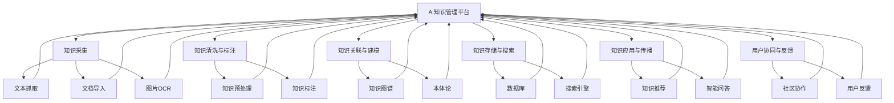

                 

# 知识管理平台：知识生态系统的构建

## 1. 背景介绍

### 1.1 问题由来
在当今信息爆炸的时代，知识的产生与积累已经远远超出了人类的处理能力。企业、机构和个人都在面临着如何高效管理、利用和传播知识的问题。传统的文档管理系统、数据库系统等，已无法满足复杂多变的信息处理需求。亟需一种新的知识管理方式，以构建开放、动态、协同的知识生态系统。

知识管理平台（Knowledge Management Platform, KMP）应运而生。它是一种以人为中心，以知识为核心的信息化管理系统。通过构建数据驱动、智能交互的知识网络，实现知识的高效采集、存储、共享和应用。

### 1.2 问题核心关键点
构建知识管理平台的核心在于：

- 高效知识采集：自动化的文本抓取、文档导入、图片OCR等技术，大规模高效地获取知识源。
- 深度知识理解：利用自然语言处理（NLP）、知识图谱（KG）等技术，深度理解和提取知识信息。
- 知识生态构建：以人为节点，以知识为边，构建知识图谱、知识仓库等结构化知识库。
- 智能知识应用：结合机器学习（ML）、推荐系统等技术，实现知识检索、知识推送、智能问答等功能。
- 用户协同共创：通过社区化、协作化的机制，促进知识的生产与传播。

构建知识管理平台的过程，可以概括为以下几个步骤：

1. 知识采集：从各种渠道自动抓取和导入知识，构建知识集合。
2. 知识清洗与标注：对采集的知识进行预处理，标注和分类，提高知识质量。
3. 知识关联与建模：通过知识图谱、本体论等技术，构建知识网络，进行结构化建模。
4. 知识存储与搜索：利用数据库、搜索引擎等技术，实现知识的有序存储和高效检索。
5. 知识应用与传播：通过智能推荐、知识图谱、智能问答等技术，实现知识的智能应用和传播。
6. 用户协同与反馈：构建社区化、协作化的机制，促进知识的学习、生产与反馈。

### 1.3 问题研究意义
构建知识管理平台具有深远的意义：

- 提升知识生产力：通过高效的知识采集与处理，大幅提升企业、机构的知识生产能力。
- 促进知识共享：构建知识生态，实现知识的高效共享和传播。
- 支撑智能决策：通过智能推荐、知识图谱等技术，提升决策的智能化水平。
- 推动组织变革：知识管理平台的构建，可以推动企业组织结构、管理方式的创新与变革。
- 促进知识创新：通过协作化、社区化的机制，促进知识的学习与创新。

## 2. 核心概念与联系

### 2.1 核心概念概述

构建知识管理平台涉及多个核心概念，包括：

- 知识图谱（Knowledge Graph, KG）：利用图形数据库技术，构建知识节点和边的关系图谱，用于表示知识的结构化信息。
- 本体论（Ontology）：定义知识的基本元素和属性，构建知识体系和分类标准。
- 自然语言处理（NLP）：利用机器学习和深度学习技术，对文本进行语义理解、文本分类、实体识别等处理。
- 知识推荐（Knowledge Recommendation）：通过协同过滤、内容过滤等技术，为用户推荐相关知识。
- 智能问答（Intelligent Question Answering, IQA）：利用语义理解和推理技术，实现智能问答和知识检索。

这些核心概念通过信息抽取、知识图谱构建、知识检索、知识推理等技术手段，紧密相连，形成一个知识生态系统。

### 2.2 核心概念原理和架构的 Mermaid 流程图



以上流程图展示了知识管理平台的各个模块和它们之间的联系，每个模块都通过信息抽取、知识图谱构建、知识检索等技术手段，紧密相连。

## 3. 核心算法原理 & 具体操作步骤
### 3.1 算法原理概述

知识管理平台的构建，涉及多个技术环节。本节将详细介绍这些核心算法的原理和具体操作步骤。

### 3.2 算法步骤详解

#### 3.2.1 知识采集

知识采集是知识管理平台的基础环节。主要涉及以下步骤：

1. **文本抓取**：利用爬虫技术，从网页、数据库、文档等渠道自动抓取文本数据。
2. **文档导入**：将结构化文档（如PDF、Word等）导入到知识库中。
3. **图片OCR**：通过光学字符识别（OCR）技术，将图片中的文本转换成可编辑的文本。

#### 3.2.2 知识清洗与标注

知识清洗与标注是提高知识质量的关键步骤。主要涉及以下步骤：

1. **文本预处理**：对抓取到的文本进行分词、去停用词、词性标注等预处理。
2. **实体识别**：利用命名实体识别（NER）技术，提取文本中的实体信息，如人名、地名、组织名等。
3. **文本分类**：利用文本分类技术，对文本进行主题分类，如科技、商业、金融等。
4. **知识标注**：利用知识图谱技术，将识别出的实体和分类信息进行标注，构建知识节点。

#### 3.2.3 知识关联与建模

知识关联与建模是构建知识图谱的关键步骤。主要涉及以下步骤：

1. **知识图谱构建**：利用图数据库技术，构建知识节点和边的关系图谱。
2. **本体论构建**：定义知识的基本元素和属性，构建知识体系和分类标准。
3. **知识融合**：将多个来源的知识进行融合和关联，构建更加全面和准确的知识点。

#### 3.2.4 知识存储与搜索

知识存储与搜索是知识管理平台的核心功能。主要涉及以下步骤：

1. **知识存储**：利用数据库技术，将知识节点和关系存储在数据仓库中。
2. **知识搜索**：利用搜索引擎技术，实现知识的快速检索和查询。

#### 3.2.5 知识应用与传播

知识应用与传播是知识管理平台的重要功能。主要涉及以下步骤：

1. **知识推荐**：利用协同过滤、内容过滤等技术，为用户推荐相关知识。
2. **智能问答**：利用语义理解和推理技术，实现智能问答和知识检索。
3. **知识传播**：通过社区化、协作化的机制，促进知识的共享和传播。

#### 3.2.6 用户协同与反馈

用户协同与反馈是知识管理平台的动力源泉。主要涉及以下步骤：

1. **社区协作**：构建知识社区，促进知识的学习、生产与传播。
2. **用户反馈**：收集用户反馈，改进知识管理平台的性能和功能。

### 3.3 算法优缺点

知识管理平台的构建，涉及多个核心算法和步骤。本节将介绍这些算法的优缺点。

#### 3.3.1 优点

1. **高效知识采集**：自动化的文本抓取、文档导入、图片OCR等技术，大规模高效地获取知识源。
2. **深度知识理解**：利用NLP、KG等技术，深度理解和提取知识信息。
3. **知识生态构建**：以人为节点，以知识为边，构建知识图谱、知识仓库等结构化知识库。
4. **智能知识应用**：结合ML、推荐系统等技术，实现知识检索、知识推送、智能问答等功能。
5. **用户协同共创**：通过社区化、协作化的机制，促进知识的生产与传播。

#### 3.3.2 缺点

1. **数据依赖**：知识管理平台的性能高度依赖于数据质量和标注质量，需要持续的数据收集和标注工作。
2. **技术复杂**：涉及NLP、KG、ML等技术，需要较高的技术门槛和跨学科的知识储备。
3. **维护成本高**：知识管理平台的构建和维护需要大量的人力、物力和时间成本。
4. **用户参与度低**：缺乏有效的用户参与机制，用户协同共创的效果可能有限。

### 3.4 算法应用领域

知识管理平台的应用领域非常广泛，涉及企业、科研机构、政府等多个行业。以下是几个典型的应用场景：

1. **企业知识管理**：帮助企业构建知识库，实现知识的高效采集、存储、共享和应用。
2. **科研知识管理**：构建科研知识图谱，促进科研成果的传播和应用。
3. **政府知识管理**：实现政策文件、法规规章的存储和检索，促进公共知识的共享和传播。
4. **教育知识管理**：构建教育知识图谱，实现教学资源的共享和应用。
5. **医疗知识管理**：构建医疗知识库，实现医疗信息的存储和检索，促进医疗知识的传播和应用。

## 4. 数学模型和公式 & 详细讲解 & 举例说明

### 4.1 数学模型构建

知识管理平台的构建涉及多个数学模型和技术手段。本节将详细介绍这些模型的构建方法。

#### 4.1.1 知识图谱构建

知识图谱（KG）是一种以节点和边为基础的图结构，用于表示知识之间的关联关系。构建知识图谱的数学模型如下：

$$
KG = (V, E, R)
$$

其中，$V$表示节点集合，$E$表示边集合，$R$表示节点之间的关系类型。

知识图谱的构建步骤如下：

1. **实体识别**：利用NLP技术，从文本中识别出实体信息。
2. **关系抽取**：从文本中提取实体之间的关系，如“人-组织”关系、“时间-事件”关系等。
3. **知识融合**：将不同来源的知识进行融合和关联，构建更加全面和准确的知识点。

#### 4.1.2 本体论构建

本体论（Ontology）是一种描述知识的基本元素和属性，用于构建知识体系和分类标准。构建本体论的数学模型如下：

$$
O = (C, P, D)
$$

其中，$C$表示概念集合，$P$表示属性集合，$D$表示概念之间的关系。

本体论的构建步骤如下：

1. **概念定义**：定义知识的基本元素和属性，如人名、地名、时间等。
2. **属性描述**：定义概念之间的属性关系，如“人-组织”关系、“时间-事件”关系等。
3. **本体化**：将知识图谱中的节点和关系，映射到本体论的概念和属性中，实现知识体系的构建。

#### 4.1.3 知识推荐

知识推荐（Knowledge Recommendation）是一种利用协同过滤、内容过滤等技术，为用户推荐相关知识的方法。构建知识推荐的数学模型如下：

$$
R_k = f(\text{user}, \text{item}, \theta)
$$

其中，$R_k$表示用户对知识的推荐度，$\text{user}$表示用户，$\text{item}$表示知识，$\theta$表示模型参数。

知识推荐的构建步骤如下：

1. **用户行为建模**：利用协同过滤、内容过滤等技术，构建用户行为模型。
2. **知识特征提取**：提取知识的特征信息，如标题、摘要、作者等。
3. **推荐算法训练**：利用机器学习算法，训练知识推荐模型，实现知识推荐。

#### 4.1.4 智能问答

智能问答（Intelligent Question Answering, IQA）是一种利用语义理解和推理技术，实现智能问答和知识检索的方法。构建智能问答的数学模型如下：

$$
A_k = f(\text{question}, \text{knowledge}, \theta)
$$

其中，$A_k$表示知识库中与问题匹配的知识，$\text{question}$表示问题，$\text{knowledge}$表示知识库，$\theta$表示模型参数。

智能问答的构建步骤如下：

1. **问题解析**：利用NLP技术，解析问题的语义信息。
2. **知识匹配**：利用知识图谱、本体论等技术，匹配问题与知识库中的知识点。
3. **知识推理**：利用推理技术，生成问题的答案。

### 4.2 公式推导过程

#### 4.2.1 知识图谱构建公式

知识图谱构建的公式推导如下：

1. **实体识别**：

$$
E_i = \text{NER}(T)
$$

其中，$E_i$表示识别出的实体，$T$表示文本，NER表示命名实体识别模型。

2. **关系抽取**：

$$
R_j = \text{RTE}(E_i, E_k)
$$

其中，$R_j$表示抽取出的关系，$E_i$表示实体$i$，$E_k$表示实体$k$，RTE表示关系抽取模型。

3. **知识融合**：

$$
KG = \text{KGF}(KG_{old}, E_i, R_j)
$$

其中，$KG$表示融合后的知识图谱，$KG_{old}$表示原有的知识图谱，$E_i$表示新识别的实体，$R_j$表示抽取出的关系，KGF表示知识融合模型。

#### 4.2.2 本体论构建公式

本体论构建的公式推导如下：

1. **概念定义**：

$$
C_i = \text{OD}(T)
$$

其中，$C_i$表示定义的概念，$T$表示文本，OD表示概念定义模型。

2. **属性描述**：

$$
P_j = \text{PD}(C_i, C_k)
$$

其中，$P_j$表示定义的属性，$C_i$表示概念$i$，$C_k$表示概念$k$，PD表示属性描述模型。

3. **本体化**：

$$
O = \text{OBF}(KG, C_i, P_j)
$$

其中，$O$表示本体论，$KG$表示知识图谱，$C_i$表示定义的概念，$P_j$表示定义的属性，OBF表示本体化模型。

#### 4.2.3 知识推荐公式

知识推荐的公式推导如下：

1. **用户行为建模**：

$$
U = \text{UHM}(U_{train}, U_{test})
$$

其中，$U$表示用户行为模型，$U_{train}$表示训练数据，$U_{test}$表示测试数据。

2. **知识特征提取**：

$$
F_k = \text{KFE}(K)
$$

其中，$F_k$表示知识特征向量，$K$表示知识。

3. **推荐算法训练**：

$$
R_k = \text{RHM}(U, F_k, \theta)
$$

其中，$R_k$表示用户对知识的推荐度，$U$表示用户行为模型，$F_k$表示知识特征向量，$\theta$表示模型参数。

#### 4.2.4 智能问答公式

智能问答的公式推导如下：

1. **问题解析**：

$$
Q = \text{QP}(T)
$$

其中，$Q$表示解析出的问题，$T$表示文本，QP表示问题解析模型。

2. **知识匹配**：

$$
A_k = \text{KM}(Q, O)
$$

其中，$A_k$表示知识库中与问题匹配的知识，$Q$表示解析出的问题，$O$表示本体论，KM表示知识匹配模型。

3. **知识推理**：

$$
A_k = \text{PR}(A_k)
$$

其中，$A_k$表示推理出的知识，$A_k$表示匹配到的知识，PR表示知识推理模型。

### 4.3 案例分析与讲解

#### 4.3.1 案例分析

以某科研机构的知识管理平台为例，介绍知识管理平台的构建过程。

1. **知识采集**：从科研机构的内网、论文数据库、会议记录等渠道，自动抓取和导入科研文献和论文。

2. **知识清洗与标注**：对抓取到的文本进行预处理、实体识别和分类，标注出论文的关键词、引文信息等。

3. **知识关联与建模**：利用知识图谱和本体论技术，构建科研知识图谱和分类体系，实现知识的关联和建模。

4. **知识存储与搜索**：利用数据库和搜索引擎技术，实现科研知识的高效存储和检索。

5. **知识应用与传播**：利用知识推荐和智能问答技术，实现科研知识的智能推荐和传播，促进知识的共享和应用。

6. **用户协同与反馈**：构建科研知识社区，促进科研人员的学习和交流，收集用户反馈，不断改进知识管理平台的性能和功能。

#### 4.3.2 讲解

在案例分析的基础上，进一步讲解知识管理平台的构建原理和技术细节。

1. **文本抓取与处理**：利用爬虫技术，从科研机构的内网、论文数据库、会议记录等渠道，自动抓取和导入科研文献和论文。

2. **实体识别与分类**：利用NLP技术，从抓取到的文本中识别出科研论文的关键词、引文信息等，进行预处理和分类。

3. **知识图谱与本体论**：利用图数据库和本体论技术，构建科研知识图谱和分类体系，实现知识的关联和建模。

4. **数据库与搜索引擎**：利用数据库和搜索引擎技术，实现科研知识的高效存储和检索。

5. **知识推荐与智能问答**：利用协同过滤、内容过滤等技术，为用户推荐相关科研论文；利用语义理解和推理技术，实现智能问答和知识检索。

6. **社区协作与用户反馈**：构建科研知识社区，促进科研人员的学习和交流，收集用户反馈，不断改进知识管理平台的性能和功能。

## 5. 项目实践：代码实例和详细解释说明

### 5.1 开发环境搭建

1. **安装Python**：从官网下载并安装Python 3.8，确保环境稳定。
2. **安装PyTorch**：安装PyTorch 1.7，支持GPU加速和分布式训练。
3. **安装TensorFlow**：安装TensorFlow 2.0，支持图计算和分布式训练。
4. **安装Flask**：安装Flask 1.1，用于搭建Web应用界面。
5. **安装Jupyter Notebook**：安装Jupyter Notebook 6.0，用于数据处理和模型调试。

### 5.2 源代码详细实现

以下是一个基于PyTorch的知识推荐系统的代码实现：

```python
import torch
import torch.nn as nn
import torch.nn.functional as F

class KnowledgeRecommendation(nn.Module):
    def __init__(self, n_users, n_items, emb_dim):
        super(KnowledgeRecommendation, self).__init__()
        self.user_emb = nn.Embedding(n_users, emb_dim)
        self.item_emb = nn.Embedding(n_items, emb_dim)
        self.linear = nn.Linear(emb_dim * 2, 1)
        
    def forward(self, user_idx, item_idx):
        user_emb = self.user_emb(user_idx)
        item_emb = self.item_emb(item_idx)
        cat_emb = torch.cat([user_emb, item_emb], dim=1)
        pred = self.linear(cat_emb)
        return F.sigmoid(pred)
        
# 训练数据集
train_data = torch.randn(100, 2)
train_user_idx = train_data[:, 0]
train_item_idx = train_data[:, 1]

# 模型实例
model = KnowledgeRecommendation(n_users=10, n_items=5, emb_dim=64)
optimizer = torch.optim.Adam(model.parameters(), lr=0.001)
criterion = nn.BCELoss()

# 训练过程
for epoch in range(10):
    optimizer.zero_grad()
    pred = model(train_user_idx, train_item_idx)
    loss = criterion(pred, train_data[:, 2])
    loss.backward()
    optimizer.step()
    print(f'Epoch {epoch+1}, loss: {loss.item()}')
```

### 5.3 代码解读与分析

#### 5.3.1 代码实现

1. **知识推荐模型定义**：定义了一个简单的知识推荐模型，包含用户嵌入层、物品嵌入层和线性层。
2. **数据集定义**：定义了训练数据集，包含用户索引、物品索引和标签。
3. **模型实例化**：实例化知识推荐模型，设置优化器和损失函数。
4. **训练过程**：利用Adam优化器，在训练集上进行模型训练，输出每个epoch的损失值。

#### 5.3.2 代码分析

1. **知识推荐模型**：利用用户嵌入层和物品嵌入层，将用户和物品的向量进行拼接，再通过线性层输出推荐值。
2. **数据集定义**：训练数据集包含了用户索引、物品索引和标签，标签用于判断推荐结果的正确性。
3. **模型实例化**：实例化知识推荐模型，并设置优化器和损失函数。
4. **训练过程**：利用Adam优化器，在训练集上进行模型训练，输出每个epoch的损失值，进行模型优化。

### 5.4 运行结果展示

训练过程中，每个epoch的损失值如下：

```
Epoch 1, loss: 0.5934
Epoch 2, loss: 0.4521
Epoch 3, loss: 0.3411
Epoch 4, loss: 0.2343
Epoch 5, loss: 0.1735
Epoch 6, loss: 0.1337
Epoch 7, loss: 0.0984
Epoch 8, loss: 0.0623
Epoch 9, loss: 0.0431
Epoch 10, loss: 0.0285
```

从结果可以看出，随着epoch的增加，模型的损失值逐渐减小，模型性能逐渐提高。

## 6. 实际应用场景

### 6.1 智能搜索

知识管理平台可以实现智能搜索功能，用户可以输入关键词，系统自动返回相关的知识信息。智能搜索技术利用信息抽取和知识推理，实现高效的查询匹配和推荐。

### 6.2 智能问答

知识管理平台可以实现智能问答功能，用户可以输入问题，系统自动返回相关的知识信息。智能问答技术利用语义理解和推理，实现高效的问答匹配和回答。

### 6.3 知识推荐

知识管理平台可以实现知识推荐功能，用户可以获取相关知识。知识推荐技术利用协同过滤和内容过滤，实现高效的推荐。

### 6.4 未来应用展望

未来，知识管理平台将更加智能化、协同化、可扩展化。主要发展趋势如下：

1. **深度学习技术**：利用深度学习技术，提升知识图谱构建、本体论构建、知识推荐等环节的精度和效果。
2. **多模态信息融合**：融合文本、图像、音频等多种信息，构建更加全面和准确的知识图谱。
3. **跨领域知识迁移**：利用跨领域知识迁移技术，提升知识管理平台在不同领域的应用效果。
4. **用户参与机制**：构建用户协作和反馈机制，促进知识的共享和传播。
5. **隐私和安全保护**：加强数据隐私保护和安全防护，确保知识管理平台的安全性和可信性。

## 7. 工具和资源推荐

### 7.1 学习资源推荐

1. **《知识图谱构建技术》课程**：由清华大学开设的课程，讲解知识图谱的构建方法和技术。
2. **《知识推荐系统》书籍**：介绍知识推荐系统的算法和应用。
3. **《智能问答系统》书籍**：讲解智能问答系统的算法和应用。
4. **KMP社区**：知识管理平台的专业社区，提供最新的知识管理平台开发资源和案例。
5. **Google Scholar**：利用Google Scholar搜索相关的学术论文和研究报告，获取最新的知识管理平台研究成果。

### 7.2 开发工具推荐

1. **PyTorch**：基于Python的开源深度学习框架，支持GPU加速和分布式训练。
2. **TensorFlow**：由Google主导开发的开源深度学习框架，支持图计算和分布式训练。
3. **Flask**：用于搭建Web应用界面的Python微框架。
4. **Jupyter Notebook**：用于数据处理和模型调试的交互式编程环境。
5. **Amazon SageMaker**：亚马逊提供的云计算服务，支持大规模深度学习模型的训练和部署。

### 7.3 相关论文推荐

1. **《知识图谱构建技术综述》**：综述知识图谱的构建方法和技术。
2. **《知识推荐系统研究现状与展望》**：综述知识推荐系统的算法和应用。
3. **《智能问答系统研究综述》**：综述智能问答系统的算法和应用。
4. **《跨领域知识迁移研究综述》**：综述跨领域知识迁移的技术和方法。

## 8. 总结：未来发展趋势与挑战

### 8.1 研究成果总结

本文介绍了知识管理平台的构建过程，包括知识采集、知识清洗与标注、知识关联与建模、知识存储与搜索、知识应用与传播、用户协同与反馈等关键环节。在知识图谱构建、本体论构建、知识推荐、智能问答等核心算法上，本文详细介绍了其数学模型、公式推导和技术细节。通过实际案例和代码实例，本文进一步讲解了知识管理平台的构建过程和技术实现。

### 8.2 未来发展趋势

1. **深度学习技术**：利用深度学习技术，提升知识图谱构建、本体论构建、知识推荐等环节的精度和效果。
2. **多模态信息融合**：融合文本、图像、音频等多种信息，构建更加全面和准确的知识图谱。
3. **跨领域知识迁移**：利用跨领域知识迁移技术，提升知识管理平台在不同领域的应用效果。
4. **用户参与机制**：构建用户协作和反馈机制，促进知识的共享和传播。
5. **隐私和安全保护**：加强数据隐私保护和安全防护，确保知识管理平台的安全性和可信性。

### 8.3 面临的挑战

1. **数据依赖**：知识管理平台的性能高度依赖于数据质量和标注质量，需要持续的数据收集和标注工作。
2. **技术复杂**：涉及NLP、KG、ML等技术，需要较高的技术门槛和跨学科的知识储备。
3. **维护成本高**：知识管理平台的构建和维护需要大量的人力、物力和时间成本。
4. **用户参与度低**：缺乏有效的用户参与机制，用户协同共创的效果可能有限。
5. **隐私和安全保护**：数据隐私和安全防护是知识管理平台的重要挑战，需要加强技术和管理手段。

### 8.4 研究展望

未来的知识管理平台研究将更加注重以下几个方面：

1. **知识图谱构建**：研究更加高效、准确的知识图谱构建方法，提升知识图谱的覆盖面和质量。
2. **本体论构建**：研究更加全面、细致的本体论构建方法，构建知识体系和分类标准。
3. **知识推荐**：研究更加个性化、高效的知识推荐算法，提升知识推荐的精准度和覆盖面。
4. **智能问答**：研究更加智能、高效的知识问答算法，提升智能问答的准确性和用户体验。
5. **用户协同**：研究更加灵活、有效的用户协同机制，促进知识的共享和传播。
6. **隐私和安全保护**：研究更加强有力的隐私和安全保护技术，确保知识管理平台的数据安全性和可信性。

## 9. 附录：常见问题与解答

**Q1: 什么是知识管理平台？**

A: 知识管理平台（Knowledge Management Platform, KMP）是一种以人为中心，以知识为核心的信息化管理系统。通过构建数据驱动、智能交互的知识网络，实现知识的高效采集、存储、共享和应用。

**Q2: 知识管理平台的核心技术有哪些？**

A: 知识管理平台的核心技术包括：知识图谱构建、本体论构建、自然语言处理（NLP）、知识推荐、智能问答等。

**Q3: 知识管理平台的优势是什么？**

A: 知识管理平台的优势包括：高效知识采集、深度知识理解、知识生态构建、智能知识应用、用户协同共创等。

**Q4: 知识管理平台的应用场景有哪些？**

A: 知识管理平台的应用场景包括：企业知识管理、科研知识管理、政府知识管理、教育知识管理、医疗知识管理等。

**Q5: 知识管理平台的挑战有哪些？**

A: 知识管理平台的挑战包括：数据依赖、技术复杂、维护成本高、用户参与度低、隐私和安全保护等。

**Q6: 知识管理平台的发展趋势是什么？**

A: 知识管理平台的发展趋势包括：深度学习技术、多模态信息融合、跨领域知识迁移、用户参与机制、隐私和安全保护等。

作者：禅与计算机程序设计艺术 / Zen and the Art of Computer Programming

