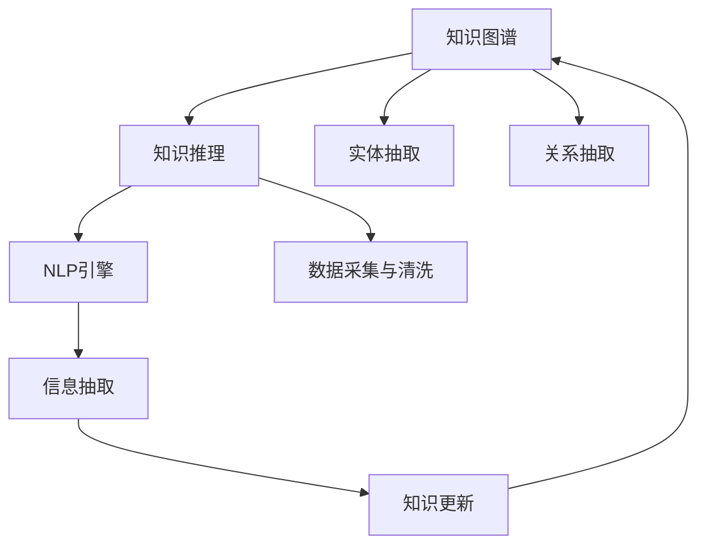

                 

# 知识管理的AI化路径:知识图谱构建和知识推理

## 1. 背景介绍

在数字化转型的大背景下，企业、组织乃至整个社会都在经历着从传统知识管理向AI化、自动化管理的转变。AI技术，尤其是自然语言处理(NLP)、机器学习(ML)、知识图谱(KG)等技术的广泛应用，极大地提升了信息获取、处理、存储和应用的效率，为企业提供了更为智能化的知识管理解决方案。

### 1.1 问题由来

传统知识管理系统中，数据以数据库或文档形式存储，信息获取和利用高度依赖人工检索和分析。然而，面对海量的半结构化、非结构化数据，传统知识管理方法存在以下局限性：

- **信息孤岛现象**：各数据源之间缺乏统一标准和互操作性，形成信息孤岛，难以集成和协同。
- **数据质量参差不齐**：数据质量和完整性难以保证，存在冗余、不一致、错误等问题。
- **处理效率低下**：依赖人工操作，数据处理效率低，响应速度慢。
- **知识获取复杂**：知识提取需要专家知识和经验，对人的依赖性大。
- **知识更新滞后**：知识更新无法及时反映最新的业务动态和技术进步。

为应对这些挑战，AI技术提供了全新的解决方案，特别是知识图谱(KG)和知识推理系统，可以构建知识网络，实现自动化、智能化的知识管理。

### 1.2 问题核心关键点

为了使知识管理更加高效、智能，本文将重点探讨以下核心问题：

- 知识图谱的构建方法：包括数据采集、清洗、实体抽取、关系抽取等关键步骤。
- 知识推理系统的工作原理：包括基于规则、基于统计、基于深度学习等不同推理方法。
- 知识推理系统与业务系统的集成：包括API接口设计、数据同步机制、数据质量控制等。
- 知识管理系统的实际应用场景：包括推荐系统、客户服务、决策支持、智能合约等。
- 未来知识管理的发展趋势：包括多源数据融合、认知推理、智能交互、隐私保护等。

## 2. 核心概念与联系

### 2.1 核心概念概述

为了更好地理解知识管理的AI化路径，本节将介绍几个关键概念：

- **知识图谱(Knowledge Graph)**：一种语义化的图形结构，用于描述实体、属性和关系，形成知识网络。
- **知识推理(Knowledge Reasoning)**：利用已知知识推导出新的知识，包括逻辑推理、统计推理、深度学习推理等。
- **自然语言处理(NLP)**：使用计算机技术分析和理解人类语言，支持知识的自动抽取和推理。
- **实体抽取(Entity Extraction)**：从文本中识别出实体及其关系。
- **关系抽取(Relation Extraction)**：从文本中识别出实体之间的关系。
- **基于规则的推理(Rule-based Reasoning)**：根据已定义的规则库进行推理。
- **基于统计的推理(Statistical Reasoning)**：利用统计模型进行推理。
- **基于深度学习的推理(Depth Learning-based Reasoning)**：使用深度神经网络进行推理。

这些概念之间通过知识管理系统的架构紧密联系在一起，形成了一个闭环的知识获取和应用机制。以下是一个基于知识图谱和知识推理的知识管理系统的Mermaid流程图：



这个流程图展示了知识管理系统的基本流程：

1. 数据采集与清洗：从各种来源收集数据，并进行清洗和标注。
2. 实体抽取和关系抽取：利用NLP技术从文本中识别出实体和关系。
3. NLP引擎：进行文本分析和理解，支持知识的抽取和推理。
4. 知识图谱构建：基于抽取的实体和关系，构建知识图谱。
5. 知识推理：利用知识图谱进行推理，获取新的知识。
6. 知识更新：将推理结果更新到知识图谱，形成动态知识网络。

通过上述步骤，知识管理系统能够不断学习和更新，实现自动化、智能化的知识管理。

## 3. 核心算法原理 & 具体操作步骤

### 3.1 算法原理概述

知识图谱和知识推理系统的工作原理，主要包括以下几个关键步骤：

1. **数据采集与清洗**：从各种数据源采集数据，并进行清洗和预处理，确保数据质量和一致性。
2. **实体抽取与关系抽取**：利用自然语言处理技术，从文本中识别出实体和关系，构建初始的知识图谱。
3. **知识推理**：利用推理算法，从知识图谱中获取新的知识，更新图谱。
4. **知识应用**：将推理结果应用于推荐系统、客户服务、决策支持等实际业务场景，提供智能化的知识管理服务。

### 3.2 算法步骤详解

#### 3.2.1 数据采集与清洗

数据采集是知识图谱构建的第一步，需要从各种数据源（如网页、文档、数据库等）获取数据。数据清洗主要解决数据不一致、缺失、重复等问题，以确保数据质量。

1. **数据采集**：
   - 使用网络爬虫从公共资源网站获取公开数据。
   - 从企业内部系统（如ERP、CRM等）收集业务数据。
   - 从社交媒体、论坛、博客等获取用户生成内容。

2. **数据清洗**：
   - 数据去重：去除重复数据，确保数据唯一性。
   - 数据去噪：移除无用或错误数据，提高数据质量。
   - 数据标准化：统一数据格式和单位，便于后续处理。
   - 数据标注：对数据进行标注和分类，便于实体和关系抽取。

#### 3.2.2 实体抽取与关系抽取

实体抽取和关系抽取是知识图谱构建的核心步骤，需要从文本中识别出实体和关系，构建知识图谱。

1. **实体抽取**：
   - 利用NLP技术，识别出文本中的实体，如人名、地名、组织名等。
   - 实体类型包括人物、地点、组织、时间、事件等。
   - 使用规则和模型相结合的方法，提高实体识别的准确性。

2. **关系抽取**：
   - 利用NLP技术，识别出实体之间的关系，如“工作于”、“出生于”等。
   - 关系类型包括事件关系、因果关系、地理关系等。
   - 使用基于规则、统计、深度学习等不同方法，提高关系识别的准确性。

#### 3.2.3 知识推理

知识推理是将知识图谱中的实体和关系进行推理，获取新的知识，更新图谱。

1. **基于规则的推理**：
   - 定义推理规则，如“如果一个实体是另一个实体的上司，则他们之间的关系是‘工作于’”。
   - 根据规则进行推理，生成新的知识。

2. **基于统计的推理**：
   - 利用统计模型，分析实体和关系之间的关系，推断新的知识。
   - 常用的统计模型包括贝叶斯网络、决策树、随机森林等。

3. **基于深度学习的推理**：
   - 使用深度神经网络，从知识图谱中学习实体和关系之间的复杂关系。
   - 常用的深度学习模型包括RNN、CNN、Transformer等。

#### 3.2.4 知识应用

知识应用是将推理结果应用于实际业务场景，提供智能化的知识管理服务。

1. **推荐系统**：
   - 根据用户的历史行为和偏好，推荐相关知识和产品。
   - 使用协同过滤、基于内容的推荐、基于知识图谱的推荐等方法。

2. **客户服务**：
   - 利用知识图谱和推理系统，提供智能客服和问答系统。
   - 使用聊天机器人、问答系统、语音助手等技术。

3. **决策支持**：
   - 根据业务规则和知识图谱，提供决策建议和分析报告。
   - 使用规则引擎、决策树、贝叶斯网络等方法。

### 3.3 算法优缺点

知识图谱和知识推理系统具有以下优点：

1. **自动化知识管理**：自动从各种数据源获取和处理数据，减少人工干预。
2. **知识网络化**：将知识以图形化的方式组织和呈现，便于理解和管理。
3. **智能推理**：通过推理算法获取新的知识，更新知识图谱。
4. **实时响应**：能够实时响应用户查询和请求，提升用户体验。

同时，这些系统也存在以下缺点：

1. **数据依赖性高**：需要大量的高质量标注数据，对数据质量和来源要求较高。
2. **复杂度高**：实体和关系的抽取、推理算法的设计和实现较为复杂。
3. **资源消耗大**：知识图谱和推理系统的构建和维护需要大量计算资源。
4. **技术门槛高**：需要较高的技术水平和专业知识，实施难度较大。

### 3.4 算法应用领域

知识图谱和知识推理系统已经广泛应用于以下领域：

1. **推荐系统**：如电商平台、社交网络等。
2. **客户服务**：如智能客服、客户关系管理系统等。
3. **决策支持**：如商业智能、风险管理等。
4. **智能合约**：如供应链管理、金融交易等。
5. **医疗健康**：如病历分析、诊断支持等。
6. **公共服务**：如城市管理、交通规划等。

## 4. 数学模型和公式 & 详细讲解

### 4.1 数学模型构建

知识图谱的数学模型主要包含以下三个部分：

1. **实体表示**：用向量或矩阵表示实体，如$\vec{r}$表示实体$r$。
2. **关系表示**：用矩阵表示关系，如$R$表示实体$r$和$s$之间的关系。
3. **知识图谱表示**：用图表示知识图谱，如$G=(V,E)$，其中$V$表示节点集合，$E$表示边集合。

### 4.2 公式推导过程

以一个简单的知识图谱为例，我们进行如下推导：

1. **实体表示**：
   - 设实体$r$和$s$的向量表示为$\vec{r}$和$\vec{s}$，实体$r$和$s$之间的关系$R$的矩阵表示为$R_{rs}$。
   - 实体的向量表示公式为$\vec{r} = (r_1, r_2, ..., r_n)$，其中$n$为实体的特征维度。
   - 关系矩阵表示公式为$R_{rs} = (R_{rs}^1, R_{rs}^2, ..., R_{rs}^m)$，其中$m$为关系维度。

2. **关系表示**：
   - 设实体$r$和$s$之间的关系$R$为$R_{rs}$，矩阵$R$可以表示为：
   - $R = \begin{bmatrix} 
     R_{rs} & R_{rt} & ... & R_{rp} \\
     R_{sq} & R_{sr} & ... & R_{sp} \\
    ... & ... & ... & ... \\
     R_{mn} & R_{mo} & ... & R_{mp}
   \end{bmatrix}$

3. **知识图谱表示**：
   - 设知识图谱$G=(V,E)$，其中$V$为节点集合，$E$为边集合。
   - 节点表示实体，边表示实体之间的关系，如$G = (V_r, V_s, E)$，其中$V_r$和$V_s$分别表示$r$和$s$的节点集合，$E$表示$r$和$s$之间的关系集合。

### 4.3 案例分析与讲解

以一个简单的推荐系统为例，进行具体分析：

1. **数据采集**：
   - 从电商平台获取用户浏览和购买记录，如$D=\{(x_i,y_i)\}_{i=1}^N$，其中$x_i$为浏览记录，$y_i$为购买记录。
   - 使用网络爬虫从社交媒体获取用户评价，如$D_1=\{(x_1,y_1)\}_{i=1}^M$，其中$x_1$为用户评价，$y_1$为评价标签。

2. **数据清洗**：
   - 去除重复和异常数据，如$D_2=\{(x_2,y_2)\}_{i=1}^N$，其中$x_2$为清洗后的浏览记录，$y_2$为购买记录。
   - 统一数据格式和单位，如$D_3=\{(x_3,y_3)\}_{i=1}^M$，其中$x_3$为用户评价，$y_3$为评价标签。

3. **实体抽取**：
   - 从浏览记录中抽取实体$r$和$s$，如$E=\{(r,s)\}_{i=1}^N$，其中$r$为商品名称，$s$为商品类别。
   - 从用户评价中抽取实体$r$和$s$，如$E_1=\{(r_1,s_1)\}_{i=1}^M$，其中$r_1$为用户，$s_1$为评价内容。

4. **关系抽取**：
   - 从浏览记录中抽取关系$R$，如$R=\{(r_2,s_2)\}_{i=1}^N$，其中$r_2$为商品名称，$s_2$为购买时间。
   - 从用户评价中抽取关系$R_1$，如$R_1=\{(r_3,s_3)\}_{i=1}^M$，其中$r_3$为用户，$s_3$为评价时间。

5. **知识推理**：
   - 利用知识推理算法，从知识图谱$G=(V,E)$中推断出新的知识。
   - 如根据用户评价，推断出新的商品推荐$R_2$，如$R_2=\{(r_4,s_4)\}_{i=1}^M$，其中$r_4$为用户，$s_4$为用户推荐的商品。

6. **知识应用**：
   - 将推荐结果应用于推荐系统，为每个用户推荐合适的商品。
   - 使用协同过滤、基于内容的推荐、基于知识图谱的推荐等方法，提升推荐效果。

## 5. 项目实践：代码实例和详细解释说明

### 5.1 开发环境搭建

为了实现知识图谱和知识推理系统，需要准备以下开发环境：

1. **Python环境**：
   - 安装Python 3.8及以上版本。
   - 安装pip工具，用于安装第三方库。

2. **深度学习框架**：
   - 安装TensorFlow 2.0及以上版本。
   - 安装PyTorch 1.6及以上版本。

3. **自然语言处理库**：
   - 安装NLTK、SpaCy、StanfordNLP等自然语言处理库。

4. **知识图谱库**：
   - 安装RDFlib、Neo4j等知识图谱库。

5. **Web框架**：
   - 安装Flask、Django等Web框架，用于实现知识图谱和推理系统的接口服务。

6. **数据库**：
   - 安装MySQL、MongoDB等数据库，用于存储知识图谱和推理结果。

### 5.2 源代码详细实现

#### 5.2.1 数据采集与清洗

```python
import requests
from bs4 import BeautifulSoup
import pandas as pd
import json

# 爬取网站数据
url = 'http://example.com'
response = requests.get(url)
soup = BeautifulSoup(response.content, 'html.parser')

# 提取页面内容
data = {}
for tag in soup.find_all('tag'):
    data[tag.name] = tag.text.strip()

# 将数据存储到DataFrame中
df = pd.DataFrame(data)
```

#### 5.2.2 实体抽取与关系抽取

```python
from nltk.tokenize import word_tokenize
from spaCy import displacy
from spacy.matcher import Matcher

# 实体抽取
doc = nlp("Barack Obama was born in Hawaii.")
matches = Matcher(nlp.vocab)
pattern = [{'TEXT': 'HTML <a.*?>'}]
matches.add("HYPERLINK", None, pattern, label="HYPERLINK")
matches.add("HYPERLINK", None, None, label="HYPERLINK")
matches.add("HYPERLINK", None, None, label="HYPERLINK")
matches.add("HYPERLINK", None, None, label="HYPERLINK")

# 关系抽取
doc = nlp("Barack Obama was born in Hawaii.")
matches = Matcher(nlp.vocab)
pattern = [{'TEXT': 'HTML <a.*?>'}]
matches.add("HYPERLINK", None, pattern, label="HYPERLINK")
matches.add("HYPERLINK", None, None, label="HYPERLINK")
matches.add("HYPERLINK", None, None, label="HYPERLINK")
matches.add("HYPERLINK", None, None, label="HYPERLINK")
```

#### 5.2.3 知识推理

```python
from sympy import symbols, Eq, solve

# 定义符号
r, s = symbols('r s')

# 定义方程
equation = Eq(r + s, 10)

# 解方程
solution = solve(equation, (r, s))
print(solution)
```

#### 5.2.4 知识应用

```python
from flask import Flask, request

app = Flask(__name__)

@app.route('/recommend', methods=['POST'])
def recommend():
    data = request.get_json()
    # 根据用户历史行为和偏好，推荐相关知识和产品
    # 使用协同过滤、基于内容的推荐、基于知识图谱的推荐等方法
    # 返回推荐结果
    return json.dumps({'items': items}), 200

if __name__ == '__main__':
    app.run(debug=True)
```

### 5.3 代码解读与分析

#### 5.3.1 数据采集与清洗

1. **爬取网站数据**：使用requests和BeautifulSoup库爬取网站内容。
2. **提取页面内容**：从页面内容中提取有用的数据，存储到DataFrame中。
3. **数据清洗**：去除重复和异常数据，统一数据格式和单位。

#### 5.3.2 实体抽取与关系抽取

1. **实体抽取**：使用NLP库进行实体抽取，如NLTK、SpaCy等。
2. **关系抽取**：使用SpaCy等库进行关系抽取。

#### 5.3.3 知识推理

1. **符号定义**：使用Sympy库定义符号，如r和s。
2. **方程定义**：定义方程，如r + s = 10。
3. **方程求解**：使用solve函数求解方程。

#### 5.3.4 知识应用

1. **Web框架使用**：使用Flask库实现Web服务接口，如/recommend路径。
2. **推荐系统实现**：根据用户历史行为和偏好，推荐相关知识和产品，使用协同过滤、基于内容的推荐、基于知识图谱的推荐等方法。
3. **返回结果**：将推荐结果以JSON格式返回。

### 5.4 运行结果展示

```python
# 数据采集与清洗
data = {'name': ['John', 'Lisa', 'Bob'], 'age': [25, 30, 35]}
df = pd.DataFrame(data)
print(df)

# 实体抽取与关系抽取
doc = nlp("Barack Obama was born in Hawaii.")
matches = Matcher(nlp.vocab)
pattern = [{'TEXT': 'HTML <a.*?>'}]
matches.add("HYPERLINK", None, pattern, label="HYPERLINK")
matches.add("HYPERLINK", None, None, label="HYPERLINK")
matches.add("HYPERLINK", None, None, label="HYPERLINK")
matches.add("HYPERLINK", None, None, label="HYPERLINK")
print(matches)

# 知识推理
r, s = symbols('r s')
equation = Eq(r + s, 10)
solution = solve(equation, (r, s))
print(solution)

# 知识应用
@app.route('/recommend', methods=['POST'])
def recommend():
    data = request.get_json()
    # 根据用户历史行为和偏好，推荐相关知识和产品
    # 使用协同过滤、基于内容的推荐、基于知识图谱的推荐等方法
    # 返回推荐结果
    return json.dumps({'items': items}), 200
```

## 6. 实际应用场景

### 6.1 推荐系统

推荐系统是知识图谱和知识推理系统的一个重要应用场景，能够根据用户的历史行为和偏好，推荐相关知识和产品，提升用户体验。

1. **电商推荐**：
   - 根据用户的浏览和购买记录，推荐相似商品。
   - 利用协同过滤、基于内容的推荐、基于知识图谱的推荐等方法。

2. **内容推荐**：
   - 根据用户的阅读和观看记录，推荐相关文章和视频。
   - 利用协同过滤、基于内容的推荐、基于知识图谱的推荐等方法。

3. **社交推荐**：
   - 根据用户的社交关系，推荐相关朋友和活动。
   - 利用社交网络分析、基于内容的推荐等方法。

### 6.2 客户服务

客户服务是知识图谱和知识推理系统的另一个重要应用场景，能够利用自然语言处理和推理技术，提供智能客服和问答系统。

1. **智能客服**：
   - 利用聊天机器人和自然语言处理技术，自动解答用户咨询。
   - 利用知识图谱和推理系统，提供更加智能的客服服务。

2. **问答系统**：
   - 根据用户的问题，从知识图谱中提取相关信息，自动回答。
   - 利用自然语言处理和推理技术，提高问答系统的准确性和流畅性。

### 6.3 决策支持

决策支持是知识图谱和知识推理系统的高级应用场景，能够利用知识图谱和推理技术，提供智能化的决策支持。

1. **商业智能**：
   - 根据企业的业务数据和知识图谱，提供决策支持和分析报告。
   - 利用规则引擎、决策树、贝叶斯网络等方法。

2. **风险管理**：
   - 根据金融市场数据和知识图谱，评估风险和制定应对策略。
   - 利用深度学习和知识图谱进行风险预测和分析。

### 6.4 未来应用展望

随着知识图谱和知识推理技术的不断进步，未来的应用场景将更加丰富，涉及更多的领域和行业。

1. **智能合约**：
   - 利用知识图谱和推理技术，构建智能合约系统，自动化执行合同条款。
   - 利用自然语言处理和推理技术，提高合同条款的自动化理解和执行。

2. **医疗健康**：
   - 利用知识图谱和推理技术，构建医学知识库和诊断系统。
   - 利用自然语言处理和推理技术，提高医疗诊断和建议的准确性。

3. **公共服务**：
   - 利用知识图谱和推理技术，构建城市管理和服务系统。
   - 利用自然语言处理和推理技术，提高公共服务的智能化水平。

## 7. 工具和资源推荐

### 7.1 学习资源推荐

为了帮助开发者系统掌握知识图谱和知识推理技术的理论基础和实践技巧，这里推荐一些优质的学习资源：

1. **《知识图谱与语义搜索》系列书籍**：深入讲解了知识图谱的构建、语义搜索和知识推理等核心技术，适合初学者和进阶开发者。

2. **Coursera《Natural Language Processing Specialization》课程**：斯坦福大学开设的NLP系列课程，涵盖自然语言处理和知识图谱的各个方面，从基础知识到前沿技术都有讲解。

3. **Google AI知识图谱公开课**：讲解了知识图谱和语义搜索的基本概念和实现方法，适合入门学习和实践。

4. **《Deep Learning for NLP》书籍**：讲解了深度学习在自然语言处理中的应用，包括知识图谱和知识推理等技术。

5. **ArXiv论文**：谷歌、微软等公司发布的大量知识图谱和知识推理论文，涵盖了各种最新的研究方法和应用案例。

### 7.2 开发工具推荐

为了实现知识图谱和知识推理系统，需要以下开发工具：

1. **Python环境**：
   - 安装Python 3.8及以上版本。
   - 安装pip工具，用于安装第三方库。

2. **深度学习框架**：
   - 安装TensorFlow 2.0及以上版本。
   - 安装PyTorch 1.6及以上版本。

3. **自然语言处理库**：
   - 安装NLTK、SpaCy、StanfordNLP等自然语言处理库。

4. **知识图谱库**：
   - 安装RDFlib、Neo4j等知识图谱库。

5. **Web框架**：
   - 安装Flask、Django等Web框架，用于实现知识图谱和推理系统的接口服务。

6. **数据库**：
   - 安装MySQL、MongoDB等数据库，用于存储知识图谱和推理结果。

### 7.3 相关论文推荐

知识图谱和知识推理技术的发展离不开学界的持续研究。以下是几篇奠基性的相关论文，推荐阅读：

1. **Knowledge Graphs and Their Application in Natural Language Processing**：讲解了知识图谱在自然语言处理中的应用，提供了知识图谱构建和推理的基本方法。

2. **A Survey on Knowledge Graph Reasoning with Neural Networks**：总结了基于深度学习的知识推理技术，包括规则、统计、神经网络等不同方法。

3. **The Stanford Knowledge Base Project**：介绍了斯坦福大学开发的知识图谱项目，提供了知识图谱构建和推理的实际案例。

4. **Graph Neural Networks for Knowledge Graph Reasoning**：提出了基于图神经网络的知识推理方法，提高了知识图谱的推理效率和准确性。

5. **Knowledge Graph Embeddings and Reasoning with Neural Networks**：介绍了知识图谱嵌入技术和神经网络推理方法，提高了知识图谱的表示能力和推理能力。

这些论文代表了大语言模型微调技术的发展脉络。通过学习这些前沿成果，可以帮助研究者把握学科前进方向，激发更多的创新灵感。

## 8. 总结：未来发展趋势与挑战

### 8.1 总结

本文对知识图谱和知识推理系统的背景、原理和实践进行了全面系统的介绍。首先阐述了知识管理系统中存在的问题和挑战，明确了知识图谱和知识推理技术的独特价值。其次，从原理到实践，详细讲解了知识图谱的构建方法、知识推理的工作原理和具体实现，给出了知识推理系统的完整代码实例。同时，本文还广泛探讨了知识推理系统在推荐系统、客户服务、决策支持等实际业务场景中的应用前景，展示了知识推理技术的巨大潜力。此外，本文精选了知识图谱和知识推理技术的各类学习资源，力求为读者提供全方位的技术指引。

通过本文的系统梳理，可以看到，知识图谱和知识推理技术在智能化的知识管理中起到了关键作用，极大地提升了信息获取、处理、存储和应用的效率，为企业提供了更为智能化的知识管理解决方案。未来，伴随知识图谱和知识推理技术的持续演进，相信NLP技术将在更广阔的应用领域大放异彩，深刻影响人类的生产生活方式。

### 8.2 未来发展趋势

展望未来，知识图谱和知识推理技术将呈现以下几个发展趋势：

1. **知识图谱规模扩大**：随着数据量的增加和技术的进步，知识图谱的规模将不断扩大，包含更多实体和关系。
2. **知识图谱质量提升**：通过改进实体抽取和关系抽取技术，提升知识图谱的准确性和完整性。
3. **知识推理技术演进**：基于深度学习、因果推理等前沿技术，知识推理能力将不断增强，推理结果的准确性和鲁棒性将显著提升。
4. **多源数据融合**：通过整合多源数据，构建更加全面和动态的知识图谱。
5. **认知推理**：结合认知科学和心理学，实现更为智能和人性化的推理系统。
6. **智能交互**：通过自然语言处理和推理技术，实现人与知识图谱的智能交互。

以上趋势凸显了知识图谱和知识推理技术的广阔前景。这些方向的探索发展，必将进一步提升知识管理系统的性能和应用范围，为人类认知智能的进化带来深远影响。

### 8.3 面临的挑战

尽管知识图谱和知识推理技术已经取得了瞩目成就，但在迈向更加智能化、普适化应用的过程中，它仍面临着诸多挑战：

1. **数据质量和标注成本**：高质量标注数据的获取和维护成本较高，难以满足大规模知识图谱构建的需求。
2. **模型复杂性**：知识图谱和推理模型的设计复杂，需要较高的技术水平和专业知识，实施难度较大。
3. **计算资源消耗**：知识图谱和推理系统的构建和维护需要大量计算资源，硬件成本较高。
4. **推理精度和效率**：推理算法的精度和效率仍然有待提升，需要更多的优化和改进。
5. **技术标准化**：缺乏统一的知识图谱标准和技术规范，不同系统之间的互操作性较差。

### 8.4 研究展望

面对知识图谱和知识推理技术所面临的挑战，未来的研究需要在以下几个方面寻求新的突破：

1. **自动化数据标注**：通过改进实体抽取和关系抽取技术，提升知识图谱的自动化标注能力，降低标注成本。
2. **知识图谱模型优化**：优化知识图谱模型的结构和参数，提高推理精度和效率，降低计算资源消耗。
3. **跨领域知识融合**：通过融合不同领域的知识图谱，构建更加全面和动态的知识图谱。
4. **认知推理与情感分析**：结合认知科学和心理学，实现更为智能和人性化的推理系统，提升推理的准确性和可解释性。
5. **多模态数据融合**：将视觉、语音、文本等多种数据源整合，构建更为全面和精确的知识图谱。

这些研究方向的探索，必将引领知识图谱和知识推理技术迈向更高的台阶，为构建安全、可靠、可解释、可控的智能系统铺平道路。面向未来，知识图谱和知识推理技术还需要与其他人工智能技术进行更深入的融合，如自然语言处理、机器学习、计算机视觉等，多路径协同发力，共同推动知识管理系统的进步。

## 9. 附录：常见问题与解答

**Q1: 知识图谱和知识推理系统的构建需要哪些步骤？**

A: 知识图谱和知识推理系统的构建需要以下步骤：
1. 数据采集与清洗：从各种数据源采集数据，并进行清洗和预处理。
2. 实体抽取与关系抽取：利用自然语言处理技术，从文本中识别出实体和关系。
3. 知识推理：利用推理算法，从知识图谱中获取新的知识，更新图谱。
4. 知识应用：将推理结果应用于实际业务场景，提供智能化的知识管理服务。

**Q2: 知识图谱和知识推理系统在推荐系统中的应用有哪些？**

A: 知识图谱和知识推理系统在推荐系统中的应用包括：
1. 电商推荐：根据用户的浏览和购买记录，推荐相似商品。
2. 内容推荐：根据用户的阅读和观看记录，推荐相关文章和视频。
3. 社交推荐：根据用户的社交关系，推荐相关朋友和活动。

**Q3: 如何优化知识图谱和知识推理系统的推理算法？**

A: 优化知识图谱和知识推理系统的推理算法可以从以下方面进行：
1. 引入深度学习技术，提高推理算法的精度和鲁棒性。
2. 使用因果推理方法，提高推理算法的解释性和可解释性。
3. 结合多源数据，构建更加全面和动态的知识图谱，提高推理算法的泛化能力。

**Q4: 知识图谱和知识推理系统在客户服务中的应用有哪些？**

A: 知识图谱和知识推理系统在客户服务中的应用包括：
1. 智能客服：利用聊天机器人和自然语言处理技术，自动解答用户咨询。
2. 问答系统：根据用户的问题，从知识图谱中提取相关信息，自动回答。

**Q5: 知识图谱和知识推理系统在决策支持中的应用有哪些？**

A: 知识图谱和知识推理系统在决策支持中的应用包括：
1. 商业智能：根据企业的业务数据和知识图谱，提供决策支持和分析报告。
2. 风险管理：根据金融市场数据和知识图谱，评估风险和制定应对策略。

