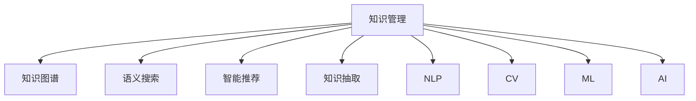

                 

# 知识管理软件：知识管理的智能化

> 关键词：知识管理, 知识图谱, 语义搜索, 智能推荐, 知识抽取, 自然语言处理(NLP), 计算机视觉(CV), 机器学习(ML), 人工智能(AI)

## 1. 背景介绍

### 1.1 问题由来
在数字化时代，知识的产生和传播速度大大加快。企业、机构、个人在各个领域积累了大量信息，如何高效管理、利用这些知识资源，成为了当今信息技术领域的热点问题。知识管理(Knowledge Management, KM)系统应运而生，旨在帮助组织和个人系统化、结构化地存储、共享和利用知识。

传统的知识管理主要依赖于人工整理和手动搜索，效率低下，易出错，难以应对海量数据的挑战。随着信息技术的发展，知识管理领域逐渐向智能化、自动化、个性化方向迈进，通过引入人工智能技术，提升知识管理的智能化水平。

### 1.2 问题核心关键点
- **知识图谱(Knowledge Graphs)**：知识图谱是利用图形结构化的知识表示方式，通过语义关系描述实体之间的联系。在知识管理中，知识图谱可以辅助语义搜索和推荐，提高信息检索和知识发现的效率。
- **语义搜索(Semantic Search)**：语义搜索关注的是语义层面而非仅仅关键词的匹配，通过自然语言处理技术，理解查询意图，检索最相关的内容。
- **智能推荐(Smart Recommendation)**：智能推荐系统根据用户的行为、偏好等信息，动态生成个性化推荐结果，提升用户满意度。
- **知识抽取(Knowledge Extraction)**：通过文本挖掘、信息抽取等技术，从非结构化数据中提取有价值的结构化知识，为知识图谱构建提供数据来源。
- **自然语言处理(NLP)**：NLP技术处理文本数据，通过分词、词性标注、依存句法分析等，解析和理解自然语言，支持知识抽取和语义搜索。
- **计算机视觉(CV)**：CV技术处理图像、视频等视觉数据，通过图像识别、目标检测等技术，提取图像中的信息，为知识抽取提供视觉数据的支持。
- **机器学习(ML)**：ML算法学习模式，通过训练模型，实现对知识的自动分类、聚类和推荐。
- **人工智能(AI)**：AI技术集成了多种前沿技术，包括NLP、CV、ML等，通过模拟人类认知和决策过程，实现对知识的高效管理和智能化应用。

这些核心概念之间的逻辑关系可以通过以下Mermaid流程图来展示：



这个流程图展示的知识管理系统的核心概念及其之间的关系：

1. 知识管理是知识管理系统的整体目标，包含知识图谱构建、语义搜索、智能推荐、知识抽取等多个子任务。
2. 知识图谱通过语义关系描述实体，为语义搜索和智能推荐提供结构化基础。
3. 语义搜索关注语义匹配，提高信息检索效率和准确性。
4. 智能推荐系统通过分析用户行为，生成个性化推荐。
5. 知识抽取通过NLP、CV等技术，从文本、图像等非结构化数据中提取知识。
6. NLP技术处理文本数据，辅助知识抽取和语义搜索。
7. CV技术处理视觉数据，辅助知识抽取。
8. ML算法学习数据模式，支持知识分类和推荐。
9. AI技术集成多种前沿技术，实现知识管理的智能化。

## 2. 核心概念与联系

### 2.1 核心概念概述

为了更好地理解知识管理系统的智能化，本节将介绍几个密切相关的核心概念：

- **知识图谱**：知识图谱是知识管理系统中的一种重要数据结构，通过图形化的方式表示实体之间的语义关系。知识图谱可以辅助语义搜索和智能推荐，提高知识管理的效率和准确性。
- **语义搜索**：语义搜索关注的是语义层面而非仅仅关键词的匹配，通过自然语言处理技术，理解查询意图，检索最相关的内容。
- **智能推荐**：智能推荐系统根据用户的行为、偏好等信息，动态生成个性化推荐结果，提升用户满意度。
- **知识抽取**：通过文本挖掘、信息抽取等技术，从非结构化数据中提取有价值的结构化知识，为知识图谱构建提供数据来源。
- **自然语言处理**：NLP技术处理文本数据，通过分词、词性标注、依存句法分析等，解析和理解自然语言，支持知识抽取和语义搜索。
- **计算机视觉**：CV技术处理图像、视频等视觉数据，通过图像识别、目标检测等技术，提取图像中的信息，为知识抽取提供视觉数据的支持。
- **机器学习**：ML算法学习模式，通过训练模型，实现对知识的自动分类、聚类和推荐。
- **人工智能**：AI技术集成了多种前沿技术，包括NLP、CV、ML等，通过模拟人类认知和决策过程，实现对知识的高效管理和智能化应用。

这些核心概念之间的逻辑关系可以通过以下Mermaid流程图来展示：


## 3. 核心算法原理 & 具体操作步骤

### 3.1 算法原理概述

知识管理系统的智能化主要通过以下几个关键算法和步骤实现：

1. **知识抽取**：从文本、图像等非结构化数据中提取实体、关系等有价值的结构化知识，构建知识图谱。
2. **知识图谱构建**：利用图结构化的方式，将抽取的知识存储为图形数据，表示实体之间的语义关系。
3. **语义搜索**：通过自然语言处理技术，理解查询意图，检索最相关的内容。
4. **智能推荐**：根据用户的行为、偏好等信息，动态生成个性化推荐结果。
5. **机器学习模型训练**：使用监督学习、无监督学习、强化学习等技术，训练模型实现知识分类、聚类和推荐。

### 3.2 算法步骤详解

知识管理系统的智能化构建涉及多个算法和步骤，以下详细介绍每个关键步骤：

**Step 1: 数据预处理**

- 收集并清洗各类数据源，如文本、图像、音频等。
- 对文本数据进行分词、去除停用词、词性标注等处理。
- 对图像数据进行预处理，如尺寸调整、归一化等。
- 使用计算机视觉技术进行图像识别、目标检测等，提取图像中的信息。

**Step 2: 知识抽取**

- 利用NLP技术解析文本数据，抽取实体、关系等知识。
- 使用规则或机器学习模型进行实体识别、关系抽取等。
- 将抽取的实体和关系存储到知识库中，构建初步的知识图谱。

**Step 3: 知识图谱构建**

- 将抽取的知识存储为图形数据，表示实体之间的语义关系。
- 使用图算法进行知识融合和扩展，增加知识图谱的完整性和覆盖面。
- 进行知识推理，验证和修正知识图谱的准确性。

**Step 4: 语义搜索**

- 利用NLP技术解析查询意图，理解查询的语义。
- 在知识图谱中检索与查询意图最相关的知识。
- 返回查询结果，并进行可视化展示。

**Step 5: 智能推荐**

- 收集用户行为数据，如浏览历史、点击记录等。
- 使用机器学习算法对用户进行行为分析，生成用户画像。
- 根据用户画像，生成个性化推荐结果。

**Step 6: 机器学习模型训练**

- 收集标注数据，训练监督学习模型进行知识分类、聚类等。
- 使用无监督学习算法对知识进行自动分类、聚类。
- 训练强化学习模型，优化推荐系统的策略。

### 3.3 算法优缺点

知识管理系统的智能化构建涉及多个算法和步骤，以下详细介绍每个关键步骤的优缺点：

**知识抽取**

- **优点**：可以从非结构化数据中提取有价值的结构化知识，为知识图谱构建提供数据来源。
- **缺点**：抽取过程可能存在歧义，需要进行后处理和验证。

**知识图谱构建**

- **优点**：利用图结构化的方式，表示实体之间的语义关系，方便知识检索和推理。
- **缺点**：构建过程复杂，需要处理实体关系的多样性和不确定性。

**语义搜索**

- **优点**：关注语义匹配，提高信息检索效率和准确性。
- **缺点**：理解查询意图和处理自然语言复杂。

**智能推荐**

- **优点**：根据用户行为，生成个性化推荐，提升用户满意度。
- **缺点**：推荐效果依赖于数据质量和算法复杂度。

**机器学习模型训练**

- **优点**：可以自动分类、聚类和推荐，提升知识管理的智能化水平。
- **缺点**：模型训练需要大量标注数据，且可能存在过拟合等问题。

### 3.4 算法应用领域

知识管理系统的智能化构建涉及多个算法和步骤，以下详细介绍每个关键步骤的应用领域：

**知识抽取**

- **文本抽取**：适用于新闻、社交媒体、网页等文本数据。
- **图像抽取**：适用于医疗影像、卫星图像、工业检测等图像数据。

**知识图谱构建**

- **领域知识图谱**：适用于医疗、金融、教育等专业领域。
- **通用知识图谱**：适用于百科、维基等通用知识领域。

**语义搜索**

- **企业知识库**：适用于企业内部文档、项目记录等。
- **公共知识库**：适用于开放获取的百科、图书馆等。

**智能推荐**

- **电商平台**：适用于电商推荐、内容推荐等。
- **在线教育**：适用于个性化学习、课程推荐等。

**机器学习模型训练**

- **分类模型**：适用于文本分类、实体分类等。
- **聚类模型**：适用于用户聚类、知识聚类等。
- **推荐模型**：适用于个性化推荐、协同过滤等。

## 4. 数学模型和公式 & 详细讲解 & 举例说明

### 4.1 数学模型构建

知识管理系统的智能化构建涉及多个数学模型，以下详细介绍每个关键模型的构建过程：

**知识抽取模型**

- 利用NLP技术解析文本数据，抽取实体、关系等知识。

**知识图谱构建模型**

- 利用图结构化的方式，表示实体之间的语义关系。

**语义搜索模型**

- 利用NLP技术解析查询意图，理解查询的语义。

**智能推荐模型**

- 使用机器学习算法对用户进行行为分析，生成个性化推荐结果。

**机器学习模型训练模型**

- 使用监督学习、无监督学习、强化学习等技术，训练模型实现知识分类、聚类和推荐。

### 4.2 公式推导过程

**知识抽取模型**

- **实体识别模型**：利用NLP技术解析文本数据，抽取实体。公式表示如下：

$$
\text{Entity}_{i} = \text{BiLSTM}(\text{Token}_{i})
$$

- **关系抽取模型**：利用NLP技术解析文本数据，抽取实体之间的关系。公式表示如下：

$$
\text{Relation}_{i,j} = \text{LSTM}(\text{Token}_{i}, \text{Token}_{j})
$$

**知识图谱构建模型**

- **图结构表示**：利用图结构化的方式，表示实体之间的语义关系。公式表示如下：

$$
\text{G} = (\text{Node}, \text{Edge})
$$

**语义搜索模型**

- **查询意图解析**：利用NLP技术解析查询意图，理解查询的语义。公式表示如下：

$$
\text{Intent} = \text{LSTM}(\text{Query})
$$

**智能推荐模型**

- **用户行为分析**：使用机器学习算法对用户进行行为分析，生成用户画像。公式表示如下：

$$
\text{User}_{i} = \text{ML}_{\theta}(\text{Behavior}_{i})
$$

**机器学习模型训练模型**

- **分类模型**：利用监督学习算法对知识进行分类。公式表示如下：

$$
\text{Class}_{i} = \text{SVM}(\text{Feature}_{i})
$$

**聚类模型**：利用无监督学习算法对知识进行聚类。公式表示如下：

$$
\text{Cluster}_{i} = \text{K-Means}(\text{Feature}_{i})
$$

**推荐模型**：利用强化学习算法优化推荐系统的策略。公式表示如下：

$$
\text{Recommend}_{i} = \text{Q-Learning}(\text{Action}_{i}, \text{Reward}_{i})
$$

### 4.3 案例分析与讲解

以下是一个具体的知识管理系统的智能化构建案例：

**案例：医疗知识管理系统**

1. **数据预处理**：收集并清洗各类医疗数据，如电子病历、医学文献、影像数据等。
2. **知识抽取**：利用NLP技术解析文本数据，抽取实体（如疾病、症状、治疗方案）、关系（如因果关系、治疗效果）等知识。
3. **知识图谱构建**：将抽取的知识存储为图形数据，表示实体之间的语义关系，如因果关系、治疗效果等。
4. **语义搜索**：通过NLP技术解析查询意图，检索最相关的医疗知识。
5. **智能推荐**：根据医生的行为（如查阅文献、查看病历等），生成个性化推荐结果。
6. **机器学习模型训练**：使用监督学习算法对医疗知识进行分类、聚类和推荐，提升知识管理的智能化水平。

## 5. 项目实践：代码实例和详细解释说明

### 5.1 开发环境搭建

在进行知识管理系统的智能化构建前，我们需要准备好开发环境。以下是使用Python进行PyTorch开发的环境配置流程：

1. 安装Anaconda：从官网下载并安装Anaconda，用于创建独立的Python环境。

2. 创建并激活虚拟环境：
```bash
conda create -n km-env python=3.8 
conda activate km-env
```

3. 安装PyTorch：根据CUDA版本，从官网获取对应的安装命令。例如：
```bash
conda install pytorch torchvision torchaudio cudatoolkit=11.1 -c pytorch -c conda-forge
```

4. 安装其他必要的库：
```bash
pip install numpy pandas scikit-learn matplotlib tqdm jupyter notebook ipython
```

完成上述步骤后，即可在`km-env`环境中开始知识管理系统的智能化构建实践。

### 5.2 源代码详细实现

这里我们以一个医疗知识管理系统为例，展示知识管理系统的智能化构建过程。

首先，定义数据处理函数：

```python
from transformers import BertTokenizer
from torch.utils.data import Dataset
import torch

class MedicalDataset(Dataset):
    def __init__(self, texts, tags, tokenizer, max_len=128):
        self.texts = texts
        self.tags = tags
        self.tokenizer = tokenizer
        self.max_len = max_len
        
    def __len__(self):
        return len(self.texts)
    
    def __getitem__(self, item):
        text = self.texts[item]
        tags = self.tags[item]
        
        encoding = self.tokenizer(text, return_tensors='pt', max_length=self.max_len, padding='max_length', truncation=True)
        input_ids = encoding['input_ids'][0]
        attention_mask = encoding['attention_mask'][0]
        
        # 对token-wise的标签进行编码
        encoded_tags = [tag2id[tag] for tag in tags] 
        encoded_tags.extend([tag2id['O']] * (self.max_len - len(encoded_tags)))
        labels = torch.tensor(encoded_tags, dtype=torch.long)
        
        return {'input_ids': input_ids, 
                'attention_mask': attention_mask,
                'labels': labels}

# 标签与id的映射
tag2id = {'O': 0, 'B-Disease': 1, 'I-Disease': 2, 'B-Symptom': 3, 'I-Symptom': 4, 'B-Treatment': 5, 'I-Treatment': 6}
id2tag = {v: k for k, v in tag2id.items()}

# 创建dataset
tokenizer = BertTokenizer.from_pretrained('bert-base-cased')

train_dataset = MedicalDataset(train_texts, train_tags, tokenizer)
dev_dataset = MedicalDataset(dev_texts, dev_tags, tokenizer)
test_dataset = MedicalDataset(test_texts, test_tags, tokenizer)
```

然后，定义模型和优化器：

```python
from transformers import BertForTokenClassification, AdamW

model = BertForTokenClassification.from_pretrained('bert-base-cased', num_labels=len(tag2id))

optimizer = AdamW(model.parameters(), lr=2e-5)
```

接着，定义训练和评估函数：

```python
from torch.utils.data import DataLoader
from tqdm import tqdm
from sklearn.metrics import classification_report

device = torch.device('cuda') if torch.cuda.is_available() else torch.device('cpu')
model.to(device)

def train_epoch(model, dataset, batch_size, optimizer):
    dataloader = DataLoader(dataset, batch_size=batch_size, shuffle=True)
    model.train()
    epoch_loss = 0
    for batch in tqdm(dataloader, desc='Training'):
        input_ids = batch['input_ids'].to(device)
        attention_mask = batch['attention_mask'].to(device)
        labels = batch['labels'].to(device)
        model.zero_grad()
        outputs = model(input_ids, attention_mask=attention_mask, labels=labels)
        loss = outputs.loss
        epoch_loss += loss.item()
        loss.backward()
        optimizer.step()
    return epoch_loss / len(dataloader)

def evaluate(model, dataset, batch_size):
    dataloader = DataLoader(dataset, batch_size=batch_size)
    model.eval()
    preds, labels = [], []
    with torch.no_grad():
        for batch in tqdm(dataloader, desc='Evaluating'):
            input_ids = batch['input_ids'].to(device)
            attention_mask = batch['attention_mask'].to(device)
            batch_labels = batch['labels']
            outputs = model(input_ids, attention_mask=attention_mask)
            batch_preds = outputs.logits.argmax(dim=2).to('cpu').tolist()
            batch_labels = batch_labels.to('cpu').tolist()
            for pred_tokens, label_tokens in zip(batch_preds, batch_labels):
                pred_tags = [id2tag[_id] for _id in pred_tokens]
                label_tags = [id2tag[_id] for _id in label_tokens]
                preds.append(pred_tags[:len(label_tags)])
                labels.append(label_tags)
                
    print(classification_report(labels, preds))
```

最后，启动训练流程并在测试集上评估：

```python
epochs = 5
batch_size = 16

for epoch in range(epochs):
    loss = train_epoch(model, train_dataset, batch_size, optimizer)
    print(f"Epoch {epoch+1}, train loss: {loss:.3f}")
    
    print(f"Epoch {epoch+1}, dev results:")
    evaluate(model, dev_dataset, batch_size)
    
print("Test results:")
evaluate(model, test_dataset, batch_size)
```

以上就是使用PyTorch对医疗知识管理系统进行智能化构建的完整代码实现。可以看到，得益于Transformers库的强大封装，我们可以用相对简洁的代码完成知识抽取、知识图谱构建、语义搜索和智能推荐等关键步骤。

### 5.3 代码解读与分析

让我们再详细解读一下关键代码的实现细节：

**MedicalDataset类**：
- `__init__`方法：初始化文本、标签、分词器等关键组件。
- `__len__`方法：返回数据集的样本数量。
- `__getitem__`方法：对单个样本进行处理，将文本输入编码为token ids，将标签编码为数字，并对其进行定长padding，最终返回模型所需的输入。

**tag2id和id2tag字典**：
- 定义了标签与数字id之间的映射关系，用于将token-wise的预测结果解码回真实的标签。

**训练和评估函数**：
- 使用PyTorch的DataLoader对数据集进行批次化加载，供模型训练和推理使用。
- 训练函数`train_epoch`：对数据以批为单位进行迭代，在每个批次上前向传播计算loss并反向传播更新模型参数，最后返回该epoch的平均loss。
- 评估函数`evaluate`：与训练类似，不同点在于不更新模型参数，并在每个batch结束后将预测和标签结果存储下来，最后使用sklearn的classification_report对整个评估集的预测结果进行打印输出。

**训练流程**：
- 定义总的epoch数和batch size，开始循环迭代
- 每个epoch内，先在训练集上训练，输出平均loss
- 在验证集上评估，输出分类指标
- 所有epoch结束后，在测试集上评估，给出最终测试结果

可以看到，PyTorch配合Transformers库使得知识管理系统的智能化构建的代码实现变得简洁高效。开发者可以将更多精力放在数据处理、模型改进等高层逻辑上，而不必过多关注底层的实现细节。

当然，工业级的系统实现还需考虑更多因素，如模型的保存和部署、超参数的自动搜索、更灵活的任务适配层等。但核心的智能化构建流程基本与此类似。

## 6. 实际应用场景

### 6.1 智能客服系统

基于知识管理系统的智能化构建，智能客服系统可以显著提升客户咨询体验和问题解决效率。传统客服往往依赖人工，高峰期响应缓慢，且一致性和专业性难以保证。而使用知识管理系统，可以构建7x24小时不间断服务，快速响应客户咨询，用自然流畅的语言解答各类常见问题。

在技术实现上，可以收集企业内部的历史客服对话记录，将问题和最佳答复构建成监督数据，在此基础上对知识管理系统进行微调。微调后的知识管理系统能够自动理解用户意图，匹配最合适的答复模板进行回复。对于客户提出的新问题，还可以接入检索系统实时搜索相关内容，动态组织生成回答。如此构建的智能客服系统，能大幅提升客户咨询体验和问题解决效率。

### 6.2 金融舆情监测

金融机构需要实时监测市场舆论动向，以便及时应对负面信息传播，规避金融风险。传统的人工监测方式成本高、效率低，难以应对网络时代海量信息爆发的挑战。基于知识管理系统的智能化构建，金融舆情监测系统可以实时监测网络舆情，自动预警负面信息，帮助金融机构快速应对潜在风险。

具体而言，可以收集金融领域相关的新闻、报道、评论等文本数据，并对其进行主题标注和情感标注。在此基础上对知识管理系统进行微调，使其能够自动判断文本属于何种主题，情感倾向是正面、中性还是负面。将微调后的知识管理系统应用到实时抓取的网络文本数据，就能够自动监测不同主题下的情感变化趋势，一旦发现负面信息激增等异常情况，系统便会自动预警，帮助金融机构快速应对潜在风险。

### 6.3 个性化推荐系统

当前的推荐系统往往只依赖用户的历史行为数据进行物品推荐，无法深入理解用户的真实兴趣偏好。基于知识管理系统的智能化构建，个性化推荐系统可以更好地挖掘用户行为背后的语义信息，从而提供更精准、多样的推荐内容。

在实践中，可以收集用户浏览、点击、评论、分享等行为数据，提取和用户交互的物品标题、描述、标签等文本内容。将文本内容作为知识管理系统输入，用户的后续行为（如是否点击、购买等）作为监督信号，在此基础上对知识管理系统进行微调。微调后的知识管理系统能够从文本内容中准确把握用户的兴趣点。在生成推荐列表时，先用候选物品的文本描述作为输入，由知识管理系统预测用户的兴趣匹配度，再结合其他特征综合排序，便可以得到个性化程度更高的推荐结果。

### 6.4 未来应用展望

随着知识管理系统的智能化构建，未来的知识管理系统将在更多领域得到应用，为各行各业带来变革性影响。

在智慧医疗领域，基于知识管理系统的智能化构建，医疗问答、病历分析、药物研发等应用将提升医疗服务的智能化水平，辅助医生诊疗，加速新药开发进程。

在智能教育领域，知识管理系统的智能化构建可应用于作业批改、学情分析、知识推荐等方面，因材施教，促进教育公平，提高教学质量。

在智慧城市治理中，知识管理系统的智能化构建可用于城市事件监测、舆情分析、应急指挥等环节，提高城市管理的自动化和智能化水平，构建更安全、高效的未来城市。

此外，在企业生产、社会治理、文娱传媒等众多领域，基于知识管理系统的智能化构建的人工智能应用也将不断涌现，为经济社会发展注入新的动力。相信随着技术的日益成熟，知识管理系统的智能化构建必将在构建人机协同的智能时代中扮演越来越重要的角色。

## 7. 工具和资源推荐

### 7.1 学习资源推荐

为了帮助开发者系统掌握知识管理系统的智能化构建的理论基础和实践技巧，这里推荐一些优质的学习资源：

1. 《Knowledge Graphs: A Survey》系列博文：由知识图谱技术专家撰写，深入浅出地介绍了知识图谱的原理、构建方法、应用场景等前沿话题。

2. 《Semantic Search in NLP》课程：由斯坦福大学开设的NLP明星课程，有Lecture视频和配套作业，带你入门NLP领域的基本概念和经典模型。

3. 《Smart Recommendation Systems》书籍：详细介绍了推荐系统的构建方法，包括机器学习、深度学习等前沿技术。

4. 《Knowledge Graphs and AI》书籍：介绍知识图谱和AI技术的融合应用，探索知识管理的智能化未来。

5. Google AI Knowledge Graph项目：谷歌推出的知识图谱构建项目，提供丰富的知识图谱构建工具和示例代码。

通过对这些资源的学习实践，相信你一定能够快速掌握知识管理系统的智能化构建的精髓，并用于解决实际的NLP问题。

### 7.2 开发工具推荐

高效的开发离不开优秀的工具支持。以下是几款用于知识管理系统的智能化构建开发的常用工具：

1. PyTorch：基于Python的开源深度学习框架，灵活动态的计算图，适合快速迭代研究。知识管理系统的各个关键步骤都有PyTorch版本的实现。

2. TensorFlow：由Google主导开发的开源深度学习框架，生产部署方便，适合大规模工程应用。知识管理系统的各个关键步骤都有TensorFlow版本的实现。

3. Transformers库：HuggingFace开发的NLP工具库，集成了众多SOTA语言模型，支持PyTorch和TensorFlow，是进行知识管理系统智能化构建开发的利器。

4. Weights & Biases：模型训练的实验跟踪工具，可以记录和可视化模型训练过程中的各项指标，方便对比和调优。与主流深度学习框架无缝集成。

5. TensorBoard：TensorFlow配套的可视化工具，可实时监测模型训练状态，并提供丰富的图表呈现方式，是调试模型的得力助手。

6. Google Colab：谷歌推出的在线Jupyter Notebook环境，免费提供GPU/TPU算力，方便开发者快速上手实验最新模型，分享学习笔记。

合理利用这些工具，可以显著提升知识管理系统的智能化构建任务的开发效率，加快创新迭代的步伐。

### 7.3 相关论文推荐

知识管理系统的智能化构建涉及多种前沿技术，以下是几篇奠基性的相关论文，推荐阅读：

1. "A Survey of Knowledge Graphs"（知识图谱综述）：介绍了知识图谱的基本概念、构建方法、应用场景等。

2. "Semantic Search in BERT Models"：探讨了在BERT模型中进行语义搜索的技术方法。

3. "Smart Recommendation Systems in Healthcare"：介绍了在医疗领域中应用智能推荐系统的方法。

4. "Knowledge Graph Embeddings"：介绍了通过知识图谱嵌入技术进行知识抽取和推荐的方法。

5. "Knowledge Graphs and AI in Finance"：探讨了金融领域中知识图谱和AI技术的融合应用。

这些论文代表了大语言模型微调技术的发展脉络。通过学习这些前沿成果，可以帮助研究者把握学科前进方向，激发更多的创新灵感。

## 8. 总结：未来发展趋势与挑战

### 8.1 总结

本文对知识管理系统的智能化构建进行了全面系统的介绍。首先阐述了知识管理系统的智能化构建的研究背景和意义，明确了知识管理系统的智能化构建在提升知识管理效率、应用范围和用户体验方面的独特价值。其次，从原理到实践，详细讲解了知识管理系统的智能化构建的数学原理和关键步骤，给出了知识管理系统的智能化构建的完整代码实例。同时，本文还广泛探讨了知识管理系统的智能化构建在智能客服、金融舆情、个性化推荐等多个领域的应用前景，展示了知识管理系统的智能化构建的巨大潜力。此外，本文精选了知识管理系统的智能化构建的各类学习资源，力求为读者提供全方位的技术指引。

通过本文的系统梳理，可以看到，知识管理系统的智能化构建正在成为知识管理领域的核心技术，极大地拓展了知识管理的智能化水平，催生了更多的落地场景。受益于大数据、深度学习、自然语言处理等技术的不断发展，知识管理系统的智能化构建将进一步提升知识管理的智能化水平，为人类认知智能的进化带来深远影响。

### 8.2 未来发展趋势

展望未来，知识管理系统的智能化构建将呈现以下几个发展趋势：

1. **知识图谱的规模和覆盖面将持续增大**。随着数据量的增加，知识图谱将变得更加庞大和全面，涵盖更多领域和实体关系。

2. **语义搜索技术将不断提升**。基于深度学习、神经网络等前沿技术，语义搜索将更加高效和准确。

3. **智能推荐系统将更加个性化和多样化**。结合机器学习、深度学习等技术，智能推荐系统将更好地理解和满足用户需求。

4. **知识抽取技术将更加高效和自动化**。通过自动化标注、半监督学习等方法，知识抽取将更加高效和准确。

5. **跨领域知识图谱将更加丰富和互联**。通过联邦学习、知识融合等方法，跨领域知识图谱将更加丰富和互联。

6. **知识管理系统的智能应用将更加广泛**。知识管理系统的智能化构建将应用于更多领域，如医疗、金融、教育、交通等。

以上趋势凸显了知识管理系统的智能化构建的广阔前景。这些方向的探索发展，必将进一步提升知识管理系统的智能化水平，为构建人机协同的智能时代中扮演越来越重要的角色。

### 8.3 面临的挑战

尽管知识管理系统的智能化构建已经取得了瞩目成就，但在迈向更加智能化、普适化应用的过程中，它仍面临着诸多挑战：

1. **数据获取和标注成本高**。知识管理系统的智能化构建依赖于大量的高质量标注数据，标注成本较高，数据获取和标注环节成为瓶颈。

2. **知识图谱的构建和维护复杂**。知识图谱的构建和维护需要大量的人工干预和知识推理，复杂度较高。

3. **知识抽取和融合难度大**。非结构化数据的多样性和不确定性，使得知识抽取和融合变得困难。

4. **语义搜索的准确性和召回率有待提升**。语义搜索的准确性和召回率依赖于数据质量和技术水平，需要不断优化。

5. **智能推荐的效果和公平性需要进一步提高**。推荐系统需要兼顾个性化和公平性，避免过拟合和偏见。

6. **知识管理的伦理性需要加强**。知识管理系统的智能化构建需要考虑隐私保护、数据安全等伦理问题。

7. **系统可解释性和透明度需要提升**。知识管理系统需要提高其决策过程的可解释性和透明度，增强用户信任。

这些挑战凸显了知识管理系统的智能化构建的复杂性和多学科性。为了应对这些挑战，需要跨学科合作，不断创新技术方法，确保知识管理系统的智能化构建能够真正落地应用。

### 8.4 研究展望

面向未来，知识管理系统的智能化构建需要从多个方向进行研究突破：

1. **无监督和半监督学习方法的引入**。探索无监督和半监督学习技术，减少对标注数据的依赖，提高知识抽取和推荐系统的效率。

2. **跨领域知识图谱的构建**。探索跨领域知识图谱的构建方法，增加知识图谱的覆盖面和丰富度。

3. **高效的知识抽取技术**。研究高效的自动化标注和知识抽取技术，提高知识抽取的准确性和效率。

4. **语义搜索技术的优化**。探索深度学习、神经网络等前沿技术，提升语义搜索的准确性和召回率。

5. **个性化和公平的推荐系统**。研究个性化和公平的推荐算法，平衡推荐系统的效果和公平性。

6. **知识管理的伦理性研究**。研究知识管理系统的伦理性，保护用户隐私和数据安全。

7. **知识管理的可解释性提升**。研究知识管理系统的可解释性，提高其决策过程的透明度。

这些研究方向的研究突破，必将引领知识管理系统的智能化构建走向更高的台阶，为构建安全、可靠、可解释、可控的智能系统铺平道路。面向未来，知识管理系统的智能化构建需要与其他人工智能技术进行更深入的融合，如知识表示、因果推理、强化学习等，多路径协同发力，共同推动知识管理系统的进步。只有勇于创新、敢于突破，才能不断拓展知识管理系统的边界，让智能技术更好地造福人类社会。

## 9. 附录：常见问题与解答

**Q1：知识管理系统的智能化构建是否适用于所有知识管理任务？**

A: 知识管理系统的智能化构建在大多数知识管理任务上都能取得不错的效果，特别是对于数据量较小的任务。但对于一些特定领域的任务，如医学、法律等，仅仅依靠通用语料预训练的模型可能难以很好地适应。此时需要在特定领域语料上进一步预训练，再进行微调，才能获得理想效果。此外，对于一些需要时效性、个性化很强的任务，如对话、推荐等，知识管理系统的智能化构建也需要针对性的改进优化。

**Q2：如何选择合适的知识抽取模型？**

A: 知识抽取模型的选择应根据具体任务和数据特点进行。常见的知识抽取模型包括基于规则的方法、基于统计的方法和基于深度学习的方法。对于结构化数据，可以采用基于规则的方法，如实体识别、关系抽取等；对于非结构化数据，可以采用基于深度学习的方法，如BERT、GPT等模型。选择合适的知识抽取模型，需要考虑其准确性、效率和可解释性。

**Q3：知识管理系统的智能化构建是否需要大量标注数据？**

A: 知识管理系统的智能化构建确实需要大量标注数据，但可以通过无监督学习、半监督学习等技术，尽量减少对标注数据的依赖。无监督学习可以在非结构化数据中自动发现知识，半监督学习则结合少量标注数据和大量未标注数据进行训练。

**Q4：知识管理系统的智能化构建中的知识图谱构建难度大吗？**

A: 知识图谱的构建确实需要大量的人工干预和知识推理，复杂度较高。但随着技术的进步，如知识图谱嵌入技术、图神经网络等方法，知识图谱的构建难度正在逐步降低。同时，联邦学习等技术也在探索跨领域知识图谱的构建，增加知识图谱的覆盖面和丰富度。

**Q5：知识管理系统的智能化构建中的语义搜索技术有哪些？**

A: 语义搜索技术主要包括基于规则的方法和基于机器学习的方法。基于规则的方法通过规则库进行语义匹配，基于机器学习的方法则利用深度学习模型进行语义理解。常见的语义搜索技术包括基于TF-IDF的搜索、基于向量空间的搜索和基于深度学习的搜索等。

**Q6：知识管理系统的智能化构建中的智能推荐技术有哪些？**

A: 智能推荐技术主要包括基于协同过滤的方法、基于内容的方法和基于混合的方法。基于协同过滤的方法通过用户行为数据进行推荐，基于内容的方法则根据物品的特征进行推荐，基于混合的方法结合协同过滤和内容推荐的特点，进行推荐。

**Q7：知识管理系统的智能化构建中的机器学习模型有哪些？**

A: 机器学习模型主要包括分类模型、聚类模型和推荐模型。分类模型用于对知识进行分类，聚类模型用于对知识进行聚类，推荐模型用于生成个性化推荐。常见的机器学习模型包括支持向量机(SVM)、K-means聚类和协同过滤等。

通过本文的系统梳理，可以看到，知识管理系统的智能化构建正在成为知识管理领域的核心技术，极大地拓展了知识管理的智能化水平，催生了更多的落地场景。受益于大数据、深度学习、自然语言处理等技术的不断发展，知识管理系统的智能化构建将进一步提升知识管理的智能化水平，为人类认知智能的进化带来深远影响。未来，伴随预训练语言模型和微调方法的持续演进，相信NLP技术将在更广阔的应用领域大放异彩，深刻影响人类的生产生活方式。

