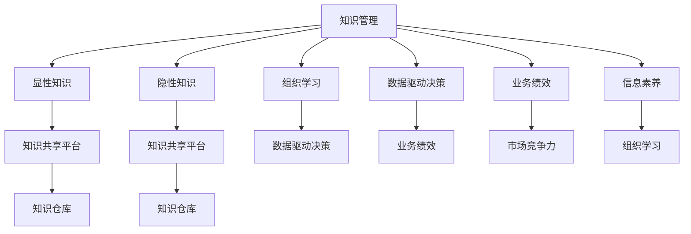

                 

# 知识管理：管理者的核心能力

> 关键词：知识管理,核心能力,人工智能,大数据,信息素养,组织学习,数据驱动决策

## 1. 背景介绍

### 1.1 问题由来

在信息爆炸的现代社会，组织和个体面对海量信息的挑战日益严峻。如何有效管理和利用这些信息，提升知识创造和共享效率，成为企业管理者亟需解决的核心问题。知识管理（Knowledge Management, KM）便是在这一背景下产生的一门重要学科，它通过系统化的方法和工具，帮助组织和个体识别、捕获、整合、存储和利用知识资源，以实现更高效的业务绩效和决策支持。

### 1.2 问题核心关键点

知识管理的目标在于通过知识的有效管理和利用，提升组织的学习能力和创新能力。其核心关键点包括：

- 识别和捕获知识：通过各种手段和方法，将显性知识和隐性知识转化为可管理和可应用的知识资源。
- 整合和存储知识：对捕获的知识进行整理和分类，构建知识库，便于检索和使用。
- 共享和利用知识：通过知识共享平台，促进知识在组织内外的流动和应用，支持知识创造和创新。
- 评估和改进知识管理流程：不断优化知识管理的策略和工具，确保知识管理的有效性。

### 1.3 问题研究意义

研究知识管理的核心能力，对于提升组织的学习能力、创新能力和业务绩效具有重要意义：

1. **提升学习效率**：通过有效的知识管理，组织可以快速获取所需知识，减少信息搜寻和理解成本。
2. **促进创新**：知识管理能够汇聚多方智慧，激发创新灵感，推动技术突破和商业模式创新。
3. **优化决策过程**：数据驱动的决策需要以高质量、高可靠性的知识为基础，知识管理能够为决策提供有力支撑。
4. **增强组织竞争力**：知识是企业的核心资产，有效的知识管理能够提升企业的市场响应速度和竞争力。
5. **提升信息素养**：知识管理不仅关注知识的获取和利用，还强调个体信息素养和组织学习文化的建设。

## 2. 核心概念与联系

### 2.1 核心概念概述

为更好地理解知识管理的核心能力，本节将介绍几个密切相关的核心概念：

- **知识管理(Knowledge Management)**：指通过系统化的手段和工具，识别、捕获、整合、存储和利用知识资源，以实现知识共享和创造的过程。
- **显性知识(Explicit Knowledge)**：可以通过语言、文字、图像等形式明确表达的知识，容易编码和传递。
- **隐性知识(Tacit Knowledge)**：存储于个人经验和认知中，难以通过文字形式完全表达的知识，如技能、直觉、价值观等。
- **知识共享平台(Knowledge Sharing Platform)**：提供知识交流和协作的平台，如内部Wiki、论坛、社交网络等。
- **知识仓库(Knowledge Repository)**：存储组织内部知识资源的数据库，支持快速检索和利用。
- **组织学习(Organizational Learning)**：指组织通过学习机制，不断适应外部环境变化，提升自身能力和竞争力的过程。
- **数据驱动决策(Data-Driven Decision Making)**：基于数据和分析结果，而非直觉或经验，进行科学决策的过程。

这些核心概念之间的逻辑关系可以通过以下Mermaid流程图来展示：



这个流程图展示了知识管理的核心概念及其之间的关系：

1. 知识管理通过显性知识和隐性知识的捕获和整合，构建知识仓库。
2. 知识共享平台和知识仓库支持知识的交流和利用。
3. 组织学习通过知识管理，提升自身能力和竞争力。
4. 数据驱动决策依赖于知识管理的支持和信息素养能力的提升。

## 3. 核心算法原理 & 具体操作步骤

### 3.1 算法原理概述

知识管理的核心算法原理主要包括以下几个方面：

- **知识捕获与编码**：通过问卷调查、访谈、观察等方式，识别组织内部的显性知识和隐性知识，将其转化为可编码的形式，存储到知识仓库中。
- **知识整合与分类**：对捕获的知识进行整理和分类，构建知识目录，便于后续检索和利用。
- **知识共享与协作**：建立知识共享平台，促进知识在组织内外的流动，支持知识创造和创新。
- **知识利用与反馈**：利用知识管理工具，支持知识在业务决策中的应用，并通过反馈机制不断优化知识管理流程。

### 3.2 算法步骤详解

知识管理的具体操作步骤可以总结如下：

**Step 1: 知识识别与捕获**
- 通过问卷调查、访谈、观察等方式，识别组织内部的显性知识和隐性知识。
- 对识别的知识进行编码和存储，转化为可管理和可应用的知识资源。

**Step 2: 知识整合与分类**
- 对捕获的知识进行整理和分类，构建知识目录，便于后续检索和利用。
- 使用分类算法和聚类算法，对知识进行自动分类和标记。

**Step 3: 知识共享与协作**
- 建立知识共享平台，支持知识在组织内外的交流和协作。
- 设计知识共享的流程和机制，鼓励知识创造和分享。

**Step 4: 知识利用与反馈**
- 利用知识管理工具，支持知识在业务决策中的应用。
- 收集知识应用的效果反馈，不断优化知识管理流程和工具。

### 3.3 算法优缺点

知识管理的算法具有以下优点：
1. 提升组织学习效率：通过系统化的方法和工具，提升知识的获取和利用效率。
2. 促进创新：汇聚多方智慧，激发创新灵感，推动技术突破和商业模式创新。
3. 优化决策过程：数据驱动的决策需要以高质量、高可靠性的知识为基础，知识管理能够为决策提供有力支撑。
4. 增强组织竞争力：知识是企业的核心资产，有效的知识管理能够提升企业的市场响应速度和竞争力。
5. 提升信息素养：知识管理不仅关注知识的获取和利用，还强调个体信息素养和组织学习文化的建设。

同时，知识管理也存在一定的局限性：
1. 高昂的实施成本：知识管理的实施需要投入大量人力、物力和时间，成本较高。
2. 知识质量依赖：知识管理的成效很大程度上依赖于知识的质量和适用性，低质量知识可能造成误导。
3. 组织文化阻力：知识管理需要改变组织文化，推动知识创造和共享，存在一定阻力。
4. 信息过载风险：大量的知识和信息可能造成信息过载，影响知识的有效管理和利用。
5. 数据隐私与安全问题：知识管理涉及大量敏感信息，需注意数据隐私和安全保护。

### 3.4 算法应用领域

知识管理的应用领域非常广泛，主要包括以下几个方面：

- **企业组织管理**：支持企业内部知识的识别、捕获、整合、共享和利用，提升组织的学习能力和创新能力。
- **教育培训**：通过知识管理，提升教学质量和培训效果，促进知识和技能的学习和传播。
- **医疗健康**：支持医疗健康领域知识的共享和利用，提升医疗服务质量和患者满意度。
- **公共服务**：提升政府和公共机构的知识管理能力，支持公共决策和政策制定。
- **信息技术**：支持IT领域的知识管理，推动技术创新和产品开发。

## 4. 数学模型和公式 & 详细讲解 & 举例说明

### 4.1 数学模型构建

知识管理模型的构建需要考虑多个因素，包括知识来源、知识类型、知识需求等。以下是一个简单的知识管理数学模型：

设知识管理模型为 $KM$，知识库为 $K$，知识需求为 $D$，知识共享平台为 $S$。知识管理模型的目标函数为：

$$
\min_{KM} \sum_{i=1}^n \ell(KM_i, K_i, D_i, S_i)
$$

其中，$KM_i$ 表示知识管理模型对知识库 $K_i$ 中第 $i$ 个知识的处理结果，$D_i$ 表示第 $i$ 个知识的需求，$S_i$ 表示第 $i$ 个知识在共享平台上的应用效果。

### 4.2 公式推导过程

知识管理模型中，常用的评估指标包括：

- **知识准确度(Accuracy)**：知识处理结果与知识需求的一致性。
- **知识覆盖率(Coverage)**：知识处理结果覆盖知识需求的程度。
- **知识共享效果(Sharing Effect)**：知识共享平台上的知识应用效果。

设 $A$ 为知识准确度，$C$ 为知识覆盖率，$S_E$ 为知识共享效果，则知识管理模型可以表示为：

$$
KM = \arg\min_{KM} \lambda_1 \ell_A(KM_i, K_i, D_i) + \lambda_2 \ell_C(KM_i, K_i, D_i) + \lambda_3 \ell_{S_E}(KM_i, S_i)
$$

其中，$\lambda_1$、$\lambda_2$、$\lambda_3$ 为各指标的权重系数，$\ell_A$、$\ell_C$、$\ell_{S_E}$ 分别为准确度、覆盖率、共享效果的损失函数。

### 4.3 案例分析与讲解

以一个简单的企业组织管理为例，分析知识管理模型的构建和应用。

设企业组织管理知识库 $K$ 包含多个部门的知识 $K_1, K_2, \ldots, K_n$。每个部门的知识需求 $D_i$ 和共享效果 $S_i$ 可以通过问卷调查和反馈获得。知识管理模型 $KM$ 的输出为每个部门的知识处理结果 $KM_i$。

假设企业知识管理的目标是最小化知识准确度损失、覆盖率损失和共享效果损失：

$$
KM = \arg\min_{KM} \sum_{i=1}^n (\lambda_1 |KM_i - D_i| + \lambda_2 |K_i - KM_i| + \lambda_3 |S_i - KM_i|)
$$

其中，$\lambda_1$ 表示知识准确度的权重，$\lambda_2$ 表示知识覆盖率的权重，$\lambda_3$ 表示知识共享效果的权重。

## 5. 项目实践：代码实例和详细解释说明

### 5.1 开发环境搭建

在进行知识管理项目实践前，我们需要准备好开发环境。以下是使用Python进行PyTorch开发的环境配置流程：

1. 安装Anaconda：从官网下载并安装Anaconda，用于创建独立的Python环境。

2. 创建并激活虚拟环境：
```bash
conda create -n km-env python=3.8 
conda activate km-env
```

3. 安装PyTorch：根据CUDA版本，从官网获取对应的安装命令。例如：
```bash
conda install pytorch torchvision torchaudio cudatoolkit=11.1 -c pytorch -c conda-forge
```

4. 安装各类工具包：
```bash
pip install numpy pandas scikit-learn matplotlib tqdm jupyter notebook ipython
```

完成上述步骤后，即可在`km-env`环境中开始知识管理项目实践。

### 5.2 源代码详细实现

下面我们以企业组织管理为例，给出使用PyTorch进行知识管理的PyTorch代码实现。

首先，定义知识管理模型：

```python
import torch
from torch import nn

class KnowledgeManagementModel(nn.Module):
    def __init__(self, n, d_in, d_out):
        super(KnowledgeManagementModel, self).__init__()
        self.layers = nn.Sequential(
            nn.Linear(d_in, 128),
            nn.ReLU(),
            nn.Linear(128, 64),
            nn.ReLU(),
            nn.Linear(64, d_out)
        )
        
    def forward(self, x):
        return self.layers(x)
```

然后，定义数据集和模型参数：

```python
from sklearn.datasets import make_classification
from sklearn.model_selection import train_test_split

# 生成随机知识数据
X, y = make_classification(n_samples=1000, n_features=10, n_classes=2, random_state=42)
X_train, X_test, y_train, y_test = train_test_split(X, y, test_size=0.2, random_state=42)

# 定义模型参数
d_in = X.shape[1]
d_out = y.shape[1]
model = KnowledgeManagementModel(n=X.shape[0], d_in=d_in, d_out=d_out)
```

接着，定义损失函数和优化器：

```python
from torch import optim

# 定义损失函数
criterion = nn.CrossEntropyLoss()

# 定义优化器
optimizer = optim.SGD(model.parameters(), lr=0.01)
```

最后，训练模型并在测试集上评估：

```python
# 定义训练函数
def train_model(model, X_train, y_train, X_test, y_test, n_epochs=10, batch_size=32):
    criterion = nn.CrossEntropyLoss()
    optimizer = optim.SGD(model.parameters(), lr=0.01)
    
    for epoch in range(n_epochs):
        model.train()
        for i, (inputs, labels) in enumerate(zip(X_train, y_train)):
            optimizer.zero_grad()
            outputs = model(inputs)
            loss = criterion(outputs, labels)
            loss.backward()
            optimizer.step()
            
    # 评估模型
    model.eval()
    with torch.no_grad():
        test_loss = 0
        correct = 0
        for inputs, labels in zip(X_test, y_test):
            outputs = model(inputs)
            test_loss += criterion(outputs, labels).item()
            _, predicted = torch.max(outputs.data, 1)
            correct += (predicted == labels).sum().item()
        test_loss /= len(X_test)
        print(f'Test Loss: {test_loss:.4f}, Accuracy: {100 * correct / len(X_test):.2f}%')
```

以上就是使用PyTorch进行企业组织管理知识管理项目开发的完整代码实现。可以看到，通过定义知识管理模型、损失函数和优化器，并调用训练函数，即可完成知识管理的模型训练和评估。

### 5.3 代码解读与分析

让我们再详细解读一下关键代码的实现细节：

**KnowledgeManagementModel类**：
- `__init__`方法：定义知识管理模型的网络结构，包含多个线性层和ReLU激活函数。
- `forward`方法：定义模型的前向传播过程，接受输入并返回模型输出。

**数据集和模型参数**：
- 使用Scikit-learn生成随机知识数据集，将其分为训练集和测试集。
- 定义知识管理模型的输入和输出维度，初始化模型参数。

**损失函数和优化器**：
- 定义交叉熵损失函数和随机梯度下降优化器。

**训练函数**：
- 在每个epoch内，对训练集进行迭代，计算损失并反向传播更新模型参数。
- 在测试集上评估模型的准确度。

可以看到，知识管理模型的实现并不复杂，主要通过定义模型结构、损失函数和优化器，并调用训练函数，即可完成模型的训练和评估。

当然，工业级的系统实现还需考虑更多因素，如模型的保存和部署、超参数的自动搜索、更灵活的任务适配层等。但核心的知识管理模型开发流程基本与此类似。

## 6. 实际应用场景

### 6.1 企业组织管理

基于知识管理的组织管理，可以显著提升企业的学习效率和创新能力。传统组织管理依赖于领导者的直觉和经验，难以系统化、规范化的管理知识资源。通过知识管理，企业可以构建系统化的知识库，支持知识在组织内的快速共享和应用，提升整体的知识水平和竞争力。

在技术实现上，企业可以通过知识管理平台，收集、整理、存储和利用知识资源。知识管理平台应具备以下功能：

1. **知识捕获与编码**：提供问卷调查、访谈、文档上传等工具，自动识别和编码知识。
2. **知识整合与分类**：构建知识目录，支持知识分类和搜索。
3. **知识共享与协作**：提供知识共享平台，支持协作和讨论。
4. **知识利用与反馈**：通过业务决策支持系统，将知识应用于业务决策，收集反馈信息，优化知识管理流程。

### 6.2 教育培训

教育培训是知识管理的重要应用领域。通过知识管理，教育机构可以系统化地收集和利用教学资源，提升教学质量和培训效果。

在教育培训中，知识管理主要体现在以下几个方面：

1. **课程资源管理**：收集、整理和存储教学资源，构建课程库，支持教师和学生查找和使用。
2. **教学设计支持**：提供知识管理工具，支持教学设计，提升教学内容的质量和多样性。
3. **学习效果评估**：通过知识管理工具，评估学生的学习效果，提供个性化的学习建议。

### 6.3 医疗健康

在医疗健康领域，知识管理能够支持医疗知识的学习和传播，提升医疗服务的质量和效率。

医疗健康中的知识管理主要体现在以下几个方面：

1. **医疗知识库**：构建医疗知识库，存储医学文献、诊疗指南、患者病历等知识资源。
2. **知识共享平台**：提供知识共享平台，支持医生之间的交流和协作。
3. **知识应用于临床**：通过电子病历系统，将知识应用于临床决策，提升诊疗水平。
4. **远程医疗支持**：通过知识管理平台，支持远程医疗服务，提升医疗服务的可及性和效率。

### 6.4 未来应用展望

随着知识管理技术的不断演进，未来在更多领域将得到广泛应用，为各行各业带来变革性影响。

在智慧城市治理中，知识管理将支持城市事件监测、舆情分析、应急指挥等环节，提高城市管理的自动化和智能化水平，构建更安全、高效的未来城市。

在智慧农业中，知识管理将支持农业生产过程的知识管理，提升农业生产效率和质量，推动农业数字化转型。

在智能制造中，知识管理将支持制造过程的知识管理，提升生产效率和产品质量，推动制造业的智能化和数字化。

此外，在金融、物流、航空等诸多领域，知识管理也将发挥重要作用，提升行业的服务水平和竞争力。

## 7. 工具和资源推荐

### 7.1 学习资源推荐

为了帮助开发者系统掌握知识管理的核心能力，这里推荐一些优质的学习资源：

1. 《知识管理的实践》系列博文：由知识管理专家撰写，深入浅出地介绍了知识管理的基本概念和实践方法。

2. 《知识管理与企业竞争优势》课程：通过在线课程学习知识管理的理论基础和应用策略。

3. 《知识管理的未来》书籍：探讨知识管理的发展趋势和前沿技术，提供知识管理的未来展望。

4. 《知识管理的案例研究》系列文章：通过具体案例分析，展示知识管理在不同领域的应用和效果。

5. 《知识管理工具指南》：提供各种知识管理工具的使用方法和最佳实践，支持知识管理的落地实施。

通过对这些资源的学习实践，相信你一定能够快速掌握知识管理的核心能力，并用于解决实际的管理问题。

### 7.2 开发工具推荐

高效的开发离不开优秀的工具支持。以下是几款用于知识管理开发的常用工具：

1. Confluence：Atlassian提供的知识管理工具，支持文档协作和知识共享。

2. SharePoint：Microsoft的知识管理平台，支持文件管理、搜索和协作。

3. Alfresco：开源的知识管理工具，支持内容管理和知识共享。

4. CKAN：用于数据管理和共享的开放平台，支持数据集和API的发布和管理。

5. ElasticSearch：高性能的搜索引擎，支持大规模知识库的构建和搜索。

6. Apache Solr：另一个高性能的搜索引擎，支持复杂查询和分布式部署。

合理利用这些工具，可以显著提升知识管理的开发效率，加快创新迭代的步伐。

### 7.3 相关论文推荐

知识管理的研究源于学界的持续探索。以下是几篇奠基性的相关论文，推荐阅读：

1. 《组织中的知识管理：战略、信息系统、文化和动态》：探讨了知识管理在组织中的战略、系统和文化，提出了知识管理的基本框架。

2. 《知识管理的五个阶段：构建知识管理组织的路线图》：提出了知识管理的五个阶段模型，指导企业在不同阶段构建知识管理框架。

3. 《知识共享和组织学习：一种面向组织的管理视角》：探讨了知识共享和组织学习的基本概念和机制，提出了知识管理的关键要素。

4. 《数据驱动的知识管理：从数据到知识的路径》：探讨了数据驱动的知识管理方法，提出了从数据到知识的路径。

5. 《智能知识管理：AI在知识管理中的应用》：探讨了AI技术在知识管理中的应用，提出了基于AI的知识管理新范式。

这些论文代表了大规模知识管理的研究脉络，通过学习这些前沿成果，可以帮助研究者把握学科前进方向，激发更多的创新灵感。

## 8. 总结：未来发展趋势与挑战

### 8.1 研究成果总结

本文对知识管理的核心能力进行了全面系统的介绍。首先阐述了知识管理的背景和意义，明确了知识管理在提升组织学习效率、促进创新和优化决策过程等方面的重要价值。其次，从原理到实践，详细讲解了知识管理的数学模型和具体操作步骤，给出了知识管理项目开发的完整代码实例。同时，本文还广泛探讨了知识管理在企业组织管理、教育培训、医疗健康等多个领域的应用前景，展示了知识管理技术的广阔前景。此外，本文精选了知识管理的各类学习资源，力求为读者提供全方位的技术指引。

通过本文的系统梳理，可以看到，知识管理技术已经成为提升组织学习效率和创新能力的重要手段。未来，伴随知识管理技术的不断发展，组织和个体将能更高效地获取和利用知识资源，推动组织和社会的智能化进步。

### 8.2 未来发展趋势

展望未来，知识管理技术将呈现以下几个发展趋势：

1. **智能化知识管理**：通过AI技术，提升知识管理的智能化水平，实现知识自动编码、分类和检索。

2. **多模态知识管理**：结合文本、图像、音频等多模态信息，构建更全面、准确的知识模型。

3. **个性化知识管理**：通过AI技术，实现个性化推荐和智能搜索，提升知识管理的用户体验。

4. **数据驱动的知识管理**：利用大数据和AI技术，实现知识管理的数据驱动决策，提升知识管理的科学性和效率。

5. **协作知识管理**：通过AI技术，实现跨组织、跨领域的知识协作，构建更广泛的知识网络。

6. **实时知识管理**：利用实时数据流和AI技术，实现知识的实时更新和应用，提升知识管理的动态性和响应速度。

以上趋势凸显了知识管理技术的广阔前景。这些方向的探索发展，必将进一步提升知识管理的智能化和自动化水平，为组织和个体带来更高效、更灵活的知识管理体验。

### 8.3 面临的挑战

尽管知识管理技术已经取得了显著成就，但在迈向更加智能化、普适化应用的过程中，它仍面临着诸多挑战：

1. **数据隐私与安全问题**：知识管理涉及大量敏感信息，需注意数据隐私和安全保护。

2. **知识质量依赖**：知识管理的成效很大程度上依赖于知识的质量和适用性，低质量知识可能造成误导。

3. **组织文化阻力**：知识管理需要改变组织文化，推动知识创造和共享，存在一定阻力。

4. **信息过载风险**：大量的知识和信息可能造成信息过载，影响知识的有效管理和利用。

5. **知识管理工具的集成与互操作**：不同知识管理工具的集成和互操作，是一个重要的技术挑战。

6. **知识管理与业务流程的融合**：知识管理需与业务流程紧密结合，实现知识管理的业务价值。

正视知识管理面临的这些挑战，积极应对并寻求突破，将是大规模知识管理走向成熟的必由之路。相信随着学界和产业界的共同努力，这些挑战终将一一被克服，知识管理必将在构建人机协同的智能社会中扮演越来越重要的角色。

### 8.4 研究展望

面对知识管理面临的种种挑战，未来的研究需要在以下几个方面寻求新的突破：

1. **AI技术在知识管理中的应用**：开发更加智能化的知识管理工具，利用AI技术实现知识自动编码、分类和检索。

2. **多模态知识管理技术**：结合文本、图像、音频等多模态信息，构建更全面、准确的知识模型。

3. **个性化推荐技术**：通过AI技术，实现个性化推荐和智能搜索，提升知识管理的用户体验。

4. **数据驱动的知识管理**：利用大数据和AI技术，实现知识管理的数据驱动决策，提升知识管理的科学性和效率。

5. **协作知识管理技术**：通过AI技术，实现跨组织、跨领域的知识协作，构建更广泛的知识网络。

6. **实时知识管理技术**：利用实时数据流和AI技术，实现知识的实时更新和应用，提升知识管理的动态性和响应速度。

这些研究方向的应用，必将引领知识管理技术迈向更高的台阶，为组织和个体带来更高效、更灵活的知识管理体验。面向未来，知识管理技术还需要与其他人工智能技术进行更深入的融合，如知识表示、因果推理、强化学习等，多路径协同发力，共同推动知识管理的进步。只有勇于创新、敢于突破，才能不断拓展知识管理的边界，让智能技术更好地造福人类社会。

## 9. 附录：常见问题与解答

**Q1：知识管理是否适用于所有组织类型？**

A: 知识管理在大多数组织类型中都具有适用性，但需要根据组织的具体特点进行定制化设计。例如，对于高度集权的组织，知识管理需要更多自上而下的推动；对于分散的组织，需要更多的基层员工参与和激励。

**Q2：知识管理是否能够降低组织的运营成本？**

A: 知识管理在一定程度上可以降低组织的运营成本。通过知识共享和协作，减少重复工作，提高工作效率。但知识管理的实施成本较高，需要考虑其收益和成本的平衡。

**Q3：知识管理是否能够提升组织的创新能力？**

A: 知识管理可以显著提升组织的创新能力。通过系统化管理知识资源，汇聚多方智慧，激发创新灵感，推动技术突破和商业模式创新。但知识管理的成效也取决于组织文化、领导层支持等因素。

**Q3：知识管理是否能够提升组织的决策质量？**

A: 知识管理能够显著提升组织的决策质量。数据驱动的决策需要高质量、高可靠性的知识为基础，知识管理能够为决策提供有力支撑。但知识管理的成效也取决于知识的质量和适用性。

**Q4：知识管理是否能够提升组织的学习能力？**

A: 知识管理可以显著提升组织的学习能力。通过系统化管理知识资源，支持知识共享和利用，提升整体的知识水平和竞争力。但知识管理的成效也取决于组织文化、领导层支持等因素。

**Q5：知识管理是否能够提升组织的竞争优势？**

A: 知识管理可以显著提升组织的竞争优势。知识是企业的核心资产，有效的知识管理能够提升企业的市场响应速度和竞争力。但知识管理的成效也取决于知识的质量和适用性。

这些问题的解答展示了知识管理技术在实际应用中的重要性，同时也指出了知识管理技术在实施过程中需要注意的多个关键点。希望通过本文的介绍，能够帮助读者更好地理解知识管理技术的核心能力和应用前景。

---

作者：禅与计算机程序设计艺术 / Zen and the Art of Computer Programming

