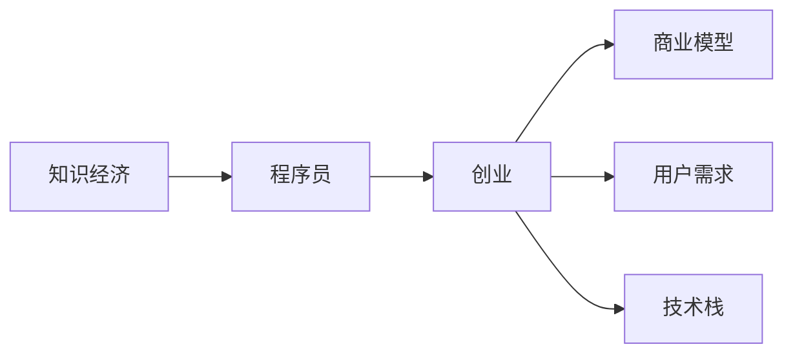

                 

# 知识经济下程序员的创业之道

## 1. 背景介绍

在当前的知识经济时代，信息技术成为了经济发展的新引擎。随着人工智能、大数据、云计算等技术的快速发展和应用，程序员正在逐渐成为社会创新和创业的重要力量。然而，传统创业路径已经逐渐丧失优势，新型创业模式正在悄然兴起。

在这个背景下，程序员如何把握时代脉搏，把握机遇，实现自我价值的最大化，是摆在我们面前的一大挑战。本文将从程序员创业的背景、现状和趋势，以及创业所需的知识技能和资源配置等方面进行探讨。

## 2. 核心概念与联系

### 2.1 核心概念概述

在分析程序员创业路径之前，我们需要首先了解以下核心概念：

- **知识经济（Knowledge Economy）**：以知识、技术和信息为基础的经济形态，是信息社会的核心表现。

- **程序员（Programmer）**：专注于编写、测试、维护代码的专业人员，是信息技术创新和应用的核心力量。

- **创业（Entrepreneurship）**：以创新和创造为核心，通过整合资源，创造价值的过程。

- **商业模型（Business Model）**：定义企业的价值主张、客户群体、盈利模式等关键要素的框架。

- **用户需求（User Needs）**：创业者需要根据市场需求和技术趋势，识别并满足用户的实际需求。

- **技术栈（Tech Stack）**：创业者需要掌握和整合各类技术工具和框架，以支撑产品开发和业务运营。

### 2.2 核心概念原理和架构的 Mermaid 流程图



## 3. 核心算法原理 & 具体操作步骤

### 3.1 算法原理概述

程序员创业的流程可以抽象为一个算法过程。该算法过程由多个步骤组成，包括市场分析、产品设计、团队组建、融资以及市场推广等。

- **市场分析**：识别潜在客户、市场需求和技术趋势。
- **产品设计**：根据用户需求和技术栈，设计产品功能和原型。
- **团队组建**：组建技术、运营、市场等团队，分责合作。
- **融资**：通过风险投资、天使投资、自筹等方式获取启动资金。
- **市场推广**：通过线上线下渠道，推广产品和服务，提升品牌影响力。

### 3.2 算法步骤详解

#### 3.2.1 市场分析

市场分析是创业的第一步，也是最关键的一步。需要从以下三个方面入手：

- **潜在客户分析**：定义目标用户群体，研究其需求、痛点和消费习惯。
- **市场需求分析**：通过问卷调查、用户访谈等方式，获取用户反馈，明确市场需求。
- **技术趋势分析**：关注行业内的技术动态，识别技术热点和未来趋势。

#### 3.2.2 产品设计

产品设计需要紧密结合用户需求和技术栈，确保产品的可行性和竞争力。

- **需求采集与梳理**：通过用户调研和访谈，收集需求并整理成需求列表。
- **功能设计**：根据需求列表，设计产品功能，确定产品架构和原型。
- **技术栈选择**：根据功能需求和技术栈，选择合适的技术工具和框架。

#### 3.2.3 团队组建

一个成功的创业项目离不开一支高效、协作的团队。

- **核心团队组建**：根据产品设计和市场需求，组建技术、产品、运营、市场等核心团队。
- **角色分工与协作**：明确各角色的职责和工作流程，确保团队高效协作。
- **人才招聘与培养**：通过招聘和内部培训，不断提升团队成员的能力和水平。

#### 3.2.4 融资

融资是创业项目的重要环节，需要通过多渠道获取启动资金。

- **风险投资**：与风险投资机构对接，获取资金和资源支持。
- **天使投资**：与天使投资者洽谈，获取早期融资。
- **自筹资金**：通过个人储蓄、借款等方式筹集启动资金。

#### 3.2.5 市场推广

市场推广是创业项目的最后一步，也是最终能否成功的关键。

- **线上渠道推广**：通过社交媒体、博客、邮件等方式，推广产品和服务。
- **线下渠道推广**：通过展会、广告、合作伙伴等方式，拓展市场渠道。
- **品牌建设与维护**：通过品牌建设、用户评价等方式，提升品牌影响力和客户信任度。

### 3.3 算法优缺点

程序员创业的算法过程具有以下优点：

- **灵活性和创新性**：程序员对技术趋势有深入了解，能够快速响应市场需求，实现创新突破。
- **资源优化**：程序员可以根据项目需求，灵活调配资源，优化成本和效率。
- **团队协作高效**：程序员在技术团队中往往具备高度协作和沟通能力，能快速解决问题。

同时，该算法也存在一些局限：

- **市场风险**：市场需求和用户反馈存在不确定性，可能导致项目失败。
- **技术风险**：技术栈和工具的选择不当，可能导致项目开发延期或成本增加。
- **资金风险**：融资困难或资金使用不当，可能导致项目资金链断裂。

### 3.4 算法应用领域

程序员创业的算法过程广泛适用于各种类型的创业项目，包括但不限于：

- **软件开发**：开发各类应用程序、软件工具、平台等。
- **硬件开发**：研发各类智能硬件、传感器、芯片等。
- **数据科学**：进行数据分析、数据挖掘、机器学习等。
- **网络安全**：开发网络安全产品、服务、解决方案等。
- **区块链技术**：研发区块链应用、智能合约、去中心化解决方案等。

## 4. 数学模型和公式 & 详细讲解 & 举例说明

### 4.1 数学模型构建

在进行程序员创业的算法过程中，我们可以建立一个数学模型来描述整个过程。假设市场分析、产品设计、团队组建、融资和市场推广的时间分别为 $T_1, T_2, T_3, T_4, T_5$，每个过程所需的资源分别为 $R_1, R_2, R_3, R_4, R_5$。则整个创业过程的数学模型可以表示为：

$$
M = \sum_{i=1}^{5} T_i \times R_i
$$

其中，$M$ 为整个创业过程的总成本和总时间。

### 4.2 公式推导过程

假设每个过程的时间成本和资源成本都是线性的，即：

$$
T_i = t_i + k_i \times R_i
$$

其中，$t_i$ 为每个过程的基础时间，$k_i$ 为时间与资源的比例系数。

将上式代入创业过程的数学模型中，可以得到：

$$
M = \sum_{i=1}^{5} (t_i + k_i \times R_i) \times R_i = \sum_{i=1}^{5} (t_i \times R_i + k_i \times R_i^2)
$$

### 4.3 案例分析与讲解

以软件开发项目为例，假设每个过程的基础时间为10天，时间与资源的比例系数为0.1，每个过程所需的资源分别为：

- 市场分析：100人天
- 产品设计：200人天
- 团队组建：150人天
- 融资：50人天
- 市场推广：100人天

代入上述公式，可以得到：

$$
M = 10 \times 100 + 0.1 \times 100^2 + 10 \times 200 + 0.1 \times 200^2 + 10 \times 150 + 0.1 \times 150^2 + 10 \times 50 + 0.1 \times 50^2 + 10 \times 100 + 0.1 \times 100^2
$$

计算得到：

$$
M = 2100 + 0.1 \times 10000 + 2000 + 0.1 \times 40000 + 1500 + 0.1 \times 22500 + 500 + 0.1 \times 2500 + 1000 + 0.1 \times 10000
$$

$$
M = 49500
$$

## 5. 项目实践：代码实例和详细解释说明

### 5.1 开发环境搭建

在进行程序员创业项目开发之前，需要先搭建开发环境。以下是使用Python进行Django Web应用开发的开发环境搭建步骤：

1. 安装Python：从官网下载并安装Python。
2. 安装Django：使用pip安装Django框架。
3. 创建Django项目：使用Django命令行工具创建项目。
4. 安装依赖包：使用pip安装所需依赖包，如MySQLdb、Pillow等。
5. 配置数据库：配置MySQL数据库连接信息。
6. 部署项目：使用Nginx部署项目，设置访问权限。

### 5.2 源代码详细实现

以下是一个简单的Django Web应用的代码实现：

```python
from django.http import HttpResponse
from django.views.decorators.csrf import csrf_exempt

@csrf_exempt
def index(request):
    return HttpResponse('Hello, World!')
```

### 5.3 代码解读与分析

代码解析：

- `from django.http import HttpResponse`：导入Django提供的HTTP响应类。
- `from django.views.decorators.csrf import csrf_exempt`：导入Django提供的CSRF防护装饰器。
- `@csrf_exempt`：装饰器用于 exempt CSRF防护。
- `def index(request)`：定义视图函数，接收HTTP请求对象。
- `return HttpResponse('Hello, World!')`：返回一个HTTP响应，内容为"Hello, World!"。

## 6. 实际应用场景

### 6.1 互联网金融

互联网金融是程序员创业的重要领域之一，主要包括：

- **互联网支付**：开发支付系统、跨境支付、支付安全等应用。
- **互联网理财**：开发理财平台、智能投顾、风险评估等应用。
- **互联网信贷**：开发信贷系统、信用评分、反欺诈检测等应用。
- **互联网保险**：开发保险产品、理赔系统、风险管理等应用。

### 6.2 智能家居

智能家居是程序员创业的新兴领域，主要包括：

- **智能安防**：开发智能门锁、监控系统、报警系统等应用。
- **智能家电**：开发智能冰箱、空调、洗衣机等家电产品。
- **智能照明**：开发智能灯泡、灯光控制系统等应用。
- **智能环境**：开发智能温控、湿度控制、空气质量检测等应用。

### 6.3 大数据分析

大数据分析是程序员创业的重要方向之一，主要包括：

- **数据采集**：开发数据采集工具、API接口等。
- **数据清洗**：开发数据清洗工具、数据预处理算法等。
- **数据分析**：开发数据分析工具、机器学习算法等。
- **数据可视化**：开发数据可视化工具、报表生成工具等。

## 7. 工具和资源推荐

### 7.1 学习资源推荐

1. **《Python编程从入门到实践》**：系统介绍Python编程语言和常用库，适合初学者入门。
2. **《深度学习》**：介绍深度学习的基础理论和应用实例，适合进阶学习。
3. **《计算机网络》**：介绍计算机网络的基本原理和实现技术，适合了解网络编程。
4. **《设计模式》**：介绍常用的软件设计模式，适合学习软件架构和设计思路。
5. **《大数据技术与应用》**：介绍大数据的基本概念、技术和应用实例，适合了解大数据分析。

### 7.2 开发工具推荐

1. **Visual Studio Code**：流行的代码编辑器，支持多种编程语言和插件扩展。
2. **PyCharm**：专业的Python开发工具，支持调试、版本控制、测试等功能。
3. **JIRA**：项目管理工具，支持任务分配、进度跟踪、文档管理等功能。
4. **Git**：版本控制系统，支持代码版本控制、协作开发等功能。
5. **Docker**：容器化工具，支持应用部署、微服务架构等。

### 7.3 相关论文推荐

1. **《编程革命》**：介绍了编程语言和技术的发展历程，适合理解程序员创业的底层原理。
2. **《Web开发实战》**：介绍了Web开发的常用技术和框架，适合开发Web应用。
3. **《区块链技术应用》**：介绍了区块链的基本原理和应用场景，适合开发区块链应用。
4. **《人工智能与大数据》**：介绍了人工智能和大数据的基本概念和应用实例，适合了解前沿技术。

## 8. 总结：未来发展趋势与挑战

### 8.1 总结

本文从程序员创业的背景、现状和趋势，以及创业所需的知识技能和资源配置等方面进行了全面系统的探讨。通过深入分析程序员创业的算法过程，我们可以看到，编程技能和算法思维在其中发挥了至关重要的作用。

程序员创业不仅需要掌握编程技能，还需要具备市场分析、产品设计、团队组建、融资和市场推广等方面的知识和技能。只有全面发展，才能在知识经济下把握机遇，实现自我价值的最大化。

### 8.2 未来发展趋势

未来，程序员创业将呈现以下发展趋势：

- **人工智能与大数据**：人工智能和大数据技术将广泛应用于各个领域，为程序员提供更多创新机会。
- **区块链与去中心化**：区块链技术将带来去中心化的商业模式和全新的价值生态。
- **物联网与智能硬件**：物联网和智能硬件将开启全新的应用场景，为程序员提供更多发展空间。
- **5G与边缘计算**：5G网络和边缘计算技术将推动大数据、AI等技术的应用，带来更多创新可能性。
- **云计算与边缘计算**：云计算和边缘计算技术将提供更加灵活和高效的应用环境，为程序员提供更多平台支持。

### 8.3 面临的挑战

程序员创业在未来的发展过程中，仍面临以下挑战：

- **技术快速发展**：技术更新速度快，程序员需要不断学习新技术和工具。
- **市场竞争激烈**：市场竞争激烈，需要具备强大的市场敏锐性和创新能力。
- **资源配置困难**：资源配置和成本控制是创业中的重要问题，需要精细化管理和高效利用。
- **融资难**：创业初期的融资难度较大，需要具备良好的商业计划和风险控制能力。
- **人才流失**：创业公司的人才流失率较高，需要构建良好的团队文化和激励机制。

### 8.4 研究展望

面对程序员创业所面临的挑战，未来的研究方向可以包括以下几个方面：

- **创业教育**：加强对程序员的创业教育，培养具备市场分析、产品设计、团队管理、融资等综合能力的人才。
- **技术孵化平台**：搭建技术孵化平台，提供技术支持、市场资源、融资渠道等，加速技术转化和创业落地。
- **创新生态**：构建创新生态系统，促进技术交流和合作，推动技术创新和创业突破。
- **市场开拓**：加强市场开拓和品牌建设，提升产品影响力和市场份额。
- **用户体验**：关注用户体验和产品迭代，提升用户满意度和忠诚度。

## 9. 附录：常见问题与解答

**Q1：程序员创业需要哪些关键技能？**

A：程序员创业需要具备以下关键技能：

- **技术技能**：掌握编程语言、框架、工具等技术技能。
- **市场分析**：能够分析市场趋势、识别用户需求。
- **产品设计**：具备产品设计能力，能够设计符合市场需求的产品。
- **团队管理**：具备团队管理和协作能力，能够组建和领导高效团队。
- **融资能力**：具备融资和资金管理能力，能够获取启动资金。
- **市场推广**：具备市场推广能力，能够提升产品品牌和市场份额。

**Q2：程序员创业需要哪些资源？**

A：程序员创业需要以下资源：

- **技术资源**：计算机、服务器、网络等硬件资源。
- **人力资源**：团队成员、顾问等人力资源。
- **资金资源**：启动资金、运营资金等资金资源。
- **市场资源**：客户、合作伙伴、供应商等市场资源。
- **时间资源**：创业时间、产品开发时间等时间资源。

**Q3：程序员创业面临哪些风险？**

A：程序员创业面临以下风险：

- **市场风险**：市场需求和用户反馈存在不确定性。
- **技术风险**：技术栈和工具的选择不当，可能导致项目开发延期或成本增加。
- **资金风险**：融资困难或资金使用不当，可能导致项目资金链断裂。
- **人才风险**：团队成员离职、技术瓶颈等问题，可能导致项目中断。
- **市场竞争风险**：市场竞争激烈，可能导致项目失败。

**Q4：程序员创业如何降低风险？**

A：程序员创业可以采取以下措施降低风险：

- **市场调研**：进行充分的市场调研和用户分析，明确市场需求。
- **技术评估**：评估技术栈和工具的可行性和可靠性，选择合适的技术和工具。
- **资金规划**：制定合理的资金使用计划，控制成本和风险。
- **人才管理**：构建合理的团队管理和激励机制，留住优秀人才。
- **风险控制**：进行风险评估和管理，制定应急预案和风险应对策略。

通过全面掌握程序员创业的算法过程和所需资源，并针对性地采取风险控制措施，程序员可以在知识经济下把握机遇，实现自我价值的最大化。

