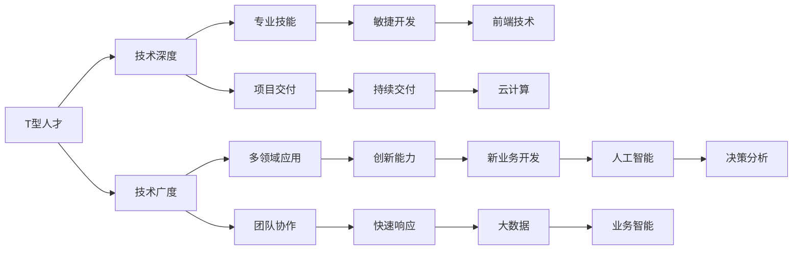

                 

# 知识经济下程序员的职业转型策略

在知识经济的时代，技术的快速迭代和市场需求的不断变化对程序员提出了更高的要求。编程不仅是技术活，更是一种综合能力的表现。随着人工智能、大数据、区块链等前沿技术的不断成熟，程序员的职业转型变得更加重要。本文将系统地探讨知识经济下程序员的职业转型策略，从技术、管理、创新等多个维度进行分析，帮助程序员在职业道路上持续进步和突破。

## 1. 背景介绍

### 1.1 问题由来
随着技术的发展和市场的变化，传统的软件开发模式已经无法满足现代企业的需求。企业在面对不断变化的市场环境时，需要快速响应，实现业务的敏捷开发和创新。对于程序员来说，仅掌握一种编程语言或技术栈已经不足以应对现代软件开发的要求。新技术的快速迭代要求程序员不断学习和转型，以适应新的技术需求。

### 1.2 问题核心关键点
程序员职业转型是一个复杂的过程，需要从多个角度进行考虑和规划。核心关键点包括：
1. **技术栈扩展**：掌握多种编程语言和技术栈，提升技术深度和广度。
2. **项目管理能力**：提升项目管理和团队协作能力，适应敏捷开发的需求。
3. **创新能力**：培养创新思维，应对新业务和新技术挑战。
4. **学习能力**：持续学习新知识，跟上技术发展的步伐。

## 2. 核心概念与联系

### 2.1 核心概念概述

在探讨程序员职业转型策略之前，首先需要理解几个核心概念：

1. **T型人才**：T型人才在专业领域有较深知识（T型中的竖线），同时在多个领域（T型中的横线）有广泛的了解和应用能力。
2. **全栈开发**：掌握前端、后端、数据库等全面技术栈，能够独立开发整个系统。
3. **敏捷开发**：采用快速响应需求变化的软件开发方法，强调团队协作和持续交付。
4. **云计算**：利用云平台提供的计算资源和服务，快速部署和扩展应用。
5. **大数据与人工智能**：掌握数据分析和机器学习技术，提升业务分析和决策能力。

### 2.2 核心概念原理和架构的 Mermaid 流程图



这个流程图展示了T型人才在知识经济下的职业路径：技术深度和广度相互支撑，项目交付与敏捷开发协同推进，多领域应用与创新能力相互促进，云计算、大数据和人工智能等技术支持业务智能和决策分析。

## 3. 核心算法原理 & 具体操作步骤

### 3.1 算法原理概述

程序员职业转型的核心算法原理在于不断学习和应用新技术，提升自身的技术栈和项目管理能力。这涉及以下几个核心步骤：

1. **需求分析**：明确职业转型的目标，分析所需掌握的技术和能力。
2. **学习路径规划**：制定详细的学习计划，包括技术栈扩展、项目管理能力提升等。
3. **持续学习**：通过在线课程、书籍、项目实践等方式，不断学习和积累新知识。
4. **实践应用**：在实际项目中应用新技能，积累经验，提升实战能力。
5. **反馈优化**：根据项目反馈和团队意见，调整学习计划和技术栈。

### 3.2 算法步骤详解

下面详细介绍核心算法步骤的具体操作方法：

**Step 1: 需求分析**
- 明确职业转型的目标：例如，从Java转向Python+Django，或者从后端转向前端开发。
- 分析所需掌握的技能：例如，学习Python语法、Django框架、前端开发技术栈等。

**Step 2: 学习路径规划**
- 制定详细的学习计划：例如，每天学习一小时，每周完成一个项目，每月学习新技术。
- 选择学习资源：例如，选择合适的在线课程、书籍、技术博客等。
- 设定时间节点：例如，三个月内掌握基础语法，六个月内完成一个全栈项目。

**Step 3: 持续学习**
- 利用在线课程和书籍：例如，参加Coursera、Udacity的课程，阅读《Python编程从入门到实践》等书籍。
- 参加技术社区和活动：例如，参加GitHub社区、参加技术讲座和研讨会。
- 实践项目：例如，参与开源项目，或自己动手实现一个小项目。

**Step 4: 实践应用**
- 在实际项目中应用新技能：例如，在已有项目中逐步替换旧技术栈，或实现一个新功能。
- 积累经验：例如，记录项目中的问题和解决方案，编写技术博客。
- 反馈优化：例如，根据项目反馈调整学习计划，改进技术栈。

### 3.3 算法优缺点

基于以上算法，程序员职业转型具有以下优点：
1. **技能提升**：通过系统学习和项目实践，可以快速提升技术栈和项目管理能力。
2. **适应性强**：掌握了多种技能后，能够快速适应不同项目和团队的需求。
3. **市场竞争力**：在竞争激烈的市场中，具备多种技能和项目管理能力将更具竞争力。

同时，也存在以下缺点：
1. **学习成本高**：需要投入大量时间和精力学习新技能。
2. **风险较大**：技能转型过程中可能会遇到技术难题和项目瓶颈。
3. **短期回报低**：新技能的掌握和应用需要时间积累，短期内可能看不到明显效果。

### 3.4 算法应用领域

程序员职业转型策略在多个领域都有广泛的应用：

1. **软件开发**：掌握多种编程语言和技术栈，提升全栈开发能力。
2. **项目管理**：提升项目管理和团队协作能力，适应敏捷开发的需求。
3. **大数据与人工智能**：掌握数据分析和机器学习技术，提升业务分析和决策能力。
4. **云计算**：利用云平台提供的计算资源和服务，快速部署和扩展应用。
5. **区块链**：掌握区块链技术和应用开发能力，开拓新的技术方向。

## 4. 数学模型和公式 & 详细讲解 & 举例说明

### 4.1 数学模型构建

对于程序员职业转型，我们可以构建一个数学模型来描述其学习和转型的过程。假设程序员初始技能水平为 $S_0$，需要达到的目标技能水平为 $S_T$，技能提升的速度为 $v$。则技能提升的数学模型可以表示为：

$$ S(t) = S_0 + vt $$

其中，$t$ 表示时间，$S(t)$ 表示在时间 $t$ 时的技能水平。

### 4.2 公式推导过程

根据上述数学模型，我们可以推导出程序员达到目标技能水平 $S_T$ 所需的时间 $T$：

$$ S_T = S_0 + vT $$
$$ T = \frac{S_T - S_0}{v} $$

这意味着，程序员需要花费一定的时间来提升技能，且所需时间与初始技能水平和提升速度密切相关。

### 4.3 案例分析与讲解

假设一个程序员需要从Java转型到Python+Django，初始技能水平为 $S_0=3$，目标技能水平为 $S_T=5$，技能提升的速度为 $v=0.5$。则：

$$ T = \frac{5 - 3}{0.5} = 4 $$

这意味着，该程序员需要花费4个月的时间来学习Python和Django，才能达到目标技能水平。

## 5. 项目实践：代码实例和详细解释说明

### 5.1 开发环境搭建

以下是基于Python和Django进行Web开发的开发环境搭建步骤：

1. 安装Python和Django：
```bash
sudo apt-get install python3 python3-pip python3-virtualenv
pip3 install django
```

2. 创建虚拟环境：
```bash
virtualenv env
source env/bin/activate
```

3. 安装依赖包：
```bash
pip3 install Pillow beautifulsoup4
```

4. 创建项目和应用：
```bash
django-admin startproject myproject
cd myproject
python3 manage.py startapp myapp
```

### 5.2 源代码详细实现

以下是使用Django进行Web开发的示例代码：

```python
# views.py
from django.shortcuts import render
from django.http import HttpResponse

def index(request):
    return render(request, 'index.html')

# urls.py
from django.urls import path
from . import views

urlpatterns = [
    path('', views.index, name='index')
]

# settings.py
...
INSTALLED_APPS = [
    'django.contrib.admin',
    'django.contrib.auth',
    'django.contrib.contenttypes',
    'django.contrib.sessions',
    'django.contrib.messages',
    'django.contrib.staticfiles',
    'myapp',
]

# templates/index.html
<!DOCTYPE html>
<html>
<head>
    <title>My App</title>
</head>
<body>
    <h1>Welcome to My App</h1>
</body>
</html>
```

### 5.3 代码解读与分析

**views.py**：定义了一个视图函数 `index`，用于渲染模板 `index.html`。

**urls.py**：定义了URL路由，将请求路由到 `index` 视图函数。

**settings.py**：配置了Django项目的基本设置，包括中间件、应用和模板等。

**templates/index.html**：定义了HTML模板，用于渲染欢迎信息。

### 5.4 运行结果展示

在执行 `python3 manage.py runserver` 命令后，在浏览器中访问 `http://127.0.0.1:8000/`，即可看到欢迎信息。

## 6. 实际应用场景

### 6.1 智能城市

智能城市项目需要程序员具备多种技能，包括云计算、大数据、物联网等。例如，开发智能交通系统需要掌握云平台服务、数据分析和机器学习等技术，实现交通流量预测和优化。

### 6.2 金融科技

金融科技项目需要程序员具备区块链和人工智能等前沿技术。例如，开发数字货币交易所需要掌握区块链技术和智能合约开发能力，实现安全的交易和清算。

### 6.3 医疗健康

医疗健康项目需要程序员具备大数据和自然语言处理技术。例如，开发医疗影像分析系统需要掌握深度学习技术和图像处理算法，实现自动化的病灶检测和诊断。

### 6.4 未来应用展望

随着技术的发展，程序员的职业转型将更加多样化和复杂化。例如，未来可能会出现跨领域的专业人才，如区块链开发+医疗数据分析，或者前端开发+人工智能等复合型人才。此外，区块链技术、量子计算等新兴技术也将带来新的职业机会。

## 7. 工具和资源推荐

### 7.1 学习资源推荐

1. **Coursera**：提供大量课程，涵盖编程、数据科学、人工智能等领域。
2. **Udacity**：提供项目导向的课程，适合提升实战能力。
3. **Pluralsight**：提供丰富的IT培训课程，适合全面提升技术栈。
4. **LeetCode**：提供大量编程题目，适合提升算法和数据结构能力。

### 7.2 开发工具推荐

1. **GitHub**：提供代码托管和协作平台，方便团队开发和代码共享。
2. **Visual Studio Code**：提供丰富的插件和扩展，适合开发Python、Django等项目。
3. **PyCharm**：提供全面的IDE支持，适合开发Java、Python等项目。

### 7.3 相关论文推荐

1. **《程序员如何实现职业转型》**：探讨了程序员职业转型的核心要素和路径。
2. **《全栈开发技术的演进与未来》**：介绍了全栈开发技术的发展历程和应用前景。
3. **《敏捷开发方法与实践》**：探讨了敏捷开发的方法论和实践经验。

## 8. 总结：未来发展趋势与挑战

### 8.1 研究成果总结

本文系统探讨了知识经济下程序员的职业转型策略，从技术栈扩展、项目管理能力提升、创新能力培养等方面进行了详细的分析。通过案例和模型，展示了程序员职业转型的核心算法和操作步骤。

### 8.2 未来发展趋势

知识经济下，程序员的职业转型将更加复杂和多样，涵盖技术栈的不断扩展、项目管理能力的提升、创新能力的培养等。未来可能会出现更多的跨领域专业人才，以及区块链、量子计算等新兴技术带来的职业机会。

### 8.3 面临的挑战

程序员职业转型面临的最大挑战是如何平衡学习和实际工作之间的关系。如何在繁忙的工作中抽时间学习新技术，如何将新技能应用到实际项目中，是程序员需要认真考虑的问题。

### 8.4 研究展望

未来的研究需要探索更加高效的职业转型方法和工具，帮助程序员快速掌握新技能，并在实际项目中应用。同时，需要进一步研究创新能力培养和项目管理能力的提升，为程序员提供更加系统化的职业发展路径。

## 9. 附录：常见问题与解答

**Q1：如何平衡学习和工作之间的关系？**

A: 制定合理的学习计划，利用碎片时间进行学习。例如，每天花一个小时学习，或者利用通勤时间听在线课程。同时，在实际项目中寻找应用新技能的机会，通过实践巩固学习成果。

**Q2：如何快速掌握新技术？**

A: 选择适合自己学习方式的学习资源，如在线课程、书籍、视频等。利用项目实践积累经验，通过问题驱动学习。多参与开源项目和社区活动，获取反馈和指导。

**Q3：如何选择适合自己的学习资源？**

A: 根据学习目标和已有知识水平选择适合的学习资源。参考其他程序员的学习经验，选择课程、书籍和社区等。利用免费试用或课程试听功能，评估资源的质量和适用性。

**Q4：如何提升项目管理能力？**

A: 参加敏捷开发相关的培训和认证，如Scrum Master认证。学习项目管理工具和方法，如JIRA、Trello等。积累实际项目经验，建立项目管理体系。

**Q5：如何应对新技术的快速迭代？**

A: 持续关注行业动态和新技术趋势，保持好奇心和学习热情。定期参加技术讲座和研讨会，获取最新的技术信息和应用案例。建立自己的技术博客或知识库，记录学习心得和技术积累。

---

作者：禅与计算机程序设计艺术 / Zen and the Art of Computer Programming

