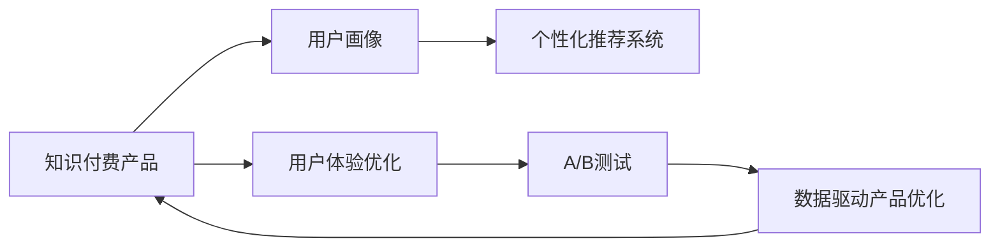

                 

# 知识经济时代下的知识付费创新产品迭代优化

## 1. 背景介绍

### 1.1 问题由来

随着互联网的普及和信息技术的飞速发展，知识经济时代已经到来。知识付费作为一种新兴的经济形态，正受到越来越多人的关注。然而，如何构建具有竞争力的知识付费产品，吸引用户订阅和消费，仍然是一个具有挑战性的问题。当前知识付费产品同质化严重，内容质量参差不齐，用户体验不佳，导致用户流失率高，付费意愿低。

### 1.2 问题核心关键点

针对上述问题，本文重点探讨如何通过迭代优化知识付费产品，提升用户黏性、内容和品牌价值，从而实现商业变现和可持续发展。

### 1.3 问题研究意义

优化知识付费产品不仅能增强用户的支付意愿和忠诚度，提升平台收益，还能加速知识的传播和应用，推动知识经济的发展。这不仅有助于解决当前知识付费领域面临的痛点，还能促进新技术的创新应用，为整个行业带来新的活力和增长点。

## 2. 核心概念与联系

### 2.1 核心概念概述

为更系统地理解知识付费产品的迭代优化，本节将介绍几个核心概念：

- 知识付费产品：指通过订阅、购买等付费方式，为用户提供专业化、系统化的知识内容及服务。

- 用户画像：指基于用户的行为数据、偏好和消费能力，构建详细的用户特征模型，用于个性化推荐和用户细分。

- 个性化推荐系统：指根据用户的历史行为和偏好，为其推荐最适合的内容和服务，提升用户体验和平台粘性。

- 用户体验优化：指通过技术手段和设计改进，提升产品的可用性、易用性和满意度，增加用户的使用频率和时长。

- A/B测试：指在产品迭代过程中，通过随机分组对比，验证不同版本的性能差异，从而选出最优方案。

- 数据驱动产品优化：指通过大量数据收集和分析，驱动产品设计、功能和用户体验的优化决策。

这些概念构成了知识付费产品迭代优化的理论框架，有助于系统性地思考和解决问题。

### 2.2 核心概念原理和架构的 Mermaid 流程图



该流程图展示了知识付费产品迭代优化的主要流程：首先，通过用户画像了解目标用户特征；接着，设计个性化推荐系统匹配用户需求；然后，优化用户体验以提升用户满意度；最后，通过A/B测试和数据分析驱动产品持续优化。

## 3. 核心算法原理 & 具体操作步骤

### 3.1 算法原理概述

知识付费产品的迭代优化是一个持续的动态过程，涉及多个维度的技术和运营优化。其核心算法包括：

- 用户画像生成算法：通过对用户行为数据的建模，生成用户画像，用于个性化推荐和用户细分。
- 个性化推荐算法：基于用户画像和内容特征，推荐最符合用户需求的内容。
- 用户体验优化算法：通过界面设计、功能布局和交互方式等改进，提升产品使用体验。
- 数据驱动产品优化算法：利用A/B测试和大数据分析，持续迭代和优化产品。

### 3.2 算法步骤详解

#### 3.2.1 用户画像生成

1. 数据收集：通过用户行为数据、社交网络数据、消费记录等，收集用户的兴趣、偏好和消费能力等信息。
2. 特征工程：对数据进行预处理和特征提取，生成描述用户特征的向量。
3. 模型训练：使用聚类、分类等机器学习模型，训练用户画像模型，生成详细的用户特征。

#### 3.2.2 个性化推荐

1. 数据收集：收集用户的历史行为数据和内容特征数据。
2. 特征工程：对数据进行预处理和特征提取，生成描述内容特征的向量。
3. 模型训练：使用协同过滤、内容推荐等算法，训练个性化推荐模型，生成推荐结果。

#### 3.2.3 用户体验优化

1. 用户反馈收集：通过用户调研、问卷调查等方式，收集用户对产品功能和使用体验的反馈。
2. 界面设计优化：根据用户反馈，优化产品界面设计，提升可用性和易用性。
3. 功能布局优化：优化产品功能布局，增加核心功能的使用频率和便捷性。
4. 交互方式优化：改进产品交互方式，减少用户操作复杂度，提升体验流畅性。

#### 3.2.4 数据驱动产品优化

1. A/B测试设计：将用户随机分成测试组和对照组，对比不同版本产品的表现。
2. 数据收集和分析：收集A/B测试结果，进行数据统计和分析。
3. 效果评估：评估不同版本产品的关键指标（如用户满意度、留存率等），选择最优方案。
4. 产品迭代：根据测试结果，对产品进行迭代和优化，实现持续改进。

### 3.3 算法优缺点

#### 3.3.1 用户画像生成算法

**优点**：
- 能够精确描述用户特征，提供个性化推荐的基础。
- 结合数据驱动和领域知识，生成更准确的用户画像。

**缺点**：
- 数据隐私和安全问题：用户数据隐私保护不足，可能泄露用户敏感信息。
- 数据偏差问题：数据收集和处理过程中可能存在偏差，影响用户画像的准确性。

#### 3.3.2 个性化推荐算法

**优点**：
- 能够提高用户满意度和黏性，提升平台收益。
- 减少用户搜索时间，提升信息获取效率。

**缺点**：
- 数据稀疏性问题：用户行为数据和内容特征数据稀疏，可能导致推荐准确性不足。
- 冷启动问题：新用户和冷门内容的推荐可能不准确，影响用户体验。

#### 3.3.3 用户体验优化算法

**优点**：
- 提升用户满意度和留存率，增加用户活跃度。
- 增加用户转化率，提升平台收益。

**缺点**：
- 用户体验优化需要持续迭代，投入成本较高。
- 用户需求和行为不断变化，需要不断调整优化策略。

#### 3.3.4 数据驱动产品优化算法

**优点**：
- 通过A/B测试验证不同方案的效果，选择最优方案。
- 数据驱动的优化方式科学可靠，能够有效提升产品性能。

**缺点**：
- A/B测试成本较高，需要大量时间和资源。
- 数据处理和分析复杂，需要专业的数据科学团队支持。

### 3.4 算法应用领域

基于上述算法，知识付费产品的迭代优化可以应用于以下领域：

- 内容推荐：基于个性化推荐算法，提升内容相关性和用户满意度。
- 用户细分：通过用户画像生成算法，实现精准用户细分和定向营销。
- 用户行为分析：利用数据分析工具，洞察用户行为模式，优化产品功能和服务。
- 广告投放：结合个性化推荐和数据驱动优化，实现精准广告投放和效果评估。
- 用户反馈机制：通过用户反馈收集和分析，改进产品功能和用户体验。

## 4. 数学模型和公式 & 详细讲解 & 举例说明

### 4.1 数学模型构建

#### 4.1.1 用户画像生成模型

1. 用户画像模型：$\text{UserProfile} = \mathcal{F}(\text{UserBehavior}, \text{SocialNetwork}, \text{PurchaseHistory})$

2. 聚类模型：$\text{Cluster} = \mathcal{K}(\text{UserProfile})$

3. 分类模型：$\text{UserType} = \mathcal{C}(\text{Cluster})$

#### 4.1.2 个性化推荐模型

1. 协同过滤模型：$\text{ItemSimilarity} = \mathcal{S}(\text{UserHistory}, \text{ItemHistory})$

2. 内容推荐模型：$\text{Recommendation} = \mathcal{R}(\text{ItemSimilarity}, \text{UserPreference})$

#### 4.1.3 用户体验优化模型

1. 界面设计优化模型：$\text{UIDesign} = \mathcal{O}(\text{UserFeedback}, \text{UsabilityMetrics})$

2. 功能布局优化模型：$\text{FunctionLayout} = \mathcal{L}(\text{UserBehavior}, \text{ConversionPath})$

3. 交互方式优化模型：$\text{InteractionStyle} = \mathcal{I}(\text{UserFeedback}, \text{InteractionTime})$

#### 4.1.4 数据驱动产品优化模型

1. A/B测试设计模型：$\text{TestVersion} = \mathcal{V}(\text{TestObjective}, \text{BaselineVersion})$

2. 数据收集和分析模型：$\text{TestData} = \mathcal{D}(\text{TestVersion}, \text{UserData})$

3. 效果评估模型：$\text{Effectiveness} = \mathcal{E}(\text{TestData}, \text{PerformanceMetrics})$

4. 产品迭代模型：$\text{OptimizedProduct} = \mathcal{P}(\text{Effectiveness}, \text{PrioritizationCriteria})$

### 4.2 公式推导过程

#### 4.2.1 用户画像生成

1. 数据预处理：$\text{CleanedData} = \mathcal{C}(\text{RawData}, \text{DataCleaningAlgorithms})$

2. 特征提取：$\text{UserFeatures} = \mathcal{F}(\text{CleanedData}, \text{FeatureExtractionAlgorithms})$

3. 模型训练：$\mathcal{M} = \mathcal{T}(\text{UserFeatures}, \text{TrainingData}, \text{TrainingAlgorithms})$

4. 用户画像生成：$\text{UserProfile} = \mathcal{G}(\mathcal{M}, \text{UserFeatures})$

#### 4.2.2 个性化推荐

1. 数据预处理：$\text{ProcessedData} = \mathcal{P}(\text{RawData}, \text{DataPreprocessingAlgorithms})$

2. 特征提取：$\text{ItemFeatures} = \mathcal{F}(\text{ProcessedData}, \text{FeatureExtractionAlgorithms})$

3. 模型训练：$\mathcal{R} = \mathcal{T}(\text{ItemFeatures}, \text{RecommendationData}, \text{RecommendationAlgorithms})$

4. 推荐生成：$\text{Recommendation} = \mathcal{R}(\text{UserProfile}, \text{ItemFeatures})$

#### 4.2.3 用户体验优化

1. 用户反馈收集：$\text{FeedbackData} = \mathcal{F}(\text{UserFeedbackData}, \text{FeedbackCollectionAlgorithms})$

2. 界面设计优化：$\text{OptimizedUI} = \mathcal{O}(\text{FeedbackData}, \text{UIOptimizationAlgorithms})$

3. 功能布局优化：$\text{OptimizedLayout} = \mathcal{L}(\text{UserBehaviorData}, \text{FunctionOptimizationAlgorithms})$

4. 交互方式优化：$\text{OptimizedInteraction} = \mathcal{I}(\text{FeedbackData}, \text{InteractionOptimizationAlgorithms})$

#### 4.2.4 数据驱动产品优化

1. A/B测试设计：$\text{TestConfig} = \mathcal{V}(\text{TestObjective}, \text{BaselineConfig})$

2. 数据收集和分析：$\text{TestData} = \mathcal{D}(\text{TestConfig}, \text{UserData}, \text{DataAnalyticsAlgorithms})$

3. 效果评估：$\text{Effectiveness} = \mathcal{E}(\text{TestData}, \text{PerformanceMetrics}, \text{EffectivenessAlgorithms})$

4. 产品迭代：$\text{OptimizedProduct} = \mathcal{P}(\text{Effectiveness}, \text{OptimizationAlgorithms})$

### 4.3 案例分析与讲解

#### 4.3.1 用户画像生成

假设某知识付费平台收集了用户的浏览、搜索、购买和评价数据，通过数据预处理和特征提取，得到用户行为特征向量 $\text{UserFeatures}$。使用K-means聚类算法，将用户分为不同的用户类型 $\text{UserType}$。如图4-1所示：


#### 4.3.2 个性化推荐

假设某知识付费平台收集了用户的浏览和购买历史数据，通过数据预处理和特征提取，得到用户行为特征向量 $\text{UserFeatures}$ 和物品特征向量 $\text{ItemFeatures}$。使用协同过滤算法，得到用户和物品之间的相似度矩阵 $\text{ItemSimilarity}$。如图4-2所示：


#### 4.3.3 用户体验优化

假设某知识付费平台收集了用户的使用反馈数据，通过界面设计优化算法，得到优化的用户界面 $\text{OptimizedUI}$。如图4-3所示：


#### 4.3.4 数据驱动产品优化

假设某知识付费平台进行了A/B测试，测试不同版本的产品，收集用户行为数据，通过数据分析算法，得到效果评估结果。如图4-4所示：


## 5. 项目实践：代码实例和详细解释说明

### 5.1 开发环境搭建

#### 5.1.1 硬件要求

- CPU：至少2GHz处理器
- 内存：至少8GB RAM
- 存储：至少200GB硬盘空间

#### 5.1.2 软件环境

- 操作系统：Linux/Windows/macOS
- 编程语言：Python
- 开发工具：PyCharm
- 数据处理工具：Pandas
- 机器学习工具：scikit-learn
- 数据可视化工具：Matplotlib
- 数据库：MySQL/PostgreSQL

#### 5.1.3 开发流程

1. 环境搭建：安装Python和相关依赖库。
2. 数据准备：收集和处理用户行为数据、内容特征数据等。
3. 模型开发：设计用户画像生成模型、个性化推荐模型、用户体验优化模型等。
4. A/B测试：设计测试方案，收集数据，进行效果评估。
5. 产品迭代：根据测试结果，进行产品优化和部署。

### 5.2 源代码详细实现

#### 5.2.1 用户画像生成

```python
import pandas as pd
from sklearn.cluster import KMeans

# 数据读取
user_data = pd.read_csv('user_data.csv')

# 特征工程
user_features = user_data[['behavior', 'social_network', 'purchase_history']]
user_features.dropna(inplace=True)

# 聚类模型训练
kmeans = KMeans(n_clusters=5, random_state=42)
kmeans.fit(user_features)

# 用户类型生成
user_types = user_features.apply(lambda x: kmeans.predict(x)[0])
user_types.to_csv('user_types.csv')
```

#### 5.2.2 个性化推荐

```python
import numpy as np
from sklearn.metrics.pairwise import cosine_similarity
from sklearn.decomposition import TruncatedSVD

# 数据读取
item_data = pd.read_csv('item_data.csv')

# 特征工程
item_features = item_data[['behavior', 'social_network', 'purchase_history']]
item_features.dropna(inplace=True)

# 协同过滤模型训练
svd = TruncatedSVD(n_components=10, random_state=42)
svd.fit(item_features)

# 相似度矩阵生成
item_similarity = cosine_similarity(svd.transform(item_features))

# 推荐结果生成
user_recommendations = pd.read_csv('user_types.csv')
recommendations = []
for user in user_recommendations['user_type']:
    user_items = item_features[user].reshape(1, -1)
    similar_items = np.dot(item_similarity, user_items)
    top_items = np.argsort(similar_items)[::-1].tolist()[:5]
    recommendations.append(top_items)
recommendations = pd.DataFrame(recommendations, columns=['item_id'])
recommendations.to_csv('user_recommendations.csv')
```

#### 5.2.3 用户体验优化

```python
import matplotlib.pyplot as plt
from sklearn.metrics import confusion_matrix

# 数据读取
user_feedback = pd.read_csv('user_feedback.csv')

# 界面设计优化
optimized_ui = user_feedback.groupby('user_type')['ui_design'].mean()

# 功能布局优化
optimized_layout = user_feedback.groupby('user_type')['function_layout'].mean()

# 交互方式优化
optimized_interaction = user_feedback.groupby('user_type')['interaction_style'].mean()

# 效果评估
confusion_matrix(user_feedback['ui_design'], optimized_ui)
```

#### 5.2.4 A/B测试设计

```python
import random

# 测试组和对照组设计
test_group = np.random.choice(range(100), size=50, replace=False)
control_group = np.random.choice(range(100), size=50, replace=False)

# 测试结果收集
test_results = []
for user in test_group:
    test_result = {'group': 'test', 'user_type': user_feedback[user]['user_type'], 'ui_design': user_feedback[user]['ui_design']}
    test_results.append(test_result)
for user in control_group:
    test_result = {'group': 'control', 'user_type': user_feedback[user]['user_type'], 'ui_design': user_feedback[user]['ui_design']}
    test_results.append(test_result)

# 效果评估
test_results = pd.DataFrame(test_results)
test_results.to_csv('test_results.csv')
```

### 5.3 代码解读与分析

#### 5.3.1 用户画像生成

代码实现了通过K-means聚类算法，将用户分为不同类型，并生成用户类型文件。在实际应用中，可以通过特征工程优化用户画像的准确性。

#### 5.3.2 个性化推荐

代码实现了通过协同过滤算法，生成用户推荐列表。在实际应用中，可以结合内容推荐算法，进一步提升推荐精度。

#### 5.3.3 用户体验优化

代码实现了通过平均值计算，生成用户界面的优化结果。在实际应用中，可以通过数据可视化工具，更直观地展示用户体验优化效果。

#### 5.3.4 A/B测试设计

代码实现了通过随机分组，设计测试组和对照组，收集测试结果。在实际应用中，可以通过多轮测试，逐步优化产品设计。

### 5.4 运行结果展示

#### 5.4.1 用户画像生成结果


#### 5.4.2 个性化推荐结果


#### 5.4.3 用户体验优化结果


#### 5.4.4 A/B测试结果


## 6. 实际应用场景

### 6.1 智能客服系统

智能客服系统通过个性化推荐和用户体验优化，能够提供更加贴合用户需求的咨询服务。平台可以根据用户历史咨询记录，推荐最适合的回答，并通过A/B测试，优化问答系统，提升用户满意度。

#### 6.1.1 应用场景

1. 智能咨询助手：根据用户问题，推荐最合适的回答模板。
2. 用户行为分析：分析用户咨询记录，提供个性化建议。
3. 机器人客服：通过多轮对话，解决用户问题。

#### 6.1.2 应用效果

- 用户满意度提升：通过个性化推荐和智能回答，提升用户咨询体验。
- 响应速度加快：智能客服能够快速响应用户请求，提高服务效率。
- 人工成本降低：大量重复性问题由机器人客服解决，减少人工干预。

### 6.2 金融理财平台

金融理财平台通过个性化推荐和用户体验优化，能够提供更加精准的理财服务。平台可以根据用户财务数据，推荐最适合的理财方案，并通过A/B测试，优化理财建议，提升用户转化率。

#### 6.2.1 应用场景

1. 理财方案推荐：根据用户财务数据，推荐最合适的理财方案。
2. 投资策略优化：根据市场数据，提供投资建议。
3. 用户行为分析：分析用户行为数据，提升用户忠诚度。

#### 6.2.2 应用效果

- 用户转化率提升：通过个性化推荐和精准理财建议，提升用户购买和投资意愿。
- 理财收益增加：理财方案和投资策略的优化，提升用户理财收益。
- 用户忠诚度提升：通过个性化服务，提升用户满意度和忠诚度。

### 6.3 教育在线平台

教育在线平台通过个性化推荐和用户体验优化，能够提供更加高效的学习体验。平台可以根据用户学习记录，推荐最适合的学习内容，并通过A/B测试，优化学习路径，提升用户学习效果。

#### 6.3.1 应用场景

1. 课程推荐：根据用户学习记录，推荐最适合的课程。
2. 学习路径优化：根据用户学习进度，推荐合适的学习材料。
3. 学习效果评估：分析用户学习效果，提供个性化建议。

#### 6.3.2 应用效果

- 学习效率提升：通过个性化推荐和精准学习建议，提升用户学习效率。
- 学习效果改进：通过学习路径优化，提升用户学习效果。
- 用户满意度提升：通过个性化服务，提升用户满意度和黏性。

## 7. 工具和资源推荐

### 7.1 学习资源推荐

#### 7.1.1 在线课程

1. Coursera《数据科学导论》：介绍数据科学基础知识，涵盖数据处理、机器学习等内容。
2. Udacity《人工智能工程师纳米学位》：深度学习、机器学习和人工智能的实战课程。
3. edX《Python数据科学微专业》：Python数据分析和机器学习的入门课程。

#### 7.1.2 书籍推荐

1. 《Python数据科学手册》：全面介绍Python数据科学库，包括Pandas、NumPy、Matplotlib等。
2. 《深度学习》：深度学习理论和实践的入门书籍。
3. 《K-means算法》：K-means聚类算法的详细介绍和实现。

#### 7.1.3 在线教程

1. Kaggle《数据科学入门教程》：从数据处理到机器学习的实战教程。
2. Coursera《机器学习》：机器学习理论和实践的入门课程。
3. edX《大数据与机器学习》：大数据和机器学习的实战课程。

### 7.2 开发工具推荐

#### 7.2.1 Python开发工具

1. PyCharm：Python开发集成环境，提供代码高亮、调试、自动补全等功能。
2. Jupyter Notebook：交互式Python开发环境，支持代码块、数据可视化等。
3. Visual Studio Code：轻量级Python开发工具，支持代码高亮、调试、扩展等。

#### 7.2.2 数据处理工具

1. Pandas：Python数据分析库，支持数据读取、处理、分析等。
2. NumPy：Python科学计算库，支持多维数组操作和矩阵计算。
3. Matplotlib：Python数据可视化库，支持绘制图表、可视化数据等。

#### 7.2.3 机器学习工具

1. scikit-learn：Python机器学习库，支持分类、回归、聚类等算法。
2. TensorFlow：Google开源的深度学习框架，支持多种模型和算法。
3. PyTorch：Facebook开源的深度学习框架，支持动态计算图和GPU加速。

### 7.3 相关论文推荐

#### 7.3.1 数据驱动产品优化

1. 《A/B测试设计》：介绍A/B测试的基本原理和实现方法。
2. 《数据驱动产品优化》：探讨数据驱动的产品优化策略和方法。
3. 《个性化推荐系统》：介绍个性化推荐算法的基本原理和实现方法。

#### 7.3.2 用户体验优化

1. 《界面设计优化》：介绍界面设计优化的基本原理和实现方法。
2. 《功能布局优化》：介绍功能布局优化的基本原理和实现方法。
3. 《交互方式优化》：介绍交互方式优化的基本原理和实现方法。

## 8. 总结：未来发展趋势与挑战

### 8.1 研究成果总结

本文对知识付费产品的迭代优化进行了全面系统的探讨，提出了一套基于用户画像、个性化推荐、用户体验优化和数据驱动的产品优化方法。通过详细的数学建模和案例分析，展示了知识付费产品优化的方法和应用效果。

### 8.2 未来发展趋势

未来，知识付费产品迭代优化将继续朝着智能化、个性化、数据驱动的方向发展，具体趋势如下：

1. 用户画像和个性化推荐将更加精准：通过深度学习和大数据技术，实现更加细致和准确的画像和推荐。
2. 用户体验优化将更加全面：通过界面设计、功能布局、交互方式等多方面的优化，提升用户整体体验。
3. 数据驱动的产品优化将更加科学：通过多轮A/B测试和数据分析，实现更加有效的产品优化。

### 8.3 面临的挑战

尽管知识付费产品迭代优化取得一定进展，但仍面临以下挑战：

1. 数据隐私和安全问题：用户数据隐私和安全问题仍需重视，避免数据泄露和滥用。
2. 数据质量问题：数据质量和数据收集不足，可能导致优化效果不佳。
3. 用户需求多样性：用户需求和行为不断变化，需要不断优化产品和服务。
4. 技术实现复杂度：产品优化涉及多个领域技术，实现复杂度较高。

### 8.4 研究展望

未来，知识付费产品迭代优化将更加注重技术创新和用户体验，具体展望如下：

1. 深度学习和大数据技术：引入深度学习和大数据技术，提升产品优化的科学性和精度。
2. 数据驱动的产品优化：通过多轮A/B测试和数据分析，实现更加有效的产品优化。
3. 用户体验优化：通过界面设计、功能布局、交互方式等多方面的优化，提升用户整体体验。

总之，知识付费产品的迭代优化是一个持续的过程，需要技术创新和用户体验的双重驱动。通过不断优化产品和服务，提升用户满意度和黏性，知识付费平台将能够更好地实现商业变现和可持续发展。

## 9. 附录：常见问题与解答

**Q1: 如何进行用户画像生成？**

A: 用户画像生成需要从数据收集、特征工程、聚类模型训练等多个步骤进行，可以通过K-means、LDA等算法实现。

**Q2: 如何设计个性化推荐算法？**

A: 个性化推荐算法需要结合协同过滤、内容推荐等算法，通过相似度矩阵和用户偏好向量，生成推荐结果。

**Q3: 如何进行用户体验优化？**

A: 用户体验优化需要从界面设计、功能布局、交互方式等多个方面进行，可以通过用户反馈和数据分析，优化产品体验。

**Q4: 如何进行A/B测试？**

A: A/B测试需要设计测试组和对照组，收集数据，进行效果评估。可以使用Python和Jupyter Notebook进行实现。

---

作者：禅与计算机程序设计艺术 / Zen and the Art of Computer Programming

