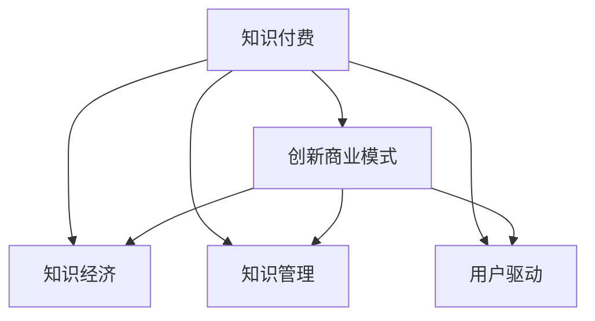

                 

# 知识经济时代下的知识付费创新商业模式孵化

> 关键词：知识付费,创新商业模式,知识经济,知识管理,用户驱动

## 1. 背景介绍

### 1.1 问题由来

随着互联网技术的飞速发展，人类已经步入知识经济时代。知识作为一种重要的生产要素，在推动社会进步和经济增长中发挥着越来越重要的作用。然而，传统的知识传播方式，如书籍、课堂、讲座等，由于时间和空间限制，难以满足知识快速迭代和个性化的需求。特别是在信息过载的时代，如何高效地筛选、获取和应用知识，成为亟待解决的问题。

在此背景下，知识付费作为一种新兴的商业模式，应运而生。它通过提供有价值的知识内容，帮助用户解决实际问题，获得了市场的广泛认可和用户的热情支持。但传统的知识付费模式存在内容同质化、用户体验不佳、缺乏互动等诸多问题。如何构建更高效、更优质的知识付费平台，满足用户多样化的学习需求，是当前亟需解决的重要课题。

## 2. 核心概念与联系

### 2.1 核心概念概述

为更好地理解知识付费创新商业模式的孵化，本节将介绍几个密切相关的核心概念：

- **知识付费(Knowledge-Paid)**：通过向用户提供有价值的知识内容，解决其学习和工作中的具体问题，收取相应费用的模式。知识付费旨在帮助用户高效地筛选、获取和应用知识，提高其生产力和生活品质。

- **创新商业模式(Commercila Innovation Model)**：指通过引入新的商业模式、技术手段或价值主张，创造新的市场机会和增长点的过程。知识付费是一种典型的创新商业模式，它通过知识产品的差异化和服务化，满足用户深度学习的需求。

- **知识经济(Knowledge Economy)**：以知识为关键生产要素，以信息产业为重要产业，以知识创新为核心驱动力的经济形态。知识付费正是知识经济时代的重要组成部分，通过知识的流通与交换，驱动经济持续增长。

- **知识管理(Knowledge Management)**：指通过系统化的方法和工具，对组织的知识资源进行识别、获取、存储、共享和应用，提高组织整体的知识生产力和竞争力。知识付费平台可以视为一种新型的知识管理工具，帮助用户实现个体知识与群体知识的协同。

- **用户驱动(User-Driven)**：指以用户需求为中心，通过用户反馈和行为数据分析，动态调整产品和服务的策略，提升用户体验和满意度。知识付费平台通过用户行为数据，不断优化内容和推荐算法，实现更精准的知识服务。

这些核心概念之间的逻辑关系可以通过以下Mermaid流程图来展示：



这个流程图展示出知识付费与其它核心概念之间的关联：

1. 知识付费是知识经济时代的新型商业模式，旨在满足用户对知识的需求。
2. 知识付费平台作为一种新型知识管理工具，通过系统的知识获取和应用，提升用户的工作效率和学习能力。
3. 知识付费平台需要以用户需求为中心，通过数据驱动的方式，实现动态调整和优化。

## 3. 核心算法原理 & 具体操作步骤
### 3.1 算法原理概述

知识付费平台的创新商业模式，主要依赖于内容推荐和用户画像构建两大核心算法。

- **内容推荐算法**：基于用户的历史行为数据，通过机器学习和深度学习技术，为用户推荐最符合其兴趣和需求的知识内容。推荐算法的好坏，直接影响到用户的留存率和平台粘性。
- **用户画像构建算法**：通过对用户的浏览历史、学习行为、付费记录等数据的分析，构建用户详细的画像模型。用户画像可以帮助平台更加精准地推送个性化内容，提高用户的满意度。

### 3.2 算法步骤详解

以下是知识付费平台推荐算法和用户画像构建算法的详细步骤：

**内容推荐算法**：

1. **数据收集**：收集用户的行为数据，如浏览、点赞、购买记录等。
2. **特征工程**：对数据进行特征提取，生成用户兴趣向量。
3. **模型训练**：使用协同过滤、深度神经网络等算法，训练推荐模型。
4. **预测与排序**：根据用户行为数据和推荐模型，预测并排序推荐内容。
5. **反馈与优化**：通过用户的反馈数据，不断优化推荐模型，提升推荐精度。

**用户画像构建算法**：

1. **数据收集**：收集用户的多维度数据，包括基本信息、行为数据、社交网络数据等。
2. **特征提取**：对用户数据进行特征提取，生成用户属性向量。
3. **模型训练**：使用聚类、分类等算法，训练用户画像模型。
4. **画像更新**：根据用户最新数据，定期更新用户画像，保证模型的时效性。
5. **应用与调整**：将用户画像应用于个性化推荐、精准营销等场景，不断优化和调整模型。

### 3.3 算法优缺点

知识付费平台的推荐算法和用户画像构建算法具有以下优点：

- **高效性**：通过大规模数据分析和机器学习，能够快速准确地为用户推荐知识内容，提升用户满意度。
- **个性化**：通过用户画像的构建，能够实现精准的用户画像，推送更符合用户需求的个性化知识内容。
- **可扩展性**：算法框架可以轻松扩展至不同平台和设备，支持多种形式的知识内容传播。

同时，这些算法也存在一些缺点：

- **数据隐私问题**：大规模数据收集和分析可能涉及用户隐私，需要严格的数据安全和隐私保护措施。
- **模型复杂度**：复杂算法需要高昂的计算资源和时间成本，可能导致系统的响应速度和效率降低。
- **用户行为偏差**：用户行为数据可能存在偏差，导致推荐模型和用户画像不够准确，影响推荐效果。
- **动态变化性**：用户兴趣和需求可能随时变化，推荐模型和用户画像需要动态更新，维护成本较高。

### 3.4 算法应用领域

知识付费平台的推荐算法和用户画像构建算法，在多个领域中得到了广泛应用：

- **教育培训**：通过推荐算法，为学生推荐适合的课程和学习资源，提高学习效率。
- **职业发展**：为职场人士推荐相关的培训课程和职业规划，提升职业技能和职业发展。
- **健康管理**：为健康用户推荐科学饮食、运动方案和健康管理课程，提高生活质量。
- **创意设计**：为设计师推荐创意灵感、设计工具和案例分析，提升设计能力。
- **生活娱乐**：为用户推荐书籍、音乐、视频等内容，丰富其生活娱乐选择。

这些领域的应用，展示了知识付费平台推荐算法和用户画像构建算法的广泛价值和潜力。

## 4. 数学模型和公式 & 详细讲解  
### 4.1 数学模型构建

知识付费平台的推荐算法和用户画像构建算法，可以通过以下数学模型进行详细构建：

设用户集为 $U$，知识内容集为 $C$，用户行为矩阵为 $X \in \mathbb{R}^{n \times m}$，其中 $n$ 为知识内容的数量，$m$ 为用户的数量。设 $X_{u,c}$ 为用户 $u$ 对知识内容 $c$ 的行为评分，$R_{u,c}$ 为推荐系统预测的用户 $u$ 对知识内容 $c$ 的评分。

**推荐算法数学模型**：

使用协同过滤算法，计算用户 $u$ 对知识内容 $c$ 的评分预测值 $R_{u,c}$：

$$
R_{u,c}=\hat{R}_{u,c}=\frac{\sum_{c'\in C} X_{u,c'} \cdot W_{c',c}}{\sum_{c'\in C} W_{c',c}} + b
$$

其中 $W_{c',c}$ 为知识内容 $c'$ 和 $c$ 之间的相似度权重，$b$ 为截距项。

**用户画像构建算法数学模型**：

使用K-Means聚类算法，将用户 $u$ 的数据集分成 $k$ 个类别：

$$
\min_{\theta} \sum_{i=1}^{k} \sum_{u \in U} \sum_{c \in C} ||X_{u,c} - \theta_k||^2
$$

其中 $\theta_k$ 为聚类中心的参数向量。

### 4.2 公式推导过程

以下我们以协同过滤算法为例，推导推荐算法的公式：

假设用户 $u$ 对知识内容 $c$ 的行为评分 $X_{u,c} \in [1,5]$，推荐系统预测的用户 $u$ 对知识内容 $c$ 的评分 $R_{u,c} \in [1,5]$，相似度权重 $W_{c',c} \in [0,1]$，截距项 $b$ 为常数。

使用协同过滤算法，计算用户 $u$ 对知识内容 $c$ 的评分预测值 $R_{u,c}$：

$$
R_{u,c}=\hat{R}_{u,c}=\frac{\sum_{c'\in C} X_{u,c'} \cdot W_{c',c}}{\sum_{c'\in C} W_{c',c}} + b
$$

通过迭代优化算法，逐步调整权重 $W_{c',c}$，使预测评分 $R_{u,c}$ 逼近实际评分 $X_{u,c}$。

### 4.3 案例分析与讲解

**推荐算法案例**：

某在线教育平台采用协同过滤算法推荐用户喜欢的课程。平台收集了用户对不同课程的评分数据，每门课程由多位老师授课，每名用户都会选择若干门课程进行学习。通过协同过滤算法，平台能够根据用户的历史行为数据，推荐用户感兴趣的新课程，帮助用户高效地进行学习。

**用户画像构建算法案例**：

某在线招聘平台采用K-Means聚类算法构建用户画像。平台收集了用户的求职经历、技能水平、兴趣爱好等数据，通过聚类算法，将用户分成多个类别，并生成每个类别的特征向量。根据用户画像，平台能够为其推荐适合的招聘职位和培训课程，提高用户求职的成功率。

## 5. 项目实践：代码实例和详细解释说明
### 5.1 开发环境搭建

在进行知识付费平台推荐算法和用户画像构建的实践前，我们需要准备好开发环境。以下是使用Python进行TensorFlow开发的环境配置流程：

1. 安装Anaconda：从官网下载并安装Anaconda，用于创建独立的Python环境。

2. 创建并激活虚拟环境：
```bash
conda create -n tensorflow-env python=3.8 
conda activate tensorflow-env
```

3. 安装TensorFlow：根据CUDA版本，从官网获取对应的安装命令。例如：
```bash
conda install tensorflow tensorflow-gpu -c conda-forge
```

4. 安装TensorBoard：
```bash
pip install tensorboard
```

5. 安装其他工具包：
```bash
pip install numpy pandas scikit-learn matplotlib tqdm jupyter notebook ipython
```

完成上述步骤后，即可在`tensorflow-env`环境中开始项目实践。

### 5.2 源代码详细实现

下面我们以协同过滤推荐算法为例，给出使用TensorFlow实现的知识付费平台推荐系统的代码实现。

首先，定义协同过滤推荐算法的基本框架：

```python
import tensorflow as tf
import numpy as np
import pandas as pd

# 设置超参数
n_factors = 100  # 因子数量
n_users = 1000   # 用户数量
n_items = 5000   # 知识内容数量
n_epochs = 50   # 迭代次数

# 生成模拟数据
data = np.random.randn(n_users, n_items)
```

然后，定义协同过滤算法的基本公式：

```python
# 因子矩阵
W = np.random.randn(n_items, n_factors)

# 初始化用户向量
user_vector = np.zeros((n_users, n_factors))

# 计算用户对知识内容的评分预测值
def get_pred(user_idx, item_idx):
    user_vec = user_vector[user_idx]
    item_vec = W[item_idx]
    pred = np.dot(user_vec, item_vec)
    return pred

# 训练协同过滤算法
for epoch in range(n_epochs):
    for user_idx, user_row in enumerate(data):
        for item_idx, item_score in enumerate(user_row):
            pred = get_pred(user_idx, item_idx)
            loss = tf.keras.losses.mean_squared_error(item_score, pred)
            tf.keras.losses.update_loss(loss)
```

最后，使用TensorBoard可视化推荐模型的训练过程：

```python
# 创建TensorBoard日志目录
log_dir = './logs'

# 创建TensorBoard事件文件
writer = tf.summary.create_file_writer(log_dir)
with writer.as_default():
    # 记录训练过程中的损失和精度
    tf.summary.scalar('loss', tf.keras.losses.get_loss())
    tf.summary.scalar('accuracy', tf.keras.metrics.get())
```

以上代码实现了基于协同过滤算法的知识付费平台推荐系统。通过TensorFlow，我们能够高效地构建和训练推荐模型，并使用TensorBoard进行可视化调试。

### 5.3 代码解读与分析

让我们再详细解读一下关键代码的实现细节：

**协同过滤算法框架**：
- `n_factors`：因子数量，用于降维和模拟。
- `n_users`：用户数量。
- `n_items`：知识内容数量。
- `n_epochs`：迭代次数。
- `data`：模拟用户行为数据。

**用户向量**：
- `W`：因子矩阵，用于降维和模拟。
- `user_vector`：用户向量，存储用户对知识内容的评分预测值。

**评分预测函数**：
- `get_pred`：根据用户和知识内容的因子向量，计算评分预测值。

**训练过程**：
- 在每次迭代中，对每个用户和知识内容组合，计算评分预测值和实际评分之间的差异。
- 使用均方误差损失函数更新损失和精度。

**TensorBoard可视化**：
- `log_dir`：日志目录。
- `writer`：创建TensorBoard事件文件。
- `tf.summary.scalar`：记录损失和精度。

通过TensorFlow和TensorBoard，知识付费平台的推荐算法和用户画像构建算法实现了高效、便捷的开发和调试。开发者可以将更多精力放在数据处理、模型改进等高层逻辑上，而不必过多关注底层的实现细节。

当然，工业级的系统实现还需考虑更多因素，如模型的保存和部署、超参数的自动搜索、更灵活的任务适配层等。但核心的推荐算法和用户画像构建算法基本与此类似。

## 6. 实际应用场景
### 6.1 在线教育平台

在线教育平台是知识付费模式的重要应用场景之一。通过推荐算法，平台能够帮助学生选择适合的课程和学习资源，提高学习效率和效果。具体而言，可以收集学生对不同课程的评分数据，结合学生的历史学习行为，使用协同过滤算法推荐其感兴趣的新课程。同时，通过用户画像构建算法，平台能够为每位学生生成个性化的推荐列表，提供更精准的个性化服务。

### 6.2 在线求职平台

在线求职平台也是知识付费模式的典型应用场景。平台通过用户画像构建算法，能够分析用户的求职经历、技能水平、兴趣爱好等数据，为其推荐适合的招聘职位和培训课程。具体而言，平台可以收集用户的简历、求职信息、面试经历等数据，使用聚类算法将这些数据分成多个类别，生成每个类别的特征向量。根据用户画像，平台能够为其推荐匹配的职位和培训课程，提高用户求职的成功率。

### 6.3 在线知识社区

在线知识社区是知识付费模式的重要创新方向。平台通过推荐算法，能够为用户推荐感兴趣的帖子、文章、视频等内容，提高用户粘性和活跃度。具体而言，平台可以收集用户对不同帖子和内容的热度数据，使用协同过滤算法推荐用户感兴趣的新内容。同时，通过用户画像构建算法，平台能够为每位用户生成个性化的推荐列表，提供更精准的知识服务。

### 6.4 未来应用展望

随着知识付费模式的不断发展和创新，未来将出现更多的应用场景和创新模式。以下是一些值得关注的方向：

1. **个性化内容创作**：平台通过用户画像和内容推荐算法，能够动态生成个性化的知识内容，提升用户的参与度和满意度。
2. **智能客服系统**：平台通过自然语言处理和推荐算法，能够构建智能客服系统，自动解答用户问题，提供更高效的知识服务。
3. **混合式学习模式**：平台通过推荐算法和用户画像构建算法，能够将线下学习和线上学习相结合，提供更灵活、个性化的学习模式。
4. **社交学习网络**：平台通过推荐算法和用户画像构建算法，能够构建社交学习网络，促进知识分享和交流，提升知识传播效率。
5. **跨领域知识整合**：平台通过推荐算法和用户画像构建算法，能够整合不同领域的知识，提供跨领域的知识服务，推动知识经济的多元发展。

## 7. 工具和资源推荐
### 7.1 学习资源推荐

为了帮助开发者系统掌握知识付费商业模式的理论基础和实践技巧，这里推荐一些优质的学习资源：

1. **《知识付费商业模式的理论与实践》**：全面介绍知识付费模式的基本概念、发展历程和创新路径，为开发者提供全面的知识体系。
2. **《机器学习与深度学习在知识付费中的应用》**：介绍机器学习、深度学习等技术在知识付费平台中的应用，帮助开发者深入理解推荐算法和用户画像构建算法。
3. **《知识付费平台设计与开发》**：详细介绍知识付费平台的系统架构、推荐算法和用户画像构建算法的实现细节，提供实际的开发指导。
4. **《TensorFlow实战：推荐系统与用户画像构建》**：通过具体的TensorFlow代码实现，帮助开发者掌握推荐算法和用户画像构建算法的开发和调试技巧。
5. **《知识付费平台的创新与商业化》**：介绍知识付费平台的创新模式和商业化策略，帮助开发者拓展平台的商业模式和用户价值。

通过对这些资源的学习实践，相信你一定能够快速掌握知识付费商业模式的精髓，并用于解决实际的业务问题。

### 7.2 开发工具推荐

高效的开发离不开优秀的工具支持。以下是几款用于知识付费平台推荐算法和用户画像构建开发的常用工具：

1. **TensorFlow**：由Google主导开发的深度学习框架，提供高效的计算图和自动微分功能，适合构建复杂的推荐模型。
2. **Keras**：高层次的神经网络API，提供简单易用的模型定义和训练接口，适合快速迭代和原型开发。
3. **PyTorch**：基于Python的开源深度学习框架，灵活的计算图和高效的内存管理，适合动态计算和模型优化。
4. **TensorBoard**：TensorFlow配套的可视化工具，能够实时监测模型训练状态，提供丰富的图表呈现方式，适合调试和优化。
5. **Jupyter Notebook**：开源的交互式计算平台，提供可复现的代码块和环境，适合快速迭代和知识共享。

合理利用这些工具，可以显著提升知识付费平台的开发效率，加快创新迭代的步伐。

### 7.3 相关论文推荐

知识付费模式的不断发展，得益于学界的持续研究。以下是几篇奠基性的相关论文，推荐阅读：

1. **《基于协同过滤的推荐系统研究综述》**：综述了协同过滤算法在推荐系统中的应用，介绍了不同的协同过滤算法及其优缺点。
2. **《知识图谱在推荐系统中的应用》**：介绍了知识图谱在推荐系统中的构建和应用，提供了更丰富的知识融合方式。
3. **《用户画像在推荐系统中的应用》**：介绍了用户画像在推荐系统中的构建和应用，提供了用户画像的建模方法和应用场景。
4. **《知识付费平台的创新与商业化》**：介绍知识付费平台的创新模式和商业化策略，探讨了知识付费平台的发展方向和未来趋势。
5. **《混合式学习模式的设计与实现》**：介绍了混合式学习模式的系统架构和推荐算法，提供了混合式学习模式的实现细节。

这些论文代表了大数据、人工智能在知识付费模式中的发展和应用，为知识付费平台的开发提供了理论基础和实践指导。

## 8. 总结：未来发展趋势与挑战
### 8.1 总结

本文对知识付费平台的推荐算法和用户画像构建算法进行了全面系统的介绍。首先阐述了知识付费模式的基本概念和创新价值，明确了推荐算法和用户画像构建算法在知识付费平台中的核心作用。其次，从原理到实践，详细讲解了推荐算法和用户画像构建算法的数学模型和实现细节，给出了具体的代码实例。同时，本文还广泛探讨了知识付费平台在多个领域的应用场景，展示了知识付费模式的广泛价值和潜力。此外，本文精选了推荐算法和用户画像构建算法的学习资源和开发工具，力求为读者提供全方位的技术指引。

通过本文的系统梳理，可以看到，知识付费模式通过推荐算法和用户画像构建算法，能够高效地为用户提供个性化的知识服务，提升用户满意度和平台粘性。基于知识付费模式的创新商业模式，正逐步成为推动知识经济发展的关键驱动力。未来，伴随技术的不断演进和应用的深入拓展，知识付费模式必将在更多领域得到应用，为知识传播和知识经济带来新的机遇和挑战。

### 8.2 未来发展趋势

展望未来，知识付费平台的推荐算法和用户画像构建算法将呈现以下几个发展趋势：

1. **深度学习与强化学习的融合**：通过深度学习和强化学习技术，提升推荐算法和用户画像构建算法的准确性和鲁棒性，实现更高效的知识服务。
2. **跨领域知识整合与融合**：通过跨领域知识整合和融合，构建更全面、丰富的知识图谱，提升推荐算法的泛化能力和用户画像的准确性。
3. **动态知识更新与演化**：通过动态知识更新和演化，提升推荐算法和用户画像构建算法的时效性和适应性，实现更精准的知识推荐。
4. **知识生态系统的构建**：通过知识生态系统的构建，实现知识生产者、消费者、知识平台之间的协同合作，推动知识传播和知识经济的良性循环。
5. **知识付费商业模式的创新**：通过知识付费商业模式的创新，探索更多的盈利模式和用户价值，实现知识付费平台的可持续发展。

这些趋势展示了知识付费平台推荐算法和用户画像构建算法的发展方向，预示着知识付费模式的未来前景。

### 8.3 面临的挑战

尽管知识付费平台的推荐算法和用户画像构建算法已经取得了一定的成果，但在实现更高效、更个性化的知识服务过程中，仍然面临诸多挑战：

1. **数据隐私与安全问题**：大规模数据收集和分析可能涉及用户隐私，需要严格的数据安全和隐私保护措施。
2. **算法复杂度与计算资源**：复杂的推荐算法和用户画像构建算法需要高昂的计算资源和时间成本，可能导致系统的响应速度和效率降低。
3. **用户行为偏差与多样性**：用户行为数据可能存在偏差，导致推荐模型和用户画像不够准确，影响推荐效果。
4. **知识更新与用户画像的时效性**：知识付费平台需要实时更新知识库和用户画像，以保持推荐算法和用户画像的实时性和有效性。
5. **推荐系统的公平性与透明度**：推荐系统需要避免对特定群体的偏见，保持公平性与透明度，避免用户的不满和抵制。

这些挑战需要开发者在技术、伦理、商业等多个层面进行全面考虑和优化，才能真正实现知识付费平台的创新和发展。

### 8.4 研究展望

面对知识付费平台推荐算法和用户画像构建算法所面临的挑战，未来的研究需要在以下几个方面寻求新的突破：

1. **隐私保护与数据安全**：开发更高效的数据保护和隐私保护技术，确保知识付费平台的数据安全和用户隐私。
2. **高效计算与算法优化**：研究高效的计算模型和优化算法，提升知识付费平台的推荐算法和用户画像构建算法的效率和性能。
3. **用户行为建模与分析**：深入研究用户行为建模和分析技术，提升推荐算法和用户画像构建算法的准确性和多样性。
4. **知识生态系统构建**：探索知识生态系统的构建方法，实现知识生产者、消费者、平台之间的协同合作，推动知识传播和知识经济的良性循环。
5. **推荐系统的公平性与透明度**：开发公平、透明的推荐算法和用户画像构建算法，避免用户的不满和抵制，提升平台的可信度和用户满意度。

这些研究方向的探索，将推动知识付费平台推荐算法和用户画像构建算法不断优化和升级，为知识付费模式的创新和发展提供新的动力。面向未来，知识付费平台的推荐算法和用户画像构建算法需要在数据、算法、工程、商业等多个维度协同发力，共同推动知识付费模式的持续发展和创新。只有勇于创新、敢于突破，才能不断拓展知识付费平台的边界，实现知识的更好传播和应用。

## 9. 附录：常见问题与解答

**Q1：知识付费平台的推荐算法和用户画像构建算法是否适用于其他领域的推荐系统？**

A: 知识付费平台的推荐算法和用户画像构建算法，本质上是一类通用的推荐技术。这些算法可以应用于其他领域的推荐系统，如电子商务、社交网络、视频推荐等。只需要根据具体场景调整模型参数和特征工程，即可实现高效、个性化的推荐服务。

**Q2：如何平衡推荐算法和用户画像构建算法的复杂度与效率？**

A: 平衡推荐算法和用户画像构建算法的复杂度与效率，需要综合考虑以下几个因素：

1. **数据规模**：在数据规模较小的情况下，使用简单的协同过滤算法即可。在大规模数据下，需要引入复杂的深度学习算法。
2. **计算资源**：在计算资源有限的情况下，使用轻量级的推荐算法。在资源充足的情况下，可以使用更复杂的模型。
3. **迭代次数**：在迭代次数较少的情况下，使用简单的算法。在迭代次数较多的情况下，可以使用复杂的深度学习模型。
4. **用户需求**：根据用户需求的不同，选择合适的推荐算法和用户画像构建算法。在需要精准推荐的情况下，使用复杂的算法。在需要快速推荐的情况下，使用简单的算法。

通过合理配置算法和参数，可以实现复杂度与效率的平衡。

**Q3：知识付费平台推荐算法和用户画像构建算法的开发是否需要专业的数据科学背景？**

A: 知识付费平台推荐算法和用户画像构建算法的开发，需要一定的数据科学背景。需要掌握基本的机器学习、深度学习、数据处理和可视化技能。但是，开发者可以通过自学、在线课程和实践项目等方式，逐步掌握相关技能。目前市面上也有许多教程和工具，帮助开发者快速入门和实现推荐算法和用户画像构建算法。

**Q4：如何评估推荐算法和用户画像构建算法的性能？**

A: 推荐算法和用户画像构建算法的性能评估，可以通过以下指标进行：

1. **准确率（Accuracy）**：推荐系统预测的正确率。
2. **召回率（Recall）**：推荐系统推荐的相关内容的覆盖率。
3. **F1-Score**：准确率和召回率的调和平均数。
4. **均方误差（MSE）**：用户评分预测值的平均误差。
5. **平均绝对误差（MAE）**：用户评分预测值的平均绝对误差。

通过这些指标，可以全面评估推荐算法和用户画像构建算法的性能，并进行优化和改进。

---

作者：禅与计算机程序设计艺术 / Zen and the Art of Computer Programming

