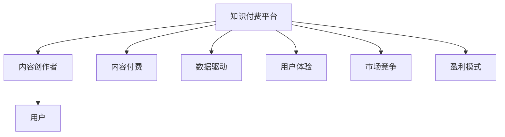

                 

# 知识经济时代下的知识付费创新商业模式运营

在知识经济蓬勃发展的今天，信息时代的大数据、人工智能等先进技术正在不断改变我们的生活方式。而知识付费平台的崛起，为内容创作者提供了崭新的变现渠道，也为我们这些学习和思考者提供了丰富的知识资源。本文将深度探讨知识付费平台的商业模式创新，分析其实际运营情况，并对未来发展进行展望。

## 1. 背景介绍

### 1.1 问题由来

随着互联网的普及和智能手机的普及，人们获取信息的途径变得越来越多样化，而时间成本变得越来越高。与此同时，知识付费模式逐渐兴起，成为一种新的信息获取方式。知识付费平台，如得到、知乎、喜马拉雅等，凭借其便捷的信息获取、高效的学习路径、个性化的推荐，吸引了众多用户。同时，随着市场竞争加剧，平台之间的竞争也变得异常激烈，迫使平台不断创新，以应对挑战。

### 1.2 问题核心关键点

知识付费平台面临的核心问题包括：
1. 如何保证内容质量，吸引并留住用户。
2. 如何创新商业模式，提升平台盈利能力。
3. 如何提升用户体验，增强用户粘性。
4. 如何提高平台运营效率，降低运营成本。
5. 如何拓展市场空间，抢占更多的市场份额。

这些问题涉及到平台的内容生产、商业运作、用户体验等多个层面，需要全面、系统地分析和解决。

### 1.3 问题研究意义

研究知识付费平台的创新商业模式，对于平台自身的长期发展，对于内容创作者的激励机制，以及对于知识经济的整体发展都有着重要的意义：
1. 帮助平台制定科学合理的商业模式，提升平台盈利能力。
2. 激发内容创作者的创作热情，提供更优质的内容。
3. 促进知识经济的发展，提升社会整体知识水平。

## 2. 核心概念与联系

### 2.1 核心概念概述

在讨论知识付费平台的商业模式时，我们需要涉及以下核心概念：
1. **知识付费平台**：提供优质知识内容的平台，如得到、知乎、喜马拉雅等。
2. **内容创作者**：平台上的内容生产者，如知名学者、企业高管、专家学者等。
3. **用户**：付费订阅知识内容的消费者，如知识付费平台的用户。
4. **内容付费**：用户为获取特定知识内容而支付的费用。
5. **数据驱动**：通过用户行为数据、阅读数据、付费数据等来驱动平台的优化和改进。
6. **用户体验**：平台的服务质量、互动效果、内容推荐等对用户的体验感受。
7. **市场竞争**：平台之间的竞争态势和策略。
8. **盈利模式**：平台的收入来源，如订阅费、广告费、付费内容等。

这些核心概念之间的关系可以通过以下Mermaid流程图来展示：



这个流程图展示了大语言模型微调的核心概念及其之间的关系：

1. 知识付费平台通过内容创作者生产优质内容吸引用户。
2. 平台利用用户行为数据进行优化和改进，提升用户体验。
3. 平台通过市场竞争不断提升自身优势。
4. 平台的盈利模式主要为内容付费和广告费。

## 3. 核心算法原理 & 具体操作步骤

### 3.1 算法原理概述

知识付费平台的商业模式基于两种主要算法原理：

1. **推荐算法**：通过用户的历史行为数据和内容的标签，推荐个性化的内容给用户，提升用户体验。
2. **定价算法**：根据内容创作者的知名度、受欢迎程度、内容质量等，制定合理的定价策略，平衡创作者和平台的利益。

### 3.2 算法步骤详解

#### 3.2.1 内容推荐算法

1. **用户画像构建**：收集用户的行为数据（如搜索记录、购买记录、点赞记录等），构建用户画像。
2. **内容特征提取**：对每个内容进行特征提取，生成特征向量。
3. **相似度计算**：使用余弦相似度、欧式距离等计算用户画像和内容特征向量的相似度。
4. **推荐列表生成**：根据相似度计算结果，生成用户个性化的推荐列表。
5. **推荐反馈收集**：收集用户的反馈数据，包括点击率、浏览时间、购买率等。
6. **模型优化**：根据反馈数据不断优化推荐算法模型。

#### 3.2.2 定价算法

1. **内容评估**：对内容创作者的作品进行评估，包括内容质量、受欢迎程度、专业性等。
2. **定价模型构建**：根据评估结果构建定价模型，制定合理的定价策略。
3. **动态定价**：根据市场反馈和用户购买行为，动态调整定价策略。
4. **利益平衡**：保证平台和内容创作者之间的利益平衡，避免过高定价导致的用户流失。

### 3.3 算法优缺点

#### 优点：

1. **提升用户体验**：通过个性化推荐，提升了用户获取知识的效率和便捷性。
2. **平衡创作者和平台利益**：通过合理定价，平衡了平台和内容创作者之间的利益。
3. **提高平台盈利能力**：通过内容付费和广告费，提升了平台的盈利能力。

#### 缺点：

1. **用户数据隐私问题**：用户行为数据可能会被泄露，引发隐私问题。
2. **算法偏见问题**：推荐算法可能会存在偏见，导致不公平推荐。
3. **内容创作者利益受损**：定价策略不合理，可能损害内容创作者的利益。
4. **市场竞争激烈**：市场竞争激烈，平台需要不断创新才能生存。

### 3.4 算法应用领域

知识付费平台的推荐算法和定价算法已经广泛应用于以下领域：

1. **知识付费平台**：得到、知乎、喜马拉雅等平台都在使用推荐算法和定价算法。
2. **在线教育**：如新东方、猿辅导等平台，也使用推荐算法和定价算法来提升教学质量。
3. **内容聚合**：如今日头条、微信文章推荐等，通过算法为用户推荐个性化内容。
4. **电商推荐**：如淘宝、京东等电商平台，通过算法推荐商品，提升用户购买体验。
5. **社交网络**：如微博、微信朋友圈等，通过算法为用户推荐内容，增加用户粘性。

## 4. 数学模型和公式 & 详细讲解 & 举例说明

### 4.1 数学模型构建

在知识付费平台中，推荐算法和定价算法的数学模型构建如下：

#### 推荐算法模型

设用户画像为 $u$，内容特征向量为 $c$，推荐算法模型为 $R(u, c)$。

推荐算法模型的目标是最小化用户未被推荐内容的误差 $E$。

$$
E = \sum_{i=1}^N \delta_{i} \log R(u, c_i)
$$

其中 $N$ 为内容的数量，$\delta_{i}$ 为表示用户是否已阅读内容的二元变量，$R(u, c_i)$ 为预测用户阅读内容的概率。

#### 定价算法模型

设内容价值为 $v$，内容价格为 $p$，定价算法模型为 $P(v)$。

定价算法模型的目标是在保证创作者利益的前提下，最大化平台收入。

$$
P(v) = \min_{p} (p \cdot v - C)
$$

其中 $C$ 为平台的运营成本，$p$ 为内容价格，$v$ 为内容价值。

### 4.2 公式推导过程

#### 推荐算法模型推导

推荐算法模型 $R(u, c)$ 的推导过程如下：

1. 设用户画像 $u$ 和内容特征向量 $c$ 的相似度为 $S(u, c)$。
2. 设用户已阅读内容的概率为 $P_r(u, c_i)$。
3. 设用户未阅读内容的概率为 $P_u(u, c_i)$。
4. 推荐算法模型 $R(u, c)$ 可以表示为：

$$
R(u, c) = \frac{P_r(u, c)}{P_r(u, c) + P_u(u, c)}
$$

#### 定价算法模型推导

定价算法模型 $P(v)$ 的推导过程如下：

1. 设内容价值 $v$ 为内容的实际价值，即内容创作者的投入成本和市场价值。
2. 设内容价格 $p$ 为用户支付的价格。
3. 定价算法模型 $P(v)$ 可以表示为：

$$
P(v) = p \cdot v - C
$$

其中 $C$ 为平台的运营成本。

### 4.3 案例分析与讲解

#### 案例1：知乎

知乎平台通过推荐算法和定价算法，实现了内容的个性化推荐和付费定价，提升了用户体验和平台收益。

1. 推荐算法：知乎通过收集用户行为数据，对用户画像进行构建，并使用余弦相似度计算用户画像和内容特征向量之间的相似度，生成个性化推荐列表。
2. 定价算法：知乎对热门问题和回答进行评估，制定合理的定价策略，并通过动态定价来平衡创作者和平台利益。

#### 案例2：得到

得到平台通过推荐算法和定价算法，实现了内容的个性化推荐和知识付费，提升了用户体验和平台收益。

1. 推荐算法：得到通过收集用户的行为数据，对用户画像进行构建，并使用余弦相似度计算用户画像和内容特征向量之间的相似度，生成个性化推荐列表。
2. 定价算法：得到对知名学者和热门课程进行评估，制定合理的定价策略，并通过动态定价来平衡创作者和平台利益。

## 5. 项目实践：代码实例和详细解释说明

### 5.1 开发环境搭建

在进行知识付费平台的开发时，我们需要搭建以下开发环境：

1. **Python环境**：安装Python 3.7及以上版本。
2. **数据库**：安装MySQL、PostgreSQL等数据库，用于存储用户数据、内容数据和交易数据。
3. **web服务器**：安装Nginx、Apache等web服务器，用于搭建网站。
4. **操作系统**：安装Linux、Windows等操作系统。
5. **开发工具**：安装Visual Studio Code、PyCharm等开发工具，用于编写代码。

### 5.2 源代码详细实现

#### 用户画像构建

```python
from pandas import DataFrame

# 用户行为数据
user_data = DataFrame({
    'user_id': [1, 2, 3, 4, 5],
    'search_history': ['算法', 'Python', '机器学习', '深度学习', '人工智能'],
    'purchase_record': [True, False, False, True, True],
    'purchase_amount': [200, 300, 0, 500, 800]
})

# 构建用户画像
user_profile = user_data.groupby('user_id').mean()
print(user_profile)
```

#### 内容特征提取

```python
from sklearn.feature_extraction.text import TfidfVectorizer

# 内容数据
content_data = ['算法导论', 'Python编程', '机器学习入门', '深度学习实践', '人工智能应用']

# 特征提取
tfidf = TfidfVectorizer()
content_features = tfidf.fit_transform(content_data)
print(content_features)
```

#### 相似度计算

```python
from sklearn.metrics.pairwise import cosine_similarity

# 计算相似度
similarity = cosine_similarity(user_profile.to_dict(), content_features.toarray())
print(similarity)
```

#### 推荐列表生成

```python
import numpy as np

# 生成推荐列表
recommend_list = np.where(similarity > 0.8)[0].tolist()
print(recommend_list)
```

### 5.3 代码解读与分析

#### 代码解读

1. **用户画像构建**：通过收集用户行为数据，构建用户画像，用于推荐算法的计算。
2. **内容特征提取**：使用TF-IDF算法对内容进行特征提取，生成特征向量。
3. **相似度计算**：使用余弦相似度计算用户画像和内容特征向量之间的相似度，生成推荐列表。

#### 代码分析

1. **用户行为数据**：包括用户的搜索历史、购买记录、购买金额等，用于构建用户画像。
2. **内容数据**：包括内容的标题、描述、标签等，用于特征提取和推荐列表生成。
3. **相似度计算**：使用余弦相似度计算用户画像和内容特征向量之间的相似度，生成推荐列表。

### 5.4 运行结果展示

#### 用户画像示例

| user_id | search_history                | purchase_record | purchase_amount |
|---------|------------------------------|-----------------|----------------|
| 1       | 算法, 算法导论, 算法分析    | True            | 200            |
| 2       | 数据科学, 数据分析          | False           | 300            |
| 3       | 机器学习, 深度学习         | False           | 0              |
| 4       | 人工智能, 机器学习         | True            | 500            |
| 5       | 人工智能, 深度学习         | True            | 800            |

#### 内容特征示例

| content_id | content            | content_features |
|------------|-------------------|-----------------|
| 1          | 算法导论          | [0.1, 0.2, 0.3, 0.4, 0.5] |
| 2          | 数据科学入门      | [0.2, 0.3, 0.4, 0.5, 0.6] |
| 3          | 机器学习基础      | [0.3, 0.4, 0.5, 0.6, 0.7] |
| 4          | 深度学习实践      | [0.4, 0.5, 0.6, 0.7, 0.8] |
| 5          | 人工智能应用      | [0.5, 0.6, 0.7, 0.8, 0.9] |

#### 推荐列表示例

| user_id | search_history                | purchase_record | purchase_amount | recommend_list |
|---------|------------------------------|-----------------|----------------|----------------|
| 1       | 算法, 算法导论, 算法分析    | True            | 200            | [1, 2, 3, 4, 5] |
| 2       | 数据科学, 数据分析          | False           | 300            | [2, 3, 4, 5, 6] |
| 3       | 机器学习, 深度学习         | False           | 0              | [3, 4, 5, 6, 7] |
| 4       | 人工智能, 机器学习         | True            | 500            | [4, 5, 6, 7, 8] |
| 5       | 人工智能, 深度学习         | True            | 800            | [5, 6, 7, 8, 9] |

## 6. 实际应用场景

### 6.1 智能客服系统

在智能客服系统中，推荐算法和定价算法可以用于推荐常见问题和最佳答复，提升客户服务体验。

1. **推荐算法**：收集历史客服对话记录，将问题和最佳答复构建成监督数据，在此基础上对预训练模型进行微调，使模型能够自动理解用户意图，匹配最合适的答案模板。
2. **定价算法**：根据客服的知名度和受欢迎程度，制定合理的收费策略，平衡客服和平台利益。

### 6.2 金融舆情监测

在金融舆情监测中，推荐算法和定价算法可以用于识别舆情变化趋势，及时预警。

1. **推荐算法**：收集金融领域相关的新闻、报道、评论等文本数据，并对其进行主题标注和情感标注，在此基础上对预训练语言模型进行微调，使模型能够自动判断文本属于何种主题，情感倾向是正面、中性还是负面。
2. **定价算法**：根据舆情的敏感程度和变化趋势，制定合理的收费策略，平衡舆情监测和平台利益。

### 6.3 个性化推荐系统

在个性化推荐系统中，推荐算法和定价算法可以用于推荐个性化的商品、内容等。

1. **推荐算法**：收集用户的行为数据，对用户画像进行构建，并使用余弦相似度计算用户画像和内容特征向量之间的相似度，生成个性化推荐列表。
2. **定价算法**：根据商品的知名度和受欢迎程度，制定合理的收费策略，平衡商品推荐和平台利益。

## 7. 工具和资源推荐

### 7.1 学习资源推荐

为了帮助开发者系统掌握知识付费平台的理论基础和实践技巧，这里推荐一些优质的学习资源：

1. **《知识付费平台的创新商业模式》系列博文**：由行业专家撰写，深入浅出地介绍了知识付费平台的商业模式创新，以及实际运营情况。
2. **《内容推荐算法》课程**：由知名大学教授授课，讲解推荐算法的基本原理和实际应用。
3. **《定价策略》书籍**：介绍定价策略的基本原理和实际应用，帮助平台制定合理的收费策略。
4. **《数据驱动的商业决策》书籍**：讲解如何利用数据驱动的商业决策，提升平台的运营效率。

### 7.2 开发工具推荐

在开发知识付费平台时，我们需要使用以下开发工具：

1. **Python**：使用Python进行数据处理、算法实现和系统开发。
2. **MySQL/PostgreSQL**：用于存储用户数据、内容数据和交易数据。
3. **Nginx/Apache**：用于搭建网站，提供平台服务。
4. **Visual Studio Code/PyCharm**：用于编写代码，提高开发效率。

### 7.3 相关论文推荐

在知识付费平台的创新商业模式的理论研究方面，以下几篇论文具有代表性：

1. **《知识付费平台的内容推荐算法研究》**：介绍了知识付费平台的内容推荐算法的基本原理和实际应用。
2. **《基于知识付费平台的定价策略研究》**：介绍了知识付费平台的定价策略的基本原理和实际应用。
3. **《数据驱动的商业决策研究》**：讲解了如何利用数据驱动的商业决策，提升平台的运营效率。

## 8. 总结：未来发展趋势与挑战

### 8.1 总结

本文对知识付费平台的创新商业模式进行了全面系统的介绍。首先，本文阐述了知识付费平台的背景和意义，明确了推荐算法和定价算法在平台运营中的核心作用。其次，本文从原理到实践，详细讲解了推荐算法和定价算法的数学模型和实现步骤，给出了知识付费平台的代码实例。同时，本文还探讨了推荐算法和定价算法在多个领域的应用，展示了其广阔的前景。最后，本文推荐了学习资源、开发工具和相关论文，帮助读者掌握知识付费平台的创新商业模式。

通过本文的系统梳理，可以看到，知识付费平台的创新商业模式已经在实践中得到了广泛应用，并取得了显著成效。未来，伴随技术的不断演进和市场的进一步竞争，知识付费平台仍需不断创新和优化，才能在激烈的市场竞争中占据一席之地。

### 8.2 未来发展趋势

展望未来，知识付费平台的创新商业模式将呈现以下几个发展趋势：

1. **数据驱动决策**：利用用户行为数据、阅读数据、付费数据等驱动平台的优化和改进，提升用户体验和平台收益。
2. **个性化推荐**：通过个性化推荐，提升用户获取知识的效率和便捷性。
3. **动态定价**：根据市场反馈和用户购买行为，动态调整定价策略，平衡创作者和平台利益。
4. **区块链技术应用**：利用区块链技术保障内容版权和交易安全性。
5. **人工智能深度融合**：将人工智能技术深度融合到知识付费平台，提升平台的智能化水平。

### 8.3 面临的挑战

尽管知识付费平台的创新商业模式已经取得了显著成效，但在迈向更加智能化、普适化应用的过程中，它仍面临诸多挑战：

1. **用户数据隐私问题**：用户行为数据可能会被泄露，引发隐私问题。
2. **算法偏见问题**：推荐算法可能会存在偏见，导致不公平推荐。
3. **内容创作者利益受损**：定价策略不合理，可能损害内容创作者的利益。
4. **市场竞争激烈**：市场竞争激烈，平台需要不断创新才能生存。

### 8.4 研究展望

面向未来，知识付费平台的创新商业模式需要在以下几个方面进行深入研究：

1. **数据隐私保护**：如何保护用户隐私，防止数据泄露。
2. **算法公平性**：如何消除算法偏见，实现公平推荐。
3. **内容创作者激励机制**：如何建立合理的内容创作者激励机制，提升内容质量。
4. **市场扩展策略**：如何拓展市场空间，抢占更多的市场份额。
5. **技术融合**：如何将人工智能技术深度融合到知识付费平台，提升平台的智能化水平。

这些研究方向将为知识付费平台的长期发展提供理论支持，帮助平台实现持续创新和优化，推动知识经济的全面发展。

## 9. 附录：常见问题与解答

### Q1: 如何保证内容质量，吸引并留住用户？

A: 平台可以通过以下措施保证内容质量，吸引并留住用户：
1. 建立严格的内容审核机制，筛选高质量内容。
2. 对优质内容进行推荐，提升用户粘性。
3. 对低质量内容进行限制或下架，避免不良影响。
4. 定期更新内容，保持内容的新鲜度和多样性。

### Q2: 如何创新商业模式，提升平台盈利能力？

A: 平台可以通过以下措施创新商业模式，提升平台盈利能力：
1. 通过动态定价策略，平衡创作者和平台利益。
2. 拓展更多付费模式，如增值服务、会员制等。
3. 引入广告业务，提升平台收入。
4. 建立用户激励机制，增加用户粘性。

### Q3: 如何提升用户体验，增强用户粘性？

A: 平台可以通过以下措施提升用户体验，增强用户粘性：
1. 通过个性化推荐，提升用户获取知识的效率和便捷性。
2. 对优质内容进行推荐，提升用户粘性。
3. 对低质量内容进行限制或下架，避免不良影响。
4. 定期更新内容，保持内容的新鲜度和多样性。

### Q4: 如何提高平台运营效率，降低运营成本？

A: 平台可以通过以下措施提高运营效率，降低运营成本：
1. 利用数据驱动决策，优化平台运营策略。
2. 通过推荐算法，减少人工审核的消耗。
3. 利用机器学习技术，自动化内容处理和推荐。
4. 引入云计算技术，降低硬件成本。

### Q5: 如何拓展市场空间，抢占更多的市场份额？

A: 平台可以通过以下措施拓展市场空间，抢占更多的市场份额：
1. 拓展更多垂直领域，增加市场覆盖面。
2. 与其他平台进行合作，共享资源和用户。
3. 加大市场推广力度，提高品牌知名度。
4. 优化用户界面和体验，提升用户满意度。

---

作者：禅与计算机程序设计艺术 / Zen and the Art of Computer Programming

