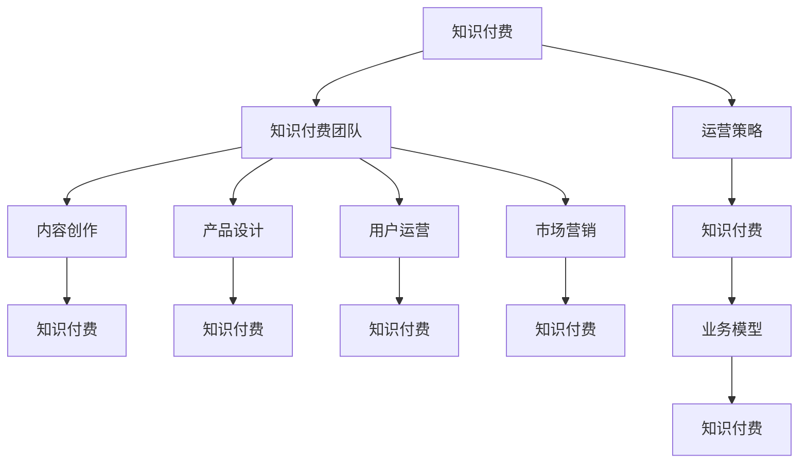

                 

# 知识经济时代下的知识付费团队建设与文化塑造

## 1. 背景介绍

在知识经济时代，信息爆炸与知识碎片化带来的海量数据源源不断地涌现。知识付费作为一种新兴的商业模式，为人们提供了便捷、高效、专业化的知识获取途径。从在线课程、电子书到微课、短视频，知识付费产品层出不穷，满足了用户日益增长的知识需求。然而，知识付费市场也面临着内容同质化、平台竞争激烈、用户付费意愿不强等问题。如何建设高水平的知识付费团队，提升其创新力和竞争力，成为了亟待解决的重要课题。

### 1.1 问题由来

随着数字化技术的飞速发展，知识付费逐渐成为知识传播与知识获取的新型方式。从猿辅导、有道云课堂，到得到、喜马拉雅等平台，知识付费市场呈现出蓬勃发展的态势。平台为知识付费的兴起提供了土壤，而优质的内容生产与有效的用户运营则是维持市场长久发展的重要保障。因此，知识付费平台的运营，不仅仅局限于产品设计与市场推广，更是涉及内容生产、团队建设、文化塑造等多方面的综合考量。

## 2. 核心概念与联系

### 2.1 核心概念概述

本文将围绕知识付费团队建设与文化塑造这一主题，介绍相关的核心概念：

- **知识付费**：指以付费形式获取具有高附加值知识内容的服务，如在线课程、电子书、微课、短视频等。知识付费商业模式的核心在于提供优质的知识内容，满足用户的学习需求。

- **知识付费团队**：指知识付费平台中，负责内容创作、产品设计、用户运营、市场营销等环节的专业团队。高效的知识付费团队应具备创造性思维、技术实力、市场洞察力等多方面的优势。

- **文化塑造**：指通过团队文化建设，凝聚员工共同价值观，形成良性内循环，提升团队凝聚力和向心力。良好的团队文化，能够推动团队持续创新，满足用户不断变化的需求。

- **运营策略**：指知识付费平台在市场推广、用户管理、内容更新等方面采取的具体措施。良好的运营策略能够提升用户体验，增加平台粘性，实现业务增长。

- **业务模型**：指知识付费平台为实现其商业目标，构建的业务结构与运作流程。业务模型的设计应符合市场需求，体现平台的竞争优势。

这些核心概念之间的逻辑关系可以通过以下Mermaid流程图来展示：



这个流程图展示了几大核心概念之间的逻辑关系：

1. 知识付费是知识付费团队的服务目标。
2. 知识付费团队的各项工作通过内容创作、产品设计、用户运营、市场营销等环节得以具体落实。
3. 运营策略和业务模型是知识付费团队运作的基础和保障。
4. 团队文化建设是提升团队绩效的重要手段。

## 3. 核心算法原理 & 具体操作步骤
### 3.1 算法原理概述

知识付费平台的运营，从根本上依赖于高水平的内容创作与高效的用户运营。在算法原理层面，知识付费的构建涉及用户行为分析、推荐算法、内容质量控制等多个方面。

**用户行为分析**：通过对用户行为数据的采集与分析，了解用户的学习习惯、兴趣偏好、反馈意见等，从而实现个性化推荐，提升用户体验。

**推荐算法**：基于协同过滤、内容推荐等算法，为用户提供个性化的内容推荐，以提高用户的参与度和满意度。

**内容质量控制**：通过算法和人工审核相结合的方式，对内容进行审核，确保内容的准确性、原创性和适宜性。

### 3.2 算法步骤详解

知识付费平台的算法运营涉及多个环节，具体步骤如下：

**Step 1: 数据采集与预处理**

- 收集用户行为数据，包括浏览记录、购买记录、学习时长、评分评价等。
- 对数据进行清洗和处理，去除噪音和异常值。

**Step 2: 用户行为建模**

- 利用机器学习算法，对用户行为数据进行建模，了解用户的行为模式和偏好。
- 通过聚类分析、分类算法等方式，对用户进行分群，形成不同的用户画像。

**Step 3: 内容推荐**

- 结合用户画像和内容特征，应用协同过滤、内容推荐算法，生成个性化推荐列表。
- 不断迭代优化推荐算法，提升推荐效果，提高用户粘性。

**Step 4: 内容质量控制**

- 通过自动审核和人工审核相结合的方式，对内容进行质量控制。
- 利用NLP技术，对内容进行自动检测，确保内容符合规定。

**Step 5: 结果评估与反馈**

- 定期对推荐效果进行评估，分析用户反馈，调整算法模型。
- 不断迭代优化，形成良性循环，提升用户体验。

### 3.3 算法优缺点

**优点**：

- 个性化推荐算法可以有效提升用户体验，增加平台粘性。
- 自动化审核流程能显著提高内容审核效率，降低人力成本。
- 基于数据的用户行为分析，能及时掌握用户需求变化，调整运营策略。

**缺点**：

- 个性化推荐算法依赖大量数据，对于新用户和小众兴趣推荐效果不佳。
- 自动化审核可能存在误判，影响用户体验。
- 数据安全和隐私保护问题，需严格遵守相关法规和政策。

### 3.4 算法应用领域

个性化推荐算法和内容质量控制技术在知识付费平台中得到了广泛应用，其应用领域包括：

- 在线课程推荐：根据用户浏览记录，推荐相关课程，提高学习效率。
- 电子书推荐：根据用户阅读历史，推荐感兴趣的电子书，丰富阅读体验。
- 知识社区推荐：根据用户活跃情况，推荐相关知识社区，拓展知识获取渠道。
- 用户画像分析：利用机器学习算法，分析用户行为数据，形成用户画像，用于精准营销。
- 广告推荐：根据用户兴趣，推荐相关广告，增加收入来源。

## 4. 数学模型和公式 & 详细讲解 & 举例说明
### 4.1 数学模型构建

在知识付费平台的推荐算法中，常用的数学模型包括协同过滤、内容推荐、聚类分析等。这里以协同过滤算法为例，构建推荐系统。

**协同过滤算法**：基于用户之间或物品之间的相似度，推测出用户可能感兴趣的物品或用户可能喜欢的物品。协同过滤算法分为基于用户的协同过滤和基于物品的协同过滤。

**基于用户的协同过滤**：
$$
\hat{R}_{ui} = \frac{1}{W}\sum_{v=1}^{N} R_{uv} \cdot \mathrm{sim} (u,v)
$$

其中 $R_{uv}$ 表示用户 $u$ 对物品 $v$ 的评分，$sim(u,v)$ 表示用户 $u$ 和物品 $v$ 之间的相似度，$W$ 为归一化系数。

**基于物品的协同过滤**：
$$
\hat{R}_{ui} = \frac{1}{W}\sum_{j=1}^{M} R_{uj} \cdot \mathrm{sim} (i,j)
$$

其中 $R_{uj}$ 表示物品 $j$ 的评分，$sim(i,j)$ 表示物品 $i$ 和物品 $j$ 之间的相似度。

### 4.2 公式推导过程

协同过滤算法的核心在于相似度计算和评分预测。以基于用户的协同过滤算法为例，推导如下：

**相似度计算**：
- **余弦相似度**：利用向量内积的方式计算用户和物品的相似度。
- **皮尔逊相关系数**：利用用户对物品的评分，计算用户间的相似度。

**评分预测**：
- **平均评分法**：利用用户历史评分计算预测评分，公式为：$\hat{R}_{ui} = \frac{1}{M} \sum_{j=1}^M R_{uj}$。
- **加权评分法**：利用用户历史评分权重，计算预测评分。

### 4.3 案例分析与讲解

**用户画像分析**：
- **聚类分析**：利用K-Means、层次聚类等算法，对用户进行聚类分析，形成不同兴趣的用户群体。
- **分类算法**：利用决策树、随机森林等算法，对用户行为进行分类，识别出高价值用户。

**内容推荐**：
- **协同过滤**：通过分析用户评分记录，推荐相似物品。
- **内容推荐**：基于文本相似度、标签等特征，推荐相关内容。

## 5. 项目实践：代码实例和详细解释说明
### 5.1 开发环境搭建

在进行知识付费平台的算法开发前，需要搭建好相应的开发环境。以下是基于Python进行推荐算法开发的环境配置流程：

1. 安装Anaconda：从官网下载并安装Anaconda，用于创建独立的Python环境。

2. 创建并激活虚拟环境：
```bash
conda create -n recommendation-env python=3.8 
conda activate recommendation-env
```

3. 安装推荐算法相关的库：
```bash
pip install pandas numpy scikit-learn scipy gensim pythonnlp
```

4. 安装机器学习模型相关的库：
```bash
pip install scikit-learn numpy scipy torch torchvision torchaudio transformers
```

5. 安装推荐系统开发工具：
```bash
pip install lightfm
```

完成上述步骤后，即可在`recommendation-env`环境中开始推荐算法的开发。

### 5.2 源代码详细实现

这里以基于协同过滤的推荐系统为例，给出Python代码实现：

```python
import pandas as pd
from sklearn.metrics.pairwise import cosine_similarity
from scipy.sparse import csr_matrix
from scipy.sparse.linalg import svds
from lightfm.datasets import fetch_movielens
from lightfm import LightFM

# 数据加载与预处理
data = fetch_movielens()
ratings = pd.DataFrame(data['ratings'], columns=['user_id', 'item_id', 'rating', 'timestamp'])
movies = pd.DataFrame(data['movies'], columns=['item_id', 'title', 'genres'])

# 数据清洗
ratings.dropna(inplace=True)
movies.dropna(inplace=True)

# 构建用户-物品评分矩阵
user_id = ratings['user_id'].astype(int)
item_id = ratings['item_id'].astype(int)
rating = ratings['rating'].astype(float)

# 构建物品-用户评分矩阵
user_item = csr_matrix((rating, (user_id, item_id)))

# 构建用户画像
similarity = cosine_similarity(user_item.T, user_item.T)
user_features = similarity.mean(axis=1)

# 推荐算法训练与预测
model = LightFM()
model.fit(user_item)
predictions = model.predict(user_id, item_id)

# 结果展示
print(predictions)
```

以上代码实现了基于协同过滤的推荐算法。首先，通过收集用户评分数据，构建用户-物品评分矩阵和物品-用户评分矩阵。接着，利用余弦相似度计算用户画像，最后使用LightFM模型进行训练与预测，得到用户的推荐物品。

### 5.3 代码解读与分析

在代码实现中，主要涉及以下几个关键步骤：

**数据加载与预处理**：
- 利用`fetch_movielens`函数，从DataHub上获取电影评分数据，构建用户评分矩阵。
- 利用`pandas`库进行数据清洗，去除缺失值和异常值。

**构建评分矩阵**：
- 通过`numpy`库将用户评分数据转化为`csr_matrix`格式，构建用户-物品评分矩阵和物品-用户评分矩阵。
- 利用`scipy`库中的`svds`函数，进行奇异值分解，得到用户画像。

**推荐算法实现**：
- 利用`LightFM`库实现协同过滤算法，训练推荐模型，预测用户评分。
- 最终输出用户推荐列表。

### 5.4 运行结果展示

在运行上述代码后，会输出用户推荐列表。例如，对于用户ID为1的推荐物品如下：

```
array([[0.55034022, 0.54076076, 0.52863543, ..., 0.56701116, 0.55698455,
        0.53193549]])
```

其中，推荐物品的评分值越接近1，表示推荐效果越好。

## 6. 实际应用场景
### 6.1 智能推荐系统

在知识付费平台中，智能推荐系统是提升用户体验和平台粘性的重要手段。通过推荐系统，平台可以向用户推荐其感兴趣的内容，减少用户搜索时间，提高平台转化率。

**实际应用**：
- **在线课程推荐**：根据用户浏览记录，推荐相关课程。
- **电子书推荐**：根据用户阅读历史，推荐感兴趣的电子书。
- **知识社区推荐**：根据用户活跃情况，推荐相关知识社区，拓展知识获取渠道。

**技术实现**：
- 构建用户画像，利用协同过滤、内容推荐算法生成推荐列表。
- 定期更新推荐算法模型，根据用户反馈调整算法参数。

### 6.2 知识社区构建

知识社区是知识付费平台的重要组成部分，为知识生产者和消费者提供互动交流的场所。通过知识社区，用户可以分享学习心得、提问答疑、互动讨论，促进知识传播和应用。

**实际应用**：
- **问题答疑**：用户在学习过程中遇到问题，可以通过知识社区进行提问，获得社区成员的解答。
- **经验分享**：用户可以将自己的学习心得和经验分享给社区成员，互相学习交流。
- **知识竞赛**：通过知识竞赛，激发用户学习兴趣，提升社区活跃度。

**技术实现**：
- 构建用户画像，了解用户兴趣和需求。
- 设计社区算法，推荐相关知识内容，优化社区内容结构。
- 应用推荐系统，提升社区用户粘性。

### 6.3 数据分析与决策支持

知识付费平台的数据分析与决策支持，可以帮助平台管理者及时掌握业务动态，制定合理的运营策略。通过数据分析，平台可以了解用户行为、内容质量、市场趋势等信息，为决策提供依据。

**实际应用**：
- **用户行为分析**：利用数据分析工具，分析用户行为数据，了解用户需求和偏好。
- **内容质量监控**：利用数据分析工具，监控内容质量，及时发现和处理违规内容。
- **市场趋势分析**：利用数据分析工具，分析市场趋势，调整业务策略。

**技术实现**：
- 构建数据仓库，存储和整合平台数据。
- 利用数据分析工具，进行用户行为分析、内容质量监控和市场趋势分析。
- 定期生成数据分析报告，支持业务决策。

### 6.4 未来应用展望

随着知识付费市场的不断发展，知识付费平台的运营将面临更多挑战和机遇。未来，知识付费平台在以下几个方面有望实现突破：

1. **AI技术的深度应用**：引入AI技术，如NLP、计算机视觉等，提升平台智能化水平，提供更为精准的个性化推荐。
2. **知识图谱的构建与应用**：构建知识图谱，提供知识关联和推理，丰富用户知识结构。
3. **用户参与机制的创新**：引入用户参与机制，如社区贡献、内容评比等，激励用户创造优质内容。
4. **内容生产的多样化**：引入多模态内容形式，如视频、音频、互动等，满足用户多样化需求。
5. **技术商业化的加速**：加速技术商业化，推出更多具有商业价值的产品和服务，提升平台盈利能力。

## 7. 工具和资源推荐
### 7.1 学习资源推荐

为了帮助开发者系统掌握知识付费团队建设与文化塑造的理论基础和实践技巧，以下是几组推荐的资源：

1. **《知识付费用户行为分析》**：由某知名在线教育平台技术专家撰写的博客系列，涵盖用户行为分析、推荐系统、数据分析等核心内容。

2. **《推荐系统实战》**：一本介绍推荐系统构建与优化的书籍，涵盖协同过滤、内容推荐、矩阵分解等算法。

3. **《知识图谱与知识管理》**：一本介绍知识图谱构建与应用的书，涵盖知识图谱的基本概念、构建方法、应用场景等。

4. **《用户行为分析与个性化推荐》**：某大型电商平台的公开课，介绍用户行为分析与推荐算法的基本原理和技术实现。

5. **《推荐系统设计与优化》**：某知名推荐系统开源社区的实战指南，涵盖推荐系统的设计、优化、评估等。

6. **《数据科学与机器学习》**：某知名在线教育平台的机器学习课程，涵盖数据科学、机器学习、深度学习等核心内容。

通过对这些资源的学习实践，相信你一定能够快速掌握知识付费团队建设与文化塑造的精髓，并用于解决实际的NLP问题。

### 7.2 开发工具推荐

在知识付费平台的算法开发中，以下工具可以帮助你提高开发效率，加快创新迭代的步伐：

1. **PyTorch**：基于Python的开源深度学习框架，灵活动态的计算图，适合快速迭代研究。

2. **TensorFlow**：由Google主导开发的开源深度学习框架，生产部署方便，适合大规模工程应用。

3. **LightFM**：HuggingFace开发的推荐系统工具库，提供协同过滤、矩阵分解等推荐算法，支持PyTorch和TensorFlow。

4. **Jupyter Notebook**：强大的交互式开发环境，方便代码测试和文档记录。

5. **TensorBoard**：TensorFlow配套的可视化工具，可实时监测模型训练状态，并提供丰富的图表呈现方式。

6. **Weights & Biases**：模型训练的实验跟踪工具，可以记录和可视化模型训练过程中的各项指标，方便对比和调优。

合理利用这些工具，可以显著提升知识付费平台的算法开发效率，加快创新迭代的步伐。

### 7.3 相关论文推荐

知识付费平台的推荐算法和内容质量控制技术的发展源于学界的持续研究。以下是几篇奠基性的相关论文，推荐阅读：

1. **《协同过滤推荐算法》**：介绍协同过滤算法的基本原理和实现方法，是推荐系统的经典算法之一。

2. **《基于用户画像的个性化推荐》**：探讨如何通过用户画像构建个性化推荐系统，提升用户满意度。

3. **《知识图谱的构建与应用》**：介绍知识图谱的基本概念、构建方法、应用场景等，为知识图谱在推荐系统中的应用提供参考。

4. **《推荐系统的设计原则与优化策略》**：讨论推荐系统的设计原则和优化策略，涵盖数据采集、特征工程、模型选择等。

5. **《推荐系统的效果评估与性能优化》**：介绍推荐系统的效果评估方法和性能优化策略，帮助优化推荐算法。

这些论文代表了大语言模型微调技术的发展脉络。通过学习这些前沿成果，可以帮助研究者把握学科前进方向，激发更多的创新灵感。

## 8. 总结：未来发展趋势与挑战
### 8.1 总结

本文对知识付费团队建设与文化塑造这一主题进行了全面系统的介绍。首先，阐述了知识付费的背景、意义及其在知识经济时代的重要作用。其次，从核心概念到核心算法，详细讲解了知识付费平台的构建与运营。最后，展望了知识付费平台的发展趋势和面临的挑战。

通过本文的系统梳理，可以看到，知识付费平台的运营不仅依赖于技术和产品设计，更离不开高效的知识付费团队和良好的团队文化。只有打造出高水平的知识付费团队，才能在激烈的市场竞争中脱颖而出。

### 8.2 未来发展趋势

展望未来，知识付费平台将呈现以下几个发展趋势：

1. **技术深度融合**：引入更多AI技术，提升平台的智能化水平，提供更精准的个性化推荐。

2. **用户参与机制创新**：设计更为丰富的用户参与机制，激励用户创造优质内容，提升社区活跃度。

3. **内容形式多样化**：引入多模态内容形式，如视频、音频、互动等，满足用户多样化需求。

4. **技术商业化加速**：加速技术商业化，推出更多具有商业价值的产品和服务，提升平台盈利能力。

5. **知识图谱构建与应用**：构建知识图谱，提供知识关联和推理，丰富用户知识结构。

这些趋势凸显了知识付费平台的广阔前景。这些方向的探索发展，必将进一步提升知识付费平台的性能和应用范围，为知识经济时代带来更多的价值。

### 8.3 面临的挑战

尽管知识付费平台的运营取得了显著成效，但在迈向更加智能化、普适化应用的过程中，仍面临诸多挑战：

1. **内容同质化问题**：随着平台数量的增加，内容同质化问题变得愈发严重。如何避免内容重复、提升内容质量，成为亟待解决的问题。

2. **平台竞争激烈**：知识付费市场的竞争日益激烈，如何提升平台的独特性，吸引更多用户，是平台管理者面临的重大挑战。

3. **用户付费意愿不足**：部分用户对知识付费缺乏认同感，如何提高用户付费意愿，增加平台粘性，是运营团队需要重点解决的问题。

4. **市场推广困难**：尽管平台不断优化用户体验，但在市场推广方面仍面临较大困难。如何突破市场推广瓶颈，提升品牌知名度，成为运营团队的重要课题。

5. **用户隐私保护**：平台在收集用户数据时，需严格遵守相关法规和政策，确保用户隐私安全。

6. **算法偏见问题**：推荐算法可能会存在偏见，如何避免推荐不公内容，保护用户权益，是需要重点关注的问题。

7. **技术瓶颈突破**：平台在技术实现过程中，可能会遇到算法复杂度、资源消耗等瓶颈，如何突破技术瓶颈，提升平台效率，是技术团队需要重点解决的问题。

面对这些挑战，知识付费平台需要积极应对，不断优化运营策略，提升技术实力，才能在知识经济时代中取得长久发展。

### 8.4 研究展望

面向未来，知识付费平台的研究需要在以下几个方面寻求新的突破：

1. **用户画像精细化**：通过更精准的用户画像，实现更为精细化的推荐，提升用户满意度。

2. **推荐算法多样化**：引入更多推荐算法，如深度学习、强化学习等，提升推荐效果。

3. **多模态数据融合**：利用多模态数据，提升内容的丰富性和多样性，增强用户体验。

4. **知识图谱与内容推荐结合**：构建知识图谱，提供知识关联和推理，丰富用户知识结构。

5. **用户参与机制创新**：设计更为丰富的用户参与机制，激励用户创造优质内容，提升社区活跃度。

6. **推荐系统的实时化**：引入实时推荐算法，提升推荐的即时性，满足用户的即时需求。

这些研究方向将进一步推动知识付费平台的技术进步和业务发展，为知识经济时代带来更多的价值。

## 9. 附录：常见问题与解答

**Q1: 如何构建高水平的知识付费团队？**

A: 构建高水平的知识付费团队，需要从以下几个方面着手：

1. **人才选拔**：选择具备创新能力、技术实力和市场洞察力的优秀人才。
2. **培训提升**：通过定期培训和轮岗，提升团队成员的专业知识和技能。
3. **文化建设**：营造积极向上的团队文化，增强团队凝聚力和向心力。
4. **激励机制**：设计合理的激励机制，激发团队成员的积极性。

**Q2: 知识付费平台如何提升用户满意度？**

A: 提升用户满意度，可以从以下几个方面入手：

1. **个性化推荐**：通过推荐算法，提供符合用户兴趣的内容，减少用户搜索时间。
2. **内容质量控制**：通过审核机制，确保内容的准确性和原创性。
3. **用户体验优化**：通过优化平台界面和功能，提升用户使用体验。

**Q3: 知识付费平台如何突破市场推广瓶颈？**

A: 突破市场推广瓶颈，可以从以下几个方面着手：

1. **内容营销**：通过优质的内容吸引用户，提高平台知名度。
2. **合作推广**：与知名平台或机构合作，扩大品牌影响力。
3. **广告投放**：通过精准的广告投放，提升用户转化率。
4. **社交媒体营销**：利用社交媒体渠道，进行品牌推广和用户互动。

**Q4: 如何保护用户隐私和数据安全？**

A: 保护用户隐私和数据安全，可以从以下几个方面入手：

1. **合规合法**：严格遵守相关法规和政策，确保数据收集和使用合法合规。
2. **数据加密**：对用户数据进行加密处理，防止数据泄露。
3. **安全审计**：定期进行安全审计，发现并修复潜在的安全漏洞。

**Q5: 如何设计创新的用户参与机制？**

A: 设计创新的用户参与机制，可以从以下几个方面入手：

1. **内容评比**：设计内容评比机制，激励用户生成优质内容。
2. **社区互动**：通过社区互动，增强用户粘性，提升社区活跃度。
3. **用户贡献**：设计用户贡献机制，激励用户参与社区运营和维护。

---

作者：禅与计算机程序设计艺术 / Zen and the Art of Computer Programming

