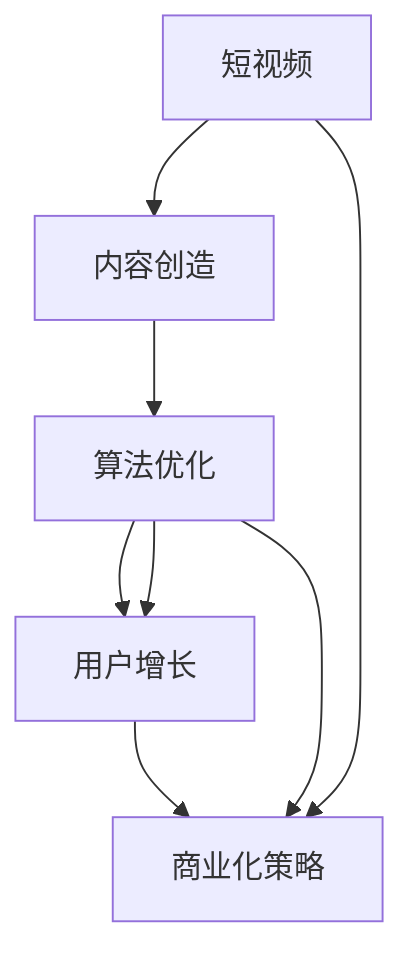

                 

# 短视频创业：碎片化时代的内容革命

> 关键词：短视频,内容创作,算法优化,用户增长,商业化策略

## 1. 背景介绍

### 1.1 问题由来
随着移动互联网和智能终端的普及，人们对内容消费的便利性和即时性需求日益增强，短视频逐渐成为数字媒体领域的重要形式。根据TrendForce的数据，2022年全球短视频市场规模将达到3000亿美元，增速超过40%。短视频市场不仅在娱乐和社交领域大放异彩，也在电商、教育、广告等多个垂直领域形成显著增长。

短视频平台的成功，离不开优质的内容创造与精准的用户需求匹配。目前，国内外主要的短视频平台如抖音、快手、YouTube等，都注重构建内容生态，吸引大量用户和创作者参与。短视频的碎片化特征、即看即停的特性，给内容创造和算法优化带来了新的挑战和机遇。本文将从内容创造、算法优化、用户增长和商业化策略等几个方面，深入探讨短视频创业的策略和挑战，为行业从业者提供专业指导。

### 1.2 问题核心关键点
短视频创业的核心在于构建优质的内容生态，吸引并留存大量用户，并在此基础上进行商业化变现。具体而言，以下几个关键点尤为关键：
- 内容创造：如何吸引和激励大量创作者持续产出优质内容。
- 算法优化：如何通过智能算法实现内容推荐和分发，提升用户体验。
- 用户增长：如何通过社交网络效应、推广活动等方式，吸引新用户加入。
- 商业化策略：如何平衡用户价值和商业收益，实现长期可持续的商业模式。

本文将从内容创造、算法优化、用户增长和商业化策略四个方面，详细介绍短视频创业的技术和管理策略，旨在为从业者提供全面、系统性的指导。

## 2. 核心概念与联系

### 2.1 核心概念概述

为更好地理解短视频创业的核心概念，本节将介绍几个关键概念：

- 短视频(Videoshare)：指时长较短，通常在1-3分钟内的视频内容。短视频因其信息丰富、形式灵活、易于传播等优势，深受用户欢迎。
- 内容创造(Content Creation)：指内容创作者使用各类软件工具，创作并上传短视频的行为。高质量的内容是短视频平台的核心竞争力。
- 算法优化(Algorithm Optimization)：指通过机器学习技术，实现对用户行为和内容特征的精准建模，从而实现个性化内容推荐和分发。
- 用户增长(User Acquisition)：指通过各种营销和推广手段，吸引新用户注册、下载和使用短视频平台。
- 商业化策略(Commercialization Strategy)：指在短视频平台上，如何通过广告、电商、付费内容等方式实现商业收益。

这些核心概念之间的关系可以通过以下Mermaid流程图来展示：



这个流程图展示短视频创业的关键环节及其相互关系：

1. 短视频平台通过内容创造获得优质内容，作为运营基础。
2. 利用算法优化，对内容进行推荐和分发，提升用户体验。
3. 通过用户增长策略，吸引更多用户，形成规模效应。
4. 最终，通过商业化策略实现平台盈利。

这些概念共同构成了短视频创业的完整生态链，从内容创造到商业变现，每个环节都至关重要。

## 3. 核心算法原理 & 具体操作步骤
### 3.1 算法原理概述

短视频创业的核心算法，包括内容推荐、用户行为分析、广告投放等多个方面。本文将重点介绍内容推荐算法，即通过机器学习模型，对用户行为和内容特征进行建模，实现个性化推荐。

内容推荐算法通常基于协同过滤、基于内容的推荐、混合推荐等方法。协同过滤方法通过用户历史行为数据，预测用户可能感兴趣的内容。基于内容的推荐方法则关注内容本身特征，如关键词、标签、风格等。混合推荐则将两种方法结合，取长补短，提升推荐效果。

在实践中，推荐算法一般分为离线训练和在线预测两个阶段：
1. 离线训练：利用历史用户行为数据，构建推荐模型，并进行交叉验证，优化模型参数。
2. 在线预测：将新用户的实时行为数据输入模型，实时预测推荐结果，并应用于内容推荐系统。

### 3.2 算法步骤详解

基于协同过滤的推荐算法，一般包括以下几个关键步骤：

**Step 1: 数据预处理**
- 收集用户历史行为数据，包括观看历史、点赞、评论、收藏等。
- 对数据进行清洗和归一化，去除噪声和异常值。

**Step 2: 特征工程**
- 提取用户行为特征，如观看时长、播放次数、点赞数等。
- 提取内容特征，如视频时长、主题、标签等。

**Step 3: 构建用户-内容矩阵**
- 将用户行为和内容特征进行组合，构建用户-内容矩阵，每个用户对应多个推荐项，每个推荐项对应多个用户。
- 可以使用稀疏矩阵进行存储，减少内存占用。

**Step 4: 相似度计算**
- 计算用户和推荐项之间的相似度，常用的方法有余弦相似度、Pearson相关系数等。
- 相似度矩阵可以表示为稠密矩阵，便于计算和操作。

**Step 5: 推荐结果生成**
- 根据相似度矩阵，生成推荐结果。可以使用召回率-精确率曲线、均方误差等指标评估模型效果。
- 实时生成推荐结果，并应用于内容推荐系统。

### 3.3 算法优缺点

基于协同过滤的推荐算法具有以下优点：
1. 简单易懂：方法简单，易于实现和调试。
2. 用户反馈驱动：通过用户行为数据驱动推荐，更符合用户实际需求。
3. 推荐效果稳定：适用于已有用户历史数据的情况，推荐效果相对稳定。

同时，该方法也存在一些局限性：
1. 冷启动问题：新用户缺乏历史数据，无法有效推荐。
2. 数据稀疏性：用户行为数据稀疏，可能导致推荐结果不准确。
3. 相似度计算开销大：相似度矩阵构建和计算复杂度较高，对计算资源要求较高。

### 3.4 算法应用领域

基于协同过滤的推荐算法，在各个短视频平台和电商平台上都得到了广泛应用，例如：

- 抖音推荐系统：利用用户行为数据，实现个性化的内容推荐，提升用户留存率。
- 亚马逊推荐引擎：通过用户浏览和购买行为数据，推荐相关商品，增加电商转化率。
- Netflix推荐系统：分析用户历史观影记录，推荐相似内容，优化用户体验。

这些平台通过协同过滤推荐算法，显著提升了平台的用户体验和商业收益。未来，随着大数据、人工智能技术的进一步发展，推荐算法还将不断优化，提升推荐效果。

## 4. 数学模型和公式 & 详细讲解 & 举例说明

### 4.1 数学模型构建

本节将使用数学语言对协同过滤推荐算法进行更加严格的刻画。

记用户集为 $U=\{u_1,u_2,\cdots,u_m\}$，内容集为 $I=\{i_1,i_2,\cdots,i_n\}$。设用户 $u_i$ 对内容 $i_j$ 的评分记为 $r_{i,j}$，这里评分可以是点击、观看时长、点赞等任何形式的反馈。假设用户 $u_i$ 对内容 $i_j$ 的评分向量为 $\mathbf{r}_i$，即：

$$
\mathbf{r}_i = (r_{i,1}, r_{i,2}, \cdots, r_{i,n})
$$

内容 $i_j$ 的评分向量为 $\mathbf{r}_j^T$，即：

$$
\mathbf{r}_j = (r_{1,j}, r_{2,j}, \cdots, r_{m,j})
$$

协同过滤推荐算法基于用户和内容之间的相似度矩阵 $\mathbf{S}$ 进行推荐，相似度矩阵定义为：

$$
\mathbf{S} = \mathbf{r}_u \mathbf{r}_i^T
$$

其中 $\mathbf{r}_u$ 和 $\mathbf{r}_i$ 分别是用户和内容的评分向量。

推荐结果可以通过相似度矩阵 $\mathbf{S}$ 计算得到，即对用户 $u_i$ 寻找与其相似度最高的 $k$ 个内容进行推荐，推荐结果为：

$$
\hat{\mathbf{r}}_{i,j} = \arg\max_{j \in I} \sum_{u \in U} s_{u,j}
$$

其中 $s_{u,j}$ 表示用户 $u$ 和内容 $j$ 的相似度，可以通过余弦相似度、Pearson相关系数等方法计算。

### 4.2 公式推导过程

以下我们以余弦相似度为例，推导协同过滤推荐算法的详细计算公式。

设用户 $u_i$ 和内容 $i_j$ 的评分向量分别为 $\mathbf{r}_i$ 和 $\mathbf{r}_j$，用户和内容之间的余弦相似度定义为：

$$
\cos(\mathbf{r}_i, \mathbf{r}_j) = \frac{\mathbf{r}_i \cdot \mathbf{r}_j}{\|\mathbf{r}_i\| \|\mathbf{r}_j\|}
$$

将余弦相似度矩阵 $\mathbf{S}$ 中的每个元素计算公式代入上述公式，可得：

$$
s_{u,i} = \cos(\mathbf{r}_u, \mathbf{r}_i) = \frac{\mathbf{r}_u^T \mathbf{r}_i}{\|\mathbf{r}_u\| \|\mathbf{r}_i\|}
$$

其中 $\|\mathbf{r}_u\|$ 和 $\|\mathbf{r}_i\|$ 分别表示向量 $\mathbf{r}_u$ 和 $\mathbf{r}_i$ 的范数。

根据余弦相似度矩阵的定义，用户 $u_i$ 对内容 $i_j$ 的推荐结果 $\hat{\mathbf{r}}_{i,j}$ 可通过以下公式计算：

$$
\hat{\mathbf{r}}_{i,j} = \arg\max_{j \in I} \sum_{u \in U} \cos(\mathbf{r}_u, \mathbf{r}_j) = \arg\max_{j \in I} \sum_{u \in U} \frac{\mathbf{r}_u^T \mathbf{r}_j}{\|\mathbf{r}_u\| \|\mathbf{r}_j\|}
$$

通过上述公式，我们就可以对用户行为数据进行建模，实现内容推荐。

### 4.3 案例分析与讲解

以下我们以抖音短视频推荐系统为例，具体讲解协同过滤推荐算法的应用。

抖音短视频推荐系统通过用户观看历史、点赞、评论等行为数据，对用户进行建模，构建用户-内容相似度矩阵 $\mathbf{S}$。具体而言：

1. 收集用户行为数据：包括用户观看过的短视频、点赞、评论等信息。
2. 对数据进行预处理：清洗和归一化数据，去除异常值和噪声。
3. 特征工程：提取用户行为特征，如观看时长、播放次数、点赞数等。
4. 构建用户-内容矩阵：将用户行为和内容特征进行组合，构建用户-内容相似度矩阵 $\mathbf{S}$。
5. 相似度计算：使用余弦相似度、Pearson相关系数等方法计算用户和内容之间的相似度，生成相似度矩阵 $\mathbf{S}$。
6. 推荐结果生成：根据相似度矩阵 $\mathbf{S}$，对用户 $u_i$ 生成推荐结果 $\hat{\mathbf{r}}_{i,j}$，推荐用户可能感兴趣的内容。

抖音推荐系统的推荐效果显著，用户留存率和活跃度显著提升。通过不断的算法优化和数据增强，抖音推荐系统能够快速响应用户需求，推荐用户感兴趣的内容，提升了用户体验和平台收益。

## 5. 项目实践：代码实例和详细解释说明
### 5.1 开发环境搭建

在进行短视频推荐系统开发前，我们需要准备好开发环境。以下是使用Python进行PyTorch开发的环境配置流程：

1. 安装Anaconda：从官网下载并安装Anaconda，用于创建独立的Python环境。

2. 创建并激活虚拟环境：
```bash
conda create -n pytorch-env python=3.8 
conda activate pytorch-env
```

3. 安装PyTorch：根据CUDA版本，从官网获取对应的安装命令。例如：
```bash
conda install pytorch torchvision torchaudio cudatoolkit=11.1 -c pytorch -c conda-forge
```

4. 安装TensorFlow：从官网下载并安装TensorFlow，用于实现深度学习算法。

5. 安装各类工具包：
```bash
pip install numpy pandas scikit-learn matplotlib tqdm jupyter notebook ipython
```

完成上述步骤后，即可在`pytorch-env`环境中开始推荐系统开发。

### 5.2 源代码详细实现

下面我们以协同过滤推荐算法为例，给出使用PyTorch实现抖音推荐系统的代码实现。

首先，定义推荐系统的类：

```python
import torch
import torch.nn as nn
import torch.nn.functional as F

class RecommendationSystem(nn.Module):
    def __init__(self, num_users, num_items, embedding_size):
        super(RecommendationSystem, self).__init__()
        self.user_embedding = nn.Embedding(num_users, embedding_size)
        self.item_embedding = nn.Embedding(num_items, embedding_size)
        self.sigmoid = nn.Sigmoid()
    
    def forward(self, user_idx, item_idx):
        user_embedding = self.user_embedding(user_idx)
        item_embedding = self.item_embedding(item_idx)
        dot_product = torch.matmul(user_embedding, item_embedding.t())
        score = self.sigmoid(dot_product)
        return score
```

然后，定义损失函数和优化器：

```python
from torch import Tensor
from torch.nn import BCELoss

loss_fn = BCELoss()
optimizer = torch.optim.Adam(model.parameters(), lr=0.01)
```

接着，定义训练函数：

```python
def train(model, train_data, batch_size, num_epochs):
    for epoch in range(num_epochs):
        for user_idx, item_idx, label in train_data:
            model.train()
            optimizer.zero_grad()
            score = model(user_idx, item_idx)
            loss = loss_fn(score, label)
            loss.backward()
            optimizer.step()
```

最后，启动训练流程：

```python
num_users = 1000
num_items = 1000
embedding_size = 100
num_epochs = 10

# 生成训练数据
train_data = []
for user_idx in range(num_users):
    for item_idx in range(num_items):
        label = (user_idx == item_idx)  # 只有当用户和内容ID一致时，标签为1
        train_data.append((user_idx, item_idx, label))

# 构建推荐模型
model = RecommendationSystem(num_users, num_items, embedding_size)

# 训练模型
train(model, train_data, batch_size=64, num_epochs=num_epochs)

# 保存模型
torch.save(model.state_dict(), 'recommendation_model.pth')
```

以上就是使用PyTorch对抖音推荐系统进行协同过滤算法实现的完整代码。可以看到，借助PyTorch的强大封装，我们可以高效地实现和训练推荐模型。

### 5.3 代码解读与分析

让我们再详细解读一下关键代码的实现细节：

**RecommendationSystem类**：
- `__init__`方法：初始化用户和内容嵌入层，sigmoid激活函数等。
- `forward`方法：实现模型的前向传播过程，计算用户和内容间的相似度。

**损失函数和优化器**：
- 使用BCELoss作为损失函数，计算模型输出与标签之间的交叉熵损失。
- 使用Adam优化器，进行模型参数的优化。

**训练函数**：
- 在每个epoch内，对训练集进行迭代训练，更新模型参数。
- 模型前向传播计算用户和内容间的相似度，并计算损失函数，进行反向传播更新模型参数。

**模型训练和保存**：
- 生成模拟的训练数据，用于训练模型。
- 定义推荐模型，并进行训练。
- 保存训练好的模型权重，供后续部署使用。

通过本文的系统梳理，可以看到，使用PyTorch实现抖音推荐系统相对简洁高效。开发者可以借助开源库和工具，在短时间内构建起一个高效、可扩展的推荐系统。

当然，工业级的系统实现还需考虑更多因素，如用户行为数据的存储和管理、推荐结果的实时生成等。但核心的协同过滤算法基本与此类似。

## 6. 实际应用场景
### 6.1 短视频创业中的内容推荐

在短视频创业中，内容推荐是提升用户体验和平台收益的核心环节。通过高效的内容推荐算法，可以显著提升用户粘性和平台活跃度，吸引更多用户加入。

具体而言，短视频平台可以采用协同过滤推荐算法，结合用户历史行为数据，实现个性化内容推荐。例如：
- 分析用户观看历史，推荐相似内容，提升用户观看时长。
- 根据用户点赞、评论行为，推荐热门内容，提高用户参与度。
- 利用用户特征，进行精准推荐，避免内容同质化。

通过智能推荐系统，平台能够不断优化用户画像，提高推荐效果，提升用户体验。

### 6.2 短视频创业中的用户增长

短视频创业除了内容推荐，用户增长也是关键环节。平台需要通过各种推广手段，吸引新用户注册和使用，增加用户数量。

以下是一些常用的用户增长策略：

**1. 社交网络效应**：短视频平台通过用户分享、点赞、评论等社交行为，扩大用户传播范围。通过社交网络效应，平台能够快速吸引新用户加入。

**2. KOL合作**：短视频平台可以与知名KOL进行合作，通过其粉丝效应吸引新用户。KOL的推荐和宣传，能够迅速提升平台知名度和用户量。

**3. 推广活动**：短视频平台可以通过线上线下推广活动，吸引新用户。如广告投放、社交媒体宣传、线下展会等，扩大平台影响力。

通过多种用户增长策略的组合应用，短视频平台能够快速积累用户量，形成规模效应。

### 6.3 短视频创业中的商业化变现

短视频创业最终目的是实现商业化变现，平台需要探索多种商业模式，实现盈利。

以下是一些常用的商业化策略：

**1. 广告收入**：短视频平台通过展示广告、贴片广告等方式，获取广告收入。广告主可以通过短视频平台的精准推荐系统，向目标用户投放广告。

**2. 电商变现**：短视频平台可以接入电商功能，推荐相关商品，实现电商变现。用户通过短视频观看，可以直接在平台上购买商品，提高用户购买转化率。

**3. 付费内容**：短视频平台可以提供付费内容，如会员订阅、直播打赏等，实现内容增值。通过付费内容，平台可以获取稳定的收益来源。

**4. 知识付费**：短视频平台可以引入知识付费功能，如课程、讲座、咨询等，提升用户价值。知识付费能够带来更高的附加值和利润。

通过多种商业化策略的组合应用，短视频平台能够实现稳定的盈利，保障平台长期可持续发展。

### 6.4 未来应用展望

随着短视频市场的不断壮大，短视频创业的前景将更加广阔。未来，短视频平台将在以下几个方面进一步拓展应用：

**1. 增强现实**：AR技术将带来全新的用户体验，通过虚拟场景和互动，增强用户沉浸感。

**2. 直播互动**：短视频平台将增加直播功能，通过实时互动，提升用户参与度。直播内容推荐和个性化推荐将成为重点研究方向。

**3. 跨平台协同**：短视频平台将与社交、电商等其他平台进行深度整合，实现多平台协同，提升用户价值。

**4. 个性化推荐**：未来推荐系统将更加智能化，通过多模态数据融合、因果推断等技术，提升推荐效果。

**5. 社交网络分析**：通过社交网络分析技术，挖掘用户间的关系，提升推荐准确性。

**6. 语音识别**：通过语音识别技术，提升视频搜索和推荐效果，提高用户查找视频效率。

总之，短视频平台将在内容推荐、用户增长和商业化变现等多个环节不断创新，带来更多商业价值和用户体验，推动短视频市场的进一步发展。

## 7. 工具和资源推荐
### 7.1 学习资源推荐

为了帮助开发者系统掌握短视频创业的推荐算法和商业化策略，这里推荐一些优质的学习资源：

1. 《推荐系统实战》书籍：详细介绍了推荐系统的实现原理和工程实践，适合新手和进阶者。
2. 《深度学习与推荐系统》课程：斯坦福大学开设的深度学习推荐系统课程，涵盖协同过滤、深度学习等多种推荐算法。
3. Coursera《推荐系统》课程：由Carnegie Mellon大学教授讲授，全面介绍了推荐系统的理论和实践。
4. YouTube推荐系统论文：由YouTube工程师撰写的推荐系统论文，详细介绍了YouTube的推荐算法和优化方法。
5. Kaggle竞赛：参加Kaggle推荐系统竞赛，通过实际项目练习推荐算法，提升实战能力。

通过对这些资源的学习实践，相信你一定能够掌握短视频创业的推荐算法和商业化策略，为平台带来稳定、高效的推荐体验和商业收益。

### 7.2 开发工具推荐

高效的开发离不开优秀的工具支持。以下是几款用于短视频推荐系统开发的常用工具：

1. PyTorch：基于Python的开源深度学习框架，灵活易用，适合快速迭代研究。

2. TensorFlow：由Google主导开发的开源深度学习框架，支持大规模工程应用。

3. FastFM：快速高效的因子化矩阵分解工具，适合处理大规模稀疏矩阵。

4. Scikit-learn：Python的机器学习库，提供丰富的算法实现，适合快速原型开发。

5. Hive：大数据计算工具，适合大规模数据处理和分析。

6. Spark：大数据计算引擎，支持分布式计算，适合大规模数据处理和分析。

合理利用这些工具，可以显著提升短视频推荐系统的开发效率，加快创新迭代的步伐。

### 7.3 相关论文推荐

短视频推荐系统的发展得益于学界的持续研究。以下是几篇奠基性的相关论文，推荐阅读：

1. BPR: Bayesian Personalized Ranking from Implicit Feedback（BPR算法）：提出基于隐式反馈的协同过滤推荐算法，刷新了推荐系统的效果。

2. DeepFM: A Factorization Machine with Deep Feature Interaction for Personalized Recommendation（DeepFM算法）：提出深度特征交互的协同过滤推荐算法，进一步提升了推荐效果。

3. Attention-based Recommender System with Visual Feature Learning（注意力机制推荐系统）：结合视觉特征和注意力机制，提升了推荐系统的准确性和鲁棒性。

4. Multi-task Learning for Recommendation Systems（多任务学习推荐系统）：通过多任务学习，提升推荐系统的效果。

5. NeuFactorize: Factorization Machines with Neural Networks（神经网络因子化机推荐系统）：结合神经网络，提升推荐系统的效果。

这些论文代表了大规模推荐系统的研究进展，通过学习这些前沿成果，可以帮助开发者提升推荐系统的性能和应用效果。

## 8. 总结：未来发展趋势与挑战
### 8.1 总结

本文从内容推荐、用户增长、商业化变现等几个方面，全面系统地介绍了短视频创业的推荐算法和商业化策略。具体而言，本文主要包括：

- 推荐算法的核心原理：协同过滤推荐算法的基本原理和实现步骤。
- 推荐算法的实际应用：抖音短视频推荐系统的具体实现和效果分析。
- 用户增长的关键策略：社交网络效应、KOL合作、推广活动等策略。
- 商业化变现的多样途径：广告收入、电商变现、付费内容等策略。

通过本文的系统梳理，可以看到，短视频平台在内容推荐、用户增长和商业化变现等多个环节，已经形成了相对成熟的技术和管理体系。这些技术和策略的结合应用，使得短视频平台能够在激烈的市场竞争中脱颖而出。

### 8.2 未来发展趋势

展望未来，短视频创业将在以下几个方面进一步拓展：

**1. 算法技术的不断优化**：推荐系统将不断引入更先进的算法技术，如深度学习、强化学习、因果推断等，提升推荐效果和用户体验。

**2. 跨平台协同的拓展**：短视频平台将与社交、电商等其他平台进行深度整合，实现多平台协同，提升用户价值。

**3. 个性化推荐的提升**：推荐系统将更加智能化，通过多模态数据融合、因果推断等技术，提升推荐效果。

**4. 实时推荐的实现**：短视频平台将实现实时推荐，提升用户粘性和平台活跃度。

**5. 推荐系统的可解释性**：推荐系统的决策过程将更加透明，用户能够理解和信任推荐结果。

**6. 推荐系统的伦理规范**：推荐系统将更加注重用户隐私和公平性，确保推荐结果的公平性和透明性。

这些趋势凸显了短视频创业的巨大潜力，将在未来进一步推动短视频市场的蓬勃发展。

### 8.3 面临的挑战

尽管短视频创业已经取得了显著成就，但在迈向更加智能化、普适化应用的过程中，仍面临诸多挑战：

**1. 用户增长的瓶颈**：虽然短视频市场增长迅速，但新用户的获取成本不断上升，需要通过创新策略提升用户增长效果。

**2. 推荐系统的精度**：随着用户需求的日益多样化，推荐系统的精度需要进一步提升，避免内容同质化。

**3. 商业化变现的难度**：短视频平台需要在内容推荐、用户增长和商业化变现之间找到平衡，实现盈利。

**4. 平台间的竞争加剧**：短视频市场竞争激烈，各平台之间的竞争将更加白热化，需要不断提升推荐系统的精准度和用户体验。

**5. 数据隐私和安全**：短视频平台需要确保用户数据隐私安全，防止数据泄露和滥用。

**6. 内容审查和审核**：短视频平台需要对内容进行严格审查和审核，避免有害信息的传播，保障用户安全。

这些挑战需要短视频平台不断进行技术和管理创新，才能实现可持续发展。

### 8.4 研究展望

面对短视频创业面临的挑战，未来的研究需要在以下几个方面寻求新的突破：

**1. 多模态推荐算法**：结合视觉、听觉等多模态数据，提升推荐系统的效果。

**2. 实时推荐系统**：通过分布式计算和大数据技术，实现实时推荐，提升用户体验。

**3. 推荐系统的公平性和透明性**：确保推荐系统的公平性和透明性，防止算法偏见和歧视。

**4. 推荐系统的伦理和合规性**：建立推荐系统的伦理和合规规范，确保用户权益和数据隐私。

**5. 推荐系统的自适应性**：通过自适应算法，提升推荐系统的泛化能力和鲁棒性。

**6. 推荐系统的自动化调优**：通过自动化调优技术，提升推荐系统的效果。

这些研究方向将进一步推动短视频推荐系统的演进，带来更加智能、普适的推荐体验，为短视频市场带来新的发展机遇。

## 9. 附录：常见问题与解答

**Q1：短视频创业的核心竞争力是什么？**

A: 短视频创业的核心竞争力在于优质的内容创造和精准的内容推荐。通过内容创造，平台吸引大量用户和创作者，并通过智能推荐，提升用户粘性和平台活跃度，实现商业化变现。

**Q2：短视频推荐系统的推荐效果如何提升？**

A: 短视频推荐系统的推荐效果可以通过以下几个方面提升：
1. 优化特征工程：提取更多有用的特征，提升推荐模型效果。
2. 引入更先进的算法：结合深度学习、强化学习等技术，提升推荐效果。
3. 数据增强：通过回译、近义替换等方式扩充训练集，提升模型泛化能力。
4. 参数调优：通过超参数调优，找到最优模型配置。
5. 实时数据处理：利用实时数据更新推荐模型，提升推荐效果。

**Q3：短视频创业的商业化策略有哪些？**

A: 短视频创业的商业化策略包括：
1. 广告收入：通过展示广告、贴片广告等方式获取广告收入。
2. 电商变现：接入电商功能，推荐相关商品，实现电商变现。
3. 付费内容：提供付费内容，如会员订阅、直播打赏等，实现内容增值。
4. 知识付费：引入知识付费功能，如课程、讲座、咨询等，提升用户价值。

**Q4：短视频平台如何提升用户粘性？**

A: 短视频平台可以通过以下几个方面提升用户粘性：
1. 内容多样性：提供多样化内容，满足用户不同需求。
2. 个性化推荐：通过智能推荐，提升用户观看到满足度。
3. 互动功能：增加点赞、评论、分享等互动功能，增强用户参与感。
4. 社区建设：构建用户社区，促进用户交流和分享。
5. 用户激励：通过积分、抽奖等方式激励用户活跃度。

**Q5：短视频创业如何应对内容同质化问题？**

A: 短视频创业可以通过以下几个方面应对内容同质化问题：
1. 内容审查和审核：严格内容审查和审核，避免有害信息传播。
2. 多样性鼓励：通过算法优化，鼓励内容多样性。
3. 用户反馈机制：建立用户反馈机制，收集用户意见，调整推荐策略。
4. 创作者激励：通过激励机制，引导创作者产出多样化内容。

通过不断优化推荐算法和内容审查机制，短视频平台可以有效应对内容同质化问题，提升用户体验和平台价值。

---

作者：禅与计算机程序设计艺术 / Zen and the Art of Computer Programming

