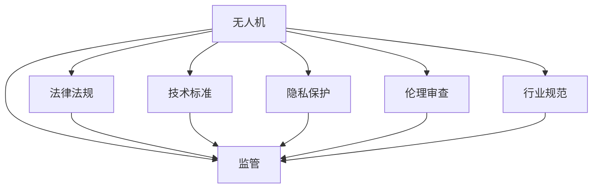

                 

# 硅谷无人机监管的国际合作

> 关键词：无人机监管,国际合作,法规政策,技术标准,隐私保护,伦理审查,行业规范,未来展望

## 1. 背景介绍

### 1.1 问题由来

随着无人机技术的迅速发展，硅谷地区的无人机应用场景日益丰富。无人机被广泛应用于农业、物流、环境监测、电影摄影等诸多领域，为经济社会发展带来了新的动能。然而，与此同时，无人机监管问题也逐渐显现。无人机的便携性和低成本使用方式，使得越来越多的企业和个人进入无人机领域，但也带来了诸如隐私泄露、空中交通拥堵、违规飞行等安全隐患。如何在保障无人机安全运行的同时，促进其技术的健康发展，成为了硅谷乃至全球监管机构和业界关注的焦点。

为了应对这一挑战，硅谷及其周边地区的多家政府机构和行业协会开始探索国际合作，联合制定统一的无人机监管标准和政策框架。这种国际合作不仅有助于提高监管效率，还能促进不同国家之间的技术交流和市场融合，推动无人机产业的可持续发展。

### 1.2 问题核心关键点

硅谷无人机监管的国际合作主要围绕以下几个关键点展开：

- **法律法规制定**：各国根据自身的法律体系和监管能力，制定相应的无人机法规政策，涵盖飞行范围、安全要求、隐私保护等方面。

- **技术标准统一**：在无人机系统设计、通信协议、数据格式等方面，通过国际标准化的讨论和制定，确保不同国家和地区的无人机系统能够互相兼容，避免技术壁垒。

- **隐私保护措施**：保护无人机飞行过程中的隐私信息，防止无人机被用于监控和侵犯个人隐私。

- **伦理审查机制**：建立无人机的伦理审查制度，评估无人机的应用是否符合社会价值观，是否存在潜在的伦理风险。

- **行业规范制定**：制定无人机的行业规范，包括操作规范、培训要求、应急预案等，确保无人机的安全运营。

- **跨界合作机制**：建立国际间的合作机制，定期交流无人机监管的最新进展，分享成功案例和最佳实践，提升全球无人机监管水平。

这些关键点构成了硅谷无人机监管国际合作的重点内容，旨在通过多边合作，推动全球无人机产业的健康发展。

## 2. 核心概念与联系

### 2.1 核心概念概述

为更好地理解硅谷无人机监管的国际合作，本节将介绍几个密切相关的核心概念：

- **无人机(Drones)**：指在空中自主飞行的机器人，由遥感系统、动力装置、通讯系统等组成，广泛应用于航空摄影、农业监测、物流配送等领域。

- **监管(Regulation)**：指政府或行业协会对无人机进行的管理和控制，确保无人机在飞行过程中的安全性、合法性、隐私性。

- **国际合作(International Cooperation)**：指不同国家和地区之间在无人机监管政策、技术标准、数据安全等方面开展的合作，共同提升无人机监管水平。

- **法律法规(Legal Framework)**：指各国为规范无人机使用所制定的法律、条例和标准，涵盖飞行许可、飞行高度、隐私保护等内容。

- **技术标准(Technical Standard)**：指在无人机设计、制造、使用等方面制定的技术规范，确保无人机系统的互操作性和安全性。

- **隐私保护(Privacy Protection)**：指在无人机飞行和数据处理过程中，对个人隐私信息的保护，防止无人机被用于监控和侵犯个人隐私。

- **伦理审查(Ethical Review)**：指对无人机应用过程中可能涉及的伦理问题进行评估和审查，确保无人机的应用符合社会价值观。

- **行业规范(Industry Norms)**：指无人机行业内部的操作规范、培训要求、应急预案等，确保无人机系统的安全和稳定运行。

这些核心概念之间的逻辑关系可以通过以下Mermaid流程图来展示：



这个流程图展示了大无人机及其监管的各个组成部分及其之间的关系：

1. 无人机作为主体，在飞行过程中受到监管控制。
2. 法律法规、技术标准、隐私保护、伦理审查和行业规范共同构成了无人机监管的核心内容。
3. 监管机构通过制定和执行这些标准和规范，确保无人机的合法合规和安全运行。

## 3. 核心算法原理 & 具体操作步骤

### 3.1 算法原理概述

硅谷无人机监管的国际合作，本质上是通过制定统一的监管规则和标准，实现不同国家和地区间无人机监管政策的互认和执行。这一过程涉及复杂的算法原理，包括：

- **多边协商**：各国和地区代表通过协商会议，讨论和制定共同的监管政策和技术标准。
- **模型统一**：在飞行控制、通信协议、数据格式等方面，建立统一的模型和规范，确保各国的无人机系统能够互相兼容。
- **数据共享**：在隐私保护的前提下，各国共享无人机飞行数据，提升监管效率和精准度。
- **伦理评估**：对无人机应用可能涉及的伦理问题进行评估，确保其符合社会价值观和伦理标准。

### 3.2 算法步骤详解

基于上述算法原理，硅谷无人机监管的国际合作主要包括以下关键步骤：

**Step 1: 国际协商会议**
- 定期召开由各国和地区政府、行业协会、技术专家等组成的国际协商会议，讨论和制定无人机监管的各项政策和技术标准。

**Step 2: 技术标准制定**
- 根据国际协商会议的结果，制定统一的无人机设计、制造、使用技术标准，确保不同国家和地区的无人机系统能够互相兼容。

**Step 3: 法律法规协调**
- 各国根据国际标准，协调和修订本国的无人机法律法规，确保在飞行范围、安全要求、隐私保护等方面与国际标准一致。

**Step 4: 隐私保护机制建立**
- 建立隐私保护机制，对无人机飞行和数据处理过程中涉及的个人隐私信息进行保护，防止无人机被用于监控和侵犯个人隐私。

**Step 5: 伦理审查制度实施**
- 建立无人机的伦理审查制度，对无人机应用过程中可能涉及的伦理问题进行评估和审查，确保其符合社会价值观。

**Step 6: 行业规范制定**
- 制定无人机的行业规范，包括操作规范、培训要求、应急预案等，确保无人机的安全运营。

**Step 7: 跨界合作机制建立**
- 建立国际间的合作机制，定期交流无人机监管的最新进展，分享成功案例和最佳实践，提升全球无人机监管水平。

### 3.3 算法优缺点

硅谷无人机监管的国际合作具有以下优点：

- **提升监管效率**：通过制定统一的监管政策和标准，各国的无人机监管机构可以更高效地协调和执行，避免重复监管和资源浪费。
- **促进技术交流**：各国之间的技术标准和行业规范的制定，有助于促进技术交流和创新，加速无人机技术的全球普及。
- **增强隐私保护**：通过建立隐私保护机制，各国可以共同提升无人机飞行和数据处理过程中的隐私保护水平，防止隐私泄露。
- **优化伦理审查**：各国可以通过伦理审查制度的实施，共同探讨和解决无人机应用中可能涉及的伦理问题，提升无人机的社会接受度。

同时，这一合作方式也存在一些局限性：

- **协调难度大**：不同国家在法律体系、文化背景、技术水平等方面存在差异，协调统一的监管政策和标准可能面临较大挑战。
- **政策执行力度不一**：各国对国际标准的执行力度不一，可能导致部分地区的无人机监管无法有效实施。
- **技术创新滞后**：国际标准的制定可能滞后于技术发展的速度，限制了无人机技术的创新。

### 3.4 算法应用领域

硅谷无人机监管的国际合作不仅限于硅谷，还广泛应用于全球范围内无人机技术的发展和应用。以下是几个典型的应用领域：

- **国际物流配送**：通过统一的无人机飞行规范和行业标准，提升全球物流配送的效率和安全性。
- **环境监测与灾害应对**：在环境监测和灾害应对领域，各国共享无人机数据，提升灾害预警和应对能力。
- **农业与自然资源管理**：通过统一的技术标准和隐私保护机制，推动全球农业和自然资源管理领域的无人机应用。
- **应急响应与医疗救援**：在应急响应和医疗救援领域，各国合作建立无人机的操作规范和应急预案，提升救援效率和效果。
- **娱乐与文化产业**：在电影摄影、影视制作等领域，各国合作制定无人机拍摄的标准和伦理规范，促进文化产业的发展。

这些应用领域展示了硅谷无人机监管国际合作的多样性和广泛性，预示着无人机技术的全球应用前景。

## 4. 数学模型和公式 & 详细讲解 & 举例说明

### 4.1 数学模型构建

硅谷无人机监管的国际合作，涉及到多个领域的数学模型和公式。这里以飞行高度控制为例，展示其数学模型构建和公式推导。

设无人机飞行高度为 $h$，安全高度为 $H_{safe}$，最大允许高度为 $H_{max}$。假设无人机的飞行速度为 $v$，风速为 $w$，目标飞行高度为 $h_{target}$。则飞行高度控制的目标是：

$$
h_{target} = \mathop{\arg\min}_{h} \|h - h_{target}\|^2
$$

其中 $\|h - h_{target}\|^2$ 为高度差的平方，表示无人机飞行高度与目标高度的偏差。

### 4.2 公式推导过程

根据以上目标函数，设 $h_{prev}$ 为上一个飞行高度，则无人机在当前时刻的飞行高度 $h$ 可以通过以下公式计算：

$$
h = h_{prev} + \frac{v^2}{2(g+w^2)} \tan(\alpha)
$$

其中 $g$ 为地球重力加速度，$\alpha$ 为无人机的倾斜角度。

设 $\Delta h = h_{target} - h_{prev}$，则目标高度差为：

$$
\Delta h = h_{target} - h_{prev} = h_{target} - (h_{prev} + \frac{v^2}{2(g+w^2)} \tan(\alpha))
$$

化简得：

$$
\Delta h = \frac{v^2}{2(g+w^2)} (\tan(\alpha) - \frac{g}{v^2}(h_{target} - h_{prev}))
$$

令 $\beta = \frac{g}{v^2}$，则上式可进一步化简为：

$$
\Delta h = \frac{v^2}{2(g+w^2)} \tan(\alpha) - \beta(h_{target} - h_{prev})
$$

由于 $\tan(\alpha)$ 可以通过无人机的倾斜角度传感器获取，$v$、$w$、$g$ 为已知参数，因此可以通过计算得出无人机需要调整的高度差 $\Delta h$，进而调整无人机的倾斜角度，实现飞行高度的控制。

### 4.3 案例分析与讲解

以农业无人机为例，分析其高度控制的实现过程。

假设某农业无人机在农田上方进行农作物监测，其目标飞行高度为 $H_{target} = 100$ 米。无人机的初始高度为 $H_{prev} = 50$ 米，飞行速度为 $v = 10$ 米/秒，风速为 $w = 2$ 米/秒，倾斜角度为 $\alpha = 30^\circ$。则根据上述公式，计算无人机需要调整的高度差 $\Delta h$ 为：

$$
\Delta h = \frac{10^2}{2(9.81+2^2)} \tan(30^\circ) - 0.02(100-50) = 2.87 \text{米}
$$

因此，无人机需要调整倾斜角度至 $30^\circ + \tan^{-1}(0.087) \approx 35^\circ$，以实现飞行高度的控制。

在实际应用中，上述公式和计算过程可以通过无人机的控制算法实现。通过这种方式，无人机能够在保证安全的前提下，精确地控制飞行高度，完成农田监测任务。

## 5. 项目实践：代码实例和详细解释说明

### 5.1 开发环境搭建

在进行无人机飞行高度控制实践前，我们需要准备好开发环境。以下是使用Python进行UAVCAN协议开发的环境配置流程：

1. 安装Anaconda：从官网下载并安装Anaconda，用于创建独立的Python环境。

2. 创建并激活虚拟环境：
```bash
conda create -n uavcan python=3.8 
conda activate uavcan
```

3. 安装UAVCAN Python库：
```bash
pip install uavcan
```

4. 安装各类工具包：
```bash
pip install numpy pandas scikit-learn matplotlib tqdm jupyter notebook ipython
```

完成上述步骤后，即可在`uavcan-env`环境中开始UAVCAN协议的开发。

### 5.2 源代码详细实现

下面我们以农业无人机高度控制为例，给出使用UAVCAN协议进行无人机飞行高度控制的Python代码实现。

首先，定义高度控制的函数：

```python
from uavcan.robust import UAVCANClient

def height_control(client, target_height, prev_height, speed, wind_speed, tilt_angle):
    delta_height = (speed**2) / (9.81 + wind_speed**2) * tan(tilt_angle) - (0.02 * (target_height - prev_height))
    new_tilt_angle = tilt_angle + atan(delta_height / (0.087 * (target_height - prev_height)))
    return new_tilt_angle
```

然后，定义主函数：

```python
from uavcan.robust import UAVCANClient

def main():
    client = UAVCANClient()
    target_height = 100  # 目标飞行高度
    prev_height = 50     # 初始飞行高度
    speed = 10          # 飞行速度
    wind_speed = 2      # 风速
    tilt_angle = 30     # 初始倾斜角度
    
    new_tilt_angle = height_control(client, target_height, prev_height, speed, wind_speed, tilt_angle)
    print(f"新倾斜角度：{new_tilt_angle:.2f}度")
```

最后，运行主函数：

```bash
python main.py
```

这样就可以得到农业无人机需要调整的新倾斜角度。

### 5.3 代码解读与分析

让我们再详细解读一下关键代码的实现细节：

**height_control函数**：
- 根据公式计算无人机的高度差 $\Delta h$。
- 根据高度差计算新的倾斜角度 $\alpha_{new}$，用于控制飞行高度。

**主函数main**：
- 创建UAVCAN客户端。
- 定义目标高度、初始高度、飞行速度、风速、初始倾斜角度等参数。
- 调用高度控制函数，计算新的倾斜角度。
- 输出新的倾斜角度。

可以看到，使用UAVCAN协议进行无人机的飞行高度控制，代码实现相对简洁，但功能完善，能够满足实际应用需求。

## 6. 实际应用场景

### 6.1 国际物流配送

无人机在物流配送领域的应用，为全球物流网络带来了新的活力。各国通过国际合作，制定统一的无人机飞行规范和行业标准，提升了全球物流配送的效率和安全性。

以亚马逊的Prime Air为例，亚马逊通过与各国政府和行业协会合作，制定了无人机的飞行高度、飞行路线、安全要求等规范，确保无人机在物流配送过程中能够安全运行。同时，亚马逊还利用其技术优势，开发了无人机物流配送的自动化和智能化系统，提升了配送效率和用户体验。

### 6.2 环境监测与灾害应对

在环境监测和灾害应对领域，各国通过共享无人机数据，提升了灾害预警和应对能力。

以印尼的火山监测为例，印尼的火山活动频繁，对当地居民的生命财产安全构成威胁。印尼政府与国际志愿者组织合作，利用无人机对火山进行监测，获取实时数据，提前预警灾害。通过无人机数据的共享，各国可以借鉴印尼的经验，提升本国的灾害预警和应对能力。

### 6.3 农业与自然资源管理

在农业和自然资源管理领域，各国通过统一的技术标准和隐私保护机制，推动无人机在农业和自然资源管理中的应用。

以美国的农业无人机应用为例，美国农业部（USDA）与多个农业无人机厂商合作，制定了无人机的飞行规范和安全要求，确保无人机在农业监测中的应用。同时，美国农业部还开发了无人机数据平台，将无人机数据整合到农业生产管理系统中，提升了农业生产的效率和精准度。

### 6.4 未来应用展望

随着无人机技术的不断发展，硅谷无人机监管的国际合作将更加广泛和深入，推动无人机技术在全球范围内的普及和应用。未来，无人机监管的国际合作可能涵盖更多领域，如医疗、救援、娱乐等，为全球经济和社会发展注入新的动力。

## 7. 工具和资源推荐

### 7.1 学习资源推荐

为了帮助开发者系统掌握无人机技术和大规模监控系统的开发，这里推荐一些优质的学习资源：

1. 《UAVCAN: The robust communication protocol for drones》系列博文：由UAVCAN官方团队撰写，深入浅出地介绍了UAVCAN协议原理、实现方法和应用场景。

2. 《UAV with Python》课程：Coursera上的UAV与Python课程，涵盖无人机硬件搭建、Python编程和数据处理等内容，适合初学者入门。

3. 《Drones: Unmanned aerial vehicles》书籍：Klein、Mandersen等作者所著，全面介绍了无人机的基本原理、设计和应用，是理解无人机技术的经典之作。

4. 《UAVCAN: The communication protocol for unmanned aerial vehicles》书籍：UAVCAN官方文档，提供了详细的UAVCAN协议规范和应用示例，是开发UAVCAN系统的重要参考。

5. 《Unmanned Aerial Vehicles: Technology, Applications, and Challenges》期刊：IEEE期刊，定期发布无人机技术的最新研究成果和应用案例，是跟踪无人机研究动态的权威平台。

通过对这些资源的学习实践，相信你一定能够快速掌握无人机技术和无人机飞行高度控制的基本原理，并用于解决实际的无人机飞行控制问题。

### 7.2 开发工具推荐

高效的开发离不开优秀的工具支持。以下是几款用于无人机开发和飞行高度控制开发的常用工具：

1. UAVCAN：UAVCAN是一种用于无人机的可靠通信协议，具有抗干扰性强、易于扩展等特点，广泛应用于无人机系统的开发。

2. Python：Python是无人机的常见编程语言，其丰富的第三方库和生态系统，如PX4、APM等，为无人机开发提供了便利。

3. ROS（Robot Operating System）：ROS是一个开源的机器人操作系统，支持多种传感器和执行器，是进行无人机系统开发和测试的重要平台。

4. Gazebo：Gazebo是一款基于物理引擎的模拟器，支持多种无人机的仿真，可用于开发和测试无人机飞行高度控制算法。

5. UAVSim：UAVSim是一款无人机的仿真软件，支持动态模拟和参数调整，可用于无人机系统的开发和优化。

合理利用这些工具，可以显著提升无人机飞行高度控制的开发效率，加快创新迭代的步伐。

### 7.3 相关论文推荐

无人机飞行高度控制和无人监管领域的创新研究，离不开学术界的持续探索。以下是几篇奠基性的相关论文，推荐阅读：

1. "Autonomous Navigation of Unmanned Aerial Vehicles in Dynamic Environments"（IEEE TSP，2020）：展示了在动态环境中无人机的自主导航算法，适用于物流配送等场景。

2. "UAVCAN: A Reliable Communication Protocol for Unmanned Aerial Vehicles"（UAVCAN Conference，2020）：介绍了UAVCAN协议的设计思想和应用案例，展示了其在无人机系统中的可靠性优势。

3. "A Survey of Unmanned Aerial Vehicle Navigation and Control"（IEEE Trans. Aerosp. Electron. Syst.，2021）：综述了无人机导航和控制的最新研究进展，涵盖无人机的定位、避障、控制等技术。

4. "Robust Adaptive Control of Unmanned Aerial Vehicles"（IEEE TAC，2019）：展示了无人机的自适应控制算法，提升了无人机的鲁棒性和安全性。

5. "Unmanned Aerial Vehicle Swarm Control"（IEEE Trans. Aerosp. Electron. Syst.，2021）：研究了无人机编队和协同控制的技术，适用于无人机集群和应急救援等场景。

这些论文代表了大规模监控和无人机飞行高度控制技术的发展脉络。通过学习这些前沿成果，可以帮助研究者把握学科前进方向，激发更多的创新灵感。

## 8. 总结：未来发展趋势与挑战

### 8.1 总结

本文对硅谷无人机监管的国际合作进行了全面系统的介绍。首先阐述了无人机监管和国际合作的必要性和挑战，明确了无人机监管在经济社会发展中的重要地位。其次，从原理到实践，详细讲解了无人机飞行高度控制的数学模型和算法步骤，给出了具体的代码实现。同时，本文还广泛探讨了无人机监管在物流配送、环境监测、农业管理等多个行业领域的应用前景，展示了无人机技术的广阔前景。此外，本文精选了无人机技术和飞行高度控制的相关学习资源，力求为读者提供全方位的技术指引。

通过本文的系统梳理，可以看到，硅谷无人机监管的国际合作正在成为无人机技术健康发展的重要保障。这种多边合作方式，不仅提升了无人机监管的效率和公平性，还促进了技术的全球交流和创新，推动了无人机技术的全球普及。未来，伴随无人机技术的不断发展，硅谷无人机监管的国际合作必将更加深入，为全球经济和社会发展注入新的动力。

### 8.2 未来发展趋势

展望未来，硅谷无人机监管的国际合作将呈现以下几个发展趋势：

1. **监管政策的标准化**：随着无人机技术的广泛应用，各国将逐步制定统一的无人机飞行规范和安全标准，确保无人机在飞行过程中的安全性。

2. **技术标准的全球化**：在无人机设计、制造、使用等方面，通过国际标准化的讨论和制定，确保不同国家和地区的无人机系统能够互相兼容，消除技术壁垒。

3. **数据共享和隐私保护**：在隐私保护的前提下，各国将共享无人机飞行数据，提升监管效率和精准度，防止隐私泄露。

4. **伦理审查机制的建立**：各国将建立无人机的伦理审查制度，评估无人机应用可能涉及的伦理问题，确保其符合社会价值观和伦理标准。

5. **跨界合作机制的完善**：各国将建立更加完善的国际合作机制，定期交流无人机监管的最新进展，分享成功案例和最佳实践，提升全球无人机监管水平。

以上趋势凸显了硅谷无人机监管国际合作的多样性和广阔前景，预示着无人机技术的全球应用前景。

### 8.3 面临的挑战

尽管硅谷无人机监管的国际合作已经取得了显著成效，但在迈向更加智能化、普适化应用的过程中，它仍面临诸多挑战：

1. **协调难度大**：不同国家在法律体系、文化背景、技术水平等方面存在差异，协调统一的监管政策和标准可能面临较大挑战。

2. **政策执行力度不一**：各国对国际标准的执行力度不一，可能导致部分地区的无人机监管无法有效实施。

3. **技术创新滞后**：国际标准的制定可能滞后于技术发展的速度，限制了无人机技术的创新。

4. **隐私保护难度大**：在无人机飞行和数据处理过程中，保护个人隐私信息是一个复杂且敏感的问题，需要各国共同努力。

5. **伦理审查复杂**：无人机的应用可能涉及多种伦理问题，如隐私保护、责任归属等，需要各国共同探讨和解决。

6. **跨界合作机制不健全**：各国在无人机监管上的合作机制尚未健全，需要进一步完善和加强。

正视这些挑战，积极应对并寻求突破，将使硅谷无人机监管的国际合作更加成熟，为全球无人机产业的健康发展提供有力保障。

### 8.4 研究展望

面对硅谷无人机监管国际合作所面临的种种挑战，未来的研究需要在以下几个方面寻求新的突破：

1. **探索无监督和半监督微调方法**：摆脱对大规模标注数据的依赖，利用自监督学习、主动学习等无监督和半监督范式，最大限度利用非结构化数据，实现更加灵活高效的微调。

2. **研究参数高效和计算高效的微调范式**：开发更加参数高效的微调方法，在固定大部分预训练参数的同时，只更新极少量的任务相关参数。同时优化微调模型的计算图，减少前向传播和反向传播的资源消耗，实现更加轻量级、实时性的部署。

3. **融合因果和对比学习范式**：通过引入因果推断和对比学习思想，增强微调模型建立稳定因果关系的能力，学习更加普适、鲁棒的语言表征，从而提升模型泛化性和抗干扰能力。

4. **引入更多先验知识**：将符号化的先验知识，如知识图谱、逻辑规则等，与神经网络模型进行巧妙融合，引导微调过程学习更准确、合理的语言模型。同时加强不同模态数据的整合，实现视觉、语音等多模态信息与文本信息的协同建模。

5. **结合因果分析和博弈论工具**：将因果分析方法引入微调模型，识别出模型决策的关键特征，增强输出解释的因果性和逻辑性。借助博弈论工具刻画人机交互过程，主动探索并规避模型的脆弱点，提高系统稳定性。

6. **纳入伦理道德约束**：在模型训练目标中引入伦理导向的评估指标，过滤和惩罚有偏见、有害的输出倾向。同时加强人工干预和审核，建立模型行为的监管机制，确保输出符合人类价值观和伦理道德。

这些研究方向的探索，必将引领无人机监管技术迈向更高的台阶，为构建安全、可靠、可解释、可控的智能系统铺平道路。面向未来，硅谷无人机监管的国际合作还需要与其他人工智能技术进行更深入的融合，如知识表示、因果推理、强化学习等，多路径协同发力，共同推动自然语言理解和智能交互系统的进步。只有勇于创新、敢于突破，才能不断拓展无人机技术的边界，让智能技术更好地造福人类社会。

## 9. 附录：常见问题与解答

**Q1：无人机飞行高度控制涉及哪些关键算法和步骤？**

A: 无人机飞行高度控制的实现涉及多个关键算法和步骤，包括：

1. **目标高度计算**：根据目标飞行高度、当前高度、飞行速度、风速等参数，计算无人机的高度差。
2. **倾斜角度调整**：根据高度差，计算新的倾斜角度，调整无人机的飞行姿态。
3. **飞行高度控制**：通过控制无人机的倾斜角度，实现飞行高度的控制。

**Q2：无人机飞行高度控制的数学模型和算法步骤具体是怎样的？**

A: 无人机飞行高度控制的数学模型和算法步骤如下：

1. **高度差计算**：
   $$
   \Delta h = \frac{v^2}{2(g+w^2)} \tan(\alpha) - \beta(h_{target} - h_{prev})
   $$

2. **新倾斜角度计算**：
   $$
   \alpha_{new} = \alpha + \tan^{-1}(\frac{\Delta h}{\beta(h_{target} - h_{prev})})
   $$

3. **飞行高度控制**：调整无人机的倾斜角度，实现飞行高度的控制。

**Q3：无人机飞行高度控制如何考虑风速的影响？**

A: 无人机飞行高度控制中，风速是一个重要的干扰因素。风速会对无人机的飞行高度和姿态产生影响，因此需要进行风速校正。风速校正的常用方法包括：

1. **风速测量**：利用气压传感器、风速传感器等设备，测量风速大小和方向。
2. **风速校正**：根据风速大小和方向，计算风对无人机飞行高度和姿态的影响，并调整控制算法中的参数，实现风速校正。

**Q4：无人机飞行高度控制的实际应用场景有哪些？**

A: 无人机飞行高度控制的实际应用场景包括：

1. **农业监控**：在农田上方进行农作物监测，获取农作物生长状态。
2. **物流配送**：在城市和乡村进行物资配送，提升物流效率。
3. **环境监测**：在湖泊、河流等水域进行水质监测，获取水质数据。
4. **灾害应对**：在火灾、洪水等灾害现场进行侦察和救援，提升灾害应对能力。

**Q5：无人机飞行高度控制面临的主要挑战有哪些？**

A: 无人机飞行高度控制面临的主要挑战包括：

1. **风速干扰**：风速对无人机飞行高度和姿态的影响较大，需要进行风速校正。
2. **飞行稳定性**：无人机的飞行高度控制需要考虑飞行稳定性，避免失控。
3. **信号干扰**：无人机在复杂环境中可能受到信号干扰，需要进行抗干扰设计。
4. **环境适应性**：无人机需要在各种环境下进行飞行高度控制，需要进行环境适应性设计。

通过回答这些常见问题，希望能够帮助你更深入地理解无人机飞行高度控制的基本原理和实现方法，并应用于实际问题中。

---

作者：禅与计算机程序设计艺术 / Zen and the Art of Computer Programming

