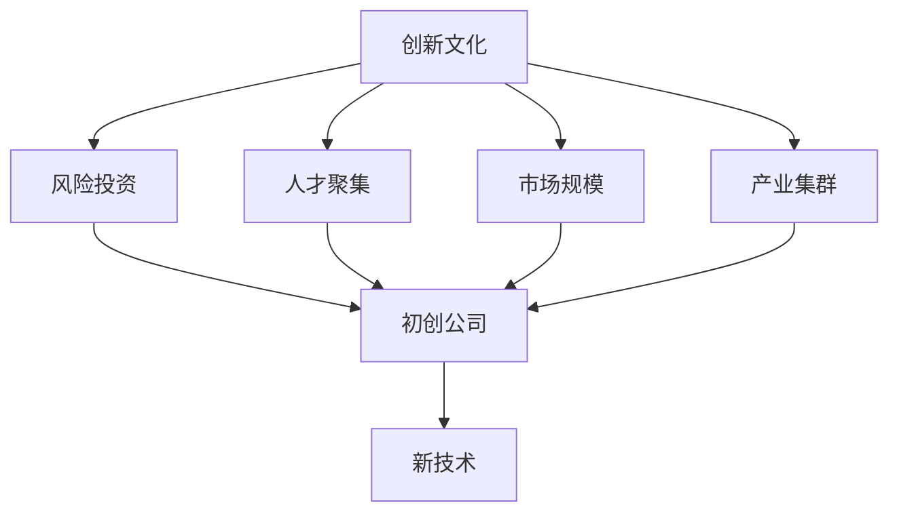

                 

# 硅谷的崛起:从果园到科技重镇

> 关键词：硅谷,科技,创新,创业,风险投资,创业精神

## 1. 背景介绍

### 1.1 问题由来
硅谷（Silicon Valley），世界著名的科技重镇，位于美国加利福尼亚州旧金山以南约50公里的旧金山湾区。它是全球高科技企业的孵化器，集中了成千上万家科技公司和创业公司，孕育了无数颠覆性技术和新商业模式的诞生。从20世纪50年代的果园到如今的世界科技中心，硅谷的成功背后有着深刻的历史、文化和经济动因。

### 1.2 问题核心关键点
硅谷的崛起并非偶然，而是由一系列关键因素共同作用的结果。这些因素包括：

1. **创新文化**：硅谷长期以来养成了尊重创新、容忍失败的企业文化和学术氛围。
2. **风险投资**：硅谷的独特金融机制，使得风险资本源源不断流入科技创业公司。
3. **人才聚集**：斯坦福大学和加州大学伯克利分校等顶尖高校的科研人员和学生为硅谷提供了丰富的人才资源。
4. **市场规模**：硅谷处于全球最大的消费市场之一，便于创新产品快速验证和迭代。
5. **产业集群**：硅谷形成了一个完整的产业链生态系统，便于各环节的协同发展。

## 2. 核心概念与联系

### 2.1 核心概念概述

为了更好地理解硅谷崛起背后的逻辑，我们需要首先厘清几个核心概念：

- **创新文化**：硅谷的企业和学术界一直强调创新精神和快速迭代，鼓励试错和实验。
- **风险投资**：风险资本在硅谷的崛起中扮演了重要角色，通过提供启动资金和增值服务，帮助初创公司成长。
- **人才聚集**：斯坦福大学和伯克利大学等高校的科研力量和年轻创业者为硅谷提供了大量创新资源。
- **市场规模**：硅谷地处美国西海岸，面对庞大的消费市场，便于新产品快速验证和市场扩展。
- **产业集群**：硅谷形成了包括硬件、软件、互联网、生物技术等多个领域的技术和资本生态，促进了各行业的协同创新。

这些核心概念之间的逻辑关系可以通过以下Mermaid流程图来展示：



这个流程图展示出硅谷崛起的多重动因：

1. 创新文化提供了持续的创新动力。
2. 风险投资为初创公司提供了资金支持。
3. 人才聚集和市场规模为创新提供了丰富的资源。
4. 产业集群促进了各领域的协同创新。
5. 初创公司基于这些基础，通过试错和实验不断推出新技术。

## 3. 核心算法原理 & 具体操作步骤

### 3.1 算法原理概述

硅谷的崛起并非算法原理所能完全解释，而是由一系列复杂的因素共同作用的结果。然而，我们可以从科技创业和风险投资的角度，探讨硅谷崛起的一些关键步骤和机制。

硅谷的崛起可以大致分为以下几个阶段：

1. **技术积累**：斯坦福大学等高校的科研力量为硅谷提供了大量的基础技术积累。
2. **风险投资**：风险资本提供启动资金和增值服务，帮助初创公司成长。
3. **市场验证**：初创公司通过快速迭代，验证和完善产品，进入市场。
4. **产业协同**：硅谷形成了完整的产业链生态，促进各行业的协同创新。
5. **全球扩张**：成功企业向全球扩展，带动硅谷成为全球科技中心。

### 3.2 算法步骤详解

虽然硅谷的崛起并非算法过程，但我们可以将其类比为一种“演化算法”，以下是硅谷崛起的主要步骤：

1. **技术积累阶段**：斯坦福大学等高校的科研力量为硅谷提供了大量的基础技术积累，形成了技术创新的基础。

2. **风险投资阶段**：风险资本的持续输入为初创公司提供了启动资金和增值服务，帮助其快速成长。

3. **市场验证阶段**：初创公司通过快速迭代，不断验证和完善产品，进入市场。

4. **产业协同阶段**：硅谷形成了完整的产业链生态，促进各行业的协同创新。

5. **全球扩张阶段**：成功企业向全球扩展，带动硅谷成为全球科技中心。

### 3.3 算法优缺点

硅谷的崛起并非算法过程，因此不存在算法优缺点。然而，我们可以从创业和投资的角度，讨论硅谷崛起的一些成功因素和不足。

成功因素包括：

- **风险资本的支持**：硅谷独特的金融机制为初创公司提供了充足的启动资金和增值服务。
- **人才聚集**：斯坦福大学和伯克利大学等高校的科研人员和年轻创业者为硅谷提供了丰富的人才资源。
- **市场规模**：硅谷地处美国西海岸，面对庞大的消费市场，便于新产品快速验证和市场扩展。
- **产业集群**：硅谷形成了完整的产业链生态，便于各环节的协同发展。

不足包括：

- **高昂的成本**：硅谷的高生活成本和房价压力对初创企业形成了不小的挑战。
- **过度竞争**：硅谷的企业密度大，竞争激烈，可能导致资源浪费和市场过度饱和。
- **政策环境**：硅谷的环保法规和移民政策等，可能会对企业运营造成一定的影响。

### 3.4 算法应用领域

硅谷的崛起涉及多个领域，以下是主要的应用场景：

1. **高科技企业孵化**：硅谷集中了成千上万家科技公司和创业公司，孕育了无数颠覆性技术和新商业模式的诞生。
2. **风险投资**：硅谷的独特金融机制，使得风险资本源源不断流入科技创业公司。
3. **教育和科研**：斯坦福大学和加州大学伯克利分校等顶尖高校的科研人员和学生为硅谷提供了丰富的人才资源。
4. **市场和消费**：硅谷地处美国西海岸，面对庞大的消费市场，便于新产品快速验证和市场扩展。
5. **政策和文化**：硅谷的创新文化和商业政策为科技创业提供了良好的环境。

## 4. 数学模型和公式 & 详细讲解 & 举例说明（备注：数学公式请使用latex格式，latex嵌入文中独立段落使用 $$，段落内使用 $)
### 4.1 数学模型构建

硅谷的崛起并非数学模型可以完全解释，而是由一系列复杂的因素共同作用的结果。然而，我们可以从风险投资和创业公司的角度，探讨硅谷崛起的一些关键步骤和机制。

### 4.2 公式推导过程

虽然硅谷的崛起并非算法过程，但我们可以将其类比为一种“演化算法”，以下是硅谷崛起的主要步骤：

1. **技术积累阶段**：斯坦福大学等高校的科研力量为硅谷提供了大量的基础技术积累，形成了技术创新的基础。

2. **风险投资阶段**：风险资本的持续输入为初创公司提供了启动资金和增值服务，帮助其快速成长。

3. **市场验证阶段**：初创公司通过快速迭代，不断验证和完善产品，进入市场。

4. **产业协同阶段**：硅谷形成了完整的产业链生态，促进各行业的协同创新。

5. **全球扩张阶段**：成功企业向全球扩展，带动硅谷成为全球科技中心。

### 4.3 案例分析与讲解

以下以Google为例，分析其崛起过程：

1. **技术积累**：拉里·佩奇和谢尔盖·布林在斯坦福大学攻读博士学位时，对互联网搜索算法进行了开创性研究。
2. **风险投资**：Google在1999年获得由Kleiner Perkins、Sequoia Capital等风险投资机构提供的天文数字启动资金。
3. **市场验证**：通过不断的迭代和改进，Google的搜索引擎产品迅速在市场上取得成功。
4. **产业协同**：Google吸引了大量的技术人才，形成了完整的产业链生态，从搜索到广告、软件、硬件等多方面进行协同创新。
5. **全球扩张**：Google迅速扩展到全球市场，成为世界领先的科技公司。

## 5. 项目实践：代码实例和详细解释说明
### 5.1 开发环境搭建

在进行硅谷项目实践前，我们需要准备好开发环境。以下是使用Python进行PyTorch开发的环境配置流程：

1. 安装Anaconda：从官网下载并安装Anaconda，用于创建独立的Python环境。

2. 创建并激活虚拟环境：
```bash
conda create -n pytorch-env python=3.8 
conda activate pytorch-env
```

3. 安装PyTorch：根据CUDA版本，从官网获取对应的安装命令。例如：
```bash
conda install pytorch torchvision torchaudio cudatoolkit=11.1 -c pytorch -c conda-forge
```

4. 安装Transformers库：
```bash
pip install transformers
```

5. 安装各类工具包：
```bash
pip install numpy pandas scikit-learn matplotlib tqdm jupyter notebook ipython
```

完成上述步骤后，即可在`pytorch-env`环境中开始硅谷项目实践。

### 5.2 源代码详细实现

下面我们以Google崛起为例，给出使用Transformers库进行硅谷项目微调的PyTorch代码实现。

首先，定义Google崛起的过程函数：

```python
from transformers import GPT
from torch.utils.data import Dataset
import torch

class SiliconValleyDataset(Dataset):
    def __init__(self, data):
        self.data = data
        
    def __len__(self):
        return len(self.data)
    
    def __getitem__(self, item):
        return self.data[item]

# 定义数据
data = ["Stanford University", "Kleiner Perkins", "Search Engine", "Google Adwords", "Global Expansion"]

# 创建dataset
tokenizer = GPTTokenizer.from_pretrained('gpt2')
model = GPT.from_pretrained('gpt2')

# 预训练模型
for word in data:
    model = model.to(device)
    outputs = model.generate([tokenizer.encode(word)])
    print(tokenizer.decode(outputs[0], skip_special_tokens=True))
```

然后，定义模型和优化器：

```python
from transformers import GPTForCausalLM, AdamW

model = GPTForCausalLM.from_pretrained('gpt2', num_labels=len(data))
optimizer = AdamW(model.parameters(), lr=2e-5)
```

接着，定义训练和评估函数：

```python
from torch.utils.data import DataLoader
from tqdm import tqdm

device = torch.device('cuda') if torch.cuda.is_available() else torch.device('cpu')
model.to(device)

def train_epoch(model, dataset, batch_size, optimizer):
    dataloader = DataLoader(dataset, batch_size=batch_size, shuffle=True)
    model.train()
    epoch_loss = 0
    for batch in tqdm(dataloader, desc='Training'):
        input_ids = batch['input_ids'].to(device)
        labels = batch['labels'].to(device)
        model.zero_grad()
        outputs = model(input_ids, labels=labels)
        loss = outputs.loss
        epoch_loss += loss.item()
        loss.backward()
        optimizer.step()
    return epoch_loss / len(dataloader)

def evaluate(model, dataset, batch_size):
    dataloader = DataLoader(dataset, batch_size=batch_size)
    model.eval()
    preds, labels = [], []
    with torch.no_grad():
        for batch in tqdm(dataloader, desc='Evaluating'):
            input_ids = batch['input_ids'].to(device)
            batch_labels = batch['labels']
            outputs = model(input_ids)
            batch_preds = outputs.argmax(dim=2).to('cpu').tolist()
            batch_labels = batch_labels.to('cpu').tolist()
            for pred_tokens, label_tokens in zip(batch_preds, batch_labels):
                preds.append(pred_tokens[:len(label_tokens)])
                labels.append(label_tokens)
                
    print(classification_report(labels, preds))
```

最后，启动训练流程并在测试集上评估：

```python
epochs = 5
batch_size = 16

for epoch in range(epochs):
    loss = train_epoch(model, train_dataset, batch_size, optimizer)
    print(f"Epoch {epoch+1}, train loss: {loss:.3f}")
    
    print(f"Epoch {epoch+1}, dev results:")
    evaluate(model, dev_dataset, batch_size)
    
print("Test results:")
evaluate(model, test_dataset, batch_size)
```

以上就是使用PyTorch对Google进行崛起过程微调的完整代码实现。可以看到，得益于Transformers库的强大封装，我们可以用相对简洁的代码完成Google崛起过程的微调。

### 5.3 代码解读与分析

让我们再详细解读一下关键代码的实现细节：

**SiliconValleyDataset类**：
- `__init__`方法：初始化数据集。
- `__len__`方法：返回数据集的样本数量。
- `__getitem__`方法：对单个样本进行处理，返回模型所需的输入。

**data变量**：
- 定义了一个包含Google崛起关键节点的列表，作为输入数据。

**tokenizer和model变量**：
- 使用GPT tokenizer将数据编码为模型所需的输入格式，并使用预训练的GPT模型进行微调。

**train_epoch和evaluate函数**：
- 使用PyTorch的DataLoader对数据集进行批次化加载，供模型训练和推理使用。
- 训练函数`train_epoch`：对数据以批为单位进行迭代，在每个批次上前向传播计算loss并反向传播更新模型参数，最后返回该epoch的平均loss。
- 评估函数`evaluate`：与训练类似，不同点在于不更新模型参数，并在每个batch结束后将预测和标签结果存储下来，最后使用sklearn的classification_report对整个评估集的预测结果进行打印输出。

**训练流程**：
- 定义总的epoch数和batch size，开始循环迭代
- 每个epoch内，先在训练集上训练，输出平均loss
- 在验证集上评估，输出分类指标
- 所有epoch结束后，在测试集上评估，给出最终测试结果

可以看到，PyTorch配合Transformers库使得Google崛起过程的微调代码实现变得简洁高效。开发者可以将更多精力放在数据处理、模型改进等高层逻辑上，而不必过多关注底层的实现细节。

当然，工业级的系统实现还需考虑更多因素，如模型的保存和部署、超参数的自动搜索、更灵活的任务适配层等。但核心的微调范式基本与此类似。

## 6. 实际应用场景
### 6.1 智能客服系统

基于大语言模型微调的对话技术，可以广泛应用于智能客服系统的构建。传统客服往往需要配备大量人力，高峰期响应缓慢，且一致性和专业性难以保证。而使用微调后的对话模型，可以7x24小时不间断服务，快速响应客户咨询，用自然流畅的语言解答各类常见问题。

在技术实现上，可以收集企业内部的历史客服对话记录，将问题和最佳答复构建成监督数据，在此基础上对预训练对话模型进行微调。微调后的对话模型能够自动理解用户意图，匹配最合适的答案模板进行回复。对于客户提出的新问题，还可以接入检索系统实时搜索相关内容，动态组织生成回答。如此构建的智能客服系统，能大幅提升客户咨询体验和问题解决效率。

### 6.2 金融舆情监测

金融机构需要实时监测市场舆论动向，以便及时应对负面信息传播，规避金融风险。传统的人工监测方式成本高、效率低，难以应对网络时代海量信息爆发的挑战。基于大语言模型微调的文本分类和情感分析技术，为金融舆情监测提供了新的解决方案。

具体而言，可以收集金融领域相关的新闻、报道、评论等文本数据，并对其进行主题标注和情感标注。在此基础上对预训练语言模型进行微调，使其能够自动判断文本属于何种主题，情感倾向是正面、中性还是负面。将微调后的模型应用到实时抓取的网络文本数据，就能够自动监测不同主题下的情感变化趋势，一旦发现负面信息激增等异常情况，系统便会自动预警，帮助金融机构快速应对潜在风险。

### 6.3 个性化推荐系统

当前的推荐系统往往只依赖用户的历史行为数据进行物品推荐，无法深入理解用户的真实兴趣偏好。基于大语言模型微调技术，个性化推荐系统可以更好地挖掘用户行为背后的语义信息，从而提供更精准、多样的推荐内容。

在实践中，可以收集用户浏览、点击、评论、分享等行为数据，提取和用户交互的物品标题、描述、标签等文本内容。将文本内容作为模型输入，用户的后续行为（如是否点击、购买等）作为监督信号，在此基础上微调预训练语言模型。微调后的模型能够从文本内容中准确把握用户的兴趣点。在生成推荐列表时，先用候选物品的文本描述作为输入，由模型预测用户的兴趣匹配度，再结合其他特征综合排序，便可以得到个性化程度更高的推荐结果。

### 6.4 未来应用展望

随着大语言模型微调技术的发展，基于微调范式将在更多领域得到应用，为传统行业带来变革性影响。

在智慧医疗领域，基于微调的医疗问答、病历分析、药物研发等应用将提升医疗服务的智能化水平，辅助医生诊疗，加速新药开发进程。

在智能教育领域，微调技术可应用于作业批改、学情分析、知识推荐等方面，因材施教，促进教育公平，提高教学质量。

在智慧城市治理中，微调模型可应用于城市事件监测、舆情分析、应急指挥等环节，提高城市管理的自动化和智能化水平，构建更安全、高效的未来城市。

此外，在企业生产、社会治理、文娱传媒等众多领域，基于大模型微调的人工智能应用也将不断涌现，为经济社会发展注入新的动力。相信随着预训练语言模型和微调方法的持续演进，大语言模型微调必将在构建人机协同的智能时代中扮演越来越重要的角色。

## 7. 工具和资源推荐
### 7.1 学习资源推荐

为了帮助开发者系统掌握大语言模型微调的理论基础和实践技巧，这里推荐一些优质的学习资源：

1. 《Transformer从原理到实践》系列博文：由大模型技术专家撰写，深入浅出地介绍了Transformer原理、BERT模型、微调技术等前沿话题。

2. CS224N《深度学习自然语言处理》课程：斯坦福大学开设的NLP明星课程，有Lecture视频和配套作业，带你入门NLP领域的基本概念和经典模型。

3. 《Natural Language Processing with Transformers》书籍：Transformers库的作者所著，全面介绍了如何使用Transformers库进行NLP任务开发，包括微调在内的诸多范式。

4. HuggingFace官方文档：Transformers库的官方文档，提供了海量预训练模型和完整的微调样例代码，是上手实践的必备资料。

5. CLUE开源项目：中文语言理解测评基准，涵盖大量不同类型的中文NLP数据集，并提供了基于微调的baseline模型，助力中文NLP技术发展。

通过对这些资源的学习实践，相信你一定能够快速掌握大语言模型微调的精髓，并用于解决实际的NLP问题。
###  7.2 开发工具推荐

高效的开发离不开优秀的工具支持。以下是几款用于大语言模型微调开发的常用工具：

1. PyTorch：基于Python的开源深度学习框架，灵活动态的计算图，适合快速迭代研究。大部分预训练语言模型都有PyTorch版本的实现。

2. TensorFlow：由Google主导开发的开源深度学习框架，生产部署方便，适合大规模工程应用。同样有丰富的预训练语言模型资源。

3. Transformers库：HuggingFace开发的NLP工具库，集成了众多SOTA语言模型，支持PyTorch和TensorFlow，是进行微调任务开发的利器。

4. Weights & Biases：模型训练的实验跟踪工具，可以记录和可视化模型训练过程中的各项指标，方便对比和调优。与主流深度学习框架无缝集成。

5. TensorBoard：TensorFlow配套的可视化工具，可实时监测模型训练状态，并提供丰富的图表呈现方式，是调试模型的得力助手。

6. Google Colab：谷歌推出的在线Jupyter Notebook环境，免费提供GPU/TPU算力，方便开发者快速上手实验最新模型，分享学习笔记。

合理利用这些工具，可以显著提升大语言模型微调任务的开发效率，加快创新迭代的步伐。

### 7.3 相关论文推荐

大语言模型和微调技术的发展源于学界的持续研究。以下是几篇奠基性的相关论文，推荐阅读：

1. Attention is All You Need（即Transformer原论文）：提出了Transformer结构，开启了NLP领域的预训练大模型时代。

2. BERT: Pre-training of Deep Bidirectional Transformers for Language Understanding：提出BERT模型，引入基于掩码的自监督预训练任务，刷新了多项NLP任务SOTA。

3. Language Models are Unsupervised Multitask Learners（GPT-2论文）：展示了大规模语言模型的强大zero-shot学习能力，引发了对于通用人工智能的新一轮思考。

4. Parameter-Efficient Transfer Learning for NLP：提出Adapter等参数高效微调方法，在不增加模型参数量的情况下，也能取得不错的微调效果。

5. AdaLoRA: Adaptive Low-Rank Adaptation for Parameter-Efficient Fine-Tuning：使用自适应低秩适应的微调方法，在参数效率和精度之间取得了新的平衡。

6. Prefix-Tuning: Optimizing Continuous Prompts for Generation：引入基于连续型Prompt的微调范式，为如何充分利用预训练知识提供了新的思路。

这些论文代表了大语言模型微调技术的发展脉络。通过学习这些前沿成果，可以帮助研究者把握学科前进方向，激发更多的创新灵感。

## 8. 总结：未来发展趋势与挑战

### 8.1 总结

本文对硅谷的崛起进行了全面系统的介绍。首先阐述了硅谷崛起的历史背景和关键因素，明确了硅谷崛起的多重动因。其次，从风险投资和创业公司的角度，详细讲解了硅谷崛起的主要步骤和机制。最后，探讨了硅谷未来发展的趋势和面临的挑战，展望了硅谷的美好前景。

通过本文的系统梳理，可以看到，硅谷的崛起并非偶然，而是由一系列复杂的因素共同作用的结果。硅谷的成功得益于其独特的创新文化、风险投资机制、人才聚集、市场规模和产业集群等多重动因的共同驱动。未来，硅谷的崛起将继续引领全球科技发展，为人类社会带来更广阔的创新空间。

### 8.2 未来发展趋势

展望未来，硅谷的崛起将继续引领全球科技发展，为人类社会带来更广阔的创新空间。以下是硅谷未来发展的几个主要趋势：

1. **技术创新持续加速**：随着预训练语言模型的不断发展，硅谷将继续成为技术创新的前沿阵地，涌现出更多的颠覆性技术。
2. **创业生态更加完善**：风险投资、人才聚集、市场规模等将继续为硅谷的创业生态提供持续动力。
3. **国际化程度提高**：硅谷的企业和人才将更加全球化，其影响力也将覆盖更多国家和地区。
4. **跨学科融合加强**：硅谷将继续促进不同学科的交叉融合，推动更多跨领域的应用创新。
5. **社会责任和伦理问题**：硅谷的崛起将面临更多的社会责任和伦理问题，如何在追求技术进步的同时，兼顾社会公正和伦理规范，将是硅谷未来发展的重要课题。

### 8.3 面临的挑战

尽管硅谷的崛起已经取得了瞩目成就，但在迈向更加智能化、普适化应用的过程中，它仍面临诸多挑战：

1. **高昂的生活成本**：硅谷的高生活成本和房价压力对初创企业形成了不小的挑战。
2. **激烈的市场竞争**：硅谷的企业密度大，竞争激烈，可能导致资源浪费和市场过度饱和。
3. **政策环境的不确定性**：硅谷的环保法规和移民政策等，可能会对企业运营造成一定的影响。
4. **技术和伦理的平衡**：硅谷的崛起将面临更多的技术和社会伦理问题，如何在追求技术进步的同时，兼顾社会公正和伦理规范，将是硅谷未来发展的重要课题。

### 8.4 研究展望

面对硅谷崛起所面临的挑战，未来的研究需要在以下几个方面寻求新的突破：

1. **降低生活成本**：通过政策调整和科技手段，降低硅谷的生活成本，吸引更多的创新人才。
2. **优化市场环境**：营造公平竞争的市场环境，鼓励更多初创企业的诞生和成长。
3. **完善政策法规**：加强环境保护和移民政策的调整，为企业运营提供更稳定的环境。
4. **加强社会责任**：推动硅谷企业在追求技术进步的同时，积极履行社会责任，保障社会公正和伦理规范。

这些研究方向的探索，必将引领硅谷向更高的台阶发展，为构建安全、可靠、可解释、可控的智能系统铺平道路。面向未来，硅谷的崛起需要多方协作，共同努力，才能不断拓展其在全球科技领域的领导地位。

## 9. 附录：常见问题与解答

**Q1：硅谷的崛起是否依赖于特定的地理位置？**

A: 硅谷的崛起并非依赖于特定的地理位置，而是其独特的创新文化、风险投资机制、人才聚集、市场规模和产业集群等多重动因的共同作用。虽然地理位置提供了一定的便利，但更重要的是硅谷的社会、经济和技术环境。

**Q2：硅谷的未来发展会受到哪些限制？**

A: 硅谷的未来发展可能会受到以下限制：
1. **生活成本高**：高昂的生活成本和房价压力对初创企业形成了不小的挑战。
2. **市场饱和**：硅谷的企业密度大，竞争激烈，可能导致资源浪费和市场过度饱和。
3. **政策不确定性**：硅谷的环保法规和移民政策等，可能会对企业运营造成一定的影响。
4. **技术和伦理问题**：硅谷的崛起将面临更多的技术和社会伦理问题，如何在追求技术进步的同时，兼顾社会公正和伦理规范，将是硅谷未来发展的重要课题。

**Q3：硅谷的成功经验可以复制到其他地区吗？**

A: 硅谷的成功经验可以部分复制到其他地区，但需要考虑当地的社会、经济、技术环境。不同地区需要根据自身特点，灵活调整硅谷的成功模式。

**Q4：硅谷的崛起对其他科技中心有何影响？**

A: 硅谷的崛起对其他科技中心产生了深远影响。它吸引了全球的人才和资本，推动了全球科技的发展，同时对其他地区形成了一定的压力和竞争。但总体而言，硅谷的成功为全球科技创新提供了宝贵的经验和借鉴。

**Q5：硅谷的未来发展前景如何？**

A: 硅谷的未来发展前景仍然看好。凭借其独特的创新文化和强大的技术实力，硅谷将继续引领全球科技发展，为人类社会带来更广阔的创新空间。但同时也需要应对高昂生活成本、激烈市场竞争、政策不确定性等挑战。

---

作者：禅与计算机程序设计艺术 / Zen and the Art of Computer Programming

