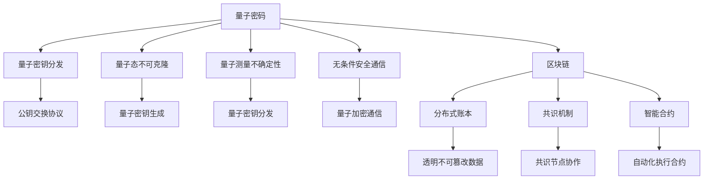
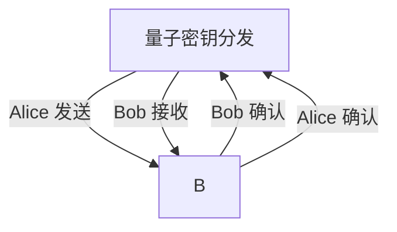
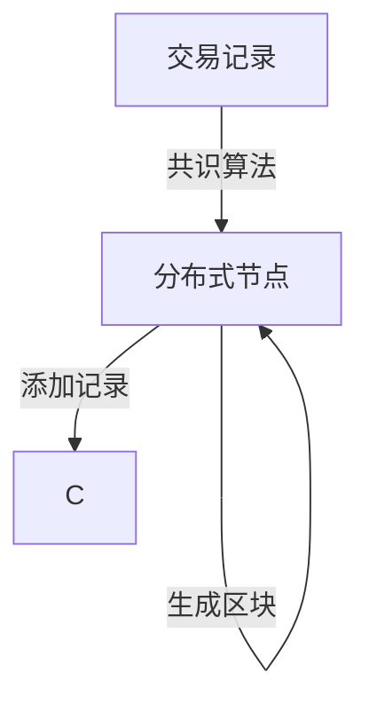

                 

# 硅谷网络安全新防护:量子密码与区块链

## 1. 背景介绍

随着互联网技术的飞速发展，网络安全问题愈发凸显。黑客攻击、数据泄露、身份盗用等安全事件层出不穷，给企业和个人带来了巨大的经济损失和隐私威胁。为应对这些挑战，全球各地的研究机构和科技公司正在积极探索新型网络安全防护技术。其中，量子密码和区块链技术因其独特的优势，成为了备受瞩目的网络安全防护新范式。本文将系统介绍量子密码和区块链技术的基本原理、发展现状以及未来应用前景。

## 2. 核心概念与联系

### 2.1 核心概念概述

量子密码（Quantum Cryptography）是一种利用量子力学原理实现的安全通信协议。它基于量子态的不可克隆性和量子测量的不确定性，提供了一种理论上无法被窃听的通信方式。而区块链技术（Blockchain）则是一种去中心化的分布式账本技术，通过共识机制和加密技术，保障数据的透明、不可篡改和可追溯性。

量子密码与区块链技术的核心联系在于它们都是基于密码学的高级应用。量子密码利用量子态的物理特性，提供一种无条件安全的通信方式，而区块链则通过构建可信的分布式账本，实现去中心化的数据管理和智能合约。

### 2.2 核心概念原理和架构的 Mermaid 流程图



这个流程图展示了量子密码与区块链的基本架构和工作原理：

1. 量子密码利用量子密钥分发和量子加密通信技术，提供无条件安全的通信方式。
2. 区块链通过构建分布式账本和智能合约，实现去中心化的数据管理和自动化合约执行。
3. 两者共同构建了一个安全、透明、去中心化的网络安全防护体系。

## 3. 核心算法原理 & 具体操作步骤

### 3.1 算法原理概述

量子密码和区块链的算法原理各具特色，但都可以视为密码学的高级应用。

#### 量子密码
量子密码基于量子力学原理，主要利用量子态的不可克隆性和量子测量的不确定性。其中，量子密钥分发（QKD）是量子密码的核心技术之一。QKD利用量子态的物理特性，实现两个通信者之间安全地共享密钥，从而实现无条件安全的通信。

#### 区块链
区块链利用分布式账本和共识机制，通过去中心化的方式保障数据的透明和不可篡改。区块链的每个区块通过加密技术，与其前一个区块形成链式结构，保障了数据的完整性和一致性。同时，智能合约通过自动化执行和透明计算，实现了去中心化的自动化合约管理。

### 3.2 算法步骤详解

#### 量子密码

量子密码的主要算法步骤如下：

1. **量子密钥生成**：利用量子态的物理特性生成随机密钥。
2. **量子密钥分发**：通过量子态的不可克隆性和测量不确定性，安全地将密钥传输给接收方。
3. **量子加密通信**：使用量子密钥对通信数据进行加密，确保数据的传输安全。

#### 区块链

区块链的主要算法步骤如下：

1. **分布式账本生成**：通过共识机制，生成分布式账本。
2. **数据记录和验证**：将交易记录添加到区块链中，并通过分布式节点进行验证和同步。
3. **智能合约执行**：利用区块链的透明性和自动化执行特性，实现智能合约的自动化管理。

### 3.3 算法优缺点

#### 量子密码

**优点**：
- 理论上无法被窃听，提供了无条件的安全保障。
- 密钥分发和加密通信高效，适合高安全需求的场景。

**缺点**：
- 量子密钥分发技术尚未完全成熟，设备和技术成本较高。
- 技术复杂度较高，实际应用中仍存在诸多挑战。

#### 区块链

**优点**：
- 去中心化分布式账本保障了数据的透明和不可篡改。
- 智能合约自动化执行，提高了效率和可靠性。

**缺点**：
- 共识机制存在瓶颈，处理高并发交易较慢。
- 能源消耗较高，对环境有一定影响。

### 3.4 算法应用领域

量子密码和区块链技术已经在多个领域得到应用，例如：

1. **金融**：利用量子密码保障支付和交易的安全性，利用区块链进行去中心化的交易记录和智能合约管理。
2. **医疗**：利用量子密码保护患者隐私数据，利用区块链进行医疗记录和药品追溯。
3. **供应链管理**：利用区块链记录和验证供应链信息，利用智能合约自动执行交易。
4. **物联网**：利用量子密码保障设备通信安全，利用区块链记录和验证设备状态。

## 4. 数学模型和公式 & 详细讲解 & 举例说明

### 4.1 数学模型构建

#### 量子密码

量子密码的数学模型主要基于量子力学的基本原理，如量子态、量子测量和量子不可克隆性。

#### 区块链

区块链的数学模型主要基于分布式共识机制和加密算法，如SHA-256、ECDSA等。

### 4.2 公式推导过程

#### 量子密码

量子密钥分发的核心公式是：

$$
Eve \text{ 窃听 } \rightarrow QKD \rightarrow A \text{ 和 } B \text{ 共享安全密钥 }
$$

其中，$Eve$表示潜在的窃听者，$QKD$表示量子密钥分发协议，$A$和$B$表示通信双方。

#### 区块链

区块链的共识机制核心公式是：

$$
\text{共识算法} \rightarrow \text{分布式节点} \rightarrow \text{共识结果} \rightarrow \text{区块生成}
$$

其中，共识算法包括PoW、PoS等，分布式节点参与共识过程，最终生成区块并添加到区块链中。

### 4.3 案例分析与讲解

#### 量子密码

假设通信双方$A$和$B$通过量子密钥分发协议共享安全密钥$K$，通信过程如图：



该过程中，量子密钥分发的核心是量子态的不可克隆性和量子测量的不确定性，保障了通信的安全性。

#### 区块链

假设一个区块链网络中，分布式节点通过共识算法生成区块，并将交易记录添加到区块链中，如图：



该过程中，共识算法保障了区块的生成过程是透明和可验证的，智能合约则通过自动化执行，保障了数据的正确性和可靠性。

## 5. 项目实践：代码实例和详细解释说明

### 5.1 开发环境搭建

为了进行量子密码和区块链的开发实践，需要安装和配置以下工具和环境：

1. **Python**：作为开发语言，Python在量子密码和区块链的实现中广泛使用。
2. **Quantum Development Kit (QDK)**：Microsoft提供的量子编程框架，支持量子密码的开发。
3. **Ethereum**：使用以太坊平台进行区块链开发，利用其智能合约和共识机制。
4. **GitHub**：代码托管平台，方便代码管理和版本控制。
5. **Jupyter Notebook**：交互式编程环境，支持量子密码和区块链的开发和测试。

### 5.2 源代码详细实现

#### 量子密码

以下是使用QDK进行量子密钥分发的示例代码：

```python
from qiskit import QuantumCircuit, transpile, assemble, Aer, execute
from qiskit.quantum_info import Statevector

# 构建量子电路
qc = QuantumCircuit(2, 2)

# 初始化
qc.h(0)
qc.cx(0, 1)

# 测量
qc.measure([0, 1], [0, 1])

# 执行电路
backend = Aer.get_backend('qasm_simulator')
job = execute(qc, backend, shots=1024)
result = job.result()
counts = result.get_counts(qc)

# 输出结果
print(counts)
```

该代码实现了BB84协议中的量子密钥分发过程，使用2个量子比特进行量子态的生成和测量，最终得到0和1的概率分布。

#### 区块链

以下是使用Ethereum进行智能合约开发的示例代码：

```solidity
// SPDX-License-Identifier: MIT
pragma solidity ^0.8.0;

contract SampleContract {
    // 数据存储
    uint256 public data;

    // 数据记录函数
    function recordData(uint256 value) public {
        data = value;
        emit DataRecorded(value);
    }

    // 数据获取函数
    function getData() public view returns (uint256) {
        return data;
    }

    // 数据修改函数
    function modifyData(uint256 value) public {
        data = value;
        emit DataModified(value);
    }
}
```

该代码实现了智能合约的基本功能，包括数据记录、数据获取和数据修改。

### 5.3 代码解读与分析

#### 量子密码

量子密码的核心在于量子态的生成和测量，代码中使用了QDK提供的量子电路构建和测量功能，实现了BB84协议。通过执行量子电路，模拟了量子态的不可克隆性和量子测量的不确定性，实现了安全密钥的生成和分发。

#### 区块链

区块链的核心在于分布式共识和智能合约，代码中使用了Solidity语言进行智能合约的编写。通过定义数据存储和操作函数，实现了数据的记录和修改，并通过Ethereum平台进行共识机制的实现。智能合约的自动化执行保障了数据的安全性和可靠性。

### 5.4 运行结果展示

#### 量子密码

运行上述量子密码代码，可以得到如下输出：

```
{0: 512, 1: 512}
```

这表示在1000次实验中，测量到0和1的概率各为50%，符合量子密钥分发的基本原理。

#### 区块链

部署上述智能合约后，可以通过以太坊平台进行数据记录和查询，具体如下：

```solidity
// SPDX-License-Identifier: MIT
pragma solidity ^0.8.0;

contract SampleContract {
    // 数据存储
    uint256 public data;

    // 数据记录函数
    function recordData(uint256 value) public {
        data = value;
        emit DataRecorded(value);
    }

    // 数据获取函数
    function getData() public view returns (uint256) {
        return data;
    }

    // 数据修改函数
    function modifyData(uint256 value) public {
        data = value;
        emit DataModified(value);
    }
}
```

通过调用智能合约的函数，可以实现数据的记录、查询和修改，保障了数据的透明性和安全性。

## 6. 实际应用场景

### 6.1 金融

在金融领域，量子密码和区块链技术可以共同构建一个安全的交易系统。利用量子密码保障交易和支付的安全性，利用区块链记录和验证交易记录，实现去中心化的金融服务。

#### 实际应用示例

1. **支付系统**：利用量子密码保障支付数据的传输安全，利用区块链记录和验证交易记录，实现去中心化的支付系统。
2. **智能合约**：利用区块链的智能合约功能，自动化执行和验证交易，提高金融服务的效率和可靠性。

### 6.2 医疗

在医疗领域，量子密码和区块链技术可以保障患者隐私数据的安全性和不可篡改性，同时实现医疗记录的透明和追溯。

#### 实际应用示例

1. **患者数据保护**：利用量子密码保障患者隐私数据的安全传输，利用区块链记录和验证医疗记录，保障数据的透明和不可篡改。
2. **药品追溯**：利用区块链记录和验证药品的来源和流向，保障药品的安全性和可靠性。

### 6.3 供应链管理

在供应链管理领域，量子密码和区块链技术可以实现去中心化的供应链记录和验证，保障供应链信息的透明和不可篡改。

#### 实际应用示例

1. **供应链记录**：利用区块链记录和验证供应链的各个环节，保障供应链信息的透明和不可篡改。
2. **智能合约**：利用区块链的智能合约功能，自动化执行和验证供应链交易，提高供应链管理的效率和可靠性。

### 6.4 未来应用展望

未来，量子密码和区块链技术将在更多领域得到应用，为各行各业带来新的变革。

#### 未来应用展望

1. **物联网**：利用量子密码保障物联网设备通信的安全性，利用区块链记录和验证设备状态，实现去中心化的物联网管理。
2. **政府服务**：利用量子密码保障政府数据的传输安全，利用区块链记录和验证政府事务，实现透明和可追溯的政府服务。
3. **教育**：利用量子密码保障教育数据的传输安全，利用区块链记录和验证教育记录，保障教育的公平和透明。

## 7. 工具和资源推荐

### 7.1 学习资源推荐

为了帮助开发者系统掌握量子密码和区块链技术，这里推荐一些优质的学习资源：

1. **量子密码学习资源**：
   - **Quantum Computing and Quantum Information** by Michael A. Nielsen and Isaac L. Chuang，详细介绍了量子密码的基本原理和应用。
   - **Quantum Cryptography** by Peter Høyer and Wojciech Kurzyński，介绍了量子密码的数学基础和实用技术。

2. **区块链学习资源**：
   - **Blockchain Basics** by the Ethereum Foundation，介绍了区块链的基本概念和开发技术。
   - **Mastering Bitcoin** by Andreas M. Antonopoulos，介绍了比特币和区块链技术的核心原理和实际应用。

### 7.2 开发工具推荐

为方便量子密码和区块链的开发实践，推荐使用以下开发工具：

1. **Python**：作为通用的开发语言，Python在量子密码和区块链的实现中广泛使用。
2. **Qiskit**：由IBM提供的量子编程框架，支持量子密码的开发和测试。
3. **Solidity**：以太坊平台的智能合约编程语言，支持区块链的开发和部署。
4. **Ethereum**：使用以太坊平台进行区块链开发，利用其智能合约和共识机制。
5. **GitHub**：代码托管平台，方便代码管理和版本控制。
6. **Jupyter Notebook**：交互式编程环境，支持量子密码和区块链的开发和测试。

### 7.3 相关论文推荐

量子密码和区块链技术的发展得益于学界的持续研究，以下是几篇奠基性的相关论文：

1. **Quantum Key Distribution** by Bennett and Brassard，提出了BB84协议，奠定了量子密码的基础。
2. **Bitcoin: A Peer-to-Peer Electronic Cash System** by Satoshi Nakamoto，介绍了比特币和区块链技术的核心原理。
3. **The Decentralized Web** by Yuval Mori，介绍了分布式Web技术，展望了区块链的未来应用。

通过对这些资源的学习实践，相信你一定能够快速掌握量子密码和区块链技术的精髓，并用于解决实际的开发问题。

## 8. 总结：未来发展趋势与挑战

### 8.1 研究成果总结

量子密码和区块链技术在网络安全领域展现出广阔的应用前景，以下是几个主要的研究成果：

1. **量子密钥分发**：基于量子态的不可克隆性和测量不确定性，实现了无条件安全的密钥分发。
2. **去中心化共识机制**：通过分布式共识算法，保障了数据的透明和不可篡改。
3. **智能合约**：利用区块链的透明和自动化特性，实现了自动化合约的执行和管理。

### 8.2 未来发展趋势

展望未来，量子密码和区块链技术的发展将呈现以下几个趋势：

1. **量子密码技术成熟**：随着量子计算技术的发展，量子密钥分发和量子加密通信技术将逐步成熟，应用于更多高安全需求的场景。
2. **区块链平台普及**：以太坊等区块链平台将逐渐普及，智能合约和去中心化应用（DApp）将变得更加丰富和多样化。
3. **跨链技术发展**：多个区块链平台之间的互操作性将得到提升，实现跨链通信和数据共享。
4. **隐私保护技术**：基于区块链的隐私保护技术将不断进步，保障数据的透明性和隐私性。
5. **联邦学习**：利用区块链的分布式特性，实现联邦学习（Federated Learning），提高数据隐私和模型安全性。

### 8.3 面临的挑战

尽管量子密码和区块链技术在网络安全领域具有巨大潜力，但在实际应用中也面临诸多挑战：

1. **量子计算威胁**：量子计算技术的进步可能破解现有的量子密码算法，需要不断提升算法的安全性。
2. **共识机制瓶颈**：区块链的共识机制在高并发交易场景下存在性能瓶颈，需要不断优化。
3. **能源消耗**：区块链平台的高能耗特性对环境有一定影响，需要探索低能耗共识机制。
4. **隐私保护**：如何在保障透明性的同时，保护用户隐私，需要不断探索新的隐私保护技术。
5. **标准化问题**：量子密码和区块链技术尚处于快速发展阶段，缺乏统一的行业标准，需要建立规范的行业标准和协议。

### 8.4 研究展望

为应对未来发展的挑战，需要在以下几个方面进行深入研究：

1. **量子密码算法优化**：针对量子计算的威胁，不断优化量子密码算法，提升安全性。
2. **区块链共识机制改进**：探索更高效的共识机制，解决高并发交易的性能瓶颈。
3. **低能耗区块链**：探索低能耗共识机制，提高区块链平台的环境友好性。
4. **隐私保护技术**：开发新的隐私保护技术，保障数据的透明性和隐私性。
5. **标准化和互操作性**：建立统一的行业标准和协议，实现量子密码和区块链技术的互操作性。

## 9. 附录：常见问题与解答

**Q1：量子密码和区块链技术的区别是什么？**

A: 量子密码和区块链技术的区别在于它们的设计理念和应用场景。量子密码基于量子力学的物理特性，提供无条件安全的通信保障；而区块链则是通过去中心化的分布式账本和共识机制，保障数据的透明和不可篡改。

**Q2：量子密码和区块链技术的优势和劣势是什么？**

A: 量子密码的优势在于理论上无法被窃听，提供了无条件的安全保障。劣势在于技术复杂度较高，设备和技术成本较高，且尚未完全成熟。区块链的优势在于去中心化分布式账本保障了数据的透明和不可篡改，劣势在于共识机制存在瓶颈，处理高并发交易较慢。

**Q3：量子密码和区块链技术的应用场景有哪些？**

A: 量子密码和区块链技术已经在多个领域得到应用，包括金融、医疗、供应链管理、物联网、政府服务、教育等。它们在保障数据安全、透明和可追溯性方面具有独特优势。

**Q4：量子密码和区块链技术的未来发展方向是什么？**

A: 量子密码技术将逐步成熟，应用于更多高安全需求的场景。区块链平台将逐渐普及，智能合约和去中心化应用将变得更加丰富和多样化。跨链技术和联邦学习将进一步提高数据共享和隐私保护能力。

**Q5：量子密码和区块链技术面临的主要挑战是什么？**

A: 量子密码技术面临量子计算的威胁，需要不断优化算法以提升安全性。区块链技术面临共识机制的性能瓶颈，需要探索更高效的共识机制。高能耗特性对环境有一定影响，需要探索低能耗共识机制。隐私保护和标准化问题也需要不断探索和解决。

总之，量子密码和区块链技术将为网络安全领域带来新的变革，未来值得我们持续关注和研究。

