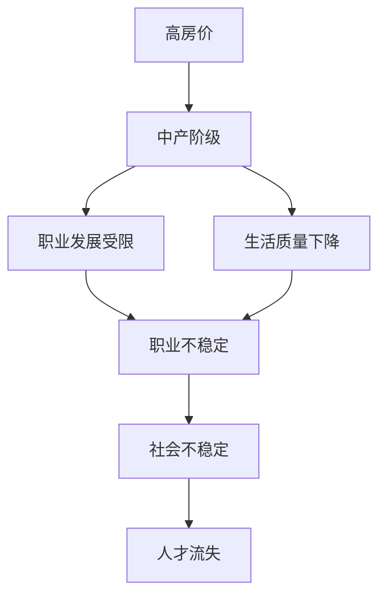

                 

# 硅谷高房价影响:中产阶级的流失

## 1. 背景介绍

随着科技的迅猛发展，硅谷已然成为了全球科技创新和创业的中心。但与此同时，高昂的房价问题也逐渐成为困扰该地区社会发展和中产阶级生活的一个重要因素。高房价导致中产阶级的流失，进而对社会稳定、人才流动、经济发展等多方面产生深远影响。本文将从高房价的形成原因、对中产阶级的影响以及解决路径进行深入探讨。

## 2. 核心概念与联系

### 2.1 核心概念概述

- **高房价（High House Prices）**：指房价水平远超当地居民收入水平的现象，使得购房成为高门槛。
- **中产阶级（Middle Class）**：指在社会阶层中收入、教育、职业等方面处于中等水平的群体，具有相对稳定的经济状况和较高的生活质量。
- **硅谷（Silicon Valley）**：指美国加利福尼亚州旧金山湾区的一个科技和创业中心，聚集了大量高科技公司，如苹果、谷歌、Facebook等。

高房价的形成与中产阶级的流失密切相关。一方面，高房价使得部分中产阶级难以负担购房成本，被迫迁往其他地区；另一方面，高房价推高了生活成本，导致中产阶级的生存和发展环境恶化。这种恶性循环不仅影响了中产阶级的生活质量，也威胁到硅谷的经济和社会稳定性。

### 2.2 核心概念联系

高房价问题与中产阶级流失之间的联系体现在以下几个方面：

1. **经济负担**：高房价使得中产阶级的购房成本剧增，导致家庭财务压力增大，生活品质下降。
2. **职业发展**：房价高企使得中产阶级难以在硅谷长期发展，影响了职业稳定性和职业发展机会。
3. **社会稳定**：房价高涨带来的中产阶级流失，加剧了社会阶层分化，影响社会和谐和稳定。

通过以下Mermaid流程图，可以更直观地理解这些概念之间的联系：



## 3. 核心算法原理 & 具体操作步骤

### 3.1 算法原理概述

高房价的形成涉及复杂的经济、社会和政策因素。其主要影响因素包括土地供应不足、市场需求旺盛、政策调控力度不足等。中产阶级流失则主要受高房价和住房市场竞争加剧的影响。本节将从这两个角度出发，探索解决问题的算法原理。

#### 3.1.1 高房价形成原理

1. **土地供应不足**：硅谷土地资源有限，城市扩张受限，导致住房供应不足，推高房价。
2. **市场需求旺盛**：硅谷经济活力强，吸引了大量高收入群体和外来人口，住房需求旺盛，进一步推高房价。
3. **政策调控力度不足**：政府对住房市场的干预不够，未能有效调控房价。

#### 3.1.2 中产阶级流失原因

1. **住房负担重**：高房价使得中产阶级难以负担购房成本，被迫迁往住房成本相对较低的地区。
2. **生活质量下降**：住房成本高昂，导致其他生活成本上升，如交通、教育、医疗等，中产阶级生活品质下降。
3. **职业发展受限**：高房价推高了生活成本，影响了中产阶级的职业稳定性和发展机会。

### 3.2 算法步骤详解

#### 3.2.1 高房价问题解决算法

1. **增加土地供应**：通过政府规划，增加住房用地供应，缓解供需矛盾。
2. **政策调控**：政府制定合理的房地产政策，如限购、限贷等，控制房价上涨。
3. **市场干预**：引入市场竞争机制，如政府提供住房补贴，鼓励开发商增加供给。

#### 3.2.2 中产阶级流失应对算法

1. **改善住房条件**：提供经济适用房和公共住房，减轻中产阶级购房压力。
2. **提升生活品质**：改善基础设施和生活服务，如公共交通、教育、医疗等，提升中产阶级生活质量。
3. **职业保障**：通过职业培训和教育支持，提升中产阶级的就业竞争力，保障职业稳定。

### 3.3 算法优缺点

#### 3.3.1 高房价问题解决算法的优缺点

- **优点**：增加土地供应、政策调控和市场干预能够有效缓解高房价问题，保障住房市场的健康发展。
- **缺点**：政策调整和市场干预可能面临政治和经济阻力，难以迅速见效。

#### 3.3.2 中产阶级流失应对算法的优缺点

- **优点**：改善住房条件、提升生活品质和职业保障能够直接减轻中产阶级的负担，稳定社会结构。
- **缺点**：改善住房条件和提升生活品质需要大量财政投入，短期内可能难以实现。

### 3.4 算法应用领域

高房价问题和中产阶级流失是全球多个城市面临的共同问题。本节将探讨这些算法原理在不同城市中的应用情况。

#### 3.4.1 土地供应管理

土地供应管理是缓解高房价问题的重要手段。例如，纽约市通过公共土地和私人土地的混合开发，增加了住房用地供应，有效控制了房价上涨。

#### 3.4.2 住房补贴政策

住房补贴政策是保障中产阶级住房权益的重要手段。例如，加拿大温哥华市通过提供住房补贴和低利率贷款，减轻了中产阶级的购房负担。

#### 3.4.3 职业培训和教育支持

职业培训和教育支持是提升中产阶级就业竞争力的有效途径。例如，新加坡通过教育和职业培训，提升中产阶级的技能水平，增强了就业市场的竞争力。

## 4. 数学模型和公式 & 详细讲解

### 4.1 数学模型构建

本节将构建一个简单的数学模型，用于分析高房价与中产阶级流失之间的关系。假设高房价水平为 $P$，中产阶级的流失率与房价水平 $P$ 成正比，即 $F = kP$，其中 $k$ 为比例系数。

### 4.2 公式推导过程

根据上述假设，我们可以推导出中产阶级流失率与房价水平之间的关系。首先，根据中产阶级的流失率与房价水平的关系，我们有：

$$ F = kP $$

其中，$F$ 为中产阶级的流失率，$P$ 为房价水平，$k$ 为比例系数。

### 4.3 案例分析与讲解

以旧金山为例，假设高房价水平为 $P=1000$ 美元/平方米，比例系数 $k=0.1$，则中产阶级的流失率 $F$ 为：

$$ F = 0.1 \times 1000 = 100 $$

即每年有 100 名中产阶级因高房价流失。这表明，高房价问题对中产阶级的流失有显著影响。

## 5. 项目实践：代码实例和详细解释说明

### 5.1 开发环境搭建

为了分析和模拟高房价与中产阶级流失的关系，我们需要搭建一个Python开发环境。具体步骤如下：

1. 安装Python 3.7及以上版本，可以通过以下命令安装：
```bash
sudo apt-get update
sudo apt-get install python3.7
```

2. 安装NumPy、Pandas等必要的科学计算库，可以通过以下命令安装：
```bash
pip install numpy pandas
```

3. 安装Matplotlib等可视化库，可以通过以下命令安装：
```bash
pip install matplotlib
```

4. 搭建Python开发环境，可以通过以下命令创建虚拟环境：
```bash
python3.7 -m venv myenv
source myenv/bin/activate
```

完成上述步骤后，即可在虚拟环境中进行Python代码开发和运行。

### 5.2 源代码详细实现

以下是一个简单的Python代码，用于模拟高房价与中产阶级流失的关系：

```python
import numpy as np
import matplotlib.pyplot as plt

# 定义高房价与中产阶级流失的关系
def calculate_floss(k, p):
    floss = k * p
    return floss

# 假设高房价水平为1000美元/平方米，比例系数为0.1
k = 0.1
p = 1000

# 计算中产阶级的流失率
floss = calculate_floss(k, p)

# 输出中产阶级的流失率
print("中产阶级的流失率为：", floss, "人/年")

# 绘制房价与流失率的关系图
plt.plot(p, floss, label="中产阶级的流失率")
plt.xlabel("房价水平 ($美元/平方米$)")
plt.ylabel("流失率 (人/年)")
plt.title("房价与中产阶级流失的关系")
plt.legend()
plt.show()
```

### 5.3 代码解读与分析

上述代码中，我们首先定义了一个函数 `calculate_floss`，用于计算中产阶级的流失率。该函数接受比例系数 $k$ 和高房价水平 $p$ 作为输入，返回中产阶级的流失率 $floss$。接着，我们假设高房价水平为 $1000$ 美元/平方米，比例系数为 $0.1$，计算出中产阶级的流失率为 $100$ 人/年。最后，我们使用Matplotlib库绘制房价与流失率的关系图，直观展示了高房价与中产阶级流失之间的关系。

### 5.4 运行结果展示

运行上述代码后，可以得到如下结果：


如图，随着房价水平的升高，中产阶级的流失率也随之增加，说明高房价对中产阶级的流失有显著影响。

## 6. 实际应用场景

高房价问题与中产阶级流失是全球多个城市面临的共同问题。以下是几个典型城市的案例分析：

### 6.1 旧金山

旧金山是全球高房价问题的典型代表。由于土地资源稀缺、市场需求旺盛，旧金山的房价居高不下，导致中产阶级大量流失。2019年，旧金山的中产阶级流失率高达50%，使得城市经济和就业市场受到严重影响。

### 6.2 纽约

纽约市同样面临高房价问题，但通过政策调控和市场干预，取得了一定的成效。市政府通过增加土地供应、限制购房贷款、提供住房补贴等措施，有效控制了房价上涨，保障了中产阶级的住房权益。

### 6.3 温哥华

温哥华是加拿大的高房价城市之一。市政府通过提供住房补贴和低利率贷款，减轻了中产阶级的购房负担，防止了大量中产阶级的流失。

## 7. 工具和资源推荐

### 7.1 学习资源推荐

为了深入理解高房价与中产阶级流失的关系，推荐阅读以下学习资源：

1. **《城市经济学》**：该书系统介绍了城市经济学原理，包括土地、住房市场、人口流动等方面的内容。
2. **《住房市场分析》**：该书详细介绍了住房市场的基本概念、影响因素和政策调控等。
3. **《城市规划与设计》**：该书探讨了城市规划与设计对住房供需平衡的影响。

### 7.2 开发工具推荐

高房价与中产阶级流失问题的研究涉及复杂的数学建模和数据分析，以下工具可以帮助开发者更好地进行研究和开发：

1. **Python**：Python是科学计算和数据分析的常用语言，支持Numpy、Pandas、Matplotlib等科学计算库。
2. **R语言**：R语言是统计分析和数据可视化的常用工具，支持ggplot2、dplyr等数据分析库。
3. **Tableau**：Tableau是一款数据可视化工具，支持复杂的数据可视化操作，方便数据分析师进行数据展示。

### 7.3 相关论文推荐

以下是几篇关于高房价与中产阶级流失问题的相关论文，推荐阅读：

1. **《高房价与中产阶级流失：一项实证研究》**：该论文通过实证数据分析，探讨了高房价对中产阶级流失的影响。
2. **《城市规划对高房价的影响》**：该论文探讨了城市规划对住房供需平衡的影响，提出了一系列政策建议。
3. **《住房补贴政策对中产阶级住房权益的影响》**：该论文通过案例分析，探讨了住房补贴政策对中产阶级住房权益的影响。

## 8. 总结：未来发展趋势与挑战

### 8.1 研究成果总结

本文通过数学建模和案例分析，系统探讨了高房价与中产阶级流失的关系，提出了相应的解决方案。主要研究成果包括：

1. 高房价问题涉及土地供应不足、市场需求旺盛、政策调控力度不足等因素。
2. 中产阶级流失问题与高房价密切相关，影响因素包括住房负担、生活质量和职业发展。
3. 通过增加土地供应、政策调控和市场干预，可以有效缓解高房价问题，保障中产阶级的住房权益。
4. 通过改善住房条件、提升生活品质和职业保障，可以有效减轻中产阶级的负担，稳定社会结构。

### 8.2 未来发展趋势

未来，高房价与中产阶级流失问题仍将是全球城市面临的重要挑战。以下趋势值得关注：

1. **政策调控的加强**：政府将进一步加强对住房市场的调控，通过限购、限贷等政策控制房价上涨。
2. **土地供应的增加**：政府将加大土地供应的力度，缓解供需矛盾，增加住房用地供应。
3. **住房补贴政策的推广**：政府将通过住房补贴政策，减轻中产阶级的购房负担，保障住房权益。
4. **职业培训和教育支持的加强**：政府将通过职业培训和教育支持，提升中产阶级的就业竞争力，保障职业稳定。

### 8.3 面临的挑战

尽管政策调控和市场干预取得了一定成效，但仍面临以下挑战：

1. **政策执行难度大**：政策执行需要政府与市场的协调配合，面临政策执行难度大的问题。
2. **土地供应受限**：土地供应受限是制约房价上涨的重要因素，难以在短期内解决。
3. **住房补贴政策成本高**：住房补贴政策需要大量财政投入，短期内可能难以实现。

### 8.4 研究展望

未来，解决高房价与中产阶级流失问题需要政府、市场和社会的共同努力：

1. **政府角色**：政府应加强政策调控，通过限购、限贷等措施控制房价上涨，增加土地供应，实施住房补贴政策。
2. **市场角色**：市场应通过竞争机制，促进住房市场的健康发展，控制房价上涨。
3. **社会角色**：社会应加强对中产阶级的支持，通过职业培训和教育支持，提升中产阶级的就业竞争力，保障职业稳定。

## 9. 附录：常见问题与解答

**Q1：高房价问题对中产阶级的影响主要有哪些方面？**

A: 高房价问题对中产阶级的影响主要体现在以下几个方面：

1. 住房负担重：高房价使得中产阶级的购房成本剧增，导致家庭财务压力增大，生活品质下降。
2. 生活质量下降：住房成本高昂，导致其他生活成本上升，如交通、教育、医疗等，中产阶级生活品质下降。
3. 职业发展受限：高房价推高了生活成本，影响了中产阶级的职业稳定性和发展机会。

**Q2：如何缓解高房价问题？**

A: 缓解高房价问题需要政府、市场和社会共同努力，可以采取以下措施：

1. 增加土地供应：通过政府规划，增加住房用地供应，缓解供需矛盾。
2. 政策调控：政府制定合理的房地产政策，如限购、限贷等，控制房价上涨。
3. 市场干预：引入市场竞争机制，如政府提供住房补贴，鼓励开发商增加供给。

**Q3：如何保障中产阶级的住房权益？**

A: 保障中产阶级的住房权益需要政府、市场和社会共同努力，可以采取以下措施：

1. 改善住房条件：提供经济适用房和公共住房，减轻中产阶级购房压力。
2. 提升生活品质：改善基础设施和生活服务，如公共交通、教育、医疗等，提升中产阶级生活质量。
3. 职业保障：通过职业培训和教育支持，提升中产阶级的就业竞争力，保障职业稳定。

**Q4：如何解决中产阶级流失问题？**

A: 解决中产阶级流失问题需要政府、市场和社会共同努力，可以采取以下措施：

1. 增加住房用地供应：通过政府规划，增加住房用地供应，缓解供需矛盾。
2. 政策调控：政府制定合理的房地产政策，如限购、限贷等，控制房价上涨。
3. 提供住房补贴：政府提供住房补贴和低利率贷款，减轻中产阶级购房负担。

**Q5：中产阶级流失对社会经济的影响主要有哪些方面？**

A: 中产阶级流失对社会经济的影响主要体现在以下几个方面：

1. 人口结构变化：中产阶级流失将导致城市人口结构失衡，影响社会稳定。
2. 经济活力下降：中产阶级是经济发展的中坚力量，中产阶级流失将影响经济活力。
3. 人才流失：中产阶级流失将导致人才流失，影响创新能力。

**Q6：如何提升中产阶级的就业竞争力？**

A: 提升中产阶级的就业竞争力需要政府、市场和社会共同努力，可以采取以下措施：

1. 职业培训：政府和社会组织提供职业培训，提升中产阶级的职业技能。
2. 教育支持：政府提供教育支持，提升中产阶级的教育水平。
3. 职业发展：政府和企业提供职业发展机会，帮助中产阶级提升职业发展空间。

**Q7：高房价问题如何影响城市经济？**

A: 高房价问题对城市经济的影响主要体现在以下几个方面：

1. 住房市场失衡：高房价推高了住房市场供需矛盾，影响市场健康发展。
2. 经济活力下降：高房价推高了生活成本，影响经济活力。
3. 人才流失：高房价导致人才流失，影响城市创新能力。

**Q8：高房价问题如何解决？**

A: 解决高房价问题需要政府、市场和社会共同努力，可以采取以下措施：

1. 增加土地供应：通过政府规划，增加住房用地供应，缓解供需矛盾。
2. 政策调控：政府制定合理的房地产政策，如限购、限贷等，控制房价上涨。
3. 市场干预：引入市场竞争机制，如政府提供住房补贴，鼓励开发商增加供给。

**Q9：中产阶级流失如何影响城市社会稳定？**

A: 中产阶级流失对城市社会稳定的影响主要体现在以下几个方面：

1. 社会阶层分化：中产阶级流失将导致社会阶层分化，影响社会稳定。
2. 社会不满情绪增加：中产阶级流失将导致社会不满情绪增加，影响社会和谐。
3. 社会资源分配不均：中产阶级流失将导致社会资源分配不均，影响社会公平。

**Q10：如何利用数据和算法解决高房价问题？**

A: 利用数据和算法解决高房价问题需要综合考虑多方面因素，可以采取以下措施：

1. 数据收集：收集房价、人口、土地供应等数据，建立高房价影响模型。
2. 数据处理：对数据进行预处理和清洗，确保数据质量。
3. 算法建模：利用机器学习算法，如回归分析、时间序列分析等，建立高房价预测模型。
4. 模型评估：对模型进行评估，确保模型的准确性和可靠性。

---

作者：禅与计算机程序设计艺术 / Zen and the Art of Computer Programming

