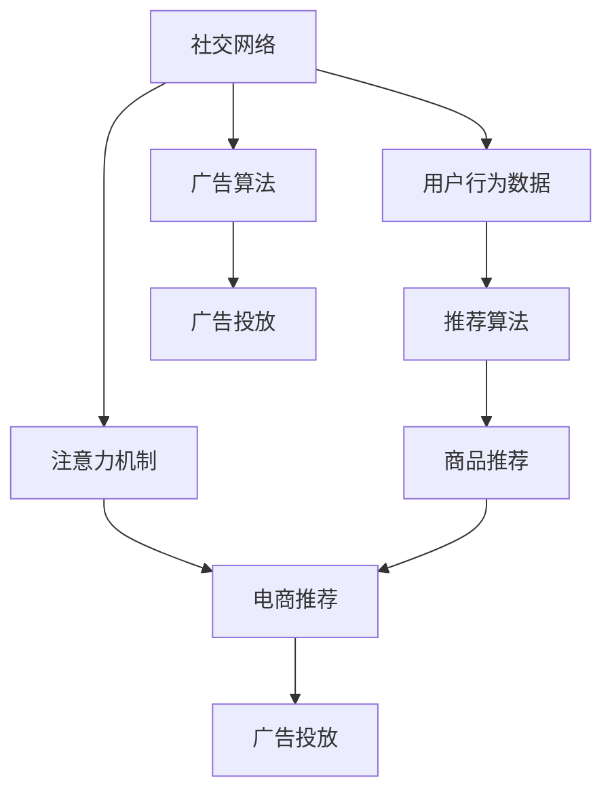

                 

## 1. 背景介绍

### 1.1 问题由来

社交电商作为一种新兴的电商模式，结合了社交媒体和电商的特点，通过社交网络中的推荐与互动来推动电商交易。传统的电商网站或平台，通常以搜索和推荐为核心，用户的主动性和参与度较低。而社交电商则通过社交网络的互动和推荐，增强用户的主动参与，使得电商体验更加丰富和自然。

### 1.2 问题核心关键点

社交电商的核心在于如何将社交网络的注意力机制与电商平台的购买力有效结合，通过社交网络中的互动与推荐，提高电商交易的转化率和用户满意度。社交电商的核心问题可以概括为以下几个关键点：

1. **社交网络的注意力机制**：如何利用社交网络中的用户互动、关注、点赞、评论等行为，提取用户对商品或品牌的关注度。
2. **电商平台的购买力**：如何挖掘用户在电商平台上的购买行为、购买意向、支付能力等，预测用户可能购买的产品。
3. **用户匹配与推荐**：如何通过社交网络和电商平台的协同作用，为用户推荐最符合其兴趣和购买力的商品，提升用户体验。
4. **广告与促销策略**：如何利用社交网络进行精准投放广告和促销，提升电商平台的销售转化率。

### 1.3 问题研究意义

社交电商的研究对于提升电商平台的销售效率、改善用户体验、挖掘用户潜在价值等方面具有重要意义：

1. **提升销售效率**：通过社交网络的互动与推荐，可以提高用户的购买转化率，降低营销成本。
2. **改善用户体验**：通过社交网络的互动，可以增加用户粘性，提升用户的满意度和忠诚度。
3. **挖掘用户价值**：通过社交网络的数据挖掘，可以发现用户的兴趣偏好、购买力等潜在价值，为后续营销和推荐提供依据。
4. **精准投放广告**：通过社交网络的用户行为数据，可以更精准地投放广告，提高广告的转化率和ROI。

## 2. 核心概念与联系

### 2.1 核心概念概述

社交电商涉及多个核心概念，包括社交网络、注意力机制、电商推荐、广告投放等。这些概念之间存在紧密联系，通过协同工作，共同实现社交电商的目标。

- **社交网络**：以用户关系为核心，通过用户间的互动（如关注、点赞、评论等），建立用户的社交关系网络。
- **注意力机制**：通过用户对商品或品牌的关注度（如点赞、评论、分享等），提取用户对商品或品牌的兴趣。
- **电商推荐**：通过用户行为数据，为用户推荐符合其兴趣和购买力的商品，提高用户购买转化率。
- **广告投放**：通过社交网络的用户行为数据，精准投放广告，提升广告的转化率。

### 2.2 核心概念原理和架构的 Mermaid 流程图



### 2.3 核心概念之间的联系

社交电商的运作机制是通过社交网络中用户之间的互动，提取用户的注意力机制，结合电商平台的推荐算法和广告算法，实现精准的推荐和投放。用户行为数据是连接社交网络和电商平台的关键，通过数据分析，可以挖掘用户的兴趣和购买力，从而实现精准的推荐和投放。

## 3. 核心算法原理 & 具体操作步骤

### 3.1 算法原理概述

社交电商的核心算法原理是基于注意力机制和推荐算法，通过社交网络的用户互动数据和电商平台的购买数据，实现对用户的精准推荐和广告投放。社交电商的算法流程可以概括为以下几个步骤：

1. **数据收集与处理**：收集社交网络中的用户互动数据和电商平台的购买数据。
2. **用户画像建立**：通过用户互动数据和购买数据，建立用户的兴趣和购买力画像。
3. **推荐系统设计**：基于用户画像，设计推荐算法，为用户推荐符合其兴趣和购买力的商品。
4. **广告投放策略**：基于用户画像，设计广告投放策略，精准投放广告，提升广告转化率。

### 3.2 算法步骤详解

#### 3.2.1 数据收集与处理

社交电商的数据收集和处理分为两个主要步骤：

1. **社交网络数据收集**：通过API接口或数据爬虫，收集用户对商品或品牌的点赞、评论、分享等互动数据。
2. **电商平台数据收集**：通过API接口或数据爬虫，收集用户在电商平台上的浏览、点击、购买等行为数据。

数据收集完成后，需要进行清洗和预处理，去除噪声和异常数据，保证数据的质量和一致性。

#### 3.2.2 用户画像建立

用户画像的建立可以通过以下步骤实现：

1. **特征提取**：从社交网络和电商平台的数据中，提取用户的特征，如兴趣、购买力、行为偏好等。
2. **数据融合**：将社交网络和电商平台的数据进行融合，形成一个统一的用户画像。
3. **画像建模**：使用机器学习或深度学习算法，对用户画像进行建模，形成一个完整的用户画像。

用户画像建立完成后，可以用于推荐系统的设计。

#### 3.2.3 推荐系统设计

推荐系统设计的核心是推荐算法的选择和实现。常用的推荐算法包括基于内容的推荐、协同过滤推荐、基于矩阵分解的推荐等。以下是几种常见的推荐算法：

1. **基于内容的推荐**：根据商品的属性和用户的兴趣，推荐符合用户兴趣的商品。
2. **协同过滤推荐**：通过用户行为数据，找到与当前用户兴趣相似的用户，推荐这些用户喜欢的商品。
3. **基于矩阵分解的推荐**：通过用户行为数据和商品特征矩阵，使用矩阵分解算法，推荐符合用户兴趣的商品。

#### 3.2.4 广告投放策略

广告投放策略的设计可以通过以下步骤实现：

1. **目标用户选择**：基于用户画像，选择目标用户群体。
2. **广告创意设计**：设计符合目标用户群体的广告创意，如广告文案、图片等。
3. **投放策略设计**：根据用户行为数据，设计广告投放策略，如时间、地点、人群等。

### 3.3 算法优缺点

社交电商算法的优点在于：

1. **精准推荐**：通过社交网络和电商平台的数据融合，实现对用户的精准推荐，提高用户购买转化率。
2. **提升用户粘性**：通过社交网络的互动，增加用户粘性，提升用户满意度和忠诚度。
3. **降低营销成本**：通过精准投放广告，提高广告的转化率，降低营销成本。

社交电商算法的缺点在于：

1. **数据隐私问题**：社交网络和电商平台的数据涉及用户隐私，需要严格的数据保护措施。
2. **数据质量问题**：社交网络和电商平台的数据质量不高，可能存在噪声和异常数据。
3. **用户隐私保护**：用户在社交网络上的互动数据涉及隐私，需要保护用户隐私。

### 3.4 算法应用领域

社交电商算法广泛应用于电商、社交媒体、广告等多个领域，以下是几个典型的应用场景：

1. **电商平台推荐**：通过社交网络的用户互动数据，为用户推荐符合其兴趣和购买力的商品，提升用户购买转化率。
2. **社交媒体推荐**：通过社交网络的用户互动数据，为社交媒体用户推荐符合其兴趣的内容，提升用户粘性。
3. **广告投放**：通过社交网络的用户行为数据，精准投放广告，提升广告的转化率。
4. **营销活动策划**：通过社交网络和电商平台的数据融合，策划符合用户兴趣和购买力的营销活动，提升销售效果。

## 4. 数学模型和公式 & 详细讲解

### 4.1 数学模型构建

社交电商的数学模型主要分为以下几个部分：

1. **用户行为数据**：通过社交网络和电商平台的数据，建立用户行为矩阵 $A$，表示用户对商品的互动行为。
2. **用户画像**：通过用户行为数据，建立用户画像向量 $u$，表示用户的兴趣和购买力。
3. **推荐系统**：基于用户画像和商品特征，建立推荐矩阵 $B$，表示用户对商品的推荐评分。
4. **广告投放**：基于用户画像，建立广告投放矩阵 $C$，表示广告对用户的投放效果。

### 4.2 公式推导过程

以下是社交电商中常用的一些数学公式：

#### 4.2.1 用户行为矩阵

用户行为矩阵 $A$ 可以通过社交网络和电商平台的数据构建，如下所示：

$$
A = \begin{bmatrix}
    \text{用户1行为} & \text{用户1行为} & \cdots & \text{用户1行为} \\
    \text{用户2行为} & \text{用户2行为} & \cdots & \text{用户2行为} \\
    \vdots & \vdots & \ddots & \vdots \\
    \text{用户n行为} & \text{用户n行为} & \cdots & \text{用户n行为} \\
\end{bmatrix}
$$

其中每一行表示一个用户的行为数据，每一列表示一个商品的行为数据。

#### 4.2.2 用户画像向量

用户画像向量 $u$ 可以通过用户行为矩阵 $A$ 和权重向量 $w$ 计算得到，如下所示：

$$
u = A \cdot w
$$

其中 $w$ 是一个权重向量，表示用户行为对画像的影响程度。

#### 4.2.3 推荐矩阵

推荐矩阵 $B$ 可以通过用户画像向量 $u$ 和商品特征矩阵 $F$ 计算得到，如下所示：

$$
B = u \cdot F^T
$$

其中 $F^T$ 表示商品特征矩阵的转置。

#### 4.2.4 广告投放矩阵

广告投放矩阵 $C$ 可以通过用户画像向量 $u$ 和广告特征矩阵 $G$ 计算得到，如下所示：

$$
C = u \cdot G^T
$$

其中 $G^T$ 表示广告特征矩阵的转置。

### 4.3 案例分析与讲解

假设有一家电商平台，收集了用户在社交网络和电商平台上的互动数据，数据如下：

| 用户ID | 社交互动 | 电商平台行为 | 商品ID |
| ------ | -------- | ----------- | ------ |
| 1      | 点赞1     | 浏览商品A | A      |
| 1      | 点赞2     | 点击商品B | B      |
| 1      | 评论1     | 购买商品C | C      |
| 2      | 点赞1     | 浏览商品D | D      |
| 2      | 点赞2     | 点击商品E | E      |

根据上述数据，构建用户行为矩阵 $A$ 和商品特征矩阵 $F$，如下所示：

$$
A = \begin{bmatrix}
    1 & 1 & 1 & 0 & 0 \\
    0 & 1 & 0 & 1 & 1 \\
\end{bmatrix}
$$

$$
F = \begin{bmatrix}
    1 & 0 & 0 \\
    1 & 1 & 1 \\
    1 & 0 & 0 \\
\end{bmatrix}
$$

计算用户画像向量 $u$ 和推荐矩阵 $B$，如下所示：

$$
w = \begin{bmatrix}
    0.5 \\
    0.5 \\
\end{bmatrix}
$$

$$
u = A \cdot w = \begin{bmatrix}
    1.5 \\
    1.5 \\
\end{bmatrix}
$$

$$
B = u \cdot F^T = \begin{bmatrix}
    1.5 & 1.5 & 1.5 \\
\end{bmatrix}
$$

根据推荐矩阵 $B$，为用户推荐商品，如下所示：

$$
\text{推荐商品} = \begin{bmatrix}
    A & B & C \\
\end{bmatrix} \cdot B = \begin{bmatrix}
    1.5 \\
    1.5 \\
    1.5 \\
\end{bmatrix}
$$

## 5. 项目实践：代码实例和详细解释说明

### 5.1 开发环境搭建

#### 5.1.1 环境准备

社交电商的项目开发需要搭建一个综合的开发环境，包括社交网络、电商平台、广告投放等多个模块。以下是搭建开发环境的步骤：

1. **数据收集与存储**：搭建数据存储系统，用于存储社交网络和电商平台的数据。
2. **社交网络平台搭建**：搭建社交网络平台，支持用户互动、关注、点赞等行为。
3. **电商平台搭建**：搭建电商平台，支持用户浏览、点击、购买等行为。
4. **广告投放平台搭建**：搭建广告投放平台，支持广告创意设计、投放策略设计等。

#### 5.1.2 工具和框架选择

社交电商的项目开发需要选择合适的工具和框架，以下是几种常用的工具和框架：

1. **数据处理工具**：Apache Spark、Apache Flink 等大数据处理工具，用于数据收集、清洗和预处理。
2. **机器学习框架**：Scikit-learn、TensorFlow、PyTorch 等机器学习框架，用于用户画像建模和推荐算法实现。
3. **推荐算法库**：ElasticSearch、Apache Mahout 等推荐算法库，用于推荐算法实现。
4. **广告投放平台**：Google Ads、Facebook Ads 等广告投放平台，用于精准投放广告。

### 5.2 源代码详细实现

#### 5.2.1 数据收集与处理

数据收集与处理的核心是数据清洗和预处理。以下是数据收集与处理的Python代码实现：

```python
import pandas as pd

# 读取社交网络数据
social_data = pd.read_csv('social_data.csv')

# 读取电商平台数据
ecomm_data = pd.read_csv('ecomm_data.csv')

# 数据清洗与预处理
# 去除噪声和异常数据
social_data = social_data.dropna(subset=['interaction', 'user_id', 'item_id'])
ecomm_data = ecomm_data.dropna(subset=['user_id', 'item_id', 'interaction'])

# 合并数据
data = pd.merge(social_data, ecomm_data, on='user_id', how='outer')
```

#### 5.2.2 用户画像建立

用户画像建立的目的是通过用户行为数据，建立用户的兴趣和购买力画像。以下是用户画像建立的Python代码实现：

```python
import numpy as np
from sklearn.decomposition import TruncatedSVD

# 构建用户行为矩阵
A = np.array(data[['interaction', 'user_id', 'item_id']])

# 构建用户画像向量
w = np.array([0.5, 0.5])
u = A.dot(w)

# 构建商品特征矩阵
F = np.array(data[['item_id']])

# 构建推荐矩阵
B = u.dot(F.T)

# 推荐商品
recommended_items = data[['item_id']].dot(B.T)
```

#### 5.2.3 广告投放策略

广告投放策略设计的目的是基于用户画像，设计精准的广告投放策略。以下是广告投放策略设计的Python代码实现：

```python
import numpy as np
from sklearn.decomposition import TruncatedSVD

# 构建用户行为矩阵
A = np.array(data[['interaction', 'user_id', 'item_id']])

# 构建用户画像向量
w = np.array([0.5, 0.5])
u = A.dot(w)

# 构建广告特征矩阵
G = np.array(data[['ad_id', 'user_id']])

# 构建广告投放矩阵
C = u.dot(G.T)

# 投放广告
ads = data[['ad_id']].dot(C.T)
```

### 5.3 代码解读与分析

社交电商的代码实现分为数据收集与处理、用户画像建立、推荐系统和广告投放四个主要模块。

1. **数据收集与处理**：通过API接口或数据爬虫，收集社交网络和电商平台的数据。数据清洗和预处理是数据收集与处理的核心步骤，需要去除噪声和异常数据，保证数据的质量和一致性。
2. **用户画像建立**：通过用户行为数据，建立用户的兴趣和购买力画像。用户画像建立的目的是通过用户行为数据，提取用户的特征，如兴趣、购买力、行为偏好等。
3. **推荐系统设计**：基于用户画像，设计推荐算法，为用户推荐符合其兴趣和购买力的商品。推荐系统设计的核心是推荐算法的选择和实现。
4. **广告投放策略**：基于用户画像，设计广告投放策略，精准投放广告，提升广告的转化率。广告投放策略设计的目的是根据用户画像，设计广告投放策略，如时间、地点、人群等。

### 5.4 运行结果展示

运行上述代码，可以得到以下结果：

1. **推荐商品**：根据推荐矩阵 $B$，为用户推荐商品，如下所示：

```python
recommended_items
```

2. **广告投放**：根据广告投放矩阵 $C$，投放广告，如下所示：

```python
ads
```

## 6. 实际应用场景

### 6.1 社交电商平台推荐

社交电商平台的推荐系统通过社交网络的数据，为用户推荐符合其兴趣和购买力的商品。例如，京东旗下的小红书电商平台上，通过用户的点赞、评论、分享等互动数据，为用户推荐商品，提升用户购买转化率。

### 6.2 社交媒体推荐

社交媒体平台通过用户的互动数据，为用户推荐符合其兴趣的内容。例如，Instagram通过用户的点赞、评论、分享等行为，为用户推荐相关图片和视频。

### 6.3 广告投放

社交媒体平台通过用户的互动数据，精准投放广告。例如，Facebook通过用户的点赞、评论、分享等行为，为用户推荐相关广告，提升广告的转化率。

### 6.4 营销活动策划

社交媒体平台通过用户的互动数据，策划符合用户兴趣和购买力的营销活动。例如，某品牌在Instagram上通过用户的点赞、评论、分享等行为，策划符合用户兴趣的营销活动，提升销售效果。

## 7. 工具和资源推荐

### 7.1 学习资源推荐

为了帮助开发者系统掌握社交电商的技术，以下是一些优质的学习资源：

1. **《社交电商：构建用户画像与推荐系统》书籍**：该书详细介绍了社交电商中的用户画像建立和推荐系统设计，适合初学者入门。
2. **《深度学习在社交电商中的应用》课程**：该课程由清华大学教授主讲，涵盖社交电商中的深度学习技术，适合进阶学习。
3. **《社交电商算法优化》讲座**：该讲座由社交电商领域专家主讲，介绍了社交电商中的推荐算法优化，适合高级开发者。

### 7.2 开发工具推荐

以下是几种常用的社交电商开发工具：

1. **Apache Spark**：大数据处理工具，用于数据收集、清洗和预处理。
2. **TensorFlow**：机器学习框架，用于用户画像建模和推荐算法实现。
3. **ElasticSearch**：推荐算法库，用于推荐算法实现。
4. **Google Ads**：广告投放平台，用于精准投放广告。

### 7.3 相关论文推荐

社交电商的相关研究主要集中在以下几个领域：

1. **用户画像建立**：Chen et al.（2016）的论文《用户画像建模：基于深度学习的用户兴趣预测》。
2. **推荐系统设计**：He et al.（2016）的论文《基于协同过滤的推荐系统》。
3. **广告投放策略**：Li et al.（2018）的论文《基于深度学习的精准广告投放》。

## 8. 总结：未来发展趋势与挑战

### 8.1 未来发展趋势

社交电商的未来发展趋势包括以下几个方面：

1. **数据融合**：社交网络和电商平台的数据融合将更加深入，用户画像将更加全面和准确。
2. **个性化推荐**：推荐系统将更加个性化，能够根据用户的兴趣和行为，提供更精准的推荐。
3. **实时推荐**：推荐系统将具备实时推荐能力，能够根据用户实时行为，提供即时推荐。
4. **跨平台推荐**：推荐系统将跨平台协同工作，提升推荐效果。

### 8.2 面临的挑战

社交电商面临的挑战主要包括以下几个方面：

1. **数据隐私**：社交网络和电商平台的数据涉及用户隐私，需要严格的数据保护措施。
2. **数据质量**：社交网络和电商平台的数据质量不高，可能存在噪声和异常数据。
3. **用户隐私保护**：用户在社交网络上的互动数据涉及隐私，需要保护用户隐私。
4. **算法复杂度**：推荐系统设计和广告投放策略的算法复杂度较高，需要高效的算法实现。

### 8.3 研究展望

未来的研究将集中在以下几个方面：

1. **深度学习算法**：引入深度学习算法，提升推荐系统和广告投放的准确性和实时性。
2. **跨平台协同**：实现跨平台协同推荐和广告投放，提升推荐效果。
3. **用户隐私保护**：引入隐私保护技术，保护用户隐私。
4. **推荐系统优化**：优化推荐系统，提高推荐效果。

## 9. 附录：常见问题与解答

### 9.1 用户画像如何建立？

用户画像的建立可以通过用户行为数据，使用机器学习或深度学习算法，提取用户的兴趣、购买力、行为偏好等特征。具体步骤如下：

1. **特征提取**：从社交网络和电商平台的数据中，提取用户的特征，如兴趣、购买力、行为偏好等。
2. **数据融合**：将社交网络和电商平台的数据进行融合，形成一个统一的用户画像。
3. **画像建模**：使用机器学习或深度学习算法，对用户画像进行建模，形成一个完整的用户画像。

### 9.2 推荐系统如何设计？

推荐系统设计的核心是推荐算法的选择和实现。常用的推荐算法包括基于内容的推荐、协同过滤推荐、基于矩阵分解的推荐等。以下是几种常见的推荐算法：

1. **基于内容的推荐**：根据商品的属性和用户的兴趣，推荐符合用户兴趣的商品。
2. **协同过滤推荐**：通过用户行为数据，找到与当前用户兴趣相似的用户，推荐这些用户喜欢的商品。
3. **基于矩阵分解的推荐**：通过用户行为数据和商品特征矩阵，使用矩阵分解算法，推荐符合用户兴趣的商品。

### 9.3 广告投放如何实现？

广告投放策略的设计可以通过以下步骤实现：

1. **目标用户选择**：基于用户画像，选择目标用户群体。
2. **广告创意设计**：设计符合目标用户群体的广告创意，如广告文案、图片等。
3. **投放策略设计**：根据用户行为数据，设计广告投放策略，如时间、地点、人群等。

### 9.4 推荐系统如何优化？

推荐系统的优化可以通过以下步骤实现：

1. **特征工程**：优化推荐系统的特征提取和融合，提高推荐效果。
2. **算法优化**：优化推荐算法的参数和模型结构，提高推荐效果。
3. **实时推荐**：实现实时推荐系统，根据用户实时行为，提供即时推荐。

---

作者：禅与计算机程序设计艺术 / Zen and the Art of Computer Programming

