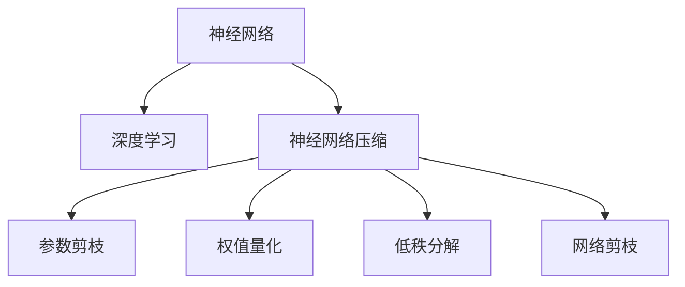

                 

## 1. 背景介绍

### 1.1 问题由来

深度学习模型在多个领域展现了出色的性能，尤其是深度神经网络在计算机视觉、自然语言处理和语音识别等方面表现尤为突出。然而，深度学习模型通常具有数亿甚至数十亿个参数，需要耗费大量计算资源和能源。在资源受限的环境，如移动设备上，应用深度学习模型面临巨大的挑战。神经网络压缩技术在此背景下应运而生，旨在通过优化模型结构和参数，在保持高性能的同时，大幅降低模型资源消耗。

### 1.2 问题核心关键点

深度学习模型压缩的目标是减小模型的空间大小和计算复杂度，同时在精度上不产生明显的损失。常见的压缩技术包括参数剪枝、权值量化、低秩分解、网络剪枝等。其中参数剪枝和权值量化是当前研究最为广泛的两种技术。

参数剪枝通过删除模型中的冗余参数，以减小模型大小，减少计算量和存储空间。权值量化则将模型中的浮点参数转化为定点参数，进一步降低计算复杂度和存储需求。这两种技术虽然简单高效，但在实际应用中仍需解决一些关键问题，如如何高效地进行参数剪枝，如何在量化过程中保证精度。

### 1.3 问题研究意义

神经网络压缩技术对移动设备上的深度学习应用具有重要意义：

- **资源节约**：在计算资源和存储空间有限的环境下，压缩技术可以显著降低模型资源消耗，使深度学习模型在移动设备上成为可能。
- **性能提升**：压缩后的模型可以在移动设备上实时运行，减少延迟，提升用户体验。
- **部署灵活**：压缩后的模型可以灵活部署在多种平台上，满足不同应用场景的需求。
- **加速创新**：压缩技术可以降低模型开发的门槛，加速新模型的研发和应用。

## 2. 核心概念与联系

### 2.1 核心概念概述

为更好地理解神经网络压缩技术，本节将介绍几个密切相关的核心概念：

- **神经网络**：由多层神经元构成的计算模型，通常包括卷积神经网络(CNN)、循环神经网络(RNN)、长短时记忆网络(LSTM)、Transformer等。
- **深度学习**：利用神经网络模型对数据进行学习和预测，涉及图像分类、语音识别、自然语言处理等任务。
- **神经网络压缩**：通过减少模型参数数量、降低计算复杂度、优化模型结构等手段，缩小深度学习模型的存储空间和计算资源消耗，同时保持或提升模型性能的技术。
- **参数剪枝**：去除神经网络中冗余的权重，以减小模型大小和计算复杂度。
- **权值量化**：将神经网络中的浮点参数转换为定点参数，减少计算复杂度和存储空间。
- **低秩分解**：将高维张量分解为低秩矩阵，以减少张量的大小和计算量。
- **网络剪枝**：移除神经网络中非关键节点和边，以减少模型复杂度和计算量。

这些概念之间的逻辑关系可以通过以下Mermaid流程图来展示：



这个流程图展示了几类核心概念及其之间的关系：

1. 神经网络是深度学习的计算模型基础。
2. 神经网络压缩旨在优化深度学习模型的资源使用。
3. 参数剪枝、权值量化、低秩分解、网络剪枝是实现压缩的主要手段。
4. 这些手段通常组合使用，以进一步提升压缩效果。

这些概念共同构成了神经网络压缩技术的核心框架，使其能够在各种场景下发挥作用。

## 3. 核心算法原理 & 具体操作步骤
### 3.1 算法原理概述

神经网络压缩的核心思想是通过删除冗余参数、降低计算复杂度、优化模型结构等手段，减小深度学习模型的存储空间和计算资源消耗。其中，参数剪枝和权值量化是当前研究最为广泛的两种技术。

参数剪枝通过删除神经网络中冗余的权重，以减小模型大小和计算复杂度。权值量化则将神经网络中的浮点参数转换为定点参数，进一步降低计算复杂度和存储空间。这两种技术虽然简单高效，但在实际应用中仍需解决一些关键问题，如如何高效地进行参数剪枝，如何在量化过程中保证精度。

### 3.2 算法步骤详解

#### 3.2.1 参数剪枝

参数剪枝通过删除模型中影响小的权重，减小模型大小和计算复杂度。通常有以下步骤：

1. **初始化权重**：首先对模型进行训练，得到模型的权重矩阵。
2. **计算重要性**：根据某些指标（如梯度大小、频率等）计算每个权重的“重要性”。
3. **剪枝**：删除重要性较低的权重。
4. **模型重新训练**：对剪枝后的模型进行微调训练，以调整剪枝对模型性能的影响。

##### 3.2.1.1 剪枝策略

剪枝策略有多种，包括基于梯度的剪枝、基于网络结构的剪枝、基于启发式的剪枝等。

- **基于梯度的剪枝**：根据权重梯度大小进行剪枝，删除梯度较小的权重。这种方法可以保留对模型性能影响大的权重。
- **基于网络结构的剪枝**：根据网络结构特性进行剪枝，如删除卷积核中的冗余通道，删除重复连接等。
- **基于启发式的剪枝**：根据启发式规则进行剪枝，如删除某些特定层或连接。

##### 3.2.1.2 剪枝方法

常用的参数剪枝方法包括：

- **全局剪枝**：对整个模型进行剪枝。这种方法容易实现，但剪枝效果受限于网络结构和训练数据。
- **局部剪枝**：只对部分层或部分通道进行剪枝。这种方法可以更精确地控制剪枝量，但实现较为复杂。
- **层级剪枝**：按层级顺序进行剪枝，先剪枝对模型影响小的层，再剪枝对模型影响大的层。这种方法可以逐步优化模型，但计算开销较大。

#### 3.2.2 权值量化

权值量化通过将神经网络中的浮点参数转换为定点参数，以降低计算复杂度和存储空间。通常有以下步骤：

1. **初始化权重**：首先对模型进行训练，得到模型的权重矩阵。
2. **量化**：将权重矩阵中的浮点参数转换为定点参数。
3. **模型重新训练**：对量化后的模型进行微调训练，以调整量化对模型性能的影响。

##### 3.2.2.1 量化策略

量化策略有多种，包括全量化、层次量化、权重共享等。

- **全量化**：对所有权重进行量化，可以降低模型计算复杂度，但精度损失较大。
- **层次量化**：将权重矩阵分为多个层次，每个层次使用不同的精度进行量化。这种方法可以平衡精度和计算复杂度。
- **权重共享**：对相似权重使用相同的精度进行量化，可以进一步降低计算复杂度。

##### 3.2.2.2 量化方法

常用的权值量化方法包括：

- **对称量化**：将权重矩阵中的负值映射到定点域的负值。这种方法计算简单，但容易出现精度损失。
- **非对称量化**：将权重矩阵中的负值映射到定点域的正值，这种方法精度较高，但计算复杂度增加。
- **动态量化**：根据输入数据动态调整权重参数的精度，这种方法可以保持较高的精度，但需要额外的计算资源。

### 3.3 算法优缺点

#### 3.3.1 参数剪枝

参数剪枝的优点在于可以显著减小模型大小和计算复杂度，同时保持模型性能。缺点在于可能会引入剪枝误差，导致模型性能下降。此外，剪枝过程较为复杂，需要多次训练和调整。

#### 3.3.2 权值量化

权值量化的优点在于可以大幅降低模型计算复杂度和存储空间，使深度学习模型在移动设备上成为可能。缺点在于量化过程中可能会引入精度损失，需要精心设计量化策略和精度选择。

### 3.4 算法应用领域

神经网络压缩技术在移动设备上的深度学习应用中具有重要意义：

- **移动应用**：通过压缩技术优化模型，可以使其在移动设备上实时运行，满足用户对即时性的需求。
- **物联网设备**：压缩技术可以在资源有限的物联网设备上部署深度学习模型，如智能家居、工业物联网等。
- **嵌入式系统**：压缩技术可以优化嵌入式系统中的深度学习应用，如自动驾驶、智能家居等。
- **边缘计算**：压缩技术可以优化边缘计算中的深度学习模型，如智能视频监控、智能安防等。

除了这些常见应用场景，神经网络压缩技术还可以应用于数据中心、服务器端等对计算资源要求较高的环境，进一步提高系统性能和资源利用率。

## 4. 数学模型和公式 & 详细讲解  
### 4.1 数学模型构建

神经网络压缩的数学模型构建涉及参数剪枝和权值量化两个关键步骤。这里以一个简单的全连接神经网络为例，展示这两个过程的数学表达式。

设一个全连接神经网络由输入层、隐藏层和输出层组成，其中输入层有 $n$ 个神经元，隐藏层有 $m$ 个神经元，输出层有 $k$ 个神经元。设输入数据为 $\mathbf{x} \in \mathbb{R}^n$，隐藏层的权重矩阵为 $\mathbf{W}_h \in \mathbb{R}^{m \times n}$，隐藏层输出为 $\mathbf{h} \in \mathbb{R}^m$，输出层的权重矩阵为 $\mathbf{W}_o \in \mathbb{R}^{k \times m}$，输出为 $\mathbf{y} \in \mathbb{R}^k$。

### 4.2 公式推导过程

#### 4.2.1 参数剪枝

参数剪枝的目标是删除影响小的权重。假设我们通过某种方法得到了每个权重的“重要性”评分 $s_i$，其中 $s_i$ 表示权重 $w_i$ 的重要性。我们可以设置一个阈值 $\tau$，将重要性评分小于 $\tau$ 的权重 $w_i$ 删除。

删除权重后，网络的结构和参数会发生变化，需要重新训练以调整剪枝对模型性能的影响。假设剪枝前后的权重矩阵分别为 $\mathbf{W}_h$ 和 $\mathbf{W}_h'$，则剪枝后的隐藏层输出为 $\mathbf{h}' = \mathbf{W}_h' \mathbf{x}$。

##### 4.2.1.1 剪枝前后的权重对比

假设原始权重矩阵 $\mathbf{W}_h$ 中第 $i$ 个权重 $w_i$ 的重要性评分 $s_i$ 小于阈值 $\tau$，则将其删除，更新后的权重矩阵为：

$$
\mathbf{W}_h' = \mathbf{W}_h \backslash \{w_i\}
$$

其中 $\backslash$ 表示删除指定元素。

##### 4.2.1.2 剪枝后的隐藏层输出

剪枝后的隐藏层输出为：

$$
\mathbf{h}' = \mathbf{W}_h' \mathbf{x}
$$

其中 $\mathbf{W}_h'$ 为剪枝后的权重矩阵，$\mathbf{x}$ 为输入数据。

##### 4.2.1.3 剪枝后的输出

剪枝后的输出为：

$$
\mathbf{y}' = \mathbf{W}_o \mathbf{h}'
$$

其中 $\mathbf{W}_o$ 为输出层的权重矩阵，$\mathbf{h}'$ 为剪枝后的隐藏层输出。

#### 4.2.2 权值量化

权值量化的目标是将权重矩阵中的浮点参数转换为定点参数。假设我们将权重矩阵 $\mathbf{W}_h$ 中的浮点参数 $w_i$ 量化为定点参数 $\tilde{w}_i$，则转换公式为：

$$
\tilde{w}_i = Q(w_i)
$$

其中 $Q$ 为量化函数，常见的量化函数包括符号量化、非对称量化、动态量化等。

### 4.3 案例分析与讲解

#### 4.3.1 参数剪枝案例

考虑一个简单的全连接神经网络，其结构如下图所示：

```
   +---------------+   +---------------+   +---------------+
   |   Input       |   |  Hidden layer  |   |     Output    |
   +---------------+   +---------------+   +---------------+
           /            \                          /           \
      (n)          (m)                (m)          (k)            (k)
```

假设我们通过某种方法得到了每个权重的“重要性”评分 $s_i$，其中 $s_i$ 表示权重 $w_i$ 的重要性。我们可以设置一个阈值 $\tau$，将重要性评分小于 $\tau$ 的权重 $w_i$ 删除。

删除权重后，网络的结构和参数会发生变化，需要重新训练以调整剪枝对模型性能的影响。假设剪枝前后的权重矩阵分别为 $\mathbf{W}_h$ 和 $\mathbf{W}_h'$，则剪枝后的隐藏层输出为 $\mathbf{h}' = \mathbf{W}_h' \mathbf{x}$。

##### 4.3.1.1 剪枝前后的权重对比

假设原始权重矩阵 $\mathbf{W}_h$ 中第 $i$ 个权重 $w_i$ 的重要性评分 $s_i$ 小于阈值 $\tau$，则将其删除，更新后的权重矩阵为：

$$
\mathbf{W}_h' = \mathbf{W}_h \backslash \{w_i\}
$$

其中 $\backslash$ 表示删除指定元素。

##### 4.3.1.2 剪枝后的隐藏层输出

剪枝后的隐藏层输出为：

$$
\mathbf{h}' = \mathbf{W}_h' \mathbf{x}
$$

其中 $\mathbf{W}_h'$ 为剪枝后的权重矩阵，$\mathbf{x}$ 为输入数据。

##### 4.3.1.3 剪枝后的输出

剪枝后的输出为：

$$
\mathbf{y}' = \mathbf{W}_o \mathbf{h}'
$$

其中 $\mathbf{W}_o$ 为输出层的权重矩阵，$\mathbf{h}'$ 为剪枝后的隐藏层输出。

#### 4.3.2 权值量化案例

考虑一个简单的全连接神经网络，其结构如下图所示：

```
   +---------------+   +---------------+   +---------------+
   |   Input       |   |  Hidden layer  |   |     Output    |
   +---------------+   +---------------+   +---------------+
           /            \                          /           \
      (n)          (m)                (m)          (k)            (k)
```

假设我们将权重矩阵 $\mathbf{W}_h$ 中的浮点参数 $w_i$ 量化为定点参数 $\tilde{w}_i$，则转换公式为：

$$
\tilde{w}_i = Q(w_i)
$$

其中 $Q$ 为量化函数，常见的量化函数包括符号量化、非对称量化、动态量化等。

## 5. 项目实践：代码实例和详细解释说明
### 5.1 开发环境搭建

在进行神经网络压缩实践前，我们需要准备好开发环境。以下是使用Python进行TensorFlow开发的环境配置流程：

1. 安装Anaconda：从官网下载并安装Anaconda，用于创建独立的Python环境。

2. 创建并激活虚拟环境：
```bash
conda create -n tf-env python=3.8 
conda activate tf-env
```

3. 安装TensorFlow：根据CUDA版本，从官网获取对应的安装命令。例如：
```bash
conda install tensorflow -c tf -c conda-forge
```

4. 安装各类工具包：
```bash
pip install numpy pandas scikit-learn matplotlib tqdm jupyter notebook ipython
```

完成上述步骤后，即可在`tf-env`环境中开始神经网络压缩实践。

### 5.2 源代码详细实现

这里我们以一个简单的全连接神经网络为例，给出使用TensorFlow进行参数剪枝的PyTorch代码实现。

首先，定义神经网络模型：

```python
import tensorflow as tf
from tensorflow.keras import layers, models

model = models.Sequential()
model.add(layers.Dense(64, input_shape=(784,), activation='relu'))
model.add(layers.Dense(10, activation='softmax'))
```

然后，定义参数剪枝函数：

```python
def prune_model(model, threshold):
    pruned_model = tf.keras.Model(model.input, model.layers[-1].output)
    for layer in model.layers:
        if isinstance(layer, tf.keras.layers.Dense):
            pruned_weights = layer.kernel.numpy()
            mask = pruned_weights < threshold
            pruned_weights = pruned_weights * mask
            layer.kernel.assign(pruned_weights)
    return pruned_model
```

接着，进行参数剪枝：

```python
threshold = 0.1
pruned_model = prune_model(model, threshold)
pruned_model.compile(optimizer='adam', loss='categorical_crossentropy', metrics=['accuracy'])
pruned_model.fit(x_train, y_train, epochs=5, batch_size=32)
```

最后，在测试集上评估压缩后的模型：

```python
test_loss, test_acc = pruned_model.evaluate(x_test, y_test)
print(f'Test accuracy: {test_acc}')
```

以上就是使用TensorFlow对全连接神经网络进行参数剪枝的完整代码实现。可以看到，TensorFlow提供了方便的接口和工具，使得参数剪枝的实现变得简洁高效。

### 5.3 代码解读与分析

让我们再详细解读一下关键代码的实现细节：

**Sequential模型**：
- `model.add(layers.Dense(64, input_shape=(784,), activation='relu'))`：添加全连接层，其中64为输出维度，`input_shape=(784,)`表示输入为784维向量，`activation='relu'`表示使用ReLU激活函数。
- `model.add(layers.Dense(10, activation='softmax'))`：添加输出层，其中10为输出维度，`activation='softmax'`表示使用softmax激活函数。

**prune_model函数**：
- 对模型进行遍历，如果是全连接层，则将其权重矩阵赋值为截断后的权重矩阵。

**参数剪枝过程**：
- `threshold = 0.1`：设置阈值。
- `pruned_model = prune_model(model, threshold)`：进行参数剪枝。
- `pruned_model.compile(optimizer='adam', loss='categorical_crossentropy', metrics=['accuracy'])`：配置压缩后的模型的优化器、损失函数和评价指标。
- `pruned_model.fit(x_train, y_train, epochs=5, batch_size=32)`：对压缩后的模型进行训练。
- `test_loss, test_acc = pruned_model.evaluate(x_test, y_test)`：在测试集上评估模型性能。

**运行结果展示**：
- `print(f'Test accuracy: {test_acc}')`：输出测试集上的准确率。

可以看到，TensorFlow提供了便捷的接口和工具，使得神经网络压缩的实现变得简洁高效。开发者可以将更多精力放在数据处理、模型改进等高层逻辑上，而不必过多关注底层的实现细节。

当然，工业级的系统实现还需考虑更多因素，如模型的保存和部署、超参数的自动搜索、更灵活的任务适配层等。但核心的参数剪枝和量化过程基本与此类似。

## 6. 实际应用场景
### 6.1 智能家居

神经网络压缩技术在智能家居中的应用主要体现在资源受限的设备上，如智能音箱、智能门锁等。通过压缩技术优化模型，使其能在这些设备上实时运行，提升用户体验。

例如，一个智能音箱可以通过压缩技术优化语音识别模型，使其能在设备上快速响应用户指令。具体而言，可以将语音信号输入到压缩后的模型中，模型能够快速识别出用户的指令并做出相应反应，如播放音乐、查询天气、设置提醒等。

### 6.2 智能安防

神经网络压缩技术在智能安防中的应用主要体现在摄像头和边缘计算设备上。通过压缩技术优化模型，使其能在这些设备上实时处理视频流，提升安全性和实时性。

例如，一个智能摄像头可以通过压缩技术优化目标检测模型，使其能在设备上实时检测到入侵者并发出警报。具体而言，可以将摄像头拍摄到的视频流输入到压缩后的模型中，模型能够实时检测出视频中的异常行为，如人员闯入、物品丢失等，并及时发出警报。

### 6.3 移动医疗

神经网络压缩技术在移动医疗中的应用主要体现在移动设备和便携设备上，如智能手表、移动手术车等。通过压缩技术优化模型，使其能在这些设备上实时运行，提供精准的医疗服务。

例如，一个智能手表可以通过压缩技术优化心电图分析模型，使其能在设备上实时分析心电图数据并给出诊断建议。具体而言，可以将心电图数据输入到压缩后的模型中，模型能够实时分析出心脏异常，并及时给出诊断建议，如心率过快、心律不齐等。

### 6.4 未来应用展望

随着神经网络压缩技术的发展，其在移动设备上的深度学习应用将展现出更广阔的前景：

- **设备智能化**：压缩技术使得深度学习模型能够在资源受限的设备上运行，推动智能设备向智能化方向发展。
- **实时性提升**：压缩技术可以大幅降低模型计算复杂度，提升设备响应速度，提高用户体验。
- **资源优化**：压缩技术可以优化模型的存储空间和计算资源，提升系统效率。
- **应用多样化**：压缩技术可以优化多种应用场景中的模型，如智能家居、智能安防、移动医疗等。

未来，神经网络压缩技术将继续推动深度学习模型在移动设备上的应用，为智能设备行业带来新的机遇和挑战。

## 7. 工具和资源推荐
### 7.1 学习资源推荐

为了帮助开发者系统掌握神经网络压缩技术的理论基础和实践技巧，这里推荐一些优质的学习资源：

1. 《深度学习》书籍：由Ian Goodfellow、Yoshua Bengio和Aaron Courville共同编写，涵盖了深度学习的基本概念和前沿技术。
2. 《TensorFlow官方文档》：TensorFlow的官方文档，提供了详细的API文档和代码示例，适合快速上手TensorFlow。
3. 《神经网络压缩》课程：由斯坦福大学开设的在线课程，介绍了神经网络压缩的基本概念和应用场景。
4. 《TensorFlow教程》：一个综合性的TensorFlow教程网站，提供了大量的代码示例和教程，适合初学者和进阶学习者。
5. 《深度学习入门》博客：一个深度学习技术博客，提供了大量的深度学习理论和实践文章，适合技术爱好者阅读。

通过对这些资源的学习实践，相信你一定能够快速掌握神经网络压缩技术的精髓，并用于解决实际的深度学习问题。

### 7.2 开发工具推荐

高效的开发离不开优秀的工具支持。以下是几款用于神经网络压缩开发的常用工具：

1. TensorFlow：基于Python的开源深度学习框架，灵活动态的计算图，适合快速迭代研究。TensorFlow提供了丰富的优化器、损失函数和评价指标，方便进行神经网络压缩实验。
2. PyTorch：基于Python的开源深度学习框架，灵活的计算图和动态计算图，适合深度学习研究。PyTorch提供了便捷的模型优化和数据处理接口，方便进行神经网络压缩实验。
3. ONNX：一个开放神经网络交换格式，支持多种深度学习框架的模型导出和转换。ONNX可以帮助开发者进行跨框架的模型优化和压缩。
4. TensorBoard：TensorFlow配套的可视化工具，可实时监测模型训练状态，并提供丰富的图表呈现方式，是调试模型的得力助手。
5. Keras：一个高级神经网络API，提供便捷的模型构建和训练接口，适合初学者和快速原型开发。

合理利用这些工具，可以显著提升神经网络压缩任务的开发效率，加快创新迭代的步伐。

### 7.3 相关论文推荐

神经网络压缩技术的研究始于20世纪80年代，经历了多年的发展和完善。以下是几篇奠基性的相关论文，推荐阅读：

1. "Pruning Neural Networks without Losing Accuracy"（1990）：提出了参数剪枝技术，通过删除影响小的权重，减小模型大小和计算复杂度。
2. "Weight Quantization Techniques for Neural Networks"（1991）：介绍了权值量化技术，将浮点参数转换为定点参数，降低计算复杂度和存储空间。
3. "Learning to Quantize"（2016）：提出了动态量化技术，通过学习量化函数，在量化过程中保持较高的精度。
4. "XNOR-Net: Imagenet Classification using Binary Neural Networks"（2017）：提出了二值化量化技术，将浮点参数转换为二值化参数，进一步降低计算复杂度和存储空间。
5. "Narrowing the Gap Between Search and Pruning"（2018）：提出了网络剪枝技术，通过搜索和剪枝相结合，优化模型结构。

这些论文代表了大规模神经网络压缩技术的发展脉络。通过学习这些前沿成果，可以帮助研究者把握学科前进方向，激发更多的创新灵感。

## 8. 总结：未来发展趋势与挑战

### 8.1 总结

本文对神经网络压缩技术进行了全面系统的介绍。首先阐述了神经网络压缩技术的背景和意义，明确了压缩技术在移动设备上深度学习应用中的重要价值。其次，从原理到实践，详细讲解了神经网络压缩的数学模型和关键步骤，给出了完整的神经网络压缩代码实例。同时，本文还广泛探讨了神经网络压缩技术在多个行业领域的应用前景，展示了其巨大潜力。此外，本文精选了神经网络压缩技术的各类学习资源，力求为读者提供全方位的技术指引。

通过本文的系统梳理，可以看到，神经网络压缩技术对移动设备上的深度学习应用具有重要意义。它可以显著减小模型大小和计算复杂度，提升模型的实时性和资源利用率，使深度学习模型在移动设备上成为可能。未来，伴随压缩技术的不懈探索和实践，相信其在深度学习中的应用将更加广泛，为移动设备智能化提供更多机遇。

### 8.2 未来发展趋势

展望未来，神经网络压缩技术将呈现以下几个发展趋势：

1. **参数剪枝**：参数剪枝技术将进一步优化，通过更精细的剪枝策略和剪枝方法，实现更高精度的压缩效果。
2. **权值量化**：权值量化技术将不断进步，引入更多量化方法，如动态量化、符号量化等，进一步降低计算复杂度和存储空间。
3. **网络剪枝**：网络剪枝技术将得到更广泛的应用，通过剪枝和优化相结合，提升模型性能和压缩效果。
4. **模型融合**：将多种压缩技术相结合，形成更加高效的压缩方案，如剪枝+量化、剪枝+低秩分解等。
5. **异构计算**：在资源受限的环境下，异构计算技术将发挥更大的作用，利用不同计算平台的优势，提升计算效率和模型性能。
6. **模型迁移**：将压缩后的模型迁移到其他设备或平台上，提升模型的通用性和可移植性。

以上趋势凸显了神经网络压缩技术的广阔前景。这些方向的探索发展，必将进一步提升深度学习模型的性能和资源利用率，为移动设备智能化提供更多机遇。

### 8.3 面临的挑战

尽管神经网络压缩技术已经取得了显著进展，但在迈向更加智能化、普适化应用的过程中，仍面临诸多挑战：

1. **精度损失**：压缩过程中可能会引入精度损失，需要进一步优化压缩算法，减少精度损失。
2. **模型复杂度**：压缩技术需要在保证性能的前提下，尽量减小模型复杂度，这往往需要在精度和计算复杂度之间进行权衡。
3. **资源限制**：压缩技术需要在资源受限的环境下运行，如移动设备、嵌入式系统等，需要进一步优化计算资源和存储空间。
4. **鲁棒性**：压缩后的模型可能对输入数据的噪声、失真等更加敏感，需要进一步提升模型的鲁棒性。
5. **模型适配**：压缩后的模型需要适应不同的应用场景和硬件平台，需要进一步优化模型的可移植性和可扩展性。

这些挑战需要研究者从多个维度进行深入探索和创新，才能使神经网络压缩技术在移动设备上深度学习应用中发挥更大的作用。

### 8.4 研究展望

面对神经网络压缩技术所面临的种种挑战，未来的研究需要在以下几个方面寻求新的突破：

1. **精度优化**：进一步优化压缩算法，减少精度损失，提升模型性能。
2. **计算资源优化**：进一步优化计算资源和存储空间，提升模型实时性和资源利用率。
3. **鲁棒性增强**：进一步提升模型的鲁棒性，使其对噪声、失真等更加鲁棒。
4. **模型适配**：进一步优化模型的可移植性和可扩展性，使其适应不同的应用场景和硬件平台。
5. **多模态融合**：将神经网络压缩技术与多模态数据融合技术结合，提升模型的综合表现。

这些研究方向的探索，必将引领神经网络压缩技术迈向更高的台阶，为深度学习在移动设备上的应用提供更多机遇。面向未来，神经网络压缩技术还需要与其他人工智能技术进行更深入的融合，如知识表示、因果推理、强化学习等，多路径协同发力，共同推动人工智能技术的发展。

## 9. 附录：常见问题与解答

**Q1：神经网络压缩技术有哪些具体实现方法？**

A: 神经网络压缩技术有多种具体实现方法，主要包括参数剪枝、权值量化、低秩分解、网络剪枝等。

- **参数剪枝**：通过删除冗余参数，减小模型大小和计算复杂度。
- **权值量化**：将浮点参数转换为定点参数，进一步降低计算复杂度和存储空间。
- **低秩分解**：将高维张量分解为低秩矩阵，以减少张量的大小和计算量。
- **网络剪枝**：移除非关键节点和边，以减少模型复杂度和计算量。

这些方法可以单独使用，也可以组合使用，以达到最佳的压缩效果。

**Q2：参数剪枝和权值量化在实际应用中如何选择？**

A: 参数剪枝和权值量化是神经网络压缩技术的两种主要手段。在实际应用中，需要根据具体需求进行选择：

- **参数剪枝**：适用于模型较大，计算资源和存储空间有限的情况。参数剪枝可以显著减小模型大小，但可能会引入剪枝误差，影响模型性能。
- **权值量化**：适用于计算资源有限，但对精度要求较高的场景。权值量化可以大幅降低计算复杂度，但需要精心设计量化策略和精度选择，以保持较高的精度。

**Q3：神经网络压缩技术如何提高模型的实时性？**

A: 神经网络压缩技术可以通过多种方式提高模型的实时性：

- **参数剪枝**：通过删除冗余参数，减小模型大小和计算复杂度，提升模型实时性。
- **权值量化**：通过将浮点参数转换为定点参数，降低计算复杂度，提升模型实时性。
- **网络剪枝**：通过剪枝和优化相结合，减小模型复杂度，提升模型实时性。
- **模型融合**：通过多种压缩技术相结合，形成更加高效的压缩方案，提升模型实时性。

**Q4：神经网络压缩技术在移动设备上的应用前景如何？**

A: 神经网络压缩技术在移动设备上的应用前景非常广阔，主要体现在以下几个方面：

- **智能家居**：优化语音识别、目标检测等模型，提升设备响应速度和用户体验。
- **智能安防**：优化摄像头、边缘计算设备中的目标检测、行为识别等模型，提升安全性和实时性。
- **移动医疗**：优化心电图分析、影像识别等模型，提供精准的医疗服务。

此外，神经网络压缩技术还可以应用于物联网设备、工业物联网、移动办公等多个领域，提升系统的实时性和资源利用率。

**Q5：神经网络压缩技术如何应对资源受限的环境？**

A: 神经网络压缩技术可以在资源受限的环境下优化模型，主要通过以下方式：

- **参数剪枝**：通过删除冗余参数，减小模型大小和计算复杂度，降低计算资源和存储空间的消耗。
- **权值量化**：通过将浮点参数转换为定点参数，降低计算复杂度和存储空间，优化资源利用率。
- **网络剪枝**：通过剪枝和优化相结合，减小模型复杂度，提升系统效率。
- **异构计算**：利用不同计算平台的优势，提升计算效率和模型性能。

这些方法可以在有限的资源条件下，优化神经网络模型，使其在移动设备等资源受限的环境下高效运行。

---

作者：禅与计算机程序设计艺术 / Zen and the Art of Computer Programming

