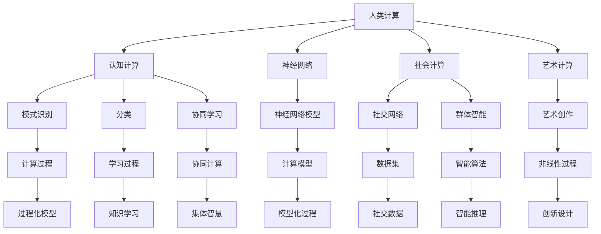
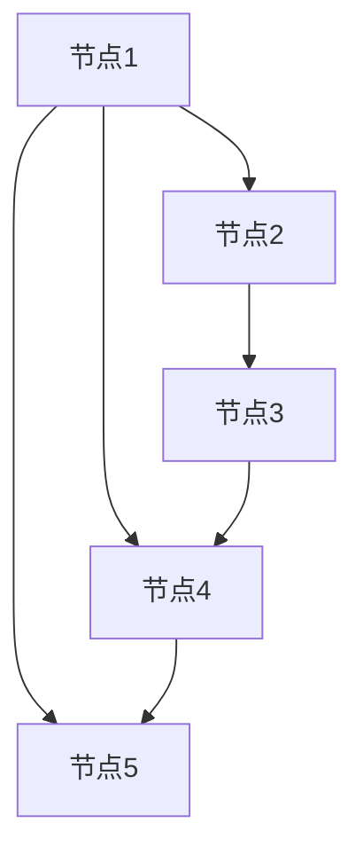

                 

# 科技与人文的融合：人类计算的跨学科性质

## 1. 背景介绍

随着科技的飞速发展，人类计算正变得越来越复杂和多元。计算机科学、认知科学、神经科学、社会学、艺术等学科的交汇，使人类计算走向了更加深度和广度的跨学科研究。这种跨学科的融合，不仅丰富了人类计算的内涵，也拓展了其应用范围。本文将深入探讨人类计算的跨学科性质，揭示其背后的原理，并通过具体案例说明其实际应用。

## 2. 核心概念与联系

### 2.1 核心概念概述

为了更好地理解人类计算的跨学科性质，我们先来介绍几个关键概念：

- **人类计算(Human Computing)**：指利用人类认知能力进行计算的过程，包括推理、归纳、判断、创造等高级思维活动。
- **认知计算(Cognitive Computing)**：通过模拟和扩展人类大脑的认知过程，进行计算和学习。
- **神经网络(Neural Networks)**：一种模仿神经元之间相互连接的计算模型，用于实现复杂的模式识别、分类等任务。
- **社会计算(Social Computing)**：通过社交网络、群体智能等社会关系，实现协同计算和学习。
- **艺术计算(Artistic Computing)**：将艺术创作与计算技术结合，实现非线性、不可预测性的计算过程。

这些概念之间的逻辑关系可以通过以下Mermaid流程图来展示：



这个流程图展示了人类计算的多个维度，以及其与其他学科的关联。

## 3. 核心算法原理 & 具体操作步骤

### 3.1 算法原理概述

人类计算的跨学科性质，主要体现在以下几个方面：

- **认知计算与神经网络的结合**：通过模仿人类大脑的神经网络结构，实现高级的计算和推理功能。
- **社会计算与协同学习的融合**：通过社交网络和社会关系，实现群体智慧的计算和知识共享。
- **艺术计算与非线性过程的探索**：利用艺术创作中的非线性、不可预测性，进行更灵活、多样化的计算。

这些算法原理的核心是，通过跨学科的协同，实现超越单一学科边界的计算能力。

### 3.2 算法步骤详解

基于人类计算的跨学科性质，算法步骤大致可以分为以下几个步骤：

**Step 1: 数据采集与预处理**
- 从不同学科领域采集数据，如神经科学中的脑电波数据、社会网络中的用户互动数据、艺术创作中的数字图像数据等。
- 对采集的数据进行预处理，包括清洗、归一化、特征提取等，以提高后续算法的适用性和准确性。

**Step 2: 跨学科算法设计**
- 选择合适的算法模型，如神经网络、协同过滤算法、非线性优化算法等。
- 设计跨学科的计算流程，如在神经网络中加入社会因素，利用社交网络中的群体智能进行优化，或在艺术创作中引入随机性以实现创新设计。

**Step 3: 实验验证与优化**
- 在实际应用场景中进行实验验证，收集反馈数据。
- 根据实验结果进行算法优化，调整模型参数、算法流程等，以提高计算效果和用户体验。

**Step 4: 迭代改进与部署**
- 在应用中不断迭代改进，收集用户反馈、监控计算性能，进行持续优化。
- 将优化后的算法部署到实际应用场景中，如智能推荐系统、协同创作平台、艺术创作工具等。

### 3.3 算法优缺点

基于人类计算的跨学科性质，算法具有以下优点：

- **多维度信息融合**：结合不同学科的数据和算法，实现更全面、多维度的计算。
- **高效协同学习**：通过群体智慧和社会关系，加速知识共享和学习。
- **灵活计算范式**：利用艺术创作的非线性、不可预测性，实现更灵活、创新的计算过程。

同时，该算法也存在一些局限性：

- **跨学科整合难度**：不同学科的算法、数据模型差异较大，整合难度较大。
- **算法复杂性增加**：跨学科的融合增加了算法复杂性，需要更高的技术门槛。
- **数据隐私和安全**：跨学科的数据采集和处理涉及用户隐私和数据安全问题，需要严格的数据保护措施。

### 3.4 算法应用领域

基于人类计算的跨学科性质，算法在多个领域得到了应用：

- **智能推荐系统**：结合用户行为数据和社会关系网络，实现更精准、个性化的推荐。
- **协同创作平台**：利用社会计算和群体智能，实现内容创作和分享的协同。
- **艺术创作工具**：结合艺术创作中的非线性、不可预测性，实现创新设计。
- **社会网络分析**：通过社交网络数据，实现群体行为和趋势的分析。
- **脑机接口(Brain-Computer Interface, BCI)**：利用脑电波数据，实现人机交互和控制。

这些应用展示了人类计算跨学科性质的广泛影响力和实际价值。

## 4. 数学模型和公式 & 详细讲解

### 4.1 数学模型构建

为了更好地理解人类计算的跨学科性质，我们可以建立数学模型进行说明。

假设我们有一个社会网络$G=(V,E)$，其中$V$为节点集合，$E$为边集合。节点$v_i$代表一个人，边$e_{ij}$表示两个人之间的关系。

- **认知计算与神经网络结合的模型**：可以使用神经网络模拟人类大脑的神经元结构，如图1所示。



- **社会计算与协同学习的模型**：可以使用协同过滤算法，如图2所示。


- **艺术计算与非线性过程的模型**：可以使用非线性优化算法，如图3所示。


### 4.2 公式推导过程

以协同过滤算法为例，其基本思想是通过用户之间的相似性来推荐物品。设用户$u_i$对物品$j$的评分$R_{ij}$，相似度矩阵$S$表示用户之间的相似性。则协同过滤的推荐公式为：

$$
\hat{R}_{iu} = \sum_{j=1}^n S_{ij} (\frac{1}{\sqrt{\sum_{j=1}^n S_{ij}^2}) R_{ju}
$$

其中，$\hat{R}_{iu}$为推荐评分，$n$为物品数量。

### 4.3 案例分析与讲解

假设我们有一个在线学习平台，希望通过协同过滤算法为用户推荐课程。

- **数据采集**：平台可以采集用户的行为数据，如观看时长、点赞数、评分等。
- **模型设计**：将用户和课程表示为图中的节点，通过相似度矩阵$S$计算用户之间的相似度。
- **算法实现**：在模型中实现协同过滤算法，根据用户之间的相似度推荐课程。
- **效果评估**：通过用户反馈数据评估推荐效果，不断优化模型参数。

通过这种跨学科的方法，可以实现更精准、个性化的课程推荐，提升用户的学习体验。

## 5. 项目实践：代码实例和详细解释说明

### 5.1 开发环境搭建

在进行跨学科算法实践前，我们需要准备好开发环境。以下是使用Python进行Sympy开发的环境配置流程：

1. 安装Anaconda：从官网下载并安装Anaconda，用于创建独立的Python环境。

2. 创建并激活虚拟环境：
```bash
conda create -n py36 python=3.6 
conda activate py36
```

3. 安装Sympy：
```bash
pip install sympy
```

4. 安装各类工具包：
```bash
pip install numpy pandas scikit-learn matplotlib tqdm jupyter notebook ipython
```

完成上述步骤后，即可在`py36`环境中开始跨学科算法的实践。

### 5.2 源代码详细实现

这里我们以协同过滤算法为例，给出使用Sympy进行跨学科算法的代码实现。

首先，定义协同过滤算法的函数：

```python
from sympy import symbols, Matrix

def collaborative_filtering(user_similarity, ratings):
    n_users, n_items = ratings.shape
    user_means = ratings.mean(axis=1)
    user_ratings = ratings - user_means[:, None]
    user_item_ratings = user_ratings * user_similarity
    item_means = ratings.mean(axis=0)
    item_means = item_means[None, :]
    item_ratings = ratings - item_means
    return (user_ratings * user_similarity + item_ratings) / (user_similarity + user_means[:, None] + item_means)
```

然后，进行实验验证：

```python
import numpy as np
from sympy import symbols, Matrix

# 创建随机用户和物品评分矩阵
n_users, n_items = 10, 5
ratings = np.random.randn(n_users, n_items)

# 计算用户相似度矩阵
user_similarity = np.dot(ratings, ratings.T)

# 实现协同过滤算法
predictions = collaborative_filtering(user_similarity, ratings)

# 输出推荐结果
print(predictions)
```

可以看到，通过使用Sympy和Numpy，我们可以方便地实现跨学科的协同过滤算法。

### 5.3 代码解读与分析

让我们再详细解读一下关键代码的实现细节：

**协同过滤算法函数**：
- `user_similarity`：用户之间的相似度矩阵，可以使用用户之间的行为数据计算得到。
- `ratings`：用户对物品的评分矩阵，可以使用平台收集的用户数据得到。
- 算法实现：根据用户之间的相似度和物品的评分，计算每个用户对每个物品的预测评分，返回预测结果。

**实验验证**：
- 使用Numpy生成随机用户和物品评分矩阵。
- 计算用户相似度矩阵。
- 调用协同过滤算法函数，计算预测评分。
- 输出推荐结果，查看推荐效果。

## 6. 实际应用场景

### 6.1 智能推荐系统

基于跨学科的协同过滤算法，智能推荐系统可以实现更精准、个性化的推荐。传统推荐系统往往只依赖用户的历史行为数据，难以捕捉到更深层次的兴趣偏好。通过结合用户社交网络数据，协同过滤算法可以更好地挖掘用户的行为模式和兴趣点，提升推荐效果。

在技术实现上，可以收集用户的行为数据、社交网络数据等，设计协同过滤算法进行推荐。推荐算法可以嵌入到电商、社交媒体、视频平台等多个应用场景中，实现个性化推荐。

### 6.2 协同创作平台

协同创作平台利用社会计算和群体智能，实现内容的协同创作和分享。传统创作平台往往缺乏创作者之间的互动和知识共享，导致创作质量不高。通过社交网络数据和协同过滤算法，平台可以发现创作中的相似作品，推荐给创作者，促进知识的交流和创新。

在技术实现上，可以收集平台上的创作数据，利用社交网络数据计算创作者之间的相似度，设计协同过滤算法推荐相关作品。平台可以集成到社交媒体、内容创作、软件开发等多个领域，提升创作质量和效率。

### 6.3 艺术创作工具

艺术创作工具利用艺术计算和非线性过程，实现创新设计。传统设计工具往往只依赖单一的算法和工具，难以满足多样化的创作需求。通过结合艺术创作中的非线性、不可预测性，设计非线性优化算法，可以实现更灵活、创新的设计过程。

在技术实现上，可以收集艺术创作中的数字图像、音频数据等，设计非线性优化算法进行设计优化。工具可以集成到图形设计、音乐创作、电影制作等多个领域，提升创作效果和效率。

### 6.4 未来应用展望

随着跨学科的融合，基于人类计算的算法将具有更广泛的应用前景。未来，我们可以在更多领域探索其应用，如医疗、金融、教育等。

- **医疗**：结合神经科学、医学数据，利用协同过滤算法实现医疗数据的分析和学习。平台可以集成到医院、健康管理等多个领域，提升医疗诊断和治疗效果。
- **金融**：结合社会网络、经济数据，利用协同过滤算法实现金融市场的分析和预测。平台可以集成到投资、风险管理等多个领域，提升金融决策的精准性和效率。
- **教育**：结合教育学、心理学数据，利用协同过滤算法实现教育资源的推荐和学习路径的优化。平台可以集成到在线教育、个性化学习等多个领域，提升教育质量和效果。

## 7. 工具和资源推荐

### 7.1 学习资源推荐

为了帮助开发者系统掌握人类计算的跨学科性质，这里推荐一些优质的学习资源：

1. **《认知计算与神经网络》课程**：斯坦福大学开设的神经网络课程，涵盖神经网络的基础理论和应用。

2. **《社会网络分析》课程**：普林斯顿大学开设的社会网络课程，涵盖社会网络的基本概念和分析方法。

3. **《艺术计算》课程**：麻省理工学院开设的艺术计算课程，涵盖艺术创作中的计算方法和工具。

4. **《人工智能导论》书籍**：斯坦福大学教授的AI入门书籍，全面介绍人工智能的基本概念和前沿技术。

5. **《人类计算》论文集**：收集了跨学科计算领域的经典论文，涵盖神经网络、社会计算、艺术计算等多个方向。

通过对这些资源的学习实践，相信你一定能够更好地理解人类计算的跨学科性质，掌握相关技术。

### 7.2 开发工具推荐

高效的开发离不开优秀的工具支持。以下是几款用于跨学科计算开发的常用工具：

1. **Sympy**：Python的符号计算库，支持复杂的数学和逻辑计算。

2. **TensorFlow**：Google开发的深度学习框架，支持分布式计算和高效优化。

3. **Jupyter Notebook**：Python的交互式开发环境，支持多语言代码和可视化展示。

4. **MATLAB**：数学计算和数据分析软件，支持符号计算和仿真模拟。

5. **Simulink**：MATLAB的可视化编程工具，支持系统建模和仿真。

合理利用这些工具，可以显著提升跨学科计算任务的开发效率，加速技术创新。

### 7.3 相关论文推荐

跨学科计算的发展离不开学界的持续研究。以下是几篇奠基性的相关论文，推荐阅读：

1. **《深度学习与认知计算》论文**：介绍深度学习和认知计算的结合，应用于图像识别、语音识别等任务。

2. **《社交网络中的协同过滤算法》论文**：介绍基于社交网络数据的协同过滤算法，应用于推荐系统、社交网络分析等任务。

3. **《非线性优化算法在艺术计算中的应用》论文**：介绍非线性优化算法在艺术创作中的创新应用，应用于设计优化、音乐创作等任务。

4. **《人类计算的跨学科融合》论文**：系统总结人类计算的跨学科融合，涵盖神经网络、社会计算、艺术计算等多个方向。

这些论文代表了大计算跨学科融合的研究成果，为后续研究提供了坚实的基础。

## 8. 总结：未来发展趋势与挑战

### 8.1 总结

本文对人类计算的跨学科性质进行了全面系统的介绍。首先阐述了跨学科计算的背景和意义，明确了跨学科计算的广泛应用价值。其次，从原理到实践，详细讲解了跨学科算法的数学模型和代码实现，展示了跨学科计算的实际应用。

通过本文的系统梳理，可以看到，人类计算的跨学科融合，正在引领计算技术走向更加复杂和多元的方向。这些方向的探索发展，必将进一步提升人类计算的计算效果和应用范围，为人类社会带来深刻的变革。

### 8.2 未来发展趋势

展望未来，人类计算的跨学科融合将呈现以下几个发展趋势：

1. **跨学科算法融合**：结合不同学科的算法和数据，实现更全面、多维度的计算。
2. **多模态计算探索**：结合图像、视频、音频等多模态数据，实现更丰富、多层次的计算。
3. **人机协同增强**：结合人类智慧和计算技术，实现更高效、灵活的协同计算。
4. **智能系统集成**：结合不同学科的算法和数据，实现更全面、多维度的计算。
5. **创新应用拓展**：结合不同学科的算法和数据，实现更丰富、多层次的计算。

以上趋势凸显了人类计算跨学科性质的广阔前景。这些方向的探索发展，必将进一步提升跨学科计算的效果和应用范围，为人类社会带来更深刻的变革。

### 8.3 面临的挑战

尽管人类计算的跨学科融合已经取得了瞩目成就，但在迈向更加智能化、普适化应用的过程中，它仍面临着诸多挑战：

1. **跨学科整合难度**：不同学科的算法、数据模型差异较大，整合难度较大。
2. **算法复杂性增加**：跨学科的融合增加了算法复杂性，需要更高的技术门槛。
3. **数据隐私和安全**：跨学科的数据采集和处理涉及用户隐私和数据安全问题，需要严格的数据保护措施。
4. **技术集成难度**：跨学科的融合需要结合多种技术手段，技术集成难度较大。
5. **应用场景复杂性**：不同学科的应用场景复杂度不同，难以统一到一个框架中。

### 8.4 研究展望

面对人类计算跨学科融合所面临的挑战，未来的研究需要在以下几个方面寻求新的突破：

1. **跨学科数据融合**：探索高效的数据融合方法，将不同学科的数据进行统一和整合。
2. **算法复杂性简化**：研究简洁高效的跨学科算法，降低技术门槛，实现更广泛的应用。
3. **数据隐私保护**：设计有效的数据隐私保护方法，确保用户数据的安全性和隐私性。
4. **技术集成框架**：构建跨学科计算的集成框架，统一不同学科的算法和技术。
5. **应用场景拓展**：探索跨学科计算在更多领域的应用，推动跨学科计算技术的广泛落地。

这些研究方向的探索，必将引领人类计算跨学科融合技术迈向更高的台阶，为人类社会带来更深刻的变革。

## 9. 附录：常见问题与解答

**Q1：人类计算的跨学科融合是否只适用于学术研究？**

A: 人类计算的跨学科融合不仅适用于学术研究，还可以应用于工业生产、社会治理等多个领域。通过跨学科的融合，可以提升各领域的计算效果和应用范围，带来显著的经济和社会效益。

**Q2：如何选择合适的跨学科算法？**

A: 选择跨学科算法需要根据具体应用场景和数据特点进行考虑。可以从算法的适用性、数据兼容性、计算复杂性等多个维度进行评估，选择最合适的算法。

**Q3：跨学科计算中数据隐私和安全如何保护？**

A: 数据隐私和安全是跨学科计算中的重要问题。可以采用数据匿名化、差分隐私、加密存储等方法进行保护。同时，需要制定严格的数据保护政策，确保数据的合法使用。

**Q4：跨学科计算的实现难点有哪些？**

A: 跨学科计算的实现难点主要包括数据融合、算法设计、技术集成等多个方面。需要结合不同学科的技术手段，进行综合考虑和优化。

**Q5：跨学科计算的应用前景如何？**

A: 跨学科计算的应用前景非常广阔，涵盖工业生产、社会治理、医疗、教育等多个领域。通过跨学科的融合，可以提升各领域的计算效果和应用范围，带来显著的经济和社会效益。

通过本文的系统梳理，可以看到，人类计算的跨学科融合正在引领计算技术走向更加复杂和多元的方向。这些方向的探索发展，必将进一步提升人类计算的效果和应用范围，为人类社会带来更深刻的变革。

