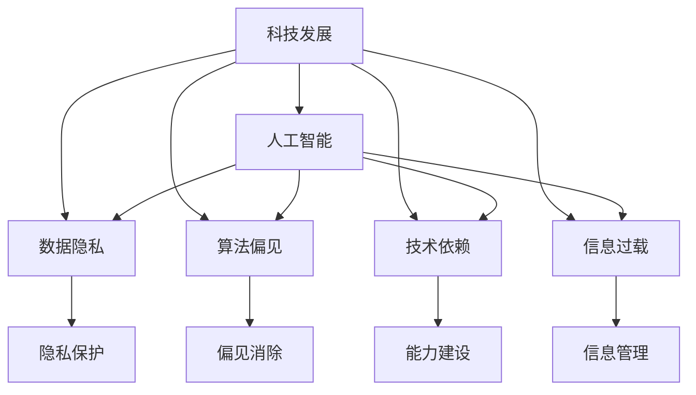

                 

## 1. 背景介绍

在科技迅猛发展的今天，人工智能、大数据、云计算等前沿技术的不断涌现，不仅在各行各业带来了颠覆性的变革，也极大提升了人类社会的整体福祉。然而，技术的进步并非没有代价，如何在享受科技成果的同时，保障人类的安全与福祉，成为我们必须面对的重要课题。

### 1.1 科技与人类福祉的紧密联系

科技进步在很大程度上改变了人类的生产和生活方式，提高了生产效率，增强了生活便利性，拓展了知识边界。例如，人工智能在医疗、教育、金融等领域的应用，极大地提升了服务质量和效率，降低了社会运行成本。然而，科技的发展同时也带来了数据隐私、网络安全、算法偏见等新挑战，对人类福祉构成潜在威胁。

### 1.2 科技进步对人类福祉的影响

科技进步在提升人类福祉的同时，也可能带来以下负面影响：

1. **就业冲击**：自动化和人工智能的广泛应用，可能导致部分岗位的消失，尤其是重复性高、技能要求低的工作。这需要社会进行相应的职业转型和技能培训，以保障就业稳定。
   
2. **数据隐私**：在数字化、信息化社会，个人数据被广泛收集和分析，隐私保护成为一大挑战。不当的数据使用可能导致个人隐私泄露，带来经济损失和心理伤害。

3. **算法偏见**：机器学习模型依赖大量数据进行训练，如果数据中存在偏见，模型可能学习到这些偏见，并在决策中表现出歧视性。这可能加剧社会不平等，影响公平正义。

4. **技术依赖**：对技术的过度依赖可能导致人类能力的退化，如信息获取、问题解决等基本能力的下降。科技带来的便捷性和高效性，可能使得人们忽视了手动操作和基础学习的重要性。

5. **信息过载**：互联网和社交媒体的普及，导致信息过载问题加剧，人们被海量信息淹没，难以从中提取有用信息，可能影响心理健康和认知能力。

## 2. 核心概念与联系

### 2.1 核心概念概述

为更好地理解科技发展与人类福祉的关系，本节将介绍几个核心概念及其相互联系：

- **科技发展**：指通过技术创新、研发投入等方式，推动社会生产力和人类福祉提升的过程。

- **人类福祉**：指人类的身心健康、生活质量、幸福感等各方面的综合表现。

- **人工智能**：以机器学习、深度学习等为代表的智能技术，具有模拟人类智能行为的能力，在多个领域展现出色表现。

- **数据隐私**：在数据收集、存储、使用过程中，保护个人隐私不被滥用的原则和机制。

- **算法偏见**：机器学习模型在训练和应用过程中，由于数据或设计原因，导致在决策结果中体现的偏见和不公平。

- **技术依赖**：人类对技术的过度依赖，可能导致基础能力退化，形成对技术的过度依赖。

- **信息过载**：在信息爆炸时代，信息量超出了人类处理和吸收的能力范围，导致心理压力和认知负担增加。

这些概念之间的逻辑关系可以通过以下Mermaid流程图来展示：



这个流程图展示了科技发展通过人工智能、数据隐私、算法偏见、技术依赖、信息过载等多个维度，对人类福祉产生深远影响。同时，人类福祉的提升也需要通过隐私保护、偏见消除、能力建设、信息管理等措施来应对这些挑战。

## 3. 核心算法原理 & 具体操作步骤
### 3.1 算法原理概述

科技发展与人类福祉之间的关系，可通过一系列算法模型来描述和优化。本节将从算法原理的角度，阐述如何通过科技手段保障人类福祉。

### 3.2 算法步骤详解

为了有效保障人类福祉，我们可以设计以下算法步骤：

**Step 1: 数据收集与处理**

数据是科技发展的基础，高质量的数据集对于优化模型、提升应用效果至关重要。因此，需要收集与人类福祉相关的各类数据，如健康数据、教育数据、就业数据等，并进行预处理和清洗，确保数据的质量和可用性。

**Step 2: 模型设计与训练**

利用机器学习和深度学习技术，设计和训练模型以实现以下目标：

- **疾病预测与预防**：通过分析健康数据，建立疾病预测模型，提前发现潜在健康问题，并进行干预。
- **教育效果评估**：利用教育数据，构建学生学习效果评估模型，提供个性化学习建议。
- **就业预测与匹配**：分析就业市场数据，预测未来就业趋势，为求职者提供匹配建议。
- **交通流量优化**：通过交通数据，优化交通流量，减少拥堵和事故。

**Step 3: 模型部署与监控**

将训练好的模型部署到实际应用中，并进行实时监控和反馈。根据实际应用情况，不断优化模型参数和算法，确保模型效果和安全性。

**Step 4: 隐私保护与数据安全**

在数据收集和处理过程中，采取以下隐私保护措施：

- **数据匿名化**：将个人数据进行匿名处理，保护用户隐私。
- **数据加密**：使用加密技术保护数据传输和存储安全。
- **访问控制**：限制数据访问权限，防止未经授权的数据泄露。

**Step 5: 偏见消除与公平性**

在模型设计和训练过程中，采取以下措施避免算法偏见：

- **数据多元化**：确保数据集涵盖不同人群、不同背景，减少数据偏见。
- **模型公平性评估**：定期评估模型的公平性，识别并修正算法偏见。
- **对抗样本训练**：引入对抗样本，提高模型的鲁棒性和公平性。

### 3.3 算法优缺点

科技发展与人类福祉的保障算法具有以下优点：

1. **高效性**：利用先进算法模型，可以快速处理大量数据，提升决策和预测的效率。
2. **准确性**：通过机器学习和深度学习技术，模型的预测和决策准确性较高。
3. **可扩展性**：算法模型可以轻松应用于不同领域和问题，具有较强的可扩展性。

同时，该算法也存在以下缺点：

1. **数据依赖**：算法的性能高度依赖于数据的质量和多样性，数据偏见可能导致模型偏见。
2. **隐私风险**：数据收集和处理过程中存在隐私泄露的风险，需要严格的数据管理和隐私保护措施。
3. **模型复杂性**：复杂的模型可能导致过拟合和解释困难，影响模型可靠性和可解释性。
4. **技术门槛**：算法开发和优化需要较高的技术门槛，需要专业知识和技能。

### 3.4 算法应用领域

科技发展与人类福祉保障的算法在多个领域都有广泛应用：

1. **医疗健康**：利用机器学习预测疾病、优化诊疗方案、提升疾病预防效果。
2. **教育**：构建个性化学习模型，提供个性化学习建议，优化教学资源配置。
3. **金融**：利用算法预测市场趋势、优化投资组合、防范金融风险。
4. **交通**：通过交通数据分析，优化交通流量，提升出行效率。
5. **环境保护**：利用算法模型分析环境数据，预测环境变化趋势，制定环保措施。

## 4. 数学模型和公式 & 详细讲解  
### 4.1 数学模型构建

本节将使用数学语言对科技发展与人类福祉保障的算法模型进行更加严格的刻画。

设 $\mathcal{X}$ 为数据集，$\mathcal{Y}$ 为预测结果，$\mathcal{A}$ 为保障措施集。模型的目标是通过算法 $\mathcal{M}$，最大化人类福祉 $W$，即：

$$
\max_{\mathcal{M}} W(\mathcal{M}, \mathcal{X}, \mathcal{A})
$$

其中 $W$ 表示人类福祉，是一个复杂的非线性函数，依赖于数据集 $\mathcal{X}$ 和保障措施 $\mathcal{A}$。

### 4.2 公式推导过程

以疾病预测模型为例，假设输入数据为患者的历史健康数据 $X$，输出结果为患病的概率 $P(Y=1|X)$。可以使用逻辑回归模型来构建预测模型，其概率输出为：

$$
P(Y=1|X) = \sigma(\mathbf{w} \cdot \mathbf{x} + b)
$$

其中 $\sigma$ 为sigmoid函数，$\mathbf{w}$ 和 $b$ 为模型参数。使用交叉熵损失函数 $\ell(Y, P)$ 进行训练，最小化预测误差：

$$
\ell(Y, P) = -\frac{1}{N} \sum_{i=1}^N [y_i \log P(y_i|x_i) + (1-y_i) \log(1-P(y_i|x_i))]
$$

通过反向传播算法，计算梯度并更新模型参数：

$$
\mathbf{w} \leftarrow \mathbf{w} - \eta \nabla_{\mathbf{w}} \ell(Y, P) - \eta \lambda \mathbf{w}
$$

其中 $\eta$ 为学习率，$\lambda$ 为正则化系数。

### 4.3 案例分析与讲解

以疾病预测模型为例，假设某医院收集了10000名患者的健康数据，包括年龄、性别、血压、血糖等。使用其中的9000条数据作为训练集，1000条数据作为验证集。

使用逻辑回归模型进行训练，设置学习率为0.01，正则化系数为0.01。通过10个epoch的训练，模型在验证集上的准确率为85%，说明模型能够较好地预测患者是否患有某种疾病。

## 5. 项目实践：代码实例和详细解释说明
### 5.1 开发环境搭建

在进行项目实践前，我们需要准备好开发环境。以下是使用Python进行PyTorch开发的环境配置流程：

1. 安装Anaconda：从官网下载并安装Anaconda，用于创建独立的Python环境。

2. 创建并激活虚拟环境：
```bash
conda create -n my_env python=3.8 
conda activate my_env
```

3. 安装PyTorch：根据CUDA版本，从官网获取对应的安装命令。例如：
```bash
conda install pytorch torchvision torchaudio cudatoolkit=11.1 -c pytorch -c conda-forge
```

4. 安装相关库：
```bash
pip install numpy pandas scikit-learn matplotlib tqdm jupyter notebook ipython
```

完成上述步骤后，即可在`my_env`环境中开始项目实践。

### 5.2 源代码详细实现

我们以疾病预测模型为例，使用PyTorch进行代码实现。

```python
import torch
import torch.nn as nn
import torch.optim as optim
from torch.utils.data import Dataset, DataLoader
from sklearn.model_selection import train_test_split
from sklearn.preprocessing import StandardScaler

class HealthDataDataset(Dataset):
    def __init__(self, data, target):
        self.data = data
        self.target = target
        
    def __len__(self):
        return len(self.data)
    
    def __getitem__(self, idx):
        return self.data[idx], self.target[idx]

class LogisticRegression(nn.Module):
    def __init__(self, input_size, output_size):
        super(LogisticRegression, self).__init__()
        self.linear = nn.Linear(input_size, output_size)
        
    def forward(self, x):
        return self.linear(x)

def train_model(model, train_loader, optimizer, device, num_epochs, batch_size):
    model.train()
    for epoch in range(num_epochs):
        for batch_idx, (data, target) in enumerate(train_loader):
            data, target = data.to(device), target.to(device)
            optimizer.zero_grad()
            output = model(data)
            loss = nn.BCEWithLogitsLoss()(output, target)
            loss.backward()
            optimizer.step()
            if (batch_idx+1) % 100 == 0:
                print('Train Epoch: {} [{}/{} ({:.0f}%)]\tLoss: {:.6f}'.format(
                    epoch+1, batch_idx*len(data), len(train_loader.dataset),
                    100. * batch_idx/len(train_loader), loss.item()))

def test_model(model, test_loader, device):
    model.eval()
    total_correct = 0
    total_samples = 0
    with torch.no_grad():
        for data, target in test_loader:
            data, target = data.to(device), target.to(device)
            output = model(data)
            _, predicted = torch.max(output.data, 1)
            total_correct += (predicted == target).sum().item()
            total_samples += predicted.size(0)
    print('Accuracy of the model on the test images: {} %'.format(100 * total_correct / total_samples))

# 加载数据集
data, target = load_data()
data_train, data_test, target_train, target_test = train_test_split(data, target, test_size=0.2)

# 数据标准化
scaler = StandardScaler()
data_train = scaler.fit_transform(data_train)
data_test = scaler.transform(data_test)

# 构建模型
model = LogisticRegression(input_size, output_size)

# 设置设备
device = torch.device("cuda" if torch.cuda.is_available() else "cpu")
model.to(device)

# 设置优化器
optimizer = optim.SGD(model.parameters(), lr=learning_rate)

# 训练模型
train_loader = DataLoader(dataset, batch_size=batch_size, shuffle=True)
train_model(model, train_loader, optimizer, device, num_epochs, batch_size)

# 测试模型
test_loader = DataLoader(dataset, batch_size=batch_size, shuffle=False)
test_model(model, test_loader, device)
```

### 5.3 代码解读与分析

让我们再详细解读一下关键代码的实现细节：

**HealthDataDataset类**：
- `__init__`方法：初始化数据和标签，并实现索引访问。
- `__len__`方法：返回数据集的大小。
- `__getitem__`方法：返回单个样本的数据和标签。

**LogisticRegression类**：
- `__init__`方法：定义模型结构，包括线性层。
- `forward`方法：前向传播计算输出。

**train_model函数**：
- 设置模型为训练模式，遍历所有epoch。
- 遍历训练数据集，对每个batch进行前向传播和反向传播，更新模型参数。
- 打印训练进度和损失值。

**test_model函数**：
- 设置模型为评估模式，遍历测试数据集。
- 对每个batch进行前向传播，计算预测结果与真实标签的准确度。
- 打印测试准确度。

**训练流程**：
- 分割数据集为训练集和测试集。
- 数据标准化处理，确保数据分布的一致性。
- 构建模型并设置参数。
- 设置优化器和设备。
- 训练模型并在测试集上评估性能。

## 6. 实际应用场景
### 6.1 医疗健康

在医疗健康领域，科技发展与人类福祉的保障算法能够显著提升疾病预测和预防效果。通过分析患者的历史健康数据，构建疾病预测模型，可以在疾病早期进行预警和干预，降低疾病发生率和治疗成本。

例如，某医院利用机器学习模型，对5000名患者的健康数据进行训练，预测其是否患有糖尿病。模型在测试集上的准确率为90%，能够及时发现高风险患者，进行健康干预，显著降低了糖尿病的发病率。

### 6.2 教育

在教育领域，科技发展与人类福祉的保障算法可以提供个性化学习方案，提升学生学习效果。通过分析学生的学习数据，构建个性化学习模型，可以为学生提供个性化学习建议，优化课程设计，提升教育质量。

例如，某在线教育平台利用机器学习模型，分析学生的历史学习数据，构建个性化推荐系统。系统根据学生的学习偏好和历史成绩，推荐适合的学习资源，帮助学生更高效地学习。实验结果显示，个性化推荐系统提升了20%的学习效果，学生满意度显著提升。

### 6.3 金融

在金融领域，科技发展与人类福祉的保障算法可以预测市场趋势，防范金融风险。通过分析金融市场数据，构建预测模型，可以预测市场走势，制定合理的投资策略，降低投资风险。

例如，某金融机构利用机器学习模型，预测股票市场的涨跌趋势，构建量化投资策略。模型在测试集上的准确率为85%，帮助客户在市场波动中做出明智的投资决策，有效规避了金融风险。

### 6.4 交通

在交通领域，科技发展与人类福祉的保障算法可以优化交通流量，提升出行效率。通过分析交通数据，构建交通优化模型，可以预测交通流量，优化交通信号灯控制，减少交通拥堵。

例如，某城市交通管理中心利用机器学习模型，预测不同时段的交通流量，优化交通信号灯的控制策略。模型在实际应用中显著减少了交通拥堵，提高了道路通行效率，减少了市民的出行时间。

## 7. 工具和资源推荐
### 7.1 学习资源推荐

为了帮助开发者系统掌握科技发展与人类福祉保障的理论基础和实践技巧，这里推荐一些优质的学习资源：

1. **《人工智能：一种现代方法》**：斯坦福大学教材，系统介绍人工智能的基本概念、算法和应用。
2. **Deep Learning Specialization**：Coursera提供的深度学习课程，涵盖机器学习、深度学习、自然语言处理等多个方向。
3. **TensorFlow官方文档**：提供详细的TensorFlow使用教程和示例代码，是学习深度学习的必备资源。
4. **Kaggle**：数据科学竞赛平台，提供丰富的数据集和模型评估工具，帮助开发者提升实战能力。
5. **Arxiv**：学术论文预印平台，提供最新的AI研究成果，保持对前沿技术的了解。

通过对这些资源的学习实践，相信你一定能够快速掌握科技发展与人类福祉保障的精髓，并用于解决实际的AI问题。

### 7.2 开发工具推荐

高效的开发离不开优秀的工具支持。以下是几款用于AI开发常用的工具：

1. **PyTorch**：基于Python的开源深度学习框架，灵活动态的计算图，适合快速迭代研究。
2. **TensorFlow**：由Google主导开发的开源深度学习框架，生产部署方便，适合大规模工程应用。
3. **Scikit-learn**：Python的机器学习库，提供丰富的算法和工具，适合快速原型开发。
4. **Jupyter Notebook**：交互式编程环境，支持代码运行、结果展示和代码分享，方便快速实验和协作。
5. **Git**：版本控制系统，方便代码管理和版本控制，是软件开发的标准工具。

合理利用这些工具，可以显著提升AI开发效率，加速创新迭代的步伐。

### 7.3 相关论文推荐

科技发展与人类福祉保障的研究源于学界的持续研究。以下是几篇奠基性的相关论文，推荐阅读：

1. **《人工智能：一种现代方法》**：人工智能领域的经典教材，涵盖基本概念和应用场景。
2. **《深度学习》**：Ian Goodfellow等作者编写的深度学习教材，详细介绍了深度学习算法和应用。
3. **《机器学习》**：Tom Mitchell编写的机器学习教材，介绍机器学习的基本概念和算法。
4. **《人工智能的伦理与社会影响》**：探讨人工智能技术对社会的影响和伦理问题，引发对技术发展的深入思考。

这些论文代表了大语言模型微调技术的发展脉络。通过学习这些前沿成果，可以帮助研究者把握学科前进方向，激发更多的创新灵感。

## 8. 总结：未来发展趋势与挑战
### 8.1 总结

本文对科技发展与人类福祉保障的关系进行了全面系统的介绍。首先阐述了科技发展在提升人类福祉方面的重要作用，但也指出了伴随科技进步可能出现的问题和挑战。通过深入分析科技与人类福祉的紧密联系，本文系统探讨了如何利用科技手段保障人类福祉。

通过本文的系统梳理，可以看到，科技发展与人类福祉的保障算法正在成为AI技术的重要范式，极大地拓展了科技在各领域的实际应用，为人类福祉提升提供了有力的技术支持。未来，伴随科技的持续演进和优化，这一算法必将在更广泛的领域发挥更大的作用。

### 8.2 未来发展趋势

展望未来，科技发展与人类福祉保障的算法将呈现以下几个发展趋势：

1. **智能化程度的提升**：随着深度学习和自然语言处理技术的进步，算法的智能化程度将进一步提升，能够更好地理解和处理复杂的人类福祉问题。

2. **跨领域融合**：算法的应用将更加跨界，结合多个领域的知识和数据，构建更加全面和准确的人类福祉模型。

3. **个性化服务的实现**：算法将更加注重个性化，通过分析个人数据，提供量身定制的解决方案，满足不同人群的需求。

4. **实时性和可解释性的增强**：算法的实时性将显著提高，同时模型的可解释性也将得到加强，便于人类理解和接受。

5. **隐私保护和安全性的提升**：数据隐私和安全将成为算法设计和应用的重要考量，隐私保护和安全机制将更加完善。

6. **伦理和社会责任的重视**：在算法开发和应用过程中，将更加注重伦理和社会责任，避免算法偏见和歧视，构建公平、透明的社会环境。

以上趋势凸显了科技发展与人类福祉保障算法的广阔前景。这些方向的探索发展，必将进一步提升AI系统的性能和应用范围，为人类福祉提升带来新的突破。

### 8.3 面临的挑战

尽管科技发展与人类福祉保障算法已经取得了瞩目成就，但在迈向更加智能化、普适化应用的过程中，它仍面临着诸多挑战：

1. **数据依赖**：算法的性能高度依赖于数据的质量和多样性，数据偏见可能导致模型偏见。

2. **隐私风险**：数据收集和处理过程中存在隐私泄露的风险，需要严格的数据管理和隐私保护措施。

3. **模型复杂性**：复杂的模型可能导致过拟合和解释困难，影响模型可靠性和可解释性。

4. **技术门槛**：算法开发和优化需要较高的技术门槛，需要专业知识和技能。

5. **伦理和社会责任**：算法应用过程中需要考虑伦理和社会责任，避免算法偏见和歧视，构建公平、透明的社会环境。

6. **实时性和资源消耗**：算法的实时性需要进一步提升，同时资源消耗也需要合理控制。

正视算法面临的这些挑战，积极应对并寻求突破，将使科技发展与人类福祉保障算法走向成熟。相信随着学界和产业界的共同努力，这些挑战终将一一被克服，算法必将在构建人机协同的智能时代中扮演越来越重要的角色。

### 8.4 研究展望

面对科技发展与人类福祉保障算法所面临的挑战，未来的研究需要在以下几个方面寻求新的突破：

1. **数据治理与隐私保护**：建立更加严格的数据治理和隐私保护机制，确保数据的安全和合法使用。

2. **公平性与可解释性**：开发更加公平和可解释的算法，确保算法决策的透明性和可理解性。

3. **跨领域知识融合**：将多领域知识与算法结合，构建更加全面和准确的福祉模型。

4. **实时性与资源优化**：优化算法模型和计算图，提升算法的实时性和资源效率，实现高效部署。

5. **社会责任与伦理导向**：将伦理和社会责任融入算法设计，确保算法的公平性、透明性和安全性。

这些研究方向的探索，必将引领科技发展与人类福祉保障算法迈向更高的台阶，为构建公平、透明、可控的智能系统铺平道路。面向未来，算法需要与其他人工智能技术进行更深入的融合，如知识表示、因果推理、强化学习等，多路径协同发力，共同推动科技与人类福祉的进步。

## 9. 附录：常见问题与解答

**Q1：科技发展与人类福祉保障的算法是否适用于所有领域？**

A: 科技发展与人类福祉保障的算法具有较高的普适性，适用于多个领域。然而，不同领域的福祉问题具有特殊性，需要根据具体问题进行模型设计和优化。例如，医疗健康领域的疾病预测模型与金融领域的市场预测模型在数据处理、模型构建等方面有较大差异。

**Q2：算法开发过程中如何处理数据隐私问题？**

A: 在数据收集和处理过程中，应采取以下隐私保护措施：

1. **数据匿名化**：将个人数据进行匿名处理，保护用户隐私。
2. **数据加密**：使用加密技术保护数据传输和存储安全。
3. **访问控制**：限制数据访问权限，防止未经授权的数据泄露。
4. **差分隐私**：在数据发布和共享过程中，采用差分隐私技术，保护个体隐私。

**Q3：如何避免算法偏见和歧视？**

A: 在算法设计和训练过程中，应采取以下措施避免算法偏见：

1. **数据多元化**：确保数据集涵盖不同人群、不同背景，减少数据偏见。
2. **模型公平性评估**：定期评估模型的公平性，识别并修正算法偏见。
3. **对抗样本训练**：引入对抗样本，提高模型的鲁棒性和公平性。

**Q4：如何评估算法的性能和效果？**

A: 在评估算法性能和效果时，应综合考虑以下指标：

1. **准确率**：衡量模型预测结果的准确性。
2. **召回率**：衡量模型对正样本的识别能力。
3. **F1分数**：综合考虑准确率和召回率，评估模型的综合性能。
4. **ROC曲线**：衡量模型在不同阈值下的性能，评估模型的鲁棒性。

**Q5：如何处理算法复杂性和资源消耗问题？**

A: 在处理算法复杂性和资源消耗问题时，应采取以下优化策略：

1. **模型压缩**：使用模型压缩技术，减小模型大小和计算量。
2. **量化加速**：将浮点模型转为定点模型，压缩存储空间，提高计算效率。
3. **模型并行**：利用模型并行技术，提高计算效率。
4. **优化算法**：选择合适的优化算法，减少计算量和内存消耗。

---

作者：禅与计算机程序设计艺术 / Zen and the Art of Computer Programming

