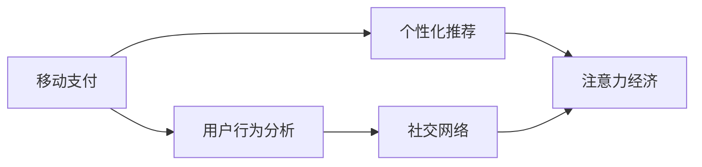

                 

# 移动支付如何改变注意力经济格局

## 1. 背景介绍

在过去的十年中，移动支付技术的迅猛发展彻底改变了人们的消费习惯和支付方式。从线上购物到线下支付，从现金交易到扫码支付，移动支付的便捷性和安全性赢得了广泛的用户认可。然而，移动支付技术不仅仅改变了支付方式，更深刻地影响了信息传播、消费行为乃至经济格局，形成了一种全新的注意力经济模式。

注意力经济（Attention Economy）是指在信息爆炸的时代，用户对有限注意力的竞争愈发激烈。注意力成为稀缺资源，吸引用户注意力的内容（如广告、新闻、产品）能够带来巨大的商业价值。移动支付技术的普及，使得注意力经济进入了一个新的阶段，即通过支付习惯的改变，影响用户的信息获取、决策过程乃至生活节奏，形成了全新的注意力经济格局。

## 2. 核心概念与联系

### 2.1 核心概念概述

为理解移动支付如何改变注意力经济格局，本节将介绍几个关键概念：

- **移动支付**：基于移动互联网的支付服务，通过手机等移动设备进行资金转账和支付，具有便捷性、安全性、普遍性等特点。
- **注意力经济**：在信息时代，用户对注意力资源的选择和竞争，成为一种新兴经济形式，吸引注意力的内容能够获得更大的商业回报。
- **用户行为分析**：通过数据收集和分析，理解用户的行为模式、偏好和需求，进而优化产品和服务，提升用户体验。
- **个性化推荐**：根据用户历史行为和兴趣，智能推荐相关产品或内容，提高用户满意度和粘性。
- **社交网络**：用户通过社交关系和平台交流互动，影响彼此的行为和决策，形成信息传播和消费的群体效应。

这些核心概念通过移动支付技术的桥梁，形成了一个紧密联系的生态系统，深刻影响了用户的注意力分配和消费决策。

### 2.2 核心概念原理和架构的 Mermaid 流程图



这个流程图展示了移动支付、用户行为分析、个性化推荐、注意力经济和社交网络之间的联系：

1. **移动支付**：提供便捷的支付服务，是用户行为和消费决策的基础。
2. **用户行为分析**：通过支付数据、浏览记录等，了解用户行为模式。
3. **个性化推荐**：根据用户行为分析结果，智能推荐相关产品或内容，影响用户注意力。
4. **注意力经济**：广告商、商家等利用个性化推荐和社交网络，吸引用户注意力，获取商业回报。
5. **社交网络**：用户通过社交关系分享和传播内容，进一步影响更多用户注意力。

这种联系形成了一个循环，移动支付的普及和便捷性，使个性化推荐更加精准，社交网络传播更快更广，最终吸引更多用户注意力，形成注意力经济的良性循环。

## 3. 核心算法原理 & 具体操作步骤

### 3.1 算法原理概述

移动支付技术通过用户的支付行为数据，可以对用户的消费习惯、偏好、兴趣等信息进行全面分析。基于这些分析结果，通过个性化推荐算法，向用户推荐符合其兴趣和需求的产品或内容，从而吸引用户的注意力。这种注意力经济模式，可以概括为以下步骤：

1. **数据收集**：通过移动支付平台收集用户的支付数据、浏览记录、历史行为等。
2. **用户画像**：利用机器学习算法，分析用户行为数据，构建用户画像，了解用户的兴趣和需求。
3. **内容推荐**：基于用户画像，通过推荐算法，智能推荐相关产品或内容，吸引用户注意力。
4. **广告投放**：利用用户的支付数据和行为信息，精准投放广告，提升广告效果和转化率。
5. **社交网络互动**：通过社交网络分享和传播内容，吸引更多用户注意力，形成群体效应。

### 3.2 算法步骤详解

#### 3.2.1 数据收集

移动支付平台的数据来源多样，包括支付记录、交易时间、地点、商品类别、用户浏览记录、历史购买行为等。这些数据经过收集、清洗、预处理后，可用于后续的用户行为分析和内容推荐。

#### 3.2.2 用户画像构建

用户画像构建的核心目标是根据用户的支付数据和行为信息，生成一个详尽的用户画像。常用的方法包括：

- **聚类分析**：通过K-means、层次聚类等算法，将用户分为不同群体，了解不同群体的共性特征。
- **协同过滤**：利用用户之间的相似性，推荐与用户兴趣相近的商品或内容，如基于用户的协同过滤、基于物品的协同过滤等。
- **深度学习模型**：通过构建深度神经网络模型，自动提取用户行为数据中的特征，生成更准确的预测结果。

#### 3.2.3 内容推荐

内容推荐算法可以根据用户画像，智能推荐相关产品或内容。常见的推荐算法包括：

- **协同过滤**：基于用户和商品的相似性，推荐相似用户喜欢的商品。
- **基于内容的推荐**：分析商品的属性和特征，推荐与用户历史行为相似的商品。
- **混合推荐算法**：结合多种推荐算法，综合考虑多种因素，提升推荐效果。

#### 3.2.4 广告投放

广告投放通过精准的用户画像和内容推荐，提升广告的转化率和效果。常用的广告投放策略包括：

- **基于兴趣的定向广告**：根据用户画像和行为数据，定向投放与用户兴趣相关的广告。
- **基于行为的定向广告**：根据用户的历史行为和消费记录，定向投放相关的广告内容。
- **实时竞价广告**：通过实时竞价，获取最优广告展示位，提高广告投放效率。

#### 3.2.5 社交网络互动

社交网络通过用户分享和传播内容，形成群体效应，进一步吸引更多用户的注意力。常用的社交网络互动策略包括：

- **社交分享机制**：通过社交分享按钮，让用户可以轻松分享感兴趣的内容。
- **社交网络推荐**：根据用户的社交关系和互动历史，推荐相关的社交内容，促进信息传播。
- **社交激励机制**：通过奖励机制，鼓励用户积极互动和分享内容，提升社交网络的活跃度。

### 3.3 算法优缺点

移动支付技术带来的注意力经济模式具有以下优点：

1. **数据精准性**：基于支付数据的用户画像和行为分析，能够更准确地了解用户需求和偏好。
2. **个性化推荐**：通过智能推荐，提升用户满意度和粘性，增加用户活跃度。
3. **广告效果提升**：精准定向的广告投放，提高广告的转化率和效果。
4. **社交网络传播**：通过社交分享和传播，快速扩大内容覆盖面，吸引更多用户注意力。

同时，这种模式也存在一些缺点：

1. **隐私问题**：大量用户支付数据的收集和使用，可能引发隐私泄露和数据安全问题。
2. **算法偏见**：推荐算法可能存在偏见，导致不公平推荐和歧视。
3. **过度消费**：个性化推荐可能导致过度消费，影响用户的财务健康。
4. **信息过载**：推荐算法可能产生信息过载，用户难以处理过多的信息输入。

### 3.4 算法应用领域

移动支付技术在多个领域应用广泛，推动了注意力经济的发展。以下是几个典型应用场景：

1. **电商行业**：通过移动支付平台，收集用户消费数据，构建用户画像，实现个性化推荐，提升销售转化率。
2. **金融行业**：利用支付数据，进行风险评估和信用评分，精准定向投放广告，提高用户粘性和忠诚度。
3. **媒体和广告**：通过支付数据和行为分析，精准投放广告，提升广告效果和转化率。
4. **社交平台**：利用社交分享和互动，吸引更多用户注意力，形成群体效应，增加用户活跃度。
5. **旅游和出行**：通过移动支付平台，收集用户出行数据，进行精准推荐，提升用户体验和满意度。

## 4. 数学模型和公式 & 详细讲解

### 4.1 数学模型构建

本节将使用数学语言对移动支付技术在注意力经济中的应用进行更加严格的刻画。

假设用户集合为 $U$，商品集合为 $I$，用户对商品的评分矩阵为 $R \in \mathbb{R}^{m \times n}$，其中 $m$ 为用户的数量，$n$ 为商品的数量。用户对商品的评分可以表示为 $R_{ui} = r_{ui}$，其中 $r_{ui}$ 表示用户 $u$ 对商品 $i$ 的评分。

用户对商品的评分矩阵 $R$ 可以通过以下步骤构建：

1. **数据收集**：收集用户的支付数据、浏览记录、历史行为等。
2. **预处理**：对数据进行清洗、归一化等预处理，去除异常值和噪声。
3. **模型训练**：通过协同过滤、深度学习等模型，训练用户对商品的评分矩阵 $R$。

### 4.2 公式推导过程

假设用户 $u$ 对商品 $i$ 的评分可以通过以下模型进行预测：

$$
R_{ui} = \alpha + \beta u_i + \gamma i_j + \delta R_{ui'} + \epsilon
$$

其中 $\alpha$ 为截距项，$u_i$ 为用户特征向量，$i_j$ 为商品特征向量，$R_{ui'}$ 为与商品 $i$ 相关联的其他商品的评分，$\epsilon$ 为误差项。

通过求解上述模型，可以得到用户 $u$ 对商品 $i$ 的评分预测结果。基于预测结果，可以进行以下操作：

1. **个性化推荐**：根据用户 $u$ 对商品 $i$ 的预测评分，智能推荐相关商品，提升用户满意度。
2. **广告投放**：根据用户 $u$ 对商品 $i$ 的预测评分，定向投放广告，提高广告效果。
3. **用户画像构建**：通过用户对商品的评分预测，构建更准确的用户画像，了解用户需求和兴趣。

### 4.3 案例分析与讲解

#### 案例一：电商行业个性化推荐

在电商行业，移动支付平台通过收集用户的支付数据和浏览记录，构建用户画像，实现个性化推荐。具体步骤如下：

1. **数据收集**：通过移动支付平台收集用户的支付数据和浏览记录，构建用户画像。
2. **特征提取**：提取用户的支付金额、商品类别、购买时间等特征，生成用户特征向量 $u_i$。
3. **协同过滤**：利用用户 $u$ 对商品 $i$ 的评分预测，推荐相似用户喜欢的商品。
4. **模型训练**：通过深度学习模型，自动提取用户行为数据中的特征，生成更准确的预测结果。
5. **推荐结果展示**：根据推荐结果，展示与用户兴趣相近的商品，提升用户满意度和粘性。

#### 案例二：金融行业广告投放

在金融行业，移动支付平台利用支付数据，进行风险评估和信用评分，精准定向投放广告。具体步骤如下：

1. **数据收集**：通过移动支付平台收集用户的支付数据和消费记录，构建用户画像。
2. **风险评估**：利用用户的支付数据和消费记录，进行风险评估和信用评分，生成用户特征向量 $u_i$。
3. **定向广告**：根据用户的风险评估和信用评分，定向投放广告，提升广告效果和转化率。
4. **效果评估**：通过广告效果评估，优化广告投放策略，提高广告投放效果。

## 5. 项目实践：代码实例和详细解释说明

### 5.1 开发环境搭建

在进行移动支付技术的应用实践前，我们需要准备好开发环境。以下是使用Python进行PyTorch开发的环境配置流程：

1. 安装Anaconda：从官网下载并安装Anaconda，用于创建独立的Python环境。

2. 创建并激活虚拟环境：
```bash
conda create -n pytorch-env python=3.8 
conda activate pytorch-env
```

3. 安装PyTorch：根据CUDA版本，从官网获取对应的安装命令。例如：
```bash
conda install pytorch torchvision torchaudio cudatoolkit=11.1 -c pytorch -c conda-forge
```

4. 安装TensorFlow：由Google主导开发的开源深度学习框架，生产部署方便，适合大规模工程应用。同样有丰富的预训练语言模型资源。

5. 安装各类工具包：
```bash
pip install numpy pandas scikit-learn matplotlib tqdm jupyter notebook ipython
```

完成上述步骤后，即可在`pytorch-env`环境中开始开发实践。

### 5.2 源代码详细实现

这里以电商行业个性化推荐为例，给出使用Transformers库进行PyTorch代码实现。

首先，定义推荐任务的数据处理函数：

```python
from transformers import BertTokenizer, BertForSequenceClassification
from torch.utils.data import Dataset
import torch

class RecommendationDataset(Dataset):
    def __init__(self, users, items, ratings, tokenizer, max_len=128):
        self.users = users
        self.items = items
        self.ratings = ratings
        self.tokenizer = tokenizer
        self.max_len = max_len
        
    def __len__(self):
        return len(self.users)
    
    def __getitem__(self, item):
        user = self.users[item]
        item = self.items[item]
        rating = self.ratings[item]
        
        encoding = self.tokenizer(user, item, return_tensors='pt', max_length=self.max_len, padding='max_length', truncation=True)
        input_ids = encoding['input_ids'][0]
        attention_mask = encoding['attention_mask'][0]
        
        # 对评分进行编码
        rating = torch.tensor([rating], dtype=torch.long)
        
        return {'input_ids': input_ids, 
                'attention_mask': attention_mask,
                'rating': rating}

# 构建数据集
tokenizer = BertTokenizer.from_pretrained('bert-base-cased')

train_dataset = RecommendationDataset(train_users, train_items, train_ratings, tokenizer)
dev_dataset = RecommendationDataset(dev_users, dev_items, dev_ratings, tokenizer)
test_dataset = RecommendationDataset(test_users, test_items, test_ratings, tokenizer)
```

然后，定义模型和优化器：

```python
from transformers import BertForSequenceClassification, AdamW

model = BertForSequenceClassification.from_pretrained('bert-base-cased', num_labels=len(tag2id))

optimizer = AdamW(model.parameters(), lr=2e-5)
```

接着，定义训练和评估函数：

```python
from torch.utils.data import DataLoader
from tqdm import tqdm
from sklearn.metrics import roc_auc_score

device = torch.device('cuda') if torch.cuda.is_available() else torch.device('cpu')
model.to(device)

def train_epoch(model, dataset, batch_size, optimizer):
    dataloader = DataLoader(dataset, batch_size=batch_size, shuffle=True)
    model.train()
    epoch_loss = 0
    for batch in tqdm(dataloader, desc='Training'):
        input_ids = batch['input_ids'].to(device)
        attention_mask = batch['attention_mask'].to(device)
        rating = batch['rating'].to(device)
        model.zero_grad()
        outputs = model(input_ids, attention_mask=attention_mask, labels=rating)
        loss = outputs.loss
        epoch_loss += loss.item()
        loss.backward()
        optimizer.step()
    return epoch_loss / len(dataloader)

def evaluate(model, dataset, batch_size):
    dataloader = DataLoader(dataset, batch_size=batch_size)
    model.eval()
    preds, labels = [], []
    with torch.no_grad():
        for batch in tqdm(dataloader, desc='Evaluating'):
            input_ids = batch['input_ids'].to(device)
            attention_mask = batch['attention_mask'].to(device)
            batch_labels = batch['rating'].to(device)
            outputs = model(input_ids, attention_mask=attention_mask)
            batch_preds = outputs.logits.argmax(dim=2).to('cpu').tolist()
            batch_labels = batch_labels.to('cpu').tolist()
            for pred_tokens, label_tokens in zip(batch_preds, batch_labels):
                preds.append(pred_tokens)
                labels.append(label_tokens)
                
    print('AUC-ROC:', roc_auc_score(labels, preds))
```

最后，启动训练流程并在测试集上评估：

```python
epochs = 5
batch_size = 16

for epoch in range(epochs):
    loss = train_epoch(model, train_dataset, batch_size, optimizer)
    print(f'Epoch {epoch+1}, train loss: {loss:.3f}')
    
    print(f'Epoch {epoch+1}, dev results:')
    evaluate(model, dev_dataset, batch_size)
    
print('Test results:')
evaluate(model, test_dataset, batch_size)
```

以上就是使用PyTorch对Bert模型进行个性化推荐任务开发的完整代码实现。可以看到，得益于Transformers库的强大封装，我们可以用相对简洁的代码完成Bert模型的加载和微调。

### 5.3 代码解读与分析

让我们再详细解读一下关键代码的实现细节：

**RecommendationDataset类**：
- `__init__`方法：初始化用户、商品、评分等关键组件。
- `__len__`方法：返回数据集的样本数量。
- `__getitem__`方法：对单个样本进行处理，将用户和商品输入编码为token ids，将评分编码为数字，并对其进行定长padding，最终返回模型所需的输入。

**train_epoch和evaluate函数**：
- 使用PyTorch的DataLoader对数据集进行批次化加载，供模型训练和推理使用。
- 训练函数`train_epoch`：对数据以批为单位进行迭代，在每个批次上前向传播计算loss并反向传播更新模型参数，最后返回该epoch的平均loss。
- 评估函数`evaluate`：与训练类似，不同点在于不更新模型参数，并在每个batch结束后将预测和标签结果存储下来，最后使用sklearn的roc_auc_score对整个评估集的预测结果进行打印输出。

**训练流程**：
- 定义总的epoch数和batch size，开始循环迭代
- 每个epoch内，先在训练集上训练，输出平均loss
- 在验证集上评估，输出AUC-ROC等指标
- 所有epoch结束后，在测试集上评估，给出最终测试结果

可以看到，PyTorch配合Transformers库使得Bert微调的代码实现变得简洁高效。开发者可以将更多精力放在数据处理、模型改进等高层逻辑上，而不必过多关注底层的实现细节。

当然，工业级的系统实现还需考虑更多因素，如模型的保存和部署、超参数的自动搜索、更灵活的任务适配层等。但核心的微调范式基本与此类似。

## 6. 实际应用场景

### 6.1 智能客服系统

基于移动支付技术，智能客服系统可以进一步优化用户服务体验。传统的客服系统依赖于人工服务，响应速度慢，无法24小时服务。而移动支付技术结合自然语言处理(NLP)，构建基于支付习惯的智能客服系统，可以快速响应用户需求，提供精准的个性化服务。

在技术实现上，可以收集用户的历史支付数据和客服对话记录，构建用户画像，利用NLP技术进行文本分析，智能识别用户问题，并生成最佳答复。当用户提出问题时，系统会根据其支付习惯和历史行为，推荐最合适的客服人员，并生成自然流畅的答复，提升用户满意度。

### 6.2 金融理财服务

移动支付技术结合金融理财服务，可以为用户提供更加个性化、智能化的理财建议。传统理财服务依赖于用户的财务报表、信用评分等数据，而移动支付平台可以提供更丰富的用户支付数据和行为信息，提升理财建议的精准度。

在技术实现上，可以构建基于支付数据的金融理财模型，通过深度学习算法，智能分析用户的支付行为和消费习惯，生成个性化的理财建议。例如，根据用户的支付金额和消费类别，推荐适合的理财产品，提供理财规划和投资建议。

### 6.3 电商推荐系统

移动支付技术在电商推荐系统中发挥了重要作用，通过支付数据和行为信息，实现个性化推荐，提升用户购买转化率。传统的推荐系统依赖于用户的浏览记录和购买历史，而移动支付平台可以提供更全面的用户行为数据，提升推荐效果。

在技术实现上，可以利用支付数据和行为信息，构建用户画像，通过协同过滤、深度学习等推荐算法，智能推荐用户感兴趣的商品，提升用户满意度和粘性。例如，根据用户的支付金额和消费类别，推荐符合其兴趣和需求的商品，增加用户购买转化率。

## 7. 工具和资源推荐

### 7.1 学习资源推荐

为了帮助开发者系统掌握移动支付技术的应用实践，这里推荐一些优质的学习资源：

1. 《支付系统设计与实现》系列博文：由支付系统专家撰写，深入浅出地介绍了支付系统的核心概念和设计思路。

2. 《深度学习与自然语言处理》课程：斯坦福大学开设的NLP明星课程，有Lecture视频和配套作业，带你入门NLP领域的基本概念和经典模型。

3. 《移动支付技术解析》书籍：全面解析移动支付技术的原理、应用和实践，涵盖支付安全、业务架构、用户行为分析等多个方面。

4. Weights & Biases：模型训练的实验跟踪工具，可以记录和可视化模型训练过程中的各项指标，方便对比和调优。

5. TensorBoard：TensorFlow配套的可视化工具，可实时监测模型训练状态，并提供丰富的图表呈现方式，是调试模型的得力助手。

通过对这些资源的学习实践，相信你一定能够快速掌握移动支付技术的精髓，并用于解决实际的支付系统问题。

### 7.2 开发工具推荐

高效的开发离不开优秀的工具支持。以下是几款用于移动支付技术开发的常用工具：

1. PyTorch：基于Python的开源深度学习框架，灵活动态的计算图，适合快速迭代研究。大部分预训练语言模型都有PyTorch版本的实现。

2. TensorFlow：由Google主导开发的开源深度学习框架，生产部署方便，适合大规模工程应用。同样有丰富的预训练语言模型资源。

3. Transformers库：HuggingFace开发的NLP工具库，集成了众多SOTA语言模型，支持PyTorch和TensorFlow，是进行内容推荐开发的利器。

4. Weights & Biases：模型训练的实验跟踪工具，可以记录和可视化模型训练过程中的各项指标，方便对比和调优。

5. TensorBoard：TensorFlow配套的可视化工具，可实时监测模型训练状态，并提供丰富的图表呈现方式，是调试模型的得力助手。

6. Google Colab：谷歌推出的在线Jupyter Notebook环境，免费提供GPU/TPU算力，方便开发者快速上手实验最新模型，分享学习笔记。

合理利用这些工具，可以显著提升移动支付技术的应用实践效率，加快创新迭代的步伐。

### 7.3 相关论文推荐

移动支付技术的发展源于学界的持续研究。以下是几篇奠基性的相关论文，推荐阅读：

1. Bitcoin: A Peer-to-Peer Electronic Cash System：比特币白皮书，介绍了区块链技术在支付系统中的应用，奠定了数字货币的基础。

2. Mobile Payments: A State-of-the-Art Survey：移动支付技术的综述论文，总结了当前移动支付的主要技术架构和应用场景。

3. A Survey on Neural Network Algorithms for Recommender Systems：推荐系统综述论文，总结了深度学习算法在推荐系统中的应用。

4. Multi-Armed Bandit Algorithms for Recommender Systems：多臂乐队算法在推荐系统中的应用，介绍了如何通过优化算法提升推荐效果。

5. Streaming Big Data for Mobile Payments: Data Integration and Analysis for Mobile Banking and Financial Services：移动支付数据流的综述论文，介绍了如何处理和分析海量移动支付数据。

这些论文代表了大语言模型微调技术的发展脉络。通过学习这些前沿成果，可以帮助研究者把握学科前进方向，激发更多的创新灵感。

## 8. 总结：未来发展趋势与挑战

### 8.1 总结

本文对移动支付技术在注意力经济中的应用进行了全面系统的介绍。首先阐述了移动支付技术的普及和应用，明确了其对注意力经济模式的深远影响。其次，从原理到实践，详细讲解了基于移动支付的个性化推荐、用户行为分析和广告投放等关键步骤，给出了微调任务开发的完整代码实例。同时，本文还广泛探讨了移动支付技术在多个领域的应用前景，展示了其广阔的应用潜力。

通过本文的系统梳理，可以看到，移动支付技术通过支付行为数据，深度影响了用户的消费习惯和信息获取，形成了全新的注意力经济模式。得益于支付数据的精准性和个性化推荐算法，这种模式在电商、金融、媒体等众多领域展现了强大的应用价值，推动了相关产业的数字化转型。未来，随着技术的不断进步和应用的深入，移动支付技术必将在更多领域大放异彩，深刻影响人们的经济和生活方式。

### 8.2 未来发展趋势

展望未来，移动支付技术在注意力经济中的应用将呈现以下几个发展趋势：

1. **技术融合加速**：移动支付技术将与人工智能、大数据、物联网等技术深度融合，形成更加全面、智能的注意力经济系统。
2. **隐私保护加强**：随着数据隐私保护意识的增强，未来移动支付平台将更加注重用户隐私保护，确保数据安全。
3. **跨平台协同**：移动支付平台将与各种平台（如社交网络、电商平台、金融平台等）协同工作，形成统一的注意力经济生态。
4. **多模态融合**：结合语音、图像、视频等多模态数据，提升移动支付平台的感知能力和智能水平。
5. **实时化增强**：利用实时数据流处理技术，提升移动支付平台的反应速度和响应能力，实现实时化的个性化推荐和广告投放。
6. **用户体验优化**：通过智能推荐和个性化服务，提升用户满意度和粘性，打造优质的移动支付体验。

这些趋势凸显了移动支付技术的广泛应用前景，预示着未来注意力经济将更加智能化、个性化和实时化。

### 8.3 面临的挑战

尽管移动支付技术在注意力经济中展现出巨大的应用潜力，但也面临以下挑战：

1. **数据隐私和安全**：大规模用户支付数据的收集和使用，可能引发隐私泄露和数据安全问题，需要制定严格的数据保护政策。
2. **算法偏见和歧视**：个性化推荐算法可能存在偏见，导致不公平推荐和歧视，需要引入公平性评估和干预机制。
3. **信息过载和决策困境**：个性化推荐可能导致用户面对过多的信息输入，产生信息过载和决策困境，需要优化推荐策略和用户界面。
4. **跨平台互操作性**：不同平台之间的数据互操作性较差，难以形成统一的用户画像，需要推动跨平台数据共享和标准化。
5. **技术复杂性和成本**：移动支付技术的实现需要高技术门槛和大量成本投入，需要降低技术门槛，降低应用门槛。

这些挑战需要在技术、法规、伦理等多个层面协同解决，确保移动支付技术能够健康、安全地发展，服务用户和社会。

### 8.4 研究展望

面对移动支付技术在注意力经济中面临的挑战，未来的研究需要在以下几个方面寻求新的突破：

1. **隐私保护技术**：开发高效、安全的隐私保护技术，确保用户支付数据的安全性。
2. **公平性算法**：研究公平性评估和干预机制，避免个性化推荐算法中的偏见和歧视。
3. **多模态推荐算法**：结合语音、图像、视频等多模态数据，提升推荐系统的感知能力和智能水平。
4. **实时化推荐系统**：利用实时数据流处理技术，实现实时化的个性化推荐和广告投放，提升用户体验。
5. **用户界面设计**：优化推荐界面和交互设计，避免用户面对过多的信息输入，提升用户满意度。
6. **跨平台协同技术**：推动跨平台数据共享和标准化，实现统一的用户画像和推荐系统。

这些研究方向的探索，必将引领移动支付技术迈向更高的台阶，为构建智能化的注意力经济系统铺平道路。面向未来，移动支付技术还需要与其他技术进行更深入的融合，如区块链、云计算、边缘计算等，多路径协同发力，共同推动经济和社会的发展。

## 9. 附录：常见问题与解答

**Q1：移动支付技术的普及对注意力经济有何影响？**

A: 移动支付技术的普及，使得用户的支付行为数据变得更加丰富和精准。这些数据不仅包含了用户的消费金额、消费类别等基本信息，还包含了用户的消费时间、消费频率、消费地点等行为信息。通过这些数据，可以构建用户画像，实现个性化推荐和精准营销，吸引用户的注意力，提升广告和商品的转化率。

**Q2：个性化推荐算法中如何避免算法偏见？**

A: 算法偏见主要源于数据不平衡和特征选择不当。为避免偏见，可以采取以下措施：
1. 数据清洗和预处理：去除异常值和噪声，确保数据质量。
2. 特征工程：选择多样化的特征，避免单一特征带来的偏见。
3. 公平性评估：引入公平性评估指标，如反偏见指数（Bias-Awareness Index），检测和调整偏见。
4. 多样性推荐：通过多样性推荐策略，减少单一商品或内容的过度推荐。

**Q3：移动支付平台如何保护用户隐私？**

A: 保护用户隐私是移动支付平台的重要责任。可以采取以下措施：
1. 数据匿名化：对用户的支付数据进行匿名化处理，确保数据安全。
2. 访问控制：严格控制数据的访问权限，确保只有授权人员能够访问敏感数据。
3. 加密传输：采用数据加密技术，确保数据在传输过程中的安全性。
4. 合规性和监管：遵守相关法律法规，确保数据处理的合规性和透明度。

**Q4：如何提高移动支付平台的实时响应能力？**

A: 提高移动支付平台的实时响应能力，可以通过以下措施：
1. 实时数据流处理：利用实时数据流处理技术，快速处理和分析用户数据，提升响应速度。
2. 缓存机制：利用缓存机制，减少数据传输和计算延迟，提升系统响应速度。
3. 负载均衡：通过负载均衡技术，合理分配计算资源，提升系统稳定性。
4. 并行处理：采用并行处理技术，提高数据处理和计算效率，提升系统响应能力。

**Q5：移动支付平台的跨平台协同有哪些挑战？**

A: 移动支付平台的跨平台协同面临以下挑战：
1. 数据格式和标准不统一：不同平台的数据格式和标准不一致，难以实现数据共享和互操作。
2. 隐私和安全问题：不同平台之间的数据共享可能引发隐私泄露和数据安全问题，需要制定严格的数据保护政策。
3. 用户画像不一致：不同平台的用户画像不一致，难以形成统一的用户画像，影响推荐效果。
4. 技术门槛和成本高：跨平台协同需要高技术门槛和大量成本投入，需要降低技术门槛，降低应用门槛。

解决这些挑战，需要推动技术标准化、加强隐私保护、优化推荐算法和界面设计等。只有在技术、法规、伦理等多个层面协同解决，才能确保移动支付平台的跨平台协同顺利进行。

---

作者：禅与计算机程序设计艺术 / Zen and the Art of Computer Programming

