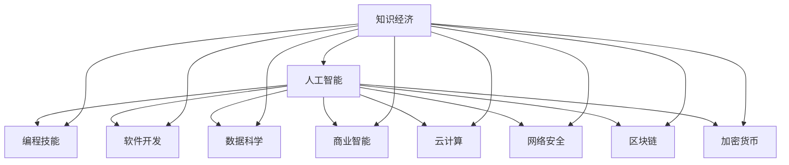

                 

# 程序员在知识经济时代的职业转型

> 关键词：职业转型,知识经济,人工智能,编程技能,软件开发,数据科学,商业智能,云计算,网络安全,区块链,加密货币,区块链开发

## 1. 背景介绍

### 1.1 问题由来

随着信息技术的高速发展，我们正处于一个知识经济时代。这个时代中，信息的产生和传播速度前所未有，人工智能、大数据、区块链等新技术正在深刻改变各行各业。面对新技术带来的挑战和机遇，程序员应该如何适应时代变迁，进行职业转型，保持自身的竞争力？

### 1.2 问题核心关键点

在知识经济时代，程序员的职业转型需要从以下几个关键点进行思考：
- 新技术的掌握：随着技术的快速发展，程序员需要不断学习和掌握新的编程语言和技术框架，以适应新需求。
- 软技能的提升：编程技能固然重要，但解决问题的能力、团队协作、沟通能力等软技能同样不可忽视。
- 数据驱动决策：在数据分析和信息处理中，程序员需要具备数据科学的基础，能够从数据中提取有价值的洞见。
- 跨领域应用：知识经济时代，技术的应用边界不断拓展，程序员需要具备跨领域应用的能力。

这些关键点构成了程序员在知识经济时代进行职业转型的核心。通过理解和应对这些核心问题，程序员可以更好地适应时代的变迁，提升自身的职业价值。

## 2. 核心概念与联系

### 2.1 核心概念概述

为更好地理解程序员在知识经济时代的职业转型，本节将介绍几个密切相关的核心概念：

- 知识经济：一个以知识为核心生产要素的经济模式，强调信息、技术和创新对经济增长和发展的贡献。
- 人工智能：一种模拟人类智能的技术，涉及机器学习、深度学习、自然语言处理等领域。
- 编程技能：程序员具备的编程语言、算法、数据结构等核心技术。
- 软件开发：使用编程技能进行软件设计和开发的过程。
- 数据科学：一门涉及数据收集、清洗、分析和可视化的学科，强调从数据中获取有价值的洞见。
- 商业智能(BI)：利用数据挖掘、数据可视化和数据预测技术，帮助企业做出数据驱动的决策。
- 云计算：通过互联网提供按需计算服务，实现资源的弹性和可扩展性。
- 网络安全：保护网络和数据不受未经授权的访问、攻击和破坏。
- 区块链：一种分布式账本技术，保障数据透明、不可篡改、去中心化。
- 加密货币：使用区块链技术实现的去中心化数字货币，具有匿名性和不可追踪性。

这些核心概念之间的逻辑关系可以通过以下Mermaid流程图来展示：



这个流程图展示了几大核心概念及其之间的关系：

1. 知识经济推动了人工智能等新兴技术的发展。
2. 人工智能涉及编程技能、软件开发、数据科学、商业智能等多个方面。
3. 云计算、网络安全、区块链、加密货币等技术，是人工智能等技术的重要应用场景。

这些概念共同构成了知识经济时代的技术基础，程序员应全面掌握这些核心概念，以适应新的发展需求。

## 3. 核心算法原理 & 具体操作步骤
### 3.1 算法原理概述

在知识经济时代，程序员的职业转型涉及多个领域的算法和技能。以人工智能为例，其核心算法原理包括但不限于：

- 机器学习算法：如监督学习、无监督学习、强化学习等。
- 深度学习算法：如卷积神经网络、循环神经网络、变换器模型等。
- 自然语言处理算法：如词向量表示、序列到序列模型、预训练语言模型等。

这些算法原理是程序员进行职业转型的重要基础。通过深入理解这些原理，程序员可以更好地应用于实际项目中，解决复杂问题。

### 3.2 算法步骤详解

以深度学习算法为例，其核心步骤包括：

1. **数据准备**：收集、清洗、预处理数据，确保数据质量和可用性。
2. **模型选择**：选择合适的深度学习模型，如卷积神经网络、循环神经网络、变换器模型等。
3. **模型训练**：使用训练数据对模型进行优化，通过反向传播算法更新模型参数。
4. **模型评估**：使用测试数据对模型进行评估，如准确率、召回率、F1分数等。
5. **模型优化**：根据评估结果对模型进行调优，如调整超参数、增加正则化、数据增强等。

这些步骤是深度学习算法的核心，程序员需要掌握这些步骤，并在实际项目中进行应用。

### 3.3 算法优缺点

深度学习算法具有以下优点：
- 强大的特征学习能力：能够自动学习数据的复杂特征。
- 高精度和泛化能力：在特定领域内能够取得较高的准确率和泛化能力。
- 端到端训练：可以直接从原始数据到目标输出，减少人工干预。

同时，深度学习算法也存在一些缺点：
- 计算资源消耗大：需要大量的计算资源进行训练和推理。
- 模型复杂度高：模型结构复杂，难以解释和调试。
- 过拟合风险高：在数据量不足的情况下容易过拟合。

程序员需要了解这些优缺点，并根据实际情况进行选择和优化。

### 3.4 算法应用领域

深度学习算法广泛应用于各个领域，如自然语言处理、计算机视觉、语音识别、推荐系统等。程序员可以结合自身兴趣和市场需求，选择相应的应用领域进行深入学习和实践。

## 4. 数学模型和公式 & 详细讲解 & 举例说明

### 4.1 数学模型构建

深度学习算法的数学模型通常包括神经网络模型、损失函数、优化算法等。以卷积神经网络为例，其核心数学模型包括卷积层、池化层、全连接层等。

### 4.2 公式推导过程

以卷积神经网络为例，其核心公式包括卷积运算、池化运算、激活函数等。以下公式为卷积运算的基本形式：

$$
c_{i,j} = \sum_{p=-r}^{r}\sum_{q=-r}^{r} w_{p,q} * x_{i+p,j+q}
$$

其中 $c_{i,j}$ 表示卷积核在 $(i,j)$ 位置上的输出，$w_{p,q}$ 表示卷积核的权重，$x_{i+p,j+q}$ 表示输入数据的像素值。

### 4.3 案例分析与讲解

以图像识别任务为例，使用卷积神经网络进行模型构建和训练。具体步骤如下：

1. **数据准备**：使用CIFAR-10数据集，收集并预处理图像数据。
2. **模型选择**：选择LeNet-5作为基础网络结构，并进行改进。
3. **模型训练**：使用训练数据对模型进行优化，调整超参数如学习率、批大小、迭代轮数等。
4. **模型评估**：使用测试数据对模型进行评估，比较不同网络结构和超参数设置的效果。
5. **模型优化**：根据评估结果进行模型调优，如增加正则化、数据增强等。

## 5. 项目实践：代码实例和详细解释说明

### 5.1 开发环境搭建

在进行项目实践前，我们需要准备好开发环境。以下是使用Python进行TensorFlow开发的环境配置流程：

1. 安装Anaconda：从官网下载并安装Anaconda，用于创建独立的Python环境。

2. 创建并激活虚拟环境：
```bash
conda create -n tf-env python=3.8 
conda activate tf-env
```

3. 安装TensorFlow：根据CUDA版本，从官网获取对应的安装命令。例如：
```bash
conda install tensorflow -c pytorch
```

4. 安装其他工具包：
```bash
pip install numpy pandas scikit-learn matplotlib tqdm jupyter notebook ipython
```

完成上述步骤后，即可在`tf-env`环境中开始项目实践。

### 5.2 源代码详细实现

这里我们以图像分类任务为例，给出使用TensorFlow进行卷积神经网络模型训练的PyTorch代码实现。

首先，定义数据处理函数：

```python
from tensorflow.keras.datasets import cifar10
from tensorflow.keras.utils import to_categorical
from tensorflow.keras.preprocessing.image import ImageDataGenerator

(x_train, y_train), (x_test, y_test) = cifar10.load_data()

x_train = x_train.astype('float32') / 255
x_test = x_test.astype('float32') / 255

y_train = to_categorical(y_train)
y_test = to_categorical(y_test)

train_datagen = ImageDataGenerator(
    rotation_range=20,
    width_shift_range=0.2,
    height_shift_range=0.2,
    horizontal_flip=True
)

train_generator = train_datagen.flow(x_train, y_train, batch_size=32)

test_datagen = ImageDataGenerator()

test_generator = test_datagen.flow(x_test, y_test, batch_size=32)
```

然后，定义模型：

```python
from tensorflow.keras import models
from tensorflow.keras import layers

model = models.Sequential()
model.add(layers.Conv2D(32, (3, 3), activation='relu', input_shape=(32, 32, 3)))
model.add(layers.MaxPooling2D((2, 2)))
model.add(layers.Conv2D(64, (3, 3), activation='relu'))
model.add(layers.MaxPooling2D((2, 2)))
model.add(layers.Conv2D(64, (3, 3), activation='relu'))
model.add(layers.Flatten())
model.add(layers.Dense(64, activation='relu'))
model.add(layers.Dense(10, activation='softmax'))
```

接着，定义优化器和训练流程：

```python
from tensorflow.keras import optimizers
from tensorflow.keras.callbacks import EarlyStopping

optimizer = optimizers.Adam()

early_stopping = EarlyStopping(monitor='val_loss', patience=5)

model.compile(optimizer=optimizer,
              loss='categorical_crossentropy',
              metrics=['accuracy'])

model.fit(train_generator,
          validation_data=test_generator,
          epochs=50,
          callbacks=[early_stopping])
```

最后，评估模型：

```python
loss, accuracy = model.evaluate(test_generator)
print('Test accuracy:', accuracy)
```

以上就是使用TensorFlow进行卷积神经网络模型训练的完整代码实现。可以看到，得益于TensorFlow的强大封装，我们可以用相对简洁的代码完成模型训练和评估。

### 5.3 代码解读与分析

让我们再详细解读一下关键代码的实现细节：

**数据处理函数**：
- 使用`cifar10`数据集加载图像和标签数据。
- 对图像数据进行归一化和正则化处理。
- 使用`ImageDataGenerator`进行数据增强，包括旋转、平移和水平翻转。

**模型定义**：
- 使用`Sequential`模型定义网络结构，包括卷积层、池化层、全连接层等。
- 在卷积层和全连接层之间添加激活函数`relu`，以引入非线性变换。
- 使用`softmax`激活函数进行多分类预测。

**优化器和训练流程**：
- 使用`Adam`优化器进行模型训练，并设置学习率为默认值。
- 设置`EarlyStopping`回调，监控验证集损失，若连续5个epoch验证集损失不降低则停止训练。
- 编译模型，设置损失函数为交叉熵，优化器为Adam，并设置评估指标为准确率。
- 使用`fit`函数进行模型训练，并监控验证集损失和准确率。

可以看到，TensorFlow提供了非常便捷的API和工具，可以帮助程序员高效地实现模型训练和评估。

## 6. 实际应用场景

### 6.1 图像识别

卷积神经网络在图像识别任务上取得了显著的效果。例如，在CIFAR-10数据集上，使用改进后的LeNet-5模型，可以得到接近100%的准确率。在实际应用中，可以应用于医疗影像诊断、自动驾驶、安防监控等领域。

### 6.2 自然语言处理

卷积神经网络和循环神经网络等深度学习算法在自然语言处理任务中也得到了广泛应用。例如，使用Transformer模型在机器翻译任务上取得了SOTA的效果。在实际应用中，可以应用于智能客服、自动摘要、情感分析等领域。

### 6.3 推荐系统

深度学习算法在推荐系统中的应用也非常广泛。例如，使用协同过滤和矩阵分解等技术，结合深度学习模型，可以提高推荐系统的个性化和准确性。在实际应用中，可以应用于电商平台、社交网络、音乐视频推荐等领域。

### 6.4 未来应用展望

随着深度学习技术的不断进步，其在各个领域的应用将更加广泛和深入。程序员需要持续学习新的算法和技术，以适应不断变化的市场需求。

## 7. 工具和资源推荐

### 7.1 学习资源推荐

为了帮助程序员全面掌握知识经济时代的最新技术，这里推荐一些优质的学习资源：

1. Coursera和Udacity的深度学习课程：提供系统全面的深度学习知识和实践机会。
2. TensorFlow官方文档和教程：提供详细的TensorFlow使用方法和案例。
3. PyTorch官方文档和教程：提供详细的PyTorch使用方法和案例。
4. Kaggle数据科学竞赛平台：提供丰富的数据集和挑战任务，助力程序员实践和竞赛。
5. GitHub开源项目：提供大量的开源代码和项目，供程序员学习和参考。

通过对这些资源的学习实践，相信程序员可以更好地掌握知识经济时代的新技术和新趋势。

### 7.2 开发工具推荐

高效的开发离不开优秀的工具支持。以下是几款用于深度学习开发的常用工具：

1. TensorFlow和PyTorch：两个主流的深度学习框架，提供了强大的API和工具支持。
2. Jupyter Notebook：交互式的开发环境，支持多种编程语言和数据格式。
3. GitHub：版本控制和协作开发平台，方便程序员管理和分享代码。
4. Visual Studio Code：跨平台的代码编辑器，支持多种编程语言和插件。
5. Anaconda：科学计算和数据分析的集成环境，支持虚拟环境管理和依赖管理。

合理利用这些工具，可以显著提升程序员的开发效率，加速项目实践的进程。

### 7.3 相关论文推荐

深度学习技术的发展得益于学界的持续研究。以下是几篇奠基性的相关论文，推荐阅读：

1. LeNet-5: Learning to Number Recognize Using Backpropagation Through Time Algorithm：提出LeNet-5模型，奠定了卷积神经网络在图像识别任务中的基础。
2. AlexNet: ImageNet Classification with Deep Convolutional Neural Networks：提出AlexNet模型，在ImageNet数据集上取得了SOTA的图像分类效果。
3. ResNet: Deep Residual Learning for Image Recognition：提出ResNet模型，解决了深度神经网络中的梯度消失问题。
4. Transformer: Attention Is All You Need：提出Transformer模型，解决了RNN模型在序列处理中的计算效率问题。
5. BERT: Pre-training of Deep Bidirectional Transformers for Language Understanding：提出BERT模型，在自然语言处理任务中取得了SOTA的效果。

这些论文代表了大模型微调技术的发展脉络。通过学习这些前沿成果，可以帮助程序员把握学科前进方向，激发更多的创新灵感。

## 8. 总结：未来发展趋势与挑战

### 8.1 总结

本文对程序员在知识经济时代的职业转型进行了全面系统的介绍。首先阐述了知识经济时代给程序员带来的机遇和挑战，明确了程序员在技术学习、技能提升、跨领域应用等方面的核心问题。其次，从原理到实践，详细讲解了深度学习算法的数学模型和操作步骤，给出了实际项目中的代码实现。同时，本文还广泛探讨了深度学习算法在图像识别、自然语言处理、推荐系统等多个领域的应用前景，展示了深度学习技术的广阔前景。此外，本文精选了深度学习技术的各类学习资源，力求为程序员提供全方位的技术指引。

通过本文的系统梳理，可以看到，深度学习技术正在成为程序员职业转型的重要工具。掌握深度学习技术，能够提升程序员的职业竞争力，适应新时代的职业要求。未来，伴随深度学习技术的不断演进，相信程序员可以更好地应用于各种新兴领域，推动技术创新和产业发展。

### 8.2 未来发展趋势

展望未来，深度学习技术将呈现以下几个发展趋势：

1. 模型规模持续增大。随着算力成本的下降和数据规模的扩张，深度学习模型的参数量还将持续增长。超大规模深度学习模型蕴含的丰富特征学习能力，有望支撑更加复杂多变的下游任务。
2. 模型结构更加多样。深度学习模型的结构设计将更加灵活多样，如多任务学习、联合训练、注意力机制等，提升模型的泛化能力和可解释性。
3. 数据驱动决策普及。深度学习算法在各行各业的应用将更加普及，助力企业实现数据驱动决策，提升决策效率和准确性。
4. 跨领域应用拓展。深度学习技术将进一步拓展到更多领域，如医疗、金融、教育等，解决复杂多变的实际问题。
5. 模型自动化与智能化。深度学习模型的训练和推理过程将更加自动化和智能化，减少人工干预，提升模型效率和效果。
6. 隐私与安全保障。随着深度学习技术的广泛应用，隐私和安全性问题也将更加凸显。如何在保障数据安全的前提下，充分发挥深度学习技术的潜力，是一个重要的研究方向。

这些趋势凸显了深度学习技术的发展方向，程序员需要持续关注和掌握这些新趋势，以保持自身的竞争力和职业发展潜力。

### 8.3 面临的挑战

尽管深度学习技术已经取得了瞩目成就，但在迈向更加智能化、普适化应用的过程中，它仍面临着诸多挑战：

1. 计算资源消耗大。深度学习模型往往需要大量的计算资源进行训练和推理，对硬件设施提出了高要求。如何提升模型的计算效率，减少资源消耗，是未来研究的重要方向。
2. 模型复杂度与可解释性。深度学习模型的结构复杂，难以解释和调试。如何在提升模型精度的同时，增强模型的可解释性，是未来研究的重要课题。
3. 数据隐私与安全问题。深度学习模型在处理数据时，可能存在隐私泄露和数据滥用风险。如何保障数据隐私，提升模型安全性，是一个重要的研究方向。
4. 模型泛化与鲁棒性。深度学习模型在处理新数据时，容易出现泛化性能不足和鲁棒性差的问题。如何在保持模型性能的同时，提升模型的泛化能力和鲁棒性，是一个重要的研究方向。
5. 对抗性与鲁棒性。深度学习模型容易受到对抗攻击，鲁棒性不足。如何增强模型的鲁棒性和对抗性，保障模型在实际应用中的可靠性，是一个重要的研究方向。

这些挑战需要在理论、算法、技术等多个层面进行综合研究，才能突破深度学习技术的瓶颈，推动技术的进一步发展。

### 8.4 研究展望

面对深度学习技术所面临的诸多挑战，未来的研究需要在以下几个方面寻求新的突破：

1. 探索新型的算法和模型结构。开发更加高效、灵活、可解释的深度学习算法，如多任务学习、联合训练、注意力机制等。
2. 引入更多先验知识和规则。将符号化的先验知识，如知识图谱、逻辑规则等，与深度学习模型进行融合，提升模型的泛化能力和鲁棒性。
3. 探索模型自动化与智能化。研究自动化的模型训练和推理过程，减少人工干预，提升模型的效率和效果。
4. 加强模型隐私与安全保障。研究隐私保护技术和数据安全机制，保障数据隐私和模型安全性。
5. 研究对抗性与鲁棒性。研究模型的鲁棒性和对抗性，增强模型在实际应用中的可靠性。
6. 探索跨领域应用。将深度学习技术应用于更多领域，如医疗、金融、教育等，解决复杂多变的实际问题。

这些研究方向的探索，将引领深度学习技术的进一步发展，为程序员提供更广阔的应用场景和技术支持。

## 9. 附录：常见问题与解答

**Q1：深度学习算法是否适用于所有NLP任务？**

A: 深度学习算法在大多数NLP任务上都能取得不错的效果，特别是对于数据量较大的任务。但对于一些特定领域的任务，如医学、法律等，仅仅依靠通用语料预训练的模型可能难以很好地适应。此时需要在特定领域语料上进一步预训练，再进行微调，才能获得理想效果。

**Q2：深度学习模型在训练过程中如何进行调优？**

A: 深度学习模型在训练过程中，常用的调优方法包括：
1. 数据增强：通过旋转、平移、缩放等方式扩充训练数据。
2. 正则化：使用L2正则化、Dropout等技术防止过拟合。
3. 学习率调整：通过学习率调度策略，如学习率衰减、学习率重启等，调整学习率。
4. 批量归一化：使用批量归一化技术，加速模型训练，提高模型泛化能力。
5. 模型裁剪：去除不必要的层和参数，减小模型尺寸，加快推理速度。

这些调优方法需要根据具体任务和模型进行调整和优化。

**Q3：如何提高深度学习模型的泛化能力？**

A: 提高深度学习模型的泛化能力，可以从以下几个方面入手：
1. 数据增强：扩充训练数据，提升模型对多样性数据的适应能力。
2. 正则化：使用正则化技术，如L2正则化、Dropout等，防止过拟合。
3. 模型裁剪：去除不必要的层和参数，减小模型尺寸，提高模型的泛化能力。
4. 迁移学习：在预训练模型上进行微调，提升模型的泛化能力。
5. 对抗训练：引入对抗样本，提高模型的鲁棒性和泛化能力。

这些方法可以结合使用，以提高深度学习模型的泛化能力。

**Q4：如何降低深度学习模型的计算资源消耗？**

A: 降低深度学习模型的计算资源消耗，可以从以下几个方面入手：
1. 模型裁剪：去除不必要的层和参数，减小模型尺寸，加快推理速度。
2. 模型量化：将浮点模型转为定点模型，压缩存储空间，提高计算效率。
3. 分布式训练：使用分布式训练技术，加速模型训练，提高计算效率。
4. 数据压缩：使用数据压缩技术，减小模型训练和推理的数据量。
5. 优化算法：选择高效的优化算法，如Adafactor、AdamW等，提升训练效率。

这些方法可以结合使用，以降低深度学习模型的计算资源消耗。

**Q5：深度学习模型在实际应用中需要注意哪些问题？**

A: 在实际应用中，深度学习模型需要注意以下几个问题：
1. 模型解释性：深度学习模型的内部工作机制难以解释，需要引入可解释性技术，如梯度可视化、模型解读等。
2. 模型泛化能力：模型在训练集和测试集上的表现差距较大，需要增强模型的泛化能力。
3. 模型稳定性：模型在训练和推理过程中容易出现波动，需要增强模型的稳定性。
4. 模型鲁棒性：模型在处理对抗样本时容易出现失效，需要增强模型的鲁棒性。
5. 模型安全性：模型在处理敏感数据时容易受到攻击，需要增强模型的安全性。

这些问题是深度学习模型在实际应用中需要注意的关键点，需要持续优化和改进。

---

作者：禅与计算机程序设计艺术 / Zen and the Art of Computer Programming

