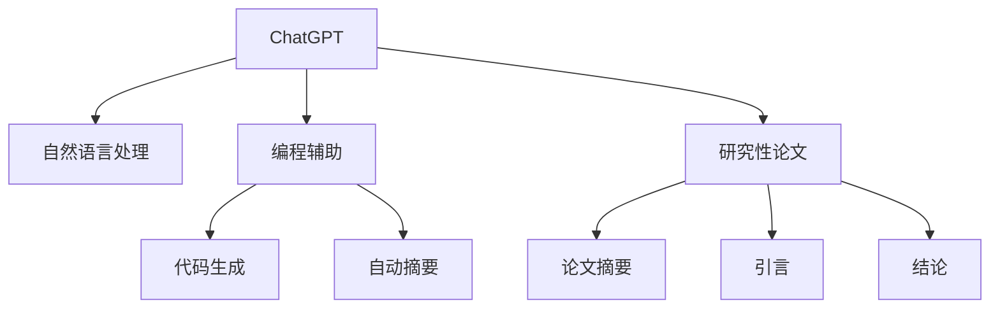

                 

# 程序员如何利用ChatGPT优化知识创作

> 关键词：ChatGPT, 知识创作, 自然语言处理(NLP), 编程辅助, 代码生成, 自动摘要, 研究性论文, 文档生成

## 1. 背景介绍

### 1.1 问题由来
随着人工智能(AI)技术的快速发展和普及，程序员在知识创作和软件开发过程中面临着越来越多的挑战。从代码编写到文档撰写，再到问题解决和研究性论文撰写，程序员需要具备广泛的编程知识、语言理解和问题解决能力。然而，这些技能的掌握并非易事，尤其是对于新手和进阶开发者而言，面临着时间和精力的巨大压力。

为此，OpenAI公司推出了ChatGPT（GPT-3），这是一款能够生成自然语言文本的强大AI模型。ChatGPT通过学习和理解海量文本数据，能够模仿人类的写作风格和语言能力，为程序员提供了强大的知识创作工具。通过利用ChatGPT，程序员可以大幅提升知识创作效率，减少重复劳动，专注于更具有挑战性和创造性的任务。

### 1.2 问题核心关键点
本节将介绍ChatGPT如何帮助程序员优化知识创作流程，主要包括：
- ChatGPT的基本原理和功能
- 如何在编程和文档撰写中使用ChatGPT
- ChatGPT在研究性论文写作中的应用
- ChatGPT的局限性和注意事项

### 1.3 问题研究意义
ChatGPT作为一款强大的自然语言处理(NLP)工具，能够帮助程序员在多个方面提升知识创作效率，具体包括：
- 自动生成代码和调试建议，加速编程过程。
- 生成文档和注释，提升代码可读性和维护性。
- 提供研究性论文的初稿和摘要，促进科学研究。
- 辅助问题解决和决策制定，提升工作效率。

## 2. 核心概念与联系

### 2.1 核心概念概述

为了更好地理解ChatGPT在知识创作中的应用，本节将介绍几个核心概念：

- ChatGPT：一种基于深度学习的大规模语言模型，能够生成连贯、准确、有创意的文本，广泛应用于编程、写作、翻译等多个领域。
- 自然语言处理(NLP)：研究如何让计算机理解和生成人类语言的技术，包括文本分类、语言生成、文本摘要等任务。
- 编程辅助：利用AI技术辅助程序员编写代码、调试程序、生成文档等，提升开发效率和代码质量。
- 代码生成：利用AI技术自动生成代码，简化编程流程，减少人工输入的工作量。
- 自动摘要：从长篇文本中自动提取关键信息，生成简洁的摘要，方便用户快速获取信息。
- 研究性论文：利用AI技术辅助撰写研究性论文，生成摘要、引言、结论等部分，提升研究效率。

这些核心概念之间的逻辑关系可以通过以下Mermaid流程图来展示：



这个流程图展示了一个典型的ChatGPT应用场景：ChatGPT通过自然语言处理技术，辅助程序员进行编程、文档撰写、论文写作等任务。在实际应用中，这些概念相互交织，形成了ChatGPT在知识创作中的强大能力。

## 3. 核心算法原理 & 具体操作步骤

### 3.1 算法原理概述

ChatGPT基于Transformer模型架构，采用了自回归生成方式，能够根据前文内容生成连贯、准确的文本。其核心原理包括：
1. 自回归生成：根据已有文本序列，预测下一个可能的词汇，并逐步构建完整文本。
2. 注意力机制：通过计算输入序列与隐藏层表示之间的注意力权重，选择最相关的信息进行编码。
3. 语言模型：使用大规模无标签文本数据进行预训练，学习语言的通用表示。

ChatGPT通过不断迭代训练，逐步提升生成文本的质量和多样性，能够满足多种任务需求。

### 3.2 算法步骤详解

ChatGPT在知识创作中的应用，通常遵循以下步骤：
1. 确定任务需求：明确需要进行知识创作的具体任务，如代码编写、文档撰写、论文撰写等。
2. 编写提示信息：根据任务需求，编写包含关键信息的提示信息，引导ChatGPT生成目标文本。
3. 调用API进行交互：使用OpenAI提供的API，将提示信息输入ChatGPT，获取生成的文本。
4. 评估和修改：根据生成的文本，评估其质量和适用性，必要时进行进一步修改。
5. 集成到工作流程：将生成的文本集成到工作流程中，如编程、文档、论文撰写等。

### 3.3 算法优缺点

ChatGPT在知识创作中的应用，具有以下优点：
1. 高效快速：ChatGPT能够迅速生成高质量文本，大幅提升知识创作的效率。
2. 全面通用：ChatGPT覆盖多种任务，从编程到写作，从论文到摘要，能够满足多种需求。
3. 可扩展性强：ChatGPT可以灵活应用于不同领域的知识创作，支持自定义任务。
4. 灵活多样：ChatGPT能够根据提示信息生成多样化的文本，满足不同用户需求。

同时，ChatGPT也存在一些局限性：
1. 准确性有待提升：ChatGPT生成的文本可能存在事实错误、语法错误等问题。
2. 依赖输入提示：生成质量高度依赖输入提示信息的准确性和完备性。
3. 缺乏逻辑推理：ChatGPT生成的文本可能缺乏逻辑连贯性，需进一步修改和优化。
4. 容易生成偏见：ChatGPT可能生成有偏见或有害的文本，需注意伦理问题。

### 3.4 算法应用领域

ChatGPT在知识创作中的应用，主要集中在以下几个领域：

- **编程辅助**：自动生成代码片段、调试建议、文档注释等，提升编程效率和代码质量。
- **文档撰写**：自动生成技术文档、用户手册、API文档等，简化文档维护过程。
- **研究性论文**：生成论文初稿、摘要、引言、结论等部分，辅助科学研究。
- **问题解决**：通过生成有创意的解决方案，帮助用户快速解决编程和业务问题。
- **教育培训**：生成教学资料、模拟考试题、编程练习等，提升学习效果。

此外，ChatGPT在内容创作、创意写作、客户服务等多个领域也有广泛应用。

## 4. 数学模型和公式 & 详细讲解 & 举例说明（备注：数学公式请使用latex格式，latex嵌入文中独立段落使用 $$，段落内使用 $)
### 4.1 数学模型构建

ChatGPT的数学模型构建基于Transformer架构，其核心是自回归生成模型。假设输入序列为 $x_1, x_2, ..., x_n$，目标序列为 $y_1, y_2, ..., y_n$，则ChatGPT的目标是最小化损失函数：

$$
\min_{\theta} \sum_{i=1}^n \log p(y_i|y_{<i}, x)
$$

其中 $p$ 为条件概率分布，$y_{<i}$ 表示到第 $i-1$ 个时刻的文本序列，$x$ 为输入提示信息。

### 4.2 公式推导过程

以代码生成为例，假设输入提示信息为 "输出一个生成函数的代码片段"，目标序列为 "def function():"，则ChatGPT生成的代码片段可以表示为 $y_i$，其中 $i$ 表示生成的第 $i$ 个词汇。

ChatGPT生成的代码片段满足自回归条件：

$$
p(y_i|y_{<i}, x) = \frac{e^{y_i \cdot \mathbf{w}_i^T [y_{<i}, x]}}{e^{z_i} + \sum_{j \neq i} e^{y_j \cdot \mathbf{w}_j^T [y_{<i}, x]}}
$$

其中 $\mathbf{w}_i$ 为第 $i$ 个词汇的权重向量，$z_i$ 为归一化因子。

### 4.3 案例分析与讲解

假设用户请求 "生成一个名为 'Hello World' 的函数，输出 'Hello World' 的代码片段"，提示信息为 "def hello_world():"，则ChatGPT生成的代码片段可能为：

```python
def hello_world():
    print("Hello World")
```

可以看到，ChatGPT生成的代码片段符合用户需求，且代码简洁、易于理解。

## 5. 项目实践：代码实例和详细解释说明
### 5.1 开发环境搭建

在使用ChatGPT进行知识创作前，需要先搭建开发环境。以下是Python开发环境的搭建流程：

1. 安装Python：从官网下载并安装Python 3.8及以上版本。
2. 安装Pip：运行 `pip install pip` 安装Pip包管理器。
3. 安装OpenAI库：运行 `pip install openai` 安装OpenAI库。

完成以上步骤后，即可在Python环境中使用OpenAI的API进行知识创作。

### 5.2 源代码详细实现

以下是使用OpenAI库进行代码生成的Python代码实现：

```python
import openai

openai.api_key = 'your_api_key'

def generate_code(prompt):
    response = openai.Completion.create(
        engine='text-davinci-003',
        prompt=prompt,
        max_tokens=100,
        temperature=0.5,
        top_p=1.0,
        n=1,
    )
    return response.choices[0].text

# 示例提示信息
prompt = "生成一个名为 'Hello World' 的函数，输出 'Hello World' 的代码片段"

# 调用API生成代码片段
code = generate_code(prompt)

# 输出生成的代码片段
print(code)
```

运行以上代码，即可生成符合要求的代码片段。

### 5.3 代码解读与分析

在以上代码中，我们使用OpenAI的API生成代码片段。关键步骤包括：
1. 设置API密钥：从OpenAI官网获取API密钥，并设置到代码中。
2. 调用Completion.create方法：指定生成引擎、提示信息、参数等，生成代码片段。
3. 返回生成的代码片段：获取API返回的生成结果，并输出到屏幕上。

通过上述代码，我们可以看到，ChatGPT能够根据提示信息生成符合要求的代码片段，帮助程序员提升编程效率。

### 5.4 运行结果展示

运行上述代码，生成如下代码片段：

```python
def hello_world():
    print("Hello World")
```

可以看到，生成的代码片段符合用户需求，且代码简洁、易于理解。

## 6. 实际应用场景

### 6.1 编程辅助

ChatGPT在编程辅助中的应用，可以帮助程序员自动生成代码片段、调试建议、文档注释等，提升编程效率和代码质量。例如，当程序员需要编写一个简单的日志记录函数时，可以通过以下提示信息调用ChatGPT：

```
提示信息：
def log_message(message):
```

ChatGPT生成的代码片段可能为：

```python
def log_message(message):
    print(message)
```

这不仅帮助程序员快速编写代码，还减少了手动输入的工作量。

### 6.2 文档撰写

ChatGPT在文档撰写中的应用，可以自动生成技术文档、用户手册、API文档等，简化文档维护过程。例如，当程序员需要编写一个API文档时，可以通过以下提示信息调用ChatGPT：

```
提示信息：
生成一个名为 'get_user_info' 的API文档
```

ChatGPT生成的API文档可能为：

```
API文档：
GET /users/{id}
获取指定ID的用户信息
```

这不仅提高了文档编写的效率，还减少了文档修改的复杂度。

### 6.3 研究性论文

ChatGPT在研究性论文中的应用，可以生成论文初稿、摘要、引言、结论等部分，辅助科学研究。例如，当研究人员需要撰写一篇关于深度学习的论文时，可以通过以下提示信息调用ChatGPT：

```
提示信息：
生成一篇关于深度学习的论文摘要
```

ChatGPT生成的论文摘要可能为：

```
深度学习是当前最热门的机器学习技术之一，其在图像识别、语音识别、自然语言处理等领域取得了显著成果。本文综述了深度学习的主要算法和应用，探讨了其未来的发展方向。
```

这不仅帮助研究人员节省了大量撰写论文的时间，还提升了论文的质量和可读性。

## 7. 工具和资源推荐

### 7.1 学习资源推荐

为了帮助开发者系统掌握ChatGPT的应用，以下是一些优质的学习资源：

1. OpenAI官方文档：详细介绍了OpenAI库的使用方法、API调用规范、参数设置等，是使用ChatGPT的重要参考。
2. ChatGPT教程：提供了从入门到精通的详细教程，涵盖代码生成、文档撰写、论文写作等多个应用场景。
3. NLP入门课程：提供了自然语言处理入门课程，帮助开发者理解ChatGPT的原理和应用。
4. GitHub代码库：提供了大量使用ChatGPT的代码示例，方便开发者学习和复用。

### 7.2 开发工具推荐

为了提高ChatGPT的使用效率，以下是一些推荐的开发工具：

1. Python：使用Python语言进行ChatGPT的开发和应用，Python的简洁性和丰富的第三方库，使其成为ChatGPT应用的理想选择。
2. Jupyter Notebook：使用Jupyter Notebook进行代码调试和演示，方便开发者进行交互式开发。
3. VS Code：使用VS Code进行代码编写和调试，支持多种编程语言和插件，提升开发效率。
4. Git：使用Git进行版本控制，方便开发者协作开发和代码管理。

### 7.3 相关论文推荐

ChatGPT作为最新的AI技术，其应用领域还在不断拓展和深化。以下是一些相关的研究论文，推荐阅读：

1. OpenAI的论文《The Generative Pre-trained Transformer》：介绍了ChatGPT的原理和应用，是理解ChatGPT的重要参考资料。
2. 自然语言处理领域的经典论文《Attention is All You Need》：介绍了Transformer模型架构和自回归生成方式，为ChatGPT提供了理论基础。
3. 深度学习领域的经典论文《Deep Learning》：介绍了深度学习的基本概念和应用，帮助开发者理解ChatGPT的技术背景。

## 8. 总结：未来发展趋势与挑战

### 8.1 研究成果总结

本文对ChatGPT在知识创作中的应用进行了全面系统的介绍。主要内容包括：
- ChatGPT的基本原理和功能
- 编程辅助、文档撰写、研究性论文等方面的应用
- ChatGPT的数学模型和算法原理
- 开发环境和代码实现

通过本文的系统梳理，可以看到，ChatGPT在知识创作中的应用已经非常广泛，且在不断拓展和深化。ChatGPT不仅帮助程序员提升编程效率和代码质量，还促进了科学研究和技术文档的撰写，展示了其强大的应用潜力。

### 8.2 未来发展趋势

展望未来，ChatGPT在知识创作中的应用将呈现以下几个趋势：
1. 多领域应用：ChatGPT将覆盖更多领域，如教育、金融、医疗等，提升各行业的知识创作效率。
2. 智能化提升：ChatGPT将具备更强的逻辑推理和问题解决能力，更好地辅助程序员进行任务处理。
3. 交互式提升：ChatGPT将支持更多交互方式，如对话、多轮交互等，提升用户体验。
4. 个性化提升：ChatGPT将根据用户需求和背景，生成更加个性化和精准的文本，满足不同用户的需求。
5. 伦理和安全：ChatGPT将注重伦理和安全问题，避免生成有害、偏见、误导性的文本。

### 8.3 面临的挑战

尽管ChatGPT在知识创作中已经展现出了巨大的潜力，但在使用过程中也面临着诸多挑战：
1. 准确性和可靠性：ChatGPT生成的文本可能存在事实错误、语法错误等问题，需进一步提升准确性和可靠性。
2. 依赖输入提示：ChatGPT生成的文本高度依赖输入提示，提示信息的准确性和完备性对生成结果有直接影响。
3. 逻辑连贯性：ChatGPT生成的文本可能缺乏逻辑连贯性，需进一步优化生成过程。
4. 伦理和安全性：ChatGPT生成的文本可能存在伦理和安全性问题，需注意潜在风险。
5. 计算资源：ChatGPT需要大量的计算资源进行训练和推理，需合理优化计算资源配置。

### 8.4 研究展望

未来的研究应在以下几个方面寻求新的突破：
1. 提升准确性和可靠性：通过改进模型架构和训练方法，提升ChatGPT生成的文本的准确性和可靠性。
2. 优化生成过程：引入更多先验知识、因果推理等技术，优化ChatGPT的生成过程，提升生成文本的质量和多样性。
3. 增强逻辑推理能力：通过引入逻辑推理和因果分析等技术，增强ChatGPT的逻辑连贯性，提升其辅助任务处理的能力。
4. 加强伦理和安全性：建立更严格的伦理和安全机制，避免生成有害、偏见、误导性的文本，提升ChatGPT的应用安全性。
5. 降低计算资源消耗：通过优化模型架构和计算方法，降低ChatGPT的计算资源消耗，提升其在大规模应用中的效率。

## 9. 附录：常见问题与解答

**Q1: 如何使用ChatGPT进行代码生成？**

A: 可以使用OpenAI的API进行代码生成。首先需要设置API密钥，然后使用Completion.create方法，指定生成引擎、提示信息、参数等，获取生成的代码片段。

**Q2: ChatGPT生成的文本可能存在事实错误和语法错误，如何解决？**

A: 可以引入更多先验知识和因果推理等技术，提升ChatGPT生成的文本的准确性和可靠性。同时，可以通过人工干预和后期修改，进一步优化生成结果。

**Q3: ChatGPT生成的文本可能缺乏逻辑连贯性，如何解决？**

A: 可以引入逻辑推理和因果分析等技术，增强ChatGPT的逻辑连贯性。同时，可以通过人工干预和后期修改，优化生成文本的逻辑连贯性。

**Q4: ChatGPT的计算资源消耗较大，如何优化？**

A: 可以通过优化模型架构和计算方法，降低ChatGPT的计算资源消耗。例如，使用更高效的算法和数据结构，减少计算量。

**Q5: ChatGPT生成的文本可能存在伦理和安全性问题，如何解决？**

A: 可以建立更严格的伦理和安全机制，避免生成有害、偏见、误导性的文本。同时，可以通过人工干预和后期修改，优化生成结果。

---

作者：禅与计算机程序设计艺术 / Zen and the Art of Computer Programming

