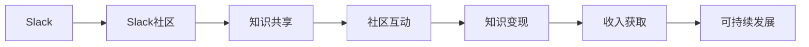

                 

# 程序员如何利用Slack社区进行知识变现

## 1. 背景介绍

随着互联网技术的飞速发展，远程工作、团队协作、知识共享等新趋势不断涌现，Slack社区已经成为了全球范围内最为流行的在线协作平台之一。对于程序员而言，Slack社区不仅仅是团队沟通的工具，更是一个极为丰富的知识交流和变现的平台。本文将从Slack社区的特点和优势出发，探讨程序员如何利用Slack社区进行知识变现的策略和实践。

## 2. 核心概念与联系

### 2.1 核心概念概述

在探讨如何利用Slack社区进行知识变现之前，首先需要了解Slack社区的核心概念和基本功能：

- **Slack**：一款基于云的团队协作工具，提供即时消息、文件共享、群组管理等功能，支持多平台同步。
- **Slack社区**：Slack上基于特定主题或兴趣的群组和频道，聚集了全球范围内的技术爱好者和专家，形成了一个庞大的知识共享网络。
- **知识变现**：指将专业知识转化为实际的经济价值，包括通过咨询、培训、内容创作等多种形式获取收入。

### 2.2 核心概念原理和架构的 Mermaid 流程图(Mermaid 流程节点中不要有括号、逗号等特殊字符)



这个流程图展示了Slack社区的知识共享和变现流程：

1. **Slack社区**：基于Slack平台构建的专业知识分享群组和频道。
2. **知识共享**：社区成员通过发布文章、分享代码、参与讨论等方式进行知识共享。
3. **社区互动**：社区成员之间的问答、评论、点赞等互动行为，促进知识的流动和传播。
4. **知识变现**：社区成员通过提供技术咨询、撰写教程、开设在线课程等方式将知识转化为收入。
5. **收入获取**：通过知识变现活动，社区成员获得经济回报。
6. **可持续发展**：知识变现的良性循环，促进社区的健康发展和成员的持续增长。

## 3. 核心算法原理 & 具体操作步骤

### 3.1 算法原理概述

利用Slack社区进行知识变现的算法原理主要基于以下两点：

1. **知识分发**：通过优化信息分发机制，将高质量的知识内容传递给最需要的人。
2. **需求匹配**：通过高效匹配知识需求和供给，实现知识变现的最大化。

### 3.2 算法步骤详解

#### 3.2.1 获取高质量知识内容

在Slack社区中，高质量的知识内容通常包括：

- **技术文章和博客**：涵盖编程语言、框架、工具、算法等多个领域，由行业专家撰写。
- **开源项目和代码**：参与开源社区，贡献代码，或分享自己的项目。
- **教学资源和教程**：通过视频、讲座、在线课程等形式传授知识和技能。

要获取高质量知识内容，建议采取以下策略：

1. **订阅热门频道**：关注Slack上热门技术频道和群组，获取最新的行业动态和专业内容。
2. **参与讨论和问答**：在频道中积极参与技术讨论和问题解答，吸收他人的智慧，分享自己的见解。
3. **加入专业社区**：找到与自己技术栈和兴趣领域相符的Slack社区，深度参与和贡献。

#### 3.2.2 高效匹配知识需求和供给

利用Slack社区进行知识变现，需要高效匹配知识需求和供给，实现知识变现的最大化。以下是具体步骤：

1. **发布专业文章和教程**：将自己的技术文章、教程和项目分享至Slack社区，设定付费模式，如加入会员订阅、单次付费下载等。
2. **开设在线课程和讲座**：利用Slack提供的直播和录制功能，开设在线课程和讲座，吸引付费观众。
3. **提供技术咨询和支持**：在Slack社区中提供专业的技术咨询和支持，解答疑问，解决实际问题。
4. **构建知识付费生态**：与其他社区成员合作，构建知识付费生态，形成互补和协同。

### 3.3 算法优缺点

#### 3.3.1 优点

- **低成本高收益**：Slack社区提供了一个免费且高效的知识变现平台，几乎无成本，但收益可观。
- **高互动性**：社区成员之间的互动和反馈，有助于提升内容的质量和受众的满意度。
- **多样化变现方式**：除了直接的付费模式，还可以通过广告、赞助、品牌合作等多种方式实现知识变现。

#### 3.3.2 缺点

- **内容竞争激烈**：Slack社区内容繁多，高质量内容不易脱颖而出。
- **市场需求不确定**：知识需求具有不确定性，难以准确预测和把握。
- **知识积累和沉淀不足**：社区成员流动性大，知识积累和沉淀存在一定难度。

### 3.4 算法应用领域

利用Slack社区进行知识变现的方法，不仅适用于传统的软件开发和IT技术领域，还适用于数据科学、人工智能、区块链等前沿科技领域。任何具备专业知识和技能的程序员，都可以在Slack社区中找到适合自己的变现方式。

## 4. 数学模型和公式 & 详细讲解 & 举例说明

### 4.1 数学模型构建

知识变现的数学模型可以简化为以下公式：

$$
\text{知识变现量} = \text{知识需求量} \times \text{知识供给量}
$$

其中，知识需求量代表了用户对知识和技能的需求程度，知识供给量代表了社区成员提供知识和技能的能力。

### 4.2 公式推导过程

根据上述模型，我们可以进一步推导出以下公式：

$$
\text{知识变现量} = \text{知识需求量} \times \text{知识供给量} = \sum_{i=1}^n \text{知识需求量}_i \times \text{知识供给量}_i
$$

其中，$n$为社区中知识内容的多样性，$\text{知识需求量}_i$和$\text{知识供给量}_i$分别为第$i$个知识内容的需求量和供给量。

### 4.3 案例分析与讲解

以在Slack社区中开设在线课程为例，进行详细讲解：

1. **确定课程主题**：选择具有市场需求的课程主题，如Web开发、数据科学、机器学习等。
2. **制作课程内容**：准备课程内容，包括视频讲座、PPT、代码示例等。
3. **发布课程信息**：在Slack社区的频道中发布课程信息，设定付费模式，如单次课程付费、会员订阅等。
4. **吸引学员参与**：通过社交媒体、邮件列表等方式宣传课程，吸引学员参与。
5. **课程效果评估**：收集学员反馈，不断优化课程内容，提高课程质量和学员满意度。

## 5. 项目实践：代码实例和详细解释说明

### 5.1 开发环境搭建

要在Slack社区中进行知识变现，首先需要搭建合适的开发环境。以下是详细的步骤：

1. **创建Slack账号**：在Slack官网注册账号，创建团队和频道，开始构建社区。
2. **安装Slack客户端**：在Windows、Mac、Linux等操作系统上安装Slack客户端，加入已创建的频道。
3. **配置开发环境**：安装开发所需的软件和工具，如Git、IDE、IDEA等。
4. **设置Slack API**：通过Slack API获取API密钥，设置API权限，连接Slack社区。

### 5.2 源代码详细实现

以下是一个简单的示例代码，用于在Slack社区中发布课程信息并设定付费模式：

```python
import slack

def create_course_info(course_name, course_description, course_price):
    # 创建课程信息
    course_info = {
        "name": course_name,
        "description": course_description,
        "price": course_price,
        "platform": "Slack"
    }
    return course_info

def publish_course(course_info):
    # 获取API密钥
    api_token = "YOUR_API_TOKEN"
    channel_id = "YOUR_CHANNEL_ID"
    
    # 初始化Slack客户端
    client = slack.WebClient(token=api_token)
    
    # 发布课程信息
    response = client.chat_postMessage(
        channel=channel_id,
        text=f"新课程发布：{course_info['name']}\n\n课程描述：{course_info['description']}\n课程价格：{course_info['price']}\n平台：{course_info['platform']}"
    )
    
    if response["ok"]:
        print("课程发布成功")
    else:
        print("课程发布失败")

# 创建课程信息
course_info = create_course_info("Python Web开发", "本课程将涵盖Python Web开发的基础知识和高级技巧", 99)

# 发布课程信息
publish_course(course_info)
```

### 5.3 代码解读与分析

这段代码实现了一个简单的功能，用于在Slack频道中发布新课程信息并设定课程价格。

- **create_course_info函数**：创建课程信息字典，包含课程名称、描述、价格和平台。
- **publish_course函数**：使用Slack API客户端发布课程信息，并输出发布结果。

### 5.4 运行结果展示

执行上述代码后，会在指定的Slack频道中发布新课程信息，并设定课程价格。

## 6. 实际应用场景

### 6.1 技术咨询

Slack社区中的技术咨询业务，可以涵盖多个领域，包括但不限于软件开发、系统架构、数据科学、人工智能等。

具体步骤包括：

1. **创建咨询频道**：在Slack社区中创建专门的技术咨询频道。
2. **提供咨询服务**：在频道中提供实时在线咨询，解答各种技术问题。
3. **设定咨询收费**：对于复杂或高难度的咨询，设定适当的收费标准。
4. **收集反馈和评价**：收集客户反馈，优化咨询服务质量。

### 6.2 在线课程

开设在线课程是Slack社区中知识变现的重要形式，通过视频、讲座、代码示例等多种形式传授知识和技能。

具体步骤包括：

1. **选择课程主题**：选择具有市场需求的课程主题。
2. **制作课程内容**：准备课程内容，包括视频讲座、PPT、代码示例等。
3. **发布课程信息**：在Slack社区的频道中发布课程信息，设定付费模式。
4. **吸引学员参与**：通过社交媒体、邮件列表等方式宣传课程，吸引学员参与。
5. **课程效果评估**：收集学员反馈，不断优化课程内容。

### 6.3 品牌合作

Slack社区还可以进行品牌合作，通过与技术厂商、培训机构等合作，推广技术产品和服务。

具体步骤包括：

1. **选择合作伙伴**：选择具有市场影响力的合作伙伴。
2. **制定合作方案**：制定详细的品牌合作方案，明确合作目标和内容。
3. **宣传合作信息**：在Slack社区中宣传合作信息，吸引社区成员参与。
4. **执行合作方案**：按计划执行合作方案，实现互惠互利。
5. **效果评估和反馈**：评估合作效果，收集合作伙伴和社区成员的反馈，不断优化合作方案。

## 7. 工具和资源推荐

### 7.1 学习资源推荐

要充分利用Slack社区进行知识变现，首先需要掌握Slack的基本功能和工具，以下是推荐的学习资源：

1. **Slack官方文档**：Slack官网提供了详细的官方文档，涵盖所有功能和API接口。
2. **Slack开发者指南**：Slack开发者指南提供了完整的Slack API使用手册，帮助开发者快速上手。
3. **Slack社区教程**：Slack社区中有很多社区成员分享的教程和指南，可以借鉴和学习。
4. **Slack开发者社区**：Slack开发者社区是一个活跃的开发者社区，可以与其他开发者交流经验。

### 7.2 开发工具推荐

要高效利用Slack社区进行知识变现，需要一些实用的开发工具，以下是推荐的工具：

1. **Slack API**：Slack官方提供的API接口，用于获取API密钥和执行API操作。
2. **Slack客户端**：Slack客户端支持跨平台使用，方便开发者随时随地管理Slack频道和信息。
3. **IDE和IDEA**：IDE和IDEA等开发工具，可以辅助开发者编写和测试课程内容。
4. **Git和GitHub**：Git和GitHub等版本控制工具，可以帮助开发者进行代码管理和版本控制。

### 7.3 相关论文推荐

利用Slack社区进行知识变现的研究也逐渐兴起，以下是推荐的相关论文：

1. **Slack中的知识共享和社交网络**：研究Slack社区中的知识共享模式和社交网络结构，探讨其对知识传播和变现的影响。
2. **基于Slack的在线课程开发**：探讨在Slack社区中开设在线课程的可行性、教学效果和成本效益。
3. **Slack社区中的技术咨询和支持**：研究Slack社区中技术咨询和支持服务的实施策略和效果评估。
4. **Slack社区中的品牌合作与推广**：探讨Slack社区中品牌合作的策略和效果，评估其对品牌价值的影响。

## 8. 总结：未来发展趋势与挑战

### 8.1 研究成果总结

利用Slack社区进行知识变现的研究，已经取得了一定的成果，主要包括以下几个方面：

1. **知识共享模式**：Slack社区中的知识共享模式，通过讨论、问答、代码分享等多种形式，实现了知识的快速传播和积累。
2. **在线课程开发**：在线课程作为知识变现的主要形式，已经在多个领域取得了显著的成果。
3. **技术咨询和支持**：通过Slack社区提供的技术咨询和支持服务，已经解决了大量技术问题。
4. **品牌合作与推广**：Slack社区中的品牌合作，为技术厂商和培训机构提供了有效的推广渠道。

### 8.2 未来发展趋势

未来，Slack社区中的知识变现将呈现以下几个趋势：

1. **知识变现生态化**：Slack社区将形成一个完整的知识变现生态，包括内容生产、知识分发、市场运营等多个环节。
2. **社区成员多元化**：社区成员将更加多元化，涵盖全球各地的技术爱好者和专家，形成更广泛的交流和合作。
3. **知识变现多样化**：除了在线课程和咨询服务，知识变现形式将更加多样化，包括技术博客、技术书籍、开源项目等。
4. **技术合作深度化**：Slack社区中的技术合作将更加深度化，形成紧密的合作关系，实现互利共赢。

### 8.3 面临的挑战

尽管Slack社区中的知识变现已经取得了一定的成果，但仍面临一些挑战：

1. **知识质量参差不齐**：社区中知识内容的质量参差不齐，高质量内容难以脱颖而出。
2. **市场需求难以把握**：市场需求具有不确定性，难以准确预测和把握。
3. **知识变现门槛较高**：知识变现门槛较高，需要具备一定的技术和市场资源。

### 8.4 研究展望

未来，Slack社区中的知识变现研究需要在以下几个方面进行突破：

1. **知识内容的质量提升**：提升知识内容的质量，吸引更多高质量的创作者加入社区。
2. **市场需求分析**：建立市场需求分析机制，准确预测和把握市场需求，优化知识变现策略。
3. **知识变现门槛降低**：降低知识变现门槛，使更多技术爱好者和专家能够参与其中。
4. **知识变现渠道多元化**：拓展知识变现渠道，形成多元化、多层次的知识变现体系。

总之，利用Slack社区进行知识变现具有广阔的前景，但同时也面临着诸多挑战。只有在技术、市场、社区等多方面协同发力，才能实现知识变现的最大化，让更多技术专家和爱好者从中受益。

## 9. 附录：常见问题与解答

**Q1：如何在Slack社区中找到适合自己的变现机会？**

A: 在Slack社区中，可以通过以下方式找到适合自己的变现机会：

1. **订阅热门频道**：关注Slack上热门技术频道和群组，获取最新的行业动态和专业内容。
2. **参与讨论和问答**：在频道中积极参与技术讨论和问题解答，吸收他人的智慧，分享自己的见解。
3. **加入专业社区**：找到与自己技术栈和兴趣领域相符的Slack社区，深度参与和贡献。

**Q2：如何提升Slack社区中的知识内容质量？**

A: 提升Slack社区中的知识内容质量，可以从以下几个方面入手：

1. **内容审核机制**：建立内容审核机制，筛选高质量的知识内容。
2. **社区激励机制**：通过社区激励机制，奖励高质量内容的创作和分享。
3. **互动反馈机制**：建立互动反馈机制，收集社区成员的反馈，不断优化知识内容。

**Q3：如何降低Slack社区中的知识变现门槛？**

A: 降低Slack社区中的知识变现门槛，可以从以下几个方面入手：

1. **降低收费标准**：降低课程和咨询的收费标准，吸引更多的用户参与。
2. **提供免费试用**：提供免费的试用期，让用户先体验课程或咨询服务，再决定是否付费。
3. **简化操作流程**：简化知识变现的操作流程，降低用户的技术门槛。

通过这些策略，可以进一步降低Slack社区中的知识变现门槛，使更多的技术专家和爱好者能够从中受益。

---

作者：禅与计算机程序设计艺术 / Zen and the Art of Computer Programming

