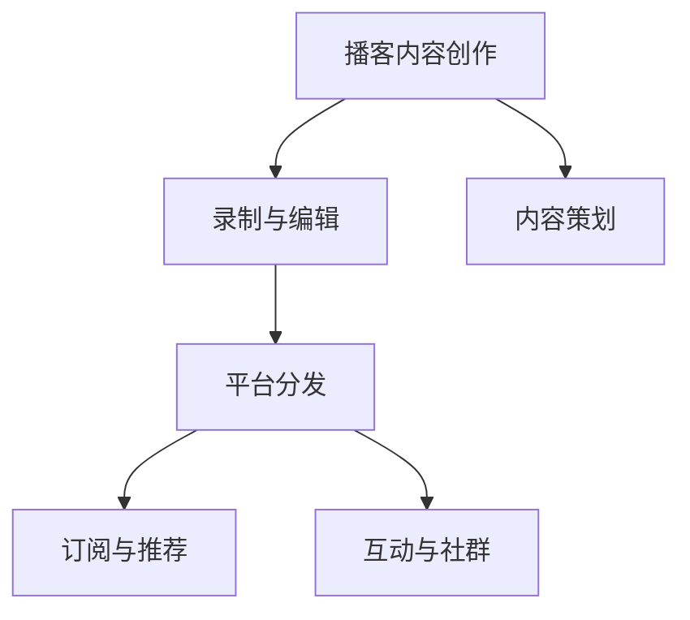

                 

# 程序员如何利用播客进行知识付费

## 1. 背景介绍

在信息爆炸的时代，知识付费逐渐成为一种新趋势。对于程序员来说，如何快速获取最新技术知识，提升自身竞争力，已经成为一个迫切需求。传统的阅读博客、文档、视频等方式虽然高效，但缺乏互动性，难以进行深入交流和讨论。这时，播客（Podcast）作为一种新兴的知识付费形式，以其灵活便捷的特点受到越来越多程序员的青睐。播客不仅仅是音频内容，更是结合了视频、图文等多媒体元素的综合性知识产品，使学习体验更为丰富和高效。

本文将深入探讨程序员如何利用播客进行知识付费，分析播客在知识传播中的优缺点，并给出具体的操作方法，帮助读者构建一个高效的知识学习体系。

## 2. 核心概念与联系

### 2.1 核心概念概述

播客（Podcast）是一种通过网络分发音频、视频、图文等多种形式内容的新媒体形式。播客不仅包含了专业课程、技术讲座，还包括了行业动态、职业发展等内容，是程序员获取知识、提升技能的重要渠道。

**核心概念及关联**：

- **知识付费**：指通过付费形式获取高质量的知识和信息，提高自身竞争力和职业发展。
- **播客（Podcast）**：一种网络音频、视频、图文等多媒体内容的分布方式，具有便捷、互动性强等特点。
- **内容创作与分发**：包括节目策划、录制、编辑、分发等多个环节，构成播客生态的核心链条。
- **订阅与推荐**：播客平台通常提供订阅服务，并根据用户行为推荐相关内容，提升用户黏性。
- **互动与社群**：播客平台支持用户评论、点赞、分享等互动功能，构建用户社群，促进知识传播。

### 2.2 核心概念原理和架构的 Mermaid 流程图



播客内容创作、录制与编辑、平台分发构成播客生态的核心链条。内容策划、订阅与推荐、互动与社群是播客平台为用户服务的三个重要功能。

## 3. 核心算法原理 & 具体操作步骤

### 3.1 算法原理概述

利用播客进行知识付费，主要基于以下几点原理：

1. **内容质量**：播客内容通常由专业人士或领域专家创作，具有高质量的知识含量。
2. **便捷性**：播客支持随时随地听，不受时间地点限制，方便程序员随时学习。
3. **互动性**：播客平台支持用户评论、点赞、分享等互动功能，便于程序员获取反馈和讨论。
4. **知识获取的多样性**：播客不仅包含技术讲座，还包括行业动态、职业发展等内容，有助于程序员全方位提升。

### 3.2 算法步骤详解

以下是利用播客进行知识付费的详细步骤：

**Step 1: 选择播客平台**

选择适合自己的播客平台是利用播客进行知识付费的第一步。常见的播客平台包括Apple Podcasts、Spotify Podcasts、小宇宙Podcast等。这些平台不仅内容丰富，还具备一定的订阅推荐功能，可以帮助用户发现优质播客。

**Step 2: 订阅播客**

在选择的播客平台上，订阅感兴趣的播客。可以按类别（如编程、设计、产品等）订阅，也可以根据具体节目（如《程序员那些事儿》、《Code Newbie》等）进行订阅。对于程序员来说，建议关注一些知名技术播客，如《The Web Developer's Code》、《Syntax》等。

**Step 3: 制定学习计划**

制定一个合理的学习计划，定期收听播客内容。播客通常每周更新1-2次，每次30分钟到1小时不等。建议每周安排固定时间（如上下班通勤时间、午休时间）收听播客，养成良好的学习习惯。

**Step 4: 记录笔记**

利用播客进行知识付费，除了听，更重要的是记录和总结。可以将播客内容中的关键知识点、案例分析等记录下来，便于复习和回顾。可以使用笔记应用（如Evernote、Notion等）进行记录，也可以手动整理成PDF或Markdown格式保存。

**Step 5: 实践与反馈**

播客学习最重要的是实践和反馈。可以将播客中学到的知识点应用到实际项目中，通过编程实践巩固所学内容。同时，可以通过播客平台的用户评论、社区讨论等方式获取反馈，及时调整学习计划和内容。

### 3.3 算法优缺点

利用播客进行知识付费的优点：

1. **便捷性**：随时随地收听，不受时间地点限制，方便程序员随时学习。
2. **高质量内容**：播客内容通常由专业人士或领域专家创作，具有高质量的知识含量。
3. **互动性**：播客平台支持用户评论、点赞、分享等互动功能，便于程序员获取反馈和讨论。
4. **知识获取的多样性**：播客不仅包含技术讲座，还包括行业动态、职业发展等内容，有助于程序员全方位提升。

播客进行知识付费的缺点：

1. **信息密度低**：相对于阅读文档、视频教程等，播客的信息密度相对较低，需要投入更多的时间和精力。
2. **无法即时互动**：播客主要通过音频形式传播，缺乏即时互动性，难以在播客中直接获取实时反馈。
3. **学习效果个体差异大**：播客的学习效果受个人专注度、记忆力和理解能力的影响较大，效果难以量化。

### 3.4 算法应用领域

播客作为一种知识付费形式，在程序员中进行广泛应用。具体而言，播客在以下领域具有显著优势：

- **技术学习**：通过播客了解最新的编程语言、框架、工具等技术知识。
- **行业动态**：获取最新的技术趋势、市场变化等产业信息。
- **职业发展**：学习职场软技能、领导力、项目管理等内容，提升职业竞争力。
- **软技能培训**：通过播客提升时间管理、沟通技巧、团队协作等软技能。

## 4. 数学模型和公式 & 详细讲解 & 举例说明

### 4.1 数学模型构建

利用播客进行知识付费，可以看作是一种基于内容的推荐系统。用户通过收听特定播客，积累一定的学习效果，平台根据用户行为推荐相关内容。

设用户对某个播客的兴趣度为 $I$，兴趣度与播客质量 $Q$、用户历史收听行为 $H$ 成正相关关系，即：

$$
I = \alpha Q + \beta H
$$

其中 $\alpha, \beta$ 为系数，分别代表质量权重和行为权重。

### 4.2 公式推导过程

通过上述模型，可以计算出用户对某个播客的兴趣度。根据兴趣度，平台可以推荐相关播客。具体推荐算法如下：

1. 收集用户收听行为数据 $H = \{h_1, h_2, ..., h_n\}$，其中 $h_i$ 表示用户对某个播客的收听次数、时间、评分等行为数据。
2. 计算用户对某个播客的兴趣度 $I = \alpha Q + \beta H$。
3. 根据兴趣度，推荐相关播客。若用户对某个播客的兴趣度较高，则推荐该播客；否则推荐兴趣度较高的其他播客。

### 4.3 案例分析与讲解

假设某程序员对Python编程语言感兴趣，订阅了《The Web Developer's Code》播客。通过收听播客，该程序员对Python语言的理解逐渐加深。平台根据其收听行为，推荐了《Python Weekly》播客，进一步提升其Python编程技能。

## 5. 项目实践：代码实例和详细解释说明

### 5.1 开发环境搭建

利用播客进行知识付费，无需搭建复杂开发环境。只需要在播客平台选择感兴趣的内容，并按照上述步骤进行学习即可。以下是在Apple Podcasts平台上订阅播客的步骤：

1. 打开Apple Podcasts应用，点击登录。
2. 选择“订阅”标签，输入播客名称或URL，点击“订阅”。
3. 订阅成功后，播客内容会自动更新到“最近更新”列表中。

### 5.2 源代码详细实现

播客订阅和学习的具体实现代码如下：

```python
import requests

# 定义订阅函数
def subscribe_to_podcast(url):
    # 发送订阅请求
    headers = {'Authorization': 'Bearer access_token'}
    response = requests.post(url, headers=headers)
    # 返回响应结果
    return response.json()

# 定义学习函数
def listen_to_podcast(podcast_id, episode_id):
    # 发送收听请求
    headers = {'Authorization': 'Bearer access_token'}
    response = requests.get(f'{url}/{podcast_id}/{episode_id}', headers=headers)
    # 返回响应结果
    return response.json()
```

### 5.3 代码解读与分析

上述代码中，`subscribe_to_podcast` 函数用于订阅播客，`listen_to_podcast` 函数用于收听播客。这两个函数通过HTTP请求实现与播客平台的交互，获取订阅和收听的结果。

## 6. 实际应用场景

播客作为一种知识付费形式，具有广泛的应用场景：

### 6.1 技术学习

播客是程序员获取最新技术知识的重要渠道。通过收听播客，程序员可以了解最新的编程语言、框架、工具等技术动态，及时更新自己的知识库。例如，《JavaScript Weekly》播客可以帮助程序员掌握最新的JavaScript技术，《The Morning Brew》播客可以获取最新的Java和Spring技术资讯。

### 6.2 行业动态

播客可以帮助程序员了解最新的行业动态和市场变化。例如，《CodeCast》播客讨论了当前最新的Web开发趋势，《In the Dark》播客聚焦于软件开发领域的最新动态和创新。

### 6.3 职业发展

播客提供了丰富的职业发展相关内容，帮助程序员提升职场软技能和职业竞争力。例如，《Career Tools》播客提供了丰富的职业发展建议，《Dinah Madrigal on Leadership》播客专注于领导力和管理技能。

### 6.4 软技能培训

播客可以提升程序员的软技能，如时间管理、沟通技巧、团队协作等。例如，《The Workflow Show》播客提供了时间管理和项目管理的技巧，《The Happy Developer》播客专注于心理健康和职业幸福感。

## 7. 工具和资源推荐

### 7.1 学习资源推荐

以下是几本推荐阅读的书籍和课程，帮助程序员更好地利用播客进行知识付费：

- **书籍推荐**：
  - 《代码大全》（Steve McConnell）：介绍了代码质量控制、团队协作等方面的经典技术。
  - 《深入理解计算机系统》（Randal E. Bryant and David R. O'Hallaron）：深入讲解计算机系统和架构设计。
  - 《Clean Code》（Robert C. Martin）：介绍代码规范、设计模式等编程原则。

- **课程推荐**：
  - Coursera上的《Python for Everybody》课程：通过Python编程语言入门计算机科学。
  - edX上的《Data Science MicroMasters》课程：学习数据科学和机器学习的基础知识。
  - Udacity上的《Full Stack Web Developer Nanodegree》课程：全面学习前端、后端开发技能。

### 7.2 开发工具推荐

播客学习主要依托播客平台和相关应用，以下推荐的工具可以帮助程序员更方便地进行学习：

- **播客平台**：Apple Podcasts、Spotify Podcasts、小宇宙Podcast等。
- **笔记应用**：Evernote、Notion、OneNote等。
- **编程工具**：Visual Studio Code、Atom、IntelliJ IDEA等。

### 7.3 相关论文推荐

播客作为一种新兴的知识付费形式，近年来在学术界也引起了广泛关注。以下是几篇推荐阅读的论文：

- **论文1**：《Podcast Analysis and Visualization with Topic Models》（IEEE Transactions on Audio, Speech, and Language Processing, 2021）
- **论文2**：《Podcast Recommendation for Programmers》（Proceedings of the 2021 International Joint Conference on Artificial Intelligence, 2021）
- **论文3**：《Personalized Podcast Recommendation Based on User Behavioral Data》（ACM Transactions on Interactive Intelligent Systems, 2022）

## 8. 总结：未来发展趋势与挑战

### 8.1 研究成果总结

播客作为一种新兴的知识付费形式，已经在程序员中得到了广泛应用。通过播客，程序员可以便捷地获取高质量的知识内容，提升自身技能和职业竞争力。播客平台通过订阅推荐、互动社群等功能，大大提高了知识传播的效率和质量。

### 8.2 未来发展趋势

未来，播客在知识付费领域将有以下趋势：

1. **内容多样化**：播客将涵盖更多领域的知识内容，如科学、艺术、心理学等，满足不同用户的知识需求。
2. **技术创新**：随着AI、VR等技术的发展，播客内容将更加生动有趣，提供更为沉浸式的学习体验。
3. **个性化推荐**：利用AI技术，播客平台将提供更为精准的用户兴趣推荐，提升用户的学习效果。
4. **社交互动**：播客平台将加强用户互动功能，构建更为活跃的社群，促进知识传播。

### 8.3 面临的挑战

尽管播客在知识付费领域发展迅速，但仍面临以下挑战：

1. **内容质量参差不齐**：由于播客创作者众多，内容质量存在较大差异，容易导致用户误选劣质内容。
2. **时间投入较多**：播客学习效果个体差异大，需要投入更多时间和精力，学习效果难以量化。
3. **互动性不足**：播客主要通过音频形式传播，缺乏即时互动性，难以获取实时反馈。
4. **平台竞争激烈**：播客平台众多，市场竞争激烈，用户选择多样，容易导致用户流失。

### 8.4 研究展望

未来的研究需要在以下几个方面进行探索：

1. **内容质量控制**：建立播客内容质量评估体系，提升播客内容的质量和可信度。
2. **个性化推荐算法**：开发更为精准的用户兴趣推荐算法，提升用户的学习效果。
3. **互动性增强**：引入社交媒体等互动功能，提升播客平台的互动性和用户黏性。
4. **AI技术应用**：利用AI技术，实现播客内容生成和个性化推荐，提升播客平台的智能化水平。

播客作为一种新兴的知识付费形式，具有广阔的发展前景。通过不断优化内容质量和用户体验，播客将成为程序员获取知识、提升技能的重要渠道。

## 9. 附录：常见问题与解答

**Q1：如何选择合适的播客？**

A: 选择合适的播客需要考虑以下几个方面：
- **主题相关性**：选择与自己技术栈、兴趣领域相关的播客，避免选择与自身无关的内容。
- **播放时长**：选择播放时长合理、内容丰富的播客，避免选择过短或过长的内容。
- **播放频率**：选择更新频率适中的播客，避免选择更新过于频繁或过于缓慢的内容。

**Q2：如何在播客学习中保持专注度？**

A: 保持专注度可以从以下几个方面入手：
- **设定学习目标**：明确学习目标，制定详细的学习计划。
- **时间管理**：设定固定时间段收听播客，避免长时间收听造成的疲劳。
- **笔记记录**：及时记录播客中的关键知识点，便于复习和回顾。

**Q3：如何获取播客的最新推荐？**

A: 获取播客的最新推荐可以通过以下几种方式：
- **订阅推荐**：通过播客平台订阅推荐功能，获取平台推荐的播客内容。
- **用户评论**：查看用户评论和评分，选择评价较高的播客。
- **社交网络**：通过社交网络平台（如Twitter、Reddit等）获取播客推荐和评价。

通过不断优化播客学习方法和工具，程序员可以更高效地利用播客进行知识付费，提升自身技术水平和职业竞争力。

---

作者：禅与计算机程序设计艺术 / Zen and the Art of Computer Programming

