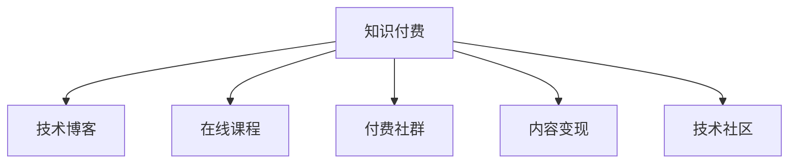

                 

# 程序员如何利用知识付费实现被动收入

> 关键词：知识付费, 程序员, 被动收入, 自由职业, 技术博客, 知识分享, 教育平台, 付费社群, 内容变现, 技术社区

## 1. 背景介绍

### 1.1 问题由来

在传统的工作模式下，程序员的收入主要来自工资和奖金。然而，这种收入模式具有一定的不稳定性，受市场波动、经济环境变化等因素影响较大。为了应对这种不确定性，越来越多的程序员开始寻求多样化的收入渠道，以实现更加稳定和可控的收入来源。

近年来，知识付费作为一种新型的收入方式，开始受到越来越多人的关注和追捧。与传统的被动收入渠道如租金、投资等不同，知识付费依靠个人的专业知识和技能，通过向他人提供有价值的信息和知识来换取收入。本文将探讨程序员如何通过知识付费实现被动收入，从而实现更加灵活和自由的工作方式。

### 1.2 问题核心关键点

知识付费的核心在于将知识变现，即将专业知识、技能、经验等有形或无形的资产转化为可交易的商品或服务。对于程序员而言，通过知识付费获取被动收入，需要具备以下核心要素：

- **专业知识**：具备某一方面或多个方面的专业技能，如编程技术、软件架构、项目管理等。
- **知识输出能力**：能够将自己的知识整理成易于理解和接受的格式，如博客文章、视频教程、在线课程等。
- **用户需求识别**：了解目标受众的需求，提供有针对性的知识产品。
- **市场推广**：能够通过有效的推广手段，吸引潜在用户，并促成交易。
- **持续更新**：保持知识内容的更新和迭代，维持用户粘性。

### 1.3 问题研究意义

对于程序员来说，利用知识付费实现被动收入，不仅能够增加收入来源，还能够提升自身的技术能力和市场竞争力。具体而言，知识付费的研究和实践意义如下：

- **收入多元化**：打破单一的收入模式，实现收入来源的多样化，增强经济稳定性。
- **技术提升**：通过知识输出，可以进一步巩固和提升自身的技术水平，促进个人成长。
- **职业转型**：为转型为自由职业者或咨询师等职业提供条件，实现更灵活的工作方式。
- **市场影响**：通过分享和传播知识，对行业内外的技术发展产生影响，推动技术进步和创新。

## 2. 核心概念与联系

### 2.1 核心概念概述

为了更好地理解程序员如何通过知识付费实现被动收入，本节将介绍几个密切相关的核心概念：

- **知识付费**：通过付费机制获取专业知识、技能或经验，如在线课程、技术博客、付费社群等。
- **技术博客**：程序员通过撰写技术文章，分享自己的技术经验和心得。
- **在线课程**：通过视频、文本等形式，提供系统化的技术知识学习路径。
- **付费社群**：基于共同的兴趣爱好或技术方向，构建的付费交流平台。
- **内容变现**：通过内容产品，如书籍、工具、服务等方式，将知识变现。
- **技术社区**：基于技术交流和分享，吸引大量用户参与的在线平台，如GitHub、Stack Overflow等。

这些核心概念之间的逻辑关系可以通过以下Mermaid流程图来展示：



这个流程图展示了几类知识付费相关概念及其之间的关系：

1. 知识付费是核心，通过其他途径向用户提供知识。
2. 技术博客、在线课程、付费社群、内容变现和技术社区都是知识付费的具体形式。
3. 这些形式可以互相补充，形成综合的知识服务体系。

## 3. 核心算法原理 & 具体操作步骤

### 3.1 算法原理概述

程序员通过知识付费实现被动收入的核心算法原理，是通过内容创作、知识输出，构建有价值的内容体系，再通过有效的市场推广手段，吸引用户付费，从而实现内容的商业化变现。

具体流程如下：

1. **内容创作**：选择或确定需要输出的内容，如某一技术领域的技术栈、编程技巧、项目案例等。
2. **知识输出**：将内容转化为用户易于理解和接受的形式，如博客文章、视频教程、在线课程等。
3. **市场推广**：通过社交媒体、专业社区、付费广告等手段，吸引目标用户。
4. **用户付费**：用户通过订阅、购买等形式，支付相应的费用，获取内容。
5. **持续更新**：根据用户反馈和市场需求，不断更新和迭代内容，保持用户粘性。

### 3.2 算法步骤详解

以下是程序员通过知识付费实现被动收入的具体操作步骤：

**Step 1: 确定知识输出内容**

- **内容选择**：根据自己的专业领域、兴趣和技术栈，确定需要输出的内容主题。
- **内容结构**：设计内容的结构框架，包括引言、正文、结论、参考资料等部分。
- **内容长度**：确定内容的长度，如文章长度、视频时长等。

**Step 2: 构建知识输出形式**

- **技术博客**：撰写高质量的技术文章，通过博客平台进行发布。
- **在线课程**：录制视频教程或制作PPT，通过在线教育平台发布。
- **付费社群**：创建或加入付费社群，提供技术答疑、项目案例分享等服务。
- **内容变现**：出版技术书籍、开发工具、提供技术咨询服务等。

**Step 3: 市场推广**

- **社交媒体**：在各大社交平台如Twitter、LinkedIn等分享内容，吸引关注。
- **专业社区**：在GitHub、Stack Overflow等专业社区发布内容，建立影响力。
- **付费广告**：通过Google AdWords、Facebook Ads等付费广告渠道推广内容。

**Step 4: 用户付费**

- **订阅模式**：通过博客平台、视频网站等提供订阅服务，用户定期支付费用获取内容。
- **单次购买**：通过电子书、视频教程等形式，用户单次付费获取完整内容。
- **付费社群**：通过社群平台，用户定期支付费用参与社群活动，获取技术交流和支持。

**Step 5: 持续更新**

- **用户反馈**：收集用户反馈，了解需求和问题。
- **内容迭代**：根据反馈和市场需求，不断更新和完善内容。
- **发布新内容**：定期发布新的内容，保持用户粘性。

### 3.3 算法优缺点

利用知识付费实现被动收入的方法具有以下优点：

1. **灵活自由**：无需固定工作时间，可以自由安排工作时间，实现更加灵活和自由的工作方式。
2. **收入稳定**：通过知识付费获取稳定收入，不受市场波动和经济环境变化的影响。
3. **提升技能**：通过不断输出和分享知识，进一步提升自身技能和技术水平。
4. **增强影响力**：通过知识输出和市场推广，建立个人品牌和影响力。

同时，这种方法也存在一些局限性：

1. **内容创作难度大**：高质量的内容创作需要大量时间和精力投入。
2. **市场推广难度大**：需要具备一定的市场推广能力，吸引足够多的用户。
3. **收入不稳定**：部分收入依赖于订阅或单次购买，存在一定的不稳定性。
4. **知识更新压力**：需要不断更新和迭代内容，保持内容的时效性和相关性。

### 3.4 算法应用领域

知识付费方法在以下几个领域中有着广泛的应用：

- **技术博客**：如Medium、CSDN等平台，程序员通过撰写技术文章获取订阅费用。
- **在线教育**：如Udemy、Coursera等平台，提供系统化的技术课程，获取用户付费。
- **付费社群**：如Discord、Telegram等平台，提供技术交流和答疑服务，吸引用户付费。
- **书籍出版**：通过撰写技术书籍，获取出版费用和销售收入。
- **技术咨询服务**：提供技术咨询和项目方案，获取服务费用。

## 4. 数学模型和公式 & 详细讲解  
### 4.1 数学模型构建

为了更好地理解程序员通过知识付费实现被动收入的数学模型，本节将使用数学语言对相关过程进行描述。

设程序员在内容输出中的固定成本为 $C_f$，单次内容输出的边际成本为 $C_m$，单位时间内的内容输出数量为 $n$，用户数量为 $u$，每次付费金额为 $p$，订阅费用为 $P_s$。设 $R$ 为总收益，则数学模型为：

$$
R = (p \cdot u \cdot n) + (P_s \cdot u)
$$

其中，$p \cdot u \cdot n$ 表示通过单次付费和订阅获取的总收益，$P_s \cdot u$ 表示通过订阅获取的总收益。

### 4.2 公式推导过程

为了方便推导，我们假设每次内容输出的用户数量 $u$ 固定。则总收益 $R$ 可以简化为：

$$
R = p \cdot u \cdot n + P_s \cdot u
$$

将固定成本 $C_f$ 和边际成本 $C_m$ 代入，得到：

$$
R = (p - C_m) \cdot u \cdot n + P_s \cdot u - C_f
$$

上式中，$(p - C_m)$ 表示每次内容输出的净收益，$P_s$ 表示订阅的净收益，$C_f$ 表示总成本。

通过上述公式，可以得出如下结论：

1. **增加内容输出数量**：增加单位时间内的内容输出数量 $n$，可以显著提高总收益 $R$。
2. **提高付费金额**：提高每次付费金额 $p$，可以显著提高总收益 $R$。
3. **降低边际成本**：降低每次内容输出的边际成本 $C_m$，可以显著提高总收益 $R$。
4. **提高订阅费用**：提高订阅费用 $P_s$，可以显著提高总收益 $R$。
5. **控制总成本**：控制总成本 $C_f$，可以确保总收益 $R$ 为正。

### 4.3 案例分析与讲解

**案例一：技术博客**

某程序员在Medium平台上发布了一篇关于Python高级编程技巧的文章。文章发布后，每天有1000个用户访问并订阅，每次订阅费用为1美元。设每次内容输出的边际成本为0.1美元，固定成本为100美元。则总收益为：

$$
R = 1 \cdot 1000 \cdot 1 + 1 \cdot 1000 - 100
$$

$$
R = 1000 + 1000 - 100 = 1900
$$

**案例二：在线课程**

另一程序员在Udemy平台上发布了一门关于机器学习的在线课程。课程售价为99美元，每次课程录制的成本为50美元。设每期课程有500个用户订阅，则总收益为：

$$
R = 99 \cdot 500 + 99 \cdot 500 - 50 \cdot 500
$$

$$
R = 49500 + 49500 - 25000 = 74000
$$

## 5. 项目实践：代码实例和详细解释说明
### 5.1 开发环境搭建

在进行知识付费项目实践前，我们需要准备好开发环境。以下是使用Python进行知识付费平台开发的常见开发环境配置流程：

1. 安装Python：从官网下载并安装Python 3.8或3.9版本。
2. 安装Jupyter Notebook：通过pip安装Jupyter Notebook，用于编写和调试代码。
3. 安装Flask：通过pip安装Flask框架，用于构建Web应用。
4. 安装Django：通过pip安装Django框架，用于构建复杂的Web应用。
5. 安装PyTorch：通过pip安装PyTorch，用于深度学习相关的任务。
6. 安装TensorFlow：通过pip安装TensorFlow，用于深度学习相关的任务。

完成上述步骤后，即可在开发环境中开始知识付费平台的开发实践。

### 5.2 源代码详细实现

以下是使用Python和Flask构建一个简单的知识付费平台的源代码实现：

**1. 创建项目目录**

```bash
mkdir knowledge-payment
cd knowledge-payment
```

**2. 初始化Flask项目**

```bash
flask init
```

**3. 配置数据库**

修改`config.py`文件，配置SQLite数据库：

```python
SQLALCHEMY_DATABASE_URI = 'sqlite:///knowledge-payment.db'
```

**4. 定义模型**

在`models.py`文件中定义用户、课程和订单模型：

```python
from flask_sqlalchemy import SQLAlchemy

db = SQLAlchemy()

class User(db.Model):
    id = db.Column(db.Integer, primary_key=True)
    username = db.Column(db.String(50), unique=True, nullable=False)
    email = db.Column(db.String(120), unique=True, nullable=False)
    password = db.Column(db.String(120), nullable=False)

class Course(db.Model):
    id = db.Column(db.Integer, primary_key=True)
    title = db.Column(db.String(100), nullable=False)
    description = db.Column(db.Text, nullable=False)
    price = db.Column(db.Float, nullable=False)
    user_id = db.Column(db.Integer, db.ForeignKey('user.id'), nullable=False)

class Order(db.Model):
    id = db.Column(db.Integer, primary_key=True)
    course_id = db.Column(db.Integer, db.ForeignKey('course.id'), nullable=False)
    user_id = db.Column(db.Integer, db.ForeignKey('user.id'), nullable=False)
    order_date = db.Column(db.DateTime, nullable=False, default=datetime.utcnow)
```

**5. 创建视图**

在`views.py`文件中定义用户、课程和订单的视图：

```python
from flask import render_template, request, redirect, url_for
from flask_login import login_required, login_user, logout_user
from . import app, db
from .models import User, Course, Order
from .forms import UserForm, CourseForm, OrderForm
from .auth import login_manager

@app.route('/')
def index():
    courses = Course.query.all()
    return render_template('index.html', courses=courses)

@app.route('/login', methods=['GET', 'POST'])
def login():
    form = UserForm()
    if form.validate_on_submit():
        user = User.query.filter_by(email=form.email.data).first()
        if user and user.password == form.password.data:
            login_user(user)
            return redirect(url_for('index'))
        else:
            flash('Invalid email or password')
            return redirect(url_for('login'))
    return render_template('login.html', title='Login', form=form)

@app.route('/courses')
@login_required
def courses():
    courses = Course.query.all()
    return render_template('courses.html', courses=courses)

@app.route('/course/<int:id>')
@login_required
def course(id):
    course = Course.query.get(id)
    return render_template('course.html', course=course)

@app.route('/signup', methods=['GET', 'POST'])
def signup():
    form = UserForm()
    if form.validate_on_submit():
        user = User(username=form.username.data, email=form.email.data, password=form.password.data)
        db.session.add(user)
        db.session.commit()
        flash('User successfully registered')
        return redirect(url_for('login'))
    return render_template('signup.html', title='Signup', form=form)

@app.route('/logout')
@login_required
def logout():
    logout_user()
    return redirect(url_for('index'))
```

**6. 创建表单**

在`forms.py`文件中定义用户、课程和订单的表单：

```python
from flask_wtf import FlaskForm
from wtforms import StringField, PasswordField, FloatField
from wtforms.validators import DataRequired, Email, EqualTo

class UserForm(FlaskForm):
    username = StringField('Username', validators=[DataRequired()])
    email = StringField('Email', validators=[DataRequired(), Email()])
    password = PasswordField('Password', validators=[DataRequired()])
    confirm_password = PasswordField('Confirm Password', validators=[DataRequired(), EqualTo('password')])

class CourseForm(FlaskForm):
    title = StringField('Title', validators=[DataRequired()])
    description = StringField('Description', validators=[DataRequired()])
    price = FloatField('Price', validators=[DataRequired()])

class OrderForm(FlaskForm):
    course_id = StringField('Course ID', validators=[DataRequired()])
```

**7. 创建认证模块**

在`auth.py`文件中定义认证模块：

```python
from flask_login import LoginManager, login_user, logout_user, login_required
from . import app
from .models import User

login_manager = LoginManager(app)

@login_manager.user_loader
def load_user(user_id):
    return User.query.get(int(user_id))
```

**8. 创建迁移**

使用Flask-Migrate进行数据库迁移：

```bash
pip install flask-migrate
flask db init
flask db upgrade
```

### 5.3 代码解读与分析

**User模型**：
- `id`：主键，用于唯一标识用户。
- `username`：用户名，用于登录和注册。
- `email`：邮箱，用于注册和验证。
- `password`：密码，用于登录验证。

**Course模型**：
- `id`：主键，用于唯一标识课程。
- `title`：课程标题，用于展示和搜索。
- `description`：课程描述，用于详细介绍课程内容。
- `price`：课程价格，用于付费。
- `user_id`：用户ID，用于关联用户。

**Order模型**：
- `id`：主键，用于唯一标识订单。
- `course_id`：课程ID，用于关联课程。
- `user_id`：用户ID，用于关联用户。
- `order_date`：订单创建时间，用于跟踪订单状态。

**视图模块**：
- `index`：展示所有课程。
- `login`：用户登录页面。
- `courses`：展示所有课程。
- `course`：展示单个课程。
- `signup`：用户注册页面。
- `logout`：用户退出登录。

**表单模块**：
- `UserForm`：用户注册表单，包含用户名、邮箱和密码。
- `CourseForm`：课程表单，包含标题、描述和价格。
- `OrderForm`：订单表单，包含课程ID。

**认证模块**：
- `login_manager`：登录管理器，用于处理用户登录和退出。
- `load_user`：用户加载函数，用于根据用户ID加载用户对象。

**迁移模块**：
- `db init`：初始化数据库。
- `db upgrade`：更新数据库。

## 6. 实际应用场景

### 6.1 智能学习平台

利用知识付费平台，可以构建智能学习平台，提供个性化的学习资源和服务。例如，在线教育平台可以为学生提供定制化的学习路径和课程，通过知识付费获取收益。课程内容可以涵盖从基础到高级的多个层次，满足不同学习者的需求。

### 6.2 技术咨询公司

技术咨询公司可以利用知识付费平台，向客户提供技术咨询和解决方案。通过发布技术文章和案例，提供问题解答和实时支持，获取客户的付费咨询费用。这种方式不仅能增加收入，还能提升公司的知名度和市场影响力。

### 6.3 独立开发者

独立开发者可以利用知识付费平台，将自己的技术博客、开源项目和工具包进行商业化。通过发布高质量的内容和工具，吸引开发者和用户的关注和付费。这种方式既能提高技术影响力，又能获得稳定的收入来源。

### 6.4 未来应用展望

随着知识付费平台的不断发展和完善，未来将在更多领域得到应用。例如，在医疗、法律等专业领域，知识付费平台可以为专业人士提供在线咨询和培训服务，获取更高的收益。在企业培训中，知识付费平台可以为员工提供个性化和定制化的培训课程，提升企业内部技术水平。

## 7. 工具和资源推荐

### 7.1 学习资源推荐

为了帮助程序员系统掌握知识付费的相关知识，这里推荐一些优质的学习资源：

1. 《知识付费盈利模式》系列博文：详细介绍了知识付费的商业模式和运营策略。
2. 《知识付费平台开发实战》课程：通过实际项目，讲解知识付费平台开发的技术细节和实践经验。
3. 《知识付费创业指南》书籍：提供了知识付费创业的全面指导，涵盖商业模式、市场推广、用户体验等多个方面。
4. Coursera《知识付费模式》课程：介绍知识付费的模式和趋势，讲解成功案例和运营技巧。
5. Udemy《知识付费平台开发》课程：通过实战案例，讲解知识付费平台的开发技术和市场推广策略。

### 7.2 开发工具推荐

高效的知识付费平台开发，离不开优秀的工具支持。以下是几款用于知识付费平台开发的常用工具：

1. Python：Python是一种灵活、易用的编程语言，适合快速迭代研究。
2. Flask：轻量级的Web框架，适合构建简单的Web应用。
3. Django：功能丰富的Web框架，适合构建复杂的Web应用。
4. SQLAlchemy：Python ORM，用于数据库操作，方便开发和维护。
5. Flask-WTF：用于表单验证和处理，方便用户输入和数据交互。
6. Flask-Login：用于用户认证和授权，保证系统的安全性。

### 7.3 相关论文推荐

知识付费领域的研究方兴未艾，以下是几篇有影响力的相关论文，推荐阅读：

1. "Knowledge付费模型"：提出了一种基于知识图谱的知识付费推荐模型，提高了推荐精度。
2. "内容付费系统的设计"：介绍了知识付费系统的设计思路和实现方法。
3. "知识付费平台的市场分析"：通过数据分析，探讨了知识付费平台的市场前景和发展趋势。
4. "基于AI的知识付费平台"：提出了一种基于AI的知识付费平台，通过机器学习提升用户体验和满意度。
5. "知识付费平台的数据驱动运营"：探讨了知识付费平台的数据驱动运营策略和效果。

## 8. 总结：未来发展趋势与挑战

### 8.1 总结

本文对程序员如何通过知识付费实现被动收入进行了全面系统的介绍。首先阐述了知识付费的相关背景和意义，明确了知识付费在程序员收入多元化、技术提升、职业转型等方面的价值。其次，从原理到实践，详细讲解了知识付费的核心算法原理和操作步骤，提供了知识付费平台开发的具体代码实现。同时，本文还广泛探讨了知识付费在智能学习平台、技术咨询公司、独立开发者等多个行业领域的应用前景，展示了知识付费范式的巨大潜力。最后，本文精选了知识付费的相关学习资源和开发工具，力求为读者提供全方位的技术指引。

通过本文的系统梳理，可以看到，知识付费为程序员实现被动收入提供了新的途径，具有广泛的应用前景和价值。知识付费不仅能够提升自身技能和技术水平，还能够带来稳定的收入来源，增强职业竞争力和市场影响力。相信随着知识付费模式的不断发展和完善，未来将有更多的程序员通过知识付费实现被动收入，推动技术进步和创新。

### 8.2 未来发展趋势

展望未来，知识付费领域将呈现以下几个发展趋势：

1. **平台多样化**：除了传统的在线课程和付费社群，未来的知识付费平台将更加多样化，涵盖博客、视频、音频等多种形式。
2. **内容深度化**：知识付费平台将更加注重内容的深度和专业性，提供系统化的知识体系和解决方案。
3. **用户体验优化**：平台将通过更好的用户体验设计和交互方式，提升用户满意度和粘性。
4. **个性化推荐**：利用AI和大数据技术，实现个性化推荐，满足不同用户的需求。
5. **国际化和本地化**：知识付费平台将向全球化发展，提供多语言和本地化的服务。
6. **跨界融合**：知识付费将与其他领域如教育、咨询、媒体等进行跨界融合，形成综合的知识服务体系。

### 8.3 面临的挑战

尽管知识付费具有广阔的发展前景，但在实现过程中也面临诸多挑战：

1. **内容质量控制**：高质量的内容创作需要大量时间和精力投入，难以保持持续的产出。
2. **用户获取难度大**：需要具备一定的市场推广能力，吸引足够多的用户。
3. **收益不稳定**：部分收入依赖于订阅或单次购买，存在一定的不稳定性。
4. **内容更新压力**：需要不断更新和迭代内容，保持内容的时效性和相关性。
5. **技术门槛高**：开发和运营知识付费平台需要较高的技术门槛，缺乏技术基础的人难以进入。
6. **商业模式单一**：目前知识付费的商业模式较为单一，如何拓展更多的盈利渠道，还有待探索。

### 8.4 研究展望

面对知识付费所面临的挑战，未来的研究需要在以下几个方面寻求新的突破：

1. **内容自动化生成**：通过AI技术自动生成内容，提高内容创作效率。
2. **社区和平台融合**：构建社区和平台，形成知识共享和交流的平台，提升用户粘性。
3. **跨平台运营**：通过多平台运营，扩大用户覆盖范围和平台影响力。
4. **个性化服务**：通过AI和大数据技术，提供个性化的推荐和服务。
5. **多模式变现**：除了订阅和单次购买，探索更多盈利模式，如增值服务、定制化服务等。
6. **技术基础设施**：搭建高效的技术基础设施，确保平台稳定运行和高效扩展。

## 9. 附录：常见问题与解答

**Q1：知识付费的商业模式如何设计？**

A: 知识付费的商业模式可以采用订阅模式、单次购买模式、按需服务模式等多种形式。具体而言，可以通过以下步骤设计知识付费的商业模式：

1. **用户定位**：明确目标用户群体，了解他们的需求和支付能力。
2. **内容定价**：根据内容的价值和市场竞争情况，合理定价。
3. **产品设计**：设计有吸引力的产品和服务，满足用户的需求。
4. **市场推广**：通过多种渠道进行市场推广，吸引潜在用户。
5. **用户运营**：通过用户反馈和数据分析，不断优化和迭代产品和服务。

**Q2：知识付费平台如何提高用户粘性？**

A: 提高用户粘性是知识付费平台运营的关键。以下是一些有效的方法：

1. **内容质量**：提供高质量、有价值的内容，满足用户需求。
2. **互动交流**：建立社区和论坛，促进用户之间的交流和互动。
3. **个性化推荐**：通过AI和大数据技术，实现个性化推荐，提升用户粘性。
4. **增值服务**：提供增值服务如VIP会员、定制化课程等，增强用户粘性。
5. **用户体验**：提升用户体验，包括界面设计、加载速度、功能完善等。

**Q3：如何应对知识付费平台的用户获取难度？**

A: 用户获取是知识付费平台运营的重要环节。以下是一些应对方法：

1. **市场推广**：通过SEO、社交媒体、付费广告等多种渠道进行市场推广。
2. **内容营销**：通过优质的内容吸引用户关注和转发。
3. **合作推广**：与行业内其他平台或机构进行合作，扩大用户覆盖范围。
4. **用户激励**：通过奖励机制（如积分、优惠券、免费课程等）激励用户推荐和转发。
5. **用户体验**：提升用户体验，包括界面设计、加载速度、功能完善等。

**Q4：知识付费平台如何实现盈利？**

A: 知识付费平台可以通过多种方式实现盈利：

1. **订阅模式**：用户定期支付订阅费用，获取知识和资源。
2. **单次购买**：用户单次购买课程、工具包等，获取完整内容。
3. **增值服务**：提供VIP会员、专属课程、私人咨询等增值服务，获取更高收益。
4. **广告收益**：在平台上插入广告，获取广告收益。
5. **赞助合作**：与企业或机构进行合作，获取赞助费用。

**Q5：如何确保知识付费平台的内容质量？**

A: 确保知识付费平台的内容质量，需要从以下几个方面入手：

1. **专业审核**：设立专业的审核团队，对内容进行审核和筛选。
2. **用户反馈**：收集用户反馈，了解内容的质量和需求。
3. **内容迭代**：根据用户反馈和市场需求，不断更新和迭代内容。
4. **内容多样化**：提供多样化的内容形式，如文章、视频、音频等，满足不同用户的需求。
5. **质量保证**：建立质量保证机制，确保内容的专业性和准确性。

---

作者：禅与计算机程序设计艺术 / Zen and the Art of Computer Programming

